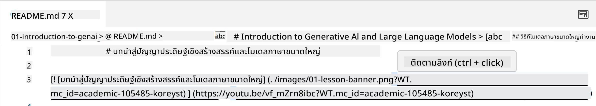
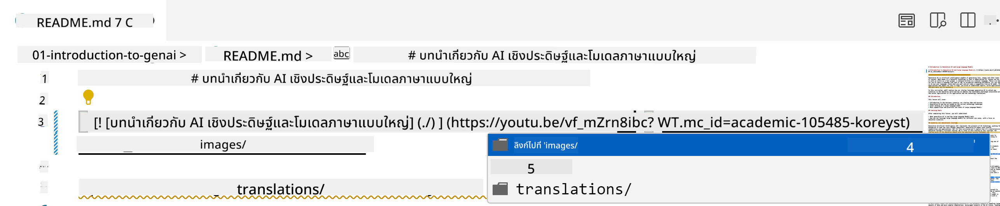
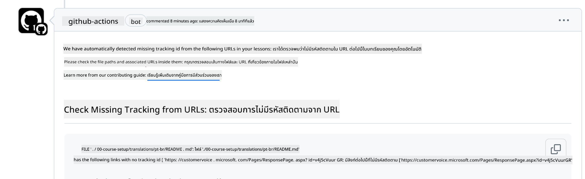
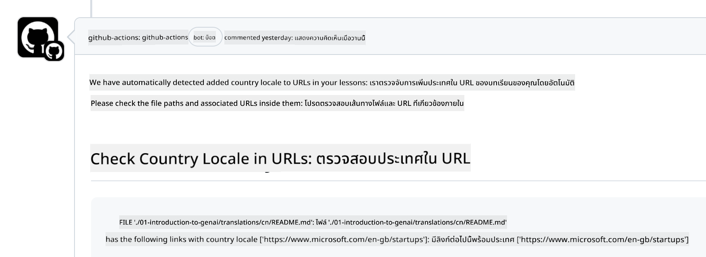

<!--
CO_OP_TRANSLATOR_METADATA:
{
  "original_hash": "57c41f2af71001a2cff9d8eb797cb843",
  "translation_date": "2025-05-19T11:16:49+00:00",
  "source_file": "CONTRIBUTING.md",
  "language_code": "th"
}
-->
# การมีส่วนร่วม

โปรเจกต์นี้ยินดีต้อนรับการมีส่วนร่วมและข้อเสนอแนะ การมีส่วนร่วมส่วนใหญ่ต้องการให้คุณตกลงในข้อตกลงใบอนุญาตผู้มีส่วนร่วม (CLA) เพื่อยืนยันว่าคุณมีสิทธิ์และให้สิทธิ์เราในการใช้การมีส่วนร่วมของคุณ สำหรับรายละเอียดเพิ่มเติม เยี่ยมชม <https://cla.microsoft.com>

> สำคัญ: เมื่อแปลข้อความใน repo นี้ กรุณาอย่าใช้การแปลด้วยเครื่อง เราจะตรวจสอบการแปลผ่านชุมชน ดังนั้นโปรดอาสาแปลเฉพาะภาษาที่คุณเชี่ยวชาญเท่านั้น

เมื่อคุณส่งคำขอ pull request, CLA-bot จะตรวจสอบโดยอัตโนมัติว่าคุณจำเป็นต้องให้ CLA หรือไม่ และจัดการ PR อย่างเหมาะสม (เช่น ติดป้าย, แสดงความคิดเห็น) เพียงแค่ทำตามคำแนะนำที่บอทให้ คุณจะต้องทำเช่นนี้เพียงครั้งเดียวสำหรับทุก repo ที่ใช้ CLA ของเรา

## จรรยาบรรณ

โปรเจกต์นี้ได้นำ [จรรยาบรรณโอเพนซอร์สของ Microsoft](https://opensource.microsoft.com/codeofconduct/?WT.mc_id=academic-105485-koreyst) มาใช้ สำหรับข้อมูลเพิ่มเติม อ่าน [คำถามที่พบบ่อยเกี่ยวกับจรรยาบรรณ](https://opensource.microsoft.com/codeofconduct/faq/?WT.mc_id=academic-105485-koreyst) หรือ ติดต่อ [opencode@microsoft.com](mailto:opencode@microsoft.com) หากมีคำถามหรือความคิดเห็นเพิ่มเติม

## คำถามหรือปัญหา?

โปรดอย่าเปิดประเด็น GitHub สำหรับคำถามสนับสนุนทั่วไป เนื่องจากรายการ GitHub ควรใช้สำหรับคำขอฟีเจอร์และรายงานบั๊ก วิธีนี้จะช่วยให้เราติดตามปัญหาหรือบั๊กจริงจากโค้ดได้ง่ายขึ้นและแยกการสนทนาทั่วไปออกจากโค้ดจริง

## ข้อผิดพลาด, ปัญหา, บั๊ก และการมีส่วนร่วม

เมื่อใดก็ตามที่คุณส่งการเปลี่ยนแปลงใด ๆ ไปยังคลัง Generative AI for Beginners โปรดปฏิบัติตามคำแนะนำเหล่านี้

* โปรดฟอร์คคลังไปยังบัญชีของคุณเองก่อนทำการปรับเปลี่ยน
* อย่ารวมการเปลี่ยนแปลงหลายรายการไว้ในคำขอ pull request เดียว ตัวอย่างเช่น ส่งการแก้ไขบั๊กและการอัปเดตเอกสารแยก PR
* หากคำขอ pull request ของคุณแสดงความขัดแย้งในการรวม ให้แน่ใจว่าได้อัปเดต main ในเครื่องของคุณให้เป็นภาพสะท้อนของสิ่งที่อยู่ในคลังหลักก่อนทำการปรับเปลี่ยน
* หากคุณกำลังส่งการแปล โปรดสร้าง PR หนึ่งรายการสำหรับไฟล์ที่แปลทั้งหมด เนื่องจากเราไม่รับการแปลบางส่วนสำหรับเนื้อหา
* หากคุณกำลังส่งการแก้ไขข้อผิดพลาดหรือเอกสาร คุณสามารถรวมการปรับเปลี่ยนใน PR เดียวเมื่อเหมาะสม

## คำแนะนำทั่วไปในการเขียน

- ตรวจสอบให้แน่ใจว่า URL ทั้งหมดของคุณถูกห่อด้วยวงเล็บสี่เหลี่ยมตามด้วยวงเล็บกลมโดยไม่มีช่องว่างเพิ่มเติมรอบ ๆ หรือภายในพวกเขา ``
- ตรวจสอบให้แน่ใจว่าลิงก์สัมพัทธ์ใด ๆ (เช่น ลิงก์ไปยังไฟล์และโฟลเดอร์อื่น ๆ ในคลัง) เริ่มต้นด้วย `./` หมายถึงไฟล์หรือโฟลเดอร์ที่อยู่ในไดเร็กทอรีทำงานปัจจุบันหรือ `../` หมายถึงไฟล์หรือโฟลเดอร์ที่อยู่ในไดเร็กทอรีทำงานหลัก
- ตรวจสอบให้แน่ใจว่าลิงก์สัมพัทธ์ใด ๆ (เช่น ลิงก์ไปยังไฟล์และโฟลเดอร์อื่น ๆ ในคลัง) มีรหัสติดตาม (เช่น `?` หรือ `&` แล้ว `wt.mc_id=` หรือ `WT.mc_id=`) ที่ท้ายลิงก์
- ตรวจสอบให้แน่ใจว่า URL ใด ๆ จากโดเมนต่อไปนี้ _github.com, microsoft.com, visualstudio.com, aka.ms, และ azure.com_ มีรหัสติดตาม (เช่น `?` หรือ `&` แล้ว `wt.mc_id=` หรือ `WT.mc_id=`) ที่ท้ายลิงก์
- ตรวจสอบให้แน่ใจว่าลิงก์ของคุณไม่มีภาษาท้องถิ่นที่ระบุประเทศในนั้น (เช่น `/en-us/` หรือ `/en/`)
- ตรวจสอบให้แน่ใจว่าภาพทั้งหมดถูกเก็บไว้ในโฟลเดอร์ `./images`
- ตรวจสอบให้แน่ใจว่าภาพมีชื่อที่อธิบายโดยใช้ตัวอักษรภาษาอังกฤษ ตัวเลข และขีดกลางในชื่อของภาพของคุณ

## การทำงานใน GitHub

เมื่อคุณส่งคำขอ pull request จะมีการทำงานสี่ประเภทที่แตกต่างกันเพื่อยืนยันกฎก่อนหน้านี้ เพียงทำตามคำแนะนำที่แสดงที่นี่เพื่อผ่านการตรวจสอบการทำงาน

- [ตรวจสอบเส้นทางสัมพัทธ์ที่เสีย](../..)
- [ตรวจสอบเส้นทางมีการติดตาม](../..)
- [ตรวจสอบ URL มีการติดตาม](../..)
- [ตรวจสอบ URL ไม่มีภาษาท้องถิ่น](../..)

### ตรวจสอบเส้นทางสัมพัทธ์ที่เสีย

การทำงานนี้จะตรวจสอบว่าเส้นทางสัมพัทธ์ในไฟล์ของคุณทำงานได้ โปรเจกต์นี้ถูกปรับใช้กับ GitHub pages ดังนั้นคุณต้องระมัดระวังเมื่อพิมพ์ลิงก์ที่เชื่อมโยงทุกอย่างเข้าด้วยกันเพื่อไม่ให้ใครถูกนำไปยังที่ที่ไม่ถูกต้อง

เพื่อให้แน่ใจว่าลิงก์ของคุณทำงานได้อย่างถูกต้องเพียงใช้ VS code เพื่อตรวจสอบว่า

ตัวอย่างเช่น เมื่อคุณเลื่อนเมาส์ไปที่ลิงก์ใด ๆ ในไฟล์ของคุณ คุณจะได้รับการแจ้งเตือนให้ติดตามลิงก์โดยการกด **ctrl + click**

หากคุณคลิกที่ลิงก์และมันไม่ทำงานในเครื่อง แน่นอนว่ามันจะกระตุ้นการทำงานและจะไม่ทำงานบน GitHub

เพื่อแก้ไขปัญหานี้ ลองพิมพ์ลิงก์โดยใช้ความช่วยเหลือจาก VS code

เมื่อคุณพิมพ์ `./` หรือ `../` VS code จะช่วยให้คุณเลือกจากตัวเลือกที่มีตามที่คุณพิมพ์

ติดตามเส้นทางโดยการคลิกที่ไฟล์หรือโฟลเดอร์ที่ต้องการและคุณจะมั่นใจได้ว่าเส้นทางของคุณไม่เสีย

เมื่อคุณเพิ่มเส้นทางสัมพัทธ์ที่ถูกต้องแล้ว บันทึก และส่งการเปลี่ยนแปลงของคุณ การทำงานจะถูกกระตุ้นอีกครั้งเพื่อตรวจสอบการเปลี่ยนแปลงของคุณ
หากคุณผ่านการตรวจสอบแล้ว คุณก็พร้อมที่จะไป

### ตรวจสอบเส้นทางมีการติดตาม

การทำงานนี้จะตรวจสอบว่าเส้นทางสัมพัทธ์ใด ๆ มีการติดตามในนั้น
โปรเจกต์นี้ถูกปรับใช้กับ GitHub pages ดังนั้นเราจำเป็นต้องติดตามการเคลื่อนไหวระหว่างไฟล์และโฟลเดอร์ต่าง ๆ

เพื่อให้แน่ใจว่าเส้นทางสัมพัทธ์ของคุณมีการติดตามในนั้น เพียงตรวจสอบข้อความต่อไปนี้ `?wt.mc_id=` ที่ท้ายเส้นทาง
หากมันถูกเพิ่มลงในเส้นทางสัมพัทธ์ของคุณแล้ว คุณจะผ่านการตรวจสอบนี้

หากไม่เป็นเช่นนั้น คุณอาจได้รับข้อผิดพลาดต่อไปนี้

เพื่อแก้ไขปัญหานี้ ลองเปิดเส้นทางไฟล์ที่การทำงานได้เน้นและเพิ่มรหัสติดตามที่ท้ายเส้นทางสัมพัทธ์

เมื่อคุณเพิ่มรหัสติดตาม บันทึก และส่งการเปลี่ยนแปลงของคุณ การทำงานจะถูกกระตุ้นอีกครั้งเพื่อตรวจสอบการเปลี่ยนแปลงของคุณ
หากคุณผ่านการตรวจสอบแล้ว คุณก็พร้อมที่จะไป

### ตรวจสอบ URL มีการติดตาม

การทำงานนี้จะตรวจสอบว่า URL ใด ๆ มีการติดตามในนั้น
โปรเจกต์นี้เปิดให้ทุกคน ดังนั้นคุณจำเป็นต้องตรวจสอบให้แน่ใจว่าติดตามการเข้าถึงเพื่อรู้ว่าการจราจรมาจากที่ไหน

เพื่อให้แน่ใจว่า URL ของคุณมีการติดตามในนั้น เพียงตรวจสอบข้อความต่อไปนี้ `?wt.mc_id=` ที่ท้าย URL
หากมันถูกเพิ่มลงใน URL ของคุณแล้ว คุณจะผ่านการตรวจสอบนี้

หากไม่เป็นเช่นนั้น คุณอาจได้รับข้อผิดพลาดต่อไปนี้

เพื่อแก้ไขปัญหานี้ ลองเปิดเส้นทางไฟล์ที่การทำงานได้เน้นและเพิ่มรหัสติดตามที่ท้าย URL

เมื่อคุณเพิ่มรหัสติดตาม บันทึก และส่งการเปลี่ยนแปลงของคุณ การทำงานจะถูกกระตุ้นอีกครั้งเพื่อตรวจสอบการเปลี่ยนแปลงของคุณ
หากคุณผ่านการตรวจสอบแล้ว คุณก็พร้อมที่จะไป

### ตรวจสอบ URL ไม่มีภาษาท้องถิ่น

การทำงานนี้จะตรวจสอบว่า URL ใด ๆ ไม่มีภาษาท้องถิ่นที่ระบุประเทศในนั้น
โปรเจกต์นี้เปิดให้ทุกคนทั่วโลก ดังนั้นคุณจำเป็นต้องตรวจสอบให้แน่ใจว่าไม่ได้รวมภาษาท้องถิ่นของประเทศคุณใน URL

เพื่อให้แน่ใจว่า URL ของคุณไม่มีภาษาท้องถิ่นในนั้น เพียงตรวจสอบข้อความต่อไปนี้ `/en-us/` หรือ `/en/` หรือภาษาท้องถิ่นอื่น ๆ ที่ใดก็ได้ใน URL
หากมันไม่ปรากฏใน URL ของคุณแล้ว คุณจะผ่านการตรวจสอบนี้

หากไม่เป็นเช่นนั้น คุณอาจได้รับข้อผิดพลาดต่อไปนี้

เพื่อแก้ไขปัญหานี้ ลองเปิดเส้นทางไฟล์ที่การทำงานได้เน้นและลบภาษาท้องถิ่นของประเทศออกจาก URL

เมื่อคุณลบภาษาท้องถิ่นของประเทศ บันทึก และส่งการเปลี่ยนแปลงของคุณ การทำงานจะถูกกระตุ้นอีกครั้งเพื่อตรวจสอบการเปลี่ยนแปลงของคุณ
หากคุณผ่านการตรวจสอบแล้ว คุณก็พร้อมที่จะไป

ยินดีด้วย! เราจะติดต่อกลับหาคุณโดยเร็วที่สุดพร้อมข้อเสนอแนะเกี่ยวกับการมีส่วนร่วมของคุณ

**ข้อจำกัดความรับผิดชอบ**:  
เอกสารนี้ได้รับการแปลโดยใช้บริการแปลภาษา AI [Co-op Translator](https://github.com/Azure/co-op-translator) แม้ว่าเราจะพยายามให้การแปลมีความถูกต้อง แต่โปรดทราบว่าการแปลอัตโนมัติอาจมีข้อผิดพลาดหรือความไม่ถูกต้อง เอกสารต้นฉบับในภาษาดั้งเดิมควรถือเป็นแหล่งข้อมูลที่เชื่อถือได้ สำหรับข้อมูลที่สำคัญ ขอแนะนำให้ใช้การแปลโดยมนุษย์มืออาชีพ เราจะไม่รับผิดชอบต่อความเข้าใจผิดหรือการตีความที่ผิดพลาดซึ่งเกิดจากการใช้การแปลนี้