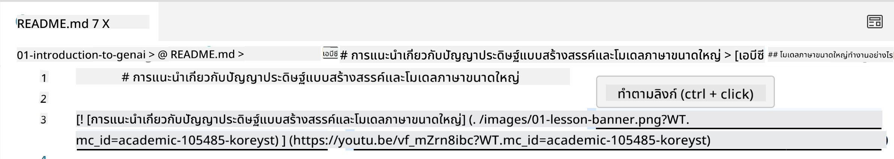
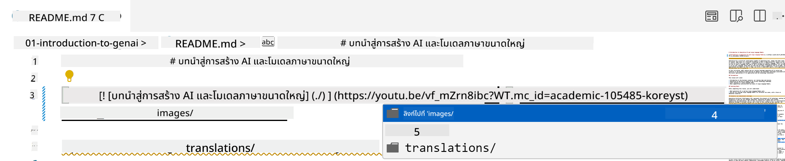
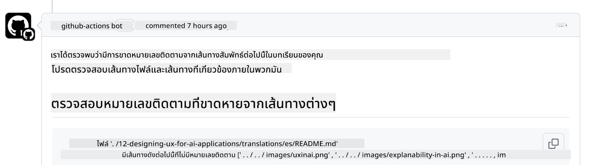
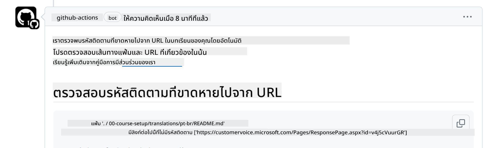
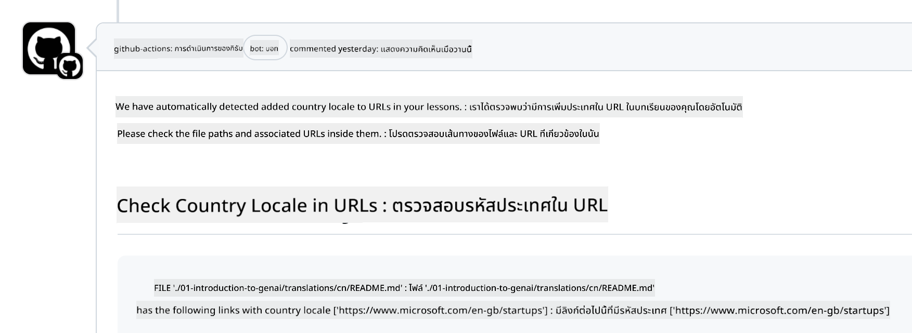

<!--
CO_OP_TRANSLATOR_METADATA:
{
  "original_hash": "57c41f2af71001a2cff9d8eb797cb843",
  "translation_date": "2025-06-25T07:11:20+00:00",
  "source_file": "CONTRIBUTING.md",
  "language_code": "th"
}
-->
# การมีส่วนร่วม

โครงการนี้ยินดีรับการมีส่วนร่วมและข้อเสนอแนะ การมีส่วนร่วมส่วนใหญ่จะต้องให้คุณตกลงในข้อตกลงสิทธิ์ผู้ร่วมให้ข้อมูล (CLA) เพื่อยืนยันว่าคุณมีสิทธิ์และยอมให้เราใช้การมีส่วนร่วมของคุณ สำหรับรายละเอียดเพิ่มเติม โปรดเยี่ยมชม <https://cla.microsoft.com>.

> สำคัญ: เมื่อแปลข้อความใน repo นี้ โปรดตรวจสอบให้แน่ใจว่าคุณไม่ได้ใช้การแปลด้วยเครื่อง เราจะตรวจสอบการแปลผ่านชุมชน ดังนั้นโปรดเป็นอาสาสมัครในการแปลภาษาที่คุณมีความชำนาญเท่านั้น

เมื่อคุณส่ง pull request, CLA-bot จะตรวจสอบโดยอัตโนมัติว่าคุณจำเป็นต้องให้ CLA หรือไม่ และตกแต่ง PR อย่างเหมาะสม (เช่น ป้ายกำกับ, ความคิดเห็น) เพียงทำตามคำแนะนำที่บอทให้ คุณจะต้องทำสิ่งนี้เพียงครั้งเดียวในทุก repository ที่ใช้ CLA ของเรา

## จรรยาบรรณ

โครงการนี้ได้ยอมรับ [จรรยาบรรณโอเพ่นซอร์สของ Microsoft](https://opensource.microsoft.com/codeofconduct/?WT.mc_id=academic-105485-koreyst). สำหรับข้อมูลเพิ่มเติม อ่าน [คำถามที่พบบ่อยเกี่ยวกับจรรยาบรรณ](https://opensource.microsoft.com/codeofconduct/faq/?WT.mc_id=academic-105485-koreyst) หรือ ติดต่อ [opencode@microsoft.com](mailto:opencode@microsoft.com) หากมีคำถามหรือความคิดเห็นเพิ่มเติม

## คำถามหรือปัญหา?

โปรดอย่าเปิด issue บน GitHub สำหรับคำถามการสนับสนุนทั่วไป เนื่องจากรายการ GitHub ควรใช้สำหรับคำขอฟีเจอร์และรายงานบั๊ก ด้วยวิธีนี้เราสามารถติดตามปัญหาหรือบั๊กจริงจากโค้ดได้ง่ายขึ้น และแยกการสนทนาทั่วไปออกจากโค้ดจริง

## ข้อผิดพลาด, ปัญหา, บั๊ก และการมีส่วนร่วม

เมื่อใดก็ตามที่คุณส่งการเปลี่ยนแปลงใดๆ ไปยัง repository Generative AI for Beginners โปรดทำตามคำแนะนำเหล่านี้

* ให้ fork repository ไปยังบัญชีของคุณเองก่อนทำการแก้ไข
* อย่ารวมการเปลี่ยนแปลงหลายรายการใน pull request เดียว ตัวอย่างเช่น ส่งการแก้ไขบั๊กและการอัปเดตเอกสารแยกกันใน PR ต่างหาก
* หาก pull request ของคุณแสดงความขัดแย้งในการรวม, ตรวจสอบให้แน่ใจว่าได้อัปเดต local main ของคุณให้เป็นภาพสะท้อนของสิ่งที่อยู่ใน repository หลักก่อนทำการแก้ไข
* หากคุณกำลังส่งการแปล โปรดสร้าง PR หนึ่งสำหรับไฟล์ที่แปลทั้งหมดเนื่องจากเราไม่ยอมรับการแปลบางส่วนสำหรับเนื้อหา
* หากคุณกำลังส่งการแก้ไขข้อผิดพลาดหรือเอกสาร, คุณสามารถรวมการแก้ไขเป็น PR เดียวเมื่อเหมาะสม

## คำแนะนำทั่วไปในการเขียน

- ตรวจสอบให้แน่ใจว่า URL ทั้งหมดของคุณอยู่ในวงเล็บเหลี่ยมตามด้วยวงเล็บกลมโดยไม่มีช่องว่างเพิ่มเติมรอบๆ หรือภายใน ``
- ตรวจสอบให้แน่ใจว่าลิงก์สัมพัทธ์ใดๆ (เช่น ลิงก์ไปยังไฟล์และโฟลเดอร์อื่นๆ ใน repository) เริ่มต้นด้วย `./` หมายถึงไฟล์หรือโฟลเดอร์ที่อยู่ในไดเรกทอรีการทำงานปัจจุบัน หรือ `../` หมายถึงไฟล์หรือโฟลเดอร์ที่อยู่ในไดเรกทอรีการทำงานของแม่
- ตรวจสอบให้แน่ใจว่าลิงก์สัมพัทธ์ใดๆ (เช่น ลิงก์ไปยังไฟล์และโฟลเดอร์อื่นๆ ใน repository) มี ID ติดตาม (เช่น `?` หรือ `&` จากนั้น `wt.mc_id=` หรือ `WT.mc_id=`) ที่ท้ายของมัน
- ตรวจสอบให้แน่ใจว่า URL จากโดเมนต่อไปนี้ _github.com, microsoft.com, visualstudio.com, aka.ms, และ azure.com_ มี ID ติดตาม (เช่น `?` หรือ `&` จากนั้น `wt.mc_id=` หรือ `WT.mc_id=`) ที่ท้ายของมัน
- ตรวจสอบให้แน่ใจว่าลิงก์ของคุณไม่มี locale เฉพาะประเทศในนั้น (เช่น `/en-us/` หรือ `/en/`)
- ตรวจสอบให้แน่ใจว่าภาพทั้งหมดถูกจัดเก็บในโฟลเดอร์ `./images`
- ตรวจสอบให้แน่ใจว่าภาพมีชื่อที่อธิบายโดยใช้ตัวอักษรภาษาอังกฤษ, ตัวเลข, และขีดในชื่อของภาพ

## การทำงานของ GitHub

เมื่อคุณส่ง pull request, สี่การทำงานที่แตกต่างกันจะถูกเรียกใช้เพื่อยืนยันกฎก่อนหน้านี้
เพียงทำตามคำแนะนำที่ระบุไว้ที่นี่เพื่อผ่านการตรวจสอบการทำงาน

- [ตรวจสอบเส้นทางสัมพัทธ์ที่เสียหาย](../..)
- [ตรวจสอบเส้นทางมีการติดตาม](../..)
- [ตรวจสอบ URL มีการติดตาม](../..)
- [ตรวจสอบ URL ไม่มี locale](../..)

### ตรวจสอบเส้นทางสัมพัทธ์ที่เสียหาย

การทำงานนี้ตรวจสอบว่าเส้นทางสัมพัทธ์ใดๆ ในไฟล์ของคุณทำงานอยู่หรือไม่
repository นี้ถูกปรับใช้ไปยัง GitHub pages ดังนั้นคุณต้องระมัดระวังเมื่อพิมพ์ลิงก์ที่เชื่อมโยงทุกอย่างเข้าด้วยกันเพื่อไม่ให้พาใครไปผิดที่

เพื่อให้แน่ใจว่าลิงก์ของคุณทำงานได้อย่างถูกต้อง เพียงใช้ VS code เพื่อตรวจสอบ

ตัวอย่างเช่น เมื่อคุณเลื่อนเมาส์ไปที่ลิงก์ใดๆ ในไฟล์ของคุณ คุณจะได้รับการแจ้งเตือนให้ติดตามลิงก์โดยการกด **ctrl + click**

หากคุณคลิกที่ลิงก์และมันไม่ทำงานในเครื่อง แน่นอนมันจะเรียกการทำงานและจะไม่ทำงานบน GitHub

เพื่อแก้ไขปัญหานี้ ลองพิมพ์ลิงก์ด้วยความช่วยเหลือจาก VS code

เมื่อคุณพิมพ์ `./` หรือ `../` VS code จะให้คุณเลือกจากตัวเลือกที่มีอยู่ตามสิ่งที่คุณพิมพ์

ติดตามเส้นทางโดยการคลิกที่ไฟล์หรือโฟลเดอร์ที่ต้องการและคุณจะมั่นใจว่าเส้นทางของคุณไม่เสียหาย

เมื่อคุณเพิ่มเส้นทางสัมพัทธ์ที่ถูกต้อง บันทึก และส่งการเปลี่ยนแปลงของคุณ การทำงานจะถูกเรียกใช้ใหม่เพื่อยืนยันการเปลี่ยนแปลงของคุณ
หากคุณผ่านการตรวจสอบแล้ว คุณก็พร้อมที่จะไป

### ตรวจสอบเส้นทางมีการติดตาม

การทำงานนี้ตรวจสอบว่าเส้นทางสัมพัทธ์ใดๆ มีการติดตามอยู่หรือไม่
repository นี้ถูกปรับใช้ไปยัง GitHub pages ดังนั้นเราต้องติดตามการเคลื่อนไหวระหว่างไฟล์และโฟลเดอร์ต่างๆ

เพื่อให้แน่ใจว่าเส้นทางสัมพัทธ์ของคุณมีการติดตามในนั้น เพียงตรวจสอบข้อความต่อไปนี้ `?wt.mc_id=` ที่ท้ายของเส้นทาง
หากมันถูกเพิ่มเข้าไปในเส้นทางสัมพัทธ์ของคุณแล้ว คุณจะผ่านการตรวจสอบนี้

หากไม่ คุณอาจได้รับข้อผิดพลาดต่อไปนี้

เพื่อแก้ไขปัญหานี้ ลองเปิดเส้นทางไฟล์ที่การทำงานเน้นและเพิ่ม ID ติดตามไปที่ท้ายของเส้นทางสัมพัทธ์

เมื่อคุณเพิ่ม ID ติดตาม, บันทึก และส่งการเปลี่ยนแปลงของคุณ การทำงานจะถูกเรียกใช้ใหม่เพื่อยืนยันการเปลี่ยนแปลงของคุณ
หากคุณผ่านการตรวจสอบแล้ว คุณก็พร้อมที่จะไป

### ตรวจสอบ URL มีการติดตาม

การทำงานนี้ตรวจสอบว่า URL ใดๆ มีการติดตามอยู่หรือไม่
repository นี้สามารถเข้าถึงได้โดยทุกคน ดังนั้นคุณต้องตรวจสอบให้แน่ใจว่ามีการติดตามการเข้าถึงเพื่อรู้ว่าการจราจรมาจากที่ใด

เพื่อให้แน่ใจว่า URL ของคุณมีการติดตามในนั้น เพียงตรวจสอบข้อความต่อไปนี้ `?wt.mc_id=` ที่ท้ายของ URL
หากมันถูกเพิ่มเข้าไปใน URL ของคุณแล้ว คุณจะผ่านการตรวจสอบนี้

หากไม่ คุณอาจได้รับข้อผิดพลาดต่อไปนี้

เพื่อแก้ไขปัญหานี้ ลองเปิดเส้นทางไฟล์ที่การทำงานเน้นและเพิ่ม ID ติดตามไปที่ท้ายของ URL

เมื่อคุณเพิ่ม ID ติดตาม, บันทึก และส่งการเปลี่ยนแปลงของคุณ การทำงานจะถูกเรียกใช้ใหม่เพื่อยืนยันการเปลี่ยนแปลงของคุณ
หากคุณผ่านการตรวจสอบแล้ว คุณก็พร้อมที่จะไป

### ตรวจสอบ URL ไม่มี locale

การทำงานนี้ตรวจสอบว่า URL ใดๆ ไม่มี locale เฉพาะประเทศในนั้น
repository นี้สามารถเข้าถึงได้โดยทุกคนทั่วโลก ดังนั้นคุณต้องตรวจสอบให้แน่ใจว่าไม่ได้รวม locale ของประเทศของคุณใน URL

เพื่อให้แน่ใจว่า URL ของคุณไม่มี locale ของประเทศในนั้น เพียงตรวจสอบข้อความต่อไปนี้ `/en-us/` หรือ `/en/` หรือ locale ภาษาอื่นใดใน URL
หากมันไม่ปรากฏใน URL ของคุณแล้ว คุณจะผ่านการตรวจสอบนี้

หากไม่ คุณอาจได้รับข้อผิดพลาดต่อไปนี้

เพื่อแก้ไขปัญหานี้ ลองเปิดเส้นทางไฟล์ที่การทำงานเน้นและลบ locale ของประเทศออกจาก URL

เมื่อคุณลบ locale ของประเทศ, บันทึก และส่งการเปลี่ยนแปลงของคุณ การทำงานจะถูกเรียกใช้ใหม่เพื่อยืนยันการเปลี่ยนแปลงของคุณ
หากคุณผ่านการตรวจสอบแล้ว คุณก็พร้อมที่จะไป

ขอแสดงความยินดี! เราจะกลับมาติดต่อคุณโดยเร็วที่สุดพร้อมความคิดเห็นเกี่ยวกับการมีส่วนร่วมของคุณ

**ข้อจำกัดความรับผิดชอบ**:  
เอกสารนี้ได้รับการแปลโดยใช้บริการแปลภาษา AI [Co-op Translator](https://github.com/Azure/co-op-translator) แม้ว่าเราจะพยายามให้มีความถูกต้อง แต่โปรดทราบว่าการแปลอัตโนมัติอาจมีข้อผิดพลาดหรือความไม่ถูกต้องเกิดขึ้น เอกสารต้นฉบับในภาษาของมันเองควรถือเป็นแหล่งข้อมูลที่เชื่อถือได้ สำหรับข้อมูลที่สำคัญ แนะนำให้ใช้การแปลโดยมนุษย์มืออาชีพ เราไม่รับผิดชอบต่อความเข้าใจผิดหรือการตีความผิดที่เกิดจากการใช้การแปลนี้