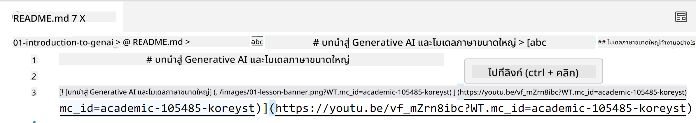
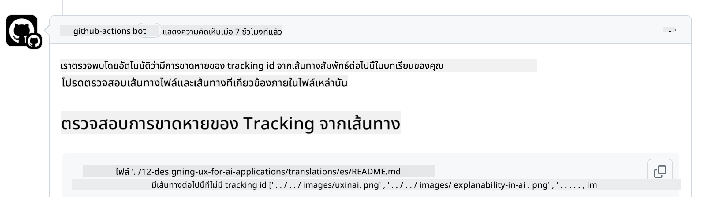
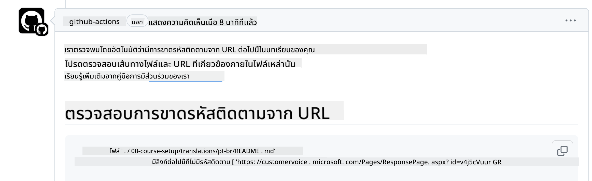
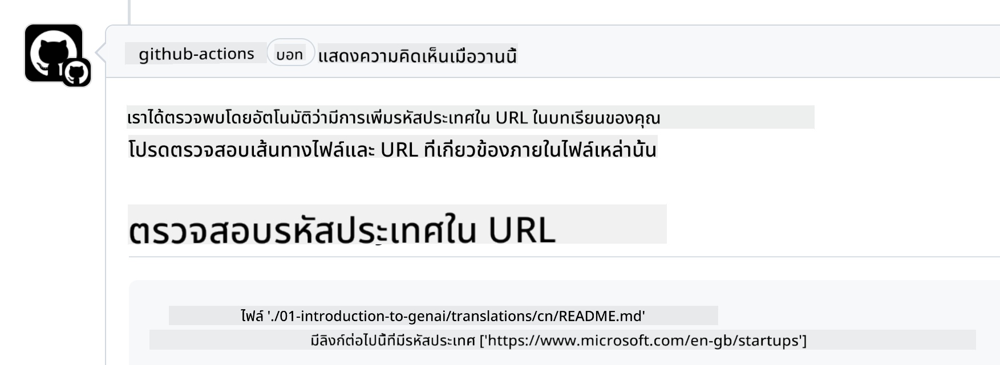

<!--
CO_OP_TRANSLATOR_METADATA:
{
  "original_hash": "57c41f2af71001a2cff9d8eb797cb843",
  "translation_date": "2025-07-09T06:07:21+00:00",
  "source_file": "CONTRIBUTING.md",
  "language_code": "th"
}
-->
# การมีส่วนร่วม

โครงการนี้ยินดีต้อนรับการมีส่วนร่วมและข้อเสนอแนะ ส่วนใหญ่การมีส่วนร่วมจะต้องให้คุณ
ยอมรับ Contributor License Agreement (CLA) ซึ่งเป็นข้อตกลงที่ระบุว่าคุณมีสิทธิ์และอนุญาตให้เราใช้ผลงานของคุณ สำหรับรายละเอียดเพิ่มเติม โปรดเยี่ยมชม
<https://cla.microsoft.com>.

> Important: เมื่อแปลข้อความในรีโปนี้ กรุณาอย่าใช้การแปลด้วยเครื่อง เราจะตรวจสอบการแปลผ่านชุมชน ดังนั้นโปรดสมัครใจแปลเฉพาะภาษาที่คุณมีความชำนาญเท่านั้น

เมื่อคุณส่ง pull request ระบบ CLA-bot จะตรวจสอบโดยอัตโนมัติว่าคุณจำเป็นต้อง
ส่ง CLA หรือไม่ และจะติดป้ายหรือแสดงความคิดเห็นใน PR ตามเหมาะสม เพียงแค่ทำตาม
คำแนะนำที่บอทให้มา คุณจะต้องทำเพียงครั้งเดียวสำหรับทุกรีโปที่ใช้ CLA ของเรา

## จรรยาบรรณ

โครงการนี้ได้นำ [Microsoft Open Source Code of Conduct](https://opensource.microsoft.com/codeofconduct/?WT.mc_id=academic-105485-koreyst) มาใช้
สำหรับข้อมูลเพิ่มเติม โปรดอ่าน [คำถามที่พบบ่อยเกี่ยวกับจรรยาบรรณ](https://opensource.microsoft.com/codeofconduct/faq/?WT.mc_id=academic-105485-koreyst) หรือ ติดต่อ [opencode@microsoft.com](mailto:opencode@microsoft.com) หากมีคำถามหรือข้อคิดเห็นเพิ่มเติม

## มีคำถามหรือปัญหา?

กรุณาอย่าเปิด issue บน GitHub สำหรับคำถามทั่วไปเกี่ยวกับการสนับสนุน เนื่องจากรายการ GitHub ควรใช้สำหรับคำขอฟีเจอร์และรายงานบั๊กเท่านั้น ด้วยวิธีนี้เราจะสามารถติดตามปัญหาหรือบั๊กที่แท้จริงจากโค้ดได้ง่ายขึ้น และแยกการสนทนาทั่วไปออกจากโค้ดจริง

## การแก้ไขคำผิด ปัญหา บั๊ก และการมีส่วนร่วม

เมื่อใดก็ตามที่คุณส่งการเปลี่ยนแปลงใด ๆ ไปยังรีโป Generative AI for Beginners กรุณาปฏิบัติตามคำแนะนำเหล่านี้

* ควร fork รีโปไปยังบัญชีของคุณก่อนทำการแก้ไข
* อย่ารวมหลายการเปลี่ยนแปลงใน pull request เดียว เช่น ส่งการแก้บั๊กและอัปเดตเอกสารแยกกันเป็น PR ต่างหาก
* หาก pull request ของคุณแสดงความขัดแย้งในการรวมโค้ด ให้แน่ใจว่าได้อัปเดต main branch ในเครื่องของคุณให้ตรงกับ main ของรีโปหลักก่อนทำการแก้ไข
* หากคุณส่งการแปล กรุณาสร้าง PR เดียวสำหรับไฟล์ที่แปลทั้งหมด เพราะเราไม่รับการแปลบางส่วนของเนื้อหา
* หากคุณส่งการแก้ไขคำผิดหรือเอกสาร คุณสามารถรวมการแก้ไขใน PR เดียวได้ถ้าเหมาะสม

## แนวทางทั่วไปในการเขียน

- ตรวจสอบให้แน่ใจว่า URL ทั้งหมดของคุณถูกครอบด้วยวงเล็บเหลี่ยมตามด้วยวงเล็บปีกกาโดยไม่มีช่องว่างเกิน ``
- ตรวจสอบให้แน่ใจว่า ลิงก์แบบสัมพัทธ์ (เช่น ลิงก์ไปยังไฟล์หรือโฟลเดอร์อื่นในรีโป) เริ่มต้นด้วย `./` ซึ่งหมายถึงไฟล์หรือโฟลเดอร์ในไดเรกทอรีทำงานปัจจุบัน หรือ `../` ซึ่งหมายถึงไฟล์หรือโฟลเดอร์ในไดเรกทอรีแม่
- ตรวจสอบให้แน่ใจว่าลิงก์แบบสัมพัทธ์มี tracking ID (เช่น `?` หรือ `&` ตามด้วย `wt.mc_id=` หรือ `WT.mc_id=`) ต่อท้าย
- ตรวจสอบให้แน่ใจว่า URL จากโดเมน _github.com, microsoft.com, visualstudio.com, aka.ms, และ azure.com_ มี tracking ID ต่อท้าย
- ตรวจสอบให้แน่ใจว่าลิงก์ของคุณไม่มี locale เฉพาะประเทศ (เช่น `/en-us/` หรือ `/en/`)
- ตรวจสอบให้แน่ใจว่ารูปภาพทั้งหมดถูกเก็บไว้ในโฟลเดอร์ `./images`
- ตรวจสอบให้แน่ใจว่ารูปภาพมีชื่อที่บรรยายได้โดยใช้ตัวอักษรภาษาอังกฤษ ตัวเลข และขีดกลางในชื่อไฟล์

## GitHub Workflows

เมื่อคุณส่ง pull request จะมี workflow สี่ตัวทำงานเพื่อตรวจสอบกฎข้างต้น
เพียงแค่ทำตามคำแนะนำที่ระบุไว้ที่นี่เพื่อผ่านการตรวจสอบ workflow

- [Check Broken Relative Paths](../..)
- [Check Paths Have Tracking](../..)
- [Check URLs Have Tracking](../..)
- [Check URLs Don't Have Locale](../..)

### Check Broken Relative Paths

workflow นี้จะตรวจสอบว่าเส้นทางสัมพัทธ์ในไฟล์ของคุณใช้งานได้จริง
รีโปนี้ถูกเผยแพร่บน GitHub pages ดังนั้นคุณต้องระมัดระวังเมื่อพิมพ์ลิงก์เพื่อไม่ให้ลิงก์ไปยังที่ผิด

เพื่อให้แน่ใจว่าลิงก์ของคุณใช้งานได้ ให้ใช้ VS code ตรวจสอบ

ตัวอย่างเช่น เมื่อคุณวางเมาส์เหนือใด ๆ ในไฟล์ คุณจะเห็นคำสั่งให้กด **ctrl + click** เพื่อติดตามลิงก์

ถ้าคลิกลิงก์แล้วไม่ทำงานในเครื่องคุณ ก็แน่นอนว่าจะทำงานไม่ได้บน GitHub

เพื่อแก้ไขปัญหานี้ ให้ลองพิมพ์ลิงก์โดยใช้ความช่วยเหลือของ VS code

เมื่อคุณพิมพ์ `./` หรือ `../` VS code จะเสนอทางเลือกให้คุณเลือกตามที่คุณพิมพ์

ติดตามเส้นทางโดยคลิกที่ไฟล์หรือโฟลเดอร์ที่ต้องการ แล้วคุณจะมั่นใจได้ว่าเส้นทางของคุณไม่เสียหาย

เมื่อคุณเพิ่มเส้นทางสัมพัทธ์ที่ถูกต้อง บันทึก และ push การเปลี่ยนแปลง workflow จะทำงานอีกครั้งเพื่อตรวจสอบ
ถ้าคุณผ่านการตรวจสอบก็พร้อมใช้งานได้เลย

### Check Paths Have Tracking

workflow นี้จะตรวจสอบว่าเส้นทางสัมพัทธ์มี tracking อยู่ในนั้น
รีโปนี้เผยแพร่บน GitHub pages ดังนั้นเราต้องติดตามการเคลื่อนไหวระหว่างไฟล์และโฟลเดอร์ต่าง ๆ

เพื่อให้แน่ใจว่าเส้นทางสัมพัทธ์ของคุณมี tracking ให้ตรวจสอบว่ามีข้อความ `?wt.mc_id=` ต่อท้ายเส้นทางหรือไม่
ถ้ามี คุณจะผ่านการตรวจสอบนี้

ถ้าไม่มี คุณอาจได้รับข้อผิดพลาดดังนี้

เพื่อแก้ไขปัญหานี้ ให้เปิดไฟล์ที่ workflow แจ้งและเพิ่ม tracking ID ต่อท้ายเส้นทางสัมพัทธ์

เมื่อเพิ่ม tracking ID แล้ว บันทึก และ push การเปลี่ยนแปลง workflow จะทำงานอีกครั้งเพื่อตรวจสอบ
ถ้าคุณผ่านการตรวจสอบก็พร้อมใช้งานได้เลย

### Check URLs Have Tracking

workflow นี้จะตรวจสอบว่า URL เว็บมี tracking อยู่ในนั้น
รีโปนี้เปิดให้ทุกคนเข้าถึงได้ ดังนั้นคุณต้องแน่ใจว่ามีการติดตามการเข้าถึงเพื่อทราบว่าการเข้าชมมาจากที่ใด

เพื่อให้แน่ใจว่า URL ของคุณมี tracking ให้ตรวจสอบว่ามีข้อความ `?wt.mc_id=` ต่อท้าย URL หรือไม่
ถ้ามี คุณจะผ่านการตรวจสอบนี้

ถ้าไม่มี คุณอาจได้รับข้อผิดพลาดดังนี้

เพื่อแก้ไขปัญหานี้ ให้เปิดไฟล์ที่ workflow แจ้งและเพิ่ม tracking ID ต่อท้าย URL

เมื่อเพิ่ม tracking ID แล้ว บันทึก และ push การเปลี่ยนแปลง workflow จะทำงานอีกครั้งเพื่อตรวจสอบ
ถ้าคุณผ่านการตรวจสอบก็พร้อมใช้งานได้เลย

### Check URLs Don't Have Locale

workflow นี้จะตรวจสอบว่า URL เว็บไม่มี locale เฉพาะประเทศอยู่ในนั้น
รีโปนี้เปิดให้ทุกคนทั่วโลกเข้าถึงได้ ดังนั้นคุณต้องแน่ใจว่าไม่ใส่ locale ของประเทศคุณใน URL

เพื่อให้แน่ใจว่า URL ของคุณไม่มี locale ของประเทศ ให้ตรวจสอบว่ามีข้อความ `/en-us/` หรือ `/en/` หรือ locale ภาษาอื่น ๆ อยู่ใน URL หรือไม่
ถ้าไม่มี คุณจะผ่านการตรวจสอบนี้

ถ้ามี คุณอาจได้รับข้อผิดพลาดดังนี้

เพื่อแก้ไขปัญหานี้ ให้เปิดไฟล์ที่ workflow แจ้งและลบ locale ของประเทศออกจาก URL

เมื่อคุณลบ locale ของประเทศแล้ว บันทึก และ push การเปลี่ยนแปลง workflow จะทำงานอีกครั้งเพื่อตรวจสอบ
ถ้าคุณผ่านการตรวจสอบก็พร้อมใช้งานได้เลย

ขอแสดงความยินดี! เราจะติดต่อกลับโดยเร็วที่สุดพร้อมข้อเสนอแนะเกี่ยวกับการมีส่วนร่วมของคุณ

**ข้อจำกัดความรับผิดชอบ**:  
เอกสารนี้ได้รับการแปลโดยใช้บริการแปลภาษาอัตโนมัติ [Co-op Translator](https://github.com/Azure/co-op-translator) แม้เราจะพยายามให้ความถูกต้องสูงสุด แต่โปรดทราบว่าการแปลอัตโนมัติอาจมีข้อผิดพลาดหรือความไม่ถูกต้อง เอกสารต้นฉบับในภาษาต้นทางถือเป็นแหล่งข้อมูลที่เชื่อถือได้ สำหรับข้อมูลที่สำคัญ ขอแนะนำให้ใช้บริการแปลโดยผู้เชี่ยวชาญมนุษย์ เราไม่รับผิดชอบต่อความเข้าใจผิดหรือการตีความผิดใด ๆ ที่เกิดจากการใช้การแปลนี้