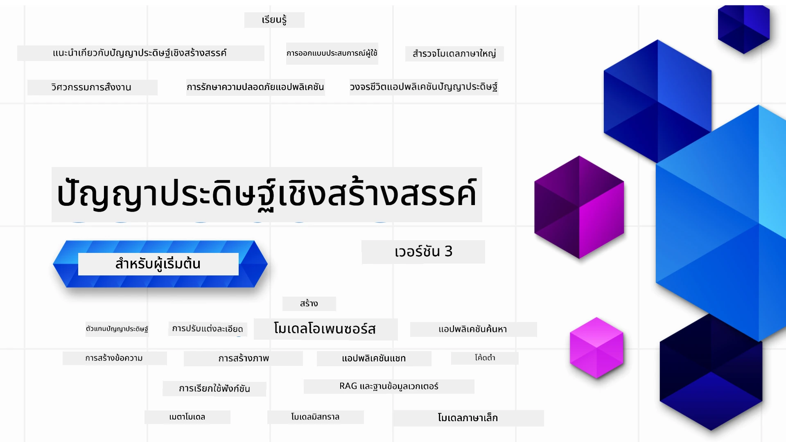

### 21 บทเรียนสอนทุกสิ่งที่คุณต้องรู้เพื่อเริ่มต้นสร้างแอปพลิเคชันปัญญาประดิษฐ์เชิงสร้างสรรค์

[](https://github.com/microsoft/Generative-AI-For-Beginners/blob/master/LICENSE?WT.mc_id=academic-105485-koreyst)
[](https://GitHub.com/microsoft/Generative-AI-For-Beginners/graphs/contributors/?WT.mc_id=academic-105485-koreyst)
[](https://GitHub.com/microsoft/Generative-AI-For-Beginners/issues/?WT.mc_id=academic-105485-koreyst)
[](https://GitHub.com/microsoft/Generative-AI-For-Beginners/pulls/?WT.mc_id=academic-105485-koreyst)
[](http://makeapullrequest.com?WT.mc_id=academic-105485-koreyst)

[](https://GitHub.com/microsoft/Generative-AI-For-Beginners/watchers/?WT.mc_id=academic-105485-koreyst)
[](https://GitHub.com/microsoft/Generative-AI-For-Beginners/network/?WT.mc_id=academic-105485-koreyst)
[](https://GitHub.com/microsoft/Generative-AI-For-Beginners/stargazers/?WT.mc_id=academic-105485-koreyst)

[](https://discord.gg/nTYy5BXMWG)

### 🌐 รองรับหลายภาษา

#### รองรับผ่าน GitHub Action (อัตโนมัติและอัปเดตอยู่เสมอ)

<!-- CO-OP TRANSLATOR LANGUAGES TABLE START -->
[Arabic](../ar/README.md) | [Bengali](../bn/README.md) | [Bulgarian](../bg/README.md) | [Burmese (Myanmar)](../my/README.md) | [Chinese (Simplified)](../zh-CN/README.md) | [Chinese (Traditional, Hong Kong)](../zh-HK/README.md) | [Chinese (Traditional, Macau)](../zh-MO/README.md) | [Chinese (Traditional, Taiwan)](../zh-TW/README.md) | [Croatian](../hr/README.md) | [Czech](../cs/README.md) | [Danish](../da/README.md) | [Dutch](../nl/README.md) | [Estonian](../et/README.md) | [Finnish](../fi/README.md) | [French](../fr/README.md) | [German](../de/README.md) | [Greek](../el/README.md) | [Hebrew](../he/README.md) | [Hindi](../hi/README.md) | [Hungarian](../hu/README.md) | [Indonesian](../id/README.md) | [Italian](../it/README.md) | [Japanese](../ja/README.md) | [Kannada](../kn/README.md) | [Korean](../ko/README.md) | [Lithuanian](../lt/README.md) | [Malay](../ms/README.md) | [Malayalam](../ml/README.md) | [Marathi](../mr/README.md) | [Nepali](../ne/README.md) | [Nigerian Pidgin](../pcm/README.md) | [Norwegian](../no/README.md) | [Persian (Farsi)](../fa/README.md) | [Polish](../pl/README.md) | [Portuguese (Brazil)](../pt-BR/README.md) | [Portuguese (Portugal)](../pt-PT/README.md) | [Punjabi (Gurmukhi)](../pa/README.md) | [Romanian](../ro/README.md) | [Russian](../ru/README.md) | [Serbian (Cyrillic)](../sr/README.md) | [Slovak](../sk/README.md) | [Slovenian](../sl/README.md) | [Spanish](../es/README.md) | [Swahili](../sw/README.md) | [Swedish](../sv/README.md) | [Tagalog (Filipino)](../tl/README.md) | [Tamil](../ta/README.md) | [Telugu](../te/README.md) | [Thai](./README.md) | [Turkish](../tr/README.md) | [Ukrainian](../uk/README.md) | [Urdu](../ur/README.md) | [Vietnamese](../vi/README.md)

> **ต้องการโคลนแบบพื้นฐานในเครื่องไหม?**
>
> รีโพสิตอรี่นี้มีการแปลภาษาเกิน 50 ภาษา ซึ่งเพิ่มขนาดการดาวน์โหลดอย่างมาก เพื่อโคลนโดยไม่รวมการแปลภาษา ใช้ sparse checkout:
>
> **Bash / macOS / Linux:**
> ```bash
> git clone --filter=blob:none --sparse https://github.com/microsoft/generative-ai-for-beginners.git
> cd generative-ai-for-beginners
> git sparse-checkout set --no-cone '/*' '!translations' '!translated_images'
> ```
>
> **CMD (Windows):**
> ```cmd
> git clone --filter=blob:none --sparse https://github.com/microsoft/generative-ai-for-beginners.git
> cd generative-ai-for-beginners
> git sparse-checkout set --no-cone "/*" "!translations" "!translated_images"
> ```
>
> นี้จะให้คุณทุกอย่างที่ต้องใช้ในการทำคอร์สได้โดยดาวน์โหลดเร็วขึ้นมาก
<!-- CO-OP TRANSLATOR LANGUAGES TABLE END -->

# ปัญญาประดิษฐ์เชิงสร้างสรรค์สำหรับผู้เริ่มต้น (เวอร์ชัน 3) - คอร์สเรียน

เรียนรู้พื้นฐานการสร้างแอปพลิเคชันปัญญาประดิษฐ์เชิงสร้างสรรค์ผ่านคอร์สครอบคลุม 21 บทเรียนโดย Microsoft Cloud Advocates

## 🌱 เริ่มต้น

คอร์สนี้มี 21 บทเรียน แต่ละบทเรียนจะครอบคลุมหัวข้อของตัวเอง ดังนั้นเริ่มต้นที่บทเรียนใดก็ได้ตามต้องการ!

บทเรียนจะถูกติดป้ายว่า “เรียนรู้” สำหรับบทเรียนที่อธิบายแนวคิดปัญญาประดิษฐ์เชิงสร้างสรรค์ หรือ “สร้าง” สำหรับบทเรียนที่อธิบายแนวคิดพร้อมตัวอย่างโค้ดในทั้ง **Python** และ **TypeScript** เมื่อเป็นไปได้

สำหรับนักพัฒนา .NET ลองดู [ปัญญาประดิษฐ์เชิงสร้างสรรค์สำหรับผู้เริ่มต้น (ฉบับ .NET)](https://github.com/microsoft/Generative-AI-for-beginners-dotnet?WT.mc_id=academic-105485-koreyst)!

แต่ละบทเรียนยังมาพร้อมกับส่วน "เรียนรู้อย่างต่อเนื่อง" ที่มีเครื่องมือการเรียนรู้เพิ่มเติม

## สิ่งที่คุณต้องมี
### เพื่อรันโค้ดของคอร์สนี้ คุณสามารถใช้ได้อย่างใดอย่างหนึ่ง: 
 - [Azure OpenAI Service](https://aka.ms/genai-beginners/azure-open-ai?WT.mc_id=academic-105485-koreyst) - **บทเรียน:** "aoai-assignment"
 - [GitHub Marketplace Model Catalog](https://aka.ms/genai-beginners/gh-models?WT.mc_id=academic-105485-koreyst) - **บทเรียน:** "githubmodels"
 - [OpenAI API](https://aka.ms/genai-beginners/open-ai?WT.mc_id=academic-105485-koreyst) - **บทเรียน:** "oai-assignment" 
   
- ความรู้พื้นฐานเกี่ยวกับ Python หรือ TypeScript จะเป็นประโยชน์ - \*สำหรับผู้เริ่มต้นจริง ๆ ให้ดูหลักสูตร [Python](https://aka.ms/genai-beginners/python?WT.mc_id=academic-105485-koreyst) และ [TypeScript](https://aka.ms/genai-beginners/typescript?WT.mc_id=academic-105485-koreyst)
- มีบัญชี GitHub เพื่อ [fork รีโพสิตอรี่นี้ทั้งหมด](https://aka.ms/genai-beginners/github?WT.mc_id=academic-105485-koreyst) ไปยังบัญชี GitHub ของคุณเอง

เราได้สร้างบทเรียน **[การตั้งค่าคอร์ส](./00-course-setup/README.md?WT.mc_id=academic-105485-koreyst)** เพื่อช่วยคุณตั้งค่าสภาพแวดล้อมการพัฒนา

อย่าลืม [กดดาว (🌟) รีโพสิตอรี่นี้](https://docs.github.com/en/get-started/exploring-projects-on-github/saving-repositories-with-stars?WT.mc_id=academic-105485-koreyst) เพื่อหาง่ายขึ้นในภายหลัง

## 🧠 พร้อมใช้งานแล้วใช่ไหม?

ถ้าคุณกำลังมองหาตัวอย่างโค้ดขั้นสูงมากขึ้น ลองดู [คอลเลกชันตัวอย่างโค้ดปัญญาประดิษฐ์เชิงสร้างสรรค์](https://aka.ms/genai-beg-code?WT.mc_id=academic-105485-koreyst) ของเราในทั้ง **Python** และ **TypeScript**

## 🗣️ พบปะผู้เรียนอื่น รับการสนับสนุน

เข้าร่วมที่ [เซิร์ฟเวอร์ Discord อย่างเป็นทางการของ Azure AI Foundry](https://aka.ms/genai-discord?WT.mc_id=academic-105485-koreyst) เพื่อพบปะและสร้างเครือข่ายกับผู้เรียนอื่นที่เรียนคอร์สนี้และรับการช่วยเหลือ

ถามคำถามหรือแบ่งปันความคิดเห็นในผลิตภัณฑ์ที่ [ฟอรั่มนักพัฒนา Azure AI Foundry](https://aka.ms/azureaifoundry/forum) บน GitHub

## 🚀 กำลังสร้างสตาร์ทอัพ?

เยี่ยมชม [Microsoft for Startups](https://www.microsoft.com/startups) เพื่อค้นหาวิธีเริ่มต้นสร้างสรรค์ด้วยเครดิต Azure วันนี้

## 🙏 ต้องการช่วยไหม?

คุณมีข้อเสนอแนะหรือเจอข้อผิดพลาดคำสะกดหรือโค้ดไหม? [เปิดประเด็นใหม่](https://github.com/microsoft/generative-ai-for-beginners/issues?WT.mc_id=academic-105485-koreyst) หรือ [สร้างคำร้องขอ pull](https://github.com/microsoft/generative-ai-for-beginners/pulls?WT.mc_id=academic-105485-koreyst)

## 📂 แต่ละบทเรียนประกอบด้วย:

- วิดีโอแนะนำสั้น ๆ เกี่ยวกับหัวข้อ
- บทเรียนที่เขียนไว้ใน README
- ตัวอย่างโค้ด Python และ TypeScript รองรับ Azure OpenAI และ OpenAI API
- ลิงก์ไปยังทรัพยากรเพิ่มเติมเพื่อต่อเนื่องการเรียนรู้ของคุณ

## 🗃️ บทเรียน

| #   | **ลิงก์บทเรียน**                                                                                                                            | **คำอธิบาย**                                                                                   | **วิดีโอ**                                                                  | **การเรียนรู้อื่น ๆ**                                                          |
| --- | -------------------------------------------------------------------------------------------------------------------------------------------- | --------------------------------------------------------------------------------------------- | --------------------------------------------------------------------------- | ------------------------------------------------------------------------------ |
| 00  | [การตั้งค่าคอร์ส](./00-course-setup/README.md?WT.mc_id=academic-105485-koreyst)                                                             | **เรียนรู้:** วิธีตั้งค่าสภาพแวดล้อมการพัฒนาของคุณ                                         | กำลังจะมีวิดีโอ                                                                | [เรียนรู้เพิ่มเติม](https://aka.ms/genai-collection?WT.mc_id=academic-105485-koreyst) |
| 01  | [แนะนำปัญญาประดิษฐ์เชิงสร้างสรรค์และ LLMs](./01-introduction-to-genai/README.md?WT.mc_id=academic-105485-koreyst)                          | **เรียนรู้:** เข้าใจว่าปัญญาประดิษฐ์เชิงสร้างสรรค์คืออะไร และโมเดลภาษาใหญ่ (LLMs) ทำงานอย่างไร | [วิดีโอ](https://aka.ms/gen-ai-lesson-1-gh?WT.mc_id=academic-105485-koreyst) | [เรียนรู้เพิ่มเติม](https://aka.ms/genai-collection?WT.mc_id=academic-105485-koreyst) |
| 02  | [สำรวจและเปรียบเทียบ LLMs ต่าง ๆ](./02-exploring-and-comparing-different-llms/README.md?WT.mc_id=academic-105485-koreyst)                   | **เรียนรู้:** วิธีการเลือกโมเดลที่เหมาะกับกรณีใช้งานของคุณ                                  | [วิดีโอ](https://aka.ms/gen-ai-lesson2-gh?WT.mc_id=academic-105485-koreyst)  | [เรียนรู้เพิ่มเติม](https://aka.ms/genai-collection?WT.mc_id=academic-105485-koreyst) |
| 03  | [การใช้ปัญญาประดิษฐ์เชิงสร้างสรรค์อย่างมีความรับผิดชอบ](./03-using-generative-ai-responsibly/README.md?WT.mc_id=academic-105485-koreyst) | **เรียนรู้:** วิธีสร้างแอปพลิเคชันปัญญาประดิษฐ์เชิงสร้างสรรค์อย่างรับผิดชอบ                | [วิดีโอ](https://aka.ms/gen-ai-lesson3-gh?WT.mc_id=academic-105485-koreyst)  | [เรียนรู้เพิ่มเติม](https://aka.ms/genai-collection?WT.mc_id=academic-105485-koreyst) |
| 04  | [ความเข้าใจพื้นฐานวิศวกรรมพรอมต์](./04-prompt-engineering-fundamentals/README.md?WT.mc_id=academic-105485-koreyst)             | **เรียนรู้:** แนวทางปฏิบัติที่ดีที่สุดในการทำวิศวกรรมพรอมต์แบบลงมือทำ                                           | [วิดีโอ](https://aka.ms/gen-ai-lesson4-gh?WT.mc_id=academic-105485-koreyst)  | [เรียนรู้เพิ่มเติม](https://aka.ms/genai-collection?WT.mc_id=academic-105485-koreyst) |
| 05  | [การสร้างพรอมต์ขั้นสูง](./05-advanced-prompts/README.md?WT.mc_id=academic-105485-koreyst)                                                | **เรียนรู้:** วิธีการประยุกต์ใช้เทคนิควิศวกรรมพรอมต์ที่ช่วยปรับปรุงผลลัพธ์ของพรอมต์ของคุณ                          | [วิดีโอ](https://aka.ms/gen-ai-lesson5-gh?WT.mc_id=academic-105485-koreyst)  | [เรียนรู้เพิ่มเติม](https://aka.ms/genai-collection?WT.mc_id=academic-105485-koreyst) |
| 06  | [การสร้างแอปพลิเคชันสร้างข้อความ](./06-text-generation-apps/README.md?WT.mc_id=academic-105485-koreyst)                                | **สร้าง:** แอปพลิเคชันสร้างข้อความโดยใช้ Azure OpenAI / OpenAI API                                | [วิดีโอ](https://aka.ms/gen-ai-lesson6-gh?WT.mc_id=academic-105485-koreyst)  | [เรียนรู้เพิ่มเติม](https://aka.ms/genai-collection?WT.mc_id=academic-105485-koreyst) |
| 07  | [การสร้างแอปพลิเคชันแชท](./07-building-chat-applications/README.md?WT.mc_id=academic-105485-koreyst)                                     | **สร้าง:** เทคนิคสำหรับการสร้างและรวมแอปพลิเคชันแชทอย่างมีประสิทธิภาพ                                | [วิดีโอ](https://aka.ms/gen-ai-lessons7-gh?WT.mc_id=academic-105485-koreyst) | [เรียนรู้เพิ่มเติม](https://aka.ms/genai-collection?WT.mc_id=academic-105485-koreyst) |
| 08  | [การสร้างแอปค้นหาด้วยฐานข้อมูลเวกเตอร์](./08-building-search-applications/README.md?WT.mc_id=academic-105485-koreyst)                        | **สร้าง:** แอปค้นหาที่ใช้ Embeddings ในการค้นหาข้อมูล                                                 | [วิดีโอ](https://aka.ms/gen-ai-lesson8-gh?WT.mc_id=academic-105485-koreyst)  | [เรียนรู้เพิ่มเติม](https://aka.ms/genai-collection?WT.mc_id=academic-105485-koreyst) |
| 09  | [การสร้างแอปพลิเคชันสร้างภาพ](./09-building-image-applications/README.md?WT.mc_id=academic-105485-koreyst)                        | **สร้าง:** แอปพลิเคชันสร้างภาพ                                                            | [วิดีโอ](https://aka.ms/gen-ai-lesson9-gh?WT.mc_id=academic-105485-koreyst)  | [เรียนรู้เพิ่มเติม](https://aka.ms/genai-collection?WT.mc_id=academic-105485-koreyst) |
| 10  | [การสร้างแอป AI แบบโค้ดต่ำ](./10-building-low-code-ai-applications/README.md?WT.mc_id=academic-105485-koreyst)                       | **สร้าง:** แอปพลิเคชัน AI สร้างสรรค์โดยใช้เครื่องมือโค้ดต่ำ                                     | [วิดีโอ](https://aka.ms/gen-ai-lesson10-gh?WT.mc_id=academic-105485-koreyst) | [เรียนรู้เพิ่มเติม](https://aka.ms/genai-collection?WT.mc_id=academic-105485-koreyst) |
| 11  | [การรวมแอปพลิเคชันภายนอกกับการเรียกฟังก์ชัน](./11-integrating-with-function-calling/README.md?WT.mc_id=academic-105485-koreyst) | **สร้าง:** ฟังก์ชันการเรียกใช้และกรณีการใช้งานสำหรับแอปพลิเคชัน                                       | [วิดีโอ](https://aka.ms/gen-ai-lesson11-gh?WT.mc_id=academic-105485-koreyst) | [เรียนรู้เพิ่มเติม](https://aka.ms/genai-collection?WT.mc_id=academic-105485-koreyst) |
| 12  | [การออกแบบ UX สำหรับแอป AI](./12-designing-ux-for-ai-applications/README.md?WT.mc_id=academic-105485-koreyst)                         | **เรียนรู้:** วิธีการประยุกต์ใช้หลักการออกแบบ UX เมื่อพัฒนาแอปพลิเคชัน Generative AI                  | [วิดีโอ](https://aka.ms/gen-ai-lesson12-gh?WT.mc_id=academic-105485-koreyst) | [เรียนรู้เพิ่มเติม](https://aka.ms/genai-collection?WT.mc_id=academic-105485-koreyst) |
| 13  | [การรักษาความปลอดภัยแอป Generative AI ของคุณ](./13-securing-ai-applications/README.md?WT.mc_id=academic-105485-koreyst)                         | **เรียนรู้:** ภัยคุกคามและความเสี่ยงต่อระบบ AI และวิธีการรักษาความปลอดภัยของระบบเหล่านี้             | [วิดีโอ](https://aka.ms/gen-ai-lesson13-gh?WT.mc_id=academic-105485-koreyst) | [เรียนรู้เพิ่มเติม](https://aka.ms/genai-collection?WT.mc_id=academic-105485-koreyst) |
| 14  | [วงจรชีวิตแอป Generative AI](./14-the-generative-ai-application-lifecycle/README.md?WT.mc_id=academic-105485-koreyst)           | **เรียนรู้:** เครื่องมือและตัวชี้วัดในการจัดการวงจรชีวิต LLM และ LLMOps                         | [วิดีโอ](https://aka.ms/gen-ai-lesson14-gh?WT.mc_id=academic-105485-koreyst) | [เรียนรู้เพิ่มเติม](https://aka.ms/genai-collection?WT.mc_id=academic-105485-koreyst) |
| 15  | [Retrieval Augmented Generation (RAG) และฐานข้อมูลเวกเตอร์](./15-rag-and-vector-databases/README.md?WT.mc_id=academic-105485-koreyst)        | **สร้าง:** แอปพลิเคชันโดยใช้กรอบงาน RAG เพื่อดึง embeddings จากฐานข้อมูลเวกเตอร์                     | [วิดีโอ](https://aka.ms/gen-ai-lesson15-gh?WT.mc_id=academic-105485-koreyst) | [เรียนรู้เพิ่มเติม](https://aka.ms/genai-collection?WT.mc_id=academic-105485-koreyst) |
| 16  | [โมเดลโอเพนซอร์สและ Hugging Face](./16-open-source-models/README.md?WT.mc_id=academic-105485-koreyst)                                    | **สร้าง:** แอปพลิเคชันที่ใช้โมเดลโอเพนซอร์สที่มีอยู่บน Hugging Face                    | [วิดีโอ](https://aka.ms/gen-ai-lesson16-gh?WT.mc_id=academic-105485-koreyst) | [เรียนรู้เพิ่มเติม](https://aka.ms/genai-collection?WT.mc_id=academic-105485-koreyst) |
| 17  | [AI Agents](./17-ai-agents/README.md?WT.mc_id=academic-105485-koreyst)                                                                       | **สร้าง:** แอปพลิเคชันที่ใช้กรอบงาน AI Agent                                           | [วิดีโอ](https://aka.ms/gen-ai-lesson17-gh?WT.mc_id=academic-105485-koreyst) | [เรียนรู้เพิ่มเติม](https://aka.ms/genai-collection?WT.mc_id=academic-105485-koreyst) |
| 18  | [การปรับแต่ง LLMs](./18-fine-tuning/README.md?WT.mc_id=academic-105485-koreyst)                                                              | **เรียนรู้:** อะไร ทำไม และอย่างไรของการปรับแต่ง LLMs                                            | [วิดีโอ](https://aka.ms/gen-ai-lesson18-gh?WT.mc_id=academic-105485-koreyst) | [เรียนรู้เพิ่มเติม](https://aka.ms/genai-collection?WT.mc_id=academic-105485-koreyst) |
| 19  | [การสร้างด้วย SLMs](./19-slm/README.md?WT.mc_id=academic-105485-koreyst)                                                              | **เรียนรู้:** ประโยชน์ของการสร้างด้วย Small Language Models                                            | กำลังจะมีวิดีโอ | [เรียนรู้เพิ่มเติม](https://aka.ms/genai-collection?WT.mc_id=academic-105485-koreyst) |
| 20  | [การสร้างด้วยโมเดล Mistral](./20-mistral/README.md?WT.mc_id=academic-105485-koreyst)                                                              | **เรียนรู้:** คุณสมบัติและความแตกต่างของโมเดลในตระกูล Mistral                                           | กำลังจะมีวิดีโอ | [เรียนรู้เพิ่มเติม](https://aka.ms/genai-collection?WT.mc_id=academic-105485-koreyst) |
| 21  | [การสร้างด้วยโมเดล Meta](./21-meta/README.md?WT.mc_id=academic-105485-koreyst)                                                              | **เรียนรู้:** คุณสมบัติและความแตกต่างของโมเดลในตระกูล Meta                                           | กำลังจะมีวิดีโอ | [เรียนรู้เพิ่มเติม](https://aka.ms/genai-collection?WT.mc_id=academic-105485-koreyst) |

### 🌟 ขอบคุณเป็นพิเศษ

ขอขอบคุณเป็นพิเศษแก่ [**John Aziz**](https://www.linkedin.com/in/john0isaac/) สำหรับการสร้าง GitHub Actions และ workflows ทั้งหมด

[**Bernhard Merkle**](https://www.linkedin.com/in/bernhard-merkle-738b73/) สำหรับการมีส่วนร่วมสำคัญในแต่ละบทเรียนเพื่อปรับปรุงประสบการณ์ของผู้เรียนและโค้ด

## 🎒 หลักสูตรอื่น ๆ

ทีมของเราผลิตหลักสูตรอื่น ๆ อีก! เชิญดูที่:

<!-- CO-OP TRANSLATOR OTHER COURSES START -->
### LangChain
[](https://aka.ms/langchain4j-for-beginners)
[](https://aka.ms/langchainjs-for-beginners?WT.mc_id=m365-94501-dwahlin)
[](https://github.com/microsoft/langchain-for-beginners?WT.mc_id=m365-94501-dwahlin)
---

### Azure / Edge / MCP / Agents
[](https://github.com/microsoft/AZD-for-beginners?WT.mc_id=academic-105485-koreyst)
[](https://github.com/microsoft/edgeai-for-beginners?WT.mc_id=academic-105485-koreyst)
[](https://github.com/microsoft/mcp-for-beginners?WT.mc_id=academic-105485-koreyst)
[](https://github.com/microsoft/ai-agents-for-beginners?WT.mc_id=academic-105485-koreyst)

---
 
### ชุดหัวข้อ Generative AI
[](https://github.com/microsoft/generative-ai-for-beginners?WT.mc_id=academic-105485-koreyst)
[-9333EA?style=for-the-badge&labelColor=E5E7EB&color=9333EA)](https://github.com/microsoft/Generative-AI-for-beginners-dotnet?WT.mc_id=academic-105485-koreyst)
[-C084FC?style=for-the-badge&labelColor=E5E7EB&color=C084FC)](https://github.com/microsoft/generative-ai-for-beginners-java?WT.mc_id=academic-105485-koreyst)
[-E879F9?style=for-the-badge&labelColor=E5E7EB&color=E879F9)](https://github.com/microsoft/generative-ai-with-javascript?WT.mc_id=academic-105485-koreyst)

---
 
### การเรียนรู้แกนหลัก
[](https://aka.ms/ml-beginners?WT.mc_id=academic-105485-koreyst)
[](https://aka.ms/datascience-beginners?WT.mc_id=academic-105485-koreyst)
[](https://aka.ms/ai-beginners?WT.mc_id=academic-105485-koreyst)
[](https://github.com/microsoft/Security-101?WT.mc_id=academic-96948-sayoung)
[](https://aka.ms/webdev-beginners?WT.mc_id=academic-105485-koreyst)
[](https://aka.ms/iot-beginners?WT.mc_id=academic-105485-koreyst)
[](https://github.com/microsoft/xr-development-for-beginners?WT.mc_id=academic-105485-koreyst)

---
 
### ชุดคอร์ส Copilot
[](https://aka.ms/GitHubCopilotAI?WT.mc_id=academic-105485-koreyst)
[](https://github.com/microsoft/mastering-github-copilot-for-dotnet-csharp-developers?WT.mc_id=academic-105485-koreyst)
[](https://github.com/microsoft/CopilotAdventures?WT.mc_id=academic-105485-koreyst)
<!-- CO-OP TRANSLATOR OTHER COURSES END -->

## การขอความช่วยเหลือ

หากคุณติดขัดหรืมีคำถามเกี่ยวกับการสร้างแอป AI เข้าร่วมกับผู้เรียนและนักพัฒนาที่มีประสบการณ์ในชุมชน MCP นี่คือชุมชนที่ให้การสนับสนุนซึ่งเปิดรับคำถามและแบ่งปันความรู้กันอย่างอิสระ

[](https://discord.gg/nTYy5BXMWG)

หากคุณมีข้อเสนอแนะเกี่ยวกับผลิตภัณฑ์หรือพบข้อผิดพลาดขณะสร้างโปรเจค โปรดเยี่ยมชม:

[](https://aka.ms/foundry/forum)

---

<!-- CO-OP TRANSLATOR DISCLAIMER START -->
**免责声明**:
เอกสารนี้ได้รับการแปลโดยใช้บริการแปลด้วย AI [Co-op Translator](https://github.com/Azure/co-op-translator) แม้ว่าจะพยายามให้ความถูกต้องสูงสุด แต่โปรดทราบว่าการแปลอัตโนมัติอาจมีข้อผิดพลาดหรือความไม่ถูกต้อง เอกสารต้นฉบับในภาษาแม่ควรถูกพิจารณาว่าเป็นแหล่งข้อมูลที่น่าเชื่อถือ สำหรับข้อมูลสำคัญ แนะนำให้ใช้การแปลโดยมนุษย์ที่มีความเชี่ยวชาญ เราไม่รับผิดชอบต่อความเข้าใจผิดหรือการตีความผิดใด ๆ ที่เกิดจากการใช้การแปลนี้
<!-- CO-OP TRANSLATOR DISCLAIMER END -->