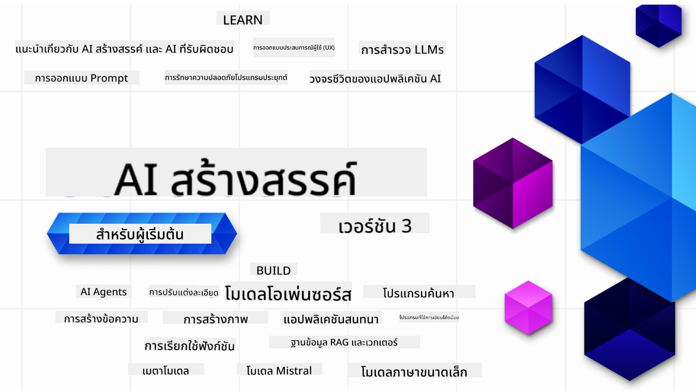

<!--
CO_OP_TRANSLATOR_METADATA:
{
  "original_hash": "ca2afa136ed9aca0634f39f51239746e",
  "translation_date": "2025-08-27T08:36:06+00:00",
  "source_file": "README.md",
  "language_code": "th"
}
-->

### 21 บทเรียนที่จะสอนทุกสิ่งที่คุณต้องรู้เพื่อเริ่มสร้างแอปพลิเคชัน Generative AI

  
  
  
  
  

  
  
  

### 🌐 รองรับหลายภาษา

#### รองรับผ่าน GitHub Action (อัปเดตอัตโนมัติและทันสมัยเสมอ)

[French](../fr/README.md) | [Spanish](../es/README.md) | [German](../de/README.md) | [Russian](../ru/README.md) | [Arabic](../ar/README.md) | [Persian (Farsi)](../fa/README.md) | [Urdu](../ur/README.md) | [Chinese (Simplified)](../zh/README.md) | [Chinese (Traditional, Macau)](../mo/README.md) | [Chinese (Traditional, Hong Kong)](../hk/README.md) | [Chinese (Traditional, Taiwan)](../tw/README.md) | [Japanese](../ja/README.md) | [Korean](../ko/README.md) | [Hindi](../hi/README.md) | [Bengali](../bn/README.md) | [Marathi](../mr/README.md) | [Nepali](../ne/README.md) | [Punjabi (Gurmukhi)](../pa/README.md) | [Portuguese (Portugal)](../pt/README.md) | [Portuguese (Brazil)](../br/README.md) | [Italian](../it/README.md) | [Lithuanian](../lt/README.md) | [Polish](../pl/README.md) | [Turkish](../tr/README.md) | [Greek](../el/README.md) | [Thai](./README.md) | [Swedish](../sv/README.md) | [Danish](../da/README.md) | [Norwegian](../no/README.md) | [Finnish](../fi/README.md) | [Dutch](../nl/README.md) | [Hebrew](../he/README.md) | [Vietnamese](../vi/README.md) | [Indonesian](../id/README.md) | [Malay](../ms/README.md) | [Tagalog (Filipino)](../tl/README.md) | [Swahili](../sw/README.md) | [Hungarian](../hu/README.md) | [Czech](../cs/README.md) | [Slovak](../sk/README.md) | [Romanian](../ro/README.md) | [Bulgarian](../bg/README.md) | [Serbian (Cyrillic)](../sr/README.md) | [Croatian](../hr/README.md) | [Slovenian](../sl/README.md) | [Ukrainian](../uk/README.md) | [Burmese (Myanmar)](../my/README.md)

# Generative AI สำหรับผู้เริ่มต้น (เวอร์ชัน 3) - หลักสูตร

เรียนรู้พื้นฐานของการสร้างแอปพลิเคชัน Generative AI ด้วยหลักสูตร 21 บทเรียนที่ครอบคลุมโดย Microsoft Cloud Advocates

## 🌱 เริ่มต้นใช้งาน

หลักสูตรนี้มีทั้งหมด 21 บทเรียน แต่ละบทเรียนจะครอบคลุมหัวข้อเฉพาะ คุณสามารถเริ่มต้นจากบทเรียนใดก็ได้ตามที่คุณสนใจ!

บทเรียนจะแบ่งเป็น "Learn" ซึ่งอธิบายแนวคิดของ Generative AI และ "Build" ซึ่งอธิบายแนวคิดพร้อมตัวอย่างโค้ดใน **Python** และ **TypeScript** (ถ้ามี)

สำหรับนักพัฒนา .NET ลองดู [Generative AI สำหรับผู้เริ่มต้น (.NET Edition)](https://github.com/microsoft/Generative-AI-for-beginners-dotnet?WT.mc_id=academic-105485-koreyst)!

แต่ละบทเรียนยังมีส่วน "Keep Learning" ที่มีเครื่องมือเพิ่มเติมสำหรับการเรียนรู้

## สิ่งที่คุณต้องมี
### เพื่อรันโค้ดในหลักสูตรนี้ คุณสามารถใช้:
 - [Azure OpenAI Service](https://aka.ms/genai-beginners/azure-open-ai?WT.mc_id=academic-105485-koreyst) - **บทเรียน:** "aoai-assignment"  
 - [GitHub Marketplace Model Catalog](https://aka.ms/genai-beginners/gh-models?WT.mc_id=academic-105485-koreyst) - **บทเรียน:** "githubmodels"  
 - [OpenAI API](https://aka.ms/genai-beginners/open-ai?WT.mc_id=academic-105485-koreyst) - **บทเรียน:** "oai-assignment"  

- ความรู้พื้นฐานเกี่ยวกับ Python หรือ TypeScript จะเป็นประโยชน์ - \*สำหรับผู้เริ่มต้นอย่างแท้จริง ลองดูหลักสูตร [Python](https://aka.ms/genai-beginners/python?WT.mc_id=academic-105485-koreyst) และ [TypeScript](https://aka.ms/genai-beginners/typescript?WT.mc_id=academic-105485-koreyst)  
- บัญชี GitHub เพื่อ [fork repo นี้ทั้งหมด](https://aka.ms/genai-beginners/github?WT.mc_id=academic-105485-koreyst) ไปยังบัญชี GitHub ของคุณเอง  

เราได้สร้างบทเรียน **[Course Setup](./00-course-setup/README.md?WT.mc_id=academic-105485-koreyst)** เพื่อช่วยคุณตั้งค่าสภาพแวดล้อมการพัฒนา

อย่าลืม [กดดาว (🌟) repo นี้](https://docs.github.com/en/get-started/exploring-projects-on-github/saving-repositories-with-stars?WT.mc_id=academic-105485-koreyst) เพื่อให้ค้นหาได้ง่ายในภายหลัง

## 🧠 พร้อมที่จะปรับใช้หรือยัง?

หากคุณกำลังมองหาตัวอย่างโค้ดขั้นสูงเพิ่มเติม ลองดู [คอลเลกชันตัวอย่างโค้ด Generative AI](https://aka.ms/genai-beg-code?WT.mc_id=academic-105485-koreyst) ในทั้ง **Python** และ **TypeScript**

## 🗣️ พบปะผู้เรียนคนอื่น ๆ และรับการสนับสนุน

เข้าร่วม [เซิร์ฟเวอร์ Discord Azure AI Foundry อย่างเป็นทางการ](https://aka.ms/genai-discord?WT.mc_id=academic-105485-koreyst) เพื่อพบปะและสร้างเครือข่ายกับผู้เรียนคนอื่น ๆ ที่กำลังเรียนหลักสูตรนี้ และรับการสนับสนุน

ถามคำถามหรือแชร์ความคิดเห็นเกี่ยวกับผลิตภัณฑ์ใน [Azure AI Foundry Developer Forum](https://aka.ms/azureaifoundry/forum) บน Github

## 🚀 กำลังสร้างสตาร์ทอัพ?

เยี่ยมชม [Microsoft for Startups](https://www.microsoft.com/startups) เพื่อดูวิธีเริ่มต้นสร้างด้วยเครดิต Azure วันนี้

## 🙏 ต้องการช่วยเหลือหรือไม่?

คุณมีข้อเสนอแนะหรือพบข้อผิดพลาดในการสะกดหรือโค้ดหรือไม่? [สร้าง issue](https://github.com/microsoft/generative-ai-for-beginners/issues?WT.mc_id=academic-105485-koreyst) หรือ [สร้าง pull request](https://github.com/microsoft/generative-ai-for-beginners/pulls?WT.mc_id=academic-105485-koreyst)

## 📂 แต่ละบทเรียนประกอบด้วย:

- วิดีโอแนะนำสั้น ๆ เกี่ยวกับหัวข้อ
- บทเรียนที่เขียนไว้ใน README
- ตัวอย่างโค้ด Python และ TypeScript ที่รองรับ Azure OpenAI และ OpenAI API
- ลิงก์ไปยังแหล่งข้อมูลเพิ่มเติมเพื่อเรียนรู้ต่อ

## 🗃️ บทเรียน

| #   | **ลิงก์บทเรียน**                                                                                                                              | **คำอธิบาย**                                                                                 | **วิดีโอ**                                                                   | **การเรียนรู้เพิ่มเติม**                                                             |
| --- | -------------------------------------------------------------------------------------------------------------------------------------------- | ----------------------------------------------------------------------------------------------- | --------------------------------------------------------------------------- | ------------------------------------------------------------------------------ |
| 00  | [Course Setup](./00-course-setup/README.md?WT.mc_id=academic-105485-koreyst)                                                                 | **เรียนรู้:** วิธีตั้งค่าสภาพแวดล้อมการพัฒนาของคุณ                                            | วิดีโอกำลังมาเร็ว ๆ นี้                                                                 | [เรียนรู้เพิ่มเติม](https://aka.ms/genai-collection?WT.mc_id=academic-105485-koreyst) |
| 01  | [Introduction to Generative AI and LLMs](./01-introduction-to-genai/README.md?WT.mc_id=academic-105485-koreyst)                              | **เรียนรู้:** ทำความเข้าใจว่า Generative AI คืออะไรและ Large Language Models (LLMs) ทำงานอย่างไร       | [วิดีโอ](https://aka.ms/gen-ai-lesson-1-gh?WT.mc_id=academic-105485-koreyst) | [เรียนรู้เพิ่มเติม](https://aka.ms/genai-collection?WT.mc_id=academic-105485-koreyst) |
| 02  | [Exploring and comparing different LLMs](./02-exploring-and-comparing-different-llms/README.md?WT.mc_id=academic-105485-koreyst)             | **เรียนรู้:** วิธีเลือกโมเดลที่เหมาะสมกับกรณีการใช้งานของคุณ                                      | [วิดีโอ](https://aka.ms/gen-ai-lesson2-gh?WT.mc_id=academic-105485-koreyst)  | [เรียนรู้เพิ่มเติม](https://aka.ms/genai-collection?WT.mc_id=academic-105485-koreyst) |
| 03  | [Using Generative AI Responsibly](./03-using-generative-ai-responsibly/README.md?WT.mc_id=academic-105485-koreyst)                           | **เรียนรู้:** วิธีสร้างแอปพลิเคชัน Generative AI อย่างมีความรับผิดชอบ                                  | [วิดีโอ](https://aka.ms/gen-ai-lesson3-gh?WT.mc_id=academic-105485-koreyst)  | [เรียนรู้เพิ่มเติม](https://aka.ms/genai-collection?WT.mc_id=academic-105485-koreyst) |
| 04  | [Understanding Prompt Engineering Fundamentals](./04-prompt-engineering-fundamentals/README.md?WT.mc_id=academic-105485-koreyst)             | **เรียนรู้:** การปฏิบัติที่ดีที่สุดสำหรับการสร้าง Prompt                                           | [วิดีโอ](https://aka.ms/gen-ai-lesson4-gh?WT.mc_id=academic-105485-koreyst)  | [เรียนรู้เพิ่มเติม](https://aka.ms/genai-collection?WT.mc_id=academic-105485-koreyst) |
| 05  | [Creating Advanced Prompts](./05-advanced-prompts/README.md?WT.mc_id=academic-105485-koreyst)                                                | **เรียนรู้:** วิธีใช้เทคนิคการสร้าง Prompt ที่ช่วยปรับปรุงผลลัพธ์ของคุณ. | [วิดีโอ](https://aka.ms/gen-ai-lesson5-gh?WT.mc_id=academic-105485-koreyst)  | [เรียนรู้เพิ่มเติม](https://aka.ms/genai-collection?WT.mc_id=academic-105485-koreyst) |
| 06  | [สร้างแอปพลิเคชันการสร้างข้อความ](./06-text-generation-apps/README.md?WT.mc_id=academic-105485-koreyst)                                | **สร้าง:** แอปพลิเคชันการสร้างข้อความโดยใช้ Azure OpenAI / OpenAI API                                | [วิดีโอ](https://aka.ms/gen-ai-lesson6-gh?WT.mc_id=academic-105485-koreyst)  | [เรียนรู้เพิ่มเติม](https://aka.ms/genai-collection?WT.mc_id=academic-105485-koreyst) |
| 07  | [สร้างแอปพลิเคชันแชท](./07-building-chat-applications/README.md?WT.mc_id=academic-105485-koreyst)                                     | **สร้าง:** เทคนิคในการสร้างและผสานรวมแอปพลิเคชันแชทอย่างมีประสิทธิภาพ               | [วิดีโอ](https://aka.ms/gen-ai-lessons7-gh?WT.mc_id=academic-105485-koreyst) | [เรียนรู้เพิ่มเติม](https://aka.ms/genai-collection?WT.mc_id=academic-105485-koreyst) |
| 08  | [สร้างแอปค้นหาด้วยฐานข้อมูลเวกเตอร์](./08-building-search-applications/README.md?WT.mc_id=academic-105485-koreyst)                        | **สร้าง:** แอปพลิเคชันค้นหาที่ใช้ Embeddings ในการค้นหาข้อมูล                        | [วิดีโอ](https://aka.ms/gen-ai-lesson8-gh?WT.mc_id=academic-105485-koreyst)  | [เรียนรู้เพิ่มเติม](https://aka.ms/genai-collection?WT.mc_id=academic-105485-koreyst) |
| 09  | [สร้างแอปพลิเคชันการสร้างภาพ](./09-building-image-applications/README.md?WT.mc_id=academic-105485-koreyst)                        | **สร้าง:** แอปพลิเคชันการสร้างภาพ                                                       | [วิดีโอ](https://aka.ms/gen-ai-lesson9-gh?WT.mc_id=academic-105485-koreyst)  | [เรียนรู้เพิ่มเติม](https://aka.ms/genai-collection?WT.mc_id=academic-105485-koreyst) |
| 10  | [สร้างแอปพลิเคชัน AI แบบ Low Code](./10-building-low-code-ai-applications/README.md?WT.mc_id=academic-105485-koreyst)                       | **สร้าง:** แอปพลิเคชัน Generative AI โดยใช้เครื่องมือ Low Code                                     | [วิดีโอ](https://aka.ms/gen-ai-lesson10-gh?WT.mc_id=academic-105485-koreyst) | [เรียนรู้เพิ่มเติม](https://aka.ms/genai-collection?WT.mc_id=academic-105485-koreyst) |
| 11  | [การผสานรวมแอปพลิเคชันภายนอกด้วย Function Calling](./11-integrating-with-function-calling/README.md?WT.mc_id=academic-105485-koreyst) | **สร้าง:** การเรียกใช้ฟังก์ชันคืออะไรและกรณีการใช้งานสำหรับแอปพลิเคชัน                          | [วิดีโอ](https://aka.ms/gen-ai-lesson11-gh?WT.mc_id=academic-105485-koreyst) | [เรียนรู้เพิ่มเติม](https://aka.ms/genai-collection?WT.mc_id=academic-105485-koreyst) |
| 12  | [การออกแบบ UX สำหรับแอปพลิเคชัน AI](./12-designing-ux-for-ai-applications/README.md?WT.mc_id=academic-105485-koreyst)                         | **เรียนรู้:** วิธีการใช้หลักการออกแบบ UX เมื่อพัฒนาแอปพลิเคชัน Generative AI         | [วิดีโอ](https://aka.ms/gen-ai-lesson12-gh?WT.mc_id=academic-105485-koreyst) | [เรียนรู้เพิ่มเติม](https://aka.ms/genai-collection?WT.mc_id=academic-105485-koreyst) |
| 13  | [การรักษาความปลอดภัยให้แอปพลิเคชัน Generative AI ของคุณ](./13-securing-ai-applications/README.md?WT.mc_id=academic-105485-koreyst)                         | **เรียนรู้:** ภัยคุกคามและความเสี่ยงต่อระบบ AI และวิธีการรักษาความปลอดภัยให้ระบบเหล่านี้             | [วิดีโอ](https://aka.ms/gen-ai-lesson13-gh?WT.mc_id=academic-105485-koreyst) | [เรียนรู้เพิ่มเติม](https://aka.ms/genai-collection?WT.mc_id=academic-105485-koreyst) |
| 14  | [วงจรชีวิตของแอปพลิเคชัน Generative AI](./14-the-generative-ai-application-lifecycle/README.md?WT.mc_id=academic-105485-koreyst)           | **เรียนรู้:** เครื่องมือและตัวชี้วัดในการจัดการวงจรชีวิต LLM และ LLMOps                         | [วิดีโอ](https://aka.ms/gen-ai-lesson14-gh?WT.mc_id=academic-105485-koreyst) | [เรียนรู้เพิ่มเติม](https://aka.ms/genai-collection?WT.mc_id=academic-105485-koreyst) |
| 15  | [การดึงข้อมูลแบบเพิ่มประสิทธิภาพ (RAG) และฐานข้อมูลเวกเตอร์](./15-rag-and-vector-databases/README.md?WT.mc_id=academic-105485-koreyst)        | **สร้าง:** แอปพลิเคชันโดยใช้ RAG Framework เพื่อดึง Embeddings จากฐานข้อมูลเวกเตอร์  | [วิดีโอ](https://aka.ms/gen-ai-lesson15-gh?WT.mc_id=academic-105485-koreyst) | [เรียนรู้เพิ่มเติม](https://aka.ms/genai-collection?WT.mc_id=academic-105485-koreyst) |
| 16  | [โมเดลโอเพนซอร์สและ Hugging Face](./16-open-source-models/README.md?WT.mc_id=academic-105485-koreyst)                                    | **สร้าง:** แอปพลิเคชันโดยใช้โมเดลโอเพนซอร์สที่มีอยู่ใน Hugging Face                    | [วิดีโอ](https://aka.ms/gen-ai-lesson16-gh?WT.mc_id=academic-105485-koreyst) | [เรียนรู้เพิ่มเติม](https://aka.ms/genai-collection?WT.mc_id=academic-105485-koreyst) |
| 17  | [AI Agents](./17-ai-agents/README.md?WT.mc_id=academic-105485-koreyst)                                                                       | **สร้าง:** แอปพลิเคชันโดยใช้ AI Agent Framework                                           | [วิดีโอ](https://aka.ms/gen-ai-lesson17-gh?WT.mc_id=academic-105485-koreyst) | [เรียนรู้เพิ่มเติม](https://aka.ms/genai-collection?WT.mc_id=academic-105485-koreyst) |
| 18  | [การปรับแต่ง LLMs](./18-fine-tuning/README.md?WT.mc_id=academic-105485-koreyst)                                                              | **เรียนรู้:** ความหมาย เหตุผล และวิธีการปรับแต่ง LLMs                                            | [วิดีโอ](https://aka.ms/gen-ai-lesson18-gh?WT.mc_id=academic-105485-koreyst) | [เรียนรู้เพิ่มเติม](https://aka.ms/genai-collection?WT.mc_id=academic-105485-koreyst) |
| 19  | [การสร้างด้วย SLMs](./19-slm/README.md?WT.mc_id=academic-105485-koreyst)                                                              | **เรียนรู้:** ประโยชน์ของการสร้างด้วย Small Language Models                                            | วิดีโอเร็วๆ นี้ | [เรียนรู้เพิ่มเติม](https://aka.ms/genai-collection?WT.mc_id=academic-105485-koreyst) |
| 20  | [การสร้างด้วยโมเดล Mistral](./20-mistral/README.md?WT.mc_id=academic-105485-koreyst)                                                              | **เรียนรู้:** คุณสมบัติและความแตกต่างของโมเดลตระกูล Mistral                                           | วิดีโอเร็วๆ นี้ | [เรียนรู้เพิ่มเติม](https://aka.ms/genai-collection?WT.mc_id=academic-105485-koreyst) |
| 21  | [การสร้างด้วยโมเดล Meta](./21-meta/README.md?WT.mc_id=academic-105485-koreyst)                                                              | **เรียนรู้:** คุณสมบัติและความแตกต่างของโมเดลตระกูล Meta                                           | วิดีโอเร็วๆ นี้ | [เรียนรู้เพิ่มเติม](https://aka.ms/genai-collection?WT.mc_id=academic-105485-koreyst) |

### 🌟 ขอบคุณเป็นพิเศษ

ขอขอบคุณ [**John Aziz**](https://www.linkedin.com/in/john0isaac/) สำหรับการสร้าง GitHub Actions และ workflows ทั้งหมด

[**Bernhard Merkle**](https://www.linkedin.com/in/bernhard-merkle-738b73/) สำหรับการมีส่วนร่วมสำคัญในแต่ละบทเรียนเพื่อปรับปรุงประสบการณ์การเรียนรู้และการเขียนโค้ด

## 🎒 คอร์สอื่นๆ

ทีมของเราผลิตคอร์สอื่นๆ ด้วย! ลองดู:

- [**ใหม่** Model Context Protocol สำหรับผู้เริ่มต้น](https://github.com/microsoft/mcp-for-beginners)
- [AI Agents สำหรับผู้เริ่มต้น](https://github.com/microsoft/ai-agents-for-beginners)
- [Generative AI สำหรับผู้เริ่มต้นโดยใช้ .NET](https://github.com/microsoft/Generative-AI-for-beginners-dotnet)
- [Generative AI สำหรับผู้เริ่มต้นโดยใช้ JavaScript](https://aka.ms/genai-js-course)
- [Generative AI สำหรับผู้เริ่มต้นโดยใช้ Java](https://aka.ms/genaijava)
- [ML สำหรับผู้เริ่มต้น](https://aka.ms/ml-beginners)
- [Data Science สำหรับผู้เริ่มต้น](https://aka.ms/datascience-beginners)
- [AI สำหรับผู้เริ่มต้น](https://aka.ms/ai-beginners)
- [Cybersecurity สำหรับผู้เริ่มต้น](https://github.com/microsoft/Security-101)
- [Web Dev สำหรับผู้เริ่มต้น](https://aka.ms/webdev-beginners)
- [IoT สำหรับผู้เริ่มต้น](https://aka.ms/iot-beginners)
- [XR Development สำหรับผู้เริ่มต้น](https://github.com/microsoft/xr-development-for-beginners)
- [การใช้งาน GitHub Copilot สำหรับการเขียนโปรแกรมคู่ด้วย AI](https://aka.ms/GitHubCopilotAI)
- [การใช้งาน GitHub Copilot สำหรับนักพัฒนา C#/.NET](https://github.com/microsoft/mastering-github-copilot-for-dotnet-csharp-developers)
- [เลือกการผจญภัย Copilot ของคุณเอง](https://github.com/microsoft/CopilotAdventures)

---

**ข้อจำกัดความรับผิดชอบ**:  
เอกสารนี้ได้รับการแปลโดยใช้บริการแปลภาษา AI [Co-op Translator](https://github.com/Azure/co-op-translator) แม้ว่าเราจะพยายามให้การแปลมีความถูกต้อง แต่โปรดทราบว่าการแปลอัตโนมัติอาจมีข้อผิดพลาดหรือความไม่แม่นยำ เอกสารต้นฉบับในภาษาต้นทางควรถือเป็นแหล่งข้อมูลที่เชื่อถือได้ สำหรับข้อมูลที่สำคัญ ขอแนะนำให้ใช้บริการแปลภาษามนุษย์ที่เป็นมืออาชีพ เราจะไม่รับผิดชอบต่อความเข้าใจผิดหรือการตีความที่ผิดพลาดซึ่งเกิดจากการใช้การแปลนี้