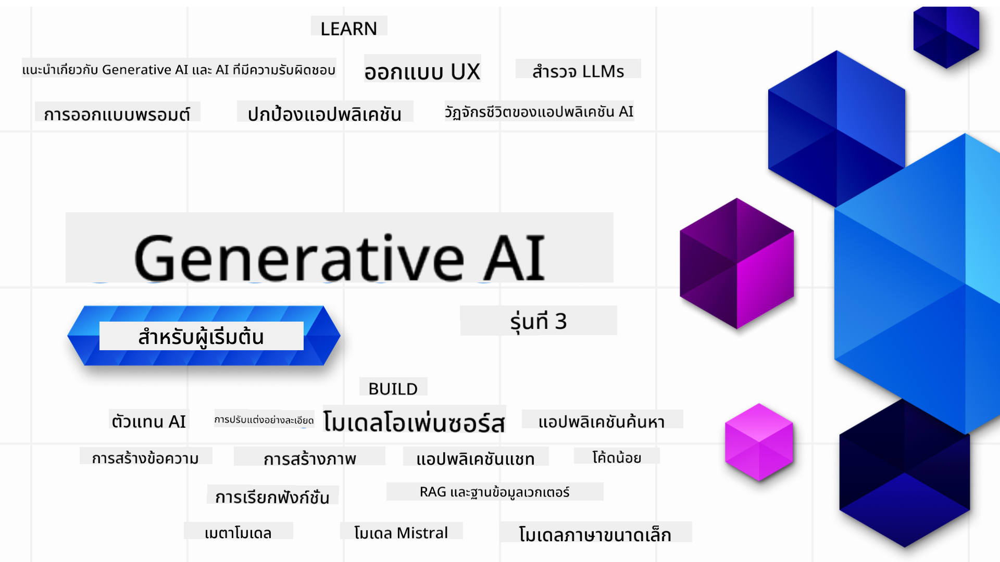

<!--
CO_OP_TRANSLATOR_METADATA:
{
  "original_hash": "c2ee25895ebbfa1a52868bb6eab686fc",
  "translation_date": "2025-05-19T11:45:05+00:00",
  "source_file": "README.md",
  "language_code": "th"
}
-->

### 21 บทเรียนที่จะสอนทุกสิ่งที่คุณจำเป็นต้องรู้เพื่อเริ่มสร้างแอปพลิเคชัน Generative AI

### 🌐 การสนับสนุนหลายภาษา

#### สนับสนุนผ่าน GitHub Action (อัตโนมัติและทันสมัยอยู่เสมอ)
[ฝรั่งเศส](../fr/README.md) | [สเปน](../es/README.md) | [เยอรมัน](../de/README.md) | [รัสเซีย](../ru/README.md) | [อาหรับ](../ar/README.md) | [เปอร์เซีย (ฟาร์ซี)](../fa/README.md) | [อูรดู](../ur/README.md) | [จีน (ตัวย่อ)](../zh/README.md) | [จีน (ตัวเต็ม, มาเก๊า)](../mo/README.md) | [จีน (ตัวเต็ม, ฮ่องกง)](../hk/README.md) | [จีน (ตัวเต็ม, ไต้หวัน)](../tw/README.md) | [ญี่ปุ่น](../ja/README.md) | [เกาหลี](../ko/README.md) | [ฮินดี](../hi/README.md) | [เบงกอล](../bn/README.md) | [มราฐี](../mr/README.md) | [เนปาล](../ne/README.md) | [ปัญจาบ (คุรมุขี)](../pa/README.md) | [โปรตุเกส (โปรตุเกส)](../pt/README.md) | [โปรตุเกส (บราซิล)](../br/README.md) | [อิตาลี](../it/README.md) | [โปแลนด์](../pl/README.md) | [ตุรกี](../tr/README.md) | [กรีก](../el/README.md) | [ไทย](./README.md) | [สวีเดน](../sv/README.md) | [เดนมาร์ก](../da/README.md) | [นอร์เวย์](../no/README.md) | [ฟินแลนด์](../fi/README.md) | [ดัตช์](../nl/README.md) | [ฮิบรู](../he/README.md) | [เวียดนาม](../vi/README.md) | [อินโดนีเซีย](../id/README.md) | [มาเลย์](../ms/README.md) | [ตากาล็อก (ฟิลิปปินส์)](../tl/README.md) | [สวาฮีลี](../sw/README.md) | [ฮังการี](../hu/README.md) | [เช็ก](../cs/README.md) | [สโลวัก](../sk/README.md) | [โรมาเนีย](../ro/README.md) | [บัลแกเรีย](../bg/README.md) | [เซอร์เบีย (ซีริลลิก)](../sr/README.md) | [โครเอเชีย](../hr/README.md) | [สโลวีเนีย](../sl/README.md)
# Generative AI สำหรับผู้เริ่มต้น (เวอร์ชัน 3) - หลักสูตร

เรียนรู้พื้นฐานการสร้างแอปพลิเคชัน Generative AI กับหลักสูตร 21 บทเรียนที่ครอบคลุมโดย Microsoft Cloud Advocates

## 🌱 เริ่มต้นใช้งาน

หลักสูตรนี้มี 21 บทเรียน แต่ละบทเรียนมีหัวข้อเฉพาะของตัวเอง ดังนั้นคุณสามารถเริ่มเรียนจากจุดไหนก็ได้ตามที่คุณต้องการ!

บทเรียนถูกแบ่งเป็น "Learn" เพื่ออธิบายแนวคิดของ Generative AI และ "Build" เพื่ออธิบายแนวคิดพร้อมตัวอย่างโค้ดใน **Python** และ **TypeScript** เมื่อเป็นไปได้

สำหรับนักพัฒนา .NET ตรวจสอบ [Generative AI สำหรับผู้เริ่มต้น (.NET Edition)](https://github.com/microsoft/Generative-AI-for-beginners-dotnet?WT.mc_id=academic-105485-koreyst)!

แต่ละบทเรียนยังมีส่วน "Keep Learning" ที่มีเครื่องมือการเรียนรู้เพิ่มเติม

## สิ่งที่คุณต้องการ
### เพื่อรันโค้ดในหลักสูตรนี้ คุณสามารถใช้:
 - [Azure OpenAI Service](https://aka.ms/genai-beginners/azure-open-ai?WT.mc_id=academic-105485-koreyst) - **บทเรียน:** "aoai-assignment"
 - [GitHub Marketplace Model Catalog](https://aka.ms/genai-beginners/gh-models?WT.mc_id=academic-105485-koreyst) - **บทเรียน:** "githubmodels"
 - [OpenAI API](https://aka.ms/genai-beginners/open-ai?WT.mc_id=academic-105485-koreyst) - **บทเรียน:** "oai-assignment" 

- มีความรู้พื้นฐานเกี่ยวกับ Python หรือ TypeScript จะเป็นประโยชน์ - \*สำหรับผู้เริ่มต้นที่สมบูรณ์แบบ ตรวจสอบหลักสูตร [Python](https://aka.ms/genai-beginners/python?WT.mc_id=academic-105485-koreyst) และ [TypeScript](https://aka.ms/genai-beginners/typescript?WT.mc_id=academic-105485-koreyst)
- บัญชี GitHub เพื่อ [fork repo ทั้งหมดนี้](https://aka.ms/genai-beginners/github?WT.mc_id=academic-105485-koreyst) ไปยังบัญชี GitHub ของคุณเอง

เราได้สร้างบทเรียน **[Course Setup](./00-course-setup/README.md?WT.mc_id=academic-105485-koreyst)** เพื่อช่วยคุณตั้งค่าพื้นที่พัฒนา

อย่าลืม [star (🌟) repo นี้](https://docs.github.com/en/get-started/exploring-projects-on-github/saving-repositories-with-stars?WT.mc_id=academic-105485-koreyst) เพื่อหามันได้ง่ายขึ้นในภายหลัง

## 🧠 พร้อมที่จะใช้งาน?

ถ้าคุณกำลังมองหาตัวอย่างโค้ดขั้นสูงเพิ่มเติม ตรวจสอบ [คอลเลกชันตัวอย่างโค้ด Generative AI](https://aka.ms/genai-beg-code?WT.mc_id=academic-105485-koreyst) ใน **Python** และ **TypeScript**

## 🗣️ พบปะกับผู้เรียนอื่น ๆ, รับการสนับสนุน

เข้าร่วม [เซิร์ฟเวอร์ Discord ของ Azure AI Foundry อย่างเป็นทางการ](https://aka.ms/genai-discord?WT.mc_id=academic-105485-koreyst) เพื่อพบปะและสร้างเครือข่ายกับผู้เรียนอื่น ๆ ที่เข้าร่วมหลักสูตรนี้และรับการสนับสนุน

ถามคำถามหรือแบ่งปันความคิดเห็นเกี่ยวกับผลิตภัณฑ์ใน [ฟอรั่มนักพัฒนา Azure AI Foundry](https://aka.ms/azureaifoundry/forum) บน Github

## 🚀 สร้างสตาร์ทอัพ?

สมัคร [Microsoft for Startups Founders Hub](https://aka.ms/genai-foundershub?WT.mc_id=academic-105485-koreyst) เพื่อรับ **เครดิต OpenAI ฟรี** และสูงสุด **$150k สำหรับเครดิต Azure เพื่อเข้าถึงโมเดล OpenAI ผ่านบริการ Azure OpenAI**

## 🙏 ต้องการช่วยเหลือ?

คุณมีคำแนะนำหรือพบข้อผิดพลาดในการสะกดหรือโค้ดหรือไม่? [ยกประเด็น](https://github.com/microsoft/generative-ai-for-beginners/issues?WT.mc_id=academic-105485-koreyst) หรือ [สร้าง pull request](https://github.com/microsoft/generative-ai-for-beginners/pulls?WT.mc_id=academic-105485-koreyst)

## 📂 แต่ละบทเรียนประกอบด้วย:

- วิดีโอแนะนำสั้น ๆ เกี่ยวกับหัวข้อ
- บทเรียนที่เขียนอยู่ใน README
- ตัวอย่างโค้ด Python และ TypeScript ที่รองรับ Azure OpenAI และ OpenAI API
- ลิงก์ไปยังทรัพยากรเพิ่มเติมเพื่อเรียนรู้ต่อไป

## 🗃️ บทเรียน

| #   | **ลิงก์บทเรียน**                                                                                                                              | **คำอธิบาย**                                                                                 | **วิดีโอ**                                                                   | **การเรียนรู้เพิ่มเติม**                                                             |
| --- | -------------------------------------------------------------------------------------------------------------------------------------------- | ----------------------------------------------------------------------------------------------- | --------------------------------------------------------------------------- | ------------------------------------------------------------------------------ |
| 00  | [Course Setup](./00-course-setup/README.md?WT.mc_id=academic-105485-koreyst)                                                                 | **Learn:** วิธีตั้งค่าสภาพแวดล้อมการพัฒนาของคุณ                                            | Video Coming Soon                                                                 | [Learn More](https://aka.ms/genai-collection?WT.mc_id=academic-105485-koreyst) |
| 01  | [Introduction to Generative AI and LLMs](./01-introduction-to-genai/README.md?WT.mc_id=academic-105485-koreyst)                              | **Learn:** ทำความเข้าใจว่า Generative AI คืออะไรและโมเดลภาษาขนาดใหญ่ (LLMs) ทำงานอย่างไร       | [Video](https://aka.ms/gen-ai-lesson-1-gh?WT.mc_id=academic-105485-koreyst) | [Learn More](https://aka.ms/genai-collection?WT.mc_id=academic-105485-koreyst) |
| 02  | [Exploring and comparing different LLMs](./02-exploring-and-comparing-different-llms/README.md?WT.mc_id=academic-105485-koreyst)             | **Learn:** วิธีเลือกโมเดลที่เหมาะสมกับกรณีการใช้งานของคุณ                                      | [Video](https://aka.ms/gen-ai-lesson2-gh?WT.mc_id=academic-105485-koreyst)  | [Learn More](https://aka.ms/genai-collection?WT.mc_id=academic-105485-koreyst) |
| 03  | [Using Generative AI Responsibly](./03-using-generative-ai-responsibly/README.md?WT.mc_id=academic-105485-koreyst)                           | **Learn:** วิธีสร้างแอปพลิเคชัน Generative AI อย่างมีความรับผิดชอบ                                  | [Video](https://aka.ms/gen-ai-lesson3-gh?WT.mc_id=academic-105485-koreyst)  | [Learn More](https://aka.ms/genai-collection?WT.mc_id=academic-105485-koreyst) |
| 04  | [Understanding Prompt Engineering Fundamentals](./04-prompt-engineering-fundamentals/README.md?WT.mc_id=academic-105485-koreyst)             | **Learn:** การปฏิบัติที่ดีที่สุดของการออกแบบ Prompt Engineering                                           | [Video](https://aka.ms/gen-ai-lesson4-gh?WT.mc_id=academic-105485-koreyst)  | [Learn More](https://aka.ms/genai-collection?WT.mc_id=academic-105485-koreyst) |
| 05  | [การสร้าง Prompt ขั้นสูง](./05-advanced-prompts/README.md?WT.mc_id=academic-105485-koreyst)                                                | **เรียนรู้:** วิธีการใช้เทคนิคการสร้าง Prompt ที่ช่วยปรับปรุงผลลัพธ์ของ Prompt ของคุณ | [วิดีโอ](https://aka.ms/gen-ai-lesson5-gh?WT.mc_id=academic-105485-koreyst)  | [เรียนรู้เพิ่มเติม](https://aka.ms/genai-collection?WT.mc_id=academic-105485-koreyst) |
| 06  | [การสร้างแอปพลิเคชันสร้างข้อความ](./06-text-generation-apps/README.md?WT.mc_id=academic-105485-koreyst)                                | **สร้าง:** แอปพลิเคชันสร้างข้อความโดยใช้ Azure OpenAI / OpenAI API                                | [วิดีโอ](https://aka.ms/gen-ai-lesson6-gh?WT.mc_id=academic-105485-koreyst)  | [เรียนรู้เพิ่มเติม](https://aka.ms/genai-collection?WT.mc_id=academic-105485-koreyst) |
| 07  | [การสร้างแอปพลิเคชันแชท](./07-building-chat-applications/README.md?WT.mc_id=academic-105485-koreyst)                                     | **สร้าง:** เทคนิคการสร้างและรวมแอปพลิเคชันแชทอย่างมีประสิทธิภาพ               | [วิดีโอ](https://aka.ms/gen-ai-lessons7-gh?WT.mc_id=academic-105485-koreyst) | [เรียนรู้เพิ่มเติม](https://aka.ms/genai-collection?WT.mc_id=academic-105485-koreyst) |
| 08  | [การสร้างแอปพลิเคชันค้นหาด้วยฐานข้อมูลเวกเตอร์](./08-building-search-applications/README.md?WT.mc_id=academic-105485-koreyst)                        | **สร้าง:** แอปพลิเคชันค้นหาที่ใช้ Embeddings ในการค้นหาข้อมูล                        | [วิดีโอ](https://aka.ms/gen-ai-lesson8-gh?WT.mc_id=academic-105485-koreyst)  | [เรียนรู้เพิ่มเติม](https://aka.ms/genai-collection?WT.mc_id=academic-105485-koreyst) |
| 09  | [การสร้างแอปพลิเคชันสร้างภาพ](./09-building-image-applications/README.md?WT.mc_id=academic-105485-koreyst)                        | **สร้าง:** แอปพลิเคชันสร้างภาพ                                                       | [วิดีโอ](https://aka.ms/gen-ai-lesson9-gh?WT.mc_id=academic-105485-koreyst)  | [เรียนรู้เพิ่มเติม](https://aka.ms/genai-collection?WT.mc_id=academic-105485-koreyst) |
| 10  | [การสร้างแอปพลิเคชัน AI ด้วย Low Code](./10-building-low-code-ai-applications/README.md?WT.mc_id=academic-105485-koreyst)                       | **สร้าง:** แอปพลิเคชัน Generative AI โดยใช้เครื่องมือ Low Code                                     | [วิดีโอ](https://aka.ms/gen-ai-lesson10-gh?WT.mc_id=academic-105485-koreyst) | [เรียนรู้เพิ่มเติม](https://aka.ms/genai-collection?WT.mc_id=academic-105485-koreyst) |
| 11  | [การรวมแอปพลิเคชันภายนอกด้วย Function Calling](./11-integrating-with-function-calling/README.md?WT.mc_id=academic-105485-koreyst) | **สร้าง:** Function calling คืออะไรและการใช้งานในแอปพลิเคชัน                          | [วิดีโอ](https://aka.ms/gen-ai-lesson11-gh?WT.mc_id=academic-105485-koreyst) | [เรียนรู้เพิ่มเติม](https://aka.ms/genai-collection?WT.mc_id=academic-105485-koreyst) |
| 12  | [การออกแบบ UX สำหรับแอปพลิเคชัน AI](./12-designing-ux-for-ai-applications/README.md?WT.mc_id=academic-105485-koreyst)                         | **เรียนรู้:** วิธีการใช้หลักการออกแบบ UX เมื่อพัฒนาแอปพลิเคชัน Generative AI         | [วิดีโอ](https://aka.ms/gen-ai-lesson12-gh?WT.mc_id=academic-105485-koreyst) | [เรียนรู้เพิ่มเติม](https://aka.ms/genai-collection?WT.mc_id=academic-105485-koreyst) |
| 13  | [การรักษาความปลอดภัยแอปพลิเคชัน Generative AI ของคุณ](./13-securing-ai-applications/README.md?WT.mc_id=academic-105485-koreyst)                         | **เรียนรู้:** ภัยคุกคามและความเสี่ยงต่อระบบ AI และวิธีการรักษาความปลอดภัยของระบบเหล่านี้             | [วิดีโอ](https://aka.ms/gen-ai-lesson13-gh?WT.mc_id=academic-105485-koreyst) | [เรียนรู้เพิ่มเติม](https://aka.ms/genai-collection?WT.mc_id=academic-105485-koreyst) |
| 14  | [วงจรชีวิตแอปพลิเคชัน Generative AI](./14-the-generative-ai-application-lifecycle/README.md?WT.mc_id=academic-105485-koreyst)           | **เรียนรู้:** เครื่องมือและตัวชี้วัดในการจัดการวงจรชีวิต LLM และ LLMOps                         | [วิดีโอ](https://aka.ms/gen-ai-lesson14-gh?WT.mc_id=academic-105485-koreyst) | [เรียนรู้เพิ่มเติม](https://aka.ms/genai-collection?WT.mc_id=academic-105485-koreyst) |
| 15  | [การดึงข้อมูลที่เพิ่มขึ้นด้วยการสร้าง (RAG) และฐานข้อมูลเวกเตอร์](./15-rag-and-vector-databases/README.md?WT.mc_id=academic-105485-koreyst)        | **สร้าง:** แอปพลิเคชันโดยใช้กรอบงาน RAG เพื่อดึงข้อมูลจากฐานข้อมูลเวกเตอร์  | [วิดีโอ](https://aka.ms/gen-ai-lesson15-gh?WT.mc_id=academic-105485-koreyst) | [เรียนรู้เพิ่มเติม](https://aka.ms/genai-collection?WT.mc_id=academic-105485-koreyst) |
| 16  | [โมเดลโอเพนซอร์สและ Hugging Face](./16-open-source-models/README.md?WT.mc_id=academic-105485-koreyst)                                    | **สร้าง:** แอปพลิเคชันโดยใช้โมเดลโอเพนซอร์สที่มีอยู่ใน Hugging Face                    | [วิดีโอ](https://aka.ms/gen-ai-lesson16-gh?WT.mc_id=academic-105485-koreyst) | [เรียนรู้เพิ่มเติม](https://aka.ms/genai-collection?WT.mc_id=academic-105485-koreyst) |
| 17  | [ตัวแทน AI](./17-ai-agents/README.md?WT.mc_id=academic-105485-koreyst)                                                                       | **สร้าง:** แอปพลิเคชันโดยใช้กรอบงานตัวแทน AI                                           | [วิดีโอ](https://aka.ms/gen-ai-lesson17-gh?WT.mc_id=academic-105485-koreyst) | [เรียนรู้เพิ่มเติม](https://aka.ms/genai-collection?WT.mc_id=academic-105485-koreyst) |
| 18  | [การปรับแต่ง LLMs](./18-fine-tuning/README.md?WT.mc_id=academic-105485-koreyst)                                                              | **เรียนรู้:** สิ่งที่ควรรู้ ทำไม และวิธีการปรับแต่ง LLMs                                            | [วิดีโอ](https://aka.ms/gen-ai-lesson18-gh?WT.mc_id=academic-105485-koreyst) | [เรียนรู้เพิ่มเติม](https://aka.ms/genai-collection?WT.mc_id=academic-105485-koreyst) |
| 19  | [การสร้างด้วย SLMs](./19-slm/README.md?WT.mc_id=academic-105485-koreyst)                                                              | **เรียนรู้:** ประโยชน์ของการสร้างด้วยโมเดลภาษาขนาดเล็ก                                            | วิดีโอเร็วๆ นี้ | [เรียนรู้เพิ่มเติม](https://aka.ms/genai-collection?WT.mc_id=academic-105485-koreyst) |
| 20  | [การสร้างด้วยโมเดล Mistral](./20-mistral/README.md?WT.mc_id=academic-105485-koreyst)                                                              | **เรียนรู้:** คุณสมบัติและความแตกต่างของโมเดลตระกูล Mistral                                           | วิดีโอเร็วๆ นี้ | [เรียนรู้เพิ่มเติม](https://aka.ms/genai-collection?WT.mc_id=academic-105485-koreyst) |
| 21  | [การสร้างด้วยโมเดล Meta](./21-meta/README.md?WT.mc_id=academic-105485-koreyst)                                                              | **เรียนรู้:** คุณสมบัติและความแตกต่างของโมเดลตระกูล Meta                                           | วิดีโอเร็วๆ นี้ | [เรียนรู้เพิ่มเติม](https://aka.ms/genai-collection?WT.mc_id=academic-105485-koreyst) |

### 🌟 ขอบคุณเป็นพิเศษ

ขอขอบคุณ [**John Aziz**](https://www.linkedin.com/in/john0isaac/) สำหรับการสร้าง GitHub Actions และ workflows ทั้งหมด

[**Bernhard Merkle**](https://www.linkedin.com/in/bernhard-merkle-738b73/) สำหรับการมีส่วนร่วมสำคัญในแต่ละบทเรียนเพื่อปรับปรุงประสบการณ์การเรียนรู้และโค้ด

## 🎒 หลักสูตรอื่นๆ

ทีมของเราผลิตหลักสูตรอื่นๆ! ลองดูที่:

- [**ใหม่** ตัวแทน AI สำหรับผู้เริ่มต้น](https://github.com/microsoft/ai-agents-for-beginners?WT.mc_id=academic-105485-koreyst)
- [**ใหม่** AI สร้างสรรค์สำหรับผู้เริ่มต้นโดยใช้ .NET](https://github.com/microsoft/Generative-AI-for-beginners-dotnet?WT.mc_id=academic-105485-koreyst)
- [**ใหม่** AI สร้างสรรค์สำหรับผู้เริ่มต้นโดยใช้ JavaScript](https://aka.ms/genai-js-course?WT.mc_id=academic-105485-koreyst)
- [ML สำหรับผู้เริ่มต้น](https://aka.ms/ml-beginners?WT.mc_id=academic-105485-koreyst)
- [วิทยาศาสตร์ข้อมูลสำหรับผู้เริ่มต้น](https://aka.ms/datascience-beginners?WT.mc_id=academic-105485-koreyst)
- [AI สำหรับผู้เริ่มต้น](https://aka.ms/ai-beginners?WT.mc_id=academic-105485-koreyst)
- [ความปลอดภัยไซเบอร์สำหรับผู้เริ่มต้น](https://github.com/microsoft/Security-101??WT.mc_id=academic-96948-sayoung)
- [การพัฒนาเว็บสำหรับผู้เริ่มต้น](https://aka.ms/webdev-beginners?WT.mc_id=academic-105485-koreyst)
- [IoT สำหรับผู้เริ่มต้น](https://aka.ms/iot-beginners?WT.mc_id=academic-105485-koreyst)
- [การพัฒนา XR สำหรับผู้เริ่มต้น](https://github.com/microsoft/xr-development-for-beginners?WT.mc_id=academic-105485-koreyst)
- [การใช้ GitHub Copilot อย่างชำนาญสำหรับการเขียนโปรแกรม AI แบบคู่](https://aka.ms/GitHubCopilotAI?WT.mc_id=academic-105485-koreyst)
- [การใช้ GitHub Copilot อย่างชำนาญสำหรับนักพัฒนา C#/.NET](https://github.com/microsoft/mastering-github-copilot-for-dotnet-csharp-developers?WT.mc_id=academic-105485-koreyst)
- [เลือกการผจญภัย Copilot ของคุณเอง](https://github.com/microsoft/CopilotAdventures?WT.mc_id=academic-105485-koreyst)

**คำปฏิเสธความรับผิดชอบ**:  
เอกสารนี้ได้รับการแปลโดยใช้บริการแปลภาษา AI [Co-op Translator](https://github.com/Azure/co-op-translator) แม้ว่าเราจะพยายามให้การแปลมีความถูกต้อง แต่โปรดทราบว่าการแปลอัตโนมัติอาจมีข้อผิดพลาดหรือความไม่ถูกต้อง เอกสารต้นฉบับในภาษาต้นทางควรถือเป็นแหล่งข้อมูลที่เชื่อถือได้ สำหรับข้อมูลที่สำคัญ แนะนำให้ใช้บริการแปลภาษามนุษย์มืออาชีพ เราจะไม่รับผิดชอบต่อความเข้าใจผิดหรือการตีความผิดที่เกิดจากการใช้การแปลนี้