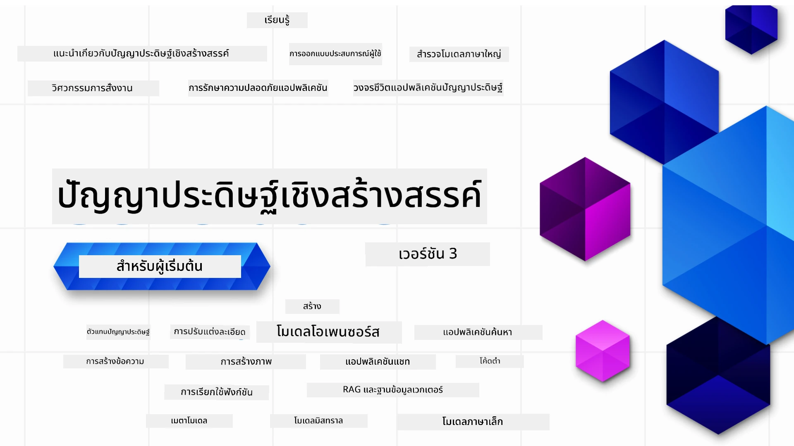

### 21 บทเรียนสอนทุกสิ่งที่คุณต้องรู้เพื่อเริ่มสร้างแอปพลิเคชัน Generative AI

[](https://github.com/microsoft/Generative-AI-For-Beginners/blob/master/LICENSE?WT.mc_id=academic-105485-koreyst)
[](https://GitHub.com/microsoft/Generative-AI-For-Beginners/graphs/contributors/?WT.mc_id=academic-105485-koreyst)
[](https://GitHub.com/microsoft/Generative-AI-For-Beginners/issues/?WT.mc_id=academic-105485-koreyst)
[](https://GitHub.com/microsoft/Generative-AI-For-Beginners/pulls/?WT.mc_id=academic-105485-koreyst)
[](http://makeapullrequest.com?WT.mc_id=academic-105485-koreyst)

[](https://GitHub.com/microsoft/Generative-AI-For-Beginners/watchers/?WT.mc_id=academic-105485-koreyst)
[](https://GitHub.com/microsoft/Generative-AI-For-Beginners/network/?WT.mc_id=academic-105485-koreyst)
[](https://GitHub.com/microsoft/Generative-AI-For-Beginners/stargazers/?WT.mc_id=academic-105485-koreyst)

[](https://discord.gg/nTYy5BXMWG)

### 🌐 รองรับหลายภาษา

#### รองรับผ่าน GitHub Action (อัตโนมัติและเป็นปัจจุบันอยู่เสมอ)

<!-- CO-OP TRANSLATOR LANGUAGES TABLE START -->
[อาหรับ](../ar/README.md) | [เบงกาลี](../bn/README.md) | [บัลแกเรีย](../bg/README.md) | [พม่า (เมียนมา)](../my/README.md) | [จีน (ตัวย่อ)](../zh-CN/README.md) | [จีน (ตัวเต็ม, ฮ่องกง)](../zh-HK/README.md) | [จีน (ตัวเต็ม, มาเก๊า)](../zh-MO/README.md) | [จีน (ตัวเต็ม, ไต้หวัน)](../zh-TW/README.md) | [โครเอเชีย](../hr/README.md) | [เช็ก](../cs/README.md) | [เดนมาร์ก](../da/README.md) | [ดัตช์](../nl/README.md) | [เอสโตเนีย](../et/README.md) | [ฟินแลนด์](../fi/README.md) | [ฝรั่งเศส](../fr/README.md) | [เยอรมัน](../de/README.md) | [กรีก](../el/README.md) | [ฮีบรู](../he/README.md) | [ฮินดี](../hi/README.md) | [ฮังการี](../hu/README.md) | [อินโดนีเซีย](../id/README.md) | [อิตาลี](../it/README.md) | [ญี่ปุ่น](../ja/README.md) | [กันนาดา](../kn/README.md) | [เขมร](../km/README.md) | [เกาหลี](../ko/README.md) | [ลิทัวเนีย](../lt/README.md) | [มาเลย์](../ms/README.md) | [มาลายาลัม](../ml/README.md) | [มาราธี](../mr/README.md) | [เนปาล](../ne/README.md) | [ไนจีเรีย พิดจิน](../pcm/README.md) | [นอร์เวย์](../no/README.md) | [เปอร์เซีย (ฟาร์ซี)](../fa/README.md) | [โปแลนด์](../pl/README.md) | [โปรตุเกส (บราซิล)](../pt-BR/README.md) | [โปรตุเกส (โปรตุเกส)](../pt-PT/README.md) | [ปัญจาบ (กุรมุขี)](../pa/README.md) | [โรมาเนีย](../ro/README.md) | [รัสเซีย](../ru/README.md) | [เซอร์เบีย (ซีริลลิก)](../sr/README.md) | [สโลวัค](../sk/README.md) | [สโลวีเนีย](../sl/README.md) | [สเปน](../es/README.md) | [สวาฮิลี](../sw/README.md) | [สวีเดน](../sv/README.md) | [ทากาล็อก (ฟิลิปปินส์)](../tl/README.md) | [ทมิฬ](../ta/README.md) | [เตลูกู](../te/README.md) | [ไทย](./README.md) | [ตุรกี](../tr/README.md) | [ยูเครน](../uk/README.md) | [อูรดู](../ur/README.md) | [เวียดนาม](../vi/README.md)

> **ต้องการโคลนในเครื่อง?**
>
> ที่เก็บนี้รวมการแปลมากกว่า 50 ภาษา ซึ่งเพิ่มขนาดการดาวน์โหลดอย่างมาก หากต้องการโคลนโดยไม่มีการแปล ให้ใช้การตรวจสอบแบบกระจาย:
>
> **Bash / macOS / Linux:**
> ```bash
> git clone --filter=blob:none --sparse https://github.com/microsoft/generative-ai-for-beginners.git
> cd generative-ai-for-beginners
> git sparse-checkout set --no-cone '/*' '!translations' '!translated_images'
> ```
>
> **CMD (Windows):**
> ```cmd
> git clone --filter=blob:none --sparse https://github.com/microsoft/generative-ai-for-beginners.git
> cd generative-ai-for-beginners
> git sparse-checkout set --no-cone "/*" "!translations" "!translated_images"
> ```
>
> สิ่งนี้จะให้ทุกอย่างที่คุณต้องการเพื่อทำหลักสูตรให้เสร็จอย่างรวดเร็วขึ้นมาก
<!-- CO-OP TRANSLATOR LANGUAGES TABLE END -->

# Generative AI สำหรับผู้เริ่มต้น (รุ่น 3) - หลักสูตร

เรียนรู้พื้นฐานการสร้างแอปพลิเคชัน Generative AI กับหลักสูตร 21 บทเรียนโดย Microsoft Cloud Advocates

## 🌱 เริ่มต้น

หลักสูตรนี้มี 21 บทเรียน แต่ละบทเรียนครอบคลุมหัวข้อของตนเอง ดังนั้นเริ่มต้นได้จากที่คุณต้องการ!

บทเรียนจะถูกติดป้ายเป็น "เรียนรู้" ซึ่งอธิบายแนวคิด Generative AI หรือ "สร้าง" ซึ่งอธิบายแนวคิดและตัวอย่างโค้ดใน **Python** และ **TypeScript** เมื่อเป็นไปได้

สำหรับนักพัฒนา .NET โปรดดู [Generative AI สำหรับผู้เริ่มต้น (รุ่น .NET)](https://github.com/microsoft/Generative-AI-for-beginners-dotnet?WT.mc_id=academic-105485-koreyst)!

แต่ละบทเรียนยังมีส่วน "เรียนรู้ต่อ" พร้อมเครื่องมือการเรียนรู้เพิ่มเติม

## สิ่งที่คุณต้องมี
### เพื่อรันโค้ดในหลักสูตรนี้ คุณสามารถใช้ได้ทั้ง:
 - [บริการ Azure OpenAI](https://aka.ms/genai-beginners/azure-open-ai?WT.mc_id=academic-105485-koreyst) - **บทเรียน:** "aoai-assignment"
 - [โมเดล Microsoft Foundry](https://ai.azure.com/catalog/models?WT.mc_id=academic-105485-koreyst) - **บทเรียน:** "githubmodels" (GitHub Models จะหยุดให้บริการปลายเดือนกรกฎาคม 2026 - กรุณาใช้ Microsoft Foundry Models แทน)
 - [API OpenAI](https://aka.ms/genai-beginners/open-ai?WT.mc_id=academic-105485-koreyst) - **บทเรียน:** "oai-assignment"
 - [Foundry Local](https://foundrylocal.ai?WT.mc_id=academic-105485-koreyst) - รันโมเดลแบบออฟไลน์เต็มรูปแบบบนอุปกรณ์ของคุณเอง ไม่ต้องสมัครสมาชิกคลาวด์
   
- ความรู้พื้นฐานของ Python หรือ TypeScript จะช่วยได้ - \*สำหรับผู้เริ่มต้นอย่างแท้จริง โปรดดูหลักสูตร [Python](https://aka.ms/genai-beginners/python?WT.mc_id=academic-105485-koreyst) และ [TypeScript](https://aka.ms/genai-beginners/typescript?WT.mc_id=academic-105485-koreyst)
- บัญชี GitHub สำหรับ [fork ที่เก็บทั้งหมดนี้](https://aka.ms/genai-beginners/github?WT.mc_id=academic-105485-koreyst) ไปยังบัญชี GitHub ของคุณเอง

เราได้สร้างบทเรียน **[การตั้งค่าหลักสูตร](./00-course-setup/README.md?WT.mc_id=academic-105485-koreyst)** เพื่อช่วยคุณตั้งค่าสภาพแวดล้อมการพัฒนา

อย่าลืม [กดดาว (🌟) ที่ที่เก็บนี้](https://docs.github.com/en/get-started/exploring-projects-on-github/saving-repositories-with-stars?WT.mc_id=academic-105485-koreyst) เพื่อหาง่ายขึ้นในภายหลัง

## 🧠 พร้อมที่จะใช้งานหรือยัง?

หากคุณกำลังมองหาตัวอย่างโค้ดขั้นสูงเพิ่มเติม โปรดดู [ชุดตัวอย่างโค้ด Generative AI ของเรา](https://aka.ms/genai-beg-code?WT.mc_id=academic-105485-koreyst) ในทั้ง **Python** และ **TypeScript**

## 🗣️ พบผู้เรียนคนอื่น ๆ รับคำช่วยเหลือ

เข้าร่วม [เซิร์ฟเวอร์ Microsoft Foundry Discord อย่างเป็นทางการ](https://aka.ms/genai-discord?WT.mc_id=academic-105485-koreyst) เพื่อพบปะและสร้างเครือข่ายกับผู้เรียนที่เข้าร่วมหลักสูตรนี้และรับการช่วยเหลือ

ถามคำถามหรือแบ่งปันความคิดเห็นเกี่ยวกับผลิตภัณฑ์ใน [ฟอรัมสำหรับนักพัฒนา Microsoft Foundry](https://aka.ms/azureaifoundry/forum) บน Github

## 🚀 กำลังสร้างสตาร์ทอัพ?

เยี่ยมชม [Microsoft for Startups](https://www.microsoft.com/startups) เพื่อดูวิธีเริ่มต้นสร้างด้วยเครดิต Azure วันนี้

## 🙏 ต้องการช่วยไหม?

คุณมีข้อเสนอแนะหรือพบข้อผิดพลาดของการสะกดหรือโค้ดไหม? [แจ้งปัญหา](https://github.com/microsoft/generative-ai-for-beginners/issues?WT.mc_id=academic-105485-koreyst) หรือ [สร้างคำขอดึง](https://github.com/microsoft/generative-ai-for-beginners/pulls?WT.mc_id=academic-105485-koreyst)

## 📂 แต่ละบทเรียนประกอบด้วย:

- วิดีโอแนะนำสั้น ๆ เกี่ยวกับหัวข้อ
- บทเรียนเป็นลายลักษณ์อักษรที่อยู่ใน README
- ตัวอย่างโค้ด Python และ TypeScript รองรับ Azure OpenAI และ OpenAI API
- ลิงก์ไปยังแหล่งข้อมูลเพิ่มเติมเพื่อเรียนรู้ต่อ

## 🗃️ บทเรียน

| #   | **ลิงก์บทเรียน**                                                                                                                              | **คำอธิบาย**                                                                                 | **วิดีโอ**                                                                   | **การเรียนรู้เสริม**                                                             |
| --- | -------------------------------------------------------------------------------------------------------------------------------------------- | ----------------------------------------------------------------------------------------------- | --------------------------------------------------------------------------- | ------------------------------------------------------------------------------ |
| 00  | [การตั้งค่าหลักสูตร](./00-course-setup/README.md?WT.mc_id=academic-105485-koreyst)                                                                 | **เรียนรู้:** วิธีการตั้งค่าสภาพแวดล้อมการพัฒนา                                            | วิดีโอกำลังมาเร็ว ๆ นี้                                                                 | [เรียนรู้เพิ่ม](https://aka.ms/genai-collection?WT.mc_id=academic-105485-koreyst) |
| 01  | [บทนำสู่ Generative AI และ LLMs](./01-introduction-to-genai/README.md?WT.mc_id=academic-105485-koreyst)                              | **เรียนรู้:** เข้าใจว่า Generative AI คืออะไร และโมเดลภาษาขนาดใหญ่ (LLMs) ทำงานอย่างไร       | [วิดีโอ](https://aka.ms/gen-ai-lesson-1-gh?WT.mc_id=academic-105485-koreyst) | [เรียนรู้เพิ่ม](https://aka.ms/genai-collection?WT.mc_id=academic-105485-koreyst) |
| 02  | [การสำรวจและเปรียบเทียบ LLMs ต่าง ๆ](./02-exploring-and-comparing-different-llms/README.md?WT.mc_id=academic-105485-koreyst)             | **เรียนรู้:** วิธีการเลือกโมเดลที่เหมาะสมกับกรณีการใช้งานของคุณ                                      | [วิดีโอ](https://aka.ms/gen-ai-lesson2-gh?WT.mc_id=academic-105485-koreyst)  | [เรียนรู้เพิ่ม](https://aka.ms/genai-collection?WT.mc_id=academic-105485-koreyst) |
| 03  | [การใช้ Generative AI อย่างรับผิดชอบ](./03-using-generative-ai-responsibly/README.md?WT.mc_id=academic-105485-koreyst)                           | **เรียนรู้:** วิธีการสร้างแอปพลิเคชัน Generative AI อย่างมีความรับผิดชอบ                                  | [วิดีโอ](https://aka.ms/gen-ai-lesson3-gh?WT.mc_id=academic-105485-koreyst)  | [เรียนรู้เพิ่ม](https://aka.ms/genai-collection?WT.mc_id=academic-105485-koreyst) |

| 04  | [ความเข้าใจพื้นฐานเกี่ยวกับ Prompt Engineering](./04-prompt-engineering-fundamentals/README.md?WT.mc_id=academic-105485-koreyst)             | **เรียนรู้:** แนวปฏิบัติที่ดีที่สุดในการทำ Prompt Engineering ด้วยตนเอง                                       | [วิดีโอ](https://aka.ms/gen-ai-lesson4-gh?WT.mc_id=academic-105485-koreyst)  | [เรียนรู้เพิ่มเติม](https://aka.ms/genai-collection?WT.mc_id=academic-105485-koreyst) |
| 05  | [การสร้าง Prompt ขั้นสูง](./05-advanced-prompts/README.md?WT.mc_id=academic-105485-koreyst)                                                | **เรียนรู้:** วิธีการใช้เทคนิค prompt engineering เพื่อปรับปรุงผลลัพธ์ของ prompt ของคุณ                   | [วิดีโอ](https://aka.ms/gen-ai-lesson5-gh?WT.mc_id=academic-105485-koreyst)  | [เรียนรู้เพิ่มเติม](https://aka.ms/genai-collection?WT.mc_id=academic-105485-koreyst) |
| 06  | [การสร้างแอปพลิเคชันสร้างข้อความ](./06-text-generation-apps/README.md?WT.mc_id=academic-105485-koreyst)                                | **สร้าง:** แอปพลิเคชันสร้างข้อความโดยใช้ Azure OpenAI / OpenAI API                                      | [วิดีโอ](https://aka.ms/gen-ai-lesson6-gh?WT.mc_id=academic-105485-koreyst)  | [เรียนรู้เพิ่มเติม](https://aka.ms/genai-collection?WT.mc_id=academic-105485-koreyst) |
| 07  | [การสร้างแอปพลิเคชันแชท](./07-building-chat-applications/README.md?WT.mc_id=academic-105485-koreyst)                                     | **สร้าง:** เทคนิคสำหรับการสร้างและผสานแอปพลิเคชันแชทอย่างมีประสิทธิภาพ                                | [วิดีโอ](https://aka.ms/gen-ai-lessons7-gh?WT.mc_id=academic-105485-koreyst) | [เรียนรู้เพิ่มเติม](https://aka.ms/genai-collection?WT.mc_id=academic-105485-koreyst) |
| 08  | [การสร้างแอปพลิเคชันค้นหาข้อมูลด้วยฐานข้อมูลเวกเตอร์](./08-building-search-applications/README.md?WT.mc_id=academic-105485-koreyst)                        | **สร้าง:** แอปค้นหาที่ใช้ Embeddings เพื่อค้นหาข้อมูล                                                  | [วิดีโอ](https://aka.ms/gen-ai-lesson8-gh?WT.mc_id=academic-105485-koreyst)  | [เรียนรู้เพิ่มเติม](https://aka.ms/genai-collection?WT.mc_id=academic-105485-koreyst) |
| 09  | [การสร้างแอปพลิเคชันสร้างภาพ](./09-building-image-applications/README.md?WT.mc_id=academic-105485-koreyst)                        | **สร้าง:** แอปพลิเคชันสร้างภาพ                                                                           | [วิดีโอ](https://aka.ms/gen-ai-lesson9-gh?WT.mc_id=academic-105485-koreyst)  | [เรียนรู้เพิ่มเติม](https://aka.ms/genai-collection?WT.mc_id=academic-105485-koreyst) |
| 10  | [การสร้างแอปพลิเคชัน AI ด้วย Low Code](./10-building-low-code-ai-applications/README.md?WT.mc_id=academic-105485-koreyst)                       | **สร้าง:** แอปพลิเคชัน Generative AI โดยใช้เครื่องมือ Low Code                                        | [วิดีโอ](https://aka.ms/gen-ai-lesson10-gh?WT.mc_id=academic-105485-koreyst) | [เรียนรู้เพิ่มเติม](https://aka.ms/genai-collection?WT.mc_id=academic-105485-koreyst) |
| 11  | [การผสานแอปพลิเคชันภายนอกด้วย Function Calling](./11-integrating-with-function-calling/README.md?WT.mc_id=academic-105485-koreyst) | **สร้าง:** Function Calling คืออะไรและกรณีการใช้งานสำหรับแอปพลิเคชัน                                  | [วิดีโอ](https://aka.ms/gen-ai-lesson11-gh?WT.mc_id=academic-105485-koreyst) | [เรียนรู้เพิ่มเติม](https://aka.ms/genai-collection?WT.mc_id=academic-105485-koreyst) |
| 12  | [การออกแบบ UX สำหรับแอปพลิเคชัน AI](./12-designing-ux-for-ai-applications/README.md?WT.mc_id=academic-105485-koreyst)                         | **เรียนรู้:** วิธีใช้หลักการออกแบบ UX เมื่อพัฒนาแอปพลิเคชัน Generative AI                              | [วิดีโอ](https://aka.ms/gen-ai-lesson12-gh?WT.mc_id=academic-105485-koreyst) | [เรียนรู้เพิ่มเติม](https://aka.ms/genai-collection?WT.mc_id=academic-105485-koreyst) |
| 13  | [การรักษาความปลอดภัยของแอปพลิเคชัน Generative AI](./13-securing-ai-applications/README.md?WT.mc_id=academic-105485-koreyst)                         | **เรียนรู้:** ภัยคุกคามและความเสี่ยงต่อระบบ AI และวิธีการรักษาความปลอดภัยของระบบเหล่านี้           | [วิดีโอ](https://aka.ms/gen-ai-lesson13-gh?WT.mc_id=academic-105485-koreyst) | [เรียนรู้เพิ่มเติม](https://aka.ms/genai-collection?WT.mc_id=academic-105485-koreyst) |
| 14  | [วัฏจักรชีวิตของแอปพลิเคชัน Generative AI](./14-the-generative-ai-application-lifecycle/README.md?WT.mc_id=academic-105485-koreyst)           | **เรียนรู้:** เครื่องมือและตัวชี้วัดในการจัดการวงจรชีวิต LLM และ LLMOps                               | [วิดีโอ](https://aka.ms/gen-ai-lesson14-gh?WT.mc_id=academic-105485-koreyst) | [เรียนรู้เพิ่มเติม](https://aka.ms/genai-collection?WT.mc_id=academic-105485-koreyst) |
| 15  | [Retrieval Augmented Generation (RAG) และฐานข้อมูลเวกเตอร์](./15-rag-and-vector-databases/README.md?WT.mc_id=academic-105485-koreyst)        | **สร้าง:** แอปพลิเคชันโดยใช้กรอบงาน RAG ในการดึง embeddings จากฐานข้อมูลเวกเตอร์                   | [วิดีโอ](https://aka.ms/gen-ai-lesson15-gh?WT.mc_id=academic-105485-koreyst) | [เรียนรู้เพิ่มเติม](https://aka.ms/genai-collection?WT.mc_id=academic-105485-koreyst) |
| 16  | [โมเดลโอเพนซอร์สและ Hugging Face](./16-open-source-models/README.md?WT.mc_id=academic-105485-koreyst)                                    | **สร้าง:** แอปพลิเคชันโดยใช้โมเดลโอเพนซอร์สที่มีอยู่บน Hugging Face                                | [วิดีโอ](https://aka.ms/gen-ai-lesson16-gh?WT.mc_id=academic-105485-koreyst) | [เรียนรู้เพิ่มเติม](https://aka.ms/genai-collection?WT.mc_id=academic-105485-koreyst) |
| 17  | [AI Agents](./17-ai-agents/README.md?WT.mc_id=academic-105485-koreyst)                                                                       | **สร้าง:** แอปพลิเคชันโดยใช้กรอบการทำงาน AI Agent                                                    | [วิดีโอ](https://aka.ms/gen-ai-lesson17-gh?WT.mc_id=academic-105485-koreyst) | [เรียนรู้เพิ่มเติม](https://aka.ms/genai-collection?WT.mc_id=academic-105485-koreyst) |
| 18  | [การปรับแต่ง LLMs](./18-fine-tuning/README.md?WT.mc_id=academic-105485-koreyst)                                                              | **เรียนรู้:** อะไร เหตุใด และวิธีการปรับแต่ง LLMs                                                    | [วิดีโอ](https://aka.ms/gen-ai-lesson18-gh?WT.mc_id=academic-105485-koreyst) | [เรียนรู้เพิ่มเติม](https://aka.ms/genai-collection?WT.mc_id=academic-105485-koreyst) |
| 19  | [การสร้างด้วย SLMs](./19-slm/README.md?WT.mc_id=academic-105485-koreyst)                                                              | **เรียนรู้:** คุณประโยชน์ของการสร้างด้วย Small Language Models                                        | วิดีโอกำลังจะมา | [เรียนรู้เพิ่มเติม](https://aka.ms/genai-collection?WT.mc_id=academic-105485-koreyst) |
| 20  | [การสร้างด้วยโมเดล Mistral](./20-mistral/README.md?WT.mc_id=academic-105485-koreyst)                                                              | **เรียนรู้:** คุณสมบัติและความแตกต่างของโมเดลในครอบครัว Mistral                                      | วิดีโอกำลังจะมา | [เรียนรู้เพิ่มเติม](https://aka.ms/genai-collection?WT.mc_id=academic-105485-koreyst) |
| 21  | [การสร้างด้วยโมเดล Meta](./21-meta/README.md?WT.mc_id=academic-105485-koreyst)                                                              | **เรียนรู้:** คุณสมบัติและความแตกต่างของโมเดลในครอบครัว Meta                                        | วิดีโอกำลังจะมา | [เรียนรู้เพิ่มเติม](https://aka.ms/genai-collection?WT.mc_id=academic-105485-koreyst) |

### 🌟 ขอขอบคุณเป็นพิเศษ

ขอขอบคุณเป็นพิเศษแก่ [**John Aziz**](https://www.linkedin.com/in/john0isaac/) สำหรับการสร้าง GitHub Actions และเวิร์กโฟลว์ทั้งหมด

[**Bernhard Merkle**](https://www.linkedin.com/in/bernhard-merkle-738b73/) สำหรับการมีส่วนร่วมสำคัญต่อบทเรียนแต่ละบท เพื่อปรับปรุงประสบการณ์ผู้เรียนและโค้ด

## 🎒 หลักสูตรอื่น ๆ

ทีมของเราผลิตหลักสูตรอื่น ๆ อีก! ลองดูได้ที่:

<!-- CO-OP TRANSLATOR OTHER COURSES START -->
### LangChain
[](https://aka.ms/langchain4j-for-beginners)
[](https://aka.ms/langchainjs-for-beginners?WT.mc_id=m365-94501-dwahlin)
[](https://github.com/microsoft/langchain-for-beginners?WT.mc_id=m365-94501-dwahlin)
---

### Azure / Edge / MCP / Agents
[](https://github.com/microsoft/AZD-for-beginners?WT.mc_id=academic-105485-koreyst)
[](https://github.com/microsoft/edgeai-for-beginners?WT.mc_id=academic-105485-koreyst)
[](https://github.com/microsoft/mcp-for-beginners?WT.mc_id=academic-105485-koreyst)
[](https://github.com/microsoft/ai-agents-for-beginners?WT.mc_id=academic-105485-koreyst)

---
 
### ชุด Generative AI
[](https://github.com/microsoft/generative-ai-for-beginners?WT.mc_id=academic-105485-koreyst)
[-9333EA?style=for-the-badge&labelColor=E5E7EB&color=9333EA)](https://github.com/microsoft/Generative-AI-for-beginners-dotnet?WT.mc_id=academic-105485-koreyst)
[-C084FC?style=for-the-badge&labelColor=E5E7EB&color=C084FC)](https://github.com/microsoft/generative-ai-for-beginners-java?WT.mc_id=academic-105485-koreyst)

[-E879F9?style=for-the-badge&labelColor=E5E7EB&color=E879F9)](https://github.com/microsoft/generative-ai-with-javascript?WT.mc_id=academic-105485-koreyst)

---
 
### การเรียนรู้หลัก
[](https://aka.ms/ml-beginners?WT.mc_id=academic-105485-koreyst)
[](https://aka.ms/datascience-beginners?WT.mc_id=academic-105485-koreyst)
[](https://aka.ms/ai-beginners?WT.mc_id=academic-105485-koreyst)
[](https://github.com/microsoft/Security-101?WT.mc_id=academic-96948-sayoung)
[](https://aka.ms/webdev-beginners?WT.mc_id=academic-105485-koreyst)
[](https://aka.ms/iot-beginners?WT.mc_id=academic-105485-koreyst)
[](https://github.com/microsoft/xr-development-for-beginners?WT.mc_id=academic-105485-koreyst)

---
 
### ชุด Copilot
[](https://aka.ms/GitHubCopilotAI?WT.mc_id=academic-105485-koreyst)
[](https://github.com/microsoft/mastering-github-copilot-for-dotnet-csharp-developers?WT.mc_id=academic-105485-koreyst)
[](https://github.com/microsoft/CopilotAdventures?WT.mc_id=academic-105485-koreyst)
<!-- CO-OP TRANSLATOR OTHER COURSES END -->

## ขอความช่วยเหลือ

หากคุณติดขัดหรือต้องการคำถามเกี่ยวกับการสร้างแอป AI เข้าร่วมกับผู้เรียนและนักพัฒนาที่มีประสบการณ์ในชุมชน MCP ซึ่งเป็นชุมชนที่สนับสนุนซึ่งยินดีรับคำถามและแบ่งปันความรู้กันอย่างอิสระ

[](https://discord.gg/nTYy5BXMWG)

หากคุณมีคำติชมเกี่ยวกับผลิตภัณฑ์หรือพบข้อผิดพลาดขณะสร้าง สามารถเยี่ยมชมได้ที่:

[](https://aka.ms/foundry/forum)

---

<!-- CO-OP TRANSLATOR DISCLAIMER START -->
**ปฏิเสธความรับผิดชอบ**:
เอกสารนี้ได้รับการแปลโดยใช้บริการแปลภาษา AI [Co-op Translator](https://github.com/Azure/co-op-translator) ขณะที่เราพยายามให้ความถูกต้อง โปรดทราบว่าการแปลโดยอัตโนมัติอาจมีข้อผิดพลาดหรือความไม่ถูกต้อง เอกสารต้นฉบับในภาษาต้นทางควรถูกพิจารณาเป็นแหล่งข้อมูลที่เชื่อถือได้ สำหรับข้อมูลที่สำคัญ แนะนำให้ใช้การแปลโดยมนุษย์มืออาชีพ เราไม่รับผิดชอบต่อความเข้าใจผิดหรือการตีความที่ผิดพลาดที่เกิดขึ้นจากการใช้การแปลนี้
<!-- CO-OP TRANSLATOR DISCLAIMER END -->