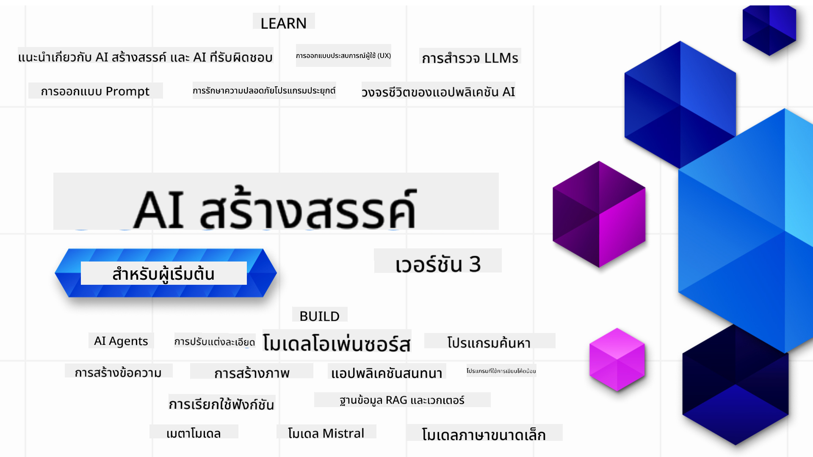

<!--
CO_OP_TRANSLATOR_METADATA:
{
  "original_hash": "6e3f4c8a4f323b8eab1cf11ded304b0f",
  "translation_date": "2025-06-25T07:58:26+00:00",
  "source_file": "README.md",
  "language_code": "th"
}
-->

### 21 บทเรียนที่สอนทุกสิ่งที่คุณต้องรู้เพื่อเริ่มต้นสร้างแอปพลิเคชัน Generative AI

### 🌐 รองรับหลายภาษา

#### รองรับผ่าน GitHub Action (อัตโนมัติและอัพเดทเสมอ)

# AI สร้างสรรค์สำหรับผู้เริ่มต้น (เวอร์ชัน 3) - หลักสูตร

เรียนรู้พื้นฐานการสร้างแอปพลิเคชัน AI สร้างสรรค์กับหลักสูตร 21 บทเรียนที่ครอบคลุมโดย Microsoft Cloud Advocates

## 🌱 เริ่มต้น

หลักสูตรนี้มีทั้งหมด 21 บทเรียน แต่ละบทเรียนครอบคลุมหัวข้อของตัวเอง ดังนั้นเริ่มต้นที่ใดก็ได้ที่คุณชอบ!

บทเรียนถูกจัดเป็นบทเรียน "Learn" ที่อธิบายแนวคิด AI สร้างสรรค์ หรือบทเรียน "Build" ที่อธิบายแนวคิดและตัวอย่างโค้ดในทั้ง **Python** และ **TypeScript** เมื่อเป็นไปได้

สำหรับนักพัฒนา .NET ลองดู [AI สร้างสรรค์สำหรับผู้เริ่มต้น (.NET Edition)](https://github.com/microsoft/Generative-AI-for-beginners-dotnet?WT.mc_id=academic-105485-koreyst)!

แต่ละบทเรียนยังมีส่วน "Keep Learning" ที่มีเครื่องมือการเรียนรู้เพิ่มเติม

## สิ่งที่คุณต้องมี
### เพื่อรันโค้ดของหลักสูตรนี้ คุณสามารถใช้:
- [Azure OpenAI Service](https://aka.ms/genai-beginners/azure-open-ai?WT.mc_id=academic-105485-koreyst) - **บทเรียน:** "aoai-assignment"
- [GitHub Marketplace Model Catalog](https://aka.ms/genai-beginners/gh-models?WT.mc_id=academic-105485-koreyst) - **บทเรียน:** "githubmodels"
- [OpenAI API](https://aka.ms/genai-beginners/open-ai?WT.mc_id=academic-105485-koreyst) - **บทเรียน:** "oai-assignment"

- ความรู้พื้นฐานของ Python หรือ TypeScript จะเป็นประโยชน์ - \*สำหรับผู้เริ่มต้นทั้งหมดลองดูหลักสูตร [Python](https://aka.ms/genai-beginners/python?WT.mc_id=academic-105485-koreyst) และ [TypeScript](https://aka.ms/genai-beginners/typescript?WT.mc_id=academic-105485-koreyst)
- บัญชี GitHub เพื่อ [fork โครงการทั้งหมดนี้](https://aka.ms/genai-beginners/github?WT.mc_id=academic-105485-koreyst) ไปยังบัญชี GitHub ของคุณเอง

เราได้สร้างบทเรียน **[Course Setup](./00-course-setup/README.md?WT.mc_id=academic-105485-koreyst)** เพื่อช่วยคุณในการตั้งค่าสภาพแวดล้อมการพัฒนา

อย่าลืม [star (🌟) โครงการนี้](https://docs.github.com/en/get-started/exploring-projects-on-github/saving-repositories-with-stars?WT.mc_id=academic-105485-koreyst) เพื่อค้นหาได้ง่ายขึ้นในภายหลัง

## 🧠 พร้อมที่จะใช้งาน?

หากคุณกำลังมองหาตัวอย่างโค้ดที่ขั้นสูงขึ้น ลองดู [คอลเลกชันตัวอย่างโค้ด AI สร้างสรรค์](https://aka.ms/genai-beg-code?WT.mc_id=academic-105485-koreyst) ในทั้ง **Python** และ **TypeScript**

## 🗣️ พบกับผู้เรียนอื่น ๆ, รับการสนับสนุน

เข้าร่วม [เซิร์ฟเวอร์ Discord ของ Azure AI Foundry](https://aka.ms/genai-discord?WT.mc_id=academic-105485-koreyst) เพื่อพบปะและสร้างเครือข่ายกับผู้เรียนอื่น ๆ ที่เข้าร่วมหลักสูตรนี้และรับการสนับสนุน

ถามคำถามหรือแชร์ความคิดเห็นเกี่ยวกับผลิตภัณฑ์ใน [ฟอรัม Azure AI Foundry Developer](https://aka.ms/azureaifoundry/forum) บน Github

## 🚀 สร้างธุรกิจสตาร์ทอัพ?

สมัคร [Microsoft for Startups Founders Hub](https://aka.ms/genai-foundershub?WT.mc_id=academic-105485-koreyst) เพื่อรับ **เครดิต OpenAI ฟรี** และสูงสุด **$150k สำหรับเครดิต Azure เพื่อเข้าถึงโมเดล OpenAI ผ่านบริการ Azure OpenAI**

## 🙏 ต้องการช่วยเหลือ?

คุณมีข้อเสนอแนะหรือพบข้อผิดพลาดในการสะกดหรือโค้ดหรือไม่? [แจ้งปัญหา](https://github.com/microsoft/generative-ai-for-beginners/issues?WT.mc_id=academic-105485-koreyst) หรือ [สร้าง pull request](https://github.com/microsoft/generative-ai-for-beginners/pulls?WT.mc_id=academic-105485-koreyst)

## 📂 แต่ละบทเรียนประกอบด้วย:

- วิดีโอแนะนำสั้น ๆ เกี่ยวกับหัวข้อ
- บทเรียนที่เขียนอยู่ใน README
- ตัวอย่างโค้ด Python และ TypeScript ที่สนับสนุน Azure OpenAI และ OpenAI API
- ลิงก์ไปยังแหล่งข้อมูลเพิ่มเติมเพื่อเรียนรู้ต่อไป

## 🗃️ บทเรียน

| #   | **ลิงก์บทเรียน**                                                                                                                              | **คำอธิบาย**                                                                                 | **วิดีโอ**                                                                   | **การเรียนรู้เพิ่มเติม**                                                             |
| --- | -------------------------------------------------------------------------------------------------------------------------------------------- | ----------------------------------------------------------------------------------------------- | --------------------------------------------------------------------------- | ------------------------------------------------------------------------------ |
| 00  | [Course Setup](./00-course-setup/README.md?WT.mc_id=academic-105485-koreyst)                                                                 | **Learn:** วิธีการตั้งค่าสภาพแวดล้อมการพัฒนาของคุณ                                            | วิดีโอเร็ว ๆ นี้                                                                 | [เรียนรู้เพิ่มเติม](https://aka.ms/genai-collection?WT.mc_id=academic-105485-koreyst) |
| 01  | [Introduction to Generative AI and LLMs](./01-introduction-to-genai/README.md?WT.mc_id=academic-105485-koreyst)                              | **Learn:** เข้าใจว่า AI สร้างสรรค์คืออะไรและโมเดลภาษาขนาดใหญ่ (LLMs) ทำงานอย่างไร       | [วิดีโอ](https://aka.ms/gen-ai-lesson-1-gh?WT.mc_id=academic-105485-koreyst) | [เรียนรู้เพิ่มเติม](https://aka.ms/genai-collection?WT.mc_id=academic-105485-koreyst) |
| 02  | [Exploring and comparing different LLMs](./02-exploring-and-comparing-different-llms/README.md?WT.mc_id=academic-105485-koreyst)             | **Learn:** วิธีการเลือกโมเดลที่เหมาะสมสำหรับการใช้งานของคุณ                                      | [วิดีโอ](https://aka.ms/gen-ai-lesson2-gh?WT.mc_id=academic-105485-koreyst)  | [เรียนรู้เพิ่มเติม](https://aka.ms/genai-collection?WT.mc_id=academic-105485-koreyst) |
| 03  | [Using Generative AI Responsibly](./03-using-generative-ai-responsibly/README.md?WT.mc_id=academic-105485-koreyst)                           | **Learn:** วิธีการสร้างแอปพลิเคชัน AI สร้างสรรค์อย่างรับผิดชอบ                                  | [วิดีโอ](https://aka.ms/gen-ai-lesson3-gh?WT.mc_id=academic-105485-koreyst)  | [เรียนรู้เพิ่มเติม](https://aka.ms/genai-collection?WT.mc_id=academic-105485-koreyst) |
| 04  | [Understanding Prompt Engineering Fundamentals](./04-prompt-engineering-fundamentals/README.md?WT.mc_id=academic-105485-koreyst)             | **Learn:** ปฏิบัติจริงกับการออกแบบ Prompt ที่ดีที่สุด                                           | [วิดีโอ](https://aka.ms/gen-ai-lesson4-gh?WT.mc_id=academic-105485-koreyst)  | [เรียนรู้เพิ่มเติม](https://aka.ms/genai-collection?WT.mc_id=academic-105485-koreyst) |
| 05  | [การสร้าง Prompt ขั้นสูง](./05-advanced-prompts/README.md?WT.mc_id=academic-105485-koreyst)                                                | **เรียนรู้:** วิธีการใช้เทคนิคการออกแบบ prompt เพื่อปรับปรุงผลลัพธ์ของ prompt ของคุณ | [วิดีโอ](https://aka.ms/gen-ai-lesson5-gh?WT.mc_id=academic-105485-koreyst)  | [เรียนรู้เพิ่มเติม](https://aka.ms/genai-collection?WT.mc_id=academic-105485-koreyst) |
| 06  | [การสร้างแอปพลิเคชันสร้างข้อความ](./06-text-generation-apps/README.md?WT.mc_id=academic-105485-koreyst)                                | **สร้าง:** แอปพลิเคชันสร้างข้อความโดยใช้ Azure OpenAI / OpenAI API                                | [วิดีโอ](https://aka.ms/gen-ai-lesson6-gh?WT.mc_id=academic-105485-koreyst)  | [เรียนรู้เพิ่มเติม](https://aka.ms/genai-collection?WT.mc_id=academic-105485-koreyst) |
| 07  | [การสร้างแอปพลิเคชันแชท](./07-building-chat-applications/README.md?WT.mc_id=academic-105485-koreyst)                                     | **สร้าง:** เทคนิคในการสร้างและรวมแอปพลิเคชันแชทอย่างมีประสิทธิภาพ               | [วิดีโอ](https://aka.ms/gen-ai-lessons7-gh?WT.mc_id=academic-105485-koreyst) | [เรียนรู้เพิ่มเติม](https://aka.ms/genai-collection?WT.mc_id=academic-105485-koreyst) |
| 08  | [การสร้างแอปค้นหาและฐานข้อมูลเวกเตอร์](./08-building-search-applications/README.md?WT.mc_id=academic-105485-koreyst)                        | **สร้าง:** แอปพลิเคชันค้นหาที่ใช้ Embeddings ในการค้นหาข้อมูล                        | [วิดีโอ](https://aka.ms/gen-ai-lesson8-gh?WT.mc_id=academic-105485-koreyst)  | [เรียนรู้เพิ่มเติม](https://aka.ms/genai-collection?WT.mc_id=academic-105485-koreyst) |
| 09  | [การสร้างแอปพลิเคชันสร้างภาพ](./09-building-image-applications/README.md?WT.mc_id=academic-105485-koreyst)                        | **สร้าง:** แอปพลิเคชันสร้างภาพ                                                       | [วิดีโอ](https://aka.ms/gen-ai-lesson9-gh?WT.mc_id=academic-105485-koreyst)  | [เรียนรู้เพิ่มเติม](https://aka.ms/genai-collection?WT.mc_id=academic-105485-koreyst) |
| 10  | [การสร้างแอปพลิเคชัน AI ด้วย Low Code](./10-building-low-code-ai-applications/README.md?WT.mc_id=academic-105485-koreyst)                       | **สร้าง:** แอปพลิเคชัน Generative AI โดยใช้เครื่องมือ Low Code                                     | [วิดีโอ](https://aka.ms/gen-ai-lesson10-gh?WT.mc_id=academic-105485-koreyst) | [เรียนรู้เพิ่มเติม](https://aka.ms/genai-collection?WT.mc_id=academic-105485-koreyst) |
| 11  | [การรวมแอปพลิเคชันภายนอกด้วยการเรียกฟังก์ชัน](./11-integrating-with-function-calling/README.md?WT.mc_id=academic-105485-koreyst) | **สร้าง:** การเรียกฟังก์ชันคืออะไรและกรณีการใช้งานในแอปพลิเคชัน                          | [วิดีโอ](https://aka.ms/gen-ai-lesson11-gh?WT.mc_id=academic-105485-koreyst) | [เรียนรู้เพิ่มเติม](https://aka.ms/genai-collection?WT.mc_id=academic-105485-koreyst) |
| 12  | [การออกแบบ UX สำหรับแอปพลิเคชัน AI](./12-designing-ux-for-ai-applications/README.md?WT.mc_id=academic-105485-koreyst)                         | **เรียนรู้:** วิธีการใช้หลักการออกแบบ UX เมื่อพัฒนาแอปพลิเคชัน Generative AI         | [วิดีโอ](https://aka.ms/gen-ai-lesson12-gh?WT.mc_id=academic-105485-koreyst) | [เรียนรู้เพิ่มเติม](https://aka.ms/genai-collection?WT.mc_id=academic-105485-koreyst) |
| 13  | [การรักษาความปลอดภัยแอปพลิเคชัน Generative AI ของคุณ](./13-securing-ai-applications/README.md?WT.mc_id=academic-105485-koreyst)                         | **เรียนรู้:** ภัยคุกคามและความเสี่ยงต่อระบบ AI และวิธีการรักษาความปลอดภัยของระบบเหล่านี้             | [วิดีโอ](https://aka.ms/gen-ai-lesson13-gh?WT.mc_id=academic-105485-koreyst) | [เรียนรู้เพิ่มเติม](https://aka.ms/genai-collection?WT.mc_id=academic-105485-koreyst) |
| 14  | [วงจรชีวิตของแอปพลิเคชัน Generative AI](./14-the-generative-ai-application-lifecycle/README.md?WT.mc_id=academic-105485-koreyst)           | **เรียนรู้:** เครื่องมือและตัวชี้วัดในการจัดการวงจรชีวิต LLM และ LLMOps                         | [วิดีโอ](https://aka.ms/gen-ai-lesson14-gh?WT.mc_id=academic-105485-koreyst) | [เรียนรู้เพิ่มเติม](https://aka.ms/genai-collection?WT.mc_id=academic-105485-koreyst) |
| 15  | [การสร้างสรรค์ด้วยการค้นคืน (RAG) และฐานข้อมูลเวกเตอร์](./15-rag-and-vector-databases/README.md?WT.mc_id=academic-105485-koreyst)        | **สร้าง:** แอปพลิเคชันโดยใช้ RAG Framework เพื่อดึง embeddings จากฐานข้อมูลเวกเตอร์  | [วิดีโอ](https://aka.ms/gen-ai-lesson15-gh?WT.mc_id=academic-105485-koreyst) | [เรียนรู้เพิ่มเติม](https://aka.ms/genai-collection?WT.mc_id=academic-105485-koreyst) |
| 16  | [โมเดลโอเพ่นซอร์สและ Hugging Face](./16-open-source-models/README.md?WT.mc_id=academic-105485-koreyst)                                    | **สร้าง:** แอปพลิเคชันโดยใช้โมเดลโอเพ่นซอร์สที่มีอยู่บน Hugging Face                    | [วิดีโอ](https://aka.ms/gen-ai-lesson16-gh?WT.mc_id=academic-105485-koreyst) | [เรียนรู้เพิ่มเติม](https://aka.ms/genai-collection?WT.mc_id=academic-105485-koreyst) |
| 17  | [ตัวแทน AI](./17-ai-agents/README.md?WT.mc_id=academic-105485-koreyst)                                                                       | **สร้าง:** แอปพลิเคชันโดยใช้ AI Agent Framework                                           | [วิดีโอ](https://aka.ms/gen-ai-lesson17-gh?WT.mc_id=academic-105485-koreyst) | [เรียนรู้เพิ่มเติม](https://aka.ms/genai-collection?WT.mc_id=academic-105485-koreyst) |
| 18  | [การปรับแต่ง LLMs](./18-fine-tuning/README.md?WT.mc_id=academic-105485-koreyst)                                                              | **เรียนรู้:** สิ่งที่ต้องรู้และวิธีการปรับแต่ง LLMs                                            | [วิดีโอ](https://aka.ms/gen-ai-lesson18-gh?WT.mc_id=academic-105485-koreyst) | [เรียนรู้เพิ่มเติม](https://aka.ms/genai-collection?WT.mc_id=academic-105485-koreyst) |
| 19  | [การสร้างด้วย SLMs](./19-slm/README.md?WT.mc_id=academic-105485-koreyst)                                                              | **เรียนรู้:** ประโยชน์ของการสร้างด้วยโมเดลภาษาขนาดเล็ก                                            | วิดีโอเร็ว ๆ นี้ | [เรียนรู้เพิ่มเติม](https://aka.ms/genai-collection?WT.mc_id=academic-105485-koreyst) |
| 20  | [การสร้างด้วยโมเดล Mistral](./20-mistral/README.md?WT.mc_id=academic-105485-koreyst)                                                              | **เรียนรู้:** คุณสมบัติและความแตกต่างของโมเดลในตระกูล Mistral                                           | วิดีโอเร็ว ๆ นี้ | [เรียนรู้เพิ่มเติม](https://aka.ms/genai-collection?WT.mc_id=academic-105485-koreyst) |
| 21  | [การสร้างด้วยโมเดล Meta](./21-meta/README.md?WT.mc_id=academic-105485-koreyst)                                                              | **เรียนรู้:** คุณสมบัติและความแตกต่างของโมเดลในตระกูล Meta                                           | วิดีโอเร็ว ๆ นี้ | [เรียนรู้เพิ่มเติม](https://aka.ms/genai-collection?WT.mc_id=academic-105485-koreyst) |

### 🌟 ขอบคุณเป็นพิเศษ

ขอบคุณเป็นพิเศษสำหรับ [**John Aziz**](https://www.linkedin.com/in/john0isaac/) ที่สร้าง GitHub Actions และ workflows ทั้งหมด

[**Bernhard Merkle**](https://www.linkedin.com/in/bernhard-merkle-738b73/) ที่มีส่วนสำคัญในการพัฒนาบทเรียนแต่ละบทเพื่อปรับปรุงประสบการณ์ของผู้เรียนและโค้ด

## 🎒 หลักสูตรอื่น ๆ

ทีมของเรามีหลักสูตรอื่น ๆ ด้วย! ลองดู:

- [**ใหม่** Model Context Protocol สำหรับผู้เริ่มต้น](https://github.com/microsoft/mcp-for-beginners?WT.mc_id=academic-105485-koreyst)
- [AI Agents สำหรับผู้เริ่มต้น](https://github.com/microsoft/ai-agents-for-beginners?WT.mc_id=academic-105485-koreyst)
- [Generative AI สำหรับผู้เริ่มต้นโดยใช้ .NET](https://github.com/microsoft/Generative-AI-for-beginners-dotnet?WT.mc_id=academic-105485-koreyst)
- [Generative AI สำหรับผู้เริ่มต้นโดยใช้ JavaScript](https://aka.ms/genai-js-course?WT.mc_id=academic-105485-koreyst)
- [ML สำหรับผู้เริ่มต้น](https://aka.ms/ml-beginners?WT.mc_id=academic-105485-koreyst)
- [Data Science สำหรับผู้เริ่มต้น](https://aka.ms/datascience-beginners?WT.mc_id=academic-105485-koreyst)
- [AI สำหรับผู้เริ่มต้น](https://aka.ms/ai-beginners?WT.mc_id=academic-105485-koreyst)
- [ความปลอดภัยไซเบอร์สำหรับผู้เริ่มต้น](https://github.com/microsoft/Security-101??WT.mc_id=academic-96948-sayoung)
- [การพัฒนาเว็บสำหรับผู้เริ่มต้น](https://aka.ms/webdev-beginners?WT.mc_id=academic-105485-koreyst)
- [IoT สำหรับผู้เริ่มต้น](https://aka.ms/iot-beginners?WT.mc_id=academic-105485-koreyst)
- [การพัฒนา XR สำหรับผู้เริ่มต้น](https://github.com/microsoft/xr-development-for-beginners?WT.mc_id=academic-105485-koreyst)
- [การใช้ GitHub Copilot อย่างเชี่ยวชาญสำหรับการเขียนโปรแกรมคู่ AI](https://aka.ms/GitHubCopilotAI?WT.mc_id=academic-105485-koreyst)
- [การใช้ GitHub Copilot อย่างเชี่ยวชาญสำหรับนักพัฒนา C#/.NET](https://github.com/microsoft/mastering-github-copilot-for-dotnet-csharp-developers?WT.mc_id=academic-105485-koreyst)
- [ผจญภัยกับ Copilot ในแบบของคุณ](https://github.com/microsoft/CopilotAdventures?WT.mc_id=academic-105485-koreyst)

**ข้อจำกัดความรับผิดชอบ**:  
เอกสารนี้ได้รับการแปลโดยใช้บริการแปลด้วย AI [Co-op Translator](https://github.com/Azure/co-op-translator) แม้ว่าเราจะพยายามให้การแปลมีความถูกต้อง แต่โปรดทราบว่าการแปลอัตโนมัติอาจมีข้อผิดพลาดหรือความไม่ถูกต้อง เอกสารต้นฉบับในภาษาพื้นเมืองควรถือเป็นแหล่งข้อมูลที่เชื่อถือได้ สำหรับข้อมูลที่สำคัญ ขอแนะนำให้ใช้การแปลโดยมนุษย์ที่มีความเชี่ยวชาญ เราไม่รับผิดชอบต่อความเข้าใจผิดหรือการตีความผิดที่เกิดจากการใช้การแปลนี้