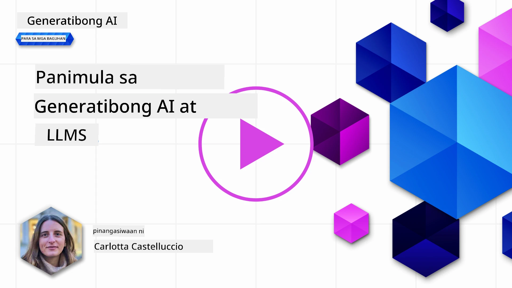
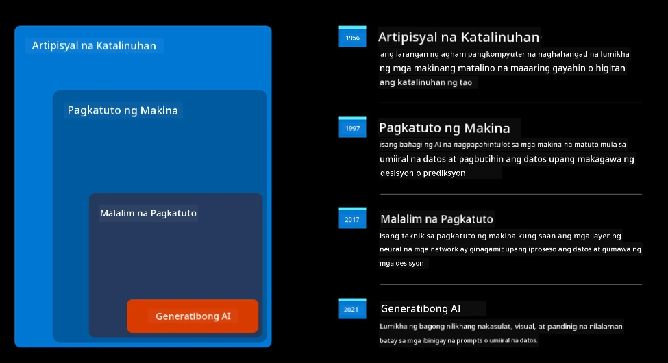
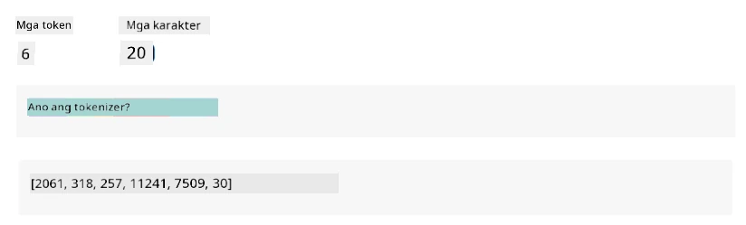
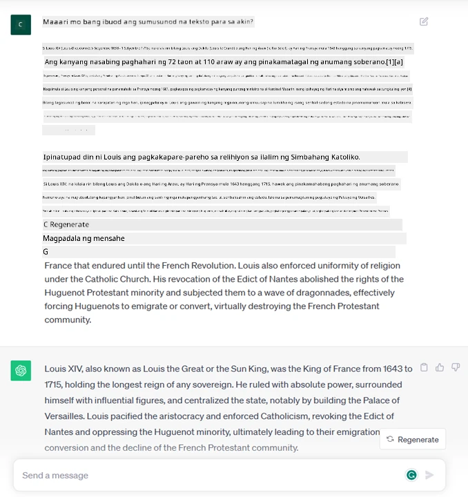
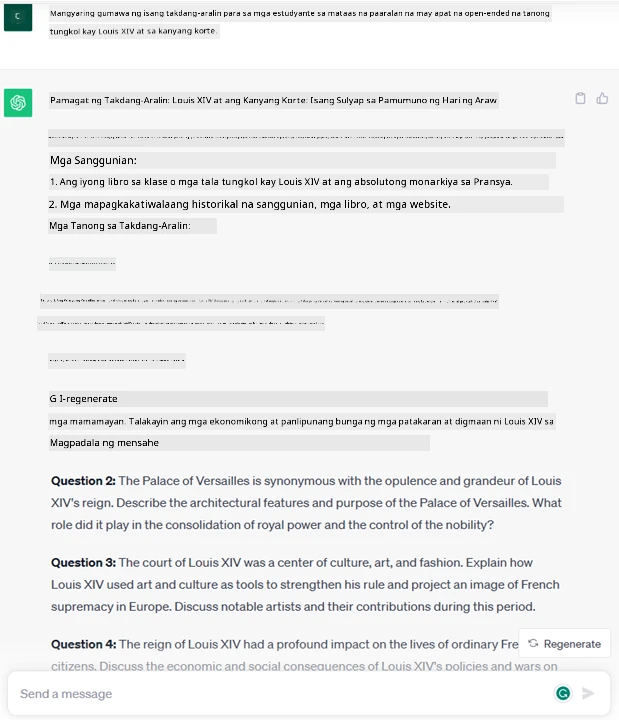
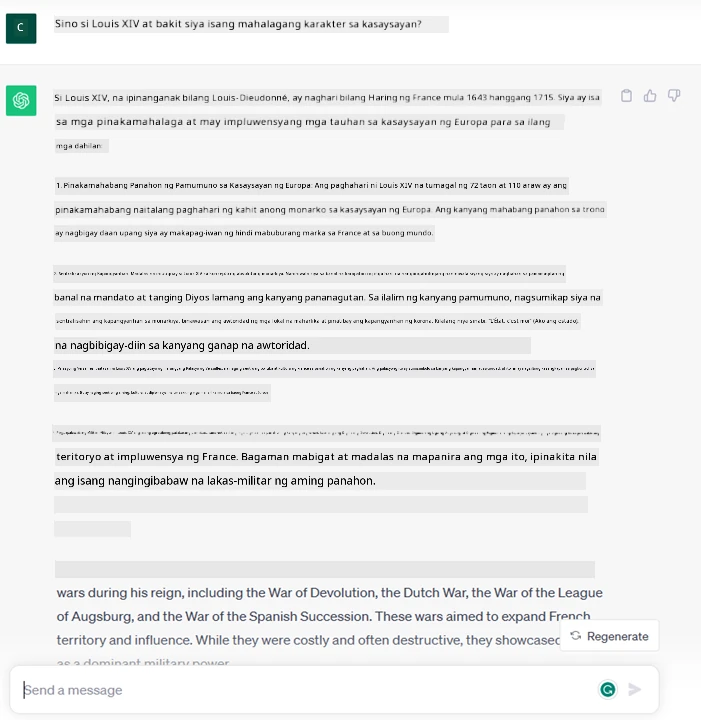
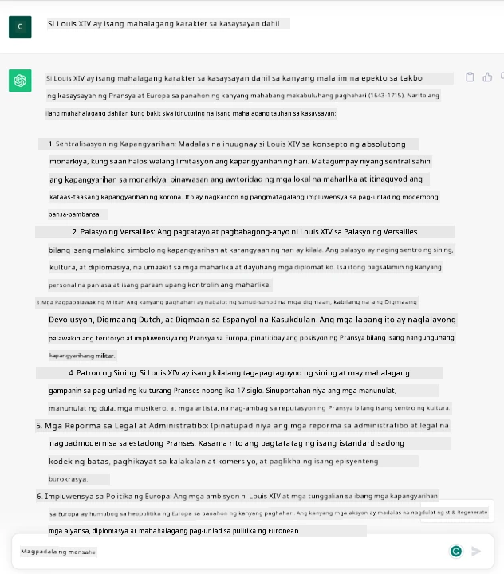
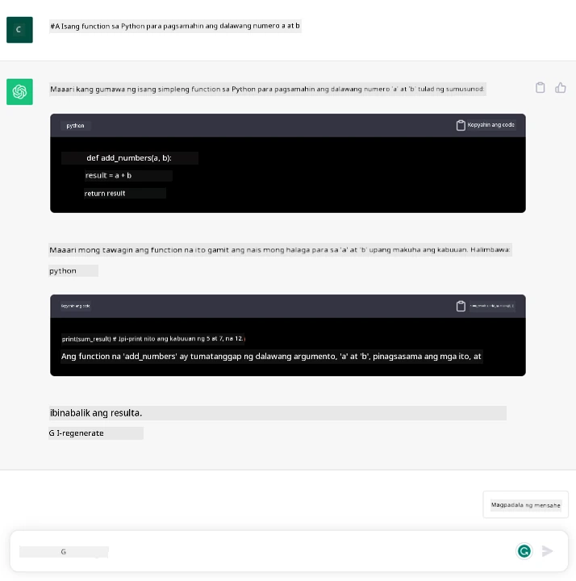

# Panimula sa Generative AI at Malalaking Modelo ng Wika

_(I-click ang larawan sa itaas upang panoorin ang video ng araling ito)_

Ang Generative AI ay artipisyal na intelihensiya na may kakayahang lumikha ng teksto, larawan, at iba pang uri ng nilalaman. Ang nagpapahanga rito bilang teknolohiya ay pinalalawak nito ang AI, kahit sino ay maaaring gumamit nito gamit lamang ang isang prompt na teksto, isang pangungusap na isinulat sa natural na wika. Hindi mo na kailangang matutunan ang isang wika tulad ng Java o SQL para makagawa ng kapaki-pakinabang na bagay, ang kailangan mo lang ay gamitin ang iyong wika, ipahayag kung ano ang gusto mo at lalabas ang mungkahi mula sa isang modelo ng AI. Malaki ang mga aplikasyon at epekto nito, nakapagsusulat o nakakaunawa ka ng mga ulat, nakapagsusulat ng mga aplikasyon at marami pang iba, lahat ito ay nagagawa sa loob ng ilang segundo.

Sa kurikulum na ito, susuriin natin kung paano ginagamit ng aming startup ang generative AI upang buksan ang mga bagong sitwasyon sa mundo ng edukasyon at kung paano namin hinaharap ang mga hindi maiiwasang hamon na kaugnay ng mga sosyal na implikasyon ng aplikasyon nito at mga limitasyon ng teknolohiya.

## Panimula

Tatalakayin sa araling ito ang:

- Panimula sa senaryong pang-negosyo: ang ideya at misyon ng aming startup.
- Generative AI at paano namin naabot ang kasalukuyang teknolohikal na kalakaran.
- Paano gumagana ang isang malaking modelo ng wika.
- Pangunahing kakayahan at praktikal na mga halimbawa ng paggamit ng Malalaking Modelo ng Wika.

## Mga Layunin sa Pagkatuto

Pagkatapos makumpleto ang araling ito, mauunawaan mo:

- Ano ang generative AI at paano gumagana ang Malalaking Modelo ng Wika.
- Paano mo magagamit ang malalaking modelo ng wika para sa iba't ibang mga kaso ng paggamit, na may pagtutok sa mga senaryo sa edukasyon.

## Senaryo: ang aming pang-edukasyong startup

Ang Generative Artificial Intelligence (AI) ay sumasakatawan sa rurok ng teknolohiya ng AI, na itinutulak ang mga hangganan ng dating imposible. Mayroong maraming kakayahan at aplikasyon ang mga generative AI model, ngunit sa kurikulum na ito, susuriin natin kung paano nito binabago ang edukasyon sa pamamagitan ng isang kathang-isip na startup. Tatawagin natin itong _aming startup_. Ang aming startup ay gumagana sa larangan ng edukasyon na may matayog na pahayag ng misyon na

> _pagpapabuti ng accessibility sa pagkatuto, sa pandaigdigang antas, tinitiyak ang patas na pag-access sa edukasyon at nagbibigay ng personalisadong karanasan sa pagkatuto sa bawat mag-aaral, ayon sa kanilang mga pangangailangan_.

Alam ng aming startup team na hindi namin makakamit ang layuning ito nang hindi ginagamit ang isa sa mga pinakamakapangyarihang kasangkapan ng makabagong panahon – ang Malalaking Modelo ng Wika (LLMs).

Inaasahan na babaguhin ng generative AI ang paraan ng pagkatuto at pagtuturo ngayon, na may mga mag-aaral na may access sa mga virtual na guro 24 na oras sa isang araw na nagbibigay ng malawak na kaalaman at mga halimbawa, at mga guro na maaaring gamitin ang mga makabagong kasangkapan upang tasahan ang kanilang mga estudyante at magbigay ng puna.

Upang magsimula, tukuyin muna natin ang ilang mga batayang konsepto at terminolohiya na gagamitin natin sa buong kurikulum.

## Paano natin nakuha ang Generative AI?

Sa kabila ng pambihirang _hype_ na nalikha kamakailan dahil sa anunsyo ng generative AI models, dekada nang ginagawa ang teknolohiyang ito, na nagsimula pa noong dekada ’60s. Nasa puntong tayo ngayon kung saan ang AI ay may kakayahang pangkaisipan ng tao, tulad ng pag-uusap gaya ng ipinakita ng halimbawa [OpenAI ChatGPT](https://openai.com/chatgpt) o [Microsoft Copilot](https://copilot.microsoft.com/?WT.mc_id=academic-105485-koreyst), na gumagamit din ng GPT model para sa karanasang pang-web search na may pag-uusap.

Balikan natin ng kaunti, ang mga unang prototype ng AI ay binubuo ng typewritten chatbots, na umaasa sa isang knowledge base na kinuha mula sa grupo ng mga eksperto at inilagay sa isang kompyuter. Ang mga sagot sa knowledge base ay pinapagana ng mga keyword na lumalabas sa input na teksto.
Ngunit napagtanto agad na ang ganitong pamamaraan, gamit ang typewritten chatbots, ay hindi madaling palawakin.

### Isang estadistikal na pamamaraan sa AI: Machine Learning

Dumating ang isang mahalagang punto noong dekada ’90s, na may aplikasyon ng estadistikal na pamamaraan sa pagsusuri ng teksto. Nagbunga ito ng mga bagong algorithm – na kilala bilang machine learning – na may kakayahang matuto ng mga pattern mula sa data nang hindi na kailangang i-programa nang tahasan. Pinapayagan nito ang mga makina na gayahin ang pag-unawa ng tao sa wika: isang estadistikal na modelo ay sinanay gamit ang mga text-label na pares, na nagbibigay daan sa modelo na i-klasipika ang hindi kilalang input na teksto gamit ang pre-defined label na kumakatawan sa intensyon ng mensahe.

### Mga neural network at mga makabagong virtual assistant

Sa mga nakaraang taon, ang teknolohikal na ebolusyon ng hardware, na kayang hawakan ang mas malaking dami ng data at mas komplikadong kalkulasyon, ay naghikayat ng pananaliksik sa AI, na nagbunga ng mga advanced na algorithm ng machine learning na kilala bilang neural networks o deep learning algorithms.

Malaki ang naitulong ng mga neural networks (lalo na ang Recurrent Neural Networks – RNNs) sa natural language processing, na nagbibigay-daan sa mas makabuluhang representasyon ng kahulugan ng teksto, pinahahalagahan ang konteksto ng isang salita sa loob ng pangungusap.

Ito ang teknolohiyang nagpamalas sa mga virtual assistant na ipinanganak sa unang dekada ng bagong siglo, na mahusay sa pag-unawa ng wikang tao, pagtukoy ng pangangailangan, at paggawa ng aksyon upang matugunan ito – tulad ng pagsagot gamit ang pre-defined na script o paggamit ng isang third party na serbisyo.

### Sa kasalukuyan, Generative AI

Ganito natin naabot ang Generative AI ngayon, na maaaring tingnan bilang isang subset ng deep learning.

Matapos ang dekada ng pananaliksik sa larangan ng AI, isang bagong arkitektura ng modelo – na tinatawag na _Transformer_ – ang nalampasan ang mga limitasyon ng RNNs, na kayang tumanggap ng mas mahabang mga sekwensya ng teksto bilang input. Ang Transformers ay nakabatay sa attention mechanism, na nagbibigay-daan sa modelo na bigyan ng iba't ibang bigat ang mga input na natatanggap nito, na ‘pinapansin ng mas matindi’ ang bahagi kung saan pinakamakabuluhang impormasyon ang nakatuon, kahit ano pa ang pagkakasunod-sunod nila sa sekwensya ng teksto.

Karamihan sa mga bagong generative AI models – kilala rin bilang Large Language Models (LLMs), dahil gumagamit sila ng mga tekstuwal na input at output – ay nakabatay nga sa arkitekturang ito. Ang kawili-wili sa mga modelong ito – na sinanay sa napakalaking dami ng unlabeled na data mula sa iba't ibang pinanggalingan tulad ng mga libro, artikulo at mga website – ay kaya nilang iangkop sa maraming uri ng gawain at makabuo ng gramatikal na tamang teksto na may bahagyang pagkamalikhain. Kaya, hindi lang nila lubos na pinahusay ang kakayahan ng makina na ‘maunawaan’ ang input na teksto, kundi pinagana nila ang kanilang kakayahan na bumuo ng orihinal na sagot sa wikang tao.

## Paano gumagana ang malalaking modelo ng wika?

Sa susunod na kabanata ay susuriin natin ang iba't ibang uri ng Generative AI models, ngunit sa ngayon tutok muna tayo kung paano gumagana ang malalaking modelo ng wika, na may pagtutok sa mga OpenAI GPT (Generative Pre-trained Transformer) models.

- **Tokenizer, teksto papuntang numero**: Ang Large Language Models ay tumatanggap ng teksto bilang input at lumilikha ng teksto bilang output. Gayunpaman, bilang mga estadistikal na modelo, mas mahusay silang gumana gamit ang mga numero kaysa sa mga sunod-sunod na teksto. Kaya bawat input sa modelo ay pinoproseso muna ng tokenizer, bago gamitin ng pangunahing modelo. Ang token ay isang bahagi ng teksto – na binubuo ng iba't ibang bilang ng mga karakter, kaya't ang pangunahing gawain ng tokenizer ay hatiin ang input sa isang array ng mga token. Pagkatapos, bawat token ay iniuugnay sa isang token index, na integer encoding ng orihinal na bahagi ng teksto.

- **Pagtataya ng mga output token**: Binibigyan ng n tokens bilang input (na may pinakamataas na n na nagbabago mula sa isang modelo papunta sa iba), kaya ng modelo na hulaan ang isang token bilang output. Ang token na ito ay isinasama sa input ng susunod na pag-ulit, sa isang expanding window pattern, na nagbibigay ng mas mahusay na karanasan sa gumagamit na makatanggap ng isa (o maraming) pangungusap bilang sagot. Ipinapaliwanag nito kung bakit, kung naglaro ka ng ChatGPT, napapansin mong minsang humihinto ito sa kalagitnaan ng pangungusap.

- **Proseso ng pagpili, probability distribution**: Pinipili ng modelo ang output token batay sa probabilidad nito na lumabas pagkatapos ng kasalukuyang sekwensya ng teksto. Ito ay dahil ang modelo ay nagtutiyak ng probability distribution sa lahat ng posibleng ‘susunod na token’, na kinukuwenta batay sa pagsasanay nito. Gayunpaman, hindi palaging ang token na may pinakamataas na probabilidad ang pinipili mula sa resulta. May idinadagdag na antas ng randomness sa pagpili, sa paraang ang modelo ay kumikilos ng hindi deterministic - hindi natin nakukuha ang eksaktong parehong output para sa parehong input. Ang antas ng randomness na ito ay idinadagdag upang gayahin ang proseso ng malikhaing pag-iisip at maaaring i-tune gamit ang parameter ng modelo na tinatawag na temperature.

## Paano magagamit ng aming startup ang Malalaking Modelo ng Wika?

Ngayon na may mas malinaw tayong pag-unawa sa loob ng malaking modelo ng wika, tingnan natin ang ilang praktikal na halimbawa ng mga karaniwang gawain na magaling nilang gawin, na may pagtingin sa senaryo ng aming negosyo.
Sinabi natin na ang pangunahing kakayahan ng isang Large Language Model ay _makabuo ng teksto mula sa simula, nagsisimula sa teksto bilang input na isinulat sa natural na wika_.

Pero anong uri ng tekstuwal na input at output?
Ang input ng isang malaking modelo ng wika ay kilala bilang prompt, habang ang output ay tinatawag na completion, na tumutukoy sa mekanismo ng modelo ng pagbuo ng susunod na token para kumpletuhin ang kasalukuyang input. Susuriin natin nang malalim kung ano ang prompt at paano ito idinisenyo nang maayos upang makuha ang pinakamabuting resulta mula sa modelo. Ngunit para sa ngayon, sabihin natin na ang isang prompt ay maaaring maglaman ng:

- Isang **instruction** na nagsasaad ng uri ng output na inaasahan natin mula sa modelo. Ang instruction na ito minsan ay naglalaman ng ilang mga halimbawa o karagdagang data.

  1. Pagsusuma ng isang artikulo, libro, mga pagsusuri ng produkto at iba pa, pati na rin ang pagkuha ng mga insight mula sa hindi nakaayos na data.
    
    
  
  2. Malikhaing pag-iisip at disenyo ng artikulo, sanaysay, takdang-aralin at marami pa.
      
     

- Isang **tanong**, na ipinapahayag sa anyo ng pag-uusap sa isang ahente.
  
  

- Isang bahagi ng **teksto na kakumpletuhin**, na implicit na paghingi ng tulong sa pagsusulat.
  
  

- Isang bahagi ng **code** kasama ang paghingi na ipaliwanag at idokumento ito, o isang komento na nagsasabi na bumuo ng bahagi ng code na gumagawa ng isang partikular na gawain.
  
  

Ang mga halimbawa sa itaas ay medyo simple at hindi nilalayon na maging isang masusing pagpapakita ng kakayahan ng Malalaking Modelo ng Wika. Layunin lamang nilang ipakita ang potensyal ng paggamit ng generative AI, lalo na ngunit hindi limitado sa mga kontekstong pang-edukasyon.

Gayundin, ang output ng isang generative AI model ay hindi perpekto at minsan ang pagkamalikhain ng modelo ay maaaring maging kontra dito, na nagreresulta sa output na isang kombinasyon ng mga salita na maaaring maintindihan ng tao bilang isang pagbabaluktot ng realidad, o maaari ring nakasasakit. Hindi matalino ang Generative AI – hindi katulad ng mas malawak na depinisyon ng intelihensiya, kabilang ang kritikal at malikhaing pag-iisip o emosyonal na intelihensiya; ito ay hindi deterministic, at hindi mapagkakatiwalaan, dahil maaaring mabuo ang mga pekeng impormasyon tulad ng maling sanggunian, nilalaman, at pahayag, na pinagsama sa tamang impormasyon at ipinapakita sa isang mapanghikayat at tiwalang paraan. Sa mga susunod na aralin, haharapin natin ang lahat ng mga limitasyong ito at titingnan kung ano ang maaari nating gawin upang mabawasan ang mga ito.

## Takdang-Aralin

Ang iyong takdang-aralin ay magbasa pa tungkol sa [generative AI](https://en.wikipedia.org/wiki/Generative_artificial_intelligence?WT.mc_id=academic-105485-koreyst) at subukang tukuyin ang isang larangan kung saan idagdag mo ang generative AI ngayon na wala pa nito. Paano magiging iba ang epekto kung gawin ito sa "lumang paraan", may magagawa ka ba na hindi mo magawa noon, o mas mabilis ka ba? Sumulat ng 300 salita na buod tungkol kung ano ang magiging hitsura ng iyong pangarap na AI startup at isama ang mga header tulad ng "Problema", "Paano Ko Gagamitin ang AI", "Epekto" at opsyonal na plano sa negosyo.

Kung nagawa mo ang gawaing ito, baka handa ka nang mag-apply sa incubator ng Microsoft, [Microsoft for Startups Founders Hub](https://www.microsoft.com/startups?WT.mc_id=academic-105485-koreyst) kung saan nag-aalok kami ng credits para sa Azure, OpenAI, mentoring at marami pa, tingnan mo!

## Pagsusulit sa Kaalaman

Ano ang totoo tungkol sa malalaking modelo ng wika?

1. Nakukuha mo ang eksaktong parehas na sagot sa bawat oras.
1. Ginagawa nila ang lahat nang perpekto, mahusay sa pagdaragdag ng numero, paggawa ng gumaganang code, atbp.
1. Maaaring magbago ang sagot kahit na gamitin ang parehong prompt. Magaling din ito sa pagbibigay ng unang draft ng isang bagay, maging teksto o code. Ngunit kailangang pagbutihin mo ang mga resulta.

A: 3, ang LLM ay hindi deterministic, nagbabago ang sagot, ngunit maaari mong kontrolin ang pagbabago nito sa pamamagitan ng setting na temperature. Hindi mo rin dapat asahan na gawin nitong perpekto ang lahat, narito ito upang gawin ang mabibigat na gawain para sa iyo na madalas ay nagbibigay ng magandang unang pagtatangka na kailangan mong paunlarin nang paunti-unti.

## Magaling! Ipagpatuloy ang Paglalakbay

Pagkatapos makumpleto ang araling ito, tingnan ang aming [Generative AI Learning collection](https://aka.ms/genai-collection?WT.mc_id=academic-105485-koreyst) upang ipagpatuloy ang pag-level up ng iyong kaalaman sa Generative AI!

Pumunta sa Leksyon 2 kung saan titingnan natin kung paano [mag-explore at maghambing ng iba't ibang uri ng LLM](../02-exploring-and-comparing-different-llms/README.md?WT.mc_id=academic-105485-koreyst)!

---

<!-- CO-OP TRANSLATOR DISCLAIMER START -->
**Pagtatanggi**:
Ang dokumentong ito ay isinalin gamit ang serbisyo ng AI translation na [Co-op Translator](https://github.com/Azure/co-op-translator). Bagama't nagsusumikap kami para sa katumpakan, pakatandaan na ang awtomatikong pagsasalin ay maaaring maglaman ng mga pagkakamali o hindi pagkakatugma. Ang orihinal na dokumento sa orihinal nitong wika ang dapat ituring na pangunahing sanggunian. Para sa mahahalagang impormasyon, inirerekomenda ang propesyonal na pagsasalin ng tao. Hindi kami mananagot sa anumang maling pagkakaintindi o maling interpretasyon na nagmula sa paggamit ng pagsasaling ito.
<!-- CO-OP TRANSLATOR DISCLAIMER END -->