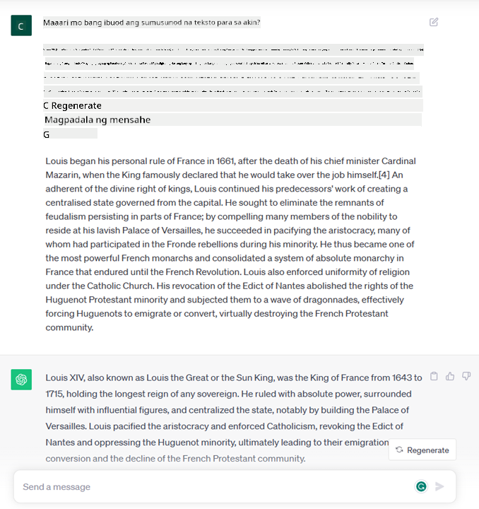
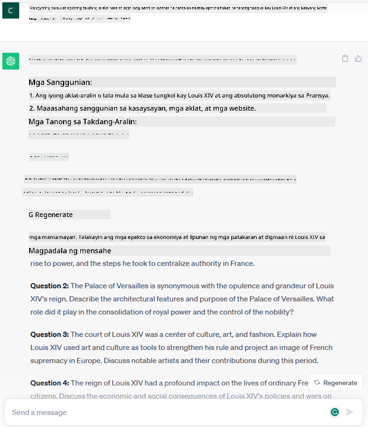
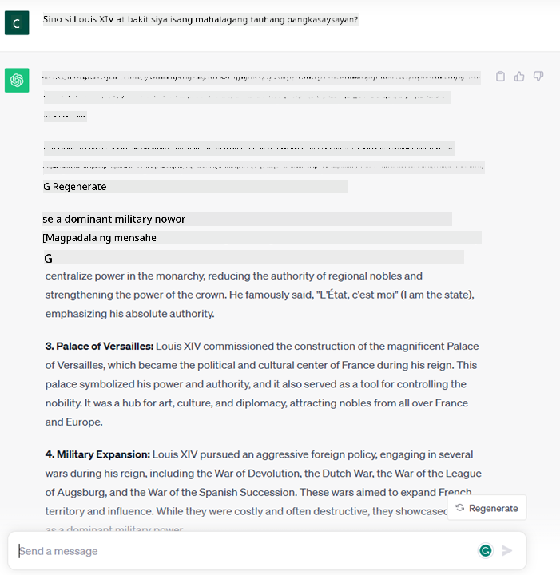

<!--
CO_OP_TRANSLATOR_METADATA:
{
  "original_hash": "f53ba0fa49164f9323043f1c6b11f2b1",
  "translation_date": "2025-07-09T07:59:04+00:00",
  "source_file": "01-introduction-to-genai/README.md",
  "language_code": "tl"
}
-->
# Panimula sa Generative AI at Malalaking Modelo ng Wika

_(I-click ang larawan sa itaas para mapanood ang video ng araling ito)_

Ang Generative AI ay isang uri ng artipisyal na intelihensiya na kayang gumawa ng teksto, mga larawan, at iba pang uri ng nilalaman. Ang kagandahan nito bilang teknolohiya ay dahil na-demokratisa nito ang AI; kahit sino ay maaaring gumamit nito gamit lamang ang isang simpleng text prompt, isang pangungusap na nakasulat sa natural na wika. Hindi mo na kailangang matutunan ang mga programming language tulad ng Java o SQL para makagawa ng kapaki-pakinabang na bagay; ang kailangan mo lang ay gamitin ang iyong sariling wika, ipahayag ang gusto mo, at lalabas ang mungkahi mula sa isang AI model. Malaki ang mga aplikasyon at epekto nito—makakagawa ka o makakaunawa ng mga ulat, makapagsusulat ng mga aplikasyon, at marami pang iba, lahat ay sa loob ng ilang segundo.

Sa kurikulum na ito, tatalakayin natin kung paano ginagamit ng aming startup ang generative AI upang buksan ang mga bagong posibilidad sa mundo ng edukasyon at kung paano namin hinaharap ang mga hamon na kaakibat ng mga sosyal na epekto ng paggamit nito at mga limitasyon ng teknolohiya.

## Panimula

Saklaw ng araling ito ang mga sumusunod:

- Panimula sa senaryo ng negosyo: ang ideya at misyon ng aming startup.
- Generative AI at kung paano namin narating ang kasalukuyang kalagayan ng teknolohiya.
- Paano gumagana ang isang malaking modelo ng wika.
- Pangunahing kakayahan at praktikal na mga gamit ng Malalaking Modelo ng Wika.

## Mga Layunin sa Pagkatuto

Pagkatapos matapos ang araling ito, mauunawaan mo ang:

- Ano ang generative AI at kung paano gumagana ang Malalaking Modelo ng Wika.
- Paano mo magagamit ang malalaking modelo ng wika para sa iba't ibang gamit, lalo na sa mga senaryo sa edukasyon.

## Senaryo: ang aming educational startup

Ang Generative Artificial Intelligence (AI) ay kumakatawan sa rurok ng teknolohiya ng AI, na nagtutulak sa mga hangganan ng dating imposible. May iba't ibang kakayahan at aplikasyon ang mga generative AI model, ngunit sa kurikulum na ito, tatalakayin natin kung paano nito binabago ang edukasyon sa pamamagitan ng isang kathang-isip na startup. Tatawagin natin itong _aming startup_. Ang aming startup ay nagtatrabaho sa larangan ng edukasyon na may ambisyosong misyon na

> _pagsusulong ng accessibility sa pag-aaral sa buong mundo, tinitiyak ang patas na access sa edukasyon at pagbibigay ng personalisadong karanasan sa pagkatuto para sa bawat mag-aaral, ayon sa kanilang pangangailangan_.

Alam ng aming koponan na hindi namin makakamit ang layuning ito nang hindi ginagamit ang isa sa pinakamakapangyarihang kasangkapan ng makabagong panahon – ang Malalaking Modelo ng Wika (LLMs).

Inaasahan na babaguhin ng generative AI ang paraan ng pagkatuto at pagtuturo ngayon, kung saan may mga virtual na guro ang mga estudyante 24 oras sa isang araw na nagbibigay ng malawak na impormasyon at mga halimbawa, at ang mga guro ay maaaring gumamit ng mga makabagong kasangkapan upang suriin ang kanilang mga estudyante at magbigay ng puna.

Bilang panimula, tukuyin muna natin ang ilang mga pangunahing konsepto at terminolohiya na gagamitin natin sa buong kurikulum.

## Paano natin nakuha ang Generative AI?

Sa kabila ng napakalaking _hype_ na nilikha kamakailan dahil sa anunsyo ng mga generative AI model, ang teknolohiyang ito ay ilang dekada nang pinag-aaralan, na nagsimula pa noong dekada 60. Ngayon, narating na natin ang punto kung saan ang AI ay may kakayahang kognitibo ng tao, tulad ng pakikipag-usap na ipinapakita ng halimbawa ng [OpenAI ChatGPT](https://openai.com/chatgpt) o [Bing Chat](https://www.microsoft.com/edge/features/bing-chat?WT.mc_id=academic-105485-koreyst), na gumagamit din ng GPT model para sa mga pag-uusap sa web search ng Bing.

Balikan natin, ang mga unang prototype ng AI ay mga typewritten chatbot na umaasa sa knowledge base na galing sa mga eksperto at inilagay sa isang computer. Ang mga sagot sa knowledge base ay na-trigger ng mga keyword na lumalabas sa input na teksto. Ngunit agad na naging malinaw na ang ganitong paraan, gamit ang typewritten chatbot, ay hindi scalable.

### Isang estadistikal na paraan sa AI: Machine Learning

Isang mahalagang pagbabago ang nangyari noong dekada 90, nang ginamit ang estadistikal na paraan sa pagsusuri ng teksto. Nagresulta ito sa pagbuo ng mga bagong algorithm – na tinatawag na machine learning – na kayang matutunan ang mga pattern mula sa data nang hindi kailangang i-programa nang detalyado. Pinapayagan ng pamamaraang ito ang mga makina na gayahin ang pag-unawa ng tao sa wika: ang isang estadistikal na modelo ay sinasanay gamit ang mga pares ng teksto at label, na nagpapahintulot dito na i-klasipika ang mga hindi kilalang input na teksto gamit ang pre-defined na label na kumakatawan sa intensyon ng mensahe.

### Neural networks at mga modernong virtual assistant

Sa mga nakaraang taon, ang pag-unlad ng teknolohiya sa hardware, na kayang magproseso ng mas malaking data at mas kumplikadong kalkulasyon, ay nagbigay-daan sa pananaliksik sa AI, na nagresulta sa pagbuo ng mga advanced na machine learning algorithm na kilala bilang neural networks o deep learning algorithms.

Malaki ang naitulong ng neural networks (lalo na ang Recurrent Neural Networks – RNNs) sa natural language processing, na nagpapahintulot na maipakita ang kahulugan ng teksto sa mas makabuluhang paraan, na binibigyang halaga ang konteksto ng isang salita sa loob ng pangungusap.

Ito ang teknolohiyang nagpagana sa mga virtual assistant na ipinanganak noong unang dekada ng bagong siglo, na mahusay sa pag-interpret ng wika ng tao, pagtukoy ng pangangailangan, at pagsasagawa ng aksyon upang matugunan ito – tulad ng pagsagot gamit ang pre-defined na script o paggamit ng serbisyo mula sa ibang kumpanya.

### Kasalukuyan, Generative AI

Ganito natin narating ang Generative AI ngayon, na maaaring ituring bilang isang bahagi ng deep learning.

Pagkatapos ng mga dekada ng pananaliksik sa larangan ng AI, isang bagong arkitektura ng modelo – na tinatawag na _Transformer_ – ang nalampasan ang mga limitasyon ng RNNs, na kayang tumanggap ng mas mahahabang sunod-sunod na teksto bilang input. Ang mga Transformer ay nakabase sa attention mechanism, na nagpapahintulot sa modelo na bigyan ng iba't ibang bigat ang mga input na natatanggap nito, ‘nagbibigay ng higit na pansin’ sa mga bahagi kung saan nakatuon ang pinakamahalagang impormasyon, kahit na hindi ito magkakasunod sa teksto.

Karamihan sa mga bagong generative AI model – na kilala rin bilang Malalaking Modelo ng Wika (LLMs), dahil sila ay gumagana gamit ang mga tekstuwal na input at output – ay nakabase sa arkitekturang ito. Ang kagandahan ng mga modelong ito – na sinanay gamit ang napakalaking dami ng unlabeled data mula sa iba't ibang pinagmulan tulad ng mga libro, artikulo, at website – ay kaya nilang i-adapt sa iba't ibang gawain at makabuo ng gramatikal na tamang teksto na may halong pagkamalikhain. Kaya, hindi lang nila napalakas nang husto ang kakayahan ng makina na ‘maunawaan’ ang input na teksto, kundi pinayagan din nila itong gumawa ng orihinal na tugon sa wikang pantao.

## Paano gumagana ang malalaking modelo ng wika?

Sa susunod na kabanata, tatalakayin natin ang iba't ibang uri ng Generative AI model, ngunit sa ngayon, tingnan muna natin kung paano gumagana ang malalaking modelo ng wika, na nakatuon sa OpenAI GPT (Generative Pre-trained Transformer) models.

- **Tokenizer, mula teksto patungong numero**: Tumanggap ang Malalaking Modelo ng Wika ng teksto bilang input at gumagawa ng teksto bilang output. Ngunit dahil estadistikal na mga modelo sila, mas mahusay silang gumagana sa mga numero kaysa sa mga sunod-sunod na teksto. Kaya bawat input sa modelo ay pinoproseso muna ng tokenizer bago gamitin ng pangunahing modelo. Ang token ay isang bahagi ng teksto – na binubuo ng iba't ibang bilang ng mga karakter, kaya ang pangunahing gawain ng tokenizer ay hatiin ang input sa isang array ng mga token. Pagkatapos, bawat token ay iniuugnay sa isang token index, na isang integer encoding ng orihinal na bahagi ng teksto.

- **Pagtataya ng output tokens**: Kapag binigyan ng n tokens bilang input (na may maximum na n na nag-iiba depende sa modelo), kaya ng modelo na hulaan ang isang token bilang output. Ang token na ito ay isinasama sa input ng susunod na iteration, sa isang lumalawak na pattern ng window, na nagpapabuti sa karanasan ng gumagamit sa pagtanggap ng isang (o maraming) pangungusap bilang sagot. Ito ang dahilan kung bakit, kung naglaro ka na ng ChatGPT, mapapansin mong minsan ay parang humihinto ito sa kalagitnaan ng pangungusap.

- **Proseso ng pagpili, probability distribution**: Pinipili ng modelo ang output token base sa posibilidad nito na lumabas pagkatapos ng kasalukuyang sunod-sunod na teksto. Ito ay dahil ang modelo ay nagtataya ng probability distribution sa lahat ng posibleng ‘susunod na token’, na kinakalkula base sa pagsasanay nito. Ngunit hindi palaging ang token na may pinakamataas na posibilidad ang pinipili mula sa distribution. May idinadagdag na antas ng randomness sa pagpili, upang ang modelo ay kumilos nang hindi deterministic – hindi natin makukuha ang eksaktong parehong output para sa parehong input. Ang antas ng randomness na ito ay idinadagdag upang gayahin ang proseso ng malikhaing pag-iisip at maaaring i-adjust gamit ang parameter ng modelo na tinatawag na temperature.

## Paano magagamit ng aming startup ang Malalaking Modelo ng Wika?

Ngayon na mas naiintindihan na natin kung paano gumagana ang isang malaking modelo ng wika, tingnan natin ang ilang praktikal na halimbawa ng mga karaniwang gawain na kaya nilang gawin nang mahusay, na may pokus sa aming senaryo sa negosyo. Sinabi natin na ang pangunahing kakayahan ng isang Malaking Modelo ng Wika ay _gumawa ng teksto mula sa simula, simula sa isang tekstuwal na input na nakasulat sa natural na wika_.

Ngunit anong uri ng tekstuwal na input at output?
Ang input ng isang malaking modelo ng wika ay tinatawag na prompt, habang ang output ay tinatawag na completion, isang termino na tumutukoy sa mekanismo ng modelo sa paggawa ng susunod na token upang kumpletuhin ang kasalukuyang input. Tatalakayin natin nang mas malalim kung ano ang prompt at kung paano ito idinisenyo upang makuha ang pinakamainam mula sa modelo. Ngunit sa ngayon, sabihin na lang natin na ang prompt ay maaaring maglaman ng:

- Isang **instruksyon** na nagsasaad ng uri ng output na inaasahan natin mula sa modelo. Minsan, ang instruksyong ito ay maaaring maglaman ng ilang halimbawa o karagdagang datos.

  1. Pagbubuod ng isang artikulo, libro, mga review ng produkto at iba pa, pati na rin ang pagkuha ng mga insight mula sa hindi nakaayos na datos.
    
    
  
  2. Malikhaing pag-iisip at pagdidisenyo ng isang artikulo, sanaysay, takdang-aralin o iba pa.
      
     

- Isang **tanong**, na ipinapahayag sa anyo ng pag-uusap sa isang ahente.
  
  

- Isang bahagi ng **teksto na kailangang kumpletuhin**, na implicit na humihiling ng tulong sa pagsulat.
  
  

- Isang bahagi ng **code** kasama ang hiling na ipaliwanag at idokumento ito, o isang komento na humihiling na gumawa ng isang piraso ng code na gumagawa ng partikular na gawain.
  
  

Ang mga halimbawa sa itaas ay medyo simple at hindi nilalayong maging kumpletong demonstrasyon ng kakayahan ng Malalaking Modelo ng Wika. Layunin lamang nilang ipakita ang potensyal ng paggamit ng generative AI, lalo na ngunit hindi limitado sa mga konteksto ng edukasyon.

Gayundin, hindi perpekto ang output ng isang generative AI model at minsan ang pagkamalikhain ng modelo ay maaaring magdulot ng output na kombinasyon ng mga salitang maaaring ma-interpret ng tao bilang isang pagkalito sa realidad, o maaaring nakakasakit. Ang generative AI ay hindi matalino – hindi pa man sa mas malawak na kahulugan ng katalinuhan, kabilang ang kritikal at malikhaing pag-iisip o emosyonal na intelihensiya; hindi ito deterministic, at hindi ito mapagkakatiwalaan, dahil maaaring may halong maling impormasyon, tulad ng mga maling sanggunian, nilalaman, at pahayag, na ipinapakita nang may kumpiyansa at paniniwala. Sa mga susunod na aralin, tatalakayin natin ang lahat ng mga limitasyong ito at titingnan kung paano natin ito mapapagaan.

## Takdang-Aralin

Ang iyong takdang-aralin ay magbasa pa tungkol sa [generative AI](https://en.wikipedia.org/wiki/Generative_artificial_intelligence?WT.mc_id=academic-105485-koreyst) at subukang tukuyin ang isang larangan kung saan maaari kang magdagdag ng generative AI ngayon na wala pa nito. Paano magiging iba ang epekto kumpara sa paggawa nito sa “lumang paraan”? May magagawa ka ba na dati ay hindi mo magawa, o mas mabilis ka ba? Sumulat ng 300-salitang buod tungkol sa iyong pangarap na AI startup at isama ang mga header tulad ng "Problema", "Paano Ko Gagamitin ang AI", "Epekto" at opsyonal na plano sa negosyo.

Kung nagawa mo na ang gawaing ito, maaaring handa ka nang mag-apply sa incubator ng Microsoft, ang [Microsoft for Startups Founders Hub](https://www.microsoft.com/startups?WT.mc_id=academic-105485-koreyst) kung saan nag-aalok kami ng credits para sa Azure, OpenAI, mentoring, at marami pang iba, silipin mo!

## Pagsusulit sa Kaalaman

Ano ang totoo tungkol sa malalaking modelo ng wika?

1. Palagi kang nakakakuha ng eksaktong parehong sagot.
1. Ginagawa nito nang perpekto ang mga bagay, mahusay sa pagdaragdag ng numero, paggawa ng gumaganang code, atbp.
1. Nag-iiba-iba ang sagot kahit na pareho ang prompt. Magaling din ito sa pagbibigay ng unang draft ng isang bagay, maging teksto o code. Ngunit kailangan mong pagbutihin ang mga resulta.

Sagot: 3, ang LLM ay non-deterministic, nag-iiba ang sagot, ngunit maaari mong kontrolin ang pagkakaiba nito gamit ang temperature setting. Hindi mo rin dapat asahan na gagawin nito nang perpekto ang lahat; nandito ito para gawin ang mabibigat na gawain para sa iyo na madalas ay nagbibigay ng magandang unang pagtatangka na kailangan mong paunlarin pa.

## Magaling! Ipagpatuloy ang Paglalakbay

Pagkatapos matapos ang araling ito, tingnan ang aming [Generative AI Learning collection](https://aka.ms/genai-collection?WT.mc_id=academic-105485-koreyst) upang ipagpatuloy ang paghasa ng iyong kaalaman sa Generative AI!
Pumunta sa Lesson 2 kung saan titingnan natin kung paano [suriin at paghambingin ang iba't ibang uri ng LLM](../02-exploring-and-comparing-different-llms/README.md?WT.mc_id=academic-105485-koreyst)!

**Paalala**:  
Ang dokumentong ito ay isinalin gamit ang AI translation service na [Co-op Translator](https://github.com/Azure/co-op-translator). Bagamat nagsusumikap kami para sa katumpakan, pakatandaan na ang mga awtomatikong pagsasalin ay maaaring maglaman ng mga pagkakamali o di-tumpak na impormasyon. Ang orihinal na dokumento sa orihinal nitong wika ang dapat ituring na pangunahing sanggunian. Para sa mahahalagang impormasyon, inirerekomenda ang propesyonal na pagsasalin ng tao. Hindi kami mananagot sa anumang hindi pagkakaunawaan o maling interpretasyon na maaaring magmula sa paggamit ng pagsasaling ito.