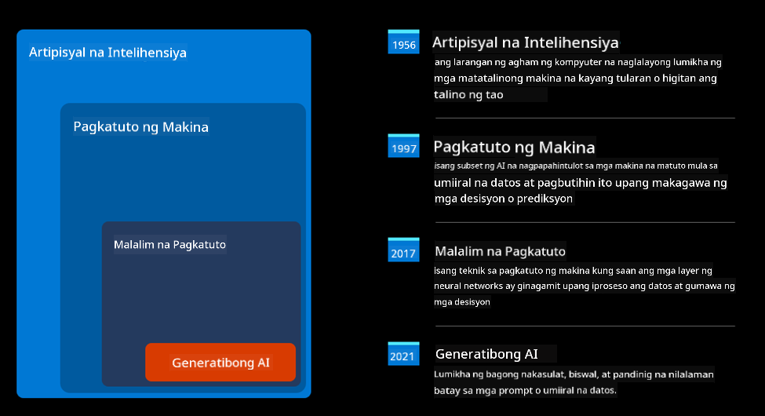
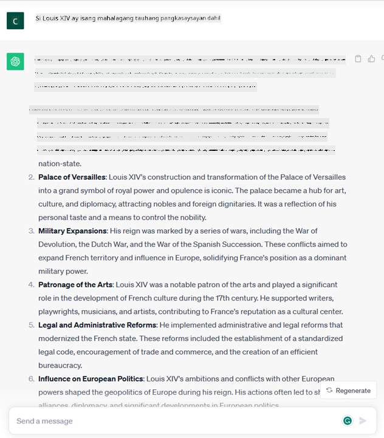

<!--
CO_OP_TRANSLATOR_METADATA:
{
  "original_hash": "bfb7901bdbece1ba3e9f35c400ca33e8",
  "translation_date": "2025-10-17T13:16:01+00:00",
  "source_file": "01-introduction-to-genai/README.md",
  "language_code": "tl"
}
-->
# Panimula sa Generative AI at Malalaking Modelo ng Wika

_(I-click ang imahe sa itaas para mapanood ang video ng araling ito)_

Ang Generative AI ay isang uri ng artipisyal na intelihensiya na may kakayahang lumikha ng teksto, mga imahe, at iba pang uri ng nilalaman. Ang kahanga-hanga sa teknolohiyang ito ay ang kakayahan nitong gawing mas accessible ang AI—kahit sino ay maaaring gumamit nito gamit lamang ang isang text prompt, isang pangungusap na isinulat sa natural na wika. Hindi mo kailangang matutunan ang mga programming language tulad ng Java o SQL para makagawa ng makabuluhang bagay; ang kailangan mo lang ay gamitin ang iyong wika, sabihin kung ano ang gusto mo, at magbibigay ang AI model ng suhestiyon. Malaki ang aplikasyon at epekto nito—mula sa pagsusulat o pag-unawa sa mga ulat, paggawa ng mga aplikasyon, at marami pang iba, lahat sa loob ng ilang segundo.

Sa kurikulum na ito, tatalakayin natin kung paano ginagamit ng aming startup ang generative AI upang magbukas ng mga bagong posibilidad sa mundo ng edukasyon, pati na rin kung paano namin hinaharap ang mga hamon na kaakibat ng mga implikasyong panlipunan ng aplikasyon nito at mga limitasyon ng teknolohiya.

## Panimula

Ang araling ito ay tatalakay sa:

- Panimula sa business scenario: ang ideya at misyon ng aming startup.
- Generative AI at kung paano kami nakarating sa kasalukuyang teknolohikal na kalagayan.
- Paano gumagana ang malalaking modelo ng wika.
- Pangunahing kakayahan at praktikal na mga gamit ng Malalaking Modelo ng Wika.

## Mga Layunin sa Pag-aaral

Pagkatapos makumpleto ang araling ito, mauunawaan mo:

- Ano ang generative AI at paano gumagana ang Malalaking Modelo ng Wika.
- Paano mo magagamit ang malalaking modelo ng wika para sa iba't ibang layunin, na may pokus sa mga senaryo ng edukasyon.

## Scenario: ang aming educational startup

Ang Generative Artificial Intelligence (AI) ay kumakatawan sa rurok ng teknolohiya ng AI, na itinutulak ang mga hangganan ng kung ano ang dating imposible. Maraming kakayahan at aplikasyon ang mga generative AI model, ngunit para sa kurikulum na ito, susuriin natin kung paano nito binabago ang edukasyon sa pamamagitan ng isang kathang-isip na startup. Tatawagin natin itong _ang aming startup_. Ang aming startup ay gumagana sa larangan ng edukasyon na may ambisyosong misyon na:

> _pagpapabuti ng accessibility sa pag-aaral, sa pandaigdigang saklaw, pagtiyak ng pantay na access sa edukasyon, at pagbibigay ng personalized na karanasan sa pag-aaral sa bawat mag-aaral, ayon sa kanilang pangangailangan_.

Alam ng aming startup team na hindi namin makakamit ang layuning ito nang hindi ginagamit ang isa sa pinakamakapangyarihang kasangkapan ng modernong panahon—ang Malalaking Modelo ng Wika (LLMs).

Inaasahan na babaguhin ng Generative AI ang paraan ng pag-aaral at pagtuturo ngayon, kung saan ang mga mag-aaral ay may virtual na guro na magagamit 24 oras sa isang araw na nagbibigay ng malawak na impormasyon at mga halimbawa, at ang mga guro ay maaaring gumamit ng mga makabagong kasangkapan upang suriin ang kanilang mga mag-aaral at magbigay ng feedback.

Upang magsimula, tukuyin natin ang ilang pangunahing konsepto at terminolohiya na gagamitin natin sa buong kurikulum.

## Paano natin nakuha ang Generative AI?

Sa kabila ng kamangha-manghang _hype_ na nilikha kamakailan ng anunsyo ng mga generative AI model, ang teknolohiyang ito ay dekada nang binubuo, na ang mga unang pagsisikap sa pananaliksik ay nagsimula pa noong dekada '60. Ngayon, nasa punto na tayo kung saan ang AI ay may kakayahang kognitibo ng tao, tulad ng pakikipag-usap na ipinapakita ng halimbawa [OpenAI ChatGPT](https://openai.com/chatgpt) o [Bing Chat](https://www.microsoft.com/edge/features/bing-chat?WT.mc_id=academic-105485-koreyst), na gumagamit din ng GPT model para sa web search Bing conversations.

Balikan natin, ang mga pinakaunang prototype ng AI ay binubuo ng mga chatbot na gumagamit ng typewritten text, na umaasa sa isang knowledge base na nakuha mula sa isang grupo ng mga eksperto at kinakatawan sa isang computer. Ang mga sagot sa knowledge base ay na-trigger ng mga keyword na lumalabas sa input text. Gayunpaman, mabilis na naging malinaw na ang ganitong diskarte, gamit ang typewritten chatbots, ay hindi masyadong epektibo sa mas malawak na saklaw.

### Isang estadistikal na diskarte sa AI: Machine Learning

Ang isang mahalagang punto ay dumating noong dekada '90, sa pamamagitan ng aplikasyon ng estadistikal na diskarte sa pagsusuri ng teksto. Nagresulta ito sa pagbuo ng mga bagong algorithm—kilala bilang machine learning—na may kakayahang matutunan ang mga pattern mula sa data nang hindi kinakailangang i-programa nang tahasan. Ang diskarte na ito ay nagpapahintulot sa mga makina na gayahin ang pag-unawa ng tao sa wika: isang estadistikal na modelo ang sinasanay sa mga text-label pairing, na nagbibigay-daan sa modelo na i-classify ang hindi kilalang input text gamit ang isang pre-defined na label na kumakatawan sa intensyon ng mensahe.

### Neural networks at modernong virtual assistants

Sa mga nakaraang taon, ang ebolusyon ng teknolohiya ng hardware, na may kakayahang magproseso ng mas malaking dami ng data at mas kumplikadong mga kalkulasyon, ay nag-udyok ng pananaliksik sa AI, na nagresulta sa pagbuo ng mga advanced na machine learning algorithm na kilala bilang neural networks o deep learning algorithms.

Ang neural networks (lalo na ang Recurrent Neural Networks – RNNs) ay lubos na pinahusay ang natural language processing, na nagbibigay-daan sa representasyon ng kahulugan ng teksto sa mas makabuluhang paraan, na pinahahalagahan ang konteksto ng isang salita sa pangungusap.

Ito ang teknolohiyang nagbigay-daan sa mga virtual assistants na ipinanganak noong unang dekada ng bagong siglo, na napakahusay sa pag-interpret ng wika ng tao, pagtukoy ng pangangailangan, at pagsasagawa ng aksyon upang matugunan ito—tulad ng pagsagot gamit ang isang pre-defined na script o paggamit ng serbisyo ng third-party.

### Kasalukuyan, Generative AI

Kaya't ganito tayo nakarating sa Generative AI ngayon, na maaaring ituring bilang isang subset ng deep learning.

Pagkatapos ng mga dekada ng pananaliksik sa larangan ng AI, isang bagong arkitektura ng modelo—tinatawag na _Transformer_—ang nagtagumpay sa mga limitasyon ng RNNs, na may kakayahang tumanggap ng mas mahahabang mga sequence ng teksto bilang input. Ang Transformers ay batay sa attention mechanism, na nagbibigay-daan sa modelo na magbigay ng iba't ibang timbang sa mga input na natatanggap nito, 'mas binibigyang pansin' kung saan nakatuon ang pinaka-kaugnay na impormasyon, anuman ang pagkakasunod-sunod nito sa text sequence.

Karamihan sa mga kamakailang generative AI model—kilala rin bilang Malalaking Modelo ng Wika (LLMs), dahil gumagana ang mga ito sa mga tekstuwal na input at output—ay batay sa arkitekturang ito. Ang kahanga-hanga sa mga modelong ito—na sinanay sa napakalaking dami ng unlabeled data mula sa iba't ibang mapagkukunan tulad ng mga libro, artikulo, at website—ay maaari silang iakma sa iba't ibang gawain at makabuo ng gramatikal na tamang teksto na may bahid ng pagkamalikhain. Kaya, hindi lamang nila lubos na pinahusay ang kakayahan ng makina na 'maunawaan' ang input na teksto, ngunit pinagana rin nila ang kakayahan nitong makabuo ng orihinal na tugon sa wika ng tao.

## Paano gumagana ang malalaking modelo ng wika?

Sa susunod na kabanata, susuriin natin ang iba't ibang uri ng Generative AI model, ngunit sa ngayon, tingnan natin kung paano gumagana ang malalaking modelo ng wika, na may pokus sa mga modelo ng OpenAI GPT (Generative Pre-trained Transformer).

- **Tokenizer, teksto sa mga numero**: Ang Malalaking Modelo ng Wika ay tumatanggap ng teksto bilang input at bumubuo ng teksto bilang output. Gayunpaman, bilang mga estadistikal na modelo, mas mahusay silang gumagana sa mga numero kaysa sa mga sequence ng teksto. Kaya't ang bawat input sa modelo ay pinoproseso ng isang tokenizer bago gamitin ng core model. Ang token ay isang bahagi ng teksto—binubuo ng variable na bilang ng mga karakter, kaya't ang pangunahing gawain ng tokenizer ay hatiin ang input sa isang array ng mga token. Pagkatapos, ang bawat token ay tinutugma sa isang token index, na siyang integer encoding ng orihinal na bahagi ng teksto.

- **Pagpredikta ng output tokens**: Sa ibinigay na n tokens bilang input (na may max n na nag-iiba mula sa isang modelo patungo sa iba), ang modelo ay may kakayahang magpredikta ng isang token bilang output. Ang token na ito ay isinasama sa input ng susunod na iteration, sa isang expanding window pattern, na nagbibigay ng mas mahusay na karanasan sa user na makakuha ng isang (o maramihang) pangungusap bilang sagot. Ipinaliwanag nito kung bakit, kung sakaling naglaro ka gamit ang ChatGPT, maaaring napansin mo na minsan tila humihinto ito sa gitna ng isang pangungusap.

- **Proseso ng pagpili, probability distribution**: Ang output token ay pinipili ng modelo ayon sa posibilidad nitong mangyari pagkatapos ng kasalukuyang text sequence. Ito ay dahil ang modelo ay nagpredikta ng probability distribution sa lahat ng posibleng 'susunod na mga token', na kinakalkula batay sa pagsasanay nito. Gayunpaman, hindi palaging ang token na may pinakamataas na posibilidad ang pinipili mula sa resulting distribution. Ang isang antas ng randomness ay idinagdag sa pagpiling ito, sa paraang ang modelo ay kumikilos sa isang non-deterministic na paraan—hindi natin nakukuha ang eksaktong parehong output para sa parehong input. Ang antas ng randomness na ito ay idinagdag upang gayahin ang proseso ng malikhaing pag-iisip at maaaring i-tune gamit ang isang parameter ng modelo na tinatawag na temperature.

## Paano magagamit ng aming startup ang Malalaking Modelo ng Wika?

Ngayon na mas nauunawaan natin ang panloob na mekanismo ng isang malaking modelo ng wika, tingnan natin ang ilang praktikal na halimbawa ng mga pinakakaraniwang gawain na mahusay nilang nagagawa, na may pokus sa aming business scenario. Sinabi natin na ang pangunahing kakayahan ng isang Malaking Modelo ng Wika ay _pagbuo ng teksto mula sa simula, simula sa isang tekstuwal na input, na isinulat sa natural na wika_.

Ngunit anong uri ng tekstuwal na input at output?
Ang input ng isang malaking modelo ng wika ay kilala bilang prompt, habang ang output ay kilala bilang completion, isang termino na tumutukoy sa mekanismo ng modelo ng pagbuo ng susunod na token upang makumpleto ang kasalukuyang input. Susuriin natin nang mas malalim kung ano ang isang prompt at kung paano ito idisenyo upang makuha ang pinakamahusay mula sa ating modelo. Ngunit sa ngayon, sabihin lang natin na ang isang prompt ay maaaring magsama ng:

- Isang **instruction** na nagsasaad ng uri ng output na inaasahan natin mula sa modelo. Ang instruction na ito minsan ay maaaring maglaman ng ilang halimbawa o karagdagang data.

  1. Pagbubuod ng isang artikulo, libro, mga review ng produkto, at iba pa, kasama ang pagkuha ng mga insight mula sa unstructured data.
    
    
  
  2. Malikhaing ideya at disenyo ng isang artikulo, sanaysay, assignment, o iba pa.
      
     

- Isang **tanong**, na itinatanong sa anyo ng isang pag-uusap sa isang agent.
  
  

- Isang bahagi ng **teksto upang makumpleto**, na implicit na humihiling ng tulong sa pagsusulat.
  
  

- Isang bahagi ng **code** kasama ang kahilingan na ipaliwanag at idokumento ito, o isang komento na humihiling na bumuo ng isang piraso ng code na gumaganap ng isang partikular na gawain.
  
  

Ang mga halimbawa sa itaas ay medyo simple at hindi nilalayon na maging isang kumpletong demonstrasyon ng kakayahan ng Malalaking Modelo ng Wika. Ang mga ito ay nilalayon upang ipakita ang potensyal ng paggamit ng generative AI, partikular ngunit hindi limitado sa mga konteksto ng edukasyon.

Gayundin, ang output ng isang generative AI model ay hindi perpekto at minsan ang pagkamalikhain ng modelo ay maaaring magdulot ng problema, na nagreresulta sa isang output na kombinasyon ng mga salita na maaaring ma-interpret ng tao bilang isang maling representasyon ng realidad, o maaaring maging nakakasakit. Ang Generative AI ay hindi matalino—hindi bababa sa mas komprehensibong kahulugan ng katalinuhan, kabilang ang kritikal at malikhaing pangangatwiran o emosyonal na katalinuhan; ito ay hindi deterministic, at hindi ito mapagkakatiwalaan, dahil ang mga fabrications, tulad ng maling mga reference, nilalaman, at pahayag, ay maaaring pagsamahin sa tamang impormasyon, at ipakita sa isang mapanghikayat at tiwala na paraan. Sa mga susunod na aralin, haharapin natin ang lahat ng mga limitasyong ito at titingnan kung ano ang maaari nating gawin upang mabawasan ang mga ito.

## Gawain

Ang iyong gawain ay magbasa pa tungkol sa [generative AI](https://en.wikipedia.org/wiki/Generative_artificial_intelligence?WT.mc_id=academic-105485-koreyst) at subukang tukuyin ang isang lugar kung saan maaari mong idagdag ang generative AI ngayon na wala pa nito. Paano magiging iba ang epekto kumpara sa paggawa nito sa "lumang paraan", may magagawa ka bang hindi mo magawa dati, o mas mabilis ka ba? Sumulat ng 300-salitang buod tungkol sa kung ano ang magiging hitsura ng iyong pangarap na AI startup at isama ang mga header tulad ng "Problema", "Paano ko gagamitin ang AI", "Epekto" at opsyonal na business plan.

Kung nagawa mo ang gawaing ito, maaaring handa ka nang mag-apply sa incubator ng Microsoft, [Microsoft for Startups Founders Hub](https://www.microsoft.com/startups?WT.mc_id=academic-105485-koreyst) nag-aalok kami ng mga kredito para sa Azure, OpenAI, mentoring, at marami pang iba, tingnan ito!

## Pagsusuri ng Kaalaman

Ano ang totoo tungkol sa malalaking modelo ng wika?

1. Nakukuha mo ang eksaktong parehong sagot sa bawat pagkakataon.
1. Ginagawa nito ang mga bagay nang perpekto, mahusay sa pagdaragdag ng mga numero, paggawa ng gumaganang code, atbp.
1. Ang sagot ay maaaring mag-iba sa kabila ng paggamit ng parehong prompt. Mahusay din ito sa pagbibigay sa iyo ng unang draft ng isang bagay, maging ito ay teksto o code. Ngunit kailangan mong pagbutihin ang mga resulta.

A: 3, ang LLM ay non-deterministic, nag-iiba ang sagot, gayunpaman, maaari mong kontrolin ang pagkakaiba nito sa pamamagitan ng temperature setting. Hindi mo rin dapat asahan na gagawin nito ang mga bagay nang perpekto, narito ito upang gawin ang mabibigat na gawain para sa iyo na madalas nangangahulugan na makakakuha ka ng isang mahusay na unang pagtatangka sa isang bagay na kailangan mong unti-unting pagbutihin.

## Mahusay na Trabaho! Ipagpatuloy ang Paglalakbay

Pagkatapos makumpleto ang araling ito, tingnan ang aming [Generative AI Learning collection](https://aka.ms/genai-collection?WT.mc_id=academic-105485-koreyst) upang patuloy na paunlarin ang iyong kaalaman sa Generative AI!
Pumunta sa Lesson 2 kung saan titingnan natin kung paano [mag-explore at maghambing ng iba't ibang uri ng LLM](../02-exploring-and-comparing-different-llms/README.md?WT.mc_id=academic-105485-koreyst)!

---

**Paunawa**:  
Ang dokumentong ito ay isinalin gamit ang AI translation service na [Co-op Translator](https://github.com/Azure/co-op-translator). Bagamat sinisikap naming maging tumpak, mangyaring tandaan na ang mga awtomatikong pagsasalin ay maaaring maglaman ng mga pagkakamali o hindi pagkakatugma. Ang orihinal na dokumento sa kanyang katutubong wika ang dapat ituring na opisyal na pinagmulan. Para sa mahalagang impormasyon, inirerekomenda ang propesyonal na pagsasalin ng tao. Hindi kami mananagot sa anumang hindi pagkakaunawaan o maling interpretasyon na dulot ng paggamit ng pagsasaling ito.