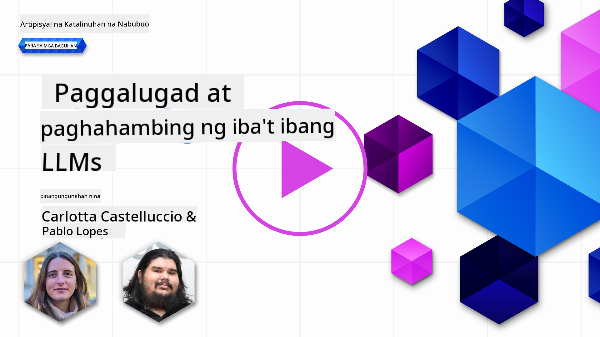
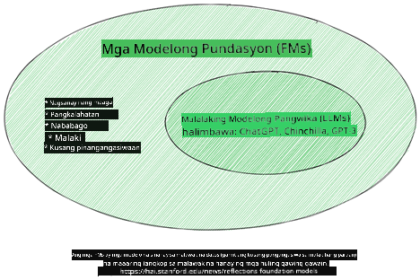
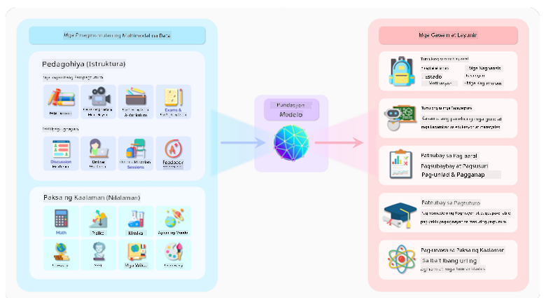
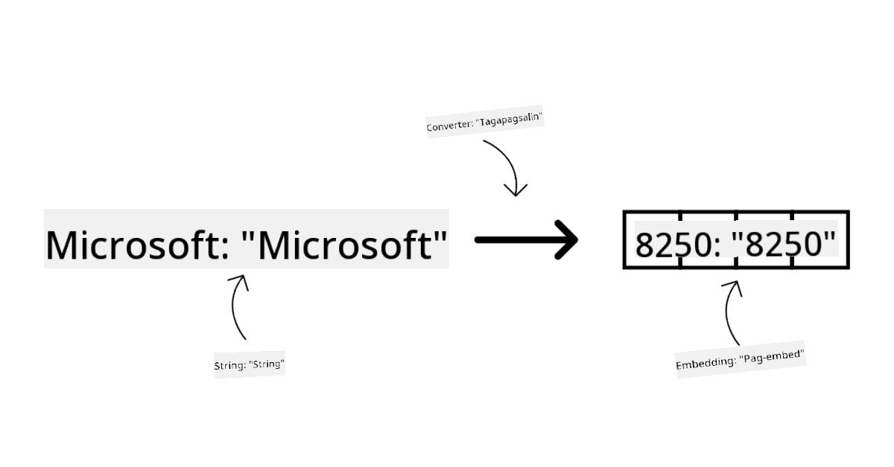
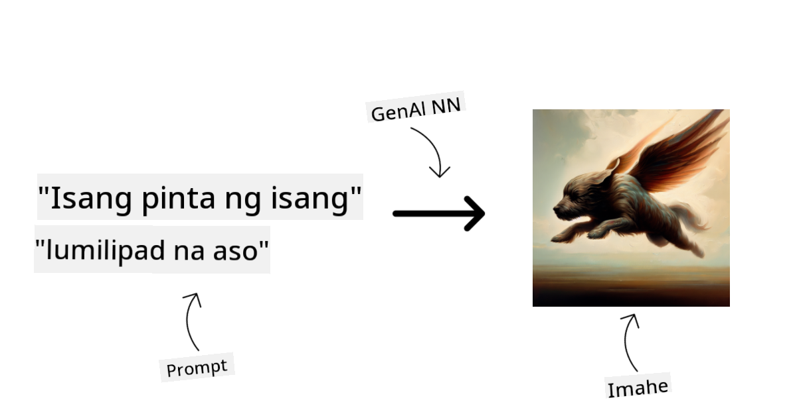
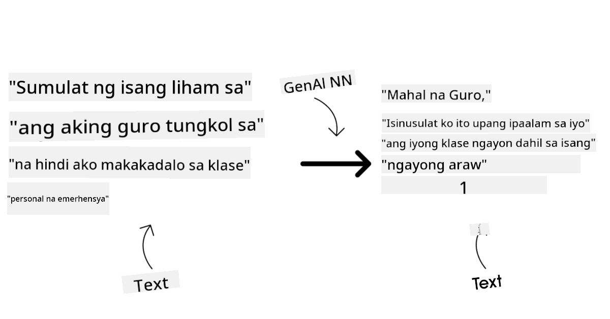
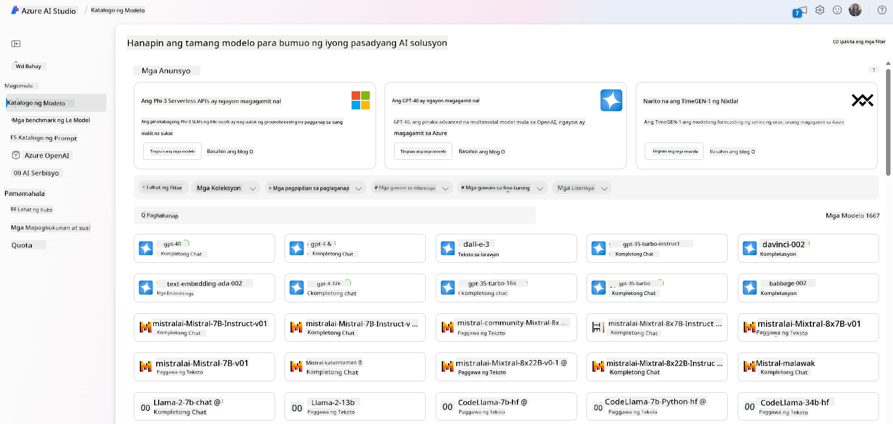
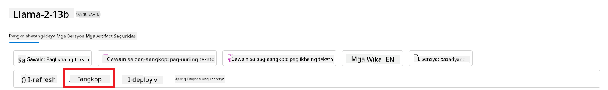
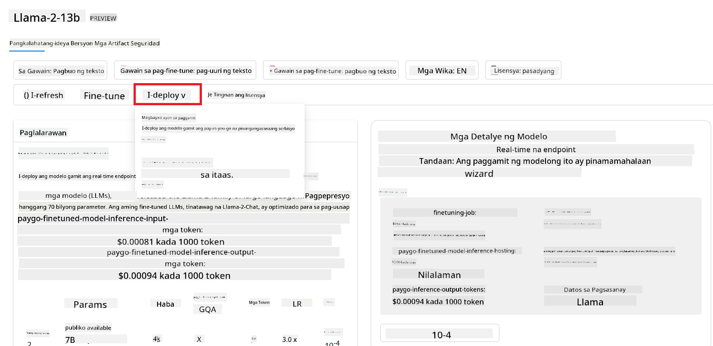
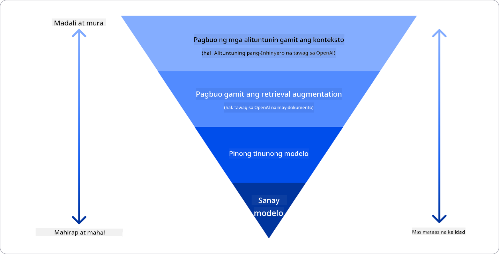

<!--
CO_OP_TRANSLATOR_METADATA:
{
  "original_hash": "e2f686f2eb794941761252ac5e8e090b",
  "translation_date": "2025-05-19T14:15:56+00:00",
  "source_file": "02-exploring-and-comparing-different-llms/README.md",
  "language_code": "tl"
}
-->
# Paggalugad at Paghahambing ng Iba't Ibang LLMs

> _I-click ang imahe sa itaas upang panoorin ang video ng araling ito_

Sa nakaraang aralin, nakita natin kung paano binabago ng Generative AI ang teknolohikal na tanawin, kung paano gumagana ang Large Language Models (LLMs) at kung paano maaaring i-apply ng isang negosyo - tulad ng ating startup - ang mga ito sa kanilang mga kaso ng paggamit at umunlad! Sa kabanatang ito, tinitingnan natin ang paghahambing at pagkakaiba ng iba't ibang uri ng large language models (LLMs) upang maunawaan ang kanilang mga kalamangan at kahinaan.

Ang susunod na hakbang sa paglalakbay ng ating startup ay ang paggalugad sa kasalukuyang tanawin ng LLMs at pag-unawa kung alin ang angkop para sa ating kaso ng paggamit.

## Panimula

Tatalakayin ng araling ito:

- Iba't ibang uri ng LLMs sa kasalukuyang tanawin.
- Pagsusuri, pag-ulit, at paghahambing ng iba't ibang modelo para sa iyong kaso ng paggamit sa Azure.
- Paano mag-deploy ng isang LLM.

## Mga Layunin sa Pag-aaral

Matapos makumpleto ang araling ito, magagawa mong:

- Piliin ang tamang modelo para sa iyong kaso ng paggamit.
- Maunawaan kung paano subukan, ulitin, at pahusayin ang pagganap ng iyong modelo.
- Malaman kung paano nagde-deploy ng mga modelo ang mga negosyo.

## Unawain ang Iba't Ibang Uri ng LLMs

Ang LLMs ay maaaring magkaroon ng maraming kategorya batay sa kanilang arkitektura, training data, at kaso ng paggamit. Ang pag-unawa sa mga pagkakaibang ito ay makakatulong sa ating startup na pumili ng tamang modelo para sa senaryo, at maunawaan kung paano subukan, ulitin, at pahusayin ang pagganap.

Maraming iba't ibang uri ng LLM models, ang iyong pagpili ng modelo ay nakasalalay sa kung ano ang layunin mong gamitin ang mga ito, ang iyong data, kung magkano ang handa mong bayaran at iba pa.

Depende sa kung layunin mong gamitin ang mga modelo para sa teksto, audio, video, pagbuo ng imahe at iba pa, maaari kang pumili ng ibang uri ng modelo.

- **Pagkilala sa audio at pagsasalita**. Para sa layuning ito, ang mga Whisper-type na modelo ay mahusay na pagpipilian dahil sila'y pangkalahatang layunin at nakatuon sa pagkilala sa pagsasalita. Ito'y sinanay sa iba't ibang audio at kayang magsagawa ng multilingual na pagkilala sa pagsasalita. Alamin pa ang tungkol sa [Whisper type models dito](https://platform.openai.com/docs/models/whisper?WT.mc_id=academic-105485-koreyst).

- **Pagbuo ng imahe**. Para sa pagbuo ng imahe, ang DALL-E at Midjourney ay dalawang kilalang pagpipilian. Ang DALL-E ay inaalok ng Azure OpenAI. [Basahin pa ang tungkol sa DALL-E dito](https://platform.openai.com/docs/models/dall-e?WT.mc_id=academic-105485-koreyst) at pati na rin sa Kabanata 9 ng kurikulum na ito.

- **Pagbuo ng teksto**. Karamihan sa mga modelo ay sinanay sa pagbuo ng teksto at mayroong malawak na pagpipilian mula sa GPT-3.5 hanggang GPT-4. Sila'y may iba't ibang halaga na may GPT-4 bilang pinakamahal. Sulit na tingnan ang [Azure OpenAI playground](https://oai.azure.com/portal/playground?WT.mc_id=academic-105485-koreyst) upang suriin kung aling mga modelo ang pinaka-angkop sa iyong mga pangangailangan sa mga tuntunin ng kakayahan at halaga.

- **Multi-modality**. Kung nais mong hawakan ang iba't ibang uri ng data sa input at output, maaaring gusto mong tingnan ang mga modelo tulad ng [gpt-4 turbo na may vision o gpt-4o](https://learn.microsoft.com/azure/ai-services/openai/concepts/models#gpt-4-and-gpt-4-turbo-models?WT.mc_id=academic-105485-koreyst) - ang pinakabagong mga bersyon ng OpenAI models - na kayang pagsamahin ang natural language processing sa visual na pag-unawa, na nagpapahintulot sa mga interaksyon sa pamamagitan ng multi-modal interfaces.

Ang pagpili ng modelo ay nangangahulugang makakakuha ka ng ilang pangunahing kakayahan, na maaaring hindi sapat gayunpaman. Kadalasan mayroon kang partikular na data ng kumpanya na kailangan mong ipaalam sa LLM. Mayroong ilang iba't ibang mga pagpipilian kung paano lapitan iyon, higit pa tungkol doon sa mga darating na seksyon.

### Foundation Models versus LLMs

Ang terminong Foundation Model ay [binigyang-kahulugan ng mga mananaliksik ng Stanford](https://arxiv.org/abs/2108.07258?WT.mc_id=academic-105485-koreyst) at tinukoy bilang isang AI model na sumusunod sa ilang pamantayan, tulad ng:

- **Sila ay sinanay gamit ang unsupervised learning o self-supervised learning**, nangangahulugang sila ay sinanay sa hindi naka-label na multi-modal data, at hindi nangangailangan ng human annotation o labeling ng data para sa kanilang proseso ng pagsasanay.
- **Sila ay napakalaking mga modelo**, batay sa napakalalim na neural networks na sinanay sa bilyun-bilyong parameter.
- **Sila ay karaniwang inilaan upang magsilbing 'foundation' para sa iba pang mga modelo**, nangangahulugang maaari silang magamit bilang panimulang punto para sa iba pang mga modelo na maaaring itayo sa ibabaw, na maaaring gawin sa pamamagitan ng fine-tuning.

Pinagmulan ng imahe: [Essential Guide to Foundation Models and Large Language Models | ni Babar M Bhatti | Medium
](https://thebabar.medium.com/essential-guide-to-foundation-models-and-large-language-models-27dab58f7404)

Upang higit pang linawin ang pagkakaibang ito, gamitin natin ang ChatGPT bilang halimbawa. Upang mabuo ang unang bersyon ng ChatGPT, ang isang modelo na tinatawag na GPT-3.5 ay nagsilbing foundation model. Nangangahulugan ito na ginamit ng OpenAI ang ilang chat-specific na data upang lumikha ng isang tuned na bersyon ng GPT-3.5 na dalubhasa sa mahusay na pagganap sa mga conversational scenarios, tulad ng chatbots.

Pinagmulan ng imahe: [2108.07258.pdf (arxiv.org)](https://arxiv.org/pdf/2108.07258.pdf?WT.mc_id=academic-105485-koreyst)

### Open Source versus Proprietary Models

Isa pang paraan upang ikategorya ang LLMs ay kung sila ay open source o proprietary.

Ang mga open-source models ay mga modelong ginawa na magagamit sa publiko at maaaring gamitin ng sinuman. Sila ay madalas na ginagawang magagamit ng kumpanya na lumikha sa kanila, o ng komunidad ng pananaliksik. Ang mga modelong ito ay maaaring inspeksyunin, baguhin, at i-customize para sa iba't ibang mga kaso ng paggamit sa LLMs. Gayunpaman, hindi sila palaging na-optimize para sa paggamit sa produksyon, at maaaring hindi kasing husay ng mga proprietary models. Dagdag pa, ang pondo para sa open-source models ay maaaring limitado, at maaaring hindi mapanatili sa mahabang panahon o hindi ma-update sa pinakabagong pananaliksik. Mga halimbawa ng sikat na open source models ay [Alpaca](https://crfm.stanford.edu/2023/03/13/alpaca.html?WT.mc_id=academic-105485-koreyst), [Bloom](https://huggingface.co/bigscience/bloom) at [LLaMA](https://llama.meta.com).

Ang mga proprietary models ay mga modelong pagmamay-ari ng isang kumpanya at hindi ginagawa na magagamit sa publiko. Ang mga modelong ito ay madalas na na-optimize para sa paggamit sa produksyon. Gayunpaman, hindi sila pinapayagang inspeksyunin, baguhin, o i-customize para sa iba't ibang mga kaso ng paggamit. Dagdag pa, hindi palaging magagamit nang libre, at maaaring mangailangan ng subscription o bayad upang magamit. Gayundin, ang mga gumagamit ay walang kontrol sa data na ginagamit upang sanayin ang modelo, na nangangahulugang dapat nilang ipagkatiwala ang may-ari ng modelo sa pagtiyak ng pangako sa privacy ng data at responsableng paggamit ng AI. Mga halimbawa ng sikat na proprietary models ay [OpenAI models](https://platform.openai.com/docs/models/overview?WT.mc_id=academic-105485-koreyst), [Google Bard](https://sapling.ai/llm/bard?WT.mc_id=academic-105485-koreyst) o [Claude 2](https://www.anthropic.com/index/claude-2?WT.mc_id=academic-105485-koreyst).

### Embedding versus Pagbuo ng Imahe versus Pagbuo ng Teksto at Kodigo

Ang LLMs ay maaari ring ikategorya ayon sa output na kanilang nalilikha.

Ang Embeddings ay isang hanay ng mga modelong maaaring i-convert ang teksto sa isang numerikal na anyo, na tinatawag na embedding, na isang numerikal na representasyon ng input na teksto. Ang Embeddings ay nagpapadali para sa mga makina na maunawaan ang mga relasyon sa pagitan ng mga salita o pangungusap at maaaring magamit bilang input ng ibang mga modelo, tulad ng classification models, o clustering models na may mas mahusay na pagganap sa numerikal na data. Ang mga embedding models ay madalas na ginagamit para sa transfer learning, kung saan ang isang modelo ay binuo para sa isang surrogate task na mayroong kasaganaan ng data, at pagkatapos ay ang mga bigat ng modelo (embeddings) ay muling ginagamit para sa iba pang downstream tasks. Isang halimbawa ng kategoryang ito ay [OpenAI embeddings](https://platform.openai.com/docs/models/embeddings?WT.mc_id=academic-105485-koreyst).

Ang mga modelong pagbuo ng imahe ay mga modelong bumubuo ng mga imahe. Ang mga modelong ito ay madalas na ginagamit para sa pag-edit ng imahe, synthesis ng imahe, at pagsasalin ng imahe. Ang mga modelong pagbuo ng imahe ay madalas na sinanay sa malalaking datasets ng mga imahe, tulad ng [LAION-5B](https://laion.ai/blog/laion-5b/?WT.mc_id=academic-105485-koreyst), at maaaring magamit upang bumuo ng mga bagong imahe o upang i-edit ang mga umiiral na imahe gamit ang inpainting, super-resolution, at colorization techniques. Mga halimbawa ay [DALL-E-3](https://openai.com/dall-e-3?WT.mc_id=academic-105485-koreyst) at [Stable Diffusion models](https://github.com/Stability-AI/StableDiffusion?WT.mc_id=academic-105485-koreyst).

Ang mga modelong pagbuo ng teksto at kodigo ay mga modelong bumubuo ng teksto o kodigo. Ang mga modelong ito ay madalas na ginagamit para sa pagbuod ng teksto, pagsasalin, at pagsagot sa tanong. Ang mga modelong pagbuo ng teksto ay madalas na sinanay sa malalaking datasets ng teksto, tulad ng [BookCorpus](https://www.cv-foundation.org/openaccess/content_iccv_2015/html/Zhu_Aligning_Books_and_ICCV_2015_paper.html?WT.mc_id=academic-105485-koreyst), at maaaring magamit upang bumuo ng bagong teksto, o upang sagutin ang mga tanong. Ang mga modelong pagbuo ng kodigo, tulad ng [CodeParrot](https://huggingface.co/codeparrot?WT.mc_id=academic-105485-koreyst), ay madalas na sinanay sa malalaking datasets ng kodigo, tulad ng GitHub, at maaaring magamit upang bumuo ng bagong kodigo, o upang ayusin ang mga bug sa umiiral na kodigo.

### Encoder-Decoder versus Decoder-only

Upang pag-usapan ang iba't ibang uri ng arkitektura ng LLMs, gamitin natin ang isang analohiya.

Isipin na binigyan ka ng iyong manager ng isang gawain para sa pagsusulat ng isang quiz para sa mga estudyante. Mayroon kang dalawang kasamahan; ang isa ay namamahala sa paglikha ng nilalaman at ang isa ay namamahala sa pagsusuri nito.

Ang tagalikha ng nilalaman ay parang isang Decoder only model, maaari silang tumingin sa paksa at makita kung ano ang naisulat mo na at pagkatapos ay maaari siyang magsulat ng isang kurso batay doon. Sila ay napakahusay sa pagsulat ng nakaka-engganyong at mapanlikhang nilalaman, ngunit hindi sila napakahusay sa pag-unawa sa paksa at mga layunin sa pag-aaral. Ilang halimbawa ng mga Decoder models ay mga modelo ng pamilya GPT, tulad ng GPT-3.

Ang tagasuri ay parang isang Encoder only model, tinitingnan nila ang kursong naisulat at ang mga sagot, napapansin ang relasyon sa pagitan nila at nauunawaan ang konteksto, ngunit hindi sila mahusay sa pagbuo ng nilalaman. Isang halimbawa ng Encoder only model ay BERT.

Isipin na maaari rin tayong magkaroon ng isang tao na maaaring lumikha at suriin ang quiz, ito ay isang Encoder-Decoder model. Ilang halimbawa ay BART at T5.

### Serbisyo versus Modelo

Ngayon, pag-usapan natin ang pagkakaiba sa pagitan ng isang serbisyo at isang modelo. Ang isang serbisyo ay isang produkto na inaalok ng isang Cloud Service Provider, at madalas na kombinasyon ng mga modelo, data, at iba pang mga bahagi. Ang isang modelo ay ang pangunahing bahagi ng isang serbisyo, at madalas na isang foundation model, tulad ng isang LLM.

Ang mga serbisyo ay madalas na na-optimize para sa paggamit sa produksyon at madalas na mas madaling gamitin kaysa sa mga modelo, sa pamamagitan ng isang graphical user interface. Gayunpaman, ang mga serbisyo ay hindi palaging magagamit nang libre, at maaaring mangailangan ng subscription o bayad upang magamit, kapalit ng paggamit ng kagamitan at mapagkukunan ng may-ari ng serbisyo, pag-optimize ng mga gastos at madaling pag-scale. Isang halimbawa ng serbisyo ay [Azure OpenAI Service](https://learn.microsoft.com/azure/ai-services/openai/overview?WT.mc_id=academic-105485-koreyst), na nag-aalok ng pay-as-you-go rate plan, nangangahulugang ang mga gumagamit ay sinisingil ayon sa kung gaano nila ginagamit ang serbisyo. Gayundin, ang Azure OpenAI Service ay nag-aalok ng enterprise-grade security at isang responsible AI framework sa ibabaw ng mga kakayahan ng mga modelo.

Ang mga modelo ay simpleng Neural Network, na may mga parameter, bigat, at iba pa. Nagpapahintulot sa mga kumpanya na magpatakbo ng lokal, gayunpaman, kakailanganin nilang bumili ng kagamitan, bumuo ng istraktura para sa pag-scale at bumili ng lisensya o gumamit ng open-source na modelo. Ang isang modelo tulad ng LLaMA ay magagamit upang magamit, nangangailangan ng computational power upang patakbuhin ang modelo.

## Paano Subukan at Ulitin sa Iba't Ibang Modelo upang Maunawaan ang Pagganap sa Azure

Kapag ang aming koponan ay nakapagsaliksik sa kasalukuyang tanawin ng LLMs at nakilala ang ilang magagandang kandidato para sa kanilang mga senaryo, ang susunod na hakbang ay ang pagsubok sa kanila sa kanilang data at sa kanilang workload. Ito ay isang iterative na proseso, na ginagawa sa pamamagitan ng mga eksperimento at pagsukat.
Karamihan sa mga modelong nabanggit namin sa mga nakaraang talata (mga OpenAI models, open source models tulad ng Llama2, at Hugging Face transformers) ay magagamit sa [Model Catalog](https://learn.microsoft.com/azure/ai-studio/how-to/model-catalog-overview?WT.mc_id=academic-105485-koreyst) sa [Azure AI Studio](https://ai.azure.com/?WT.mc_id=academic-105485-koreyst).

[Azure AI Studio](https://learn.microsoft.com/azure/ai-studio/what-is-ai-studio?WT.mc_id=academic-105485-koreyst) ay isang Cloud Platform na dinisenyo para sa mga developer upang bumuo ng generative AI applications at pamahalaan ang buong lifecycle ng pag-unlad - mula sa eksperimento hanggang sa pagsusuri - sa pamamagitan ng pagsasama-sama ng lahat ng Azure AI services sa isang solong hub na may madaling gamiting GUI. Ang Model Catalog sa Azure AI Studio ay nagbibigay-daan sa gumagamit na:

- Hanapin ang Foundation Model ng interes sa katalogo - alinman sa proprietary o open source, pagsasala sa pamamagitan ng gawain, lisensya, o pangalan. Upang mapabuti ang kakayahang maghanap, ang mga modelo ay nakaayos sa mga koleksyon, tulad ng Azure OpenAI collection, Hugging Face collection, at higit pa.

- Suriin ang model card, kabilang ang detalyadong paglalarawan ng nilalayong paggamit at training data, mga halimbawa ng code at mga resulta ng pagsusuri sa internal evaluations library.

 pane.

- I-fine-tune ang modelo sa custom na training data upang mapabuti ang performance ng modelo sa isang partikular na workload, gamit ang kakayahan sa eksperimento at pagsubaybay ng Azure AI Studio.

- I-deploy ang orihinal na pre-trained na modelo o ang fine-tuned na bersyon sa isang remote real time inference - managed compute - o serverless api endpoint - [pay-as-you-go](https://learn.microsoft.com/azure/ai-studio/how-to/model-catalog-overview#model-deployment-managed-compute-and-serverless-api-pay-as-you-go?WT.mc_id=academic-105485-koreyst) - upang magamit ito ng mga aplikasyon.

> [!NOTE]
> Hindi lahat ng modelo sa katalogo ay kasalukuyang magagamit para sa fine-tuning at/o pay-as-you-go deployment. Suriin ang model card para sa mga detalye sa kakayahan at limitasyon ng modelo.

## Pagpapabuti ng resulta ng LLM

Nagsaliksik kami kasama ang aming startup team ng iba't ibang uri ng LLMs at isang Cloud Platform (Azure Machine Learning) na nagbibigay-daan sa amin na ihambing ang iba't ibang modelo, suriin ang mga ito sa test data, mapabuti ang performance at i-deploy ang mga ito sa inference endpoints.

Ngunit kailan nila dapat isaalang-alang ang fine-tuning ng isang modelo sa halip na gumamit ng pre-trained na isa? Mayroon bang ibang mga paraan upang mapabuti ang performance ng modelo sa mga partikular na workload?

May ilang mga paraan na maaaring gamitin ng isang negosyo upang makuha ang mga resulta na kailangan nila mula sa isang LLM. Maaari kang pumili ng iba't ibang uri ng mga modelo na may iba't ibang antas ng pagsasanay kapag nagde-deploy ng isang LLM sa produksyon, na may iba't ibang antas ng pagiging kumplikado, gastos, at kalidad. Narito ang ilang iba't ibang mga paraan:

- **Prompt engineering na may konteksto**. Ang ideya ay magbigay ng sapat na konteksto kapag nag-prompt upang masiguro na makuha mo ang mga sagot na kailangan mo.

- **Retrieval Augmented Generation, RAG**. Ang iyong data ay maaaring nasa isang database o web endpoint halimbawa, upang masiguro na ang data na ito, o isang subset nito, ay kasama sa oras ng pag-prompt, maaari mong kunin ang nauugnay na data at gawing bahagi iyon ng prompt ng user.

- **Fine-tuned na modelo**. Dito, higit mong sinanay ang modelo sa iyong sariling data na nagresulta sa modelo na mas eksakto at tumutugon sa iyong mga pangangailangan ngunit maaaring magastos.

Pinagmulan ng Imahe: [Four Ways that Enterprises Deploy LLMs | Fiddler AI Blog](https://www.fiddler.ai/blog/four-ways-that-enterprises-deploy-llms?WT.mc_id=academic-105485-koreyst)

### Prompt Engineering na may Konteksto

Ang mga pre-trained na LLMs ay mahusay sa mga pangkalahatang gawain sa natural na wika, kahit na tinatawag ang mga ito gamit ang isang maikling prompt, tulad ng isang pangungusap na kumpletuhin o isang tanong – ang tinatawag na “zero-shot” na pag-aaral.

Gayunpaman, mas mabuting ma-frame ng user ang kanilang query, sa isang detalyadong kahilingan at mga halimbawa – ang Konteksto – mas magiging tumpak at malapit sa inaasahan ng user ang sagot. Sa kasong ito, tinutukoy natin ang “one-shot” na pag-aaral kung ang prompt ay naglalaman ng isang halimbawa lamang at “few shot learning” kung naglalaman ito ng maraming halimbawa. Ang prompt engineering na may konteksto ang pinaka-matipid na paraan upang magsimula.

### Retrieval Augmented Generation (RAG)

Ang mga LLMs ay may limitasyon na maaari lamang nilang gamitin ang data na ginamit sa kanilang pagsasanay upang makabuo ng sagot. Nangangahulugan ito na wala silang alam tungkol sa mga katotohanan na nangyari pagkatapos ng kanilang proseso ng pagsasanay, at hindi nila ma-access ang mga impormasyong hindi pampubliko (tulad ng data ng kumpanya). Ito ay maaaring malampasan sa pamamagitan ng RAG, isang teknika na nagpapalawak ng prompt sa pamamagitan ng panlabas na data sa anyo ng mga chunks ng mga dokumento, isinasaalang-alang ang mga limitasyon ng haba ng prompt. Ito ay sinusuportahan ng mga tool ng Vector database (tulad ng [Azure Vector Search](https://learn.microsoft.com/azure/search/vector-search-overview?WT.mc_id=academic-105485-koreyst)) na kumukuha ng mga kapaki-pakinabang na chunks mula sa iba't ibang pre-defined na mga pinagmulan ng data at idinadagdag ang mga ito sa Konteksto ng prompt.

Ang teknika na ito ay napaka-kapaki-pakinabang kapag ang isang negosyo ay walang sapat na data, sapat na oras, o mga mapagkukunan upang i-fine-tune ang isang LLM, ngunit nais pa ring mapabuti ang performance sa isang partikular na workload at bawasan ang mga panganib ng mga gawa-gawang kwento, i.e., mistipikasyon ng realidad o nakakapinsalang nilalaman.

### Fine-tuned na modelo

Ang fine-tuning ay isang proseso na gumagamit ng transfer learning upang ‘i-adapt’ ang modelo sa isang downstream na gawain o upang lutasin ang isang partikular na problema. Naiiba mula sa few-shot learning at RAG, nagreresulta ito sa isang bagong modelo na nabuo, na may mga na-update na timbang at bias. Nangangailangan ito ng isang set ng mga halimbawa ng pagsasanay na binubuo ng isang solong input (ang prompt) at ang kaugnay nitong output (ang pagkumpleto). Ito ang magiging gustong paraan kung:

- **Paggamit ng fine-tuned na mga modelo**. Ang isang negosyo ay nais gumamit ng fine-tuned na mas hindi gaanong kakayahang mga modelo (tulad ng embedding models) sa halip na mga high performance na mga modelo, na nagreresulta sa isang mas matipid at mabilis na solusyon.

- **Pagsasaalang-alang sa latency**. Ang latency ay mahalaga para sa isang partikular na kaso ng paggamit, kaya’t hindi posible na gumamit ng napakahabang mga prompt o ang bilang ng mga halimbawa na dapat matutunan mula sa modelo ay hindi umaangkop sa limitasyon ng haba ng prompt.

- **Panatilihing up to date**. Ang isang negosyo ay may maraming mataas na kalidad na data at mga label ng ground truth at ang mga mapagkukunan na kinakailangan upang mapanatili ang data na ito na up to date sa paglipas ng panahon.

### Sinanay na modelo

Ang pagsasanay ng isang LLM mula sa simula ay walang alinlangan ang pinaka-mahirap at pinaka-komplikadong paraan na gamitin, na nangangailangan ng napakalaking dami ng data, mga bihasang mapagkukunan, at angkop na computational power. Ang opsyon na ito ay dapat isaalang-alang lamang sa isang senaryo kung saan ang isang negosyo ay may isang kaso ng paggamit na tiyak sa domain at isang malaking halaga ng data na nakasentro sa domain.

## Suriin ang Kaalaman

Ano ang maaaring maging magandang paraan upang mapabuti ang mga resulta ng pagkumpleto ng LLM?

1. Prompt engineering na may konteksto
1. RAG
1. Fine-tuned na modelo

A:3, kung mayroon kang oras at mga mapagkukunan at mataas na kalidad na data, ang fine-tuning ang mas mabuting opsyon upang manatiling up to date. Gayunpaman, kung tinitingnan mo ang pagpapabuti ng mga bagay at kulang ka sa oras, mas makabubuting isaalang-alang muna ang RAG.

## 🚀 Hamon

Magbasa pa tungkol sa kung paano mo magagamit ang [RAG](https://learn.microsoft.com/azure/search/retrieval-augmented-generation-overview?WT.mc_id=academic-105485-koreyst) para sa iyong negosyo.

## Mahusay na Trabaho, Ipagpatuloy ang Iyong Pag-aaral

Pagkatapos makumpleto ang araling ito, tingnan ang aming [Generative AI Learning collection](https://aka.ms/genai-collection?WT.mc_id=academic-105485-koreyst) upang ipagpatuloy ang pag-level up ng iyong kaalaman sa Generative AI!

Pumunta sa Lesson 3 kung saan titingnan natin kung paano [gumawa gamit ang Generative AI nang Responsibly](../03-using-generative-ai-responsibly/README.md?WT.mc_id=academic-105485-koreyst)!

**Paunawa**:  
Ang dokumentong ito ay isinalin gamit ang AI translation service [Co-op Translator](https://github.com/Azure/co-op-translator). Bagamat sinisikap naming maging tumpak, pakitandaan na ang mga awtomatikong pagsasalin ay maaaring maglaman ng mga pagkakamali o hindi pagkakatumpak. Ang orihinal na dokumento sa kanyang katutubong wika ay dapat ituring na awtoritatibong mapagkukunan. Para sa mahalagang impormasyon, inirerekomenda ang propesyonal na pagsasalin ng tao. Hindi kami mananagot para sa anumang hindi pagkakaunawaan o maling interpretasyon na dulot ng paggamit ng pagsasaling ito.