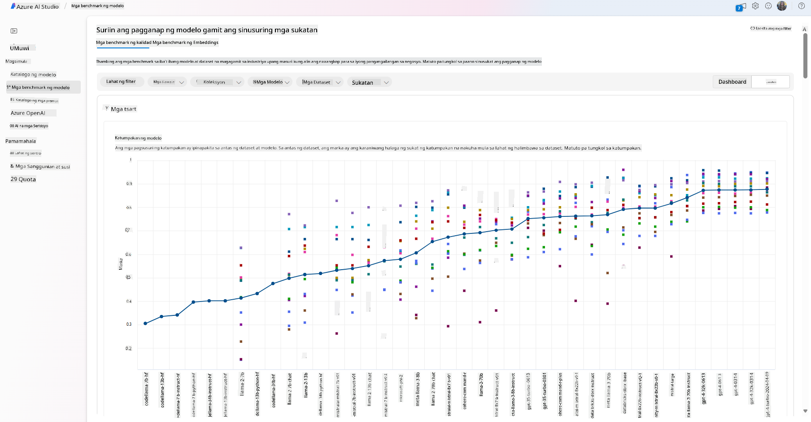
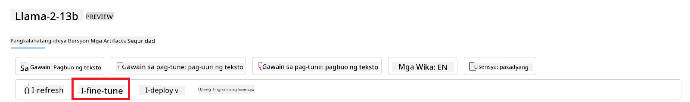
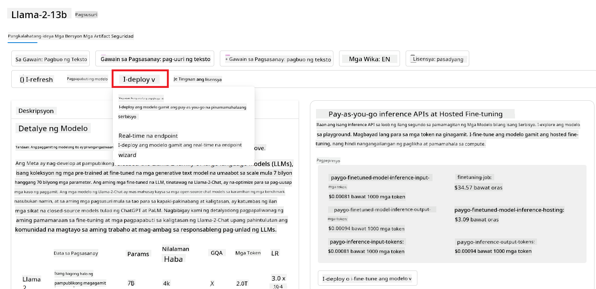
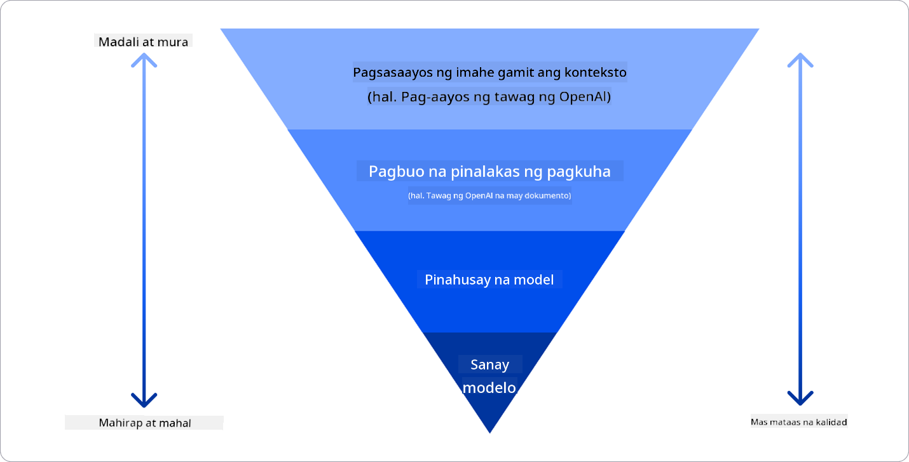

<!--
CO_OP_TRANSLATOR_METADATA:
{
  "original_hash": "e2f686f2eb794941761252ac5e8e090b",
  "translation_date": "2025-06-25T10:55:00+00:00",
  "source_file": "02-exploring-and-comparing-different-llms/README.md",
  "language_code": "tl"
}
-->
# Pagsaliksik at Paghahambing ng Iba't Ibang LLM

> _I-click ang imahe sa itaas para panoorin ang video ng araling ito_

Sa nakaraang aralin, nakita natin kung paano binabago ng Generative AI ang teknolohikal na tanawin, kung paano gumagana ang Large Language Models (LLMs) at kung paano maaaring i-apply ng isang negosyo - tulad ng ating startup - ang mga ito sa kanilang mga kaso ng paggamit at lumago! Sa kabanatang ito, tinitingnan natin ang paghahambing at pagkakaiba ng iba't ibang uri ng malalaking modelo ng wika (LLMs) upang maunawaan ang kanilang mga kalamangan at kahinaan.

Ang susunod na hakbang sa paglalakbay ng aming startup ay ang pagsaliksik sa kasalukuyang tanawin ng LLMs at pag-unawa kung alin ang angkop para sa aming kaso ng paggamit.

## Panimula

Ang araling ito ay sasaklaw sa:

- Iba't ibang uri ng LLMs sa kasalukuyang tanawin.
- Pagsubok, pag-ulit, at paghahambing ng iba't ibang modelo para sa iyong kaso ng paggamit sa Azure.
- Paano mag-deploy ng isang LLM.

## Mga Layunin sa Pag-aaral

Pagkatapos makumpleto ang araling ito, magagawa mong:

- Piliin ang tamang modelo para sa iyong kaso ng paggamit.
- Maunawaan kung paano subukan, ulitin, at pahusayin ang pagganap ng iyong modelo.
- Alamin kung paano nag-deploy ang mga negosyo ng mga modelo.

## Unawain ang iba't ibang uri ng LLMs

Ang LLMs ay maaaring magkaroon ng maramihang kategorya batay sa kanilang arkitektura, data ng pagsasanay, at kaso ng paggamit. Ang pag-unawa sa mga pagkakaibang ito ay makakatulong sa aming startup na piliin ang tamang modelo para sa sitwasyon, at maunawaan kung paano subukan, ulitin, at pahusayin ang pagganap.

Maraming iba't ibang uri ng mga modelo ng LLM, ang iyong pagpili ng modelo ay nakadepende sa kung ano ang nais mong gamitin ang mga ito para sa, ang iyong data, kung gaano karami ang handa mong bayaran at higit pa.

Depende kung nais mong gamitin ang mga modelo para sa text, audio, video, pagbuo ng imahe at iba pa, maaaring pumili ka ng ibang uri ng modelo.

- **Pagkilala sa audio at pagsasalita**. Para sa layuning ito, ang mga modelo ng uri ng Whisper ay isang mahusay na pagpipilian dahil sila ay pangkalahatang layunin at naglalayon sa pagkilala sa pagsasalita. Ito ay sinanay sa magkakaibang audio at maaaring magsagawa ng multilinggwal na pagkilala sa pagsasalita. Alamin ang higit pa tungkol sa [Whisper type models dito](https://platform.openai.com/docs/models/whisper?WT.mc_id=academic-105485-koreyst).

- **Pagbuo ng imahe**. Para sa pagbuo ng imahe, ang DALL-E at Midjourney ay dalawang kilalang pagpipilian. Ang DALL-E ay inaalok ng Azure OpenAI. [Basahin ang higit pa tungkol sa DALL-E dito](https://platform.openai.com/docs/models/dall-e?WT.mc_id=academic-105485-koreyst) at gayundin sa Kabanata 9 ng kurikulum na ito.

- **Pagbuo ng teksto**. Karamihan sa mga modelo ay sinanay sa pagbuo ng teksto at mayroon kang malawak na pagpipilian mula sa GPT-3.5 hanggang GPT-4. Sila ay may iba't ibang halaga na ang GPT-4 ang pinakamahal. Sulit na tingnan ang [Azure OpenAI playground](https://oai.azure.com/portal/playground?WT.mc_id=academic-105485-koreyst) upang suriin kung aling mga modelo ang pinakamahusay na umaangkop sa iyong mga pangangailangan sa kakayahan at gastos.

- **Multi-modality**. Kung naghahanap ka upang pangasiwaan ang maraming uri ng data sa input at output, maaaring nais mong tingnan ang mga modelo tulad ng [gpt-4 turbo with vision or gpt-4o](https://learn.microsoft.com/azure/ai-services/openai/concepts/models#gpt-4-and-gpt-4-turbo-models?WT.mc_id=academic-105485-koreyst) - ang pinakabagong mga release ng OpenAI models - na may kakayahang pagsamahin ang natural language processing sa visual understanding, na nagbibigay-daan sa mga interaksyon sa pamamagitan ng multi-modal interfaces.

Ang pagpili ng modelo ay nangangahulugan na makakakuha ka ng ilang pangunahing kakayahan, na maaaring hindi sapat gayunpaman. Madalas na mayroon kang tiyak na data ng kumpanya na kailangan mong ipaalam sa LLM. Mayroong ilang iba't ibang mga pagpipilian kung paano lapitan iyon, higit pa tungkol diyan sa mga darating na seksyon.

### Foundation Models versus LLMs

Ang terminong Foundation Model ay [nilikha ng mga mananaliksik ng Stanford](https://arxiv.org/abs/2108.07258?WT.mc_id=academic-105485-koreyst) at tinukoy bilang isang modelo ng AI na sumusunod sa ilang pamantayan, tulad ng:

- **Sila ay sinanay gamit ang unsupervised learning o self-supervised learning**, ibig sabihin sila ay sinanay sa unlabeled multi-modal data, at hindi nila kailangan ng human annotation o labeling ng data para sa kanilang proseso ng pagsasanay.
- **Sila ay napakalaking mga modelo**, batay sa napakalalim na neural networks na sinanay sa bilyon-bilyong mga parameter.
- **Sila ay karaniwang nilalayon upang magsilbing 'foundation' para sa ibang mga modelo**, ibig sabihin maaari silang gamitin bilang panimulang punto para sa ibang mga modelo na itatayo sa ibabaw, na maaaring gawin sa pamamagitan ng fine-tuning.

Upang higit pang linawin ang pagkakaibang ito, kunin natin ang ChatGPT bilang halimbawa. Upang itayo ang unang bersyon ng ChatGPT, isang modelo na tinatawag na GPT-3.5 ang nagsilbing foundation model. Nangangahulugan ito na ginamit ng OpenAI ang ilang chat-specific na data upang lumikha ng isang tuned version ng GPT-3.5 na espesyalisado sa mahusay na pagganap sa conversational scenarios, tulad ng chatbots.

### Bukas na Source versus Proprietary Models

Isa pang paraan upang ikategorya ang LLMs ay kung sila ay bukas na source o proprietary.

Ang bukas na source na mga modelo ay mga modelo na ginawang available sa publiko at maaaring gamitin ng kahit sino. Madalas silang ginagawang available ng kumpanya na lumikha sa kanila, o ng komunidad ng pananaliksik. Ang mga modelong ito ay pinapayagan na ma-inspect, mabago, at ma-customize para sa iba't ibang mga kaso ng paggamit sa LLMs. Gayunpaman, hindi sila palaging na-optimize para sa production use, at maaaring hindi kasing performante ng proprietary models. Dagdag pa, ang pondo para sa bukas na source na mga modelo ay maaaring limitado, at maaaring hindi sila mapanatili sa pangmatagalang o maaaring hindi ma-update sa pinakabagong pananaliksik. Mga halimbawa ng popular na bukas na source na mga modelo ay [Alpaca](https://crfm.stanford.edu/2023/03/13/alpaca.html?WT.mc_id=academic-105485-koreyst), [Bloom](https://huggingface.co/bigscience/bloom) at [LLaMA](https://llama.meta.com).

Ang proprietary models ay mga modelo na pag-aari ng isang kumpanya at hindi ginawang available sa publiko. Ang mga modelong ito ay madalas na na-optimize para sa production use. Gayunpaman, hindi sila pinapayagan na ma-inspect, mabago, o ma-customize para sa iba't ibang mga kaso ng paggamit. Dagdag pa, hindi sila palaging available nang libre, at maaaring mangailangan ng subscription o bayad upang magamit. Gayundin, ang mga gumagamit ay walang kontrol sa data na ginagamit upang sanayin ang modelo, na nangangahulugan na dapat nilang pagkatiwalaan ang may-ari ng modelo sa pagtiyak ng pangako sa privacy ng data at responsableng paggamit ng AI. Mga halimbawa ng popular na proprietary models ay [OpenAI models](https://platform.openai.com/docs/models/overview?WT.mc_id=academic-105485-koreyst), [Google Bard](https://sapling.ai/llm/bard?WT.mc_id=academic-105485-koreyst) o [Claude 2](https://www.anthropic.com/index/claude-2?WT.mc_id=academic-105485-koreyst).

### Embedding versus Image generation versus Text and Code generation

Ang LLMs ay maaari ring ikategorya ayon sa output na kanilang nililikha.

Ang embeddings ay isang hanay ng mga modelo na maaaring mag-convert ng teksto sa isang numerical form, na tinatawag na embedding, na isang numerical representation ng input na teksto. Ang embeddings ay nagpapadali sa mga makina na maunawaan ang mga relasyon sa pagitan ng mga salita o pangungusap at maaaring magamit bilang mga input ng ibang mga modelo, tulad ng mga classification models, o clustering models na may mas mahusay na pagganap sa numerical data. Ang embedding models ay madalas na ginagamit para sa transfer learning, kung saan ang isang modelo ay binuo para sa isang surrogate task na kung saan mayroong kasaganaan ng data, at pagkatapos ang model weights (embeddings) ay muling ginagamit para sa ibang mga downstream tasks. Isang halimbawa ng kategoryang ito ay [OpenAI embeddings](https://platform.openai.com/docs/models/embeddings?WT.mc_id=academic-105485-koreyst).

Ang mga modelo ng pagbuo ng imahe ay mga modelo na lumilikha ng mga imahe. Ang mga modelong ito ay madalas na ginagamit para sa pag-edit ng imahe, pag-synthesize ng imahe, at pag-translate ng imahe. Ang mga modelo ng pagbuo ng imahe ay madalas na sinanay sa malalaking datasets ng mga imahe, tulad ng [LAION-5B](https://laion.ai/blog/laion-5b/?WT.mc_id=academic-105485-koreyst), at maaaring gamitin upang lumikha ng mga bagong imahe o upang i-edit ang mga umiiral na imahe gamit ang inpainting, super-resolution, at colorization techniques. Mga halimbawa ay [DALL-E-3](https://openai.com/dall-e-3?WT.mc_id=academic-105485-koreyst) at [Stable Diffusion models](https://github.com/Stability-AI/StableDiffusion?WT.mc_id=academic-105485-koreyst).

Ang mga modelo ng pagbuo ng teksto at code ay mga modelo na lumilikha ng teksto o code. Ang mga modelong ito ay madalas na ginagamit para sa pagbuod ng teksto, pagsasalin, at pagsagot sa mga tanong. Ang mga modelo ng pagbuo ng teksto ay madalas na sinanay sa malalaking datasets ng teksto, tulad ng [BookCorpus](https://www.cv-foundation.org/openaccess/content_iccv_2015/html/Zhu_Aligning_Books_and_ICCV_2015_paper.html?WT.mc_id=academic-105485-koreyst), at maaaring gamitin upang lumikha ng bagong teksto, o upang sagutin ang mga tanong. Ang mga modelo ng pagbuo ng code, tulad ng [CodeParrot](https://huggingface.co/codeparrot?WT.mc_id=academic-105485-koreyst), ay madalas na sinanay sa malalaking datasets ng code, tulad ng GitHub, at maaaring gamitin upang lumikha ng bagong code, o upang ayusin ang mga bug sa umiiral na code.

### Encoder-Decoder versus Decoder-only

Upang pag-usapan ang iba't ibang uri ng arkitektura ng LLMs, gamitin natin ang isang analohiya.

Isipin na ang iyong manager ay nagbigay sa iyo ng isang gawain para sa pagsusulat ng isang pagsusulit para sa mga estudyante. Mayroon kang dalawang kasamahan; ang isa ay namamahala sa paglikha ng nilalaman at ang isa ay namamahala sa pagrepaso sa kanila.

Ang tagalikha ng nilalaman ay tulad ng isang Decoder only model, maaari nilang tingnan ang paksa at makita kung ano ang iyong isinulat na at pagkatapos ay maaari siyang sumulat ng isang kurso batay doon. Sila ay napakahusay sa pagsusulat ng nakaka-engganyong at impormatibong nilalaman, ngunit hindi sila napakahusay sa pag-unawa sa paksa at mga layunin sa pag-aaral. Ilang halimbawa ng mga Decoder models ay ang mga modelo ng GPT family, tulad ng GPT-3.

Ang reviewer ay tulad ng isang Encoder only model, tinitingnan nila ang kursong isinulat at ang mga sagot, napapansin ang relasyon sa pagitan nila at nauunawaan ang konteksto, ngunit hindi sila magaling sa pagbuo ng nilalaman. Isang halimbawa ng Encoder only model ay BERT.

Isipin na maaari tayong magkaroon ng isang tao rin na maaaring lumikha at magrepaso ng pagsusulit, ito ay isang Encoder-Decoder model. Ilang halimbawa ay BART at T5.

### Serbisyo versus Modelo

Ngayon, pag-usapan natin ang pagkakaiba sa pagitan ng isang serbisyo at isang modelo. Ang isang serbisyo ay isang produkto na inaalok ng isang Cloud Service Provider, at madalas na isang kombinasyon ng mga modelo, data, at iba pang mga bahagi. Ang isang modelo ay ang pangunahing bahagi ng isang serbisyo, at madalas na isang foundation model, tulad ng isang LLM.

Ang mga serbisyo ay madalas na na-optimize para sa production use at madalas na mas madaling gamitin kaysa sa mga modelo, sa pamamagitan ng isang graphical user interface. Gayunpaman, ang mga serbisyo ay hindi palaging available nang libre, at maaaring mangailangan ng subscription o bayad upang magamit, kapalit ng pag-leverage sa kagamitan at mga mapagkukunan ng may-ari ng serbisyo, pag-optimize ng mga gastos at pag-scale nang madali. Isang halimbawa ng serbisyo ay [Azure OpenAI Service](https://learn.microsoft.com/azure/ai-services/openai/overview?WT.mc_id=academic-105485-koreyst), na nag-aalok ng pay-as-you-go rate plan, ibig sabihin ang mga gumagamit ay sinisingil nang proporsyonal sa kung gaano sila gumagamit ng serbisyo Gayundin, ang Azure OpenAI Service ay nag-aalok ng enterprise-grade security at isang responsible AI framework sa ibabaw ng mga kakayahan ng mga modelo.

Ang mga modelo ay ang Neural Network lamang, kasama ang mga parameter, weights, at iba pa. Pinapayagan ang mga kumpanya na magpatakbo nang lokal, gayunpaman, kailangan bumili ng kagamitan, bumuo ng istruktura para sa pag-scale at bumili ng lisensya o gumamit ng bukas na source na modelo. Ang isang modelo tulad ng LLaMA ay available na gamitin, na nangangailangan ng computational power upang patakbuhin ang modelo.

## Paano subukan at ulitin gamit ang iba't ibang modelo upang maunawaan ang pagganap sa Azure

Kapag ang aming koponan ay nakapagsaliksik sa kasalukuyang tanawin ng LLMs at nakilala ang ilang magagandang kandidato para sa kanilang mga sitwasyon, ang susunod na hakbang ay ang pagsubok sa kanila sa kanilang data at sa kanilang workload. Ito ay isang iterative na proseso, na ginagawa sa pamamagitan ng mga eksperimento at pagsukat.
Karamihan sa mga modelong binanggit namin sa mga nakaraang talata (OpenAI models, open source models tulad ng Llama2, at Hugging Face transformers) ay available sa [Model Catalog](https://learn.microsoft.com/azure/ai-studio/how-to/model-catalog-overview?WT.mc_id=academic-105485-koreyst) sa [Azure AI Studio](https://ai.azure.com/?WT.mc_id=academic-105485-koreyst).

[Azure AI Studio](https://learn.microsoft.com/azure/ai-studio/what-is-ai-studio?WT.mc_id=academic-105485-koreyst) ay isang Cloud Platform na idinisenyo para sa mga developer upang bumuo ng generative AI applications at pamahalaan ang buong development lifecycle - mula sa experimentation hanggang sa evaluation - sa pamamagitan ng pagsasama-sama ng lahat ng Azure AI services sa isang solong hub na may madaling GUI. Ang Model Catalog sa Azure AI Studio ay nagbibigay-daan sa user na:

- Hanapin ang Foundation Model na interesado sa catalog - alinman proprietary o open source, sa pamamagitan ng pag-filter ayon sa task, lisensya, o pangalan. Upang mapabuti ang searchability, ang mga modelo ay nakaayos sa mga koleksyon, tulad ng Azure OpenAI collection, Hugging Face collection, at higit pa.

- Suriin ang model card, kabilang ang detalyadong paglalarawan ng intended use at training data, code samples at evaluation results sa internal evaluations library.
- Ihambing ang mga benchmark sa iba't ibang modelo at dataset na makukuha sa industriya upang masuri kung alin ang naaangkop sa sitwasyon ng negosyo, sa pamamagitan ng [Model Benchmarks](https://learn.microsoft.com/azure/ai-studio/how-to/model-benchmarks?WT.mc_id=academic-105485-koreyst) pane.

- I-fine-tune ang modelo gamit ang custom na training data upang mapabuti ang pagganap ng modelo sa isang tiyak na gawain, gamit ang mga kakayahan sa eksperimento at pagsubaybay ng Azure AI Studio.

- I-deploy ang orihinal na pre-trained na modelo o ang fine-tuned na bersyon nito sa isang remote na real-time inference - managed compute - o serverless api endpoint - [pay-as-you-go](https://learn.microsoft.com/azure/ai-studio/how-to/model-catalog-overview#model-deployment-managed-compute-and-serverless-api-pay-as-you-go?WT.mc_id=academic-105485-koreyst) - upang magamit ito ng mga aplikasyon.

> [!NOTE]
> Hindi lahat ng modelo sa katalogo ay kasalukuyang magagamit para sa fine-tuning at/o pay-as-you-go na deployment. Suriin ang model card para sa mga detalye sa kakayahan at limitasyon ng modelo.

## Pagpapabuti ng mga resulta ng LLM

Na-explore namin kasama ang aming startup team ang iba't ibang uri ng LLMs at isang Cloud Platform (Azure Machine Learning) na nagpapahintulot sa amin na ihambing ang iba't ibang modelo, suriin ang mga ito sa test data, pagbutihin ang performance, at i-deploy ang mga ito sa inference endpoints.

Kailan nila dapat isaalang-alang ang fine-tuning ng isang modelo kaysa sa paggamit ng isang pre-trained na modelo? Mayroon bang ibang mga paraan upang mapabuti ang pagganap ng modelo sa tiyak na mga gawain?

May ilang mga paraan na maaaring gamitin ng isang negosyo upang makuha ang mga resulta na kailangan nila mula sa isang LLM. Maaari kang pumili ng iba't ibang uri ng mga modelo na may iba't ibang antas ng pagsasanay kapag nag-deploy ng isang LLM sa produksyon, na may iba't ibang antas ng komplikasyon, gastos, at kalidad. Narito ang ilang mga paraan:

- **Prompt engineering na may konteksto**. Ang ideya ay magbigay ng sapat na konteksto kapag nag-prompt upang matiyak na makukuha mo ang mga sagot na kailangan mo.

- **Retrieval Augmented Generation, RAG**. Ang iyong data ay maaaring nasa isang database o web endpoint halimbawa, upang matiyak na ang data na ito, o isang subset nito, ay kasama sa oras ng pag-prompt, maaari mong kunin ang kaugnay na data at gawing bahagi ito ng prompt ng user.

- **Fine-tuned na modelo**. Dito, sinanay mo pa ang modelo sa iyong sariling data na nagresulta sa mas eksaktong modelo at tumutugon sa iyong mga pangangailangan ngunit maaaring magastos.

Pinagmulan ng larawan: [Four Ways that Enterprises Deploy LLMs | Fiddler AI Blog](https://www.fiddler.ai/blog/four-ways-that-enterprises-deploy-llms?WT.mc_id=academic-105485-koreyst)

### Prompt Engineering na may Konteksto

Ang mga pre-trained na LLMs ay mahusay sa mga generalisadong natural language na gawain, kahit na sa pamamagitan ng pagtawag sa kanila gamit ang isang maikling prompt, tulad ng isang pangungusap upang kumpletuhin o isang tanong – ang tinatawag na “zero-shot” learning.

Gayunpaman, mas maayos na ma-frame ng user ang kanilang query, gamit ang detalyadong kahilingan at mga halimbawa – ang Konteksto – mas eksakto at malapit sa inaasahan ng user ang magiging sagot. Sa kasong ito, tinutukoy natin ang “one-shot” learning kung ang prompt ay naglalaman lamang ng isang halimbawa at “few shot learning” kung naglalaman ito ng maraming halimbawa. Ang prompt engineering na may konteksto ay ang pinaka-cost-effective na paraan upang magsimula.

### Retrieval Augmented Generation (RAG)

Ang mga LLM ay may limitasyon na maaari lamang nilang gamitin ang data na ginamit sa kanilang pagsasanay upang makabuo ng sagot. Ibig sabihin nito, hindi nila alam ang anumang mga katotohanan na nangyari pagkatapos ng kanilang proseso ng pagsasanay, at hindi sila makaka-access sa hindi pampublikong impormasyon (tulad ng data ng kumpanya). Ito ay maaaring malampasan sa pamamagitan ng RAG, isang teknik na nagpapalawak ng prompt gamit ang panlabas na data sa anyo ng mga chunks ng mga dokumento, isinasaalang-alang ang mga limitasyon ng haba ng prompt. Sinusuportahan ito ng mga tool sa Vector database (tulad ng [Azure Vector Search](https://learn.microsoft.com/azure/search/vector-search-overview?WT.mc_id=academic-105485-koreyst)) na kumukuha ng kapaki-pakinabang na mga chunks mula sa iba't ibang paunang natukoy na mga mapagkukunan ng data at idinadagdag ang mga ito sa Konteksto ng prompt.

Ang teknik na ito ay napakahalaga kapag ang isang negosyo ay walang sapat na data, sapat na oras, o mga mapagkukunan upang i-fine-tune ang isang LLM, ngunit nais pa ring mapabuti ang pagganap sa isang tiyak na gawain at mabawasan ang mga panganib ng mga imbensyon, ibig sabihin, pag-mystify ng katotohanan o mapanganib na nilalaman.

### Fine-tuned na modelo

Ang fine-tuning ay isang proseso na gumagamit ng transfer learning upang 'i-angkop' ang modelo sa isang downstream na gawain o upang lutasin ang isang tiyak na problema. Naiiba mula sa few-shot learning at RAG, ito ay nagreresulta sa isang bagong modelo na nabuo, na may na-update na mga timbang at biases. Nangangailangan ito ng isang set ng mga halimbawa ng pagsasanay na binubuo ng isang solong input (ang prompt) at ang kaugnay na output nito (ang completion). Ito ang magiging prefered na paraan kung:

- **Paggamit ng fine-tuned na mga modelo**. Isang negosyo ang nais gumamit ng mga fine-tuned na mas hindi kapani-paniwalang mga modelo (tulad ng embedding models) kaysa sa mga high performance na modelo, na nagreresulta sa mas cost-effective at mabilis na solusyon.

- **Pagsasaalang-alang sa latency**. Ang latency ay mahalaga para sa isang tiyak na use-case, kaya't hindi posible na gumamit ng napakahabang mga prompt o ang bilang ng mga halimbawa na dapat matutunan mula sa modelo ay hindi magkasya sa limitasyon ng haba ng prompt.

- **Panatilihing up to date**. Ang isang negosyo ay may maraming mataas na kalidad na data at mga ground truth label at ang mga mapagkukunan na kinakailangan upang mapanatili ang data na ito na up to date sa paglipas ng panahon.

### Trained na modelo

Ang pagsasanay ng isang LLM mula sa simula ay walang duda ang pinaka-mahirap at pinaka-komplikadong paraan upang i-adopt, na nangangailangan ng napakalaking dami ng data, sanay na mga mapagkukunan, at angkop na computational power. Ang opsyon na ito ay dapat isaalang-alang lamang sa isang sitwasyon kung saan ang isang negosyo ay may domain-specific na use case at isang malaking halaga ng domain-centric na data.

## Pagsusuri ng Kaalaman

Ano ang maaaring magandang paraan upang mapabuti ang mga resulta ng LLM completion?

1. Prompt engineering na may konteksto
2. RAG
3. Fine-tuned na modelo

A:3, kung mayroon kang oras at mga mapagkukunan at mataas na kalidad na data, ang fine-tuning ang mas magandang opsyon upang manatiling up to date. Gayunpaman, kung tinitingnan mo ang pagpapabuti ng mga bagay at kulang ka sa oras, sulit na isaalang-alang muna ang RAG.

## 🚀 Hamon

Magbasa pa tungkol sa kung paano mo maaaring [gamitin ang RAG](https://learn.microsoft.com/azure/search/retrieval-augmented-generation-overview?WT.mc_id=academic-105485-koreyst) para sa iyong negosyo.

## Magaling na Trabaho, Ipagpatuloy ang Iyong Pag-aaral

Matapos makumpleto ang araling ito, tingnan ang aming [Generative AI Learning collection](https://aka.ms/genai-collection?WT.mc_id=academic-105485-koreyst) upang patuloy na paunlarin ang iyong kaalaman sa Generative AI!

Pumunta sa Lesson 3 kung saan titingnan natin kung paano [bumuo ng may Generative AI nang Responsable](../03-using-generative-ai-responsibly/README.md?WT.mc_id=academic-105485-koreyst)!

**Paunawa**:  
Ang dokumentong ito ay isinalin gamit ang AI translation service na [Co-op Translator](https://github.com/Azure/co-op-translator). Habang nagsusumikap kami para sa katumpakan, mangyaring tandaan na ang mga awtomatikong pagsasalin ay maaaring maglaman ng mga error o hindi pagkakatumpak. Ang orihinal na dokumento sa kanyang katutubong wika ang dapat ituring na mapagkakatiwalaang pinagmulan. Para sa mahahalagang impormasyon, inirerekomenda ang propesyonal na pagsasalin ng tao. Hindi kami mananagot para sa anumang hindi pagkakaintindihan o maling interpretasyon na dulot ng paggamit ng pagsasaling ito.