# Pagsasaliksik at paghahambing ng iba't ibang LLMs

[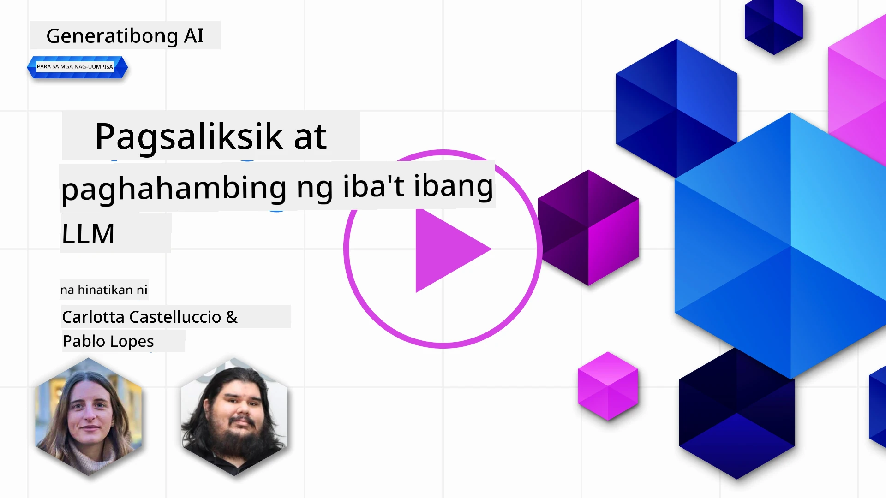](https://youtu.be/KIRUeDKscfI?si=8BHX1zvwzQBn-PlK)

> _I-click ang larawan sa itaas upang panoorin ang video ng araling ito_

Sa nakaraang aralin, nakita natin kung paano binabago ng Generative AI ang tanawin ng teknolohiya, kung paano gumagana ang Large Language Models (LLMs) at kung paano ito maaaring gamitin ng isang negosyo - tulad ng aming startup - para sa kanilang mga gamit at paglago! Sa kabanatang ito, titingnan natin ang paghahambing at pag-iiba ng iba't ibang uri ng malalaking modelo ng wika (LLMs) upang maunawaan ang kanilang mga kalamangan at kahinaan.

Ang susunod na hakbang sa paglalakbay ng aming startup ay ang pagsasaliksik ng kasalukuyang tanawin ng LLMs at pag-unawa kung alin ang angkop para sa aming gamit.

## Panimula

SAKLAWIN NG ARALIN NA ITO:

- Iba't ibang uri ng LLMs sa kasalukuyang tanawin.
- Pagsubok, pag-uulit, at paghahambing ng iba't ibang modelo para sa iyong gamit sa Azure.
- Paano i-deploy ang isang LLM.

## Mga Layunin sa Pagkatuto

Pagkatapos makumpleto ang araling ito, magagawa mong:

- Pumili ng tamang modelo para sa iyong gamit.
- Maunawaan kung paano subukan, ulitin, at pagbutihin ang performance ng iyong modelo.
- Alam kung paano i-deploy ng mga negosyo ang mga modelo.

## Unawain ang iba't ibang uri ng LLMs

Ang LLMs ay maaaring magkaroon ng maraming kategorizasyon batay sa kanilang arkitektura, training data, at gamit. Ang pag-unawa sa mga pagkakaibang ito ay makakatulong sa aming startup na pumili ng tamang modelo para sa sitwasyon, at maunawaan kung paano subukan, ulitin, at pagbutihin ang performance.

Maraming iba't ibang uri ng LLM na modelo, ang pagpili mo ng modelo ay depende sa kung ano ang layunin mo sa paggamit nito, ang iyong datos, kung gaano ka handang magbayad atbp.

Depende kung gagamitin ang mga modelo para sa teksto, audio, video, pagbuo ng imahe atbp., maaaring pumili ka ng ibang uri ng modelo.

- **Pagkilala sa audio at pagsasalita**. Ang mga Whisper-style na modelo ay kapaki-pakinabang pa rin bilang general-purpose speech recognition models, ngunit ang mga produksyon ngayon ay may mga bagong speech-to-text na modelo katulad ng `gpt-4o-transcribe`, `gpt-4o-mini-transcribe`, at mga diarization variant. Suriin ang saklaw ng wika, diarization, real-time na suporta, latency, at gastos para sa iyong sitwasyon. Alamin pa sa [OpenAI speech-to-text documentation](https://platform.openai.com/docs/guides/speech-to-text?WT.mc_id=academic-105485-koreyst).

- **Pagbuo ng imahe**. Kilalang-kilala ang DALL-E at Midjourney para sa pagbuo ng mga imahe, ngunit ang kasalukuyang OpenAI image APIs ay nakatuon sa GPT Image models tulad ng `gpt-image-2`, habang ang Stable Diffusion, Imagen, Flux, at iba pang mga pamilya ng modelo ay karaniwang pagpipilian din. Ihambing ang pagsunod sa prompt, suporta sa pag-edit, kontrol sa estilo, mga kinakailangan sa kaligtasan, at lisensya. Alamin pa sa [OpenAI image generation guide](https://platform.openai.com/docs/guides/images?WT.mc_id=academic-105485-koreyst) at Kabanata 9 ng kurikulum na ito.

- **Pagbuo ng teksto**. Ang mga modelo ng teksto ay sumasaklaw ng mga frontier models, reasoning models, mas maliit at low-latency na mga modelo, at open-weight models. Kasalukuyang halimbawa ay ang OpenAI GPT-5.x models, Anthropic Claude 4.x models, Google Gemini 3.x models, Meta Llama 4 models, at Mistral models. Huwag pumili batay lamang sa petsa ng paglabas o presyo; ihambing ang kalidad ng gawain, latency, context window, paggamit ng tools, pag-uugali sa kaligtasan, availability sa rehiyon, at kabuuang gastos. Ang [Microsoft Foundry model catalog](https://ai.azure.com/catalog?WT.mc_id=academic-105485-koreyst) ay magandang lugar para ihambing ang mga modelo na available sa Azure.

- **Multi-modality**. Maraming kasalukuyang modelo ang kayang magproseso ng higit pa sa teksto. Ang ilan ay tumatanggap ng imahe, audio, o video input; ang ilan ay maaaring tumawag ng tools; at ang mga espesyal na modelo ay nakaka-generate ng imahe, audio, o video. Halimbawa, kasalukuyang sinusuportahan ng OpenAI models ang teksto at imahe bilang input, maaaring suportahan ng Gemini models ang teksto, code, imahe, audio, at video depende sa uri, at ang Llama 4 Scout at Maverick ay open-weight natively multimodal models. Laging suriin ang bawat model card para sa mga sinusuportahang input at output modalities bago gumawa ng workflow tungkol dito.

Ang pagpili ng modelo ay nangangahulugan na makukuha mo ang ilang mga pangunahing kakayahan, ngunit maaaring hindi iyon sapat. Kadalasan ay mayroong sariling datos ang kompanya na kailangang ipaalam sa LLM. May ilang iba't ibang pagpipilian kung paano ito lapitan, na tatalakayin pa sa mga susunod na bahagi.

### Foundation Models laban sa LLMs

Ang terminong Foundation Model ay [nilikha ng mga mananaliksik sa Stanford](https://arxiv.org/abs/2108.07258?WT.mc_id=academic-105485-koreyst) at tinukoy bilang isang AI model na sumusunod sa ilang mga pamantayan, tulad ng:

- **Sila ay sinanay gamit ang unsupervised learning o self-supervised learning**, ibig sabihin ay sinanay sila sa unlabeled multi-modal na data, at hindi nangangailangan ng pag-annotate o pag-label ng tao para sa proseso ng pagsasanay.
- **Sila ay napakalalaking modelo**, batay sa napakalalim na neural network na sinanay sa bilyon-bilyong parametro.
- **Nakalaan sila upang magsilbing 'foundation' para sa ibang mga modelo**, ibig sabihin ay maaaring gamitin bilang panimulang punto para makabuo pa ng ibang mga modelo, na maaaring gawin sa pamamagitan ng fine-tuning.

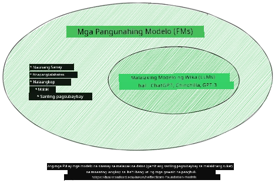

Pinagkunan ng larawan: [Essential Guide to Foundation Models and Large Language Models | by Babar M Bhatti | Medium
](https://thebabar.medium.com/essential-guide-to-foundation-models-and-large-language-models-27dab58f7404)

Upang higit pang linawin ang pagkakaibang ito, gamitin natin ang ChatGPT bilang makasaysayang halimbawa. Ang mga unang bersyon ng ChatGPT ay gumamit ng GPT-3.5 bilang foundation model. Ginamit ng OpenAI ang chat-specific data at alignment techniques upang makagawa ng na-tune na bersyon na mas mahusay sa mga senaryong pakikipag-usap, tulad ng chatbots. Madalas ang mga modernong AI service ay dumadaan sa iba't ibang variant ng mga modelo, kaya ang pangalan ng serbisyo at pangalan ng underlying model ay hindi palaging parehong bagay.

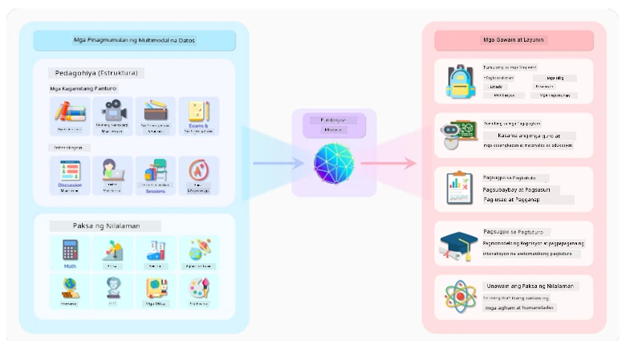

Pinagkunan ng larawan: [2108.07258.pdf (arxiv.org)](https://arxiv.org/pdf/2108.07258.pdf?WT.mc_id=academic-105485-koreyst)

### Open-Weight/Open-Source laban sa Proprietary Models

Isa pang paraan upang uriin ang LLMs ay kung open-weight, open-source, o proprietary ang mga ito.

Ang mga open-source at open-weight models ay ginagawa available ang mga model artifacts para sa inspeksyon, pag-download, o pag-customize, ngunit iba-iba ang kanilang lisensya. May ilan na ganap na open source, habang ang iba ay open-weight models na may mga limitasyon sa paggamit. Kapaki-pakinabang ang mga ito kapag kailangang kontrolin ng negosyo ang deployment, data locality, gastos, o customization. Gayunpaman, kailangan pa ring suriin ng mga koponan ang mga termino sa lisensya, gastos sa serbisyo, maintenance, security updates, at kalidad ng ebalwasyon bago gamitin sa produksyon. Halimbawa ay [Meta Llama 4](https://ai.meta.com/blog/llama-4-multimodal-intelligence/?WT.mc_id=academic-105485-koreyst), ilang [Mistral models](https://docs.mistral.ai/models/overview?WT.mc_id=academic-105485-koreyst), at maraming modelo na naka-host sa [Hugging Face](https://huggingface.co/models?WT.mc_id=academic-105485-koreyst).

Ang mga proprietary na modelo ay pag-aari at inaasikaso ng isang provider. Karaniwan itong naka-optimize para sa managed production use at maaaring magbigay ng malakas na suporta, safety systems, tool integration, at scaling. Ngunit, hindi karaniwang maaaring suriin o baguhin ng mga customer ang mga timbang ng modelo, at kailangan nilang suriin ang mga termino ng provider para sa privacy, retention, compliance, at katanggap-tanggap na paggamit. Halimbawa ay [OpenAI models](https://platform.openai.com/docs/models?WT.mc_id=academic-105485-koreyst), [Google Gemini](https://deepmind.google/models/gemini/pro/?WT.mc_id=academic-105485-koreyst), at [Anthropic Claude](https://platform.claude.com/docs/en/about-claude/models/overview?WT.mc_id=academic-105485-koreyst).

### Embedding laban sa Image generation laban sa Text at Code generation

Maaari ring uriin ang LLMs ayon sa output na kanilang nililikha.

Ang Embeddings ay isang grupo ng mga modelo na nagko-convert ng teksto sa isang numerikal na anyo, na tinatawag na embedding, isang numerical na representasyon ng input text. Pinapadali ng embeddings ang pag-unawa ng makina sa mga relasyon ng mga salita o pangungusap at maaaring gamitin bilang input ng iba pang mga modelo, tulad ng classification models o clustering models na may mas mahusay na performance sa numerical data. Madalas ginagamit ang mga embedding models para sa transfer learning, kung saan isang modelo ang binubuo para sa surrogate na gawain na may maraming data, at ang mga model weights (embeddings) ay muling ginagamit para sa ibang mga gawain. Isang halimbawa sa kategoryang ito ang [OpenAI embeddings](https://platform.openai.com/docs/models/embeddings?WT.mc_id=academic-105485-koreyst).

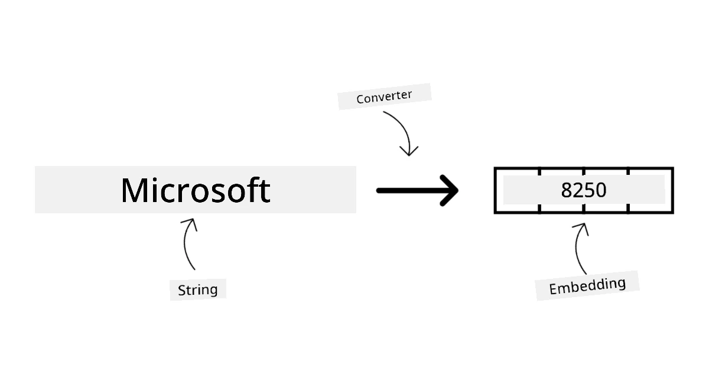

Ang mga modelong pang-image generation ay mga modelo na lumilikha ng mga larawan. Karaniwan itong ginagamit para sa pag-edit ng imahe, pagsintesis ng imahe, at pagsasalin ng imahe. Kadalasang sinasanay ang mga modelong ito sa malalaking dataset ng mga larawan tulad ng [LAION-5B](https://laion.ai/blog/laion-5b/?WT.mc_id=academic-105485-koreyst), at maaaring gamitin upang gumawa ng mga bagong larawan o mag-edit ng mga umiiral na larawan gamit ang mga teknik tulad ng inpainting, super-resolution, at colorization. Mga halimbawa ay [GPT Image models](https://platform.openai.com/docs/guides/images?WT.mc_id=academic-105485-koreyst), [Stable Diffusion models](https://github.com/Stability-AI/StableDiffusion?WT.mc_id=academic-105485-koreyst), at Imagen models.

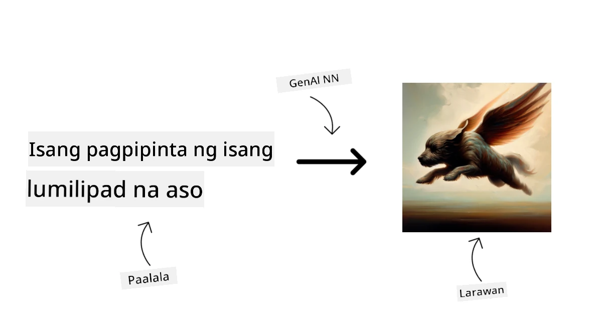

Ang mga modelong pang-text at code generation ay mga modelo na lumilikha ng teksto o code. Madalas itong gamitin para sa pagbuod ng teksto, pagsasalin, at pagsagot sa mga tanong. Kadalasang sinasanay ang mga text generation models sa malalaking dataset ng teksto tulad ng [BookCorpus](https://www.cv-foundation.org/openaccess/content_iccv_2015/html/Zhu_Aligning_Books_and_ICCV_2015_paper.html?WT.mc_id=academic-105485-koreyst), at maaari itong gamitin upang bumuo ng bagong teksto o sumagot ng mga tanong. Ang mga code generation models, tulad ng [CodeParrot](https://huggingface.co/codeparrot?WT.mc_id=academic-105485-koreyst), ay karaniwang sinasanay sa malalaking dataset ng code, tulad ng GitHub, at maaaring gamitin upang gumawa ng bagong code o ayusin ang mga bugs sa umiiral na code.

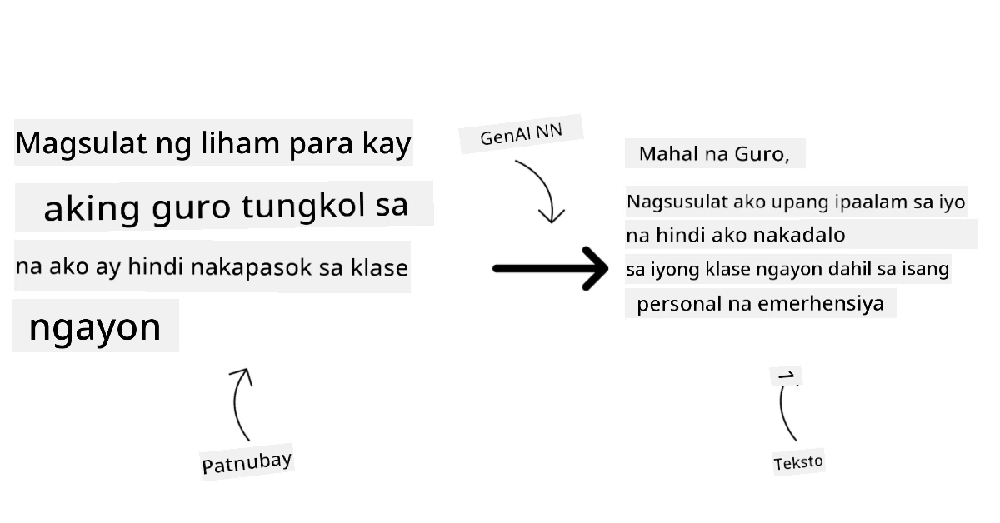

### Encoder-Decoder laban sa Decoder lamang

Upang mapag-usapan ang iba't ibang uri ng arkitektura ng LLMs, gamitin natin ang isang analohiya.

Isipin mo na ang manager mo ay nagbigay sayo ng gawain na gumawa ng isang pagsusulit para sa mga estudyante. Mayroon kang dalawang kasamahan; isa ang nangangasiwa sa paggawa ng nilalaman at ang isa naman ang nangangasiwa sa pagrerebyu nito.

Ang gumawa ng nilalaman ay parang decoder-only model: kaya nilang tingnan ang paksa, makita ang isinulat mo na, at magpatuloy sa paggawa ng nilalaman base sa konteksto. Mahusay silang gumawa ng kaakit-akit at nagbibigay-kaalaman na nilalaman, pero hindi sila laging pinakamainam kung ang gawain ay para lang magklasipika, mag-retrieve, o mag-encode ng impormasyon. Mga halimbawa ng decoder-only model families ay GPT at Llama models.

Ang nagre-review naman ay parang Encoder-only model, tinitingnan nila ang kursong naisulat at ang mga sagot, pinapansin ang relasyon sa pagitan nila at nauunawaan ang konteksto, pero hindi sila magaling sa paggawa ng nilalaman. Isang halimbawa ng Encoder-only model ay BERT.

Isipin na maaari rin tayong magkaroon ng isang tao na kayang gumawa at mag-review ng pagsusulit, ito ang Encoder-Decoder model. Mga halimbawa ay BART at T5.

### Serbisyo laban sa Modelo

Ngayon, pag-usapan natin ang pagkakaiba ng serbisyo at modelo. Ang serbisyo ay isang produkto na inaalok ng isang Cloud Service Provider, at madalas itong kombinasyon ng mga modelo, data, at iba pang bahagi. Ang modelo ang pangunahing bahagi ng serbisyo, at madalas itong foundation model, tulad ng LLM.

Ang mga serbisyo ay kadalasang naka-optimize para sa production use at kadalasang mas madaling gamitin kaysa mga modelo, sa pamamagitan ng graphical user interface. Gayunpaman, hindi palaging libre ang mga serbisyo, at maaaring kailangan ng subscription o bayad upang magamit, kapalit ng paggamit ng kagamitan at resources ng may-ari ng serbisyo, na nagpapadali ng gastos at scaling. Isang halimbawa ng serbisyo ay ang [Azure OpenAI Service](https://learn.microsoft.com/azure/ai-services/openai/overview?WT.mc_id=academic-105485-koreyst), na nag-aalok ng pay-as-you-go na rate plan, ibig sabihin ay sinisingil ang mga gumagamit based sa dami ng paggamit nila ng serbisyo. Nag-aalok din ang Azure OpenAI Service ng enterprise-grade security at isang responsible AI framework sa ibabaw ng kakayahan ng mga modelo.

Ang mga modelo ay neural network artifacts: parameters, weights, architecture, tokenizer, at supporting configuration. Ang pagpapatakbo ng modelo nang lokal o sa isang pribadong kapaligiran ay nangangailangan ng angkop na hardware, serving infrastructure, monitoring, at alinman sa compatible na open-source/open-weight license o komersyal na lisensya. Ang open-weight models tulad ng Llama 4 o Mistral models ay maaaring i-self-host, ngunit nangangailangan pa rin ito ng computational power at operational na kasanayan.

## Paano subukan at ulitin gamit ang iba't ibang modelo upang maunawaan ang performance sa Azure

Kapag na-explore na ng aming koponan ang kasalukuyang tanawin ng LLMs at nakilala ang ilang magagandang kandidato para sa kanilang mga scenario, ang susunod na hakbang ay subukan ang mga ito gamit ang kanilang data at workload. Ito ay isang paulit-ulit na proseso, ginagawa sa pamamagitan ng mga eksperimento at pagsukat.
Karamihan sa mga modelong nabanggit namin sa mga naunang talata (mga modelo ng OpenAI, mga open-weight na modelo tulad ng Llama 4 at Mistral, at mga modelo ng Hugging Face) ay available sa [Microsoft Foundry Models](https://learn.microsoft.com/azure/foundry/concepts/foundry-models-overview?WT.mc_id=academic-105485-koreyst).

[Microsoft Foundry](https://learn.microsoft.com/azure/foundry/what-is-foundry?WT.mc_id=academic-105485-koreyst), na dating Azure AI Studio/Azure AI Foundry, ay isang pinag-isang Azure platform para sa pagbuo ng AI apps at mga ahente. Tinutulungan nito ang mga developer na pamahalaan ang lifecycle mula sa eksperimento at ebalwasyon hanggang sa deployment, pagmamanman, at pamamahala. Pinapayagan ng catalog ng modelo sa Microsoft Foundry ang gumagamit na:

- Hanapin ang foundation model na interes sa catalog, kabilang ang mga modelong ibinenta ng Azure at mga modelong mula sa mga partner at mga tagapagbigay ng komunidad. Maaaring i-filter ng mga gumagamit ayon sa gawain, provider, lisensya, opsyon sa deployment, o pangalan.

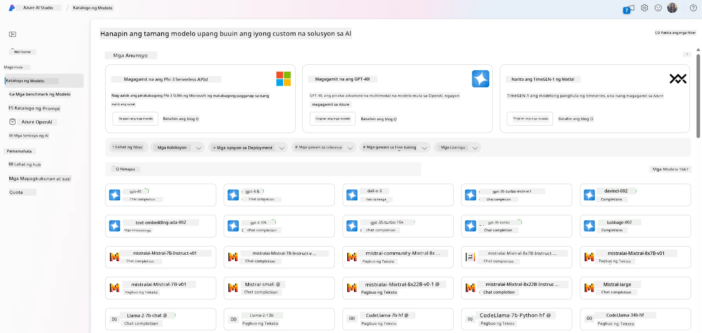

- Suriin ang model card, kabilang ang detalyadong paglalarawan ng layunin ng paggamit at data sa pagsasanay, mga sample ng code, at mga resulta ng ebalwasyon sa internal evaluations library.

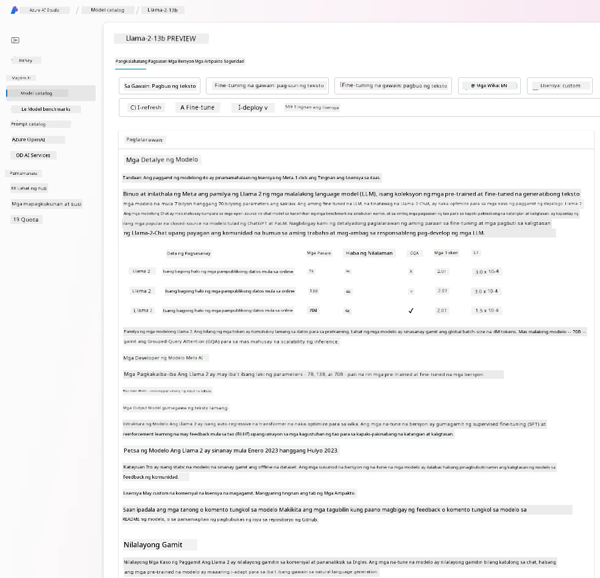

- Ihambing ang benchmarks sa iba't ibang mga modelo at dataset na available sa industriya upang matasa kung alin ang nakakatugon sa business scenario, sa pamamagitan ng [Model Benchmarks](https://learn.microsoft.com/azure/ai-studio/how-to/model-benchmarks?WT.mc_id=academic-105485-koreyst) pane.

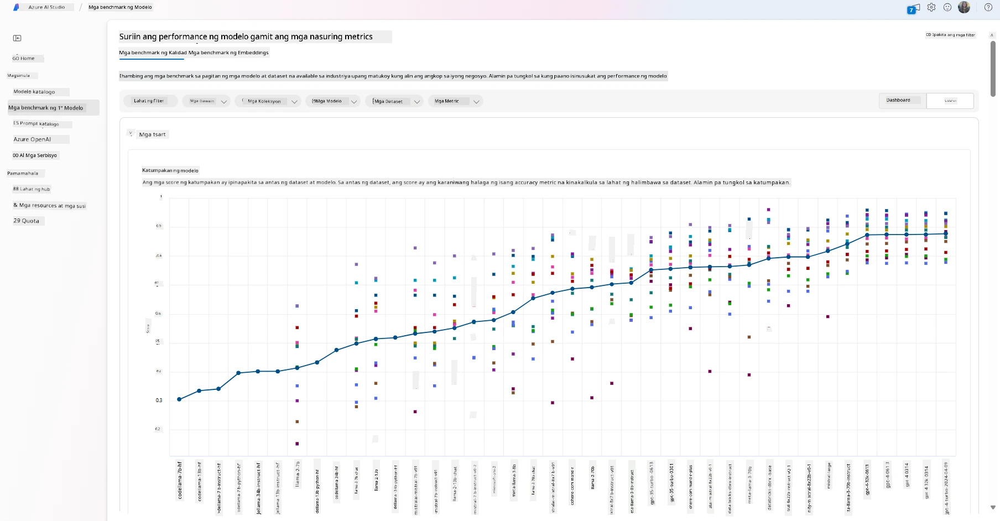

- Mag-fine-tune ng mga suportadong modelo gamit ang custom training data upang pagbutihin ang performance ng modelo sa isang partikular na workload, gamit ang mga kakayahan sa eksperimento at pagsubaybay ng Microsoft Foundry.

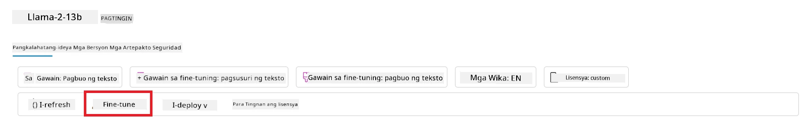

- I-deploy ang orihinal na pre-trained model o ang fine-tuned na bersyon sa isang remote real-time inference endpoint, gamit ang managed compute o serverless deployment options, upang payagan ang mga aplikasyon na gamitin ito.

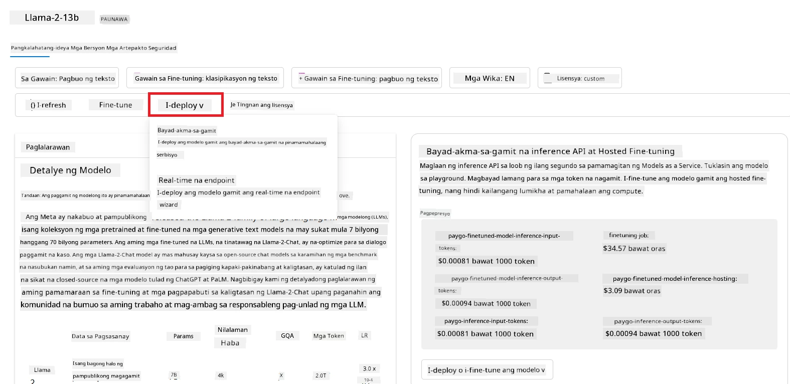

> [!NOTE]
> Hindi lahat ng modelo sa catalog ay kasalukuyang available para sa fine-tuning at/o pay-as-you-go deployment. Suriin ang model card para sa mga detalye tungkol sa mga kakayahan at limitasyon ng modelo.

## Pagpapabuti ng mga resulta ng LLM

Nasubukan namin kasama ang aming startup team ang iba't ibang uri ng LLMs at isang cloud platform (Microsoft Foundry) na nagbibigay-daan sa amin na ikumpara ang iba't ibang mga modelo, suriin ang mga ito gamit ang test data, pagbutihin ang performance, at i-deploy ang mga ito sa mga inference endpoint.

Ngunit kailan nila dapat isaalang-alang ang pag-fine-tune ng isang modelo sa halip na gumamit ng pre-trained na isa? Mayroon bang ibang mga pamamaraan para mapabuti ang performance ng modelo sa mga partikular na workload?

Mayroong ilang mga pamamaraan na maaring gamitin ng isang negosyo upang makuha ang mga resulta na kailangan nila mula sa isang LLM. Maaari kang pumili ng iba't ibang uri ng mga modelo na may iba't ibang antas ng pagsasanay kapag nagde-deploy ng isang LLM sa produksyon, na may iba't ibang antas ng komplikasyon, gastos, at kalidad. Narito ang ilang mga pamamaraan:

- **Prompt engineering kasama ang konteksto**. Ang ideya ay magbigay ng sapat na konteksto kapag nagpi-prompt upang matiyak na makukuha mo ang mga sagot na kailangan mo.

- **Retrieval Augmented Generation, RAG**. Maaaring ang iyong data ay nasa database o web endpoint halimbawa, upang matiyak na ang data na ito, o bahagi nito, ay kasama sa oras ng pag-prompt, maaari mong kunin ang kaugnay na data at gawin itong bahagi ng prompt ng gumagamit.

- **Fine-tuned na modelo**. Dito, sinanay mo pa ang modelo gamit ang iyong sariling data na nagdulot ng pagiging mas eksakto at responsive ng modelo sa iyong mga pangangailangan ngunit maaaring maging magastos.

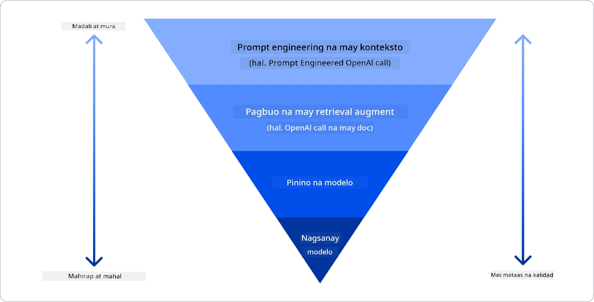

Pinagmulan ng larawan: [Four Ways that Enterprises Deploy LLMs | Fiddler AI Blog](https://www.fiddler.ai/blog/four-ways-that-enterprises-deploy-llms?WT.mc_id=academic-105485-koreyst)

### Prompt Engineering kasama ang Konteksto

Ang mga pre-trained na LLM ay mahusay gumana sa mga generalized na gawain sa natural language, kahit na tawagin lang gamit ang maikling prompt, tulad ng isang pangungusap na kailangang kumpletuhin o isang tanong – ang tinatawag na “zero-shot” learning.

Gayunpaman, kapag mas naipapakita ng gumagamit ang kanyang query, gamit ang detalyadong kahilingan at mga halimbawa – ang Konteksto – mas magiging tumpak at malapit sa inaasahan ng gumagamit ang sagot. Sa ganitong kaso, tinatawag itong “one-shot” learning kung may isang halimbawa lang ang prompt at “few shot learning” kung mayroong maraming halimbawa.
Ang prompt engineering kasama ang konteksto ang pinaka-makatipid na paraan upang magsimula.

### Retrieval Augmented Generation (RAG)

May limitasyon ang mga LLM na maaari lamang nilang gamitin ang data na ginamit sa kanilang pagsasanay upang makabuo ng sagot. Ibig sabihin nito na wala silang kaalaman tungkol sa mga pangyayaring naganap pagkatapos ng kanilang pagsasanay, at hindi nila ma-access ang mga impormasyong hindi pampubliko (tulad ng data ng kumpanya).
Ito ay maaaring malampasan sa pamamagitan ng RAG, isang teknikal na paraan na nagdadagdag ng panlabas na data sa prompt sa anyo ng mga bahagi ng dokumento, isinasaalang-alang ang limitasyon sa haba ng prompt. Sinusuportahan ito ng mga Vector database tools (tulad ng [Azure Vector Search](https://learn.microsoft.com/azure/search/vector-search-overview?WT.mc_id=academic-105485-koreyst)) na kumukuha ng mga mahalagang bahagi mula sa iba't ibang mga paunang-depensang pinagmumulan ng data at idinadagdag ang mga ito sa Konteksto ng prompt.

Ang teknik na ito ay napaka-kapaki-pakinabang kapag ang isang negosyo ay walang sapat na data, sapat na oras, o mga mapagkukunan upang mag-fine-tune ng LLM, ngunit nais pa ring pagbutihin ang performance sa isang partikular na workload at bawasan ang mga panganib ng mga hallucinated, lipas na, o hindi suportadong mga sagot.

### Fine-tuned na modelo

Ang fine-tuning ay isang proseso na gumagamit ng transfer learning upang ‘i-adapt’ ang modelo sa isang downstream task o upang lutasin ang isang partikular na problema. Naiiba ito sa few-shot learning at RAG, na nagreresulta sa pagbuo ng bagong modelo, na may mga updated na weights at biases. Nangangailangan ito ng isang set ng mga halimbawa sa pagsasanay na binubuo ng isang input (ang prompt) at ang kaugnay na output nito (ang completion).
Ito ang magiging paboritong pamamaraan kung:

- **Paggamit ng mas maliit na task-specific models**. Nais ng isang negosyo na mag-fine-tune ng mas maliit na modelo para sa isang sikip na gawain sa halip na paulit-ulit na gamitin ang isang mas malaking frontier na modelo, na nagreresulta sa mas matipid at mabilis na solusyon.

- **Isinasaalang-alang ang latency**. Mahalaga ang latency para sa isang partikular na gamit, kaya hindi maaaring gumamit ng napakahabang mga prompt o ang bilang ng mga halimbawang dapat matutunan ng modelo ay hindi kasya sa limitasyon ng haba ng prompt.

- **Pagsasaayos ng matatag na pag-uugali**. Mayroon ang negosyo ng maraming mataas na kalidad na halimbawa at nais nilang sundan ng modelo nang palagian ang pattern ng gawain, format ng output, tono, o istilo na partikular sa domain. Kung ang pangunahing problema ay mga sariwang kaalaman o pribadong impormasyon na madalas nagbabago, gamitin ang RAG sa halip na umasa lamang sa fine-tuning.

### Sinangayang modelo

Ang pagsasanay ng isang LLM mula sa simula ay walang dudang pinakamahirap at pinaka-komplikadong pamamaraan upang gawin, na nangangailangan ng napakaraming data, mahuhusay na tauhan, at angkop na computational power. Dapat ikonsidera lamang ang opsyong ito kapag may domain-specific use case ang negosyo at malaking dami ng domain-centric data.

## Pagsusulit sa Kaalaman

Ano ang maaaring magandang pamamaraan upang mapabuti ang mga resulta ng LLM completion?

1. Prompt engineering kasama ang konteksto
1. RAG
1. Fine-tuned na modelo

A: Lahat ng tatlo ay makakatulong. Magsimula sa prompt engineering at konteksto para sa mabilisang pagpapabuti, at gamitin ang RAG kapag kailangan ng modelo ng kasalukuyang mga katotohanan o pribadong data ng negosyo. Piliin ang fine-tuning kapag mayroon kang sapat na mataas na kalidad na mga halimbawa at kailangan mo na sundan ng modelo nang palagian ang isang gawain, format, tono, o pattern ng domain.

## 🚀 Hamon

Magbasa pa tungkol sa kung paano mo maaaring [gamitin ang RAG](https://learn.microsoft.com/azure/search/retrieval-augmented-generation-overview?WT.mc_id=academic-105485-koreyst) para sa iyong negosyo.

## Magaling na Trabaho, Ipagpatuloy ang Iyong Pag-aaral

Pagkatapos makumpleto ang araling ito, tingnan ang aming [Generative AI Learning collection](https://aka.ms/genai-collection?WT.mc_id=academic-105485-koreyst) upang ipagpatuloy ang pagpapalawak ng iyong kaalaman sa Generative AI!

Pumunta sa Lesson 3 kung saan titingnan natin kung paano [gumawa gamit ang Generative AI nang Responsable](../03-using-generative-ai-responsibly/README.md?WT.mc_id=academic-105485-koreyst)!

---

<!-- CO-OP TRANSLATOR DISCLAIMER START -->
**Pagtatanggi**:
Ang dokumentong ito ay isinalin gamit ang serbisyo ng AI translation na [Co-op Translator](https://github.com/Azure/co-op-translator). Bagama't nagsusumikap kami para sa katumpakan, pakatandaan na ang awtomatikong pagsasalin ay maaaring maglaman ng mga pagkakamali o hindi pagkakatugma. Ang orihinal na dokumento sa orihinal nitong wika ang dapat ituring na pangunahing sanggunian. Para sa mahahalagang impormasyon, inirerekomenda ang propesyonal na pagsasalin ng tao. Hindi kami mananagot sa anumang maling pagkakaintindi o maling interpretasyon na nagmula sa paggamit ng pagsasaling ito.
<!-- CO-OP TRANSLATOR DISCLAIMER END -->