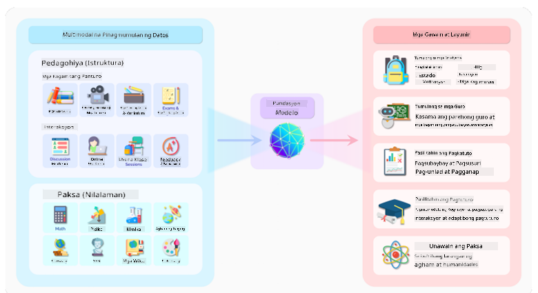
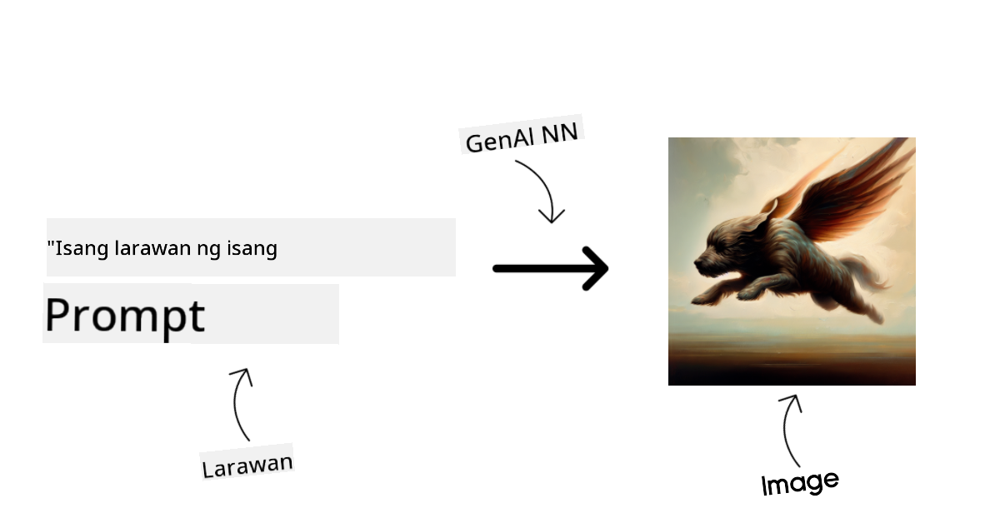
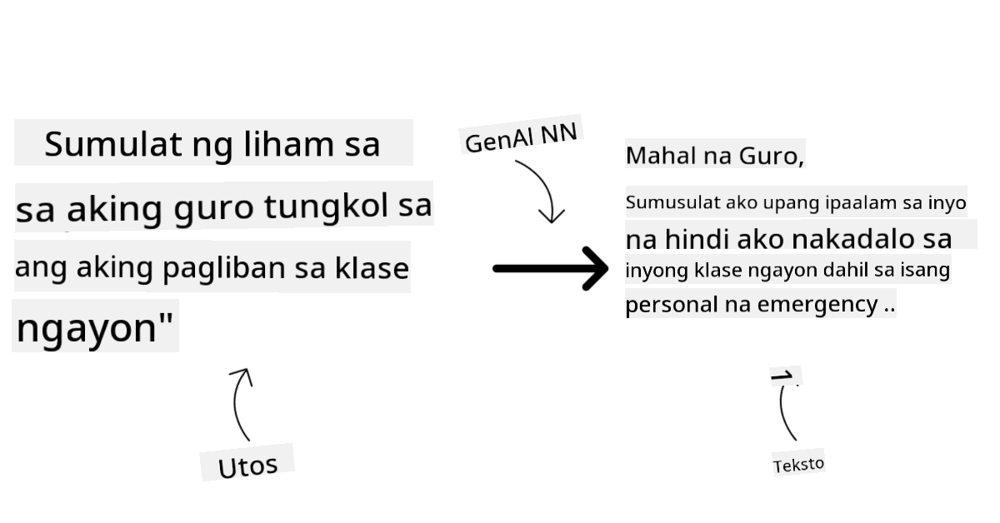
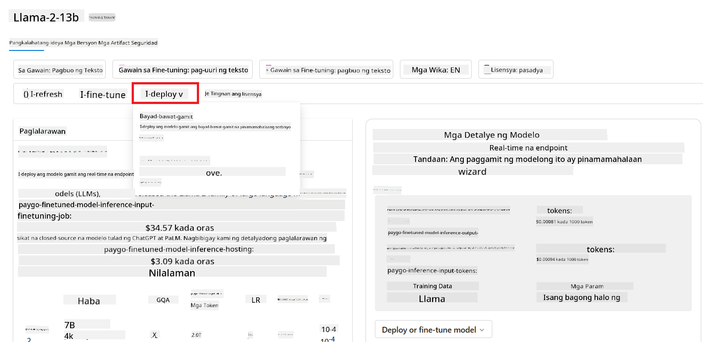

<!--
CO_OP_TRANSLATOR_METADATA:
{
  "original_hash": "e2f686f2eb794941761252ac5e8e090b",
  "translation_date": "2025-07-09T08:35:26+00:00",
  "source_file": "02-exploring-and-comparing-different-llms/README.md",
  "language_code": "tl"
}
-->
# Pagsusuri at Paghahambing ng Iba’t Ibang LLMs

> _I-click ang larawan sa itaas para mapanood ang video ng araling ito_

Sa nakaraang aralin, nakita natin kung paano binabago ng Generative AI ang teknolohiyang ginagamit natin, kung paano gumagana ang Large Language Models (LLMs), at kung paano maaaring gamitin ng isang negosyo—tulad ng aming startup—ang mga ito sa kanilang mga kaso at lumago! Sa kabanatang ito, titingnan natin ang paghahambing at pagkakaiba ng iba't ibang uri ng LLMs upang maunawaan ang kanilang mga kalakasan at kahinaan.

Ang susunod na hakbang sa paglalakbay ng aming startup ay ang pagsusuri sa kasalukuyang kalagayan ng LLMs at pag-unawa kung alin ang angkop para sa aming mga pangangailangan.

## Panimula

Saklaw ng araling ito ang:

- Iba’t ibang uri ng LLMs sa kasalukuyang kalagayan.
- Pagsubok, pag-uulit, at paghahambing ng iba't ibang modelo para sa iyong kaso sa Azure.
- Paano mag-deploy ng isang LLM.

## Mga Layunin sa Pagkatuto

Pagkatapos makumpleto ang araling ito, magagawa mong:

- Pumili ng tamang modelo para sa iyong kaso.
- Maunawaan kung paano subukan, ulitin, at pagbutihin ang performance ng iyong modelo.
- Malaman kung paano nagde-deploy ng mga modelo ang mga negosyo.

## Unawain ang Iba’t Ibang Uri ng LLMs

Maaaring hatiin ang LLMs batay sa kanilang arkitektura, training data, at gamit. Ang pag-unawa sa mga pagkakaibang ito ay makakatulong sa aming startup na pumili ng tamang modelo para sa sitwasyon, at malaman kung paano subukan, ulitin, at pagbutihin ang performance.

Maraming uri ng LLM models, at ang pagpili mo ay depende sa layunin mo sa paggamit, sa iyong data, kung gaano kalaki ang handa mong gastusin, at iba pa.

Depende kung gagamitin mo ang mga modelo para sa teksto, audio, video, paglikha ng larawan, atbp., maaaring pumili ka ng ibang uri ng modelo.

- **Pagkilala sa audio at pagsasalita**. Para dito, mahusay ang mga Whisper-type models dahil pangkalahatan ang gamit at nakatuon sa speech recognition. Sinanay ito gamit ang iba’t ibang audio at kaya nitong magsagawa ng multilingual speech recognition. Alamin pa ang tungkol sa [Whisper type models dito](https://platform.openai.com/docs/models/whisper?WT.mc_id=academic-105485-koreyst).

- **Paglikha ng larawan**. Para sa paglikha ng larawan, kilalang-kilala ang DALL-E at Midjourney. Ang DALL-E ay inaalok ng Azure OpenAI. [Basahin pa tungkol sa DALL-E dito](https://platform.openai.com/docs/models/dall-e?WT.mc_id=academic-105485-koreyst) at pati na rin sa Kabanata 9 ng kurikulum na ito.

- **Paglikha ng teksto**. Karamihan sa mga modelo ay sinanay para sa paglikha ng teksto at marami kang pagpipilian mula GPT-3.5 hanggang GPT-4. Iba-iba ang presyo, kung saan ang GPT-4 ang pinakamahal. Mainam na subukan ang [Azure OpenAI playground](https://oai.azure.com/portal/playground?WT.mc_id=academic-105485-koreyst) upang makita kung alin ang pinakaangkop sa iyong pangangailangan sa kakayahan at gastos.

- **Multi-modality**. Kung nais mong hawakan ang iba’t ibang uri ng data sa input at output, maaaring tingnan ang mga modelo tulad ng [gpt-4 turbo with vision o gpt-4o](https://learn.microsoft.com/azure/ai-services/openai/concepts/models#gpt-4-and-gpt-4-turbo-models?WT.mc_id=academic-105485-koreyst) — ang pinakabagong mga release ng OpenAI models — na kayang pagsamahin ang natural language processing at visual understanding, na nagpapahintulot ng interaksyon gamit ang multi-modal interfaces.

Ang pagpili ng modelo ay nangangahulugan na makakakuha ka ng mga pangunahing kakayahan, ngunit maaaring hindi ito sapat. Madalas, may mga datos na partikular sa kumpanya na kailangang ipaalam sa LLM. May ilang paraan kung paano ito gawin, na tatalakayin pa sa mga susunod na bahagi.

### Foundation Models kumpara sa LLMs

Ang terminong Foundation Model ay [nilikhang ng mga mananaliksik sa Stanford](https://arxiv.org/abs/2108.07258?WT.mc_id=academic-105485-koreyst) at tinukoy bilang isang AI model na sumusunod sa ilang pamantayan, tulad ng:

- **Sina-sanay gamit ang unsupervised learning o self-supervised learning**, ibig sabihin, sinanay ito gamit ang unlabeled na multi-modal data, at hindi nangangailangan ng human annotation o pag-label ng data para sa proseso ng pagsasanay.
- **Napakalalaking modelo**, batay sa malalalim na neural networks na sinanay gamit ang bilyon-bilyong parameters.
- **Karaniwang nilalayon bilang ‘foundation’ para sa ibang mga modelo**, ibig sabihin, maaari itong maging panimulang punto para sa pagbuo ng iba pang mga modelo sa pamamagitan ng fine-tuning.

Pinagmulan ng larawan: [Essential Guide to Foundation Models and Large Language Models | by Babar M Bhatti | Medium](https://thebabar.medium.com/essential-guide-to-foundation-models-and-large-language-models-27dab58f7404)

Para mas malinaw ang pagkakaiba, gamitin natin ang ChatGPT bilang halimbawa. Sa paggawa ng unang bersyon ng ChatGPT, ginamit ang modelong GPT-3.5 bilang foundation model. Ibig sabihin, ginamit ng OpenAI ang ilang chat-specific na data upang makagawa ng isang tuned na bersyon ng GPT-3.5 na espesyal na mahusay sa mga conversational na sitwasyon, tulad ng chatbots.

Pinagmulan ng larawan: [2108.07258.pdf (arxiv.org)](https://arxiv.org/pdf/2108.07258.pdf?WT.mc_id=academic-105485-koreyst)

### Open Source kumpara sa Proprietary Models

Isa pang paraan ng pagkategorya ng LLMs ay kung open source ba o proprietary ang mga ito.

Ang open-source models ay mga modelo na bukas sa publiko at maaaring gamitin ng kahit sino. Kadalasan, inilalabas ito ng kumpanyang gumawa o ng research community. Pinapayagan ang mga ito na suriin, baguhin, at i-customize para sa iba’t ibang gamit ng LLMs. Ngunit hindi palaging optimized para sa production use, at maaaring hindi kasing ganda ang performance kumpara sa proprietary models. Bukod dito, limitado ang pondo para sa open-source models, at maaaring hindi ito mapanatili o ma-update nang matagal. Ilan sa mga kilalang open source models ay [Alpaca](https://crfm.stanford.edu/2023/03/13/alpaca.html?WT.mc_id=academic-105485-koreyst), [Bloom](https://huggingface.co/bigscience/bloom), at [LLaMA](https://llama.meta.com).

Ang proprietary models naman ay pag-aari ng isang kumpanya at hindi inilalabas sa publiko. Kadalasan, optimized ang mga ito para sa production use. Ngunit hindi pinapayagan ang pagsusuri, pagbabago, o pag-customize para sa iba’t ibang gamit. Hindi rin palaging libre ang mga ito at maaaring kailanganin ng subscription o bayad para magamit. Wala ring kontrol ang mga user sa data na ginamit sa pagsasanay ng modelo, kaya dapat pagkatiwalaan ang may-ari ng modelo sa pagtiyak ng data privacy at responsableng paggamit ng AI. Ilan sa mga kilalang proprietary models ay ang [OpenAI models](https://platform.openai.com/docs/models/overview?WT.mc_id=academic-105485-koreyst), [Google Bard](https://sapling.ai/llm/bard?WT.mc_id=academic-105485-koreyst), at [Claude 2](https://www.anthropic.com/index/claude-2?WT.mc_id=academic-105485-koreyst).

### Embedding kumpara sa Image generation kumpara sa Text at Code generation

Maaaring ikategorya ang LLMs batay sa output na kanilang nililikha.

Ang embeddings ay mga modelo na kayang gawing numerikal na anyo ang teksto, na tinatawag na embedding, isang numerikal na representasyon ng input na teksto. Pinapadali ng embeddings para sa mga makina na maunawaan ang relasyon ng mga salita o pangungusap at maaaring gamitin bilang input ng ibang mga modelo, tulad ng classification models o clustering models na mas mahusay sa numerikal na data. Madalas gamitin ang embedding models para sa transfer learning, kung saan ang modelo ay binubuo para sa isang surrogate task na maraming data, at pagkatapos ay ginagamit muli ang mga model weights (embeddings) para sa iba pang mga gawain. Isang halimbawa nito ay ang [OpenAI embeddings](https://platform.openai.com/docs/models/embeddings?WT.mc_id=academic-105485-koreyst).

Ang image generation models ay mga modelo na lumilikha ng mga larawan. Madalas gamitin ang mga ito para sa pag-edit ng larawan, image synthesis, at image translation. Sinanay ang mga ito gamit ang malalaking dataset ng mga larawan, tulad ng [LAION-5B](https://laion.ai/blog/laion-5b/?WT.mc_id=academic-105485-koreyst), at maaaring gamitin para gumawa ng bagong larawan o mag-edit ng mga umiiral na larawan gamit ang inpainting, super-resolution, at colorization techniques. Ilan sa mga halimbawa ay ang [DALL-E-3](https://openai.com/dall-e-3?WT.mc_id=academic-105485-koreyst) at [Stable Diffusion models](https://github.com/Stability-AI/StableDiffusion?WT.mc_id=academic-105485-koreyst).

Ang text at code generation models ay mga modelo na lumilikha ng teksto o code. Madalas gamitin ang mga ito para sa text summarization, pagsasalin, at pagsagot sa mga tanong. Sinanay ang mga text generation models gamit ang malalaking dataset ng teksto, tulad ng [BookCorpus](https://www.cv-foundation.org/openaccess/content_iccv_2015/html/Zhu_Aligning_Books_and_ICCV_2015_paper.html?WT.mc_id=academic-105485-koreyst), at maaaring gamitin para gumawa ng bagong teksto o sumagot ng mga tanong. Ang mga code generation models, tulad ng [CodeParrot](https://huggingface.co/codeparrot?WT.mc_id=academic-105485-koreyst), ay sinanay gamit ang malalaking dataset ng code, tulad ng GitHub, at maaaring gamitin para gumawa ng bagong code o ayusin ang mga bug sa umiiral na code.

### Encoder-Decoder kumpara sa Decoder-only

Para pag-usapan ang iba’t ibang uri ng arkitektura ng LLMs, gamitin natin ang isang halimbawa.

Isipin na binigyan ka ng manager mo ng gawain na gumawa ng quiz para sa mga estudyante. Mayroon kang dalawang kasamahan; ang isa ay gumagawa ng nilalaman at ang isa naman ay nagrerebyu nito.

Ang gumagawa ng nilalaman ay parang Decoder-only model, kaya niyang tingnan ang paksa at ang mga naisulat mo na, at makakagawa siya ng kurso base doon. Magaling silang gumawa ng nakakaengganyo at impormatibong nilalaman, pero hindi sila ganoon kagaling sa pag-unawa ng paksa at mga layunin sa pagkatuto. Ilan sa mga halimbawa ng Decoder models ay ang GPT family models, tulad ng GPT-3.

Ang nagrerebyu naman ay parang Encoder-only model, tinitingnan nila ang naisulat na kurso at mga sagot, napapansin ang relasyon ng mga ito at nauunawaan ang konteksto, pero hindi sila magaling sa paggawa ng nilalaman. Isang halimbawa ng Encoder-only model ay ang BERT.

Isipin na mayroon tayong isang tao na kayang gumawa at magrebyu ng quiz, ito ang Encoder-Decoder model. Ilan sa mga halimbawa nito ay ang BART at T5.

### Serbisyo kumpara sa Modelo

Ngayon, pag-usapan natin ang pagkakaiba ng serbisyo at modelo. Ang serbisyo ay isang produkto na inaalok ng Cloud Service Provider, at kadalasan ay kombinasyon ng mga modelo, data, at iba pang bahagi. Ang modelo naman ang pangunahing bahagi ng serbisyo, at kadalasan ay isang foundation model, tulad ng LLM.

Kadalasan, ang mga serbisyo ay optimized para sa production use at mas madaling gamitin kaysa mga modelo, sa pamamagitan ng graphical user interface. Ngunit hindi palaging libre ang mga serbisyo, at maaaring kailanganin ng subscription o bayad para magamit, kapalit ng paggamit ng kagamitan at resources ng may-ari ng serbisyo, na nakakatulong sa pag-optimize ng gastos at madaling pag-scale. Isang halimbawa ng serbisyo ay ang [Azure OpenAI Service](https://learn.microsoft.com/azure/ai-services/openai/overview?WT.mc_id=academic-105485-koreyst), na nag-aalok ng pay-as-you-go rate plan, ibig sabihin, sinisingil ang mga user base sa dami ng paggamit nila sa serbisyo. Nagbibigay din ang Azure OpenAI Service ng enterprise-grade security at isang responsible AI framework bilang dagdag sa kakayahan ng mga modelo.

Ang mga modelo ay ang Neural Network mismo, kasama ang mga parameters, weights, at iba pa. Pinapayagan nito ang mga kumpanya na patakbuhin ito nang lokal, ngunit kailangan nilang bumili ng kagamitan, magtayo ng istruktura para sa pag-scale, at bumili ng lisensya o gumamit ng open-source model. Halimbawa, ang modelong LLaMA ay available para gamitin, ngunit nangangailangan ng computational power para patakbuhin ito.

## Paano Subukan at Ulitin ang Iba’t Ibang Modelo para Maunawaan ang Performance sa Azure

Kapag nasuri na ng aming koponan ang kasalukuyang kalagayan ng LLMs at nakapili ng ilang angkop na kandidato para sa kanilang mga sitwasyon, ang susunod na hakbang ay subukan ang mga ito gamit ang kanilang data at workload. Isang paulit-ulit na proseso ito na ginagawa sa pamamagitan ng mga eksperimento at pagsukat.
Karamihan sa mga modelong nabanggit namin sa mga naunang talata (mga OpenAI models, open source models tulad ng Llama2, at Hugging Face transformers) ay makikita sa [Model Catalog](https://learn.microsoft.com/azure/ai-studio/how-to/model-catalog-overview?WT.mc_id=academic-105485-koreyst) sa [Azure AI Studio](https://ai.azure.com/?WT.mc_id=academic-105485-koreyst).

[Azure AI Studio](https://learn.microsoft.com/azure/ai-studio/what-is-ai-studio?WT.mc_id=academic-105485-koreyst) ay isang Cloud Platform na dinisenyo para sa mga developer upang makabuo ng mga generative AI application at pamahalaan ang buong lifecycle ng development - mula sa eksperimento hanggang sa pagsusuri - sa pamamagitan ng pagsasama-sama ng lahat ng Azure AI services sa isang sentrong may madaling gamitin na GUI. Pinapayagan ng Model Catalog sa Azure AI Studio ang user na:

- Hanapin ang Foundation Model na interesado sa katalogo - maaaring proprietary o open source, gamit ang filter ayon sa gawain, lisensya, o pangalan. Upang mapadali ang paghahanap, ang mga modelo ay inayos sa mga koleksyon, tulad ng Azure OpenAI collection, Hugging Face collection, at iba pa.

- Suriin ang model card, kabilang ang detalyadong paglalarawan ng layunin ng paggamit at training data, mga halimbawa ng code, at mga resulta ng pagsusuri mula sa internal evaluations library.

- Ihambing ang mga benchmark sa pagitan ng mga modelo at datasets na available sa industriya upang matukoy kung alin ang pinakaangkop sa business scenario, sa pamamagitan ng [Model Benchmarks](https://learn.microsoft.com/azure/ai-studio/how-to/model-benchmarks?WT.mc_id=academic-105485-koreyst) pane.

- I-fine-tune ang modelo gamit ang custom training data upang mapabuti ang performance nito sa isang partikular na gawain, gamit ang mga kakayahan sa eksperimento at pagsubaybay ng Azure AI Studio.

- I-deploy ang orihinal na pre-trained na modelo o ang fine-tuned na bersyon sa remote real time inference - managed compute - o serverless API endpoint - [pay-as-you-go](https://learn.microsoft.com/azure/ai-studio/how-to/model-catalog-overview#model-deployment-managed-compute-and-serverless-api-pay-as-you-go?WT.mc_id=academic-105485-koreyst) - upang magamit ito ng mga application.

> [!NOTE]
> Hindi lahat ng modelo sa katalogo ay kasalukuyang available para sa fine-tuning at/o pay-as-you-go deployment. Tingnan ang model card para sa mga detalye tungkol sa kakayahan at limitasyon ng modelo.

## Pagpapabuti ng Resulta ng LLM

Nasubukan namin kasama ang aming startup team ang iba't ibang uri ng LLMs at isang Cloud Platform (Azure Machine Learning) na nagbibigay-daan sa amin upang ihambing ang iba't ibang modelo, suriin ang mga ito gamit ang test data, pagbutihin ang performance, at i-deploy sa inference endpoints.

Ngunit kailan ba dapat isaalang-alang ang pag-fine-tune ng isang modelo kaysa gumamit ng pre-trained na modelo? Mayroon pa bang ibang paraan upang mapabuti ang performance ng modelo sa mga partikular na gawain?

May ilang paraan na maaaring gamitin ng isang negosyo upang makuha ang resulta na kailangan nila mula sa isang LLM. Maaari kang pumili ng iba't ibang uri ng modelo na may iba't ibang antas ng training kapag nagde-deploy ng LLM sa production, na may iba't ibang antas ng komplikasyon, gastos, at kalidad. Narito ang ilang mga paraan:

- **Prompt engineering na may konteksto**. Ang ideya ay magbigay ng sapat na konteksto kapag nag-prompt upang matiyak na makukuha mo ang mga sagot na kailangan mo.

- **Retrieval Augmented Generation, RAG**. Maaaring ang iyong data ay nasa isang database o web endpoint, halimbawa, upang matiyak na ang data na ito, o bahagi nito, ay maisama sa oras ng pag-prompt, maaari mong kunin ang kaugnay na data at gawing bahagi ito ng prompt ng user.

- **Fine-tuned na modelo**. Dito, pinagpatuloy mong i-train ang modelo gamit ang sarili mong data na nagresulta sa mas eksakto at tumutugon na modelo sa iyong mga pangangailangan ngunit maaaring maging magastos.

Pinagmulan ng larawan: [Four Ways that Enterprises Deploy LLMs | Fiddler AI Blog](https://www.fiddler.ai/blog/four-ways-that-enterprises-deploy-llms?WT.mc_id=academic-105485-koreyst)

### Prompt Engineering na may Konteksto

Ang mga pre-trained na LLM ay mahusay sa mga pangkalahatang gawain sa natural language, kahit na sa pamamagitan ng maikling prompt, tulad ng isang pangungusap na kailangang tapusin o isang tanong – ang tinatawag na “zero-shot” learning.

Gayunpaman, kapag mas naipapaliwanag ng user ang kanilang query, gamit ang detalyadong kahilingan at mga halimbawa – ang Konteksto – mas magiging tumpak at malapit sa inaasahan ng user ang sagot. Sa kasong ito, tinatawag itong “one-shot” learning kung ang prompt ay may isang halimbawa lamang at “few-shot learning” kung may maraming halimbawa.
Ang prompt engineering na may konteksto ang pinaka-makatipid na paraan upang magsimula.

### Retrieval Augmented Generation (RAG)

May limitasyon ang mga LLM na maaari lamang nilang gamitin ang data na ginamit sa kanilang training upang makabuo ng sagot. Ibig sabihin, hindi nila alam ang mga pangyayari pagkatapos ng kanilang training process, at hindi rin nila ma-access ang mga hindi pampublikong impormasyon (tulad ng data ng kumpanya).
Ito ay maaaring malampasan gamit ang RAG, isang teknik na nagdadagdag ng panlabas na data sa prompt sa anyo ng mga bahagi ng dokumento, isinasaalang-alang ang limitasyon sa haba ng prompt. Sinusuportahan ito ng mga Vector database tools (tulad ng [Azure Vector Search](https://learn.microsoft.com/azure/search/vector-search-overview?WT.mc_id=academic-105485-koreyst)) na kumukuha ng mga kapaki-pakinabang na bahagi mula sa iba't ibang pre-defined na pinagkukunan ng data at idinadagdag ito sa Konteksto ng prompt.

Napakabisa ng teknik na ito kapag ang isang negosyo ay walang sapat na data, oras, o resources para mag-fine-tune ng LLM, ngunit nais pa ring mapabuti ang performance sa isang partikular na gawain at mabawasan ang panganib ng mga maling impormasyon, halimbawa, paglikha ng pekeng katotohanan o mapanganib na nilalaman.

### Fine-tuned na modelo

Ang fine-tuning ay isang proseso na gumagamit ng transfer learning upang ‘i-adapt’ ang modelo sa isang downstream na gawain o upang lutasin ang isang partikular na problema. Hindi tulad ng few-shot learning at RAG, nagreresulta ito sa paglikha ng bagong modelo na may updated na weights at biases. Nangangailangan ito ng set ng mga training example na binubuo ng isang input (ang prompt) at ang kaugnay nitong output (ang completion).
Ito ang mas gustong paraan kung:

- **Gumagamit ng fine-tuned na mga modelo**. Nais ng negosyo na gumamit ng fine-tuned na mga modelong hindi gaanong kumplikado (tulad ng embedding models) kaysa sa mga high performance models, na nagreresulta sa mas matipid at mabilis na solusyon.

- **Isinasaalang-alang ang latency**. Mahalaga ang latency para sa isang partikular na kaso, kaya hindi maaaring gumamit ng napakahabang prompt o ang dami ng mga halimbawa na kailangang matutunan ng modelo ay hindi kasya sa limitasyon ng haba ng prompt.

- **Panatilihing napapanahon**. Mayroon ang negosyo ng maraming mataas na kalidad na data at ground truth labels at mga resources upang mapanatiling updated ang data na ito sa paglipas ng panahon.

### Trained na modelo

Ang pag-train ng LLM mula sa simula ay walang duda ang pinakamahirap at pinaka-komplikadong paraan na dapat gawin, na nangangailangan ng napakalaking dami ng data, bihasang mga tao, at angkop na computational power. Dapat isaalang-alang ang opsyong ito lamang kung ang negosyo ay may domain-specific na use case at malaking dami ng domain-centric na data.

## Pagsusulit sa Kaalaman

Ano ang maaaring magandang paraan upang mapabuti ang resulta ng LLM completion?

1. Prompt engineering na may konteksto  
1. RAG  
1. Fine-tuned na modelo  

Sagot: 3, kung mayroon kang oras, resources, at mataas na kalidad na data, ang fine-tuning ang mas magandang opsyon upang manatiling napapanahon. Gayunpaman, kung nais mong mapabuti ang mga bagay at kulang ka sa oras, mainam munang isaalang-alang ang RAG.

## 🚀 Hamon

Magbasa pa tungkol sa kung paano mo maaaring [gamitin ang RAG](https://learn.microsoft.com/azure/search/retrieval-augmented-generation-overview?WT.mc_id=academic-105485-koreyst) para sa iyong negosyo.

## Mahusay na Trabaho, Ipagpatuloy ang Iyong Pag-aaral

Pagkatapos makumpleto ang araling ito, tingnan ang aming [Generative AI Learning collection](https://aka.ms/genai-collection?WT.mc_id=academic-105485-koreyst) upang ipagpatuloy ang pag-level up ng iyong kaalaman sa Generative AI!

Pumunta sa Lesson 3 kung saan tatalakayin natin kung paano [gumawa gamit ang Generative AI nang Responsable](../03-using-generative-ai-responsibly/README.md?WT.mc_id=academic-105485-koreyst)!

**Paalala**:  
Ang dokumentong ito ay isinalin gamit ang AI translation service na [Co-op Translator](https://github.com/Azure/co-op-translator). Bagamat nagsusumikap kami para sa katumpakan, pakatandaan na ang mga awtomatikong pagsasalin ay maaaring maglaman ng mga pagkakamali o di-tumpak na impormasyon. Ang orihinal na dokumento sa orihinal nitong wika ang dapat ituring na pangunahing sanggunian. Para sa mahahalagang impormasyon, inirerekomenda ang propesyonal na pagsasalin ng tao. Hindi kami mananagot sa anumang hindi pagkakaunawaan o maling interpretasyon na maaaring magmula sa paggamit ng pagsasaling ito.