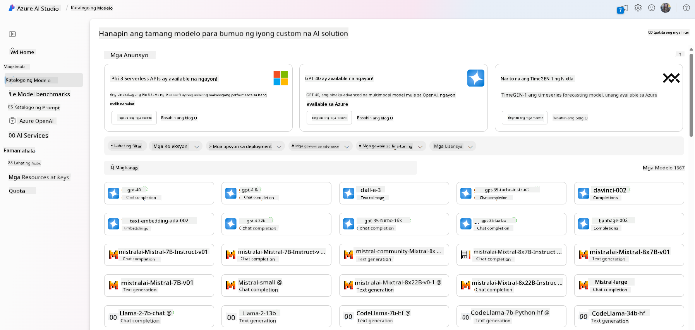
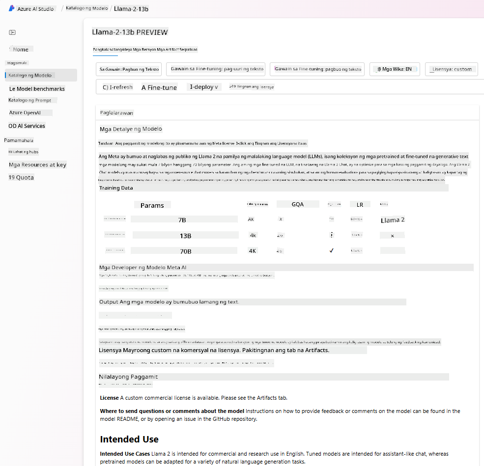
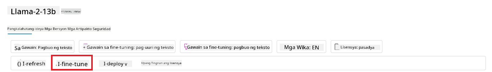
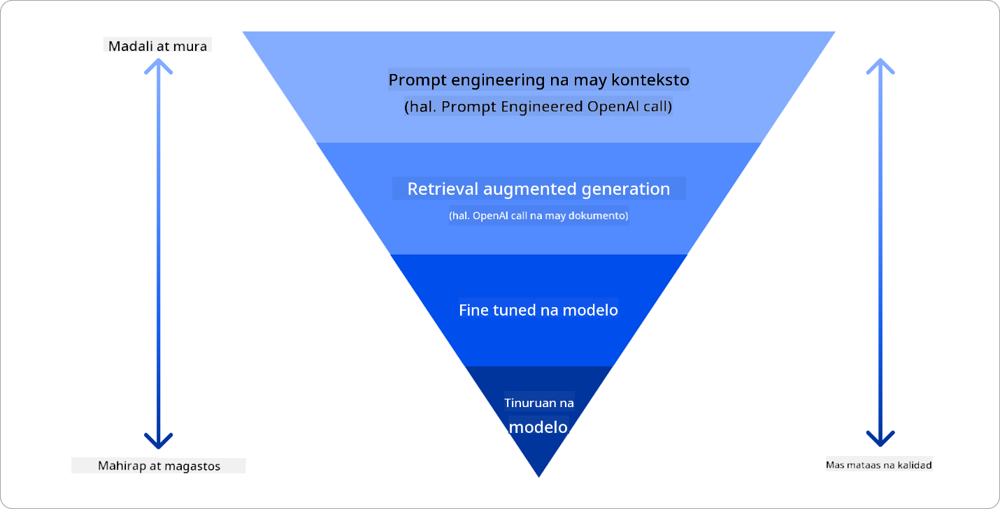

<!--
CO_OP_TRANSLATOR_METADATA:
{
  "original_hash": "6b7629b8ee4d7d874a27213e903d86a7",
  "translation_date": "2025-10-17T13:25:10+00:00",
  "source_file": "02-exploring-and-comparing-different-llms/README.md",
  "language_code": "tl"
}
-->
# Pagsusuri at Paghahambing ng Iba't Ibang LLM

> _I-click ang imahe sa itaas upang mapanood ang video ng araling ito_

Sa nakaraang aralin, nakita natin kung paano binabago ng Generative AI ang teknolohikal na tanawin, kung paano gumagana ang Large Language Models (LLMs), at kung paano maaaring gamitin ng isang negosyo - tulad ng ating startup - ang mga ito sa kanilang mga kaso ng paggamit upang lumago! Sa kabanatang ito, tatalakayin natin ang iba't ibang uri ng LLMs upang maunawaan ang kanilang mga kalamangan at kahinaan.

Ang susunod na hakbang sa paglalakbay ng ating startup ay ang paggalugad sa kasalukuyang tanawin ng LLMs at pag-unawa kung alin ang angkop para sa ating kaso ng paggamit.

## Panimula

Ang araling ito ay tatalakayin:

- Iba't ibang uri ng LLMs sa kasalukuyang tanawin.
- Pagsubok, pag-ulit, at paghahambing ng iba't ibang modelo para sa iyong kaso ng paggamit sa Azure.
- Paano mag-deploy ng LLM.

## Mga Layunin sa Pagkatuto

Pagkatapos makumpleto ang araling ito, magagawa mo:

- Piliin ang tamang modelo para sa iyong kaso ng paggamit.
- Maunawaan kung paano subukan, ulitin, at pagbutihin ang pagganap ng iyong modelo.
- Malaman kung paano nagde-deploy ang mga negosyo ng mga modelo.

## Pag-unawa sa Iba't Ibang Uri ng LLMs

Ang LLMs ay maaaring ikategorya batay sa kanilang arkitektura, training data, at kaso ng paggamit. Ang pag-unawa sa mga pagkakaibang ito ay makakatulong sa ating startup na pumili ng tamang modelo para sa sitwasyon, at maunawaan kung paano subukan, ulitin, at pagbutihin ang pagganap.

Maraming iba't ibang uri ng LLM models, at ang iyong pagpili ng modelo ay nakadepende sa kung ano ang layunin mong gamitin ang mga ito, sa iyong data, sa budget mo, at iba pa.

Depende sa layunin mo, tulad ng paggamit ng mga modelo para sa text, audio, video, image generation, at iba pa, maaaring pumili ka ng ibang uri ng modelo.

- **Audio at speech recognition**. Para sa layuning ito, ang mga Whisper-type models ay mahusay na pagpipilian dahil general-purpose ang mga ito at nakatuon sa speech recognition. Ang mga ito ay sinanay sa iba't ibang audio at kayang magsagawa ng multilingual speech recognition. Alamin ang higit pa tungkol sa [Whisper type models dito](https://platform.openai.com/docs/models/whisper?WT.mc_id=academic-105485-koreyst).

- **Image generation**. Para sa image generation, ang DALL-E at Midjourney ay dalawang kilalang pagpipilian. Ang DALL-E ay inaalok ng Azure OpenAI. [Basahin ang higit pa tungkol sa DALL-E dito](https://platform.openai.com/docs/models/dall-e?WT.mc_id=academic-105485-koreyst) at sa Kabanata 9 ng kurikulum na ito.

- **Text generation**. Karamihan sa mga modelo ay sinanay para sa text generation at mayroon kang malawak na pagpipilian mula GPT-3.5 hanggang GPT-4. Ang mga ito ay may iba't ibang halaga, kung saan ang GPT-4 ang pinakamahal. Sulit na tingnan ang [Azure OpenAI playground](https://oai.azure.com/portal/playground?WT.mc_id=academic-105485-koreyst) upang masuri kung aling mga modelo ang pinakamahusay na akma sa iyong pangangailangan sa kakayahan at gastos.

- **Multi-modality**. Kung nais mong magproseso ng iba't ibang uri ng data sa input at output, maaaring tingnan mo ang mga modelo tulad ng [gpt-4 turbo with vision o gpt-4o](https://learn.microsoft.com/azure/ai-services/openai/concepts/models#gpt-4-and-gpt-4-turbo-models?WT.mc_id=academic-105485-koreyst) - ang pinakabagong mga modelo ng OpenAI - na may kakayahang pagsamahin ang natural language processing sa visual understanding, na nagbibigay-daan sa interaksyon sa pamamagitan ng multi-modal interfaces.

Ang pagpili ng modelo ay nagbibigay sa iyo ng ilang pangunahing kakayahan, ngunit maaaring hindi ito sapat. Madalas, mayroon kang data na partikular sa kumpanya na kailangan mong ipaalam sa LLM. May ilang iba't ibang paraan kung paano ito lapitan, higit pa tungkol dito sa mga susunod na seksyon.

### Foundation Models kumpara sa LLMs

Ang terminong Foundation Model ay [binuo ng mga mananaliksik sa Stanford](https://arxiv.org/abs/2108.07258?WT.mc_id=academic-105485-koreyst) at tinukoy bilang isang AI model na sumusunod sa ilang pamantayan, tulad ng:

- **Sinanay gamit ang unsupervised learning o self-supervised learning**, ibig sabihin, sinanay ang mga ito sa unlabeled multi-modal data, at hindi nangangailangan ng human annotation o labeling ng data para sa kanilang proseso ng pagsasanay.
- **Napakalaking mga modelo**, batay sa napakalalim na neural networks na sinanay sa bilyun-bilyong parameters.
- **Karaniwang nilalayon na magsilbing ‘foundation’ para sa ibang mga modelo**, ibig sabihin, maaari silang gamitin bilang panimulang punto para sa ibang mga modelo na maaaring itayo sa ibabaw nito, na maaaring gawin sa pamamagitan ng fine-tuning.

Pinagmulan ng imahe: [Essential Guide to Foundation Models and Large Language Models | ni Babar M Bhatti | Medium
](https://thebabar.medium.com/essential-guide-to-foundation-models-and-large-language-models-27dab58f7404)

Upang higit pang linawin ang pagkakaibang ito, kunin natin ang ChatGPT bilang halimbawa. Upang mabuo ang unang bersyon ng ChatGPT, isang modelo na tinatawag na GPT-3.5 ang nagsilbing foundation model. Nangangahulugan ito na ginamit ng OpenAI ang ilang chat-specific data upang lumikha ng isang tuned na bersyon ng GPT-3.5 na espesyal na idinisenyo upang mahusay na gumana sa conversational scenarios, tulad ng chatbots.

Pinagmulan ng imahe: [2108.07258.pdf (arxiv.org)](https://arxiv.org/pdf/2108.07258.pdf?WT.mc_id=academic-105485-koreyst)

### Open Source kumpara sa Proprietary Models

Isa pang paraan upang ikategorya ang LLMs ay kung open source o proprietary ang mga ito.

Ang open-source models ay mga modelong ginawang available sa publiko at maaaring gamitin ng kahit sino. Karaniwang ginagawa itong available ng kumpanya na lumikha nito, o ng research community. Ang mga modelong ito ay maaaring inspeksyunin, baguhin, at i-customize para sa iba't ibang kaso ng paggamit sa LLMs. Gayunpaman, hindi palaging optimized ang mga ito para sa production use, at maaaring hindi kasing-performant ng proprietary models. Dagdag pa, ang pondo para sa open-source models ay maaaring limitado, at maaaring hindi ito mapanatili sa pangmatagalan o hindi ma-update sa pinakabagong pananaliksik. Mga halimbawa ng sikat na open-source models ay [Alpaca](https://crfm.stanford.edu/2023/03/13/alpaca.html?WT.mc_id=academic-105485-koreyst), [Bloom](https://huggingface.co/bigscience/bloom) at [LLaMA](https://llama.meta.com).

Ang proprietary models ay mga modelong pagmamay-ari ng isang kumpanya at hindi ginagawang available sa publiko. Ang mga modelong ito ay karaniwang optimized para sa production use. Gayunpaman, hindi pinapayagan ang mga ito na inspeksyunin, baguhin, o i-customize para sa iba't ibang kaso ng paggamit. Dagdag pa, hindi palaging available ang mga ito nang libre, at maaaring mangailangan ng subscription o bayad upang magamit. Gayundin, ang mga gumagamit ay walang kontrol sa data na ginamit upang sanayin ang modelo, na nangangahulugang dapat nilang ipagkatiwala sa may-ari ng modelo ang pangako sa privacy ng data at responsableng paggamit ng AI. Mga halimbawa ng sikat na proprietary models ay [OpenAI models](https://platform.openai.com/docs/models/overview?WT.mc_id=academic-105485-koreyst), [Google Bard](https://sapling.ai/llm/bard?WT.mc_id=academic-105485-koreyst) o [Claude 2](https://www.anthropic.com/index/claude-2?WT.mc_id=academic-105485-koreyst).

### Embedding kumpara sa Image generation kumpara sa Text at Code generation

Ang LLMs ay maaari ring ikategorya batay sa output na kanilang nililikha.

Ang embeddings ay isang set ng mga modelo na maaaring mag-convert ng text sa numerical form, na tinatawag na embedding, na isang numerical representation ng input text. Ang embeddings ay nagpapadali sa mga makina na maunawaan ang mga relasyon sa pagitan ng mga salita o pangungusap at maaaring magamit bilang input ng ibang mga modelo, tulad ng classification models, o clustering models na may mas mahusay na pagganap sa numerical data. Ang embedding models ay madalas na ginagamit para sa transfer learning, kung saan ang isang modelo ay binuo para sa isang surrogate task na may maraming data, at pagkatapos ay ang model weights (embeddings) ay muling ginagamit para sa ibang downstream tasks. Isang halimbawa ng kategoryang ito ay [OpenAI embeddings](https://platform.openai.com/docs/models/embeddings?WT.mc_id=academic-105485-koreyst).

Ang image generation models ay mga modelong lumilikha ng mga imahe. Ang mga modelong ito ay madalas na ginagamit para sa image editing, image synthesis, at image translation. Ang image generation models ay madalas na sinanay sa malalaking datasets ng mga imahe, tulad ng [LAION-5B](https://laion.ai/blog/laion-5b/?WT.mc_id=academic-105485-koreyst), at maaaring gamitin upang lumikha ng mga bagong imahe o i-edit ang mga umiiral na imahe gamit ang inpainting, super-resolution, at colorization techniques. Mga halimbawa ay [DALL-E-3](https://openai.com/dall-e-3?WT.mc_id=academic-105485-koreyst) at [Stable Diffusion models](https://github.com/Stability-AI/StableDiffusion?WT.mc_id=academic-105485-koreyst).

Ang text at code generation models ay mga modelong lumilikha ng text o code. Ang mga modelong ito ay madalas na ginagamit para sa text summarization, translation, at question answering. Ang text generation models ay madalas na sinanay sa malalaking datasets ng text, tulad ng [BookCorpus](https://www.cv-foundation.org/openaccess/content_iccv_2015/html/Zhu_Aligning_Books_and_ICCV_2015_paper.html?WT.mc_id=academic-105485-koreyst), at maaaring gamitin upang lumikha ng bagong text, o upang sagutin ang mga tanong. Ang code generation models, tulad ng [CodeParrot](https://huggingface.co/codeparrot?WT.mc_id=academic-105485-koreyst), ay madalas na sinanay sa malalaking datasets ng code, tulad ng GitHub, at maaaring gamitin upang lumikha ng bagong code, o upang ayusin ang mga bug sa umiiral na code.

### Encoder-Decoder kumpara sa Decoder-only

Upang pag-usapan ang iba't ibang uri ng arkitektura ng LLMs, gamitin natin ang isang analogy.

Isipin na binigyan ka ng iyong manager ng gawain na gumawa ng isang quiz para sa mga estudyante. Mayroon kang dalawang kasamahan; ang isa ay namamahala sa paggawa ng content at ang isa ay namamahala sa pag-review nito.

Ang content creator ay tulad ng isang Decoder-only model, maaari niyang tingnan ang topic at makita kung ano ang naisulat mo na, at pagkatapos ay maaari siyang magsulat ng kurso batay dito. Magaling sila sa pagsusulat ng engaging at informative na content, ngunit hindi sila mahusay sa pag-unawa sa topic at mga layunin sa pagkatuto. Ilang halimbawa ng Decoder models ay ang GPT family models, tulad ng GPT-3.

Ang reviewer ay tulad ng isang Encoder-only model, tinitingnan nila ang kursong naisulat at ang mga sagot, napapansin ang relasyon sa pagitan ng mga ito at nauunawaan ang konteksto, ngunit hindi sila mahusay sa paggawa ng content. Isang halimbawa ng Encoder-only model ay ang BERT.

Isipin na mayroon din tayong isang tao na maaaring gumawa at mag-review ng quiz, ito ay isang Encoder-Decoder model. Ilang halimbawa ay ang BART at T5.

### Serbisyo kumpara sa Modelo

Ngayon, pag-usapan natin ang pagkakaiba ng isang serbisyo at isang modelo. Ang serbisyo ay isang produkto na inaalok ng isang Cloud Service Provider, at madalas na kombinasyon ng mga modelo, data, at iba pang mga bahagi. Ang modelo ay ang pangunahing bahagi ng isang serbisyo, at madalas na isang foundation model, tulad ng isang LLM.

Ang mga serbisyo ay madalas na optimized para sa production use at madalas na mas madaling gamitin kaysa sa mga modelo, sa pamamagitan ng graphical user interface. Gayunpaman, ang mga serbisyo ay hindi palaging available nang libre, at maaaring mangailangan ng subscription o bayad upang magamit, kapalit ng paggamit ng kagamitan at resources ng may-ari ng serbisyo, pag-optimize ng gastos, at madaling pag-scale. Isang halimbawa ng serbisyo ay ang [Azure OpenAI Service](https://learn.microsoft.com/azure/ai-services/openai/overview?WT.mc_id=academic-105485-koreyst), na nag-aalok ng pay-as-you-go rate plan, ibig sabihin, ang mga gumagamit ay sinisingil nang proporsyonal sa kung gaano nila ginagamit ang serbisyo. Gayundin, ang Azure OpenAI Service ay nag-aalok ng enterprise-grade security at isang responsible AI framework sa ibabaw ng mga kakayahan ng mga modelo.

Ang mga modelo ay simpleng Neural Network, na may mga parameters, weights, at iba pa. Pinapayagan ang mga kumpanya na magpatakbo nang lokal, ngunit kakailanganin nilang bumili ng kagamitan, bumuo ng istruktura para sa pag-scale, at bumili ng lisensya o gumamit ng open-source model. Ang isang modelo tulad ng LLaMA ay available upang magamit, na nangangailangan ng computational power upang patakbuhin ang modelo.

## Paano Subukan at Ulitin ang Iba't Ibang Modelo upang Maunawaan ang Pagganap sa Azure

Kapag ang aming team ay nakapag-explore na sa kasalukuyang tanawin ng LLMs at nakapagtukoy ng ilang magagandang kandidato para sa kanilang mga sitwasyon, ang susunod na hakbang ay ang pagsubok sa mga ito gamit ang kanilang data at workload. Ito ay isang iterative na proseso, na ginagawa sa pamamagitan ng mga eksperimento at sukat.
Karamihan sa mga modelong nabanggit natin sa mga nakaraang talata (mga modelo ng OpenAI, mga open source na modelo tulad ng Llama2, at Hugging Face transformers) ay makikita sa [Model Catalog](https://learn.microsoft.com/azure/ai-studio/how-to/model-catalog-overview?WT.mc_id=academic-105485-koreyst) sa [Azure AI Studio](https://ai.azure.com/?WT.mc_id=academic-105485-koreyst).

Ang [Azure AI Studio](https://learn.microsoft.com/azure/ai-studio/what-is-ai-studio?WT.mc_id=academic-105485-koreyst) ay isang Cloud Platform na idinisenyo para sa mga developer upang makabuo ng mga generative AI application at pamahalaan ang buong lifecycle ng development - mula sa eksperimento hanggang sa pagsusuri - sa pamamagitan ng pagsasama-sama ng lahat ng Azure AI services sa isang hub na may madaling gamiting GUI. Ang Model Catalog sa Azure AI Studio ay nagbibigay-daan sa user na:

- Hanapin ang Foundation Model na interesado sa catalog - proprietary man o open source, gamit ang filter sa task, lisensya, o pangalan. Upang mapabuti ang kakayahang maghanap, ang mga modelo ay nakaayos sa mga koleksyon, tulad ng Azure OpenAI collection, Hugging Face collection, at iba pa.

- Suriin ang model card, kabilang ang detalyadong paglalarawan ng layunin ng paggamit at training data, mga halimbawa ng code, at mga resulta ng pagsusuri mula sa internal evaluations library.

- Ihambing ang mga benchmark sa pagitan ng mga modelo at dataset na magagamit sa industriya upang masuri kung alin ang angkop sa business scenario, sa pamamagitan ng [Model Benchmarks](https://learn.microsoft.com/azure/ai-studio/how-to/model-benchmarks?WT.mc_id=academic-105485-koreyst) pane.

- I-fine-tune ang modelo gamit ang custom training data upang mapabuti ang performance ng modelo sa isang partikular na workload, gamit ang experimentation at tracking capabilities ng Azure AI Studio.

- I-deploy ang orihinal na pre-trained model o ang fine-tuned na bersyon nito sa remote real-time inference - managed compute - o serverless API endpoint - [pay-as-you-go](https://learn.microsoft.com/azure/ai-studio/how-to/model-catalog-overview#model-deployment-managed-compute-and-serverless-api-pay-as-you-go?WT.mc_id=academic-105485-koreyst) - upang magamit ito ng mga application.

> [!NOTE]
> Hindi lahat ng modelo sa catalog ay kasalukuyang magagamit para sa fine-tuning at/o pay-as-you-go deployment. Tingnan ang model card para sa mga detalye tungkol sa kakayahan at limitasyon ng modelo.

## Pagpapabuti ng mga resulta ng LLM

Nasuri namin kasama ang aming startup team ang iba't ibang uri ng LLMs at isang Cloud Platform (Azure Machine Learning) na nagbibigay-daan sa amin upang ihambing ang iba't ibang modelo, suriin ang mga ito gamit ang test data, mapabuti ang performance, at i-deploy ang mga ito sa inference endpoints.

Kailan dapat isaalang-alang ang fine-tuning ng isang modelo kaysa sa paggamit ng pre-trained na modelo? Mayroon bang ibang mga paraan upang mapabuti ang performance ng modelo sa mga partikular na workload?

Mayroong ilang mga paraan na maaaring gamitin ng isang negosyo upang makuha ang mga resulta na kailangan nila mula sa isang LLM. Maaari kang pumili ng iba't ibang uri ng mga modelo na may iba't ibang antas ng training kapag nag-deploy ng LLM sa production, na may iba't ibang antas ng pagiging kumplikado, gastos, at kalidad. Narito ang ilang mga paraan:

- **Prompt engineering na may context**. Ang ideya ay magbigay ng sapat na context kapag nag-prompt upang matiyak na makukuha mo ang mga sagot na kailangan mo.

- **Retrieval Augmented Generation, RAG**. Ang iyong data ay maaaring nasa isang database o web endpoint, halimbawa, upang matiyak na ang data na ito, o isang subset nito, ay kasama sa oras ng pag-prompt, maaari mong kunin ang kaugnay na data at gawing bahagi ng prompt ng user.

- **Fine-tuned model**. Dito, mas pinahusay mo ang training ng modelo gamit ang sarili mong data na nagresulta sa mas eksaktong modelo na tumutugon sa iyong mga pangangailangan ngunit maaaring magastos.

Pinagmulan ng larawan: [Four Ways that Enterprises Deploy LLMs | Fiddler AI Blog](https://www.fiddler.ai/blog/four-ways-that-enterprises-deploy-llms?WT.mc_id=academic-105485-koreyst)

### Prompt Engineering na may Context

Ang mga pre-trained na LLMs ay mahusay sa mga pangkalahatang natural language tasks, kahit na tawagin sila gamit ang maikling prompt, tulad ng isang pangungusap na dapat tapusin o isang tanong – ang tinatawag na “zero-shot” learning.

Gayunpaman, mas maayos ang sagot at mas malapit sa inaasahan ng user kung mas ma-frame ng user ang kanilang query, gamit ang detalyadong request at mga halimbawa – ang Context. Sa ganitong kaso, tinatawag itong “one-shot” learning kung ang prompt ay may isang halimbawa lamang at “few-shot learning” kung mayroong maraming halimbawa.
Ang prompt engineering na may context ang pinaka-matipid na paraan upang magsimula.

### Retrieval Augmented Generation (RAG)

Ang mga LLMs ay may limitasyon na magagamit lamang ang data na ginamit sa kanilang training upang makabuo ng sagot. Nangangahulugan ito na wala silang alam tungkol sa mga katotohanan na nangyari pagkatapos ng kanilang training process, at hindi nila ma-access ang mga non-public na impormasyon (tulad ng data ng kumpanya).
Maaaring malampasan ito sa pamamagitan ng RAG, isang teknik na nagdadagdag ng external na data sa prompt sa anyo ng mga chunks ng dokumento, isinasaalang-alang ang limitasyon ng haba ng prompt. Sinusuportahan ito ng mga tool sa Vector database (tulad ng [Azure Vector Search](https://learn.microsoft.com/azure/search/vector-search-overview?WT.mc_id=academic-105485-koreyst)) na kumukuha ng mga kapaki-pakinabang na chunks mula sa iba't ibang pre-defined na data sources at idinadagdag ang mga ito sa prompt Context.

Ang teknik na ito ay napaka-kapaki-pakinabang kapag ang isang negosyo ay walang sapat na data, sapat na oras, o mga resources upang i-fine-tune ang isang LLM, ngunit nais pa rin nitong mapabuti ang performance sa isang partikular na workload at mabawasan ang panganib ng fabrications, i.e., mystification ng realidad o mapanganib na content.

### Fine-tuned model

Ang fine-tuning ay isang proseso na gumagamit ng transfer learning upang ‘i-adapt’ ang modelo sa isang downstream task o upang lutasin ang isang partikular na problema. Naiiba sa few-shot learning at RAG, nagreresulta ito sa isang bagong modelo na nabuo, na may updated na weights at biases. Nangangailangan ito ng set ng training examples na binubuo ng isang input (ang prompt) at ang kaugnay nitong output (ang completion).
Ito ang mas pinipiling paraan kung:

- **Paggamit ng fine-tuned models**. Ang isang negosyo ay nais gumamit ng fine-tuned na mas hindi gaanong capable na mga modelo (tulad ng embedding models) kaysa sa high-performance models, na nagreresulta sa mas matipid at mabilis na solusyon.

- **Pagsasaalang-alang sa latency**. Ang latency ay mahalaga para sa isang partikular na use-case, kaya’t hindi posible ang paggamit ng napakahabang mga prompt o ang dami ng mga halimbawa na dapat matutunan ng modelo ay hindi kasya sa limitasyon ng haba ng prompt.

- **Pagiging up-to-date**. Ang isang negosyo ay may maraming mataas na kalidad na data at ground truth labels at ang mga resources na kinakailangan upang mapanatili ang data na ito na up-to-date sa paglipas ng panahon.

### Trained model

Ang pag-train ng isang LLM mula sa simula ay walang duda ang pinakamahirap at pinaka-komplikadong paraan na maaaring gamitin, na nangangailangan ng napakalaking dami ng data, skilled resources, at angkop na computational power. Ang opsyong ito ay dapat isaalang-alang lamang sa isang sitwasyon kung saan ang isang negosyo ay may domain-specific na use case at malaking dami ng domain-centric na data.

## Knowledge check

Ano ang maaaring magandang paraan upang mapabuti ang mga resulta ng LLM completion?

1. Prompt engineering na may context
1. RAG
1. Fine-tuned model

A:3, kung mayroon kang oras, resources, at mataas na kalidad na data, ang fine-tuning ang mas magandang opsyon upang manatiling up-to-date. Gayunpaman, kung nais mong mapabuti ang mga bagay-bagay at kulang ka sa oras, mas mainam na isaalang-alang muna ang RAG.

## 🚀 Hamon

Magbasa pa tungkol sa kung paano mo magagamit ang [RAG](https://learn.microsoft.com/azure/search/retrieval-augmented-generation-overview?WT.mc_id=academic-105485-koreyst) para sa iyong negosyo.

## Magaling na Trabaho, Ipagpatuloy ang Iyong Pag-aaral

Matapos makumpleto ang araling ito, tingnan ang aming [Generative AI Learning collection](https://aka.ms/genai-collection?WT.mc_id=academic-105485-koreyst) upang patuloy na paunlarin ang iyong kaalaman sa Generative AI!

Pumunta sa Lesson 3 kung saan tatalakayin natin kung paano [gumawa gamit ang Generative AI nang Responsable](../03-using-generative-ai-responsibly/README.md?WT.mc_id=academic-105485-koreyst)!

---

**Paunawa**:  
Ang dokumentong ito ay isinalin gamit ang AI translation service na [Co-op Translator](https://github.com/Azure/co-op-translator). Bagamat sinisikap naming maging tumpak, mangyaring tandaan na ang mga awtomatikong pagsasalin ay maaaring maglaman ng mga pagkakamali o hindi pagkakatugma. Ang orihinal na dokumento sa kanyang katutubong wika ang dapat ituring na opisyal na pinagmulan. Para sa mahalagang impormasyon, inirerekomenda ang propesyonal na pagsasalin ng tao. Hindi kami mananagot sa anumang hindi pagkakaunawaan o maling interpretasyon na dulot ng paggamit ng pagsasaling ito.