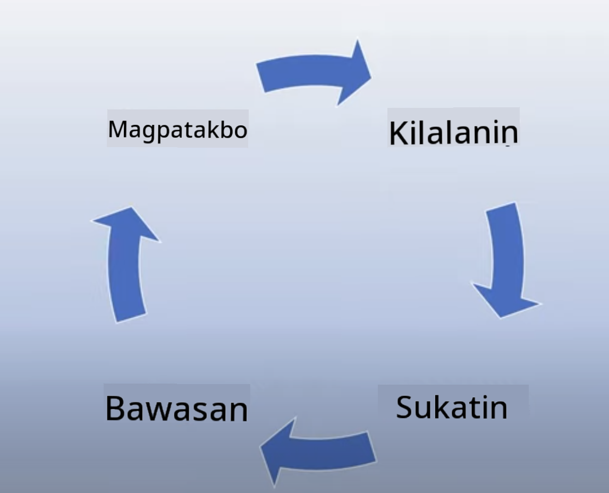

<!--
CO_OP_TRANSLATOR_METADATA:
{
  "original_hash": "7f8f4c11f8c1cb6e1794442dead414ea",
  "translation_date": "2025-07-09T09:00:45+00:00",
  "source_file": "03-using-generative-ai-responsibly/README.md",
  "language_code": "tl"
}
-->
# Paggamit ng Generative AI nang Responsable

> _I-click ang larawan sa itaas para mapanood ang video ng araling ito_

Madaling maengganyo sa AI, lalo na sa generative AI, pero kailangan mong pag-isipan kung paano ito gagamitin nang responsable. Dapat mong isaalang-alang kung paano masisiguro na patas, hindi nakakasama, at iba pa ang magiging resulta. Layunin ng kabanatang ito na bigyan ka ng konteksto, mga dapat isaalang-alang, at kung paano gumawa ng mga hakbang para mapabuti ang paggamit mo ng AI.

## Panimula

Tatalakayin sa araling ito ang:

- Bakit dapat unahin ang Responsible AI kapag gumagawa ng Generative AI na mga aplikasyon.
- Mga pangunahing prinsipyo ng Responsible AI at kung paano ito nauugnay sa Generative AI.
- Paano isabuhay ang mga prinsipyong ito sa pamamagitan ng estratehiya at mga kasangkapan.

## Mga Layunin sa Pagkatuto

Pagkatapos ng araling ito, malalaman mo:

- Ang kahalagahan ng Responsible AI sa paggawa ng Generative AI na mga aplikasyon.
- Kailan dapat isipin at ilapat ang mga pangunahing prinsipyo ng Responsible AI sa paggawa ng Generative AI na mga aplikasyon.
- Anong mga kasangkapan at estratehiya ang maaari mong gamitin para maisabuhay ang konsepto ng Responsible AI.

## Mga Prinsipyo ng Responsible AI

Hindi pa naging ganito kataas ang kasabikan para sa Generative AI. Dahil dito, maraming bagong developer, atensyon, at pondo ang dumagsa sa larangang ito. Bagamat napakabuti nito para sa mga gustong gumawa ng mga produkto at kumpanya gamit ang Generative AI, mahalaga ring maging responsable tayo sa pag-usad.

Sa buong kurso, nakatuon tayo sa paggawa ng startup at produkto para sa edukasyon sa AI. Gagamitin natin ang mga prinsipyo ng Responsible AI: Katarungan, Inclusiveness, Reliability/Safety, Security & Privacy, Transparency, at Accountability. Sa mga prinsipyong ito, tatalakayin natin kung paano ito nauugnay sa paggamit natin ng Generative AI sa ating mga produkto.

## Bakit Dapat Mong Unahin ang Responsible AI

Kapag gumagawa ng produkto, ang paglapit na nakatuon sa tao at pag-isip sa kapakanan ng gumagamit ang nagdudulot ng pinakamahusay na resulta.

Ang kakaiba sa Generative AI ay ang kakayahan nitong lumikha ng kapaki-pakinabang na sagot, impormasyon, gabay, at nilalaman para sa mga gumagamit. Nagagawa ito nang hindi na kailangan ng maraming manu-manong hakbang kaya nakakabunga ng kahanga-hangang resulta. Ngunit kung walang maayos na pagpaplano at estratehiya, maaari rin itong magdulot ng mga mapanganib na epekto para sa mga gumagamit, produkto, at lipunan.

Tingnan natin ang ilan (hindi lahat) ng mga posibleng mapanganib na resulta:

### Hallucinations

Ang hallucinations ay tawag kapag ang isang LLM ay gumagawa ng nilalaman na walang saysay o mali ang impormasyon base sa ibang pinagkukunan.

Halimbawa, gumawa tayo ng tampok para sa startup na nagpapahintulot sa mga estudyante na magtanong tungkol sa kasaysayan sa isang modelo. May nagtanong na `Sino ang nag-iisang nakaligtas sa Titanic?`

Ang modelo ay nagbigay ng sagot tulad nito:

> _(Pinagmulan: [Flying bisons](https://flyingbisons.com?WT.mc_id=academic-105485-koreyst))_

Ito ay isang kumpiyansa at detalyadong sagot. Sa kasamaang palad, mali ito. Sa kaunting pananaliksik lang, malalaman na higit sa isa ang nakaligtas sa trahedya ng Titanic. Para sa estudyanteng nagsisimula pa lang mag-research, maaaring tanggapin niya ito bilang totoo nang hindi pinagdududahan. Ang ganitong resulta ay maaaring magdulot ng kawalang-katiyakan sa AI system at makasira sa reputasyon ng startup.

Sa bawat bersyon ng anumang LLM, nakikita natin ang pagbuti sa pag-minimize ng hallucinations. Ngunit kahit na may ganitong pag-unlad, bilang mga tagabuo ng aplikasyon at gumagamit, kailangan pa rin nating maging maingat sa mga limitasyong ito.

### Mapanganib na Nilalaman

Napag-usapan na natin sa naunang bahagi ang maling o walang saysay na sagot mula sa LLM. Isa pang panganib na dapat bantayan ay kapag ang modelo ay nagbibigay ng mapanganib na nilalaman.

Ang mapanganib na nilalaman ay maaaring:

- Pagbibigay ng mga tagubilin o paghikayat sa pananakit sa sarili o sa ibang grupo.
- Nilalaman na puno ng poot o panlalait.
- Pagtuturo kung paano magplano ng anumang uri ng pag-atake o marahas na gawain.
- Pagbibigay ng mga tagubilin kung paano makahanap ng ilegal na nilalaman o gumawa ng ilegal na gawain.
- Pagpapakita ng sekswal na eksplikit na nilalaman.

Para sa startup natin, nais nating siguraduhin na may tamang mga kasangkapan at estratehiya tayo upang maiwasan na makita ng mga estudyante ang ganitong uri ng nilalaman.

### Kawalan ng Katarungan

Ang katarungan ay nangangahulugang “pagsisiguro na ang AI system ay malaya sa pagkiling at diskriminasyon at patas at pantay ang pagtrato sa lahat.” Sa mundo ng Generative AI, nais nating maiwasang palakasin ng output ng modelo ang mga eksklusibong pananaw laban sa mga marginalized na grupo.

Ang ganitong uri ng output ay hindi lang nakakasira sa positibong karanasan ng mga gumagamit, kundi nagdudulot din ng mas malalim na pinsala sa lipunan. Bilang mga tagabuo ng aplikasyon, dapat nating laging isaalang-alang ang malawak at magkakaibang base ng mga gumagamit sa paggawa ng mga solusyon gamit ang Generative AI.

## Paano Gamitin ang Generative AI nang Responsable

Ngayon na natukoy na natin ang kahalagahan ng Responsible Generative AI, tingnan natin ang 4 na hakbang para makagawa tayo ng AI solutions nang responsable:

### Sukatin ang Posibleng Pinsala

Sa software testing, sinusubukan natin ang inaasahang kilos ng gumagamit sa isang aplikasyon. Ganun din, ang pagsubok sa iba't ibang prompts na malamang gagamitin ng mga gumagamit ay magandang paraan para masukat ang posibleng pinsala.

Dahil ang startup natin ay gumagawa ng produktong pang-edukasyon, mainam na maghanda ng listahan ng mga prompts na may kinalaman sa edukasyon. Maaaring ito ay tungkol sa isang partikular na asignatura, mga katotohanan sa kasaysayan, at mga tanong tungkol sa buhay estudyante.

### Bawasan ang Posibleng Pinsala

Panahon na para maghanap ng mga paraan kung paano mapipigilan o malilimitahan ang posibleng pinsalang dulot ng modelo at mga sagot nito. Maaari nating tingnan ito sa 4 na antas:

- **Modelo**. Piliin ang tamang modelo para sa tamang gamit. Ang mas malalaki at mas kumplikadong mga modelo tulad ng GPT-4 ay maaaring magdulot ng mas mataas na panganib ng mapanganib na nilalaman kapag ginamit sa mas maliit at espesipikong mga kaso. Ang paggamit ng training data para i-fine-tune ang modelo ay nakababawas din ng panganib ng mapanganib na nilalaman.

- **Safety System**. Ang safety system ay isang hanay ng mga kasangkapan at mga setting sa platform na nagsisilbi sa modelo upang makatulong na mabawasan ang pinsala. Halimbawa nito ay ang content filtering system sa Azure OpenAI service. Dapat ding matukoy ng mga sistema ang jailbreak attacks at hindi gustong aktibidad tulad ng mga request mula sa bots.

- **Metaprompt**. Ang metaprompts at grounding ay mga paraan para ma-direkta o malimitahan ang modelo base sa ilang mga asal at impormasyon. Maaaring gamitin ang system inputs para magtakda ng mga limitasyon sa modelo. Bukod dito, nagbibigay ito ng mga output na mas angkop sa saklaw o domain ng sistema.

Maaari ring gamitin ang mga teknik tulad ng Retrieval Augmented Generation (RAG) para ang modelo ay kumuha lamang ng impormasyon mula sa piling pinagkakatiwalaang mga pinagkukunan. May aralin sa kurso na ito tungkol sa [paggawa ng mga search application](../08-building-search-applications/README.md?WT.mc_id=academic-105485-koreyst).

- **User Experience**. Ang huling antas ay kung saan direktang nakikipag-ugnayan ang gumagamit sa modelo sa pamamagitan ng interface ng ating aplikasyon. Sa ganitong paraan, maaari nating idisenyo ang UI/UX upang limitahan ang uri ng input na maaaring ipadala ng gumagamit sa modelo pati na rin ang teksto o mga larawan na ipinapakita sa kanila. Kapag inilunsad ang AI application, dapat din tayong maging transparent tungkol sa kung ano ang kaya at hindi kaya ng ating Generative AI application.

Mayroon tayong buong aralin na nakatuon sa [Pagdidisenyo ng UX para sa AI Applications](../12-designing-ux-for-ai-applications/README.md?WT.mc_id=academic-105485-koreyst).

- **Suriin ang modelo**. Ang pagtatrabaho gamit ang LLMs ay maaaring maging hamon dahil hindi natin palaging kontrolado ang data na pinag-aralan ng modelo. Gayunpaman, dapat nating palaging suriin ang performance at mga output ng modelo. Mahalaga pa rin sukatin ang katumpakan, pagkakahawig, groundedness, at kaugnayan ng output. Nakakatulong ito upang magbigay ng transparency at tiwala sa mga stakeholder at gumagamit.

### Patakbuhin ang Responsable na Generative AI na Solusyon

Ang paggawa ng operational practice para sa iyong AI applications ang huling yugto. Kasama dito ang pakikipagtulungan sa ibang bahagi ng startup tulad ng Legal at Security upang matiyak na sumusunod tayo sa lahat ng regulasyon. Bago ilunsad, nais din nating gumawa ng mga plano para sa delivery, paghawak ng mga insidente, at rollback upang maiwasan ang anumang pinsala sa mga gumagamit habang lumalaki ang sistema.

## Mga Kasangkapan

Bagamat mukhang marami ang kailangang gawin para makabuo ng Responsible AI solutions, sulit ang pagsisikap. Habang lumalago ang larangan ng Generative AI, mas marami pang mga kasangkapan ang lalabas upang tulungan ang mga developer na maisama ang responsibilidad sa kanilang mga workflow nang mas epektibo. Halimbawa, ang [Azure AI Content Safety](https://learn.microsoft.com/azure/ai-services/content-safety/overview?WT.mc_id=academic-105485-koreyst) ay makakatulong tuklasin ang mapanganib na nilalaman at mga larawan sa pamamagitan ng API request.

## Pagsusulit sa Kaalaman

Ano ang mga bagay na kailangan mong alalahanin upang masiguro ang responsable na paggamit ng AI?

1. Na tama ang sagot.
1. Hindi ginagamit ang AI para sa mga kriminal na layunin.
1. Pagsisiguro na ang AI ay malaya sa pagkiling at diskriminasyon.

Sagot: Tama ang 2 at 3. Tinutulungan ka ng Responsible AI na isaalang-alang kung paano mababawasan ang mapanganib na epekto, pagkiling, at iba pa.

## 🚀 Hamon

Basahin ang tungkol sa [Azure AI Content Safety](https://learn.microsoft.com/azure/ai-services/content-safety/overview?WT.mc_id=academic-105485-koreyst) at tingnan kung ano ang maaari mong gamitin para sa iyong paggamit.

## Magaling, Ipagpatuloy ang Iyong Pag-aaral

Pagkatapos matapos ang araling ito, bisitahin ang aming [Generative AI Learning collection](https://aka.ms/genai-collection?WT.mc_id=academic-105485-koreyst) para ipagpatuloy ang pagpapalawak ng iyong kaalaman sa Generative AI!

Pumunta sa Lesson 4 kung saan tatalakayin natin ang [Prompt Engineering Fundamentals](../04-prompt-engineering-fundamentals/README.md?WT.mc_id=academic-105485-koreyst)!

**Paalala**:  
Ang dokumentong ito ay isinalin gamit ang AI translation service na [Co-op Translator](https://github.com/Azure/co-op-translator). Bagamat nagsusumikap kami para sa katumpakan, pakatandaan na ang mga awtomatikong pagsasalin ay maaaring maglaman ng mga pagkakamali o di-tumpak na impormasyon. Ang orihinal na dokumento sa orihinal nitong wika ang dapat ituring na pangunahing sanggunian. Para sa mahahalagang impormasyon, inirerekomenda ang propesyonal na pagsasalin ng tao. Hindi kami mananagot sa anumang hindi pagkakaunawaan o maling interpretasyon na maaaring magmula sa paggamit ng pagsasaling ito.