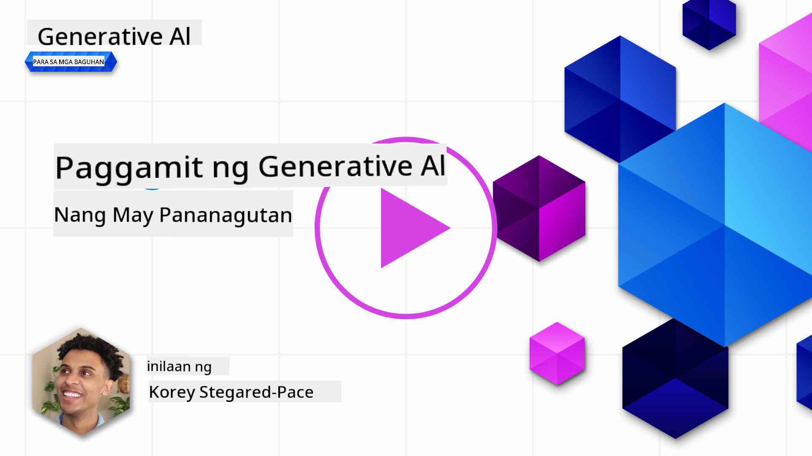
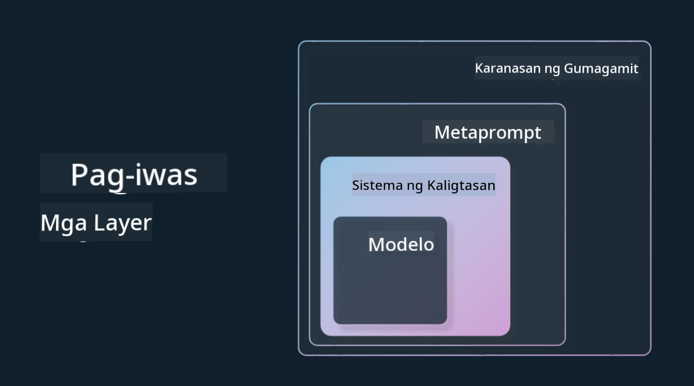

<!--
CO_OP_TRANSLATOR_METADATA:
{
  "original_hash": "4d57fad773cbeb69c5dd62e65c34200d",
  "translation_date": "2025-10-17T13:18:47+00:00",
  "source_file": "03-using-generative-ai-responsibly/README.md",
  "language_code": "tl"
}
-->
# Paggamit ng Generative AI nang Responsable

> _I-click ang imahe sa itaas upang mapanood ang video ng araling ito_

Madaling ma-engganyo sa AI, lalo na sa generative AI, ngunit mahalagang isaalang-alang kung paano ito gagamitin nang responsable. Kailangan mong pag-isipan kung paano masisiguro na ang output ay patas, hindi nakakasama, at iba pa. Ang kabanatang ito ay naglalayong magbigay sa iyo ng konteksto, mga bagay na dapat isaalang-alang, at mga hakbang na maaaring gawin upang mapabuti ang paggamit mo ng AI.

## Panimula

Ang araling ito ay tatalakayin ang:

- Bakit dapat unahin ang Responsible AI kapag gumagawa ng mga aplikasyon gamit ang Generative AI.
- Mga pangunahing prinsipyo ng Responsible AI at kung paano ito nauugnay sa Generative AI.
- Paano isabuhay ang mga prinsipyo ng Responsible AI sa pamamagitan ng estratehiya at mga kasangkapan.

## Mga Layunin sa Pag-aaral

Pagkatapos makumpleto ang araling ito, malalaman mo:

- Ang kahalagahan ng Responsible AI kapag gumagawa ng mga aplikasyon gamit ang Generative AI.
- Kailan dapat pag-isipan at gamitin ang mga pangunahing prinsipyo ng Responsible AI sa paggawa ng mga aplikasyon gamit ang Generative AI.
- Anong mga kasangkapan at estratehiya ang magagamit upang maisabuhay ang konsepto ng Responsible AI.

## Mga Prinsipyo ng Responsible AI

Ang kasabikan sa Generative AI ay hindi pa naging ganito kataas. Ang kasabikang ito ay nagdala ng maraming bagong developer, atensyon, at pondo sa larangang ito. Bagama't positibo ito para sa sinumang nagnanais na bumuo ng mga produkto at kumpanya gamit ang Generative AI, mahalaga rin na magpatuloy tayo nang may responsibilidad.

Sa buong kurso na ito, magpopokus tayo sa paggawa ng aming startup at ng aming produktong pang-edukasyon na AI. Gagamitin natin ang mga prinsipyo ng Responsible AI: Pagiging patas, Pagsasama, Kahusayan/Kaligtasan, Seguridad at Privacy, Transparency, at Pananagutan. Sa pamamagitan ng mga prinsipyong ito, susuriin natin kung paano ito nauugnay sa paggamit natin ng Generative AI sa ating mga produkto.

## Bakit Dapat Unahin ang Responsible AI

Kapag gumagawa ng produkto, ang paggamit ng human-centric na approach sa pamamagitan ng pag-iisip sa pinakamabuting interes ng iyong mga user ay nagdudulot ng pinakamahusay na resulta.

Ang natatanging katangian ng Generative AI ay ang kakayahan nitong lumikha ng kapaki-pakinabang na mga sagot, impormasyon, gabay, at nilalaman para sa mga user. Magagawa ito nang hindi nangangailangan ng maraming manu-manong hakbang na maaaring magresulta sa kahanga-hangang mga output. Gayunpaman, kung walang tamang pagpaplano at estratehiya, maaari rin itong magdulot ng mga nakakasamang resulta para sa iyong mga user, produkto, at lipunan.

Tingnan natin ang ilan (ngunit hindi lahat) sa mga posibleng nakakasamang resulta:

### Hallucinations

Ang Hallucinations ay tumutukoy sa mga pagkakataon kung saan ang isang LLM ay gumagawa ng nilalaman na alinman sa ganap na walang saysay o mali batay sa ibang mga mapagkukunan ng impormasyon.

Halimbawa, gumawa tayo ng isang feature para sa ating startup na nagpapahintulot sa mga estudyante na magtanong ng mga tanong tungkol sa kasaysayan sa isang modelo. Isang estudyante ang nagtanong ng `Sino ang nag-iisang nakaligtas sa Titanic?`

Ang modelo ay nagbigay ng sagot tulad ng nasa ibaba:

> _(Pinagmulan: [Flying bisons](https://flyingbisons.com?WT.mc_id=academic-105485-koreyst))_

Ito ay isang napaka-kumpiyansa at detalyadong sagot. Sa kasamaang-palad, ito ay mali. Kahit na may kaunting pananaliksik, malalaman na higit sa isa ang nakaligtas sa sakuna ng Titanic. Para sa isang estudyanteng nagsisimula pa lamang mag-research sa paksang ito, ang sagot na ito ay maaaring maging kapani-paniwala at hindi kuwestyunin, kaya ituturing na tama. Ang mga kahihinatnan nito ay maaaring magdulot ng kawalan ng tiwala sa AI system at negatibong makaapekto sa reputasyon ng ating startup.

Sa bawat pag-ulit ng anumang LLM, nakikita natin ang mga pagpapabuti sa pagganap sa pagbawas ng hallucinations. Kahit na may ganitong pagpapabuti, bilang mga tagabuo ng aplikasyon at mga user, kailangan pa rin nating maging maingat sa mga limitasyong ito.

### Nakakasamang Nilalaman

Tinalakay natin sa naunang bahagi ang mga pagkakataon kung saan ang isang LLM ay gumagawa ng mali o walang saysay na mga sagot. Isa pang panganib na dapat nating pagtuunan ng pansin ay kapag ang modelo ay tumutugon ng nakakasamang nilalaman.

Ang nakakasamang nilalaman ay maaaring tukuyin bilang:

- Pagbibigay ng mga tagubilin o pag-udyok sa pananakit sa sarili o sa ibang grupo.
- Mapoot o nakakasirang nilalaman.
- Pagbibigay ng gabay sa pagpaplano ng anumang uri ng pag-atake o marahas na gawain.
- Pagbibigay ng tagubilin kung paano makahanap ng ilegal na nilalaman o gumawa ng ilegal na gawain.
- Pagpapakita ng sekswal na tahasang nilalaman.

Para sa ating startup, nais nating tiyakin na mayroon tayong tamang mga kasangkapan at estratehiya upang maiwasan ang ganitong uri ng nilalaman na makita ng mga estudyante.

### Kawalan ng Pagiging Patas

Ang pagiging patas ay tinutukoy bilang “pagtiyak na ang isang AI system ay walang kinikilingan at diskriminasyon at pantay na tinatrato ang lahat.” Sa mundo ng Generative AI, nais nating tiyakin na ang mga pananaw na nagtatangi sa mga marginalized na grupo ay hindi pinapalakas ng output ng modelo.

Ang ganitong uri ng output ay hindi lamang nakakasira sa pagbuo ng positibong karanasan ng produkto para sa ating mga user, ngunit nagdudulot din ng karagdagang pinsala sa lipunan. Bilang mga tagabuo ng aplikasyon, palaging dapat nating isaalang-alang ang malawak at magkakaibang base ng user kapag gumagawa ng mga solusyon gamit ang Generative AI.

## Paano Gamitin ang Generative AI nang Responsable

Ngayon na natukoy natin ang kahalagahan ng Responsible Generative AI, tingnan natin ang 4 na hakbang na maaari nating gawin upang bumuo ng mga AI solution nang responsable:

### Sukatin ang Posibleng Pinsala

Sa software testing, sinusubukan natin ang mga inaasahang aksyon ng isang user sa isang aplikasyon. Katulad nito, ang pagsubok sa magkakaibang hanay ng mga prompt na malamang na gagamitin ng mga user ay isang magandang paraan upang sukatin ang posibleng pinsala.

Dahil ang ating startup ay gumagawa ng produktong pang-edukasyon, maganda kung maghahanda tayo ng listahan ng mga prompt na may kaugnayan sa edukasyon. Maaaring saklawin nito ang isang partikular na paksa, mga makasaysayang katotohanan, at mga prompt tungkol sa buhay estudyante.

### Bawasan ang Posibleng Pinsala

Panahon na upang maghanap ng mga paraan kung paano natin maiiwasan o malilimitahan ang posibleng pinsala na dulot ng modelo at ng mga sagot nito. Maaari natin itong tingnan sa 4 na magkakaibang layer:

- **Modelo**. Pumili ng tamang modelo para sa tamang layunin. Ang mas malaki at mas kumplikadong mga modelo tulad ng GPT-4 ay maaaring magdulot ng mas mataas na panganib ng nakakasamang nilalaman kapag ginamit sa mas maliit at mas tiyak na mga layunin. Ang paggamit ng iyong training data upang i-fine-tune ang modelo ay nakakatulong din upang mabawasan ang panganib ng nakakasamang nilalaman.

- **Safety System**. Ang safety system ay isang hanay ng mga kasangkapan at configuration sa platform na nagsisilbi sa modelo upang makatulong na mabawasan ang pinsala. Halimbawa nito ay ang content filtering system sa Azure OpenAI service. Dapat ding matukoy ng mga sistema ang mga jailbreak attack at hindi kanais-nais na aktibidad tulad ng mga kahilingan mula sa bots.

- **Metaprompt**. Ang metaprompts at grounding ay mga paraan upang idirekta o limitahan ang modelo batay sa ilang mga pag-uugali at impormasyon. Maaaring gamitin ang mga system input upang tukuyin ang ilang limitasyon ng modelo. Bukod dito, magbigay ng mga output na mas nauugnay sa saklaw o domain ng sistema.

Maaari rin itong gumamit ng mga teknik tulad ng Retrieval Augmented Generation (RAG) upang ang modelo ay kumuha lamang ng impormasyon mula sa mga pinagkakatiwalaang mapagkukunan. May aralin sa kursong ito para sa [pagbuo ng mga search application](../08-building-search-applications/README.md?WT.mc_id=academic-105485-koreyst)

- **User Experience**. Ang huling layer ay kung saan ang user ay direktang nakikipag-ugnayan sa modelo sa pamamagitan ng interface ng ating aplikasyon. Sa ganitong paraan, maaari nating idisenyo ang UI/UX upang limitahan ang user sa mga uri ng input na maaari nilang ipadala sa modelo pati na rin ang teksto o mga imahe na ipinapakita sa user. Kapag inilunsad ang AI application, dapat din tayong maging transparent tungkol sa kung ano ang magagawa at hindi magagawa ng ating Generative AI application.

Mayroon tayong buong aralin na nakatuon sa [Pagdidisenyo ng UX para sa AI Applications](../12-designing-ux-for-ai-applications/README.md?WT.mc_id=academic-105485-koreyst)

- **Evaluate model**. Ang pakikipagtulungan sa mga LLM ay maaaring maging hamon dahil hindi natin palaging kontrolado ang data na ginamit sa pag-train ng modelo. Gayunpaman, dapat pa rin nating suriin ang pagganap at mga output ng modelo. Mahalagang sukatin ang katumpakan, pagkakatulad, groundedness, at kaugnayan ng output ng modelo. Nakakatulong ito upang magbigay ng transparency at tiwala sa mga stakeholder at user.

### Magpatakbo ng Responsable Generative AI Solution

Ang pagbuo ng operational practice sa paligid ng iyong mga AI application ay ang huling yugto. Kasama rito ang pakikipagtulungan sa iba pang bahagi ng ating startup tulad ng Legal at Security upang matiyak na sumusunod tayo sa lahat ng mga regulasyon. Bago ilunsad, nais din nating bumuo ng mga plano sa paligid ng delivery, paghawak ng mga insidente, at rollback upang maiwasan ang anumang pinsala sa ating mga user mula sa paglawak.

## Mga Kasangkapan

Bagama't ang paggawa ng mga Responsible AI solution ay maaaring mukhang mahirap, ito ay isang gawain na sulit ang pagsisikap. Habang lumalago ang larangan ng Generative AI, mas maraming kasangkapan ang magagamit upang matulungan ang mga developer na mahusay na maisama ang responsibilidad sa kanilang mga workflow. Halimbawa, ang [Azure AI Content Safety](https://learn.microsoft.com/azure/ai-services/content-safety/overview?WT.mc_id=academic-105485-koreyst) ay makakatulong sa pagtukoy ng nakakasamang nilalaman at mga imahe sa pamamagitan ng API request.

## Pagsusuri ng Kaalaman

Ano ang mga bagay na dapat mong pagtuunan ng pansin upang matiyak ang responsableng paggamit ng AI?

1. Na tama ang sagot.
1. Nakakasamang paggamit, na hindi ginagamit ang AI para sa kriminal na layunin.
1. Tiyakin na ang AI ay walang kinikilingan at diskriminasyon.

A: Ang 2 at 3 ay tama. Ang Responsible AI ay tumutulong sa iyo na pag-isipan kung paano mababawasan ang mga nakakasamang epekto, mga bias, at iba pa.

## 🚀 Hamon

Magbasa tungkol sa [Azure AI Content Safety](https://learn.microsoft.com/azure/ai-services/content-safety/overview?WT.mc_id=academic-105485-koreyst) at tingnan kung ano ang maaari mong magamit para sa iyong paggamit.

## Magaling! Ipagpatuloy ang Iyong Pag-aaral

Pagkatapos makumpleto ang araling ito, tingnan ang aming [Generative AI Learning collection](https://aka.ms/genai-collection?WT.mc_id=academic-105485-koreyst) upang patuloy na paunlarin ang iyong kaalaman sa Generative AI!

Pumunta sa Lesson 4 kung saan tatalakayin natin ang [Prompt Engineering Fundamentals](../04-prompt-engineering-fundamentals/README.md?WT.mc_id=academic-105485-koreyst)!

---

**Paunawa**:  
Ang dokumentong ito ay isinalin gamit ang AI translation service na [Co-op Translator](https://github.com/Azure/co-op-translator). Bagamat sinisikap naming maging tumpak, mangyaring tandaan na ang mga awtomatikong pagsasalin ay maaaring maglaman ng mga pagkakamali o hindi pagkakatugma. Ang orihinal na dokumento sa kanyang katutubong wika ang dapat ituring na opisyal na sanggunian. Para sa mahalagang impormasyon, inirerekomenda ang propesyonal na pagsasalin ng tao. Hindi kami mananagot sa anumang hindi pagkakaunawaan o maling interpretasyon na dulot ng paggamit ng pagsasaling ito.