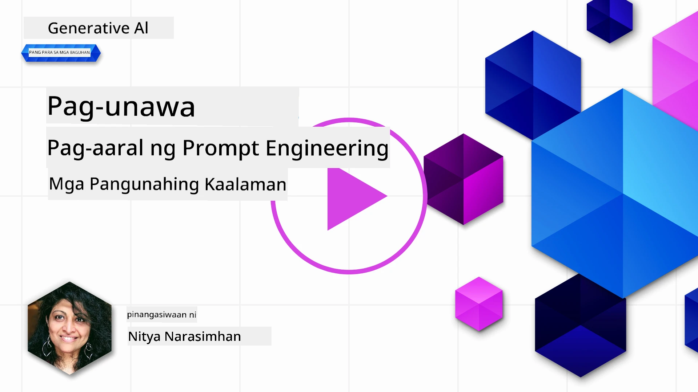
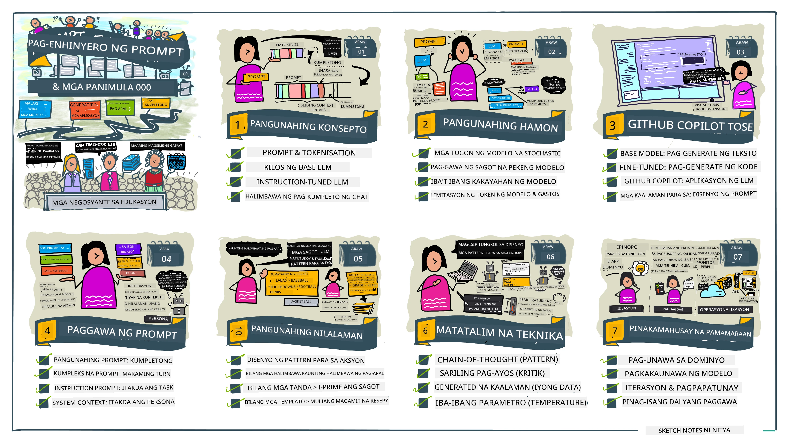
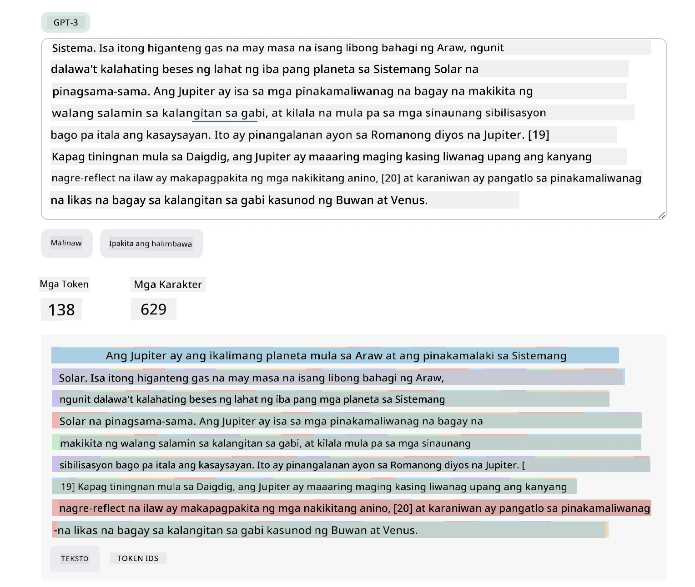
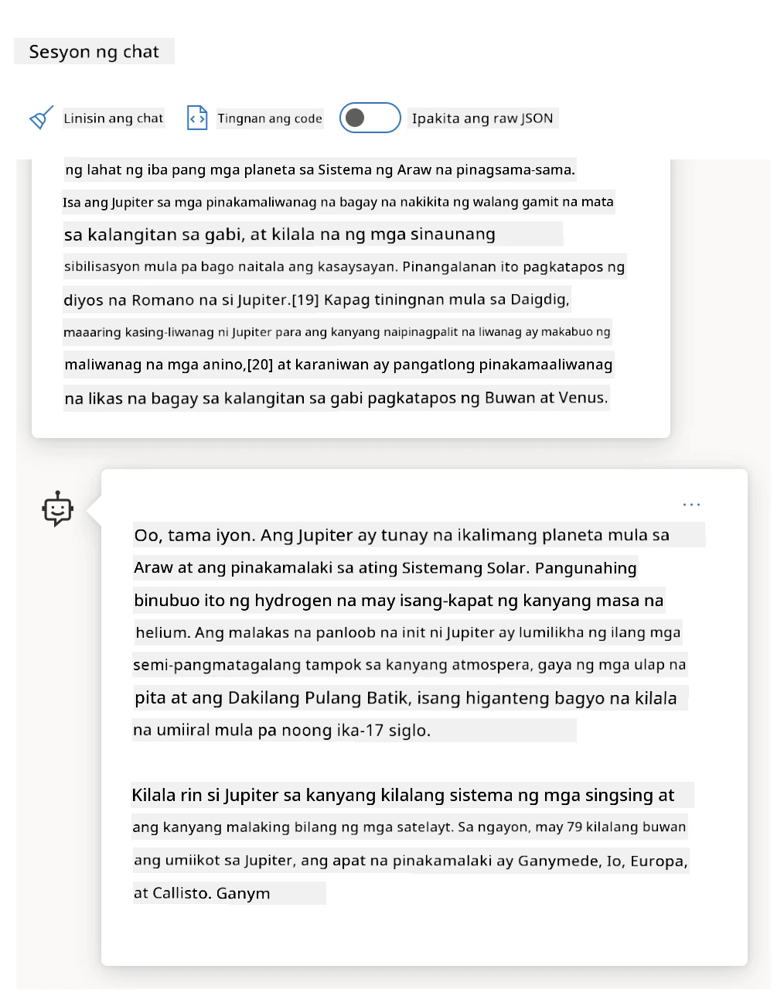
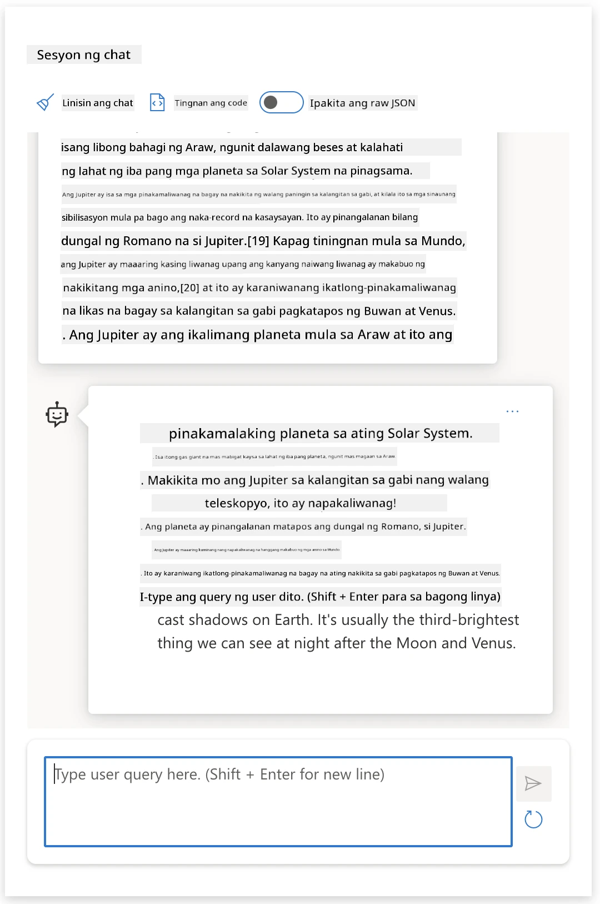
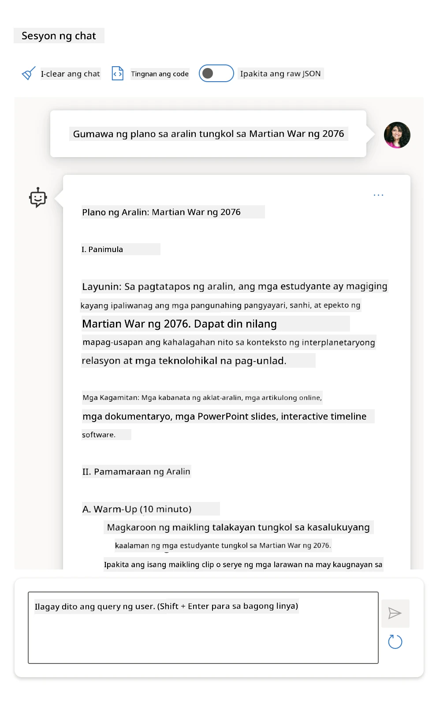
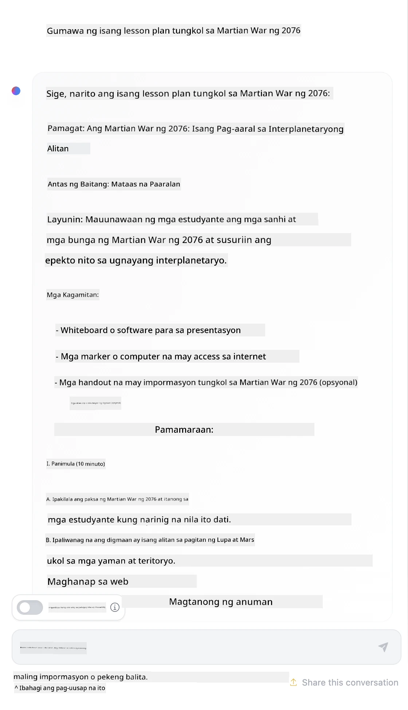

# Prompt Engineering Fundamentals

[](https://youtu.be/GElCu2kUlRs?si=qrXsBvXnCW12epb8)

## Panimula
Sinasaklaw ng modyul na ito ang mahahalagang konsepto at teknolohiya para sa paggawa ng epektibong mga prompt sa generative AI models. Mahalaga ang paraan ng pagsulat mo ng prompt sa isang LLM. Ang maingat na ginawang prompt ay maaaring makamit ang mas mataas na kalidad ng tugon. Ngunit ano nga ba ang ibig sabihin ng mga terminong tulad ng _prompt_ at _prompt engineering_? At paano ko mapapabuti ang prompt _input_ na ipinapadala ko sa LLM? Ito ang mga tanong na susubukan nating sagutin sa kabanatang ito at sa susunod.

Ang _Generative AI_ ay may kakayahang lumikha ng bagong nilalaman (hal., teksto, mga imahe, audio, code, atbp.) bilang tugon sa mga hiling ng gumagamit. Nagagawa ito gamit ang _Large Language Models_ tulad ng GPT ("Generative Pre-trained Transformer") ng OpenAI na sinanay para gumamit ng natural na wika at code.

Ngayon, maaaring makipag-ugnayan ang mga gumagamit sa mga modelong ito gamit ang mga pamilyar na paradigma tulad ng chat, nang hindi nangangailangan ng teknikal na kaalaman o pagsasanay. Ang mga modelo ay _prompt-based_ - nagpapadala ang user ng teksto bilang input (prompt) at bumabalik ang tugon ng AI (completion). Maaari silang "makipag-chat sa AI" nang paulit-ulit, sa multi-turn na mga usapan, na pinuhin ang prompt hanggang ang tugon ay tumugma sa kanilang inaasahan.

Ang mga "prompt" ang pangunahing _programming interface_ para sa mga generative AI apps, na nagsasabi sa mga modelo kung ano ang gagawin at nakakaapekto sa kalidad ng mga tugon na ibinabalik. Ang "Prompt Engineering" ay isang mabilis na lumalagong larangan ng pag-aaral na nakatuon sa _disenyo at pag-optimize_ ng mga prompt upang makapaghatid ng pare-pareho at mataas na kalidad na tugon sa malaking sukat.

## Mga Layunin sa Pagkatuto

Sa araling ito, matututuhan natin kung ano ang Prompt Engineering, bakit ito mahalaga, at paano tayo makakagawa ng mas epektibong mga prompt para sa isang partikular na modelo at layunin ng aplikasyon. Mauunawaan natin ang mga pangunahing konsepto at pinakamahusay na mga gawi para sa prompt engineering - at matututuhan ang tungkol sa isang interactive na Jupyter Notebooks "sandbox" na kapaligiran kung saan makikita natin ang mga konseptong ito na inilalapat sa mga tunay na halimbawa.

Pagkatapos ng araling ito, magagawa natin ang mga sumusunod:

1. Ipaliwanag kung ano ang prompt engineering at bakit ito mahalaga.
2. Ilarawan ang mga bahagi ng prompt at paano ito ginagamit.
3. Matutunan ang pinakamahuhusay na gawi at mga teknik para sa prompt engineering.
4. Ilapat ang mga natutunang teknik sa mga tunay na halimbawa, gamit ang isang OpenAI endpoint.

## Mga Mahahalagang Terminolohiya

Prompt Engineering: Ang pagsasanay ng pagdidisenyo at pagdadalisay ng mga input upang gabayan ang mga AI modelo patungo sa paglikha ng nais na resulta.

Tokenization: Ang proseso ng pag-convert ng teksto sa mas maliliit na yunit, tinatawag na mga token, na maaaring maintindihan at maproseso ng isang modelo.

Instruction-Tuned LLMs: Malalaking Language Models (LLMs) na na-fine-tune gamit ang mga partikular na instruksyon upang mapabuti ang katumpakan at kabuluhan ng kanilang mga tugon.

## Learning Sandbox

Ang prompt engineering ay kasalukuyang higit na isang sining kaysa agham. Ang pinakamahusay na paraan upang mapabuti ang ating intuwisyon dito ay ang _magpraktis ng higit pa_ at magpatibay ng trial-and-error na pamamaraan na pinagsasama ang kasanayan sa larangan ng aplikasyon sa mga inirekomendang teknik at pag-optimize na partikular sa modelo.

Ang Jupyter Notebook na kasama ng araling ito ay nagbibigay ng isang _sandbox_ na kapaligiran kung saan maaari mong subukan ang mga natutunan mo - habang nagpapatuloy o bilang bahagi ng code challenge sa huli. Upang maisagawa ang mga pagsasanay, kakailanganin mo:

1. **Isang Azure OpenAI API key** - ang endpoint ng serbisyo para sa isang na-deploy na LLM.
2. **Isang Python Runtime** - kung saan maaaring patakbuhin ang Notebook.
3. **Local Env Variables** - _kumpletuhin ang mga hakbang sa [SETUP](./../00-course-setup/02-setup-local.md?WT.mc_id=academic-105485-koreyst) ngayon upang maging handa_.

Ang notebook ay may mga _starter_ na pagsasanay - ngunit hinihikayat kang magdagdag ng sarili mong _Markdown_ (paglalarawan) at _Code_ (mga kahilingang prompt) na mga seksyon upang subukan ang mas marami pang mga halimbawa o ideya - at paunlarin ang iyong intuwisyon para sa disenyo ng prompt.

## Gabay na May Larawan

Gusto mo bang makita ang kabuuang larawan kung ano ang tatalakayin sa araling ito bago ka magsimula? Tingnan ang gabay na may larawan na ito, na nagbibigay ng ideya sa mga pangunahing paksa at mga mahahalagang bagay na dapat pag-isipan sa bawat isa. Ang roadmap ng aralin ay magdadala sa iyo mula sa pag-unawa sa mga core na konsepto at hamon patungo sa pagtugon gamit ang kaugnay na mga teknik sa prompt engineering at pinakamahusay na gawi. Tandaan na ang seksyong "Advanced Techniques" sa gabay na ito ay tumutukoy sa nilalaman na tatalakayin sa _susunod_ na kabanata ng kurikulum na ito.



## Ang Aming Startup

Ngayon, pag-usapan natin kung paano nauugnay ang _paksang ito_ sa aming misyon sa startup na [dalhin ang inobasyon sa AI sa edukasyon](https://educationblog.microsoft.com/2023/06/collaborating-to-bring-ai-innovation-to-education?WT.mc_id=academic-105485-koreyst). Nais naming bumuo ng mga AI-powered na aplikasyon ng _personalized learning_ - kaya pag-isipan natin kung paano maaaring "idisenyo" ng iba't ibang mga gumagamit ng aming aplikasyon ang mga prompt:

- **Mga Administrator** ay maaaring hilingin sa AI na _suriin ang mga data ng kurikulum upang tuklasin ang mga kakulangan sa saklaw_. Maaari namang ibuod ng AI ang mga resulta o ipakita ito gamit ang code.
- **Mga Guro** ay maaaring hilingin sa AI na _gumawa ng lesson plan para sa isang target na audience at paksa_. Maaari nitong buuin ang personalized na plano sa isang ibinigay na format.
- **Mga Mag-aaral** ay maaaring hilingin sa AI na _turuan sila sa isang mahirap na asignatura_. Ngayon, matutulungan ng AI ang mga estudyante sa mga aralin, mga pahiwatig at mga halimbawa na naaangkop sa kanilang antas.

Ito ay ilan lamang sa simula. Tingnan ang [Prompts For Education](https://github.com/microsoft/prompts-for-edu/tree/main?WT.mc_id=academic-105485-koreyst) - isang open-source na library ng prompts na iningatan ng mga eksperto sa edukasyon - upang magkaroon ng mas malawak na pagtingin sa mga posibilidad! _Subukan ang pagtakbo ng ilan sa mga prompt na iyon sa sandbox o gamit ang OpenAI Playground upang makita kung ano ang nangyayari!_

<!--
LESSON TEMPLATE:
This unit should cover core concept #1.
Reinforce the concept with examples and references.

CONCEPT #1:
Prompt Engineering.
Define it and explain why it is needed.
-->

## Ano ang Prompt Engineering?

Sinimulan natin ang araling ito sa pamamagitan ng pagdeklara ng **Prompt Engineering** bilang proseso ng _pagdidisenyo at pag-optimize_ ng mga input na teksto (prompts) upang makapaghatid ng pare-pareho at mataas na kalidad na mga tugon (completions) para sa isang partikular na layunin ng aplikasyon at modelo. Maaari natin itong isipin bilang isang 2-hakbang na proseso:

- _pagdidisenyo_ ng unang prompt para sa isang partikular na modelo at layunin
- _pagpino_ ng prompt nang paulit-ulit upang mapabuti ang kalidad ng tugon

Ito ay kinakailangang proseso ng trial-and-error na nangangailangan ng intuwisyon at pagsisikap ng gumagamit upang makamit ang pinakamainam na resulta. Bakit ito mahalaga? Upang masagot ang tanong na iyon, unang kailangan nating maunawaan ang tatlong konsepto:

- _Tokenization_ = kung paano "nakikita" ng modelo ang prompt
- _Base LLMs_ = kung paano "pinoproseso" ng foundation model ang prompt
- _Instruction-Tuned LLMs_ = kung paano na ngayong "nakikita" ng modelo ang mga "task"

### Tokenization

Nakikita ng isang LLM ang mga prompt bilang _sekwensiya ng mga token_ kung saan ang iba't ibang mga modelo (o bersyon ng isang modelo) ay maaaring mag-tokenize ng parehong prompt sa iba't ibang paraan. Dahil ang LLM ay sinanay gamit ang mga token (hindi ang hilaw na teksto), ang paraan ng pag-tokenize ng mga prompt ay direktang nakaaapekto sa kalidad ng nalikhang tugon.

Para makuha ang ideya kung paano gumagana ang tokenization, subukan ang mga tool tulad ng [OpenAI Tokenizer](https://platform.openai.com/tokenizer?WT.mc_id=academic-105485-koreyst) na ipinapakita sa ibaba. Kopyahin ang iyong prompt - at tingnan kung paano ito kino-convert sa mga token, na pansinin kung paano hinahandle ang mga whitespace na karakter at mga tandang-pababa. Tandaan na ang halimbawang ito ay nagpapakita ng isang mas lumang LLM (GPT-3) - kaya ang pagsubok nito gamit ang mas bagong modelo ay maaaring magbigay ng ibang resulta.



### Konsepto: Foundation Models

Kapag na-tokenize na ang prompt, ang pangunahing tungkulin ng ["Base LLM"](https://blog.gopenai.com/an-introduction-to-base-and-instruction-tuned-large-language-models-8de102c785a6?WT.mc_id=academic-105485-koreyst) (o Foundation model) ay hulaan ang susunod na token sa sekwensiya. Dahil ang LLM ay sinanay gamit ang napakalaking mga dataset ng teksto, mayroon itong magandang pananaw sa estadistikal na relasyon ng mga token at maaaring gumawa ng hula nang may kumpiyansa. Tandaan na hindi nila nauunawaan ang _kahulugan_ ng mga salita sa prompt o token; nakikita lang nila ang pattern na maaari nilang "kumpletuhin" sa kanilang susunod na hula. Maaari nilang ipagpatuloy ang paghula ng sekwensya hanggang ito ay ihinto ng user o ng ilang paunang itinakdang kundisyon.

Gusto mo bang makita kung paano gumagana ang completion na batay sa prompt? Ipasok ang prompt sa itaas sa Azure OpenAI Studio [_Chat Playground_](https://oai.azure.com/playground?WT.mc_id=academic-105485-koreyst) gamit ang default na setting. Nakakonpigura ang sistema upang ituring ang mga prompt bilang mga kahilingan para sa impormasyon - kaya makakakita ka ng completion na tumutugon sa kontekstong ito.

Pero paano kung nais ng gumagamit na makita ang isang bagay na partikular na tumutugon sa ilang criterio o layunin ng task? Dito pumapasok ang _instruction-tuned_ LLMs.



### Konsepto: Instruction Tuned LLMs

Ang isang [Instruction Tuned LLM](https://blog.gopenai.com/an-introduction-to-base-and-instruction-tuned-large-language-models-8de102c785a6?WT.mc_id=academic-105485-koreyst) ay nagsisimula sa foundation model at ini-fine-tune gamit ang mga halimbawa o input/output pairs (hal., multi-turn na "messages") na maaaring maglaman ng malinaw na mga instruksyon - at ang tugon mula sa AI ay sinusubukan sundin ang instruksyon.

Gumagamit ito ng mga teknik tulad ng Reinforcement Learning with Human Feedback (RLHF) na maaaring sanayin ang modelo na _sundin ang mga instruksyon_ at _matuto mula sa feedback_ upang magbigay ng mga tugon na mas angkop para sa praktikal na aplikasyon at mas may kabuluhan sa mga layunin ng gumagamit.

Subukan natin ito - balikan ang prompt sa itaas, ngunit ngayon palitan ang _system message_ upang magbigay ng sumusunod na instruksyon bilang konteksto:

> _Ibuod ang nilalaman na ibinigay sa iyo para sa isang mag-aaral sa ikalawang baitang. Panatilihin ang resulta sa isang talata na may 3-5 bullets._

Tingnan kung paano ngayon ang resulta ay naka-tune upang ipakita ang nais na layunin at format? Maaari nang direktang gamitin ng isang guro ang tugon na ito sa kanilang mga slides para sa klase na iyon.



## Bakit Kailangan ang Prompt Engineering?

Ngayon na alam na natin kung paano pinoproseso ng mga LLM ang mga prompt, pag-usapan natin kung _bakit_ kailangan natin ang prompt engineering. Nakasalalay ang sagot sa katotohanan na ang mga kasalukuyang LLM ay may mga hamon na nagpapahirap upang makamit ang _maaasahang at pare-parehong mga completion_ nang hindi nagsisikap sa konstruksyon at pag-optimize ng prompt. Halimbawa:

1. **Ang mga tugon ng modelo ay stochastic.** Ang _parehong prompt_ ay malamang na magbigay ng magkakaibang tugon sa iba't ibang mga modelo o bersyon ng modelo. Maaari rin itong magbigay ng magkakaibang resulta sa _parehong modelo_ sa iba't ibang pagkakataon. _Makakatulong ang prompt engineering techniques upang mabawasan ang mga pagbabago sa pamamagitan ng pagbibigay ng mas mahusay na mga guardrails_.

1. **Maaaring gumawa ng mga kathang tugon ang mga modelo.** Ang mga modelo ay na-pre-train gamit ang _malalaki ngunit limitado_ na dataset, na nangangahulugang kulang sila ng kaalaman tungkol sa mga konsepto sa labas ng saklaw ng pagsasanay. Bilang resulta, maaari silang gumawa ng mga completion na hindi tama, kathang-isip, o direktang taliwas sa mga kilalang katotohanan. _Tinutulungan ng prompt engineering techniques ang mga gumagamit na matukoy at mabawasan ang mga ganitong kathang tugon, hal., sa pamamagitan ng paghingi ng mga citation o paliwanag mula sa AI_.

1. **Magkakaiba ang kakayahan ng mga modelo.** Mas bagong mga modelo o henerasyon ng mga modelo ay may mas mayamang mga kakayahan ngunit may mga natatanging quirks at tradeoffs sa gastos at pagiging kumplikado. _Makakatulong ang prompt engineering sa pag-develop ng pinakamahusay na mga gawi at workflow na nagbubukod sa mga pagkakaiba at umangkop sa mga partikular na pangangailangan ng modelo sa scalable, seamless na mga paraan_.

Tingnan natin ito sa aksyon sa OpenAI o Azure OpenAI Playground:

- Gamitin ang parehong prompt sa iba't ibang deployment ng LLM (hal., OpenAI, Azure OpenAI, Hugging Face) - nakita mo ba ang mga pagkakaiba?
- Gamitin ang parehong prompt nang paulit-ulit sa _parehong_ deployment ng LLM (hal., Azure OpenAI playground) - paano nagkaiba ang mga resulta?

### Halimbawa ng Fabrications

Sa kursong ito, ginagamit natin ang terminong **"fabrication"** upang tukuyin ang pangyayaring kung saan ang mga LLM ay minsang gumagawa ng mga impormasyong mali ang katotohanan dahil sa mga limitasyon sa kanilang pagsasanay o ibang mga hadlang. Maaari mo ring narinig ito na tinatawag na _"hallucinations"_ sa mga popular na artikulo o pananaliksik. Gayunpaman, mariing inirerekumenda namin ang paggamit ng _"fabrication"_ upang hindi natin aksidenteng bigyan ang ugaling tao sa pag-uugali na resulta ng makina. Pinapalakas din nito ang [Responsible AI guidelines](https://www.microsoft.com/ai/responsible-ai?WT.mc_id=academic-105485-koreyst) mula sa pananaw ng terminolohiya, tinatanggal ang mga termino na maaari ring ituring na nakakasakit o hindi inklusibo sa ilang konteksto.

Gusto mo bang maramdaman kung paano gumagana ang fabrications? Isipin ang isang prompt na nag-uutos sa AI na gumawa ng nilalaman para sa isang hindi umiiral na paksa (upang matiyak na wala ito sa dataset ng pagsasanay). Halimbawa - sinubukan ko ang prompt na ito:

> **Prompt:** gumawa ng lesson plan tungkol sa Martian War ng 2076.
Ipinakita sa akin ng isang paghahanap sa web na may mga kathang-isip na salaysay (hal., mga serye sa telebisyon o mga libro) tungkol sa mga digmaan sa Mars - ngunit wala sa 2076. Sinasabi rin ng pangkaraniwang kaalaman na ang 2076 ay _sa hinaharap_ kaya, hindi ito maaaring maiugnay sa isang totoong pangyayari.

Kaya ano ang nangyayari kapag pinatakbo natin ang prompt na ito sa iba't ibang mga provider ng LLM?

> **Response 1**: OpenAI Playground (GPT-35)


> **Response 2**: Azure OpenAI Playground (GPT-35)



> **Response 3**: : Hugging Face Chat Playground (LLama-2)



Gaya ng inaasahan, bawat modelo (o bersyon ng modelo) ay naglalabas ng bahagyang magkakaibang mga sagot dahil sa stochastic na pag-uugali at pagkakaiba-iba sa kakayahan ng modelo. Halimbawa, ang isang modelo ay nakatuon sa isang audience na nasa ika-8 baitang habang ang isa naman ay inaakala na ang gumagamit ay isang estudyante ng mataas na paaralan. Ngunit ang lahat ng tatlong modelo ay bumuo ng mga sagot na maaaring makumbinsi ang isang hindi pamilyar na gumagamit na ang pangyayari ay totoong nangyari.

Ang mga teknik sa prompt engineering tulad ng _metaprompting_ at _temperature configuration_ ay maaaring magpababa sa mga peke o imbento ng modelo hanggang sa isang antas. Ang mga bagong arkitektura ng prompt engineering ay naglalaman din ng mga bagong kasangkapan at teknik nang walang putol sa daloy ng prompt, upang mapagaan o mabawasan ang ilan sa mga epekto nito.

## Case Study: GitHub Copilot

Tapusin natin ang seksyon na ito sa pamamagitan ng pagkuha ng ideya kung paano ginagamit ang prompt engineering sa mga totoong solusyon sa pamamagitan ng pagtingin sa isang Case Study: [GitHub Copilot](https://github.com/features/copilot?WT.mc_id=academic-105485-koreyst).

Ang GitHub Copilot ay iyong "AI Pair Programmer" - ito ay nagko-convert ng mga text prompt sa mga kumpletong code at naka-integrate sa iyong development environment (hal., Visual Studio Code) para sa isang tuloy-tuloy na karanasan ng gumagamit. Tulad ng nakatala sa serye ng mga blog sa ibaba, ang pinakaunang bersyon ay batay sa OpenAI Codex na modelo - na mabilis namang napagtanto ng mga engineer ang pangangailangan na i-fine-tune ang modelo at bumuo ng mas mahusay na mga teknik sa prompt engineering upang mapabuti ang kalidad ng code. Noong Hulyo, kanilang [ipinakilala ang isang pinahusay na AI model na lampas sa Codex](https://github.blog/2023-07-28-smarter-more-efficient-coding-github-copilot-goes-beyond-codex-with-improved-ai-model/?WT.mc_id=academic-105485-koreyst) para sa mas mabilis na mga suhestyon pa.

Basahin ang mga post nang sunud-sunod upang sundan ang kanilang paglalakbay sa pag-aaral.

- **Mayo 2023** | [Nagiging Mas Magaling ang GitHub Copilot sa Pag-unawa sa Iyong Code](https://github.blog/2023-05-17-how-github-copilot-is-getting-better-at-understanding-your-code/?WT.mc_id=academic-105485-koreyst)
- **Mayo 2023** | [Sa Loob ng GitHub: Pagtatrabaho kasama ang mga LLM sa likod ng GitHub Copilot](https://github.blog/2023-05-17-inside-github-working-with-the-llms-behind-github-copilot/?WT.mc_id=academic-105485-koreyst)
- **Hunyo 2023** | [Paano Sumulat ng Mas Magagandang Prompts para sa GitHub Copilot](https://github.blog/2023-06-20-how-to-write-better-prompts-for-github-copilot/?WT.mc_id=academic-105485-koreyst)
- **Hulyo 2023** | [.. Lumalampas ang GitHub Copilot sa Codex gamit ang pinahusay na AI model](https://github.blog/2023-07-28-smarter-more-efficient-coding-github-copilot-goes-beyond-codex-with-improved-ai-model/?WT.mc_id=academic-105485-koreyst)
- **Hulyo 2023** | [Isang Gabay ng Developer sa Prompt Engineering at LLMs](https://github.blog/2023-07-17-prompt-engineering-guide-generative-ai-llms/?WT.mc_id=academic-105485-koreyst)
- **Setyembre 2023** | [Paano Magtayo ng isang Enterprise LLM App: Mga Aral mula sa GitHub Copilot](https://github.blog/2023-09-06-how-to-build-an-enterprise-llm-application-lessons-from-github-copilot/?WT.mc_id=academic-105485-koreyst)

Maaari mo ring i-browse ang kanilang [Engineering blog](https://github.blog/category/engineering/?WT.mc_id=academic-105485-koreyst) para sa higit pang mga post tulad ng [ito](https://github.blog/2023-09-27-how-i-used-github-copilot-chat-to-build-a-reactjs-gallery-prototype/?WT.mc_id=academic-105485-koreyst) na nagpapakita kung paano _inaaplay_ ang mga modelong ito at teknik para sa pagpapatakbo ng mga totoong aplikasyon.

---

<!--
LESSON TEMPLATE:
This unit should cover core concept #2.
Reinforce the concept with examples and references.

CONCEPT #2:
Prompt Design.
Illustrated with examples.
-->

## Prompt Construction

Nakita na natin kung bakit mahalaga ang prompt engineering - ngayon unawain natin kung paano _binubuo_ ang mga prompt upang masuri natin ang iba't ibang teknik para sa mas epektibong disenyo ng prompt.

### Basic Prompt

Magsimula tayo sa basic prompt: isang text input na ipinapadala sa modelo nang walang iba pang konteksto. Narito ang isang halimbawa - kapag ipinadala natin ang unang ilang salita ng pambansang awit ng US sa OpenAI [Completion API](https://platform.openai.com/docs/api-reference/completions?WT.mc_id=academic-105485-koreyst) ito ay agad na _kumukumpleto_ ng tugon gamit ang susunod na mga linya, na nagpapakita ng pangunahing ugali ng prediksyon.

| Prompt (Input)     | Completion (Output)                                                                                                                        |
| :----------------- | :----------------------------------------------------------------------------------------------------------------------------------------- |
| Oh say can you see | Mukhang sinisimulan mo ang mga liriko ng "The Star-Spangled Banner," ang pambansang awit ng Estados Unidos. Ang buong liriko ay ...         |

### Complex Prompt

Ngayon magdagdag tayo ng konteksto at mga tagubilin sa basic prompt na iyon. Pinapayagan tayo ng [Chat Completion API](https://learn.microsoft.com/azure/ai-services/openai/how-to/chatgpt?WT.mc_id=academic-105485-koreyst) na bumuo ng isang kumplikadong prompt bilang koleksyon ng mga _message_ na may:

- Mga pares ng input/output na sumasalamin sa input ng _user_ at tugon ng _assistant_.
- Mensahe ng system na nagtatakda ng konteksto para sa pag-uugali o personalidad ng assistant.

Ang request ay nasa anyong nasa ibaba, kung saan ang _tokenization_ ay epektibong sumasaklaw ng relevanteng impormasyon mula sa konteksto at pag-uusap. Ngayon, ang pagbabago ng kontekstong system ay maaaring kasing epekto sa kalidad ng mga pagkumpleto, tulad ng mga input ng user na ibinibigay.

```python
response = openai.chat.completions.create(
    model="gpt-3.5-turbo",
    messages=[
        {"role": "system", "content": "You are a helpful assistant."},
        {"role": "user", "content": "Who won the world series in 2020?"},
        {"role": "assistant", "content": "The Los Angeles Dodgers won the World Series in 2020."},
        {"role": "user", "content": "Where was it played?"}
    ]
)
```

### Instruction Prompt

Sa mga halimbawa sa itaas, ang prompt ng user ay isang simpleng text query na maaaring bigyang-kahulugan bilang isang kahilingan para sa impormasyon. Sa mga _instruction_ prompt, maaari nating gamitin ang text na iyon para tukuyin ang isang gawain nang mas detalyado, na nagbibigay ng mas mahusay na gabay sa AI. Narito ang isang halimbawa:

| Prompt (Input)                                                                                                                                                                                                                         | Completion (Output)                                                                                                        | Uri ng Instruction  |
| :------------------------------------------------------------------------------------------------------------------------------------------------------------------------------------------------------------------------------------- | :------------------------------------------------------------------------------------------------------------------------- | :------------------ |
| Isulat ang paglalarawan ng Digmaang Sibil                                                                                                                                                                                           | _nagbalik ng isang simpleng talata_                                                                                        | Simple              |
| Isulat ang paglalarawan ng Digmaang Sibil. Ibigay ang mga pangunahing petsa at mga kaganapan at ilarawan ang kanilang kahalagahan                                                                                                     | _nagbalik ng isang talata kasunod ang listahan ng mahahalagang petsa ng kaganapan na may mga paglalarawan_                  | Complex             |
| Isulat ang paglalarawan ng Digmaang Sibil sa 1 talata. Magbigay ng 3 bullet points na may mahahalagang petsa at ang kanilang kahalagahan. Magbigay ng 3 pang bullet points na may mahahalagang mga tauhang historikal at kanilang mga kontribusyon. Ibalik ang output bilang isang JSON file | _nagbabalik ng mas malawak na detalye sa isang text box, naka-format bilang JSON na maaari mong kopyahin at i-paste sa file at suriin ayon sa kailangan_ | Complex. Naka-format.|

## Primary Content

Sa mga halimbawa sa itaas, ang prompt ay medyo bukas pa rin, na nagpapahintulot sa LLM na magpasya kung aling bahagi ng pre-trained dataset nito ang may kaugnayan. Sa disenyo ng _primary content_, hinahati ang input text sa dalawang bahagi:

- isang instruction (aksyon)
- kaugnay na nilalaman (na nakaaapekto sa aksyon)

Narito ang isang halimbawa kung saan ang instruction ay "pagsamahin ito sa 2 pangungusap".

| Prompt (Input)                                                                                                                                                                                                                                                                                                                                                                                                                                                                                                                                                                                                                                                                                      | Completion (Output)                                                                                                                                                                                                                                                                             |
| :-------------------------------------------------------------------------------------------------------------------------------------------------------------------------------------------------------------------------------------------------------------------------------------------------------------------------------------------------------------------------------------------------------------------------------------------------------------------------------------------------------------------------------------------------------------------------------------------------------------------------------------------------------------------------------------------------- | :---------------------------------------------------------------------------------------------------------------------------------------------------------------------------------------------------------------------------------------------------------------------------------------------- |
| Jupiter ay ang ikalimang planeta mula sa Araw at ang pinakamalaki sa Solar System. Isa itong gas giant na may mass na isang libong beses ng Araw, ngunit dalawang-kalahati beses ng lahat ng iba pang mga planeta sa Solar System na pinagsama. Ang Jupiter ay isa sa pinakamaliwanag na bagay na nakikita sa hubad na mata sa gabing kalangitan, at kilala na ito ng mga sinaunang sibilisasyon bago pa man naitala ang kasaysayan. Ito ay pinangalanan pagkatapos ng diyos na Romano na si Jupiter.[19] Kapag tiningnan mula sa Earth, maaaring maging sapat na maliwanag ang Jupiter para sa kahit na ang kanyang na-replekta na ilaw ay makabuo ng mga nakikitang anino,[20] at karaniwan itong pangatlo sa pinakamaliwanag na natural na bagay sa kalangitan sa gabi pagkatapos ng Buwan at Venus. <br/> **Ibuod ito sa 2 maikling pangungusap** | Ang Jupiter, ang ikalimang planeta mula sa Araw, ang pinakamalaki sa Solar System at kilala bilang isa sa mga pinakamaliwanag na bagay sa gabing kalangitan. Pinangalanan ito sa diyos na Romano na si Jupiter, isang gas giant na ang mass ay dalawang-kalahating beses ng lahat ng ibang mga planeta sa Solar System na pinagsama. |

Ang primary content na segment ay maaaring gamitin sa iba't ibang paraan upang magpatakbo ng mas epektibong mga instruksyon:

- **Mga Halimbawa** - sa halip na sabihin sa modelo kung ano ang gagawin gamit ang isang tahasang tagubilin, bigyan ito ng mga halimbawa ng gagawin at hayaang maunawaan ang pattern.
- **Mga Cue** - sundan ang instruksyon gamit ang isang "cue" na nagsisimula ng pagkumpleto, na nagtutulak sa modelo patungo sa mas kaugnay na mga sagot.
- **Mga Template** - ito ay mga paulit-ulit na 'resipi' para sa mga prompt na may mga placeholders (variables) na maaaring i-customize gamit ang datos para sa partikular na mga gamit.

Suriin natin ang mga ito sa aktwal na paggamit.

### Paggamit ng Mga Halimbawa

Ito ay isang paraan kung saan ginagamit mo ang primary content upang "pakainin ang modelo" ng ilang mga halimbawa ng nais na output para sa isang ibinigay na tagubilin, at hayaang mahulaan nito ang pattern ng nais na output. Batay sa dami ng mga ibinigay na halimbawa, maaari nating magkaroon ng zero-shot prompting, one-shot prompting, few-shot prompting atbp.

Ang prompt ngayon ay binubuo ng tatlong bahagi:

- Isang deskripsyon ng gawain
- Ilang mga halimbawa ng nais na output
- Ang simula ng isang bagong halimbawa (na nagiging implicit na deskripsyon ng gawain)

| Uri ng Pagkatuto | Prompt (Input)                                                                                                                                        | Completion (Output)         |
| :---------------- | :---------------------------------------------------------------------------------------------------------------------------------------------------- | :--------------------------|
| Zero-shot         | "The Sun is Shining". Isalin sa Spanish                                                                                                            | "El Sol está brillando".    |
| One-shot          | "The Sun is Shining" => ""El Sol está brillando". <br> "It's a Cold and Windy Day" =>                                                                 | "Es un día frío y ventoso". |
| Few-shot          | The player ran the bases => Baseball <br/> The player hit an ace => Tennis <br/> The player hit a six => Cricket <br/> The player made a slam-dunk => | Basketball                  |
|                   |                                                                                                                                                       |                            |

Pansinin kung paano kailangan nating magbigay ng tahasang tagubilin ("Isalin sa Spanish") sa zero-shot prompting, ngunit ito ay naintindihan sa one-shot prompting halimbawa. Ipinapakita ng few-shot na halimbawa kung paano ang pagdagdag ng mas maraming mga halimbawa ay nagpapahintulot sa mga modelo na makagawa ng mas tumpak na hinuha nang walang dagdag na mga tagubilin.

### Prompt Cues

Isa pang teknik para sa paggamit ng primary content ay ang pagbibigay ng _mga cue_ sa halip na mga halimbawa. Sa kasong ito, binibigyan natin ang modelo ng isang ptik sa tamang direksyon sa pamamagitan ng _pagsisimula_ nito ng isang snippet na nagpapakita ng nais na format ng tugon. Pagkatapos, "kinukuha ng modelo ang cue" upang ipagpatuloy ang ganung estilo.

| Bilang ng Cue | Prompt (Input)                                                                                                                                                                                                                                                                                                                                                                                                                                               | Completion (Output)                                                                                                                                                                                                                                                                                       |
| :------------- | :----------------------------------------------------------------------------------------------------------------------------------------------------------------------------------------------------------------------------------------------------------------------------------------------------------------------------------------------------------------------------------------------------------------------------------------------------------- | :-------------------------------------------------------------------------------------------------------------------------------------------------------------------------------------------------------------------------------------------------------------------------------------------------------- |
| 0              | Jupiter ay ang ikalimang planeta mula sa Araw at ang pinakamalaki sa Solar System. Isa itong gas giant na may mass na isang libong beses ng Araw, ngunit dalawang-kalahati beses ng lahat ng iba pang mga planeta sa Solar System na pinagsama. Jupiter ay isa sa pinakamaliwanag na bagay na nakikita sa hubad na mata sa kalangitan sa gabi, at kilala na ito ng mga sinaunang sibilisasyon bago pa maitala ang kasaysayan. <br/>**Buodin Ito**                                       | Ang Jupiter ang pinakamalaking planeta sa ating Solar System at ang ikalimang planeta mula sa Araw. Isa itong gas giant na may mass na 1/1000 ng Araw, ngunit mas mabigat ito kaysa sa lahat ng ibang planeta na pinagsama-sama. Matagal nang kilala ang Jupiter ng mga sinaunang sibilisasyon, at madaling makita sa kalangitan sa gabi. |
| 1              | Ang Jupiter ang ikalimang planeta mula sa Araw at ang pinakamalaki sa Solar System. Ito ay isang gas giant na may masa na isang libong bahagi lang ng Araw, ngunit dalawa't kalahati ang laki kumpara sa lahat ng ibang planeta sa Solar System na pinagsama-sama. Ang Jupiter ay isa sa mga pinakamaliwanag na bagay na nakikita ng hubad na mata sa gabi, at kilala na mula pa sa mga sinaunang sibilisasyon bago pa man ang nakatala na kasaysayan. <br/>**Buodin Ito** <br/> Ang natutunan natin ay na ang Jupiter | ay ang ikalimang planeta mula sa Araw at ang pinakamalaki sa Solar System. Ito ay isang gas giant na may masa na isang libong bahagi lang ng Araw, ngunit dalawa't kalahati ang laki kumpara sa lahat ng ibang planeta na pinagsama-sama. Madaling makita ito ng hubad na mata at kilala na mula pa sa sinaunang panahon.                        |
| 2              | Ang Jupiter ang ikalimang planeta mula sa Araw at ang pinakamalaki sa Solar System. Ito ay isang gas giant na may masa na isang libong bahagi lang ng Araw, ngunit dalawa't kalahati ang laki kumpara sa lahat ng ibang planeta sa Solar System na pinagsama-sama. Ang Jupiter ay isa sa mga pinakamaliwanag na bagay na nakikita ng hubad na mata sa gabi, at kilala na mula pa sa mga sinaunang sibilisasyon bago pa man ang nakatala na kasaysayan. <br/>**Buodin Ito** <br/> Nangungunang 3 Katotohanan na Natutunan Natin:         | 1. Ang Jupiter ay ang ikalimang planeta mula sa Araw at ang pinakamalaki sa Solar System. <br/> 2. Ito ay isang gas giant na may masa na isang libong bahagi lang ng Araw...<br/> 3. Ang Jupiter ay nakikita ng hubad na mata mula pa sa sinaunang panahon ...                                                                       |
|                |                                                                                                                                                                                                                                                                                                                                                                                                                                                              |                                                                                                                                                                                                                                                                                                           |

### Prompt Templates

Ang prompt template ay isang _pre-defined na recipe para sa isang prompt_ na maaaring itago at gamitin muli kung kinakailangan, upang makapaghatid ng mas pare-parehong karanasan ng gumagamit sa malakihang paraan. Sa pinakasimpleng anyo, ito ay koleksyon lang ng mga halimbawa ng prompt tulad ng [ito mula sa OpenAI](https://platform.openai.com/examples?WT.mc_id=academic-105485-koreyst) na nagbibigay ng parehong mga interactive na bahagi ng prompt (mga mensahe ng gumagamit at sistema) at ang format ng request na pinapatakbo ng API - upang suportahan ang muling paggamit.

Sa mas kumplikadong anyo nito tulad ng [halimbawa mula sa LangChain](https://python.langchain.com/docs/concepts/prompt_templates/?WT.mc_id=academic-105485-koreyst) naglalaman ito ng _placeholders_ na maaaring palitan ng data mula sa iba't ibang pinagmulan (input ng gumagamit, konteksto ng sistema, panlabas na mga pinagmumulan ng data, atbp.) upang makabuo ng prompt nang dinamiko. Pinapayagan tayo nitong lumikha ng isang library ng mga reusable prompts na maaaring gamitin upang makapaghatid ng pare-parehong karanasan ng gumagamit **programmatically** sa malakihang paraan.

Sa wakas, ang totoong halaga ng mga template ay nasa kakayahang gumawa at maglathala ng mga _prompt libraries_ para sa mga vertical application domains - kung saan ang prompt template ay ngayon _inakma_ upang salaminin ang konteksto o mga halimbawa na specific sa aplikasyon na nagpapataas ng pagiging kaugnay at katumpakan para sa target na gumagamit. Ang repository ng [Prompts For Edu](https://github.com/microsoft/prompts-for-edu?WT.mc_id=academic-105485-koreyst) ay isang mahusay na halimbawa ng ganitong pamamaraan, na nag-aayos ng isang library ng mga prompt para sa larangan ng edukasyon na may diin sa mga pangunahing layunin tulad ng pagpaplano ng leksyon, disenyo ng kurikulum, pagtuturo sa estudyante at iba pa.

## Supporting Content

Kung iisipin natin ang konstruksyon ng prompt bilang pagkakaroon ng isang instruksyon (gawain) at isang target (pangunahing nilalaman), ang _sekondaryong nilalaman_ ay parang dagdag na konteksto na ibinibigay natin upang **impluwensyahan ang output sa ilang paraan**. Maaaring ito ay mga tuning parameters, mga tagubilin sa pag-format, mga taxonomy ng paksa atbp. na makakatulong sa modelo na _iangkop_ ang sagot upang umayon sa inaasahang layunin o inaasahan ng gumagamit.

Halimbawa: Sa isang catalog ng kurso na may malawak na metadata (pangalan, deskripsyon, antas, mga tag ng metadata, instruktor atbp.) para sa lahat ng magagamit na kurso sa kurikulum:

- maaari tayong magtakda ng instruksiyon upang "ibuod ang katalogo ng kurso para sa Taglagas 2023"
- maaari nating gamitin ang pangunahing nilalaman para magbigay ng ilang halimbawa ng ninanais na output
- maaari naming gamitin ang sekondaryong nilalaman upang tukuyin ang nangungunang 5 "mga tag" na interesado

Ngayon, ang modelo ay maaaring magbigay ng buod sa format na ipinakita sa ilang halimbawa - ngunit kung may maraming tag ang resulta, maaaring unahin nito ang 5 natukoy na tag sa sekondaryong nilalaman.

---

<!--
LESSON TEMPLATE:
Dapat saklawin ng yunit na ito ang pangunahing konsepto #1.
Patatagin ang konsepto gamit ang mga halimbawa at sanggunian.

KONSEPTO #3:
Mga Teknik sa Prompt Engineering.
Ano ang ilan sa mga pangunahing teknik para sa prompt engineering?
Ilarawan ito gamit ang ilang mga pagsasanay.
-->

## Mga Pinakamahusay na Gawain sa Pag-prompt

Ngayon na alam na natin kung paano maaaring _itayo_ ang mga prompt, maaari na tayong magsimulang mag-isip kung paano _idisenyo_ ang mga ito upang salaminin ang mga pinakamahusay na gawain. Maaari nating pag-isipan ito sa dalawang bahagi - ang pagkakaroon ng tamang _pananaw_ at ang paggamit ng tamang _mga teknik_.

### Pananaw sa Prompt Engineering

Ang Prompt Engineering ay proseso ng trial-and-error kaya't tandaan ang tatlong pangkalahatang gabay na salik:

1. **Mahalaga ang Pag-unawa sa Domain.** Ang katumpakan at kaugnayan ng sagot ay nakasalalay sa _domain_ kung saan gumagana ang aplikasyon o gumagamit. Gamitin ang iyong intuwisyon at kaalaman sa domain upang **i-customize nang husto ang mga teknik**. Halimbawa, magtakda ng _mga personalidad na domain-specific_ sa iyong mga system prompt, o gumamit ng _mga template na domain-specific_ sa iyong mga user prompt. Magbigay ng sekondaryong nilalaman na sumasalamin sa kontekstong domain-specific, o gumamit ng _domain-specific na mga cue at halimbawa_ upang gabayan ang modelo patungo sa pamilyar na mga pattern ng paggamit.

2. **Mahalaga ang Pag-unawa sa Modelo.** Alam nating ang mga modelo ay stochastic sa kalikasan. Ngunit ang mga implementasyon ng modelo ay maaaring magkakaiba rin batay sa dataset ng pagsasanay na ginamit nila (pre-trained na kaalaman), mga kakayahan na iniaalok nila (e.g., via API o SDK) at uri ng nilalaman na optimized para sa kanila (hal. code vs. imahe vs. teksto). Unawain ang mga lakas at limitasyon ng modelong ginagamit mo, at gamitin ang kaalamang iyon upang _bigyang-priyoridad ang mga gawain_ o gumawa ng _customized na mga template_ na optimized para sa kakayahan ng modelo.

3. **Mahalaga ang Iterasyon at Pagpapatotoo.** Ang mga modelo ay mabilis na umuunlad, gayundin ang mga teknik para sa prompt engineering. Bilang isang eksperto sa domain, maaaring mayroon kang ibang konteksto o pamantayan para sa _iyong_ tiyak na aplikasyon na maaaring hindi angkop sa mas malawak na komunidad. Gamitin ang mga tool at teknik sa prompt engineering upang "mabilis na simulan" ang pagbuo ng prompt, pagkatapos ay ulitin at patotohanan ang mga resulta gamit ang iyong sariling intuwisyon at kaalaman sa domain. Itala ang iyong mga natuklasan at lumikha ng isang **knowledge base** (hal., mga prompt library) na maaaring gamitin bilang bagong baseline ng iba, para sa mas mabilis na iterasyon sa hinaharap.

## Mga Pinakamahusay na Gawain

Ngayon, tingnan natin ang mga pangkaraniwang pinakamahusay na gawain na inirerekomenda ng [OpenAI](https://help.openai.com/en/articles/6654000-best-practices-for-prompt-engineering-with-openai-api?WT.mc_id=academic-105485-koreyst) at [Azure OpenAI](https://learn.microsoft.com/azure/ai-services/openai/concepts/prompt-engineering#best-practices?WT.mc_id=academic-105485-koreyst) practitioners.

| Ano                              | Bakit                                                                                                                                                                                                                                               |
| :-------------------------------- | :------------------------------------------------------------------------------------------------------------------------------------------------------------------------------------------------------------------------------------------------ |
| Suriin ang mga pinakabagong modelo.       | Ang mga bagong henerasyon ng modelo ay posibleng may mga pinahusay na tampok at kalidad - ngunit maaari rin itong magdulot ng mas mataas na gastos. Suriin ang mga ito para sa epekto, pagkatapos gumawa ng desisyon sa paglipat.                                                                                |
| Ihiwalay ang mga instruksyon at konteksto   | Tingnan kung tinutukoy ng iyong modelo/tagapagbigay ang _delimiters_ upang mas malinaw na maiba ang mga instruksyon, pangunahing at sekondaryong nilalaman. Makakatulong ito sa mga modelo na bigyan ng mas tamang bigat ang mga token.                                                         |
| Maging partikular at malinaw             | Magbigay ng mas maraming detalye tungkol sa ninanais na konteksto, resulta, haba, format, estilo atbp. Mapapabuti nito ang kalidad at konsistensi ng mga sagot. Itala ang mga paraan sa mga reusable na template.                                                          |
| Maging malarawan, gumamit ng mga halimbawa      | Maaaring mas maayos na tumugon ang mga modelo sa isang "pakita at sabihin" na paraan. Magsimula sa isang `zero-shot` na pamamaraan kung saan bibigyan mo ito ng instruksyon (ngunit walang halimbawa), pagkatapos subukan ang `few-shot` para sa pagpapabuti, na nagbibigay ng ilang mga halimbawa ng ninanais na output. Gumamit ng mga analogiya. |
| Gumamit ng mga cue para pasimulaang sagot | Hikayatin ito patungo sa ninanais na resulta sa pamamagitan ng pagbibigay ng ilang mga paunang salita o pangungusap na maaari nitong gamitin bilang panimulang punto para sa sagot.                                                                                                               |
| Ulitin ng doble                      | Minsan kakailanganin mong ulitin ang iyong sarili sa modelo. Magbigay ng mga instruksyon bago at pagkatapos ng iyong pangunahing nilalaman, gamitin ang isang instruksiyon at isang cue, atbp. Ulitin at patotohanan upang makita kung ano ang epektibo.                                                         |
| Mahalaga ang pagkakasunod-sunod       | Ang pagkakasunud-sunod kung paano mo inihain ang impormasyon sa modelo ay maaaring makaapekto sa output, kahit sa mga halimbawa ng pagkatuto, dahil sa recency bias. Subukan ang iba't ibang pagpipilian upang makita kung ano ang pinakamahusay.                                                               |
| Bigyan ang modelo ng “labasan”           | Bigyan ang modelo ng isang _fallback_ na sagot na maaaring ibigay nito kapag hindi nito makumpleto ang gawain sa anumang dahilan. Makababawas ito sa posibilidad na makagawa ng maling o imbentong sagot ang modelo.                                                         |
|                                   |                                                                                                                                                                                                                                                   |

Tulad ng anumang pinakamahusay na gawain, tandaan na _nagkakaiba-iba ang karanasan mo_ base sa modelo, gawain at domain. Gamitin ito bilang panimulang punto, at ulitin upang hanapin ang pinakamainam para sa iyo. Patuloy na suriin ang iyong proseso ng prompt engineering sa paglabas ng mga bagong modelo at tools, na naka-focus sa scalability ng proseso at kalidad ng sagot.

<!--
LESSON TEMPLATE:
Dapat magbigay ang yunit na ito ng code challenge kung naaangkop

HAMON:
Link sa isang Jupyter Notebook na may mga komentaryo lamang sa mga instruksyon (walang laman ang mga code section).

SOLUSYON:
Link sa isang kopya ng Notebook na may naka-fill na prompt at pinaandar, na nagpapakita ng isang halimbawa ng output.
-->

## Takdang Aralin

Binabati kita! Nakapunta ka sa katapusan ng aralin! Oras na upang subukan ang ilan sa mga konsepto at teknik gamit ang mga totoong halimbawa!

Para sa ating takdang-aralin, gagamit tayo ng Jupyter Notebook na may mga pagsasanay na maaari mong tapusin nang interactive. Maaari mo ring palawakin ang Notebook gamit ang sarili mong mga Markdown at Code cells upang siyasatin ang mga ideya at teknik nang mag-isa.

### Upang makapagsimula, i-fork ang repo, pagkatapos

- (Inirerekomenda) Ilunsad ang GitHub Codespaces
- (Alternatibo) I-clone ang repo sa lokal mong device at gamitin ito gamit ang Docker Desktop
- (Alternatibo) Buksan ang Notebook gamit ang gusto mong Notebook runtime environment.

### Susunod, i-configure ang iyong mga environment variable

- Kopyahin ang `.env.copy` file sa root ng repo at pangalanan itong `.env` at punan ang mga halaga ng `AZURE_OPENAI_API_KEY`, `AZURE_OPENAI_ENDPOINT` at `AZURE_OPENAI_DEPLOYMENT`. Bumalik sa [Learning Sandbox section](../../../04-prompt-engineering-fundamentals) upang matutunan kung paano.

### Susunod, buksan ang Jupyter Notebook

- Piliin ang runtime kernel. Kung ginagamit ang opsyon 1 o 2, piliin lang ang default Python 3.10.x kernel na ibinibigay ng dev container.

Handa ka nang patakbuhin ang mga pagsasanay. Tandaan na walang _tama o maling_ sagot dito - ito ay eksplorasyon lamang sa pamamagitan ng trial-and-error at pagbuo ng intuwisyon kung ano ang epektibo para sa isang partikular na modelo at domain.

_Dahil dito, walang mga Code Solution na bahagi sa araling ito. Sa halip, ang Notebook ay magkakaroon ng mga Markdown cell na may pamagat na "My Solution:" na nagpapakita ng isang halimbawa ng output para sa sanggunian._

 <!--
LESSON TEMPLATE:
Balutin ang seksyon ng isang buod at mga mapagkukunan para sa sariling pag-aaral.
-->

## Pagsusulit sa Kaalaman

Alin sa mga sumusunod ang isang mahusay na prompt na sumusunod sa ilang makatwirang pinakamahusay na gawain?

1. Ipakita sa akin ang larawan ng pulang kotse
2. Ipakita sa akin ang larawan ng pulang kotse na may tatak na Volvo at modelong XC90 na nakaparada sa tabi ng bangin habang lumulubog ang araw
3. Ipakita sa akin ang larawan ng pulang kotse na may tatak na Volvo at modelong XC90

Sagot: 2, ito ang pinakamahusay na prompt dahil nagbibigay ito ng mga detalye kung "ano" at pumapasok sa mga partikular (hindi lang basta kotse kundi isang tiyak na tatak at modelo) at inilalarawan din ang pangkalahatang kapaligiran. Ang 3 ang pangalawa dahil naglalaman din ito ng maraming paglalarawan.

## 🚀 Hamon

Tingnan kung magagamit mo ang teknik na "cue" gamit ang prompt na: Kumpletuhin ang pangungusap "Ipakita sa akin ang larawan ng pulang kotse na may tatak na Volvo at ". Ano ang sagot nito, at paano mo ito mapapabuti?

## Mahusay na Trabaho! Ipagpatuloy ang Iyong Pag-aaral

Nais mo bang malaman pa ang tungkol sa iba't ibang konsepto ng Prompt Engineering? Pumunta sa [continued learning page](https://aka.ms/genai-collection?WT.mc_id=academic-105485-koreyst) upang makita ang iba pang magagandang mapagkukunan sa paksang ito.

Pumunta sa Lesson 5 kung saan tatalakayin natin ang [advanced prompting techniques](../05-advanced-prompts/README.md?WT.mc_id=academic-105485-koreyst)!

---

<!-- CO-OP TRANSLATOR DISCLAIMER START -->
**Paunawa**:
Ang dokumentong ito ay isinalin gamit ang AI translation service na [Co-op Translator](https://github.com/Azure/co-op-translator). Bagamat nagsusumikap kami ng katumpakan, pakatandaan na ang awtomatikong pagsasalin ay maaaring maglaman ng mga pagkakamali o hindi pagkakatugma. Ang orihinal na dokumento sa orihinal nitong wika ang dapat ituring na pangunahing sanggunian. Para sa mahahalagang impormasyon, inirerekomenda ang propesyonal na pagsasalin ng tao. Hindi kami mananagot sa anumang hindi pagkakaunawaan o maling interpretasyon na nagmula sa paggamit ng pagsasaling ito.
<!-- CO-OP TRANSLATOR DISCLAIMER END -->