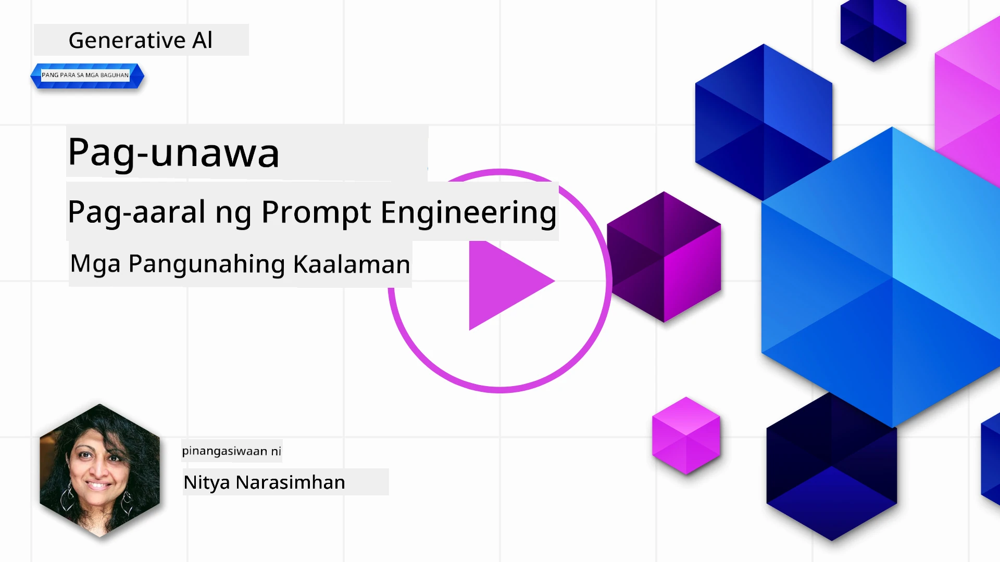
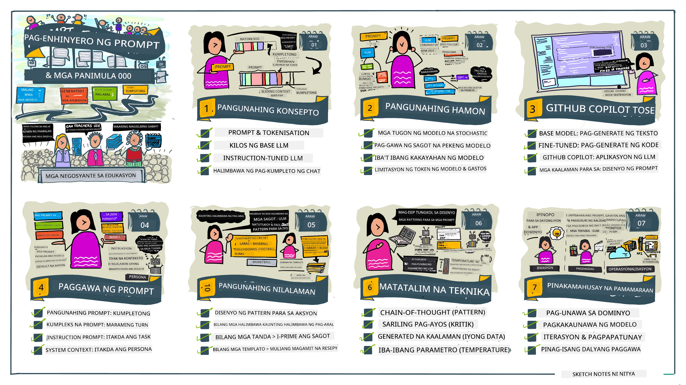
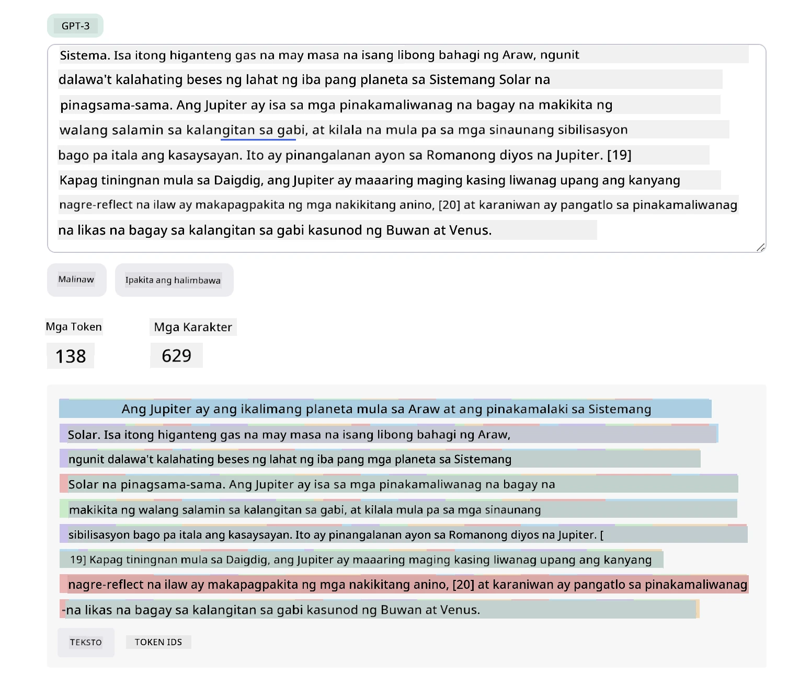
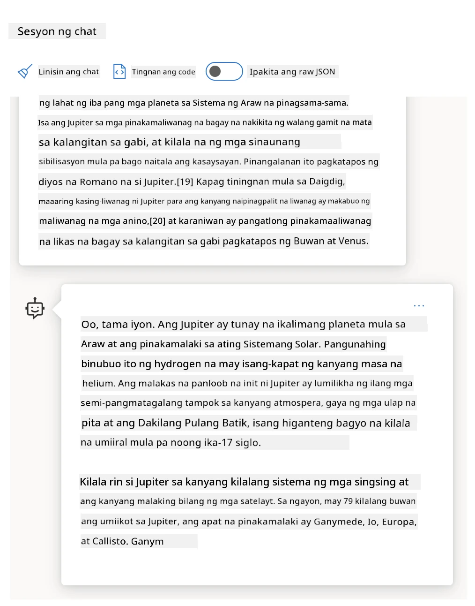
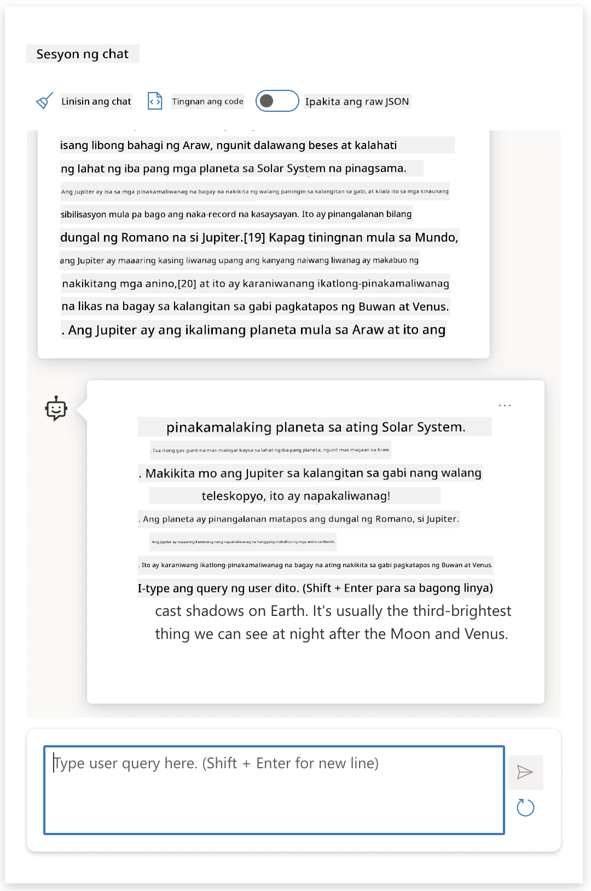
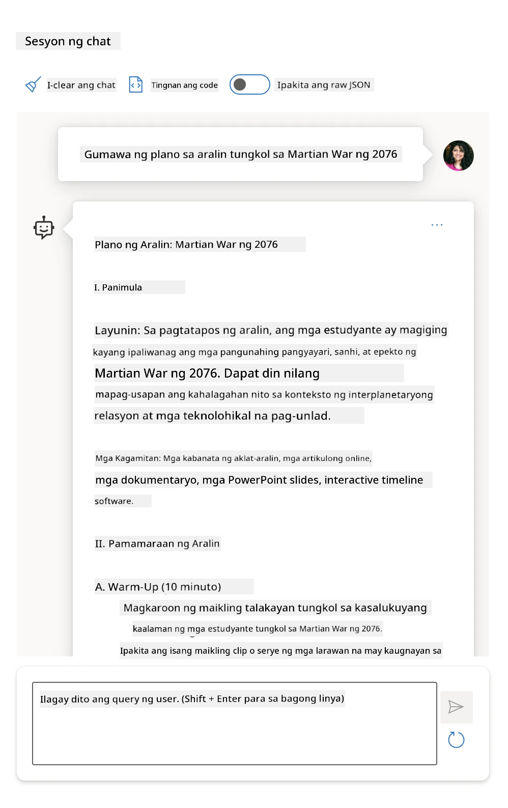
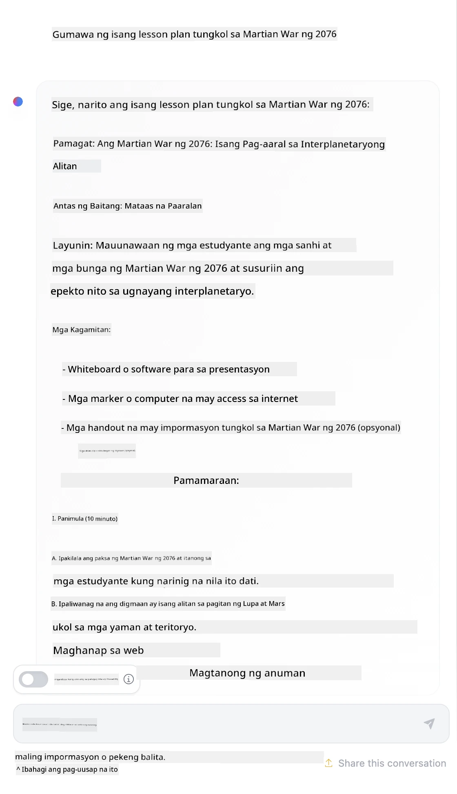

# Pangunahing Kaalaman sa Prompt Engineering

[](https://youtu.be/GElCu2kUlRs?si=qrXsBvXnCW12epb8)

## Panimula
Saklaw ng module na ito ang mahahalagang konsepto at teknik para sa paggawa ng epektibong mga prompt sa mga generative AI na modelo. Mahalaga rin kung paano mo sinusulat ang iyong prompt para sa isang LLM. Ang maingat na pagkagawa ng prompt ay maaaring makamit ang mas mataas na kalidad ng tugon. Ngunit ano nga ba ang ibig sabihin ng mga terminong _prompt_ at _prompt engineering_? At paano ko mapapabuti ang prompt _input_ na ipinapadala ko sa LLM? Ito ang mga tanong na susubukan nating sagutin sa loob ng kabanatang ito at sa susunod.

Ang _Generative AI_ ay may kakayahang gumawa ng bagong nilalaman (halimbawa, teksto, mga larawan, audio, code, atbp.) bilang tugon sa mga kahilingan ng gumagamit. Nakakamit ito gamit ang mga _Large Language Models_ tulad ng serye ng GPT ("Generative Pre-trained Transformer") ng OpenAI na sinanay gamit ang natural na wika at code.

Ngayon, maaaring makipag-ugnayan ang mga user sa mga modelong ito gamit ang pamilyar na mga pamamaraan tulad ng chat, nang hindi kailangan ng teknikal na kaalaman o pagsasanay. Ang mga modelo ay _prompt-based_ - nagpapadala ang mga user ng tekstong input (prompt) at bumabalik ang tugon mula sa AI (completion). Maaari silang makipag-chat sa AI nang paulit-ulit, sa maraming mga pag-uusap, pinapahusay ang kanilang prompt hanggang sa tumugma ang tugon sa kanilang inaasahan.

Ngayon, ang mga "Prompt" ay nagsisilbing pangunahing _programming interface_ para sa mga generative AI na aplikasyon, na nagsasabi sa mga modelo kung ano ang gagawin at nakakaapekto sa kalidad ng mga ibinalik na tugon. Ang "Prompt Engineering" ay isang mabilis na lumalawak na larangan ng pag-aaral na nakatuon sa _disenyo at pag-optimize_ ng mga prompt upang makapaghatid ng pare-pareho at mataas na kalidad na mga tugon sa malaking sukat.

## Mga Layunin sa Pagkatuto

Sa araling ito, matututunan natin kung ano ang Prompt Engineering, bakit ito mahalaga, at paano tayo makakagawa ng mas epektibong mga prompt para sa isang partikular na modelo at layunin ng aplikasyon. Mauunawaan natin ang mga pangunahing konsepto at pinakamahusay na mga kasanayan sa prompt engineering - at matututo tungkol sa isang interaktibong kapaligiran na Jupyter Notebooks "sandbox" kung saan makikita natin ang mga konseptong ito na inilalapat sa mga tunay na halimbawa.

Sa pagtatapos ng araling ito ay kaya nating:

1. Ipaliwanag kung ano ang prompt engineering at bakit ito mahalaga.
2. Ilarawan ang mga bahagi ng isang prompt at paano ito ginagamit.
3. Matutunan ang pinakamahusay na mga kasanayan at teknik para sa prompt engineering.
4. Ilapat ang mga natutunang teknik sa mga tunay na halimbawa, gamit ang isang OpenAI endpoint.

## Mga Pangunahing Termino

Prompt Engineering: Ang gawain ng pagdidisenyo at pag-aayos ng mga input upang gabayan ang mga AI model na makalikha ng nais na mga output.
Tokenization: Ang proseso ng pag-convert ng teksto sa mas maliliit na bahagi, tinatawag na mga token, na maiintindihan at mapoproseso ng modelo.
Instruction-Tuned LLMs: Malalaking Language Models (LLMs) na pinino gamit ang mga partikular na instruksyon upang mapabuti ang katumpakan at kaugnayan ng kanilang mga tugon.

## Learning Sandbox

Ang prompt engineering ay kasalukuyang mas sining kaysa agham. Ang pinakamahusay na paraan upang mapabuti ang ating intuwisyon dito ay ang _magsanay nang higit pa_ at magpatupad ng trial-and-error na pamamaraan na pinagsasama ang kaalaman sa larangan ng aplikasyon sa inirerekomendang mga teknik at mga model-specific na pag-aayos.

Ang Jupyter Notebook na kalakip ng araling ito ay nagbibigay ng isang _sandbox_ na kapaligiran kung saan maaari mong subukan ang iyong natutunan - habang nagpapatuloy o bilang bahagi ng hamon sa code sa dulo. Upang patakbuhin ang mga pagsasanay, kakailanganin mo:

1. **Isang Azure OpenAI API key** - ang serbisyo endpoint para sa isang nailunsad na LLM.
2. **Isang Python Runtime** - kung saan maaaring patakbuhin ang Notebook.
3. **Mga Lokal na Variable sa Kapaligiran** - _kumpletuhin ang mga hakbang sa [SETUP](./../00-course-setup/02-setup-local.md?WT.mc_id=academic-105485-koreyst) ngayon upang maging handa_.

Ang notebook ay may mga _panimulang_ pagsasanay - ngunit hinihikayat kang magdagdag ng iyong sariling mga seksyon ng _Markdown_ (paglalarawan) at _Code_ (mga kahilingan sa prompt) upang subukan ang mas maraming halimbawa o ideya - at paunlarin ang iyong intuwisyon sa disenyo ng prompt.

## Illustrated Guide

Gusto mo bang makita ang malinaw na larawan ng mga tatalakayin sa araling ito bago ka sumisid? Tingnan ang illustrated guide na ito, na nagbibigay sa iyo ng ideya ng mga pangunahing paksa at mahahalagang puntos na dapat pag-isipan sa bawat isa. Ang roadmap ng aralin ay magdadala sa iyo mula sa pag-unawa sa mga pangunahing konsepto at hamon hanggang sa pagharap sa mga ito gamit ang may-katuturang mga teknik sa prompt engineering at pinakamahusay na mga kasanayan. Tandaan na ang sekisyon ng "Advanced Techniques" sa gabay na ito ay tumutukoy sa nilalaman na tatalakayin sa _susunod_ na kabanata ng kurikulum na ito.



## Ang Aming Startup

Ngayon, pag-usapan natin kung paano nauugnay ang _paksang ito_ sa aming misyon sa startup na [magdala ng AI innovation sa edukasyon](https://educationblog.microsoft.com/2023/06/collaborating-to-bring-ai-innovation-to-education?WT.mc_id=academic-105485-koreyst). Nais naming bumuo ng mga AI-powered na aplikasyon para sa _personalized learning_ - kaya pag-isipan natin kung paano "maggagawa" ng mga prompt ang iba't ibang mga gumagamit ng aming aplikasyon:

- Maaaring hilingin ng mga **Administrator** sa AI na _suriin ang data ng kurikulum upang tukuyin ang mga kakulangan sa saklaw_. Maaari itong ibuod ang mga resulta o ipakita ang mga ito gamit ang code.
- Maaaring hilingin ng mga **Guro** sa AI na _gumawa ng lesson plan para sa isang tiyak na audience at paksa_. Maaari nitong buuin ang planong personalized sa isang tinukoy na format.
- Maaaring hilingin ng mga **Mag-aaral** sa AI na _turuan sila sa isang mahirap na paksa_. Maaari na ngayong gabayan ng AI ang mga mag-aaral gamit ang mga leksyon, mga tip, at mga halimbawa na angkop sa kanilang antas.

Iyon ay napakaliit lamang sa lahat ng posibilidad. Tingnan ang [Prompts For Education](https://github.com/microsoft/prompts-for-edu/tree/main?WT.mc_id=academic-105485-koreyst) - isang open-source na library ng mga prompt na inayos ng mga eksperto sa edukasyon - upang makakuha ng mas malawak na pananaw sa mga posibilidad! _Subukan mong patakbuhin ang ilan sa mga prompt na iyon sa sandbox o gamitin ang OpenAI Playground at tingnan kung ano ang mangyayari!_

<!--
LESSON TEMPLATE:
This unit should cover core concept #1.
Reinforce the concept with examples and references.

CONCEPT #1:
Prompt Engineering.
Define it and explain why it is needed.
-->

## Ano ang Prompt Engineering?

Sinimulan natin ang araling ito sa pamamagitan ng pagdeklara ng **Prompt Engineering** bilang proseso ng _pagdidisenyo at pag-optimize_ ng mga tekstong input (mga prompt) upang makapaghatid ng pare-pareho at mataas na kalidad na mga tugon (completions) para sa isang partikular na layunin ng aplikasyon at modelo. Maaari natin itong ituring bilang isang 2-hakbang na proseso:

- _pagdidisenyo_ ng panimulang prompt para sa isang partikular na modelo at layunin
- _pagpapahusay_ ng prompt nang paunti-unti upang mapabuti ang kalidad ng tugon

Ito ay isang trial-and-error na proseso na nangangailangan ng intuwisyon ng gumagamit at pagsisikap upang makamit ang pinakamainam na resulta. Kaya bakit ito mahalaga? Upang masagot ang tanong na iyon, kailangan muna nating maunawaan ang tatlong konsepto:

- _Tokenization_ = paano "nakikita" ng modelo ang prompt
- _Base LLMs_ = paano "pinoproseso" ng foundation model ang isang prompt
- _Instruction-Tuned LLMs_ = paano ng modelo ngayon nakakakita ng "mga gawain"

### Tokenization

Nakikita ng isang LLM ang mga prompt bilang isang _sunod-sunod na mga token_ kung saan iba't ibang mga modelo (o mga bersyon ng isang modelo) ay maaaring mag-tokenize ng parehong prompt sa iba't ibang paraan. Dahil sinasanay ang mga LLM sa mga token (hindi sa raw na teksto), ang paraan ng pag-tokenize ng mga prompt ay may direktang epekto sa kalidad ng nilikhang tugon.

Para magkaroon ng intuwisyon kung paano gumagana ang tokenization, subukan ang mga tool tulad ng [OpenAI Tokenizer](https://platform.openai.com/tokenizer?WT.mc_id=academic-105485-koreyst) na ipinakita sa ibaba. Kopyahin ang iyong prompt - at tingnan kung paano ito na-convert sa mga token, bigyang pansin kung paano hinahawakan ang mga whitespace character at mga marka ng bantas. Tandaan na ang halimbawang ito ay nagpapakita ng isang mas lumang LLM (GPT-3) - kaya maaaring mag-iba ang resulta kung gagamitin ito sa mas bagong modelo.



### Konsepto: Foundation Models

Kapag na-tokenize na ang prompt, ang pangunahing tungkulin ng ["Base LLM"](https://blog.gopenai.com/an-introduction-to-base-and-instruction-tuned-large-language-models-8de102c785a6?WT.mc_id=academic-105485-koreyst) (o Foundation model) ay hulaan ang token sa pagkakasunod-sunod. Dahil sinanay ang mga LLM sa napakalaking dataset ng teksto, may mabuting pakiramdam sila sa mga estadistikang ugnayan sa pagitan ng mga token at maaaring hulaan ito nang may kumpiyansa. Tandaan na hindi nila nauunawaan ang _kahulugan_ ng mga salita sa prompt o token; nakikita lamang nila ang isang pattern na maaari nilang "tapusin" gamit ang kanilang susunod na hula. Maaari nilang ipagpatuloy ang paghula ng pagkakasunod-sunod hanggang ito ay itigil ng interbensyon ng user o ng isang paunang itinalagang kondisyon.

Gusto mo bang makita kung paano gumagana ang prompt-based completion? Ipasok ang prompt sa [Microsoft Foundry playground](https://ai.azure.com?WT.mc_id=academic-105485-koreyst) gamit ang default na mga setting. Ang sistema ay naka-configure upang ituring ang mga prompt bilang mga kahilingan para sa impormasyon - kaya makakakita ka ng tugon na nakakatugon sa kontekstong ito.

Pero paano kung nais ng user na makita ang isang bagay na tiyak na nakakatugon sa ilang pamantayan o layunin ng gawain? Dito pumapasok ang mga _instruction-tuned_ na LLM.



### Konsepto: Instruction Tuned LLMs

Ang isang [Instruction Tuned LLM](https://blog.gopenai.com/an-introduction-to-base-and-instruction-tuned-large-language-models-8de102c785a6?WT.mc_id=academic-105485-koreyst) ay nagsisimula sa foundation model at pinapino ito gamit ang mga halimbawa o mga pares ng input/output (halimbawa, mga multi-turn na "mensahe") na maaaring maglaman ng malinaw na mga instruksyon - at ang tugon mula sa AI ay sumusubok na sundin ang instruksiyon na iyon.

Ginagamit nito ang mga teknik tulad ng Reinforcement Learning with Human Feedback (RLHF) na maaaring sanayin ang modelo na _sumunod sa mga instruksyon_ at _matuto mula sa feedback_ upang makalikha ng mga tugon na mas angkop sa mga praktikal na aplikasyon at mas may kaugnayan sa mga layunin ng user.

Subukan natin ito - balikan ang prompt sa itaas, ngunit palitan ang _system message_ upang magbigay ng sumusunod na instruksiyon bilang konteksto:

> _Ibuod ang nilalaman na ibinigay para sa isang mag-aaral sa pangalawang baitang. Panatilihin ang resulta sa isang talata na may 3-5 bullet points._

Tingnan kung paano ngayon ang resulta ay naka-tune upang ipakita ang nais na layunin at format? Maaaring direktang gamitin ng isang guro ang tugon na ito sa kanilang mga slides para sa klase na iyon.



## Bakit Kailangan ang Prompt Engineering?

Ngayon na alam na natin kung paano pinoproseso ng LLM ang mga prompt, pag-usapan natin kung _bakit_ kailangan natin ang prompt engineering. Ang sagot ay nakasalalay sa katotohanang ang kasalukuyang mga LLM ay may ilang mga hamon na nagpapahirap upang makamit ang _maaasahan at pare-parehong mga completion_ nang hindi nagbibigay ng pagsisikap sa pagbuo at pag-optimize ng prompt. Halimbawa:

1. **Stochastic ang mga tugon ng modelo.** Ang _parehong prompt_ ay malamang na magbunga ng iba’t ibang tugon sa iba’t ibang mga modelo o bersyon ng modelo. At maaari rin itong magbigay ng iba’t ibang resulta sa _parehong modelo_ sa iba’t ibang panahon. _Makakatulong ang mga teknik ng prompt engineering upang mabawasan ang mga pagkakaibang ito sa pamamagitan ng pagbibigay ng mas mahusay na mga gabay_.

1. **Maaaring mag-imbento ng tugon ang mga modelo.** Ang mga modelo ay sinanay gamit ang _malaki ngunit limitado_ na mga dataset, ibig sabihin, wala silang kaalaman tungkol sa mga konsepto na wala sa saklaw ng pagsasanay. Bilang resulta, makalikha sila ng mga completion na hindi tama, imbento, o direktang salungat sa mga kilalang katotohanan. _Tinutulungan tayo ng prompt engineering na matukoy at maiwasan ang ganitong mga imbento, halimbawa, sa pamamagitan ng paghingi ng citation o paliwanag mula sa AI_.

1. **Iba-iba ang kakayahan ng mga modelo.** Ang mga mas bagong modelo o henerasyon ng modelo ay magkakaroon ng mas maraming kakayahan ngunit nagdadala rin ng mga kakaibang katangian at mga tradeoff sa gastos at pagiging kumplikado. _Makakatulong ang prompt engineering sa pagbuo ng pinakamahusay na mga kasanayan at workflow na nag-aalis ng mga pagkakaiba at nag-aangkop sa mga partikular na pangangailangan ng modelo sa scalable at seamless na paraan_.

Tingnan natin ito sa aksyon sa OpenAI o Azure OpenAI Playground:

- Gamitin ang parehong prompt sa iba't ibang deployment ng LLM (halimbawa, OpenAI, Azure OpenAI, Hugging Face) - nakita mo ba ang mga pagkakaiba?
- Gamitin ang parehong prompt nang paulit-ulit sa _parehong_ deployment ng LLM (halimbawa, Azure OpenAI playground) - paano nagkaiba ang mga resulta?

### Halimbawa ng Imbento

Sa kurso na ito, ginagamit natin ang terminong **"fabrication"** upang tukuyin ang pangyayaring minsan ay nakagagawa ang mga LLM ng hindi totoo o maling impormasyon dahil sa mga limitasyon sa kanilang pagsasanay o ibang mga restriksyon. Maaring narinig mo rin ito bilang _"hallucinations"_ sa mga sikat na artikulo o mga papel sa pananaliksik. Gayunpaman, mariin naming inirerekomenda ang paggamit ng _"fabrication"_ bilang termino upang hindi natin mapagkamalang tao ang ugali sa pamamagitan ng pagbibigay ng katangiang pantao sa isang makinaryang kinalabasan. Pinapalakas nito ang mga [Responsible AI guidelines](https://www.microsoft.com/ai/responsible-ai?WT.mc_id=academic-105485-koreyst) mula sa pananaw ng terminolohiya, na inaalis ang mga termino na maaring ituring na nakakasakit o hindi inclusive sa ilang konteksto.

Gusto mo bang magkaroon ng ideya kung paano nagaganap ang fabrications? Isipin ang isang prompt na nagsasabi sa AI na gumawa ng nilalaman para sa isang paksang hindi umiiral (upang matiyak na wala ito sa training dataset). Halimbawa - sinubukan ko ang prompt na ito:

> **Prompt:** gumawa ng lesson plan tungkol sa Martian War ng 2076.

Ipinakita sa akin ng web search na may mga kathang-isip na mga kwento (halimbawa, serye sa telebisyon o mga libro) tungkol sa Martian wars - ngunit wala para sa 2076. Sinasabi rin ng common sense na ang 2076 ay _sa hinaharap_ kaya hindi ito maaaring maiugnay sa isang tunay na kaganapan.


Ano ang mangyayari kapag pinatakbo natin ang prompt na ito gamit ang iba't ibang LLM providers?

> **Sagot 1**: OpenAI Playground (GPT-35)


> **Sagot 2**: Azure OpenAI Playground (GPT-35)



> **Sagot 3**: : Hugging Face Chat Playground (LLama-2)



Tulad ng inaasahan, bawat modelo (o bersyon ng modelo) ay nagbibigay ng bahagyang magkakaibang mga sagot dahil sa stochastic na pag-uugali at pagkakaiba-iba sa kakayahan ng modelo. Halimbawa, ang isang modelo ay nakatutok sa mga tagapakinig na nasa ika-8 baitang habang ang isa naman ay inaasahang estudyante ng high-school. Pero lahat ng tatlong modelo ay naggenerate ng mga sagot na maaaring makapanghikayat sa isang hindi nakakaalam na user na ang pangyayari ay totoo.

Ang mga teknik sa prompt engineering tulad ng _metaprompting_ at _temperature configuration_ ay maaaring magpababa ng mga pekeng sagot ng modelo sa ilang antas. Ang mga bagong _arkitektura_ sa prompt engineering ay nagpapasok din ng mga bagong kasangkapan at teknik nang maayos sa daloy ng prompt, upang mapabuti o mabawasan ang ilan sa mga epekto nito.

## Case Study: GitHub Copilot

Tapusin natin ang seksyong ito sa pagkuha ng ideya kung paano ginagamit ang prompt engineering sa mga totoong solusyon sa pamamagitan ng pagtitingin sa isang Case Study: [GitHub Copilot](https://github.com/features/copilot?WT.mc_id=academic-105485-koreyst).

Ang GitHub Copilot ay iyong "AI Pair Programmer" - nagko-convert ito ng mga text prompt sa mga pagkumpleto ng code at naka-integrate sa iyong development environment (e.g., Visual Studio Code) para sa tuluy-tuloy na karanasan ng user. Ayon sa mga dokumento sa serye ng mga blog sa ibaba, ang pinakaunang bersyon ay base sa OpenAI Codex model - kung saan mabilis na napagtanto ng mga engineer ang pangangailangan na i-fine-tune ang modelo at mag-develop ng mas magagandang teknik sa prompt engineering upang mapabuti ang kalidad ng code. Noong Hulyo, inilunsad nila ang [pinahusay na AI model na lampas sa Codex](https://github.blog/2023-07-28-smarter-more-efficient-coding-github-copilot-goes-beyond-codex-with-improved-ai-model/?WT.mc_id=academic-105485-koreyst) para sa mas mabilis na mga suhestiyon.

Basahin ang mga post nang sunod-sunod, upang sundan ang kanilang paglalakbay sa pagkatuto.

- **Mayo 2023** | [Mas Naiintindihan ng GitHub Copilot ang Iyong Code](https://github.blog/2023-05-17-how-github-copilot-is-getting-better-at-understanding-your-code/?WT.mc_id=academic-105485-koreyst)
- **Mayo 2023** | [Sa Loob ng GitHub: Paggamit ng mga LLMs sa Likod ng GitHub Copilot](https://github.blog/2023-05-17-inside-github-working-with-the-llms-behind-github-copilot/?WT.mc_id=academic-105485-koreyst).
- **Hunyo 2023** | [Paano sumulat ng mas magagandang prompt para sa GitHub Copilot](https://github.blog/2023-06-20-how-to-write-better-prompts-for-github-copilot/?WT.mc_id=academic-105485-koreyst).
- **Hulyo 2023** | [.. GitHub Copilot lumampas sa Codex gamit ang pinahusay na AI model](https://github.blog/2023-07-28-smarter-more-efficient-coding-github-copilot-goes-beyond-codex-with-improved-ai-model/?WT.mc_id=academic-105485-koreyst)
- **Hulyo 2023** | [Gabay ng Developer sa Prompt Engineering at LLMs](https://github.blog/2023-07-17-prompt-engineering-guide-generative-ai-llms/?WT.mc_id=academic-105485-koreyst)
- **Setyembre 2023** | [Paano gumawa ng enterprise LLM app: Mga Aral mula sa GitHub Copilot](https://github.blog/2023-09-06-how-to-build-an-enterprise-llm-application-lessons-from-github-copilot/?WT.mc_id=academic-105485-koreyst)

Maaari mo ring bisitahin ang kanilang [Engineering blog](https://github.blog/category/engineering/?WT.mc_id=academic-105485-koreyst) para sa iba pang mga post tulad ng [ito](https://github.blog/2023-09-27-how-i-used-github-copilot-chat-to-build-a-reactjs-gallery-prototype/?WT.mc_id=academic-105485-koreyst) na nagpapakita kung paano ang mga modelong ito at mga teknik ay _inaaplay_ para magpatakbo ng mga totoong aplikasyon.

---

<!--
LESSON TEMPLATE:
Dapat talakayin ng yunit na ito ang pangunahing konsepto #2.
Palalalimin ang konsepto gamit ang mga halimbawa at sanggunian.

KONSEPTONG #2:
Disenyo ng Prompt.
Ipinapakita gamit ang mga halimbawa.
-->

## Pagsasaayos ng Prompt

Nakita na natin kung bakit mahalaga ang prompt engineering - ngayon unawain natin kung paano _binubuo_ ang mga prompt upang masuri natin ang iba't ibang teknik para sa mas epektibong disenyo ng prompt.

### Simpleng Prompt

Magsimula tayo sa simpleng prompt: isang text input na ipinapadala sa modelo nang walang iba pang konteksto. Narito ang halimbawa - kapag ipinadala natin ang unang ilang salita ng pambansang awit ng US sa OpenAI [Completion API](https://platform.openai.com/docs/api-reference/completions?WT.mc_id=academic-105485-koreyst) biglang _kinumpleto_ nito ang sagot gamit ang susunod na mga linya, na nagpapakita ng pangunahing pag-uugali sa prediksyon.

| Prompt (Input)     | Completion (Output)                                                                                                                        |
| :----------------- | :----------------------------------------------------------------------------------------------------------------------------------------- |
| Oh say can you see | Parang sinisimulan mo ang liriko ng "The Star-Spangled Banner," ang pambansang awit ng Estados Unidos. Ang buong teksto ay ...             |

### Masalimuot na Prompt

Ngayon magdagdag tayo ng konteksto at mga tagubilin sa simpleng prompt na iyon. Pinapayagan tayo ng [Chat Completion API](https://learn.microsoft.com/azure/ai-services/openai/how-to/chatgpt?WT.mc_id=academic-105485-koreyst) na bumuo ng masalimuot na prompt bilang koleksyon ng mga _mensahe_ na may:

- Magpares ng input/output na sumasalamin sa _user_ input at sagot ng _assistant_.
- Mensahe mula sa system na nagtatalaga ng konteksto para sa ugali o personalidad ng assistant.

Ang kahilingan ay nasa anyo sa ibaba, kung saan ang _tokenization_ ay epektibong nakukuha ang kaugnay na impormasyon mula sa konteksto at pag-uusap. Ang pagbabago ng konteksto ng system ay kasing epektibo sa kalidad ng mga completion gaya ng mga input ng user na ibinigay.

```python
response = client.responses.create(
    model="gpt-4o-mini",
    input=[
        {"role": "system", "content": "You are a helpful assistant."},
        {"role": "user", "content": "Who won the world series in 2020?"},
        {"role": "assistant", "content": "The Los Angeles Dodgers won the World Series in 2020."},
        {"role": "user", "content": "Where was it played?"}
    ]
)
```

### Instruction Prompt

Sa mga halimbawa sa itaas, ang prompt ng user ay isang simpleng text query na maaaring considerahing kahilingan para sa impormasyon. Sa _instruction_ prompt, maaari nating gamitin ang text na iyon upang tukuyin ang isang gawain nang mas detalyado, na nagbibigay ng mas magandang gabay sa AI. Narito ang halimbawa:

| Prompt (Input)                                                                                                                                                                                                                         | Completion (Output)                                                                                                        | Uri ng Instruksyon |
| :------------------------------------------------------------------------------------------------------------------------------------------------------------------------------------------------------------------------------------- | :------------------------------------------------------------------------------------------------------------------------- | :------------------ |
| Sumulat ng paglalarawan ng Digmaang Sibil                                                                                                                                                                                            | _nagbalik ng simpleng talata_                                                                                             | Simple              |
| Sumulat ng paglalarawan ng Digmaang Sibil. Ilahad ang mahahalagang petsa at mga pangyayari at ilarawan ang kanilang kahalagahan.                                                                                                     | _nagbalik ng talata kasunod ang listahan ng mga pangunahing petsa ng pangyayari na may mga paglalarawan_                     | Masalimuot           |
| Sumulat ng paglalarawan ng Digmaang Sibil sa 1 talata. Magbigay ng 3 bullet points ng mahahalagang petsa at ang kanilang kahalagahan. Magbigay ng 3 pa bullet points ng mahahalagang tauahan sa kasaysayan at ang kanilang kontribusyon. Ibalik ang output bilang JSON file | _nagbabalik ng mas detalyadong nilalaman sa text box, naka-format bilang JSON na maaari mong kopyahin at i-paste sa file at patunayan kung kinakailangan_ | Masalimuot. Naayos. |

## Pangunahing Nilalaman

Sa mga halimbawa sa itaas, ang prompt ay medyo bukas pa rin, na nagbibigay-daan sa LLM na magdesisyon kung aling bahagi ng pre-trained dataset niya ang kaugnay. Sa _primary content_ na disenyo, hinahati ang input text sa dalawang bahagi:

- isang instruksyon (aksiyon)
- kaugnay na nilalaman (na nakakaimpluwensya sa aksiyon)

Narito ang halimbawa kung saan ang instruksyon ay "ibuod ito sa 2 pangungusap".

| Prompt (Input)                                                                                                                                                                                                                                                                                                                                                                                                                                                                                                                                                                                                                                                                                      | Completion (Output)                                                                                                                                                                                                                                                                             |
| :-------------------------------------------------------------------------------------------------------------------------------------------------------------------------------------------------------------------------------------------------------------------------------------------------------------------------------------------------------------------------------------------------------------------------------------------------------------------------------------------------------------------------------------------------------------------------------------------------------------------------------------------------------------------------------------------------- | :---------------------------------------------------------------------------------------------------------------------------------------------------------------------------------------------------------------------------------------------------------------------------------------------- |
| Ang Jupiter ay ang ikalimang planeta mula sa Araw at ang pinakamalaki sa Solar System. Isa itong gas giant na may mass na isa-sa-isang libo ng Araw, ngunit dalawang-kalahating beses ng mass ng lahat ng ibang planeta sa Solar System na pinagsama. Ang Jupiter ay isa sa pinakamaliwanag na mga bagay na nakikita ng walang tulong sa gabi, at kilala na sa mga sinaunang sibilisasyon bago pa man ang naitalang kasaysayan. Ito ay pinangalanang batay sa diyos ng mga Romano na si Jupiter.[19] Kapag tiningnan mula sa Daigdig, ang Jupiter ay maaaring maging sapat na maliwanag para ang kanyang naiibang ilaw ay makapagdulot ng makikitang mga anino,[20] at karaniwan siyang ikatlong pinakaliwanag na natural na bagay sa kalangitan tuwing gabi pagkatapos ng Buwan at Venus. <br/> **Buodin ito sa 2 maikling pangungusap** | Ang Jupiter, ang ikalimang planeta mula sa Araw, ay ang pinakamalaki sa Solar System at kilala bilang isa sa pinakamaliwanag na bagay sa kalangitan tuwing gabi. Pinangalanan ito ayon sa diyos ng mga Romano na si Jupiter, isang gas giant na may mass na dalawang-kalahating beses ng lahat ng ibang planeta sa Solar System na pinagsama-sama. |

Maaaring gamitin ang pangunahing bahagi ng nilalaman sa iba't ibang paraan upang magbigay ng mas epektibong instruksyon:

- **Mga Halimbawa** - imbes na sabihan ang modelo kung ano ang gagawin gamit ang tahasang instruksyon, bigyan ito ng mga halimbawa ng gagawin at hayaan itong tuklasin ang pattern.
- **Mga Palatandaan** - sundan ang instruksyon ng isang "cue" na naghahanda sa completion, na ginagabayan ang modelo patungo sa mas kaugnay na mga sagot.
- **Mga Template** - mga paulit-ulit na 'recipe' para sa mga prompt na may placeholders (mga variable) na maaaring ipasadya gamit ang data para sa tiyak na mga gamit.

Tuklasin natin ito sa aktwal na gamit.

### Paggamit ng mga Halimbawa

Isa itong paraan kung saan ginagamit mo ang pangunahing nilalaman para "pakainin ang modelo" ng mga halimbawa ng nais na output para sa isang ibinigay na instruksyon, at hayaan nitong tuklasin ang pattern ng nais na output. Batay sa bilang ng mga halimbawa na ibinigay, mayroon tayong zero-shot prompting, one-shot prompting, few-shot prompting, atbp.

Ang prompt ay binubuo na ngayon ng tatlong bahagi:

- Isang paglalarawan ng gawain
- Ilang mga halimbawa ng nais na output
- Simula ng isang bagong halimbawa (na nagiging tahasang paglalarawan ng gawain)

| Uri ng Pagkatuto | Prompt (Input)                                                                                                                                        | Completion (Output)         |
| :------------ | :---------------------------------------------------------------------------------------------------------------------------------------------------- | :-------------------------- |
| Zero-shot     | "The Sun is Shining". Isalin sa Espanyol                                                                                                            | "El Sol está brillando".    |
| One-shot      | "The Sun is Shining" => ""El Sol está brillando". <br> "It's a Cold and Windy Day" =>                                                                   | "Es un día frío y ventoso". |
| Few-shot      | The player ran the bases => Baseball <br/> The player hit an ace => Tennis <br/> The player hit a six => Cricket <br/> The player made a slam-dunk => | Basketball                  |
|               |                                                                                                                                                       |                             |

Pansin na kailangang magbigay tayo ng tahasang instruksyon ("Isalin sa Espanyol") sa zero-shot prompting, pero ito ay natutukoy na sa one-shot prompting na halimbawa. Ang few-shot na halimbawa ay nagpapakita kung paano ang pagdagdag ng mas maraming halimbawa ay pinapayagan ang mga modelo na gumawa ng mas tumpak na mga hinuha nang walang dagdag na mga tagubilin.

### Mga Palatandaan sa Prompt

Isa pang teknik sa paggamit ng pangunahing nilalaman ay ang pagbibigay ng mga _palatandaan_ imbes na mga halimbawa. Sa kasong ito, binibigyan natin ang modelo ng tulak sa tamang direksyon sa pamamagitan ng _pagsisimula ito_ sa isang piraso ng teksto na nagpapakita ng nais na pormat ng sagot. Ang modelo ang "kumukuha ng palatandaan" upang ipagpatuloy sa ganoong estilo.

| Bilang ng Palatandaan | Prompt (Input)                                                                                                                                                                                                                                                                                                                                                                                                                                               | Completion (Output)                                                                                                                                                                                                                                                                                       |
| :------------- | :----------------------------------------------------------------------------------------------------------------------------------------------------------------------------------------------------------------------------------------------------------------------------------------------------------------------------------------------------------------------------------------------------------------------------------------------------------- | :-------------------------------------------------------------------------------------------------------------------------------------------------------------------------------------------------------------------------------------------------------------------------------------------------------- |
| 0              | Ang Jupiter ay ang ikalimang planeta mula sa Araw at ang pinakamalaki sa Solar System. Isa itong gas giant na may mass na isa-sa-isang libo ng Araw, ngunit dalawang-kalahating beses ng mass ng lahat ng ibang planeta sa Solar System na pinagsama. Ang Jupiter ay isa sa pinakamaliwanag na mga bagay na nakikita ng walang tulong sa gabi, at kilala na sa mga sinaunang sibilisasyon bago pa man ang naitalang kasaysayan. <br/>**Buodin Ito**                                       | Ang Jupiter ay ang pinakamalaking planeta sa ating Solar System at ang ikalimang planeta mula sa Araw. Isa itong gas giant na may mass na 1/1000 ng Araw, ngunit mas mabigat kaysa sa lahat ng ibang planeta na pinagsama-sama. Matagal nang kilala ang Jupiter sa mga sinaunang sibilisasyon, at madali itong makita sa kalangitan tuwing gabi.. |
| 1              | Ang Jupiter ay ang ikalimang planeta mula sa Araw at ang pinakamalaki sa Solar System. Isa itong gas giant na may mass na isa-sa-isang libo ng Araw, ngunit dalawang-kalahating beses ng mass ng lahat ng ibang planeta sa Solar System na pinagsama. Ang Jupiter ay isa sa pinakamaliwanag na mga bagay na nakikita ng walang tulog sa gabi, at kilala na sa mga sinaunang sibilisasyon bago pa man ang naitalang kasaysayan. <br/>**Buodin Ito** <br/> Natutunan natin na ang Jupiter | ay ang ikalimang planeta mula sa Araw at ang pinakamalaki sa Solar System. Isa itong gas giant na may mass na isa-sa-isang libo ng Araw, ngunit dalawang-kalahating beses ng mass ng lahat ng ibang planeta na pinagsama. Madali itong makita ng mata at kilala na mula pa sa sinaunang panahon.                        |

| 2              | Ang Jupiter ay ang ikalimang planeta mula sa Araw at ang pinakamalaki sa Solar System. Ito ay isang gas giant na may masa na isang libong bahagi lang ng masa ng Araw, ngunit dalawa at kalahating beses ng lahat ng iba pang mga planeta sa Solar System na pinagsama-sama. Ang Jupiter ay isa sa mga pinakamaliwanag na bagay na makikita ng hubad na mata sa kalangitan sa gabi, at kilala na ito mula pa sa mga sinaunang sibilisasyon bago sumulat ng kasaysayan. <br/>**Buodin Ito** <br/> Nangungunang 3 Katotohanan na Natutunan:         | 1. Ang Jupiter ay ang ikalimang planeta mula sa Araw at ang pinakamalaki sa Solar System. <br/> 2. Ito ay isang gas giant na may masa na isang libong bahagi lang ng masa ng Araw...<br/> 3. Ang Jupiter ay nakikita ng hubad na mata mula pa noong sinaunang panahon ...                                                                       |
|                |                                                                                                                                                                                                                                                                                                                                                                                                                                                              |                                                                                                                                                                                                                                                                                                           |

### Mga Template ng Prompt

Ang prompt template ay isang _paunang-takdang recipe para sa prompt_ na maaaring itago at gamitin muli kung kinakailangan, upang maghatid ng mas pare-parehong karanasan ng gumagamit sa malawakang saklaw. Sa pinakasimpleng anyo, ito ay isang koleksyon ng mga halimbawa ng prompt tulad ng [ito mula sa OpenAI](https://cookbook.openai.com/examples/gpt4-1_prompting_guide?WT.mc_id=academic-105485-koreyst) na nagbibigay ng parehong mga bahagi ng interactive prompt (mga mensahe ng gumagamit at sistema) at ang format ng kahilingan na pinapagana ng API - upang suportahan ang muling paggamit.

Sa mas kumplikadong anyo nito tulad ng [halimbawa mula sa LangChain](https://python.langchain.com/docs/concepts/prompt_templates/?WT.mc_id=academic-105485-koreyst) naglalaman ito ng mga _placeholder_ na maaaring palitan ng datos mula sa iba't ibang pinagmulan (input ng gumagamit, konteksto ng sistema, panlabas na pinagkukunan ng datos, atbp.) upang makabuo ng prompt nang dinamiko. Pinapayagan tayo nito na lumikha ng isang librarya ng mga reusable na prompt na maaaring gamitin upang maghatid ng pare-parehong mga karanasan ng gumagamit **programmatically** sa malawakang saklaw.

Sa huli, ang tunay na halaga ng mga template ay nakasalalay sa kakayahang lumikha at maglathala ng mga _prompt library_ para sa mga vertical application domain - kung saan ang prompt template ay _optimize_ na upang ipakita ang application-specific na konteksto o mga halimbawa na nagpapahusay sa pagiging angkop at katumpakan ng mga tugon para sa target na madla ng gumagamit. Ang [Prompts For Edu](https://github.com/microsoft/prompts-for-edu?WT.mc_id=academic-105485-koreyst) repository ay isang mahusay na halimbawa ng diskarte na ito, na nagkukolekta ng librarya ng mga prompt para sa larangan ng edukasyon na may diin sa mga pangunahing layunin tulad ng pagpaplano ng aralin, disenyo ng kurikulum, pagtuturo sa estudyante, atbp.

## Suportadong Nilalaman

Kung iisipin natin ang konstruksyon ng prompt bilang pagkakaroon ng isang instruksyon (gawain) at isang target (pangunahing nilalaman), kung gayon ang _pangalawang nilalaman_ ay tulad ng karagdagang konteksto na ibinibigay natin upang **impluwensyahan ang output sa ilang paraan**. Maaari itong maging mga tuning parameter, mga tagubilin sa pag-format, mga taxonomy ng paksa, atbp. na makatutulong sa modelo na _iaangkop_ ang tugon upang umangkop sa nais na layunin o ekspektasyon ng gumagamit.

Halimbawa: Kung mayroong katalogo ng kurso na may malawak na metadata (pangalan, paglalarawan, antas, mga tag ng metadata, instruktor, atbp.) sa lahat ng magagamit na mga kurso sa kurikulum:

- Maaari tayong magtakda ng instruksyon na "buodin ang katalogo ng kurso para sa Fall 2023"
- Maaari nating gamitin ang pangunahing nilalaman upang magbigay ng ilang mga halimbawa ng ninanais na output
- Maaari nating gamitin ang pangalawang nilalaman upang tukuyin ang nangungunang 5 "tag" na mahalaga.

Ngayon, maaaring magbigay ang modelo ng buod sa format na ipinakita ng ilang mga halimbawa - ngunit kung ang isang resulta ay may maraming tag, maaari nitong unahin ang 5 tag na tinukoy sa pangalawang nilalaman.

---

<!--
TEMPLATE NG ARALIN:
Dapat saklawin ng yunit na ito ang pangunahing konsepto #1.
Palakasin ang konsepto gamit ang mga halimbawa at mga sanggunian.

KONCEPTO #3:
Mga Teknik sa Prompt Engineering.
Ano ang ilang mga pangunahing teknik sa prompt engineering?
Ilarawan ito gamit ang ilang mga pagsasanay.
-->

## Mga Pinakamahusay na Kasanayan sa Prompting

Ngayon na alam natin kung paano maaaring _buoin_ ang mga prompt, maaari na nating simulan ang pag-iisip kung paano _idisenyo_ ang mga ito upang ipakita ang pinakamahusay na mga kasanayan. Maaari nating isipin ito sa dalawang bahagi - pagkakaroon ng tamang _mindset_ at paggamit ng tamang _teknik_.

### Prompt Engineering Mindset

Ang Prompt Engineering ay isang proseso ng pagsubok at pagkakamali kaya tandaan ang tatlong malawak na gabay na mga kadahilanan:

1. **Mahalaga ang Pag-unawa sa Domain.** Ang katumpakan at kaugnayan ng tugon ay isang function ng _domain_ kung saan gumagana ang aplikasyon o gumagamit. I-apply ang iyong intuwisyon at kadalubhasaan sa domain upang **i-customize pa ang mga teknik**. Halimbawa, tukuyin ang _mga domain-specific na personalidad_ sa iyong mga prompt ng sistema, o gamitin ang _mga domain-specific na template_ sa iyong mga prompt ng gumagamit. Magbigay ng pangalawang nilalaman na sumasalamin sa mga konteksto ng domain, o gumamit ng _mga domain-specific na palatandaan at halimbawa_ upang gabayan ang modelo patungo sa mga pamilyar na pattern ng paggamit.

2. **Mahalaga ang Pag-unawa sa Modelo.** Alam natin na ang mga modelo ay stochastic sa kalikasan. Ngunit ang mga implementasyon ng modelo ay maaari ring mag-iba batay sa dataset na ginagamit nila para sa pagsasanay (pre-trained knowledge), mga kakayahang ibinibigay nila (hal., sa pamamagitan ng API o SDK) at uri ng nilalaman na na-optimize nila (hal., code vs. mga larawan vs. teksto). Unawain ang lakas at limitasyon ng modelong ginagamit mo, at gamitin ang kaalamang iyon upang _unang unahin ang mga gawain_ o bumuo ng _mga customized na template_ na na-optimize para sa kakayahan ng modelo.

3. **Mahalaga ang Iterasyon at Pag-validate.** Ang mga modelo ay mabilis na umuunlad, gayundin ang mga teknik para sa prompt engineering. Bilang isang eksperto sa domain, maaaring mayroon kang ibang konteksto o mga pamantayan para sa _iyong_ partikular na aplikasyon na maaaring hindi naaangkop sa mas malawak na komunidad. Gamitin ang mga kasangkapan at teknik sa prompt engineering upang "padaliin" ang paggawa ng prompt, pagkatapos ay paulit-ulit na paunlarin at e-validate ang mga resulta gamit ang iyong sariling intuwisyon at kadalubhasaan sa domain. Itala ang iyong mga pananaw at lumikha ng isang **knowledge base** (hal., mga librarya ng prompt) na maaaring gamitin bilang bagong baseline ng iba, para sa mas mabilis na mga iterasyon sa hinaharap.

## Mga Pinakamahusay na Kasanayan

Tingnan natin ngayon ang mga karaniwang pinakamahusay na kasanayan na inirerekomenda ng mga practitioner ng [OpenAI](https://help.openai.com/en/articles/6654000-best-practices-for-prompt-engineering-with-openai-api?WT.mc_id=academic-105485-koreyst) at [Azure OpenAI](https://learn.microsoft.com/azure/ai-services/openai/concepts/prompt-engineering#best-practices?WT.mc_id=academic-105485-koreyst).

| Ano                              | Bakit                                                                                                                                                                                                                                               |
| :-------------------------------- | :------------------------------------------------------------------------------------------------------------------------------------------------------------------------------------------------------------------------------------------------ |
| Suriin ang mga pinakabagong modelo.| Malamang na ang mga bagong henerasyon ng modelo ay may pinabuting mga tampok at kalidad - ngunit maaaring magdulot din ng mas mataas na gastos. Suriin ang mga ito para sa epekto, pagkatapos ay gumawa ng mga desisyon sa migrasyon.                        |
| Hiwalayin ang mga instruksyon at konteksto | Tingnan kung ang iyong modelo/tagapagtustos ay nagtatalaga ng mga _delimiter_ upang malinaw na makatukoy ng mga instruksyon, pangunahing at pangalawang nilalaman. Nakakatulong ito sa mga modelo na magtakda ng mas tumpak na timbang sa mga token.       |
| Maging tiyak at malinaw             | Magbigay ng higit pang detalye tungkol sa nais na konteksto, kinalabasan, haba, format, estilo, atbp. Mapapabuti nito ang kalidad at konsistensi ng mga tugon. Itala ang mga recipe sa reusable na mga template.                                           |
| Maging deskriptibo, gumamit ng mga halimbawa | Mas maganda ang pagtugon ng mga modelo sa isang "ipakita at sabihin" na pamamaraan. Magsimula sa isang `zero-shot` na pamamaraan kung saan binibigyan mo ito ng instruksyon (ngunit walang mga halimbawa) pagkatapos ay subukan ang `few-shot` bilang isang refinement, na nagbibigay ng ilang mga halimbawa ng nais na output. Gumamit ng mga analogiya. |
| Gumamit ng mga palatandaan upang simulan ang mga completion | Hikayatin ito patungo sa nais na kinalabasan sa pamamagitan ng pagbibigay ng ilang mga panimulang salita o parirala na maaari nitong gamitin bilang panimulang punto para sa tugon.                                                                        |
| Ulitin                          | Minsan kailangan mong ulitin ang iyong sarili sa modelo. Magbigay ng mga instruksyon bago at pagkatapos ng iyong pangunahing nilalaman, gumamit ng instruksyon at palatandaan, atbp. Ulitin at i-validate upang makita kung ano ang gumagana.             |
| Mahalaga ang pagkakasunod-sunod        | Ang pagkakasunod-sunod kung paano mo ipinakita ang impormasyon sa modelo ay maaaring makaapekto sa output, kahit sa mga halimbawa ng pagkatuto, salamat sa recency bias. Subukan ang iba't ibang mga opsyon upang makita kung ano ang pinakamainam.     |
| Bigyan ang modelo ng “paglabas”      | Bigyan ang modelo ng isang _fallback_ na tugon na maaari nitong ibigay kung hindi nito makumpleto ang gawain sa anumang dahilan. Nakakatulong ito upang mabawasan ang tsansa ng mga modelo na gumawa ng mga maling o gawa-gawang tugon.                     |
|                                   |                                                                                                                                                                                                                                                   |

Tulad ng anumang pinakamahusay na kasanayan, tandaan na _maaari mag-iba ang iyong karanasan_ batay sa modelo, gawain, at domain. Gamitin ito bilang panimulang punto, at ulitin upang mahanap kung ano ang pinakamainam para sa iyo. Patuloy na suriin muli ang iyong proseso ng prompt engineering habang may mga bagong modelo at mga kasangkapan na nagiging magagamit, na may pagtutok sa scalability ng proseso at kalidad ng tugon.

<!--
TEMPLATE NG ARALIN:
Dapat magbigay ang yunit na ito ng hamon sa code kung naaangkop

HAMON:
Link sa isang Jupyter Notebook na may mga komento lang sa code sa mga instruksyon (walang laman ang mga seksyon ng code).

SOLUSYON:
Link sa isang kopya ng Notebook na iyon na may mga prompt na napunan at pinatakbo, na nagpapakita kung ano ang isang halimbawa.
-->

## Takdang-Aralin

Binabati kita! Nakaraos ka sa dulo ng aralin! Panahon na upang subukan ang ilan sa mga konsepto at teknik na iyon gamit ang totoong mga halimbawa!

Para sa ating takdang-aralin, gagamit tayo ng Jupyter Notebook na may mga pagsasanay na maaari mong kumpletuhin nang interactive. Maaari mo ring palawakin ang Notebook gamit ang iyong sariling mga Markdown at Code na mga cell upang tuklasin ang mga ideya at teknik nang mag-isa.

### Upang makapagsimula, i-fork ang repo, pagkatapos ay

- (Inirerekomenda) Ilunsad ang GitHub Codespaces
- (Bilang Alternatibo) I-clone ang repo sa iyong lokal na aparato at gamitin ito sa Docker Desktop
- (Bilang Alternatibo) Buksan ang Notebook gamit ang paborito mong runtime environment ng Notebook.

### Susunod, i-configure ang iyong mga environment variable

- Kopyahin ang `.env.copy` file sa ugat ng repo sa `.env` at punan ang mga halaga ng `AZURE_OPENAI_API_KEY`, `AZURE_OPENAI_ENDPOINT` at `AZURE_OPENAI_DEPLOYMENT`. Bumalik sa [Learning Sandbox section](#learning-sandbox) para matuto kung paano.

### Susunod, buksan ang Jupyter Notebook

- Piliin ang runtime kernel. Kung ginagamit ang opsyon 1 o 2, piliin lang ang default na Python 3.10.x kernel na ibinigay ng dev container.

Handa ka nang patakbuhin ang mga pagsasanay. Tandaan na walang _tama at maling_ sagot dito - ito ay isang pagtuklas sa mga opsyon sa pamamagitan ng trial-and-error at pagbuo ng intuwisyon kung ano ang gumagana para sa isang partikular na modelo at larangan ng aplikasyon.

_Dahil dito, walang mga seksyon ng Code Solution sa araling ito. Sa halip, magkakaroon ang Notebook ng mga Markdown cell na may titulong "My Solution:" na nagpapakita ng isang halimbawa ng output bilang sanggunian._

 <!--
TEMPLATE NG ARALIN:
Balutin ang seksyon ng isang buod at mga mapagkukunan para sa sariling pag-aaral.
-->

## Pagsusuri ng Kaalaman

Alin sa mga sumusunod ang isang magandang prompt na sumusunod sa ilang makatwirang pinakamahusay na kasanayan?

1. Ipakita sa akin ang larawan ng pulang kotse
2. Ipakita sa akin ang larawan ng pulang kotse na gawa ng Volvo at modelo XC90 na nakaparada sa tabi ng bangin habang lumulubog ang araw
3. Ipakita sa akin ang larawan ng pulang kotse na gawa ng Volvo at modelo XC90

A: 2, ito ang pinakamahusay na prompt dahil nagbibigay ito ng mga detalye kung “ano” at pumapasok sa mga espesipiko (hindi lang kahit anong kotse kundi isang partikular na make at modelo) at inilalarawan din ang pangkalahatang tanawin. Ang 3 naman ang pangalawa dahil naglalaman ito rin ng maraming paglalarawan.

## 🚀 Hamon

Tingnan kung magagamit mo ang teknik na "cue" sa prompt: Kumpletuhin ang pangungusap "Ipakita sa akin ang larawan ng pulang kotse na gawa ng Volvo at ". Ano ang magiging tugon nito, at paano mo ito pagagandahin?

## Mahusay na Gawain! Ipagpatuloy ang Iyong Pag-aaral

Nais mo bang matuto pa tungkol sa iba't ibang konsepto ng Prompt Engineering? Pumunta sa [patuloy na pahina ng pag-aaral](https://aka.ms/genai-collection?WT.mc_id=academic-105485-koreyst) upang makakita ng iba pang magagandang mapagkukunan sa paksang ito.

Pumunta sa Lesson 5 kung saan titingnan natin ang [mga advanced na teknik sa prompting](../05-advanced-prompts/README.md?WT.mc_id=academic-105485-koreyst)!

---

<!-- CO-OP TRANSLATOR DISCLAIMER START -->
**Pagtatanggi**:
Ang dokumentong ito ay isinalin gamit ang serbisyo ng AI translation na [Co-op Translator](https://github.com/Azure/co-op-translator). Bagama't nagsusumikap kami para sa katumpakan, pakatandaan na ang awtomatikong pagsasalin ay maaaring maglaman ng mga pagkakamali o hindi pagkakatugma. Ang orihinal na dokumento sa orihinal nitong wika ang dapat ituring na pangunahing sanggunian. Para sa mahahalagang impormasyon, inirerekomenda ang propesyonal na pagsasalin ng tao. Hindi kami mananagot sa anumang maling pagkakaintindi o maling interpretasyon na nagmula sa paggamit ng pagsasaling ito.
<!-- CO-OP TRANSLATOR DISCLAIMER END -->