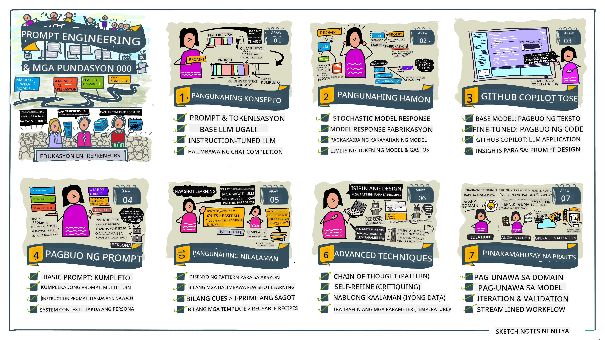
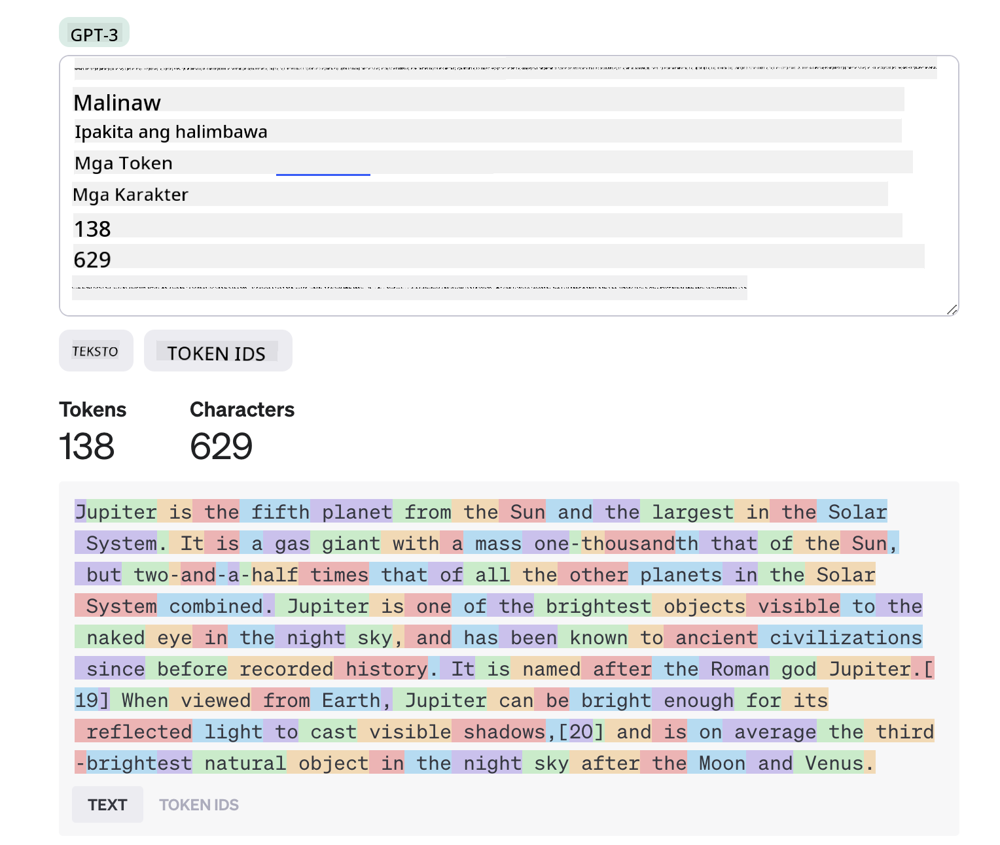
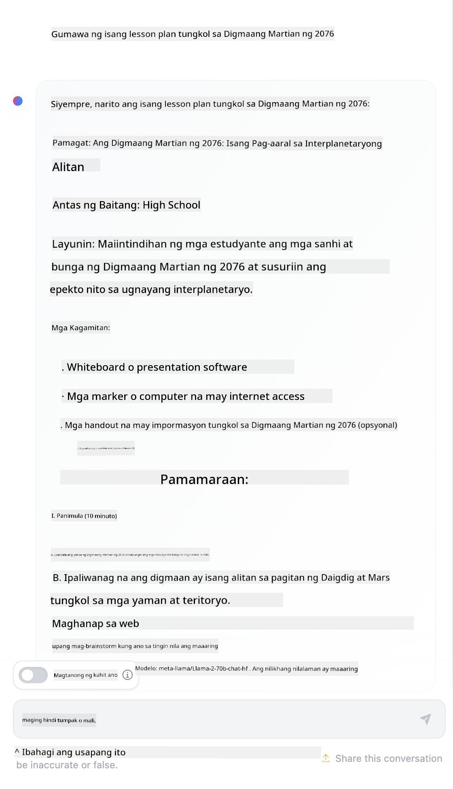

<!--
CO_OP_TRANSLATOR_METADATA:
{
  "original_hash": "a45c318dc6ebc2604f35b8b829f93af2",
  "translation_date": "2025-07-09T10:46:54+00:00",
  "source_file": "04-prompt-engineering-fundamentals/README.md",
  "language_code": "tl"
}
-->
# Prompt Engineering Fundamentals

[](https://aka.ms/gen-ai-lesson4-gh?WT.mc_id=academic-105485-koreyst)

## Panimula  
Saklaw ng modyul na ito ang mahahalagang konsepto at teknik para sa paggawa ng epektibong mga prompt sa mga generative AI na modelo. Mahalaga rin kung paano mo isinusulat ang iyong prompt sa isang LLM. Ang maingat na pagbuo ng prompt ay maaaring maghatid ng mas mataas na kalidad ng tugon. Pero ano nga ba ang ibig sabihin ng mga terminong tulad ng _prompt_ at _prompt engineering_? At paano ko mapapabuti ang prompt _input_ na ipinapadala ko sa LLM? Ito ang mga tanong na susubukan nating sagutin sa kabanatang ito at sa susunod.

Ang _Generative AI_ ay may kakayahang lumikha ng bagong nilalaman (hal., teksto, larawan, audio, code, atbp.) bilang tugon sa mga kahilingan ng gumagamit. Nagagawa ito gamit ang _Large Language Models_ tulad ng serye ng GPT ("Generative Pre-trained Transformer") ng OpenAI na sinanay para gamitin ang natural na wika at code.

Ngayon, maaaring makipag-ugnayan ang mga gumagamit sa mga modelong ito gamit ang mga pamilyar na paraan tulad ng chat, nang hindi kailangan ng teknikal na kaalaman o pagsasanay. Ang mga modelo ay _prompt-based_ — nagpapadala ang mga gumagamit ng text input (prompt) at nakakakuha ng tugon mula sa AI (completion). Maaari silang mag-"chat with the AI" nang paulit-ulit, sa mga multi-turn na pag-uusap, pinapabuti ang kanilang prompt hanggang sa tumugma ang sagot sa kanilang inaasahan.

Ang mga "prompt" ngayon ang pangunahing _programming interface_ para sa mga generative AI na aplikasyon, na nagsasabi sa mga modelo kung ano ang gagawin at nakakaapekto sa kalidad ng mga tugon. Ang "Prompt Engineering" ay isang mabilis na lumalawak na larangan ng pag-aaral na nakatuon sa _disenyo at pag-optimize_ ng mga prompt upang makapaghatid ng pare-pareho at de-kalidad na mga tugon sa malawakang paggamit.

## Mga Layunin sa Pagkatuto

Sa araling ito, matututuhan natin kung ano ang Prompt Engineering, bakit ito mahalaga, at paano tayo makakagawa ng mas epektibong mga prompt para sa isang partikular na modelo at layunin ng aplikasyon. Mauunawaan natin ang mga pangunahing konsepto at pinakamahusay na mga gawi sa prompt engineering — at matututuhan ang tungkol sa isang interactive na Jupyter Notebooks "sandbox" na kapaligiran kung saan makikita natin ang mga konseptong ito na inilalapat sa mga totoong halimbawa.

Sa pagtatapos ng araling ito, magagawa nating:

1. Ipaliwanag kung ano ang prompt engineering at bakit ito mahalaga.  
2. Ilahad ang mga bahagi ng isang prompt at kung paano ito ginagamit.  
3. Matutunan ang mga pinakamahusay na gawi at teknik para sa prompt engineering.  
4. Ipatupad ang mga natutunang teknik sa mga totoong halimbawa, gamit ang OpenAI endpoint.

## Mga Pangunahing Termino

Prompt Engineering: Ang pagsasanay ng pagdisenyo at pag-refine ng mga input upang gabayan ang mga AI model sa paggawa ng nais na output.  
Tokenization: Ang proseso ng paghahati ng teksto sa mas maliliit na yunit, na tinatawag na mga token, na kayang intindihin at iproseso ng modelo.  
Instruction-Tuned LLMs: Mga Large Language Models (LLMs) na na-fine-tune gamit ang mga partikular na instruksyon upang mapabuti ang katumpakan at kaugnayan ng kanilang mga tugon.

## Learning Sandbox

Ang prompt engineering ay kasalukuyang mas sining kaysa agham. Ang pinakamabisang paraan para mapabuti ang ating intuwisyon dito ay ang _mas maraming pagsasanay_ at paggamit ng trial-and-error na pamamaraan na pinagsasama ang kaalaman sa larangan ng aplikasyon at mga inirerekomendang teknik pati na rin ang mga model-specific na pag-optimize.

Ang Jupyter Notebook na kasama ng araling ito ay nagbibigay ng _sandbox_ na kapaligiran kung saan maaari mong subukan ang iyong mga natutunan — habang nagpapatuloy o bilang bahagi ng code challenge sa dulo. Para maisagawa ang mga ehersisyo, kakailanganin mo:

1. **Isang Azure OpenAI API key** — ang service endpoint para sa isang deployed na LLM.  
2. **Isang Python Runtime** — kung saan maaaring patakbuhin ang Notebook.  
3. **Local Env Variables** — _kumpletuhin ang mga hakbang sa [SETUP](./../00-course-setup/SETUP.md?WT.mc_id=academic-105485-koreyst) ngayon para maging handa_.

Ang notebook ay may mga _starter_ na ehersisyo — ngunit hinihikayat kang magdagdag ng sarili mong _Markdown_ (deskripsyon) at _Code_ (mga kahilingan sa prompt) na mga seksyon upang subukan ang mas maraming halimbawa o ideya — at palalimin ang iyong intuwisyon sa disenyo ng prompt.

## Illustrated Guide

Gusto mo bang makita ang kabuuang larawan ng mga tatalakayin sa araling ito bago ka magsimula? Tingnan ang illustrated guide na ito, na nagbibigay sa iyo ng ideya tungkol sa mga pangunahing paksa at mga mahahalagang punto na dapat pag-isipan sa bawat isa. Ang roadmap ng aralin ay magdadala sa iyo mula sa pag-unawa sa mga pangunahing konsepto at hamon hanggang sa pagtugon sa mga ito gamit ang mga kaugnay na teknik at pinakamahusay na gawi sa prompt engineering. Tandaan na ang seksyong "Advanced Techniques" sa gabay na ito ay tumutukoy sa nilalaman na tatalakayin sa _susunod_ na kabanata ng kurikulum na ito.



## Ang Aming Startup

Ngayon, pag-usapan natin kung paano nauugnay ang _paksang ito_ sa misyon ng aming startup na [magdala ng AI innovation sa edukasyon](https://educationblog.microsoft.com/2023/06/collaborating-to-bring-ai-innovation-to-education?WT.mc_id=academic-105485-koreyst). Nais naming bumuo ng mga AI-powered na aplikasyon para sa _personalized learning_ — kaya isipin natin kung paano maaaring "magdisenyo" ng mga prompt ang iba't ibang mga gumagamit ng aming aplikasyon:

- Maaaring hilingin ng mga **Administrator** sa AI na _suriin ang data ng kurikulum upang matukoy ang mga kakulangan sa saklaw_. Maaaring ibuod ng AI ang mga resulta o ipakita ito gamit ang code.  
- Maaaring hilingin ng mga **Guro** sa AI na _gumawa ng lesson plan para sa isang target na audience at paksa_. Maaaring buuin ng AI ang personalized na plano sa isang tinukoy na format.  
- Maaaring hilingin ng mga **Mag-aaral** sa AI na _turuan sila sa isang mahirap na asignatura_. Maaari na ngayong gabayan ng AI ang mga mag-aaral gamit ang mga leksyon, mga pahiwatig, at mga halimbawa na angkop sa kanilang antas.

Iyan ay ilan lamang sa mga posibilidad. Tingnan ang [Prompts For Education](https://github.com/microsoft/prompts-for-edu/tree/main?WT.mc_id=academic-105485-koreyst) — isang open-source na library ng mga prompt na inihanda ng mga eksperto sa edukasyon — para makita ang mas malawak na mga posibilidad! _Subukan mong patakbuhin ang ilan sa mga prompt na iyon sa sandbox o gamitin ang OpenAI Playground para makita kung ano ang mangyayari!_

<!--  
LESSON TEMPLATE:  
This unit should cover core concept #1.  
Reinforce the concept with examples and references.

CONCEPT #1:  
Prompt Engineering.  
Define it and explain why it is needed.  
-->

## Ano ang Prompt Engineering?

Sinimulan natin ang araling ito sa pamamagitan ng pagdeklara ng **Prompt Engineering** bilang proseso ng _pagdidisenyo at pag-optimize_ ng mga text input (prompt) upang makapaghatid ng pare-pareho at de-kalidad na mga tugon (completions) para sa isang partikular na layunin ng aplikasyon at modelo. Maaari natin itong isipin bilang isang 2-hakbang na proseso:

- _pagdidisenyo_ ng paunang prompt para sa isang partikular na modelo at layunin  
- _paulit-ulit na pag-refine_ ng prompt upang mapabuti ang kalidad ng tugon

Ito ay isang trial-and-error na proseso na nangangailangan ng intuwisyon at pagsisikap ng gumagamit upang makamit ang pinakamainam na resulta. Bakit ito mahalaga? Upang masagot iyon, kailangan muna nating maunawaan ang tatlong konsepto:

- _Tokenization_ = kung paano "nakikita" ng modelo ang prompt  
- _Base LLMs_ = kung paano "pinoproseso" ng pundasyong modelo ang prompt  
- _Instruction-Tuned LLMs_ = kung paano na ngayong nakikita ng modelo ang mga "gawain"

### Tokenization

Tinitingnan ng isang LLM ang mga prompt bilang isang _sunod-sunod na mga token_ kung saan maaaring magkaiba ang paraan ng pag-tokenize ng parehong prompt depende sa modelo (o bersyon ng modelo). Dahil ang mga LLM ay sinanay gamit ang mga token (hindi raw na teksto), ang paraan ng pag-tokenize ng mga prompt ay direktang nakakaapekto sa kalidad ng nalikhang tugon.

Para magkaroon ng intuwisyon kung paano gumagana ang tokenization, subukan ang mga tool tulad ng [OpenAI Tokenizer](https://platform.openai.com/tokenizer?WT.mc_id=academic-105485-koreyst) na ipinapakita sa ibaba. Kopyahin ang iyong prompt — at tingnan kung paano ito na-convert sa mga token, pansinin kung paano hinahandle ang mga whitespace at mga bantas. Tandaan na ang halimbawang ito ay nagpapakita ng mas lumang LLM (GPT-3) — kaya maaaring magkaiba ang resulta kapag sinubukan ito sa mas bagong modelo.



### Konsepto: Foundation Models

Kapag na-tokenize na ang prompt, ang pangunahing tungkulin ng ["Base LLM"](https://blog.gopenai.com/an-introduction-to-base-and-instruction-tuned-large-language-models-8de102c785a6?WT.mc_id=academic-105485-koreyst) (o Foundation model) ay hulaan ang susunod na token sa sunod-sunod na iyon. Dahil ang mga LLM ay sinanay gamit ang malalaking dataset ng teksto, may mahusay silang pakiramdam sa estadistikal na ugnayan ng mga token at kaya nilang gawin ang hulang iyon nang may kumpiyansa. Tandaan na hindi nila nauunawaan ang _kahulugan_ ng mga salita sa prompt o token; nakikita lang nila ang pattern na maaari nilang "kumpletuhin" gamit ang kanilang susunod na hula. Maaari nilang ipagpatuloy ang paghula ng sunod-sunod hanggang ito ay itigil ng gumagamit o ng isang itinakdang kondisyon.

Gusto mo bang makita kung paano gumagana ang prompt-based completion? Ipasok ang prompt sa itaas sa Azure OpenAI Studio [_Chat Playground_](https://oai.azure.com/playground?WT.mc_id=academic-105485-koreyst) gamit ang default na mga setting. Nakakonpigurang ituring ang mga prompt bilang mga kahilingan para sa impormasyon — kaya makakakita ka ng tugon na tumutugon sa kontekstong ito.

Pero paano kung gusto ng gumagamit na makita ang isang partikular na bagay na tumutugon sa ilang pamantayan o layunin ng gawain? Dito pumapasok ang mga _instruction-tuned_ LLM.


### Konsepto: Instruction Tuned LLMs

Ang isang [Instruction Tuned LLM](https://blog.gopenai.com/an-introduction-to-base-and-instruction-tuned-large-language-models-8de102c785a6?WT.mc_id=academic-105485-koreyst) ay nagsisimula sa foundation model at ini-fine-tune ito gamit ang mga halimbawa o input/output na pares (hal., multi-turn na "mga mensahe") na maaaring maglaman ng malinaw na mga instruksyon — at sinusubukan ng tugon mula sa AI na sundin ang instruksyong iyon.

Gumagamit ito ng mga teknik tulad ng Reinforcement Learning with Human Feedback (RLHF) na nagtuturo sa modelo na _sundin ang mga instruksyon_ at _matuto mula sa feedback_ upang makagawa ng mga tugon na mas angkop sa praktikal na aplikasyon at mas kaugnay sa mga layunin ng gumagamit.

Subukan natin ito — balikan ang prompt sa itaas, ngunit palitan ang _system message_ upang magbigay ng sumusunod na instruksyon bilang konteksto:

> _Ibuod ang nilalaman na ibinigay para sa isang mag-aaral sa ikalawang baitang. Panatilihin ang resulta sa isang talata na may 3-5 na bullet points._

Makikita mo kung paano naitugma ang resulta upang ipakita ang nais na layunin at format? Maaari nang direktang gamitin ng isang guro ang tugon na ito sa kanilang mga slide para sa klase.


## Bakit Kailangan ang Prompt Engineering?

Ngayon na alam na natin kung paano pinoproseso ng mga LLM ang mga prompt, pag-usapan natin kung _bakit_ kailangan ang prompt engineering. Nasa katotohanan na ang kasalukuyang mga LLM ay may ilang mga hamon na nagpapahirap upang makamit ang _maaasahan at pare-parehong mga tugon_ nang hindi naglalagay ng pagsisikap sa pagbuo at pag-optimize ng prompt. Halimbawa:

1. **Stochastic ang mga tugon ng modelo.** Ang _parehong prompt_ ay malamang na magbigay ng iba't ibang mga tugon sa iba't ibang mga modelo o bersyon ng modelo. At maaari rin itong magbigay ng iba't ibang resulta sa _parehong modelo_ sa iba't ibang oras. _Makakatulong ang mga teknik sa prompt engineering upang mabawasan ang mga pagkakaibang ito sa pamamagitan ng pagbibigay ng mas mahusay na mga guardrails_.

2. **Maaaring gumawa ng mga imbentong tugon ang mga modelo.** Ang mga modelo ay pre-trained gamit ang _malalaki ngunit limitadong_ dataset, ibig sabihin kulang sila sa kaalaman tungkol sa mga konsepto na wala sa saklaw ng pagsasanay. Bilang resulta, maaari silang gumawa ng mga tugon na hindi tama, haka-haka, o direktang salungat sa mga kilalang katotohanan. _Tinutulungan ng mga teknik sa prompt engineering ang mga gumagamit na tuklasin at mabawasan ang ganitong mga imbento, hal., sa pamamagitan ng paghingi ng mga citation o paliwanag mula sa AI_.

3. **Nagkakaiba-iba ang kakayahan ng mga modelo.** Ang mga mas bagong modelo o henerasyon ng modelo ay may mas malawak na kakayahan ngunit may mga natatanging kakaibang katangian at mga tradeoff sa gastos at komplikasyon. _Makakatulong ang prompt engineering na makabuo ng mga pinakamahusay na gawi at workflow na nag-aalis ng mga pagkakaiba at umaangkop sa mga partikular na pangangailangan ng modelo sa scalable at seamless na paraan_.

Subukan natin ito sa OpenAI o Azure OpenAI Playground:

- Gamitin ang parehong prompt sa iba't ibang deployment ng LLM (hal., OpenAI, Azure OpenAI, Hugging Face) — nakita mo ba ang mga pagkakaiba?  
- Gamitin ang parehong prompt nang paulit-ulit sa _parehong_ deployment ng LLM (hal., Azure OpenAI playground) — paano nagkaiba ang mga resulta?

### Halimbawa ng Fabrications

Sa kursong ito, ginagamit natin ang terminong **"fabrication"** upang tukuyin ang pangyayari kung saan minsan ay gumagawa ang mga LLM ng impormasyong mali ang katotohanan dahil sa mga limitasyon sa kanilang pagsasanay o iba pang mga hadlang. Maaari mo ring narinig ito bilang _"hallucinations"_ sa mga popular na artikulo o mga papel sa pananaliksik. Gayunpaman, mariin naming inirerekomenda ang paggamit ng _"fabrication"_ bilang termino upang hindi natin aksidenteng bigyan ng katangiang pantao ang kilos na ito sa pamamagitan ng pag-aangkin ng katangian ng tao sa isang resulta na gawa ng makina. Pinapalakas din nito ang mga [Responsible AI guidelines](https://www.microsoft.com/ai/responsible-ai?WT.mc_id=academic-105485-koreyst) mula sa perspektibo ng terminolohiya, na inaalis ang mga salitang maaaring ituring na nakakasakit o hindi inklusibo sa ilang konteksto.

Gusto mo bang makita kung paano gumagana ang fabrications? Isipin ang isang prompt na nag-uutos sa AI na gumawa ng nilalaman para sa isang paksa na hindi umiiral (upang matiyak na wala ito sa dataset ng pagsasanay). Halimbawa — sinubukan ko ang prompt na ito:
# Plano ng Aralin: Ang Digmaang Martian ng 2076

## Layunin ng Aralin
- Maunawaan ang mga pangunahing sanhi at kaganapan ng Digmaang Martian ng 2076.
- Masuri ang epekto ng digmaan sa lipunan at teknolohiya.
- Makabuo ng sariling opinyon tungkol sa mga aral na maaaring matutunan mula sa digmaan.

## Panimula (10 minuto)
- Magpakita ng maikling video o larawan tungkol sa Martian War.
- Magtanong sa mga mag-aaral: Ano ang alam ninyo tungkol sa Digmaang Martian ng 2076?
- Ibigay ang maikling background ng digmaan.

## Paglalahad (20 minuto)
- Talakayin ang mga pangunahing sanhi ng digmaan:
  - Kompetisyon sa mga likas na yaman sa Mars.
  - Pag-aagawan sa teritoryo at kontrol.
- Ilarawan ang mga mahahalagang pangyayari:
  - Simula ng labanan.
  - Mga pangunahing labanan at estratehiya.
  - Pagtatapos ng digmaan.
- Ipakita ang mga teknolohiyang ginamit sa digmaan.

## Pagsasanay (15 minuto)
- Hatiin ang klase sa maliliit na grupo.
- Bawat grupo ay gagawa ng maikling presentasyon tungkol sa isang aspeto ng digmaan (halimbawa: sanhi, kaganapan, epekto).
- Magbigay ng mga tanong upang gabayan ang kanilang presentasyon.

## Paglalapat (10 minuto)
- Talakayin kung paano nakaapekto ang digmaan sa kasalukuyang teknolohiya at lipunan.
- Magbigay ng halimbawa ng mga aral na maaaring matutunan mula sa digmaan.

## Pagsusuri (5 minuto)
- Magbigay ng maikling pagsusulit o reflection paper tungkol sa natutunan sa aralin.

## Takdang-Aralin
- Sumulat ng sanaysay tungkol sa kung paano maiiwasan ang mga ganitong uri ng digmaan sa hinaharap.
Ipinakita ng isang web search na may mga kathang-isip na kwento (hal., serye sa telebisyon o mga libro) tungkol sa mga digmaan sa Mars – ngunit wala sa 2076. Sinasabi rin ng katwiran na ang 2076 ay _sa hinaharap_ kaya hindi ito maaaring iugnay sa isang totoong pangyayari.

Ano kaya ang mangyayari kapag pinatakbo natin ang prompt na ito gamit ang iba't ibang LLM providers?

> **Response 1**: OpenAI Playground (GPT-35)


> **Response 2**: Azure OpenAI Playground (GPT-35)


> **Response 3**: : Hugging Face Chat Playground (LLama-2)



Gaya ng inaasahan, bawat modelo (o bersyon ng modelo) ay nagbibigay ng bahagyang magkakaibang mga sagot dahil sa stochastic na pag-uugali at pagkakaiba-iba sa kakayahan ng modelo. Halimbawa, ang isang modelo ay nakatuon sa mga mag-aaral sa ika-8 baitang habang ang isa naman ay inaasahan ang isang estudyante sa high school. Ngunit lahat ng tatlong modelo ay nakabuo ng mga sagot na maaaring makumbinsi ang isang hindi pamilyar na gumagamit na ang pangyayari ay totoo.

Ang mga teknik sa prompt engineering tulad ng _metaprompting_ at _temperature configuration_ ay maaaring makatulong na mabawasan ang mga peke ng modelo sa ilang antas. Ang mga bagong _arkitektura_ ng prompt engineering ay nagsasama rin ng mga bagong kasangkapan at teknik nang maayos sa daloy ng prompt, upang mapagaan o mabawasan ang ilan sa mga epekto nito.

## Case Study: GitHub Copilot

Tapusin natin ang seksyong ito sa pamamagitan ng pagkuha ng ideya kung paano ginagamit ang prompt engineering sa mga totoong solusyon sa pamamagitan ng pagtingin sa isang Case Study: [GitHub Copilot](https://github.com/features/copilot?WT.mc_id=academic-105485-koreyst).

Ang GitHub Copilot ay ang iyong "AI Pair Programmer" – ito ay nagko-convert ng mga text prompt sa mga kumpletong code at naka-integrate sa iyong development environment (hal., Visual Studio Code) para sa isang tuloy-tuloy na karanasan ng gumagamit. Ayon sa mga dokumento sa serye ng mga blog sa ibaba, ang pinakaunang bersyon ay nakabase sa OpenAI Codex model – kung saan mabilis na napagtanto ng mga engineer ang pangangailangang i-fine-tune ang modelo at bumuo ng mas mahusay na mga teknik sa prompt engineering upang mapabuti ang kalidad ng code. Noong Hulyo, kanilang [ipinakilala ang isang pinahusay na AI model na lampas sa Codex](https://github.blog/2023-07-28-smarter-more-efficient-coding-github-copilot-goes-beyond-codex-with-improved-ai-model/?WT.mc_id=academic-105485-koreyst) para sa mas mabilis na mga suhestiyon.

Basahin ang mga post nang sunod-sunod upang masundan ang kanilang paglalakbay sa pagkatuto.

- **Mayo 2023** | [Mas Pinagaganda ng GitHub Copilot ang Pag-unawa sa Iyong Code](https://github.blog/2023-05-17-how-github-copilot-is-getting-better-at-understanding-your-code/?WT.mc_id=academic-105485-koreyst)
- **Mayo 2023** | [Sa Loob ng GitHub: Paggawa kasama ang mga LLM sa likod ng GitHub Copilot](https://github.blog/2023-05-17-inside-github-working-with-the-llms-behind-github-copilot/?WT.mc_id=academic-105485-koreyst)
- **Hunyo 2023** | [Paano Sumulat ng Mas Magandang Prompts para sa GitHub Copilot](https://github.blog/2023-06-20-how-to-write-better-prompts-for-github-copilot/?WT.mc_id=academic-105485-koreyst)
- **Hulyo 2023** | [.. GitHub Copilot lampas sa Codex gamit ang pinahusay na AI model](https://github.blog/2023-07-28-smarter-more-efficient-coding-github-copilot-goes-beyond-codex-with-improved-ai-model/?WT.mc_id=academic-105485-koreyst)
- **Hulyo 2023** | [Gabay ng Developer sa Prompt Engineering at LLMs](https://github.blog/2023-07-17-prompt-engineering-guide-generative-ai-llms/?WT.mc_id=academic-105485-koreyst)
- **Setyembre 2023** | [Paano Gumawa ng Enterprise LLM App: Mga Aral mula sa GitHub Copilot](https://github.blog/2023-09-06-how-to-build-an-enterprise-llm-application-lessons-from-github-copilot/?WT.mc_id=academic-105485-koreyst)

Maaari mo ring bisitahin ang kanilang [Engineering blog](https://github.blog/category/engineering/?WT.mc_id=academic-105485-koreyst) para sa iba pang mga post tulad ng [ito](https://github.blog/2023-09-27-how-i-used-github-copilot-chat-to-build-a-reactjs-gallery-prototype/?WT.mc_id=academic-105485-koreyst) na nagpapakita kung paano _inaaplay_ ang mga modelong ito at teknik para sa pagpapatakbo ng mga totoong aplikasyon.

---

<!--
LESSON TEMPLATE:
This unit should cover core concept #2.
Reinforce the concept with examples and references.

CONCEPT #2:
Prompt Design.
Illustrated with examples.
-->

## Prompt Construction

Nakita na natin kung bakit mahalaga ang prompt engineering – ngayon alamin natin kung paano _binubuo_ ang mga prompt upang masuri natin ang iba't ibang teknik para sa mas epektibong disenyo ng prompt.

### Basic Prompt

Magsimula tayo sa basic prompt: isang text input na ipinapadala sa modelo nang walang ibang konteksto. Narito ang isang halimbawa – kapag ipinadala natin ang unang ilang salita ng pambansang awit ng US sa OpenAI [Completion API](https://platform.openai.com/docs/api-reference/completions?WT.mc_id=academic-105485-koreyst), agad nitong _kinukumpleto_ ang sagot gamit ang mga susunod na linya, na nagpapakita ng pangunahing pag-uugali ng prediksyon.

| Prompt (Input)     | Completion (Output)                                                                                                                        |
| :----------------- | :----------------------------------------------------------------------------------------------------------------------------------------- |
| Oh say can you see | Mukhang sinisimulan mo ang mga liriko ng "The Star-Spangled Banner," ang pambansang awit ng Estados Unidos. Ang buong liriko ay ... |

### Complex Prompt

Ngayon, magdagdag tayo ng konteksto at mga tagubilin sa basic prompt na iyon. Pinapayagan tayo ng [Chat Completion API](https://learn.microsoft.com/azure/ai-services/openai/how-to/chatgpt?WT.mc_id=academic-105485-koreyst) na bumuo ng isang complex prompt bilang koleksyon ng mga _mensaheng_ may:

- Mga pares ng input/output na nagpapakita ng input ng _user_ at tugon ng _assistant_.
- Mensahe ng system na nagtatakda ng konteksto para sa pag-uugali o personalidad ng assistant.

Ang kahilingan ay nasa anyo sa ibaba, kung saan ang _tokenization_ ay epektibong kumukuha ng mga mahalagang impormasyon mula sa konteksto at pag-uusap. Ngayon, ang pagbabago ng konteksto ng system ay maaaring kasing epekto sa kalidad ng mga kumpletong sagot gaya ng mga input na ibinigay ng user.

```python
response = openai.chat.completions.create(
    model="gpt-3.5-turbo",
    messages=[
        {"role": "system", "content": "You are a helpful assistant."},
        {"role": "user", "content": "Who won the world series in 2020?"},
        {"role": "assistant", "content": "The Los Angeles Dodgers won the World Series in 2020."},
        {"role": "user", "content": "Where was it played?"}
    ]
)
```

### Instruction Prompt

Sa mga halimbawa sa itaas, ang prompt ng user ay isang simpleng text query na maaaring ipakahulugan bilang kahilingan para sa impormasyon. Sa mga _instruction_ prompt, maaari nating gamitin ang text na iyon upang tukuyin ang isang gawain nang mas detalyado, na nagbibigay ng mas mahusay na gabay sa AI. Narito ang isang halimbawa:

| Prompt (Input)                                                                                                                                                                                                                         | Completion (Output)                                                                                                        | Instruction Type    |
| :------------------------------------------------------------------------------------------------------------------------------------------------------------------------------------------------------------------------------------- | :------------------------------------------------------------------------------------------------------------------------- | :------------------ |
| Write a description of the Civil War                                                                                                                                                                                                   | _nagbalik ng isang simpleng talata_                                                                                         | Simple              |
| Write a description of the Civil War. Provide key dates and events and describe their significance                                                                                                                                     | _nagbalik ng isang talata na sinundan ng listahan ng mga mahahalagang petsa ng pangyayari na may mga paglalarawan_          | Complex             |
| Write a description of the Civil War in 1 paragraph. Provide 3 bullet points with key dates and their significance. Provide 3 more bullet points with key historical figures and their contributions. Return the output as a JSON file | _nagbabalik ng mas detalyadong impormasyon sa isang text box, naka-format bilang JSON na maaari mong kopyahin at i-paste sa file at i-validate kung kinakailangan_ | Complex. Formatted. |

## Primary Content

Sa mga halimbawa sa itaas, ang prompt ay medyo bukas pa rin, na nagpapahintulot sa LLM na piliin kung aling bahagi ng pre-trained dataset nito ang may kaugnayan. Sa disenyo ng _primary content_, hinahati ang input text sa dalawang bahagi:

- isang tagubilin (gawain)
- kaugnay na nilalaman (na nakakaapekto sa gawain)

Narito ang isang halimbawa kung saan ang tagubilin ay "buodin ito sa 2 pangungusap".

| Prompt (Input)                                                                                                                                                                                                                                                                                                                                                                                                                                                                                                                                                                                                                                                                                      | Completion (Output)                                                                                                                                                                                                                                                                             |
| :-------------------------------------------------------------------------------------------------------------------------------------------------------------------------------------------------------------------------------------------------------------------------------------------------------------------------------------------------------------------------------------------------------------------------------------------------------------------------------------------------------------------------------------------------------------------------------------------------------------------------------------------------------------------------------------------------- | :---------------------------------------------------------------------------------------------------------------------------------------------------------------------------------------------------------------------------------------------------------------------------------------------- |
| Jupiter ay ang ikalimang planeta mula sa Araw at ang pinakamalaki sa Solar System. Isa itong gas giant na may masa na isang libong bahagi ng masa ng Araw, ngunit dalawang-kalahati beses ng lahat ng iba pang mga planeta sa Solar System na pinagsama-sama. Ang Jupiter ay isa sa mga pinakamaliwanag na bagay na nakikita ng hubad na mata sa gabi, at kilala na mula pa sa mga sinaunang sibilisasyon bago pa man naitala ang kasaysayan. Pinangalanan ito sa diyos na Romano na si Jupiter.[19] Kapag tinitingnan mula sa Earth, ang Jupiter ay maaaring maging sapat na maliwanag upang ang kanyang naipinid na liwanag ay makabuo ng mga anino na nakikita,[20] at karaniwan itong pangatlong pinakamaliwanag na natural na bagay sa gabi pagkatapos ng Buwan at Venus. <br/> **Buodin ito sa 2 maiikling pangungusap** | Ang Jupiter, ang ikalimang planeta mula sa Araw, ay ang pinakamalaki sa Solar System at kilala bilang isa sa mga pinakamaliwanag na bagay sa gabi. Pinangalanan ito sa diyos na Romano na si Jupiter, isang gas giant na may masa na dalawang-kalahati beses ng lahat ng ibang mga planeta sa Solar System na pinagsama-sama. |

Maaaring gamitin ang bahagi ng primary content sa iba't ibang paraan upang maghatid ng mas epektibong mga tagubilin:

- **Mga Halimbawa** – sa halip na sabihin sa modelo kung ano ang gagawin gamit ang isang tahasang tagubilin, bigyan ito ng mga halimbawa ng gagawin at hayaang mahinuha nito ang pattern.
- **Mga Cue** – sundan ang tagubilin ng isang "cue" na naghahanda sa completion, na ginagabayan ang modelo patungo sa mas kaugnay na mga sagot.
- **Mga Template** – ito ay mga paulit-ulit na 'recipe' para sa mga prompt na may mga placeholder (mga variable) na maaaring i-customize gamit ang data para sa mga partikular na gamit.

Tuklasin natin ang mga ito sa aksyon.

### Paggamit ng Mga Halimbawa

Ito ay isang paraan kung saan ginagamit mo ang primary content upang "pakainin ang modelo" ng ilang mga halimbawa ng nais na output para sa isang partikular na tagubilin, at hayaang mahinuha nito ang pattern para sa nais na output. Batay sa dami ng mga halimbawa, maaari tayong magkaroon ng zero-shot prompting, one-shot prompting, few-shot prompting, atbp.

Ang prompt ay binubuo ngayon ng tatlong bahagi:

- Isang paglalarawan ng gawain
- Ilang mga halimbawa ng nais na output
- Simula ng isang bagong halimbawa (na nagiging implicit na paglalarawan ng gawain)

| Learning Type | Prompt (Input)                                                                                                                                        | Completion (Output)         |
| :------------ | :---------------------------------------------------------------------------------------------------------------------------------------------------- | :-------------------------- |
| Zero-shot     | "The Sun is Shining". Isalin sa Spanish                                                                                                             | "El Sol está brillando".    |
| One-shot      | "The Sun is Shining" => "El Sol está brillando". <br> "It's a Cold and Windy Day" =>                                                                 | "Es un día frío y ventoso". |
| Few-shot      | The player ran the bases => Baseball <br/> The player hit an ace => Tennis <br/> The player hit a six => Cricket <br/> The player made a slam-dunk => | Basketball                  |
|               |                                                                                                                                                       |                             |

Pansinin kung paano kailangan nating magbigay ng tahasang tagubilin ("Isalin sa Spanish") sa zero-shot prompting, ngunit nahinuha na ito sa one-shot prompting na halimbawa. Ipinapakita ng few-shot na halimbawa kung paano ang pagdagdag ng mas maraming halimbawa ay nagpapahintulot sa mga modelo na gumawa ng mas tumpak na mga hinuha nang walang dagdag na mga tagubilin.

### Prompt Cues

Isa pang teknik sa paggamit ng primary content ay ang pagbibigay ng _cues_ sa halip na mga halimbawa. Sa kasong ito, binibigyan natin ang modelo ng isang paunang pahiwatig sa tamang direksyon sa pamamagitan ng _pagsisimula_ nito gamit ang isang snippet na nagpapakita ng nais na format ng sagot. Ang modelo ay "kinukuha ang cue" upang ipagpatuloy sa ganoong paraan.

| Number of Cues | Prompt (Input)                                                                                                                                                                                                                                                                                                                                                                                                                                               | Completion (Output)                                                                                                                                                                                                                                                                                       |
| :------------- | :----------------------------------------------------------------------------------------------------------------------------------------------------------------------------------------------------------------------------------------------------------------------------------------------------------------------------------------------------------------------------------------------------------------------------------------------------------- | :-------------------------------------------------------------------------------------------------------------------------------------------------------------------------------------------------------------------------------------------------------------------------------------------------------- |
| 0              | Jupiter ay ang ikalimang planeta mula sa Araw at ang pinakamalaki sa Solar System. Isa itong gas giant na may masa na isang libong bahagi ng masa ng Araw, ngunit dalawang-kalahati beses ng lahat ng iba pang mga planeta sa Solar System na pinagsama-sama. Ang Jupiter ay isa sa mga pinakamaliwanag na bagay na nakikita ng hubad na mata sa gabi, at kilala na mula pa sa mga sinaunang sibilisasyon bago pa man naitala ang kasaysayan.

**Summarize This**                                       | Ang Jupiter ang pinakamalaking planeta sa ating Solar System at ang ikalimang planeta mula sa Araw. Isa itong gas giant na may massang 1/1000 ng mass ng Araw, ngunit mas mabigat ito kaysa sa lahat ng ibang planeta na pinagsama-sama. Matagal nang kilala ang Jupiter ng mga sinaunang sibilisasyon, at madali itong makita sa kalangitan tuwing gabi. |
| 1              | Ang Jupiter ang ikalimang planeta mula sa Araw at ang pinakamalaki sa Solar System. Isa itong gas giant na may massang isang libong bahagi ng mass ng Araw, ngunit dalawang at kalahating beses na mas mabigat kaysa sa lahat ng ibang planeta sa Solar System na pinagsama-sama. Ang Jupiter ay isa sa mga pinakamaliwanag na bagay na nakikita ng hubad na mata sa kalangitan tuwing gabi, at kilala na ito ng mga sinaunang sibilisasyon bago pa man naitala ang kasaysayan. <br/>**Summarize This** <br/> Ang natutunan natin ay na ang Jupiter | ang ikalimang planeta mula sa Araw at ang pinakamalaki sa Solar System. Isa itong gas giant na may massang isang libong bahagi ng mass ng Araw, ngunit dalawang at kalahating beses na mas mabigat kaysa sa lahat ng ibang planeta na pinagsama-sama. Madali itong makita ng hubad na mata at kilala na mula pa noong sinaunang panahon.                        |
| 2              | Ang Jupiter ang ikalimang planeta mula sa Araw at ang pinakamalaki sa Solar System. Isa itong gas giant na may massang isang libong bahagi ng mass ng Araw, ngunit dalawang at kalahating beses na mas mabigat kaysa sa lahat ng ibang planeta sa Solar System na pinagsama-sama. Ang Jupiter ay isa sa mga pinakamaliwanag na bagay na nakikita ng hubad na mata sa kalangitan tuwing gabi, at kilala na ito ng mga sinaunang sibilisasyon bago pa man naitala ang kasaysayan. <br/>**Summarize This** <br/> Nangungunang 3 Katotohanan na Natutunan Natin:         | 1. Ang Jupiter ang ikalimang planeta mula sa Araw at ang pinakamalaki sa Solar System. <br/> 2. Isa itong gas giant na may massang isang libong bahagi ng mass ng Araw...<br/> 3. Ang Jupiter ay nakikita ng hubad na mata mula pa noong sinaunang panahon ...                                                                       |
|                |                                                                                                                                                                                                                                                                                                                                                                                                                                                              |                                                                                                                                                                                                                                                                                                           |

### Prompt Templates

Ang prompt template ay isang _paunang nakahandang recipe para sa isang prompt_ na maaaring itago at gamitin muli kung kinakailangan, upang makapaghatid ng mas pare-parehong karanasan sa mga gumagamit sa malawakang saklaw. Sa pinakasimpleng anyo, ito ay koleksyon lamang ng mga halimbawa ng prompt tulad ng [ito mula sa OpenAI](https://platform.openai.com/examples?WT.mc_id=academic-105485-koreyst) na nagbibigay ng parehong mga bahagi ng interactive prompt (mga mensahe ng user at system) at ang format ng API-driven na kahilingan - upang suportahan ang muling paggamit.

Sa mas kumplikadong anyo nito tulad ng [halimbawa mula sa LangChain](https://python.langchain.com/docs/concepts/prompt_templates/?WT.mc_id=academic-105485-koreyst) naglalaman ito ng _mga placeholder_ na maaaring palitan ng data mula sa iba't ibang pinagmulan (input ng user, konteksto ng system, panlabas na mga pinagkukunan ng data, atbp.) upang makabuo ng prompt nang dinamiko. Pinapayagan tayo nitong gumawa ng isang librarya ng mga reusable na prompt na maaaring gamitin upang maghatid ng pare-parehong karanasan ng user **programmatically** sa malawakang saklaw.

Sa huli, ang tunay na halaga ng mga template ay nasa kakayahang lumikha at maglathala ng _prompt libraries_ para sa mga vertical application domain - kung saan ang prompt template ay _na-optimize_ upang ipakita ang konteksto o mga halimbawa na partikular sa aplikasyon na nagpapaganda ng kaugnayan at katumpakan ng mga sagot para sa target na user audience. Ang [Prompts For Edu](https://github.com/microsoft/prompts-for-edu?WT.mc_id=academic-105485-koreyst) repository ay isang mahusay na halimbawa ng ganitong pamamaraan, na nagtitipon ng librarya ng mga prompt para sa larangan ng edukasyon na may diin sa mga pangunahing layunin tulad ng pagpaplano ng aralin, disenyo ng kurikulum, pagtuturo sa mga estudyante, atbp.

## Supporting Content

Kung iisipin natin ang paggawa ng prompt bilang pagkakaroon ng isang instruction (gawain) at isang target (pangunahing nilalaman), ang _sekondaryang nilalaman_ ay parang karagdagang konteksto na ibinibigay natin upang **maimpluwensyahan ang output sa isang paraan**. Maaari itong mga tuning parameter, mga tagubilin sa pag-format, mga taxonomy ng paksa, atbp. na makakatulong sa modelo na _iangkop_ ang tugon nito upang umayon sa nais na layunin o inaasahan ng user.

Halimbawa: Kung mayroong katalogo ng kurso na may malawak na metadata (pangalan, paglalarawan, antas, mga tag ng metadata, instruktor, atbp.) sa lahat ng magagamit na kurso sa kurikulum:

- maaari tayong magtakda ng instruction na "buodin ang katalogo ng kurso para sa Fall 2023"
- maaari nating gamitin ang pangunahing nilalaman upang magbigay ng ilang halimbawa ng nais na output
- maaari nating gamitin ang sekondaryang nilalaman upang tukuyin ang nangungunang 5 "tag" na interesado.

Ngayon, maaaring magbigay ang modelo ng buod sa format na ipinakita ng ilang halimbawa - ngunit kung ang resulta ay may maraming tag, maaari nitong unahin ang 5 tag na tinukoy sa sekondaryang nilalaman.

---

<!--
LESSON TEMPLATE:
Ang yunit na ito ay dapat sumaklaw sa pangunahing konsepto #1.
Palakasin ang konsepto gamit ang mga halimbawa at sanggunian.

KONSEPTO #3:
Mga Teknik sa Prompt Engineering.
Ano ang ilang mga pangunahing teknik para sa prompt engineering?
Ilarawan ito gamit ang ilang mga pagsasanay.
-->

## Prompting Best Practices

Ngayon na alam na natin kung paano maaaring _buoin_ ang mga prompt, maaari na nating simulan ang pag-iisip kung paano ito _idisenyo_ upang ipakita ang mga pinakamahusay na kasanayan. Maaari nating pag-isipan ito sa dalawang bahagi - pagkakaroon ng tamang _mindset_ at paggamit ng tamang _mga teknik_.

### Prompt Engineering Mindset

Ang Prompt Engineering ay isang proseso ng trial-and-error kaya tandaan ang tatlong malawak na gabay na salik:

1. **Mahalaga ang Pag-unawa sa Domain.** Ang katumpakan at kaugnayan ng tugon ay nakadepende sa _domain_ kung saan gumagana ang aplikasyon o user. Gamitin ang iyong intuwisyon at kaalaman sa domain upang **i-customize pa ang mga teknik**. Halimbawa, magtakda ng _domain-specific personalities_ sa iyong mga system prompt, o gumamit ng _domain-specific templates_ sa iyong mga user prompt. Magbigay ng sekondaryang nilalaman na nagpapakita ng konteksto na partikular sa domain, o gumamit ng _domain-specific cues at mga halimbawa_ upang gabayan ang modelo patungo sa pamilyar na mga pattern ng paggamit.

2. **Mahalaga ang Pag-unawa sa Modelo.** Alam natin na ang mga modelo ay stochastic sa kanilang kalikasan. Ngunit ang mga implementasyon ng modelo ay maaaring magkaiba rin depende sa dataset na ginamit sa pagsasanay (pre-trained knowledge), mga kakayahan na ibinibigay nila (hal., sa pamamagitan ng API o SDK) at ang uri ng nilalaman na kanilang na-optimize (hal., code vs. mga larawan vs. teksto). Unawain ang mga kalakasan at limitasyon ng modelong ginagamit mo, at gamitin ang kaalamang iyon upang _unahin ang mga gawain_ o bumuo ng _customized templates_ na na-optimize para sa kakayahan ng modelo.

3. **Mahalaga ang Iteration at Validation.** Ang mga modelo ay mabilis na umuunlad, gayundin ang mga teknik para sa prompt engineering. Bilang isang eksperto sa domain, maaaring mayroon kang ibang konteksto o pamantayan para sa _iyong_ partikular na aplikasyon, na maaaring hindi naaangkop sa mas malawak na komunidad. Gamitin ang mga tool at teknik sa prompt engineering upang "simulan" ang paggawa ng prompt, pagkatapos ay ulitin at suriin ang mga resulta gamit ang iyong sariling intuwisyon at kaalaman sa domain. Itala ang iyong mga natuklasan at lumikha ng isang **knowledge base** (hal., mga prompt library) na maaaring gamitin bilang bagong baseline ng iba, para sa mas mabilis na mga iteration sa hinaharap.

## Best Practices

Ngayon tingnan natin ang mga karaniwang pinakamahusay na kasanayan na inirerekomenda ng [OpenAI](https://help.openai.com/en/articles/6654000-best-practices-for-prompt-engineering-with-openai-api?WT.mc_id=academic-105485-koreyst) at [Azure OpenAI](https://learn.microsoft.com/azure/ai-services/openai/concepts/prompt-engineering#best-practices?WT.mc_id=academic-105485-koreyst) na mga practitioner.

| Ano                              | Bakit                                                                                                                                                                                                                                               |
| :-------------------------------- | :------------------------------------------------------------------------------------------------------------------------------------------------------------------------------------------------------------------------------------------------ |
| Suriin ang pinakabagong mga modelo.       | Malamang na may mga pinahusay na tampok at kalidad ang mga bagong henerasyon ng modelo - ngunit maaaring mas mataas ang gastos. Suriin ang mga ito para sa epekto, pagkatapos ay magpasya kung lilipat.                                                                                |
| Paghiwalayin ang mga tagubilin at konteksto   | Tingnan kung ang iyong modelo/provider ay nagtatakda ng _delimiters_ upang malinaw na maiba ang mga tagubilin, pangunahing at sekondaryang nilalaman. Makakatulong ito sa mga modelo na mas tumpak na bigyan ng timbang ang mga token.                                                         |
| Maging tiyak at malinaw             | Magbigay ng mas maraming detalye tungkol sa nais na konteksto, resulta, haba, format, estilo, atbp. Mapapabuti nito ang kalidad at pagkakapare-pareho ng mga tugon. Itala ang mga recipe sa mga reusable na template.                                                          |
| Maging mapaglarawan, gumamit ng mga halimbawa      | Mas maganda ang tugon ng mga modelo sa "show and tell" na paraan. Magsimula sa `zero-shot` na paraan kung saan bibigyan mo ito ng tagubilin (ngunit walang mga halimbawa) pagkatapos subukan ang `few-shot` bilang pag-aayos, na nagbibigay ng ilang mga halimbawa ng nais na output. Gumamit ng mga analohiya. |
| Gumamit ng mga cue upang simulan ang mga sagot | Himukin ito patungo sa nais na resulta sa pamamagitan ng pagbibigay ng ilang mga panimulang salita o parirala na maaari nitong gamitin bilang panimulang punto para sa tugon.                                                                                                               |
| Ulitin kung kinakailangan                       | Minsan kailangan mong ulitin ang iyong sarili sa modelo. Magbigay ng mga tagubilin bago at pagkatapos ng iyong pangunahing nilalaman, gumamit ng tagubilin at cue, atbp. Ulitin at suriin upang makita kung ano ang gumagana.                                                         |
| Mahalaga ang pagkakasunod-sunod                     | Ang pagkakasunod-sunod ng pagpapakita ng impormasyon sa modelo ay maaaring makaapekto sa output, kahit sa mga halimbawa ng pagkatuto, dahil sa recency bias. Subukan ang iba't ibang opsyon upang makita kung ano ang pinakamainam.                                                               |
| Bigyan ang modelo ng “out”           | Bigyan ang modelo ng _fallback_ na tugon na maaari nitong ibigay kung hindi nito makumpleto ang gawain sa anumang dahilan. Makakatulong ito upang mabawasan ang posibilidad na makabuo ang mga modelo ng maling o peke na mga sagot.                                                         |
|                                   |                                                                                                                                                                                                                                                   |

Tulad ng anumang pinakamahusay na kasanayan, tandaan na _maaaring mag-iba ang iyong karanasan_ depende sa modelo, gawain, at domain. Gamitin ang mga ito bilang panimulang punto, at ulitin upang mahanap kung ano ang pinakamainam para sa iyo. Patuloy na suriin muli ang iyong proseso sa prompt engineering habang may mga bagong modelo at tool na lumalabas, na may pokus sa scalability ng proseso at kalidad ng tugon.

<!--
LESSON TEMPLATE:
Ang yunit na ito ay dapat magbigay ng hamon sa code kung naaangkop

HAMON:
Link sa isang Jupyter Notebook na may mga komentaryo sa code bilang mga tagubilin (walang laman ang mga seksyon ng code).

SOLUSYON:
Link sa isang kopya ng Notebook na may mga prompt na napunan at naipatupad, na nagpapakita ng isang halimbawa ng output.
-->

## Assignment

Binabati kita! Nakapunta ka na sa dulo ng aralin! Panahon na upang subukan ang ilan sa mga konsepto at teknik gamit ang mga totoong halimbawa!

Para sa ating assignment, gagamit tayo ng Jupyter Notebook na may mga pagsasanay na maaari mong tapusin nang interaktibo. Maaari mo ring palawakin ang Notebook gamit ang sarili mong mga Markdown at Code cells upang tuklasin ang mga ideya at teknik nang mag-isa.

### Para makapagsimula, i-fork ang repo, pagkatapos

- (Inirerekomenda) Ilunsad ang GitHub Codespaces
- (Bilang alternatibo) I-clone ang repo sa iyong lokal na device at gamitin ito sa Docker Desktop
- (Bilang alternatibo) Buksan ang Notebook gamit ang iyong paboritong Notebook runtime environment.

### Susunod, i-configure ang iyong mga environment variable

- Kopyahin ang `.env.copy` na file sa root ng repo papuntang `.env` at punan ang mga halaga ng `AZURE_OPENAI_API_KEY`, `AZURE_OPENAI_ENDPOINT` at `AZURE_OPENAI_DEPLOYMENT`. Bumalik sa [Learning Sandbox section](../../../04-prompt-engineering-fundamentals/04-prompt-engineering-fundamentals) upang matutunan kung paano.

### Susunod, buksan ang Jupyter Notebook

- Piliin ang runtime kernel. Kung ginagamit ang opsyon 1 o 2, piliin lamang ang default na Python 3.10.x kernel na ibinigay ng dev container.

Handa ka nang patakbuhin ang mga pagsasanay. Tandaan na walang _tama o maling_ sagot dito - ito ay tungkol sa pagsubok ng mga opsyon sa pamamagitan ng trial-and-error at pagbuo ng intuwisyon kung ano ang gumagana para sa isang partikular na modelo at domain ng aplikasyon.

_Dahil dito, walang mga Code Solution segment sa araling ito. Sa halip, ang Notebook ay magkakaroon ng mga Markdown cell na may pamagat na "My Solution:" na nagpapakita ng isang halimbawa ng output bilang sanggunian._

 <!--
LESSON TEMPLATE:
Tapusin ang seksyon na may buod at mga mapagkukunan para sa sariling pag-aaral.
-->

## Knowledge check

Alin sa mga sumusunod ang isang magandang prompt na sumusunod sa ilang makatwirang pinakamahusay na kasanayan?

1. Ipakita sa akin ang larawan ng pulang kotse  
2. Ipakita sa akin ang larawan ng pulang kotse na gawa ng Volvo at modelong XC90 na nakaparada sa tabi ng bangin habang lumulubog ang araw  
3. Ipakita sa akin ang larawan ng pulang kotse na gawa ng Volvo at modelong XC90

Sagot: 2, ito ang pinakamahusay na prompt dahil nagbibigay ito ng detalye kung "ano" at pumapasok sa mga espesipiko (hindi basta-basta kotse kundi isang partikular na make at model) at inilalarawan din ang kabuuang tanawin. Ang 3 naman ang pangalawa dahil naglalaman din ito ng maraming paglalarawan.

## 🚀 Hamon

Subukan mong gamitin ang teknik na "cue" sa prompt na ito: Kumpletuhin ang pangungusap na "Ipakita sa akin ang larawan ng pulang kotse na gawa ng Volvo at ". Ano ang magiging tugon nito, at paano mo ito mapapabuti?

## Magaling! Ipagpatuloy ang Iyong Pag-aaral

Gusto mo bang matuto pa tungkol sa iba't ibang konsepto ng Prompt Engineering? Pumunta sa [patuloy na pahina ng pag-aaral](https://aka.ms/genai-collection?WT.mc_id=academic-105485-koreyst) upang makahanap ng iba pang magagandang mapagkukunan tungkol sa paksang ito.

Pumunta sa Aralin 5 kung saan tatalakayin natin ang [mga advanced na teknik sa prompting](../05-advanced-prompts/README.md?WT.mc_id=academic-105485-koreyst)!

**Paalala**:  
Ang dokumentong ito ay isinalin gamit ang AI translation service na [Co-op Translator](https://github.com/Azure/co-op-translator). Bagamat nagsusumikap kami para sa katumpakan, pakatandaan na ang mga awtomatikong pagsasalin ay maaaring maglaman ng mga pagkakamali o di-tumpak na impormasyon. Ang orihinal na dokumento sa kanyang sariling wika ang dapat ituring na pangunahing sanggunian. Para sa mahahalagang impormasyon, inirerekomenda ang propesyonal na pagsasalin ng tao. Hindi kami mananagot sa anumang hindi pagkakaunawaan o maling interpretasyon na maaaring magmula sa paggamit ng pagsasaling ito.