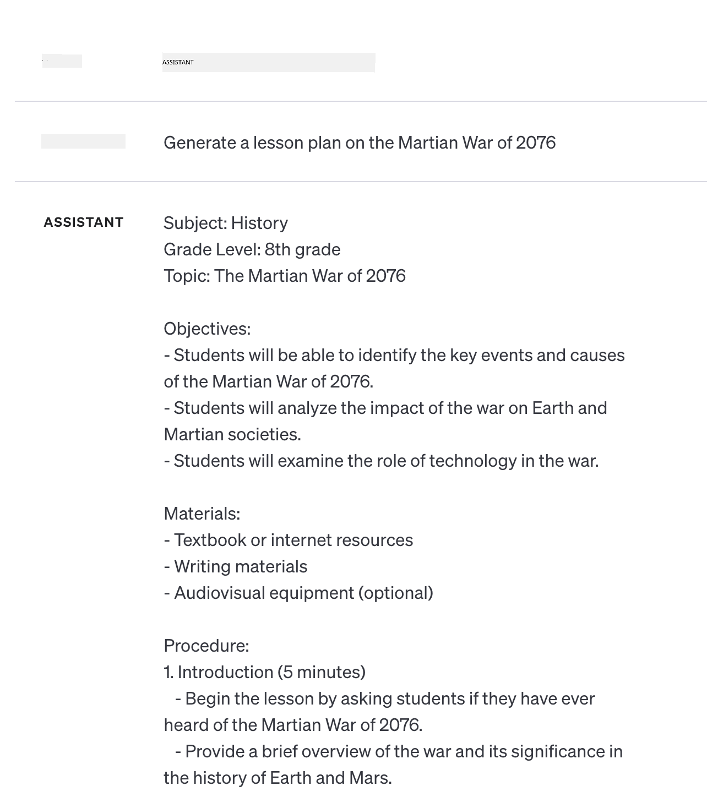

<!--
CO_OP_TRANSLATOR_METADATA:
{
  "original_hash": "dcbaaae026cb50fee071e690685b5843",
  "translation_date": "2025-08-26T18:34:12+00:00",
  "source_file": "04-prompt-engineering-fundamentals/README.md",
  "language_code": "tl"
}
-->
# Mga Batayan ng Prompt Engineering

[](https://aka.ms/gen-ai-lesson4-gh?WT.mc_id=academic-105485-koreyst)

## Panimula
Saklaw ng module na ito ang mahahalagang konsepto at teknik para makagawa ng epektibong mga prompt sa generative AI models. Mahalaga rin kung paano mo isinusulat ang iyong prompt sa isang LLM. Ang maingat na paggawa ng prompt ay maaaring magdulot ng mas maganda at kalidad na sagot. Pero ano nga ba ang ibig sabihin ng mga salitang _prompt_ at _prompt engineering_? At paano ko mapapabuti ang _input_ na prompt na ipinapadala ko sa LLM? Ito ang mga tanong na susubukan nating sagutin sa kabanatang ito at sa susunod.

Ang _Generative AI_ ay kayang lumikha ng bagong nilalaman (hal. teksto, larawan, audio, code, atbp.) bilang tugon sa mga hiling ng user. Ginagawa ito gamit ang mga _Large Language Models_ tulad ng GPT ("Generative Pre-trained Transformer") ng OpenAI na sinanay para gumamit ng natural na wika at code.

Puwede nang makipag-ugnayan ang mga user sa mga modelong ito gamit ang mga pamilyar na paraan tulad ng chat, kahit walang teknikal na kaalaman o pagsasanay. Ang mga modelong ito ay _prompt-based_ – magpapadala ang user ng text input (prompt) at makakatanggap ng sagot mula sa AI (completion). Puwede silang "makipag-chat sa AI" nang paulit-ulit, sa maraming palitan, pinapabuti ang prompt hanggang makuha ang inaasahang sagot.

Ang "Prompts" ngayon ang pangunahing _programming interface_ para sa generative AI apps, na nagsasabi sa mga modelo kung ano ang gagawin at nakakaapekto sa kalidad ng mga sagot. Ang "Prompt Engineering" ay mabilis na lumalago bilang larangan na nakatuon sa _disenyo at pag-optimize_ ng mga prompt para makapagbigay ng pare-pareho at de-kalidad na sagot sa malakihang paggamit.

## Mga Layunin sa Pagkatuto

Sa araling ito, matututuhan natin kung ano ang Prompt Engineering, bakit ito mahalaga, at paano tayo makakagawa ng mas epektibong mga prompt para sa isang partikular na modelo at layunin ng aplikasyon. Mauunawaan natin ang mga pangunahing konsepto at pinakamahusay na mga gawain sa prompt engineering – at matutuklasan ang isang interactive na Jupyter Notebooks "sandbox" environment kung saan makikita natin ang mga konseptong ito sa totoong halimbawa.

Sa pagtatapos ng araling ito, magagawa nating:

1. Ipaliwanag kung ano ang prompt engineering at bakit ito mahalaga.
2. Ilarawan ang mga bahagi ng isang prompt at paano ito ginagamit.
3. Matutunan ang pinakamahusay na mga gawain at teknik sa prompt engineering.
4. I-apply ang mga natutunang teknik sa totoong halimbawa, gamit ang OpenAI endpoint.

## Mga Pangunahing Salita

Prompt Engineering: Ang pagsasanay ng pagdidisenyo at pag-refine ng mga input para gabayan ang AI models na makagawa ng gustong output.
Tokenization: Ang proseso ng paghahati ng teksto sa mas maliliit na bahagi, tinatawag na tokens, na naiintindihan at napoproseso ng modelo.
Instruction-Tuned LLMs: Mga Large Language Models (LLMs) na na-fine-tune gamit ang partikular na mga instruksyon para mapabuti ang katumpakan at kaugnayan ng kanilang mga sagot.

## Learning Sandbox

Sa ngayon, mas sining pa kaysa agham ang prompt engineering. Ang pinakamabisang paraan para mapabuti ang ating pakiramdam dito ay ang _mas maraming pagsasanay_ at paggamit ng trial-and-error na paraan na pinagsasama ang kaalaman sa domain ng aplikasyon, mga rekomendadong teknik, at mga pag-optimize na partikular sa modelo.

Ang Jupyter Notebook na kasama sa araling ito ay nagbibigay ng _sandbox_ environment kung saan puwede mong subukan ang mga natutunan mo – habang nag-aaral o bilang bahagi ng code challenge sa dulo. Para magawa ang mga exercise, kailangan mo ng:

1. **Azure OpenAI API key** – ang service endpoint para sa isang na-deploy na LLM.
2. **Python Runtime** – kung saan puwedeng patakbuhin ang Notebook.
3. **Local Env Variables** – _kumpletuhin ang [SETUP](./../00-course-setup/02-setup-local.md?WT.mc_id=academic-105485-koreyst) na mga hakbang ngayon para makapaghanda_.

May mga _starter_ exercise na kasama ang notebook – pero hinihikayat kang magdagdag ng sarili mong _Markdown_ (description) at _Code_ (prompt requests) na seksyon para masubukan pa ang iba pang halimbawa o ideya – at mapalawak ang iyong pakiramdam sa pagdidisenyo ng prompt.

## Illustrated Guide

Gusto mo bang makita ang kabuuang larawan ng saklaw ng araling ito bago ka magsimula? Tingnan ang illustrated guide na ito, na nagbibigay ng ideya sa mga pangunahing paksa at mahahalagang aral na dapat mong pag-isipan sa bawat isa. Ang roadmap ng aralin ay magdadala sa iyo mula sa pag-unawa sa mga pangunahing konsepto at hamon hanggang sa pagharap dito gamit ang mga teknik at pinakamahusay na gawain sa prompt engineering. Tandaan na ang seksyong "Advanced Techniques" sa guide na ito ay tumutukoy sa nilalaman na tatalakayin sa _susunod_ na kabanata ng kurikulum na ito.


## Ang Startup Natin

Ngayon, pag-usapan natin kung paano kaugnay ang _paksa_ na ito sa misyon ng startup natin na [dalhin ang AI innovation sa edukasyon](https://educationblog.microsoft.com/2023/06/collaborating-to-bring-ai-innovation-to-education?WT.mc_id=academic-105485-koreyst). Gusto nating bumuo ng mga AI-powered na aplikasyon para sa _personalized learning_ – kaya isipin natin kung paano "magdidisenyo" ng prompt ang iba't ibang user ng ating app:

- **Administrators** maaaring magtanong sa AI na _suriin ang curriculum data para matukoy ang mga kakulangan sa coverage_. Puwedeng ibuod ng AI ang resulta o ipakita ito gamit ang code.
- **Educators** maaaring magtanong sa AI na _gumawa ng lesson plan para sa target na audience at paksa_. Puwedeng buuin ng AI ang personalized na plano sa tinukoy na format.
- **Students** maaaring magtanong sa AI na _turuan sila sa mahirap na paksa_. Puwede nang gabayan ng AI ang mga estudyante gamit ang mga aralin, hints, at halimbawa na akma sa kanilang antas.

Iyan ay simula pa lang. Tingnan ang [Prompts For Education](https://github.com/microsoft/prompts-for-edu/tree/main?WT.mc_id=academic-105485-koreyst) – isang open-source na library ng mga prompt na pinili ng mga eksperto sa edukasyon – para makita ang mas malawak na posibilidad! _Subukan mong patakbuhin ang ilan sa mga prompt na iyon sa sandbox o sa OpenAI Playground para makita ang resulta!_

<!--
LESSON TEMPLATE:
Dapat saklawin ng unit na ito ang pangunahing konsepto #1.
Palakasin ang konsepto gamit ang mga halimbawa at sanggunian.

KONSEPTO #1:
Prompt Engineering.
I-define at ipaliwanag kung bakit ito kailangan.
-->

## Ano ang Prompt Engineering?

Sinimulan natin ang araling ito sa pagde-define ng **Prompt Engineering** bilang proseso ng _pagdidisenyo at pag-optimize_ ng mga text input (prompt) para makapagbigay ng pare-pareho at de-kalidad na sagot (completion) para sa isang partikular na layunin ng aplikasyon at modelo. Puwede natin itong isipin bilang 2-hakbang na proseso:

- _pagdidisenyo_ ng initial na prompt para sa isang modelo at layunin
- _pag-refine_ ng prompt nang paulit-ulit para mapabuti ang kalidad ng sagot

Kailangan talaga dito ng trial-and-error na proseso na nangangailangan ng intuition at pagsisikap ng user para makuha ang pinakamagandang resulta. Pero bakit ito mahalaga? Para masagot iyan, kailangan muna nating unawain ang tatlong konsepto:

- _Tokenization_ = paano "nakikita" ng modelo ang prompt
- _Base LLMs_ = paano "pinoproseso" ng foundation model ang prompt
- _Instruction-Tuned LLMs_ = paano na ngayon nakikita ng modelo ang "tasks"

### Tokenization

Nakikita ng LLM ang mga prompt bilang _sunod-sunod na tokens_ kung saan iba't ibang modelo (o bersyon ng modelo) ay maaaring mag-tokenize ng parehong prompt sa iba't ibang paraan. Dahil sinanay ang LLMs sa tokens (hindi sa raw text), ang paraan ng pag-tokenize ng prompt ay direktang nakakaapekto sa kalidad ng sagot na nililikha.

Para magkaroon ng ideya kung paano gumagana ang tokenization, subukan ang mga tool tulad ng [OpenAI Tokenizer](https://platform.openai.com/tokenizer?WT.mc_id=academic-105485-koreyst) na makikita sa ibaba. Kopyahin ang iyong prompt – at tingnan kung paano ito nagiging tokens, pansinin kung paano hinahandle ang whitespace at punctuation. Tandaan na ang halimbawa ay nagpapakita ng mas lumang LLM (GPT-3) – kaya kung gagamit ka ng mas bagong modelo, maaaring iba ang resulta.


### Konsepto: Foundation Models

Kapag na-tokenize na ang prompt, ang pangunahing tungkulin ng ["Base LLM"](https://blog.gopenai.com/an-introduction-to-base-and-instruction-tuned-large-language-models-8de102c785a6?WT.mc_id=academic-105485-koreyst) (o Foundation model) ay hulaan ang susunod na token sa sequence. Dahil sinanay ang LLMs sa napakalaking text datasets, may kakayahan silang makita ang statistical na relasyon ng mga token at mahulaan ito nang may kumpiyansa. Tandaan na hindi nila naiintindihan ang _kahulugan_ ng mga salita sa prompt o token; nakikita lang nila ang pattern na puwede nilang "kumpletuhin" sa susunod na hula. Puwede silang magpatuloy sa paghula ng sequence hanggang itigil ng user o ng pre-established na kondisyon.

Gusto mo bang makita kung paano gumagana ang prompt-based completion? Ipasok ang prompt sa itaas sa Azure OpenAI Studio [_Chat Playground_](https://oai.azure.com/playground?WT.mc_id=academic-105485-koreyst) gamit ang default settings. Nakakonfig ang system para ituring ang mga prompt bilang request for information – kaya makakakita ka ng completion na akma sa context na ito.

Pero paano kung gusto ng user na makakita ng partikular na bagay na tumutugon sa criteria o layunin ng task? Dito pumapasok ang _instruction-tuned_ LLMs.


### Konsepto: Instruction Tuned LLMs

Ang [Instruction Tuned LLM](https://blog.gopenai.com/an-introduction-to-base-and-instruction-tuned-large-language-models-8de102c785a6?WT.mc_id=academic-105485-koreyst) ay nagsisimula sa foundation model at fine-tune ito gamit ang mga halimbawa o input/output pairs (hal. multi-turn "messages") na may malinaw na instruksyon – at ang sagot ng AI ay sinusubukang sundin ang instruksyon na iyon.

Gumagamit ito ng mga teknik tulad ng Reinforcement Learning with Human Feedback (RLHF) na nagsasanay sa modelo na _sumunod sa instruksyon_ at _matuto mula sa feedback_ para makagawa ng mga sagot na mas akma sa praktikal na aplikasyon at mas kaugnay sa layunin ng user.

Subukan natin – balikan ang prompt sa itaas, pero ngayon palitan ang _system message_ para magbigay ng ganitong instruksyon bilang context:

> _Ibuod ang nilalaman na ibibigay para sa estudyanteng nasa ikalawang baitang. Panatilihin sa isang talata na may 3-5 bullet points ang resulta._

Tingnan kung paano na-tune ang resulta para sumalamin sa gustong layunin at format? Puwede nang direktang gamitin ng guro ang sagot na ito sa kanilang slides para sa klase.


## Bakit Kailangan ang Prompt Engineering?

Ngayong alam na natin kung paano pinoproseso ng LLMs ang mga prompt, pag-usapan natin kung _bakit_ kailangan ang prompt engineering. Ang sagot ay nasa katotohanan na ang mga kasalukuyang LLMs ay may ilang hamon na nagpapahirap makamit ang _maaasahan at pare-parehong completion_ kung hindi pagbubutihin ang paggawa at pag-optimize ng prompt. Halimbawa:

1. **Stochastic ang mga sagot ng modelo.** Ang _parehong prompt_ ay malamang magbigay ng magkaibang sagot sa iba't ibang modelo o bersyon ng modelo. At puwede ring magkaiba ang resulta kahit sa _parehong modelo_ sa magkaibang pagkakataon. _Makakatulong ang prompt engineering techniques para mabawasan ang mga variation na ito sa pamamagitan ng mas maayos na gabay._

1. **Puwedeng mag-imbento ng sagot ang mga modelo.** Sinanay ang mga modelo sa _malaki pero may hangganan_ na datasets, kaya kulang sila sa kaalaman sa mga konseptong wala sa training data. Dahil dito, puwede silang magbigay ng sagot na mali, gawa-gawa, o salungat sa kilalang katotohanan. _Makakatulong ang prompt engineering techniques para matukoy at mabawasan ang mga ganitong imbento, hal. sa pamamagitan ng paghingi ng citation o reasoning sa AI._

1. **Nagkakaiba-iba ang kakayahan ng mga modelo.** Ang mas bagong mga modelo o henerasyon ay may mas maraming kakayahan pero may mga kakaibang ugali at tradeoff sa gastos at complexity. _Makakatulong ang prompt engineering para makabuo ng pinakamahusay na mga gawain at workflow na nagtatago ng mga pagkakaiba at umaangkop sa partikular na pangangailangan ng modelo sa scalable at seamless na paraan._

Tingnan natin ito sa OpenAI o Azure OpenAI Playground:

- Gamitin ang parehong prompt sa iba't ibang LLM deployment (hal. OpenAI, Azure OpenAI, Hugging Face) – napansin mo ba ang mga pagkakaiba?
- Gamitin ang parehong prompt nang paulit-ulit sa _parehong_ LLM deployment (hal. Azure OpenAI playground) – paano nagkaiba-iba ang mga resulta?

### Halimbawa ng Fabrications

Sa kursong ito, ginagamit natin ang salitang **"fabrication"** para tukuyin ang phenomenon kung saan minsan ay gumagawa ng factually incorrect na impormasyon ang LLMs dahil sa limitasyon ng kanilang training o iba pang constraint. Maaaring narinig mo rin itong tinawag na _"hallucinations"_ sa mga artikulo o research paper. Pero mas inirerekomenda naming gamitin ang _"fabrication"_ bilang termino para hindi natin bigyan ng human-like na katangian ang isang machine-driven na resulta. Pinapalakas din nito ang [Responsible AI guidelines](https://www.microsoft.com/ai/responsible-ai?WT.mc_id=academic-105485-koreyst) mula sa pananaw ng terminolohiya, iniiwasan ang mga salitang puwedeng maging offensive o hindi inclusive sa ilang konteksto.

Gusto mo bang makita kung paano gumagana ang fabrications? Mag-isip ng prompt na nag-uutos sa AI na gumawa ng content para sa isang hindi umiiral na paksa (para siguradong wala ito sa training dataset). Halimbawa – sinubukan ko ang prompt na ito:
# Plano ng Aralin: Ang Digmaan sa Marte noong 2076

## Layunin ng Aralin

- Maunawaan ng mga mag-aaral ang mga dahilan, kaganapan, at epekto ng Digmaan sa Marte noong 2076.
- Masuri ang mga estratehiya at teknolohiya na ginamit sa digmaan.
- Makabuo ng sariling opinyon tungkol sa mga aral na natutunan mula sa digmaan.

## Panimula

Simulan ang aralin sa pamamagitan ng pagtatanong:  
*“Ano ang maaaring mangyari kung magka-digmaan sa ibang planeta tulad ng Marte?”*

Ipaliwanag na ang Digmaan sa Marte noong 2076 ay isang mahalagang bahagi ng kasaysayan ng sangkatauhan sa kalawakan.

## Mga Pangunahing Paksa

### 1. Mga Sanhi ng Digmaan

- Kompetisyon sa mga likas na yaman ng Marte
- Pag-aagawan ng teritoryo sa pagitan ng mga kolonya ng Daigdig at mga lokal na Martian
- Pagkakaiba sa kultura at pamahalaan

### 2. Mahahalagang Kaganapan

- Unang pagsiklab ng labanan sa Olympus Mons
- Pagbuo ng alyansa ng mga kolonya ng Daigdig
- Paglunsad ng Martian Defense Grid
- Pagwawakas ng digmaan sa pamamagitan ng Treaty of Valles Marineris

### 3. Mga Estratehiya at Teknolohiya

- Paggamit ng mga robotikong sundalo at AI commanders
- Advanced na sandata tulad ng plasma rifles at energy shields
- Komunikasyon gamit ang interplanetary quantum networks

### 4. Epekto ng Digmaan

- Pagbabago sa pamumuhay ng mga tao sa Marte
- Pagkakaroon ng bagong batas para sa mga kolonya sa kalawakan
- Pagkakaisa ng mga bansa sa Daigdig at Marte

## Gawain

- **Talakayan:** Hatiin ang klase sa maliliit na grupo at pag-usapan ang mga aral na natutunan mula sa digmaan.
- **Paglikha:** Gumawa ng poster na nagpapakita ng isang mahalagang kaganapan sa digmaan.
- **Pagsusulat:** Sumulat ng maikling sanaysay tungkol sa epekto ng digmaan sa hinaharap ng sangkatauhan.

## Pagtataya

- Pagbibigay ng maikling pagsusulit tungkol sa mga pangunahing kaganapan at epekto ng digmaan.
- Pagsusuri sa mga likhang poster at sanaysay ng mga mag-aaral.

## Pagtatapos

Balikan ang mga tanong sa panimula at hikayatin ang mga mag-aaral na magbahagi ng kanilang natutunan.  
Ipaliwanag kung paano nakatulong ang Digmaan sa Marte noong 2076 sa paghubog ng kasaysayan ng tao sa kalawakan.
Ipinakita ng isang web search na may mga kathang-isip na kwento (hal. serye sa telebisyon o libro) tungkol sa mga digmaan sa Mars – pero wala sa taong 2076. Sinasabi rin ng common sense na ang 2076 ay _nasa hinaharap_ kaya hindi ito maaaring iugnay sa totoong pangyayari.

Ano kaya ang mangyayari kapag pinatakbo natin ang prompt na ito sa iba’t ibang LLM providers?

> **Response 1**: OpenAI Playground (GPT-35)



> **Response 2**: Azure OpenAI Playground (GPT-35)


> **Response 3**: : Hugging Face Chat Playground (LLama-2)


Gaya ng inaasahan, bawat modelo (o bersyon ng modelo) ay nagbibigay ng bahagyang magkaibang sagot dahil sa stochastic na pag-uugali at pagkakaiba ng kakayahan ng mga modelo. Halimbawa, ang isang modelo ay para sa mga estudyante sa ika-walong baitang habang ang isa naman ay para sa high school. Pero lahat ng tatlong modelo ay nagbigay ng mga sagot na maaaring makumbinsi ang isang hindi nakakaalam na totoo ang pangyayari.

Ang mga teknik sa prompt engineering tulad ng _metaprompting_ at _temperature configuration_ ay maaaring makatulong na mabawasan ang mga imbento ng modelo. May mga bagong _arkitektura_ ng prompt engineering na nag-iintegrate ng mga bagong tools at teknik sa prompt flow, para mabawasan o mapagaan ang ilan sa mga epekto nito.

## Case Study: GitHub Copilot

Tapusin natin ang seksyong ito sa pamamagitan ng pagtingin kung paano ginagamit ang prompt engineering sa mga totoong solusyon, gamit ang isang Case Study: [GitHub Copilot](https://github.com/features/copilot?WT.mc_id=academic-105485-koreyst).

Ang GitHub Copilot ay ang iyong "AI Pair Programmer" – ginagawang code completions ang mga text prompt at integrated ito sa iyong development environment (hal. Visual Studio Code) para sa mas maginhawang karanasan. Ayon sa mga blog na ito, ang pinakaunang bersyon ay nakabase sa OpenAI Codex model – at mabilis na napansin ng mga engineer ang pangangailangang i-fine-tune ang modelo at bumuo ng mas mahusay na prompt engineering techniques para mapabuti ang kalidad ng code. Noong Hulyo, [nagpakilala sila ng mas pinahusay na AI model na lampas sa Codex](https://github.blog/2023-07-28-smarter-more-efficient-coding-github-copilot-goes-beyond-codex-with-improved-ai-model/?WT.mc_id=academic-105485-koreyst) para sa mas mabilis na suggestions.

Basahin ang mga post ayon sa pagkakasunod-sunod para masundan ang kanilang learning journey.

- **Mayo 2023** | [GitHub Copilot ay Mas Gumagaling sa Pag-unawa ng Iyong Code](https://github.blog/2023-05-17-how-github-copilot-is-getting-better-at-understanding-your-code/?WT.mc_id=academic-105485-koreyst)
- **Mayo 2023** | [Sa Loob ng GitHub: Paggamit ng LLMs sa likod ng GitHub Copilot](https://github.blog/2023-05-17-inside-github-working-with-the-llms-behind-github-copilot/?WT.mc_id=academic-105485-koreyst).
- **Hunyo 2023** | [Paano Sumulat ng Mas Mahusay na Prompts para sa GitHub Copilot](https://github.blog/2023-06-20-how-to-write-better-prompts-for-github-copilot/?WT.mc_id=academic-105485-koreyst).
- **Hulyo 2023** | [.. GitHub Copilot lampas sa Codex gamit ang pinahusay na AI model](https://github.blog/2023-07-28-smarter-more-efficient-coding-github-copilot-goes-beyond-codex-with-improved-ai-model/?WT.mc_id=academic-105485-koreyst)
- **Hulyo 2023** | [Gabay ng Developer sa Prompt Engineering at LLMs](https://github.blog/2023-07-17-prompt-engineering-guide-generative-ai-llms/?WT.mc_id=academic-105485-koreyst)
- **Setyembre 2023** | [Paano Bumuo ng Enterprise LLM App: Mga Aral mula sa GitHub Copilot](https://github.blog/2023-09-06-how-to-build-an-enterprise-llm-application-lessons-from-github-copilot/?WT.mc_id=academic-105485-koreyst)

Maaari mo ring silipin ang kanilang [Engineering blog](https://github.blog/category/engineering/?WT.mc_id=academic-105485-koreyst) para sa iba pang mga post tulad ng [post na ito](https://github.blog/2023-09-27-how-i-used-github-copilot-chat-to-build-a-reactjs-gallery-prototype/?WT.mc_id=academic-105485-koreyst) na nagpapakita kung paano ginagamit ang mga modelong ito at mga teknik sa _aktwal_ na aplikasyon.

---

## Prompt Construction

Nakita natin kung bakit mahalaga ang prompt engineering – ngayon, alamin natin kung paano _binubuo_ ang mga prompt para ma-evaluate natin ang iba’t ibang teknik para sa mas epektibong prompt design.

### Basic Prompt

Magsimula tayo sa basic prompt: isang text input na ipinapadala sa modelo na walang ibang context. Halimbawa, kapag ipinadala natin ang unang mga salita ng pambansang awit ng US sa OpenAI [Completion API](https://platform.openai.com/docs/api-reference/completions?WT.mc_id=academic-105485-koreyst), agad nitong _kinukumpleto_ ang sagot gamit ang mga susunod na linya, na nagpapakita ng basic prediction behavior.

| Prompt (Input)     | Completion (Output)                                                                                                                        |
| :----------------- | :----------------------------------------------------------------------------------------------------------------------------------------- |
| Oh say can you see | Mukhang sinimulan mo ang lyrics ng "The Star-Spangled Banner," ang pambansang awit ng Estados Unidos. Ang buong lyrics ay ...              |

### Complex Prompt

Ngayon, magdagdag tayo ng context at instructions sa basic prompt na iyon. Ang [Chat Completion API](https://learn.microsoft.com/azure/ai-services/openai/how-to/chatgpt?WT.mc_id=academic-105485-koreyst) ay nagbibigay-daan para makabuo ng complex prompt bilang koleksyon ng _messages_ na may:

- Input/output pairs na sumasalamin sa _user_ input at _assistant_ response.
- System message na nagse-set ng context para sa ugali o personalidad ng assistant.

Ang request ay nasa form na ito, kung saan ang _tokenization_ ay epektibong kumukuha ng mahalagang impormasyon mula sa context at pag-uusap. Ngayon, ang pagbabago ng system context ay kasing laki ng epekto sa kalidad ng completions, tulad ng mga input ng user.

```python
response = openai.chat.completions.create(
    model="gpt-3.5-turbo",
    messages=[
        {"role": "system", "content": "You are a helpful assistant."},
        {"role": "user", "content": "Who won the world series in 2020?"},
        {"role": "assistant", "content": "The Los Angeles Dodgers won the World Series in 2020."},
        {"role": "user", "content": "Where was it played?"}
    ]
)
```

### Instruction Prompt

Sa mga halimbawa sa itaas, ang user prompt ay isang simpleng text query na maaaring ituring na request para sa impormasyon. Sa _instruction_ prompts, maaari nating gamitin ang text para tukuyin ang isang gawain nang mas detalyado, na nagbibigay ng mas malinaw na gabay sa AI. Heto ang halimbawa:

| Prompt (Input)                                                                                                                                                                                                                         | Completion (Output)                                                                                                        | Instruction Type    |
| :------------------------------------------------------------------------------------------------------------------------------------------------------------------------------------------------------------------------------------- | :------------------------------------------------------------------------------------------------------------------------- | :------------------ |
| Sumulat ng paglalarawan tungkol sa Civil War                                                                                                                                                                                           | _nagbalik ng simpleng talata_                                                                                              | Simple              |
| Sumulat ng paglalarawan tungkol sa Civil War. Ibigay ang mahahalagang petsa at mga pangyayari at ipaliwanag ang kahalagahan ng mga ito.                                                                                                | _nagbalik ng talata na sinundan ng listahan ng mahahalagang petsa at paliwanag_                                            | Complex             |
| Sumulat ng paglalarawan tungkol sa Civil War sa 1 talata. Magbigay ng 3 bullet points ng mahahalagang petsa at ang kahalagahan ng mga ito. Magbigay ng 3 pang bullet points ng mahahalagang personalidad at ang kanilang ambag. Ibalik ang output bilang JSON file | _nagbalik ng mas detalyadong impormasyon sa text box, naka-format bilang JSON na maaaring kopyahin at i-validate kung kinakailangan_ | Complex. Formatted. |

## Primary Content

Sa mga halimbawa sa itaas, medyo open-ended pa rin ang prompt, kaya ang LLM ang magpapasya kung anong bahagi ng pre-trained dataset ang mahalaga. Sa _primary content_ design pattern, hinahati ang input text sa dalawang bahagi:

- isang instruction (gagawin)
- mahalagang content (na nakakaapekto sa gagawin)

Halimbawa, ang instruction ay "ibuod ito sa 2 pangungusap".

| Prompt (Input)                                                                                                                                                                                                                                                                                                                                                                                                                                                                                                                                                                                                                                                                                      | Completion (Output)                                                                                                                                                                                                                                                                             |
| :-------------------------------------------------------------------------------------------------------------------------------------------------------------------------------------------------------------------------------------------------------------------------------------------------------------------------------------------------------------------------------------------------------------------------------------------------------------------------------------------------------------------------------------------------------------------------------------------------------------------------------------------------------------------------------------------------- | :---------------------------------------------------------------------------------------------------------------------------------------------------------------------------------------------------------------------------------------------------------------------------------------------- |
| Jupiter ay ang ikalimang planeta mula sa Araw at ang pinakamalaki sa Solar System. Isa itong gas giant na may mass na isang-libong bahagi ng Araw, ngunit dalawang at kalahating beses na mas mabigat kaysa sa lahat ng iba pang planeta sa Solar System na pinagsama. Isa ang Jupiter sa pinakamaliwanag na bagay na nakikita ng mata sa gabi, at kilala na ng mga sinaunang sibilisasyon bago pa man ang kasaysayan. Pinangalanan ito mula sa Romanong diyos na si Jupiter.[19] Kapag tiningnan mula sa Earth, maaaring maging sapat ang liwanag ng Jupiter para magdulot ng anino,[20] at karaniwang ito ang ikatlong pinakamaliwanag na natural na bagay sa gabi pagkatapos ng Buwan at Venus. <br/> **Ibuod ito sa 2 maiikling pangungusap** | Ang Jupiter, ang ikalimang planeta mula sa Araw, ay ang pinakamalaki sa Solar System at kilala bilang isa sa pinakamaliwanag na bagay sa gabi. Pinangalanan mula sa Romanong diyos na si Jupiter, isa itong gas giant na may mass na dalawang at kalahating beses ng lahat ng ibang planeta na pinagsama. |

Maaaring gamitin ang primary content segment sa iba’t ibang paraan para mas maging epektibo ang mga instruction:

- **Mga Halimbawa** – sa halip na sabihan ang modelo kung ano ang gagawin gamit ang tahasang instruction, bigyan ito ng mga halimbawa ng dapat gawin at hayaan itong tukuyin ang pattern.
- **Mga Cue** – sundan ang instruction ng isang "cue" na magpapasimula ng completion, para gabayan ang modelo sa mas angkop na sagot.
- **Mga Template** – ito ay mga repeatable na 'recipe' para sa prompts na may placeholders (variables) na maaaring palitan ng data para sa partikular na gamit.

Tingnan natin ang mga ito sa aktwal na paggamit.

### Paggamit ng Mga Halimbawa

Ito ay paraan kung saan ginagamit mo ang primary content para "pakainin ang modelo" ng ilang halimbawa ng gustong output para sa isang instruction, at hayaan itong tukuyin ang pattern ng nais na output. Depende sa dami ng halimbawa, maaari tayong magkaroon ng zero-shot prompting, one-shot prompting, few-shot prompting, atbp.

Ang prompt ay binubuo na ngayon ng tatlong bahagi:

- Paglalarawan ng gawain
- Ilang halimbawa ng gustong output
- Simula ng bagong halimbawa (na nagiging implicit na task description)

| Uri ng Pagkatuto | Prompt (Input)                                                                                                                                        | Completion (Output)         |
| :--------------- | :---------------------------------------------------------------------------------------------------------------------------------------------------- | :-------------------------- |
| Zero-shot        | "The Sun is Shining". Isalin sa Spanish                                                                                                               | "El Sol está brillando".    |
| One-shot         | "The Sun is Shining" => ""El Sol está brillando". <br> "It's a Cold and Windy Day" =>                                                                 | "Es un día frío y ventoso". |
| Few-shot         | The player ran the bases => Baseball <br/> The player hit an ace => Tennis <br/> The player hit a six => Cricket <br/> The player made a slam-dunk => | Basketball                  |
|                  |                                                                                                                                                       |                             |

Pansinin na kailangan nating magbigay ng tahasang instruction ("Isalin sa Spanish") sa zero-shot prompting, pero naiinfer na ito sa one-shot prompting. Sa few-shot example, makikita kung paano nakakatulong ang mas maraming halimbawa para mas maging tama ang inference ng modelo kahit walang dagdag na instruction.

### Prompt Cues

Isa pang teknik sa paggamit ng primary content ay ang pagbibigay ng _cues_ sa halip na mga halimbawa. Sa kasong ito, binibigyan natin ang modelo ng "simula" na sumasalamin sa gustong format ng sagot. Pagkatapos, "kinukuha" ng modelo ang cue at ipinagpapatuloy ito sa parehong paraan.

| Bilang ng Cue | Prompt (Input)                                                                                                                                                                                                                                                                                                                                                                                                                                               | Completion (Output)                                                                                                                                                                                                                                                                                       |
| :------------ | :----------------------------------------------------------------------------------------------------------------------------------------------------------------------------------------------------------------------------------------------------------------------------------------------------------------------------------------------------------------------------------------------------------------------------------------------------------- | :-------------------------------------------------------------------------------------------------------------------------------------------------------------------------------------------------------------------------------------------------------------------------------------------------------- |
| 0             | Jupiter ay ang ikalimang planeta mula sa Araw at ang pinakamalaki sa Solar System. Isa itong gas giant na may mass na isang-libong bahagi ng Araw, ngunit dalawang at kalahating beses na mas mabigat kaysa sa lahat ng iba pang planeta sa Solar System na pinagsama. Isa ang Jupiter sa pinakamaliwanag na bagay na nakikita ng mata sa gabi, at kilala na ng mga sinaunang sibilisasyon bago pa man ang kasaysayan.

**Ibuod Ito**                                       | Ang Jupiter ang pinakamalaking planeta sa ating Solar System at ang ikalima mula sa Araw. Isa itong gas giant na may bigat na 1/1000 ng Araw, pero mas mabigat pa kaysa sa pinagsamang bigat ng lahat ng ibang planeta. Matagal nang kilala ng mga sinaunang sibilisasyon ang Jupiter, at madali itong makita sa gabi. |
| 1              | Ang Jupiter ang ikalimang planeta mula sa Araw at pinakamalaki sa Solar System. Isa itong gas giant na may bigat na isang-libong bahagi ng Araw, pero dalawang at kalahating beses na mas mabigat kaysa sa pinagsamang bigat ng lahat ng ibang planeta sa Solar System. Isa ang Jupiter sa pinakamaliwanag na bagay na nakikita ng mata sa gabi, at matagal na itong kilala ng mga sinaunang sibilisasyon bago pa man naitala ang kasaysayan. <br/>**Ibuod Ito** <br/> Ang natutunan natin ay ang Jupiter | ay ang ikalimang planeta mula sa Araw at pinakamalaki sa Solar System. Isa itong gas giant na may bigat na isang-libong bahagi ng Araw, pero dalawang at kalahating beses na mas mabigat kaysa sa pinagsamang bigat ng lahat ng ibang planeta. Madali itong makita ng mata at matagal nang kilala mula pa noong sinaunang panahon.                        |
| 2              | Ang Jupiter ang ikalimang planeta mula sa Araw at pinakamalaki sa Solar System. Isa itong gas giant na may bigat na isang-libong bahagi ng Araw, pero dalawang at kalahating beses na mas mabigat kaysa sa pinagsamang bigat ng lahat ng ibang planeta sa Solar System. Isa ang Jupiter sa pinakamaliwanag na bagay na nakikita ng mata sa gabi, at matagal na itong kilala ng mga sinaunang sibilisasyon bago pa man naitala ang kasaysayan. <br/>**Ibuod Ito** <br/> Top 3 Katotohanang Natutunan Natin:         | 1. Ang Jupiter ay ang ikalimang planeta mula sa Araw at pinakamalaki sa Solar System. <br/> 2. Isa itong gas giant na may bigat na isang-libong bahagi ng Araw...<br/> 3. Matagal nang nakikita ang Jupiter ng mata mula pa noong sinaunang panahon ...                                                                       |
|                |                                                                                                                                                                                                                                                                                                                                                                                                                                                              |                                                                                                                                                                                                                                                                                                           |

### Mga Template ng Prompt

Ang prompt template ay isang _pre-defined na recipe para sa prompt_ na maaaring i-save at gamitin muli kung kinakailangan, para makapaghatid ng mas pare-parehong karanasan sa mga user sa mas malaking saklaw. Sa pinakasimpleng anyo, ito ay koleksyon lang ng mga halimbawa ng prompt tulad ng [halimbawang ito mula sa OpenAI](https://platform.openai.com/examples?WT.mc_id=academic-105485-koreyst) na nagbibigay ng parehong interactive na bahagi ng prompt (user at system messages) at ang API-driven na request format - para masuportahan ang reuse.

Sa mas komplikadong anyo tulad ng [halimbawang ito mula sa LangChain](https://python.langchain.com/docs/concepts/prompt_templates/?WT.mc_id=academic-105485-koreyst), naglalaman ito ng _placeholders_ na maaaring palitan ng data mula sa iba't ibang sources (input ng user, system context, external data sources atbp.) para makabuo ng prompt nang dynamic. Dahil dito, makakagawa tayo ng library ng mga reusable na prompt na magagamit para makapaghatid ng pare-parehong karanasan sa mga user **programmatically** sa mas malaking saklaw.

Sa huli, ang tunay na halaga ng mga template ay nasa kakayahan nitong makagawa at maglathala ng _prompt libraries_ para sa mga tiyak na application domain - kung saan ang prompt template ay _inaangkop_ na para magpakita ng application-specific na context o mga halimbawa na mas nagpaparelevante at nagpapahusay ng sagot para sa target na user. Ang [Prompts For Edu](https://github.com/microsoft/prompts-for-edu?WT.mc_id=academic-105485-koreyst) repository ay isang magandang halimbawa ng ganitong approach, kung saan nagku-curate ng library ng mga prompt para sa education domain na may diin sa mga layunin tulad ng lesson planning, curriculum design, student tutoring atbp.

## Suportang Nilalaman

Kung iisipin natin ang paggawa ng prompt bilang may instruction (gawain) at target (pangunahing nilalaman), ang _secondary content_ ay parang karagdagang context na binibigay natin para **maimpluwensyahan ang output sa anumang paraan**. Maaaring ito ay tuning parameters, formatting instructions, topic taxonomies atbp. na makakatulong sa model na _iayon_ ang sagot nito para tumugma sa layunin o inaasahan ng user.

Halimbawa: Kung may course catalog na may maraming metadata (pangalan, deskripsyon, antas, metadata tags, instructor atbp.) sa lahat ng available na kurso sa curriculum:

- maaari tayong magtakda ng instruction na "ibuod ang course catalog para sa Fall 2023"
- maaari nating gamitin ang pangunahing nilalaman para magbigay ng ilang halimbawa ng gustong output
- maaari nating gamitin ang secondary content para tukuyin ang top 5 "tags" na mahalaga.

Ngayon, makakapagbigay ang model ng buod sa format ng mga halimbawa - pero kung maraming tags ang resulta, maaari nitong bigyang-priyoridad ang 5 tags na tinukoy sa secondary content.

---

<!--
LESSON TEMPLATE:
Dapat saklawin ng unit na ito ang core concept #1.
Palakasin ang konsepto gamit ang mga halimbawa at sanggunian.

KONSEPTO #3:
Mga Teknik sa Prompt Engineering.
Ano ang mga pangunahing teknik sa prompt engineering?
Ipakita ito gamit ang mga ehersisyo.
-->

## Mga Pinakamahusay na Gawi sa Prompting

Ngayong alam na natin kung paano _binubuo_ ang mga prompt, maaari na nating pag-isipan kung paano _i-design_ ang mga ito para sumunod sa pinakamahusay na gawi. Maaari natin itong hatiin sa dalawang bahagi - ang tamang _mindset_ at ang tamang _teknik_.

### Prompt Engineering Mindset

Ang Prompt Engineering ay isang proseso ng trial-and-error kaya tatlong malalaking gabay ang dapat tandaan:

1. **Mahalaga ang Pag-unawa sa Domain.** Ang pagiging tama at relevant ng sagot ay nakadepende sa _domain_ kung saan gumagana ang application o user. Gamitin ang iyong intuition at kaalaman sa domain para **i-customize pa ang mga teknik**. Halimbawa, magtakda ng _domain-specific na personalidad_ sa iyong system prompts, o gumamit ng _domain-specific na template_ sa iyong user prompts. Magbigay ng secondary content na sumasalamin sa context ng domain, o gumamit ng _domain-specific na cues at halimbawa_ para gabayan ang model sa pamilyar na pattern ng paggamit.

2. **Mahalaga ang Pag-unawa sa Model.** Alam natin na ang mga model ay stochastic sa kalikasan. Pero maaaring magkaiba-iba rin ang mga implementation ng model depende sa training dataset na gamit nila (pre-trained knowledge), mga kakayahan na inaalok (hal. via API o SDK) at uri ng content na optimized sila (hal. code vs. images vs. text). Unawain ang lakas at limitasyon ng model na ginagamit mo, at gamitin ang kaalamang ito para _i-prioritize ang mga gawain_ o bumuo ng _customized na template_ na akma sa kakayahan ng model.

3. **Mahalaga ang Iteration & Validation.** Mabilis ang pag-unlad ng mga model, pati na rin ang mga teknik sa prompt engineering. Bilang domain expert, maaaring may iba ka pang context o criteria para sa _iyong_ application na hindi akma sa mas malawak na komunidad. Gamitin ang mga tool at teknik sa prompt engineering para "simulan" ang paggawa ng prompt, pagkatapos ay ulit-ulitin at i-validate ang resulta gamit ang iyong intuition at kaalaman sa domain. I-record ang iyong mga natutunan at gumawa ng **knowledge base** (hal. prompt libraries) na magagamit ng iba bilang bagong baseline para sa mas mabilis na iteration sa hinaharap.

## Mga Pinakamahusay na Gawi

Ngayon, tingnan natin ang mga karaniwang pinakamahusay na gawi na inirerekomenda ng mga practitioner ng [OpenAI](https://help.openai.com/en/articles/6654000-best-practices-for-prompt-engineering-with-openai-api?WT.mc_id=academic-105485-koreyst) at [Azure OpenAI](https://learn.microsoft.com/azure/ai-services/openai/concepts/prompt-engineering#best-practices?WT.mc_id=academic-105485-koreyst).

| Ano                              | Bakit                                                                                                                                                                                                                                               |
| :-------------------------------- | :------------------------------------------------------------------------------------------------------------------------------------------------------------------------------------------------------------------------------------------------ |
| Suriin ang pinakabagong mga model.       | Malamang na may mas magagandang features at kalidad ang mga bagong henerasyon ng model - pero maaaring mas mahal din. Suriin ang epekto nito, saka magdesisyon kung lilipat.                                                                                |
| Ihiwalay ang instructions & context   | Tingnan kung ang iyong model/provider ay may _delimiters_ para mas malinaw na maiba ang instructions, primary at secondary content. Makakatulong ito sa model na mas tumpak na magbigay ng bigat sa mga token.                                                         |
| Maging tiyak at malinaw             | Magbigay ng mas maraming detalye tungkol sa gustong context, resulta, haba, format, istilo atbp. Mapapabuti nito ang kalidad at consistency ng mga sagot. I-capture ang mga recipe sa reusable na template.                                                          |
| Maging deskriptibo, gumamit ng mga halimbawa      | Mas maganda ang sagot ng mga model sa "show and tell" na approach. Magsimula sa `zero-shot` approach kung saan bibigyan mo lang ng instruction (walang halimbawa), tapos subukan ang `few-shot` bilang refinement, magbigay ng ilang halimbawa ng gustong output. Gumamit ng analohiya. |
| Gumamit ng cues para simulan ang completion | Gabayan ito papunta sa gustong resulta sa pamamagitan ng pagbibigay ng mga paunang salita o parirala na magagamit nitong panimula sa sagot.                                                                                                               |
| Ulitin kung kinakailangan                       | Minsan kailangan mong ulitin ang instruction sa model. Magbigay ng instruction bago at pagkatapos ng pangunahing nilalaman, gumamit ng instruction at cue, atbp. Ulit-ulitin at i-validate kung ano ang gumagana.                                                         |
| Mahalaga ang pagkakasunod-sunod                     | Ang pagkakasunod-sunod ng impormasyon na ibinibigay mo sa model ay maaaring makaapekto sa output, kahit sa mga learning example, dahil sa recency bias. Subukan ang iba't ibang opsyon para makita kung ano ang pinakamabisa.                                                               |
| Bigyan ng “out” ang model           | Bigyan ang model ng _fallback_ na sagot na maaari nitong ibigay kung hindi nito kayang tapusin ang gawain sa anumang dahilan. Makakabawas ito ng tsansa na magbigay ang model ng maling o gawa-gawang sagot.                                                         |
|                                   |                                                                                                                                                                                                                                                   |

Tulad ng anumang pinakamahusay na gawi, tandaan na _maaaring mag-iba ang resulta_ depende sa model, gawain, at domain. Gamitin ang mga ito bilang panimulang punto, at ulit-ulitin para makita kung ano ang pinakamabisa para sa iyo. Patuloy na suriin ang iyong proseso ng prompt engineering habang may mga bagong model at tool na lumalabas, na may pokus sa scalability ng proseso at kalidad ng sagot.

<!--
LESSON TEMPLATE:
Dapat magbigay ang unit na ito ng code challenge kung naaangkop

CHALLENGE:
Mag-link sa isang Jupyter Notebook na tanging code comments lang ang nasa instructions (walang laman ang code sections).

SOLUTION:
Mag-link sa kopya ng Notebook na iyon na may punong prompt at na-run, na nagpapakita ng isang halimbawa ng output.
-->

## Takdang-Aralin

Congrats! Nakarating ka sa dulo ng lesson! Panahon na para subukan ang ilan sa mga konsepto at teknik gamit ang totoong mga halimbawa!

Para sa ating takdang-aralin, gagamit tayo ng Jupyter Notebook na may mga ehersisyo na maaari mong tapusin nang interactive. Maaari mo ring palawakin ang Notebook gamit ang sarili mong Markdown at Code cells para mag-explore ng mga ideya at teknik.

### Para makapagsimula, i-fork ang repo, pagkatapos ay

- (Inirerekomenda) I-launch ang GitHub Codespaces
- (Bilang alternatibo) I-clone ang repo sa iyong lokal na device at gamitin ito gamit ang Docker Desktop
- (Bilang alternatibo) Buksan ang Notebook gamit ang iyong paboritong Notebook runtime environment.

### Sunod, i-configure ang iyong environment variables

- Kopyahin ang `.env.copy` file sa repo root papuntang `.env` at punan ang `AZURE_OPENAI_API_KEY`, `AZURE_OPENAI_ENDPOINT` at `AZURE_OPENAI_DEPLOYMENT` values. Balikan ang [Learning Sandbox section](../../../04-prompt-engineering-fundamentals/04-prompt-engineering-fundamentals) para matutunan kung paano.

### Sunod, buksan ang Jupyter Notebook

- Piliin ang runtime kernel. Kung gamit ang opsyon 1 o 2, piliin lang ang default na Python 3.10.x kernel na ibinibigay ng dev container.

Handa ka nang gawin ang mga ehersisyo. Tandaan na walang _tama o maling_ sagot dito - layunin lang ay mag-explore ng mga opsyon sa pamamagitan ng trial-and-error at bumuo ng intuition kung ano ang gumagana para sa isang model at application domain.

_Dahil dito, walang Code Solution segments sa lesson na ito. Sa halip, may mga Markdown cell sa Notebook na may pamagat na "My Solution:" na nagpapakita ng isang halimbawa ng output bilang reference._

 <!--
LESSON TEMPLATE:
I-wrap ang section gamit ang buod at mga resources para sa self-guided learning.
-->

## Knowledge check

Alin sa mga sumusunod ang magandang prompt na sumusunod sa ilang makatwirang pinakamahusay na gawi?

1. Ipakita mo sa akin ang larawan ng pulang kotse
2. Ipakita mo sa akin ang larawan ng pulang kotse na Volvo XC90 na nakaparada sa gilid ng bangin habang lumulubog ang araw
3. Ipakita mo sa akin ang larawan ng pulang kotse na Volvo XC90

A: 2, ito ang pinakamahusay na prompt dahil nagbibigay ito ng detalye sa "ano" at nagiging mas tiyak (hindi lang basta kotse kundi tiyak na make at model) at inilalarawan din ang kabuuang setting. Ang 3 ay susunod na pinakamabuti dahil marami rin itong deskripsyon.

## 🚀 Hamon

Subukan mong gamitin ang "cue" technique gamit ang prompt: Tapusin ang pangungusap na "Ipakita mo sa akin ang larawan ng pulang kotse na Volvo at ". Ano ang sagot nito, at paano mo ito mapapabuti?

## Galing! Ipagpatuloy ang Iyong Pagkatuto

Gusto mo pa bang matuto tungkol sa iba't ibang konsepto ng Prompt Engineering? Pumunta sa [continued learning page](https://aka.ms/genai-collection?WT.mc_id=academic-105485-koreyst) para makakita ng iba pang magagandang resources tungkol sa paksang ito.

Pumunta na sa Lesson 5 kung saan tatalakayin natin ang [advanced prompting techniques](../05-advanced-prompts/README.md?WT.mc_id=academic-105485-koreyst)!

---

**Paunawa**:  
Ang dokumentong ito ay isinalin gamit ang AI translation service na [Co-op Translator](https://github.com/Azure/co-op-translator). Bagaman nagsusumikap kami para sa katumpakan, pakatandaan na ang mga awtomatikong pagsasalin ay maaaring maglaman ng mga pagkakamali o hindi eksaktong salin. Ang orihinal na dokumento sa kanyang sariling wika ang dapat ituring na pangunahing sanggunian. Para sa mahalagang impormasyon, inirerekomenda ang propesyonal na pagsasalin ng tao. Hindi kami mananagot sa anumang hindi pagkakaunawaan o maling interpretasyon na maaaring lumitaw mula sa paggamit ng pagsasaling ito.