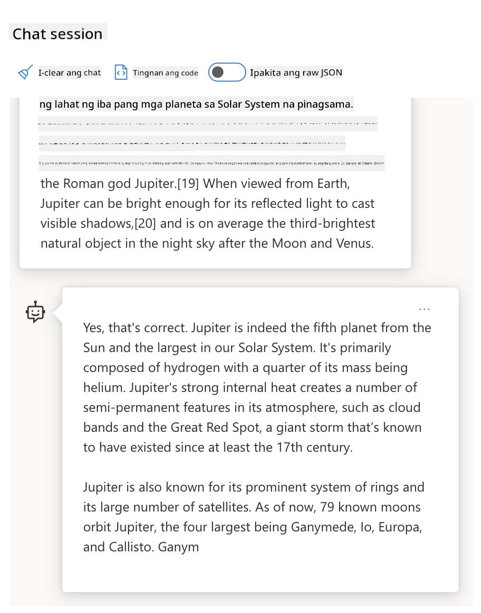

<!--
CO_OP_TRANSLATOR_METADATA:
{
  "original_hash": "0135e6c271f3ece8699050d4debbce88",
  "translation_date": "2025-10-17T13:19:12+00:00",
  "source_file": "04-prompt-engineering-fundamentals/README.md",
  "language_code": "tl"
}
-->
# Mga Pangunahing Kaalaman sa Prompt Engineering

[](https://youtu.be/GElCu2kUlRs?si=qrXsBvXnCW12epb8)

## Panimula
Ang module na ito ay tumatalakay sa mahahalagang konsepto at teknik para sa paglikha ng epektibong mga prompt sa generative AI models. Ang paraan ng pagsusulat mo ng prompt sa isang LLM ay mahalaga rin. Ang maingat na pagkakagawa ng prompt ay maaaring magresulta sa mas mataas na kalidad ng sagot. Ngunit ano nga ba ang ibig sabihin ng mga terminong tulad ng _prompt_ at _prompt engineering_? At paano ko mapapabuti ang prompt _input_ na ipinapadala ko sa LLM? Ito ang mga tanong na susubukan nating sagutin sa kabanatang ito at sa susunod.

Ang _Generative AI_ ay may kakayahang lumikha ng bagong nilalaman (hal., teksto, larawan, audio, code, atbp.) bilang tugon sa mga kahilingan ng user. Nakakamit ito gamit ang _Large Language Models_ tulad ng serye ng GPT ("Generative Pre-trained Transformer") ng OpenAI na sinanay para sa paggamit ng natural na wika at code.

Ang mga user ay maaari nang makipag-ugnayan sa mga modelong ito gamit ang mga pamilyar na paraan tulad ng chat, nang hindi nangangailangan ng teknikal na kaalaman o pagsasanay. Ang mga modelo ay _prompt-based_ - nagpapadala ang mga user ng text input (prompt) at nakakatanggap ng sagot mula sa AI (completion). Maaari silang "makipag-chat sa AI" nang paulit-ulit, sa multi-turn na mga pag-uusap, pinapabuti ang kanilang prompt hanggang sa ang sagot ay tumugma sa kanilang inaasahan.

Ang "Prompts" ay nagiging pangunahing _programming interface_ para sa mga generative AI apps, na nagsasabi sa mga modelo kung ano ang gagawin at nakakaapekto sa kalidad ng mga sagot na ibinabalik. Ang "Prompt Engineering" ay isang mabilis na lumalaking larangan ng pag-aaral na nakatuon sa _disenyo at pag-optimize_ ng mga prompt upang makapaghatid ng pare-pareho at de-kalidad na mga sagot sa malakihang sukat.

## Mga Layunin sa Pag-aaral

Sa araling ito, matututunan natin kung ano ang Prompt Engineering, bakit ito mahalaga, at paano tayo makakagawa ng mas epektibong mga prompt para sa isang partikular na modelo at layunin ng aplikasyon. Mauunawaan natin ang mga pangunahing konsepto at pinakamahusay na mga kasanayan para sa prompt engineering - at matutunan ang tungkol sa isang interactive na Jupyter Notebooks "sandbox" na kapaligiran kung saan makikita natin ang mga konseptong ito na inilalapat sa mga tunay na halimbawa.

Sa pagtatapos ng araling ito, magagawa natin ang sumusunod:

1. Ipaliwanag kung ano ang prompt engineering at bakit ito mahalaga.
2. Ilarawan ang mga bahagi ng isang prompt at kung paano ito ginagamit.
3. Matutunan ang pinakamahusay na mga kasanayan at teknik para sa prompt engineering.
4. Ilapat ang mga natutunang teknik sa mga tunay na halimbawa, gamit ang isang OpenAI endpoint.

## Mga Pangunahing Termino

Prompt Engineering: Ang pagsasanay sa pagdidisenyo at pag-aayos ng mga input upang gabayan ang mga AI models sa paggawa ng mga nais na output.
Tokenization: Ang proseso ng pag-convert ng teksto sa mas maliliit na yunit, na tinatawag na tokens, na nauunawaan at napoproseso ng isang modelo.
Instruction-Tuned LLMs: Mga Large Language Models (LLMs) na na-fine-tune gamit ang mga partikular na instruksyon upang mapabuti ang katumpakan at kaugnayan ng kanilang mga sagot.

## Learning Sandbox

Sa kasalukuyan, ang prompt engineering ay mas sining kaysa agham. Ang pinakamahusay na paraan upang mapabuti ang ating intuwisyon para dito ay ang _mas maraming pagsasanay_ at ang paggamit ng trial-and-error na diskarte na pinagsasama ang kaalaman sa domain ng aplikasyon sa mga inirerekomendang teknik at mga pag-optimize na partikular sa modelo.

Ang Jupyter Notebook na kasama sa araling ito ay nagbibigay ng _sandbox_ na kapaligiran kung saan maaari mong subukan ang natutunan mo - habang nagpapatuloy o bilang bahagi ng code challenge sa dulo. Upang maisagawa ang mga ehersisyo, kakailanganin mo ang:

1. **Isang Azure OpenAI API key** - ang service endpoint para sa isang deployed na LLM.
2. **Isang Python Runtime** - kung saan maaaring maisagawa ang Notebook.
3. **Mga Lokal na Env Variables** - _kumpletuhin ang [SETUP](./../00-course-setup/02-setup-local.md?WT.mc_id=academic-105485-koreyst) na mga hakbang ngayon upang maging handa_.

Ang notebook ay may mga _starter_ na ehersisyo - ngunit hinihikayat kang magdagdag ng sarili mong _Markdown_ (deskripsyon) at _Code_ (prompt requests) na mga seksyon upang subukan ang mas maraming halimbawa o ideya - at buuin ang iyong intuwisyon para sa disenyo ng prompt.

## Gabay na May Larawan

Gusto mo bang makuha ang kabuuang larawan ng saklaw ng araling ito bago ka sumisid? Tingnan ang gabay na may larawan, na nagbibigay sa iyo ng ideya ng mga pangunahing paksa na saklaw at ang mga mahahalagang takeaway na dapat mong pag-isipan sa bawat isa. Ang roadmap ng aralin ay magdadala sa iyo mula sa pag-unawa sa mga pangunahing konsepto at hamon hanggang sa pagtugon sa mga ito gamit ang mga kaugnay na teknik sa prompt engineering at pinakamahusay na mga kasanayan. Tandaan na ang seksyong "Advanced Techniques" sa gabay na ito ay tumutukoy sa nilalaman na saklaw sa _susunod_ na kabanata ng kurikulum na ito.


## Ang Ating Startup

Ngayon, pag-usapan natin kung paano _ang paksang ito_ ay nauugnay sa misyon ng ating startup na [magdala ng AI innovation sa edukasyon](https://educationblog.microsoft.com/2023/06/collaborating-to-bring-ai-innovation-to-education?WT.mc_id=academic-105485-koreyst). Nais naming bumuo ng mga AI-powered na aplikasyon para sa _personalized learning_ - kaya't isipin natin kung paano maaaring "magdisenyo" ng mga prompt ang iba't ibang user ng aming aplikasyon:

- **Mga Administrator** maaaring magtanong sa AI upang _suriin ang data ng kurikulum upang matukoy ang mga puwang sa saklaw_. Maaaring ibuod ng AI ang mga resulta o ipakita ang mga ito gamit ang code.
- **Mga Guro** maaaring magtanong sa AI upang _bumuo ng isang lesson plan para sa isang target na audience at paksa_. Maaaring bumuo ang AI ng personalized na plano sa isang tinukoy na format.
- **Mga Mag-aaral** maaaring magtanong sa AI upang _turuan sila sa isang mahirap na paksa_. Maaaring gabayan ng AI ang mga mag-aaral gamit ang mga aralin, pahiwatig, at mga halimbawa na angkop sa kanilang antas.

Iyan ay simula pa lamang. Tingnan ang [Prompts For Education](https://github.com/microsoft/prompts-for-edu/tree/main?WT.mc_id=academic-105485-koreyst) - isang open-source na library ng mga prompt na pinili ng mga eksperto sa edukasyon - upang makakuha ng mas malawak na ideya ng mga posibilidad! _Subukang patakbuhin ang ilan sa mga prompt na iyon sa sandbox o gamitin ang OpenAI Playground upang makita ang resulta!_

<!--
LESSON TEMPLATE:
This unit should cover core concept #1.
Reinforce the concept with examples and references.

CONCEPT #1:
Prompt Engineering.
Define it and explain why it is needed.
-->

## Ano ang Prompt Engineering?

Sinimulan natin ang araling ito sa pamamagitan ng pagde-define ng **Prompt Engineering** bilang proseso ng _pagdidisenyo at pag-optimize_ ng mga text input (prompts) upang makapaghatid ng pare-pareho at de-kalidad na mga sagot (completions) para sa isang partikular na layunin ng aplikasyon at modelo. Maaari nating isipin ito bilang isang 2-step na proseso:

- _pagdidisenyo_ ng paunang prompt para sa isang partikular na modelo at layunin
- _pag-aayos_ ng prompt nang paulit-ulit upang mapabuti ang kalidad ng sagot

Ito ay isang proseso ng trial-and-error na nangangailangan ng intuwisyon at pagsisikap ng user upang makamit ang pinakamainam na resulta. Kaya bakit ito mahalaga? Upang masagot ang tanong na iyon, kailangan muna nating maunawaan ang tatlong konsepto:

- _Tokenization_ = kung paano "nakikita" ng modelo ang prompt
- _Base LLMs_ = kung paano "pinoproseso" ng foundation model ang prompt
- _Instruction-Tuned LLMs_ = kung paano nakikita ng modelo ang "mga gawain"

### Tokenization

Nakikita ng isang LLM ang mga prompt bilang isang _sunod-sunod na mga token_ kung saan ang iba't ibang modelo (o bersyon ng isang modelo) ay maaaring mag-tokenize ng parehong prompt sa iba't ibang paraan. Dahil ang mga LLM ay sinanay sa mga token (at hindi sa raw text), ang paraan ng pag-tokenize ng mga prompt ay may direktang epekto sa kalidad ng sagot na nabuo.

Upang makakuha ng intuwisyon kung paano gumagana ang tokenization, subukan ang mga tool tulad ng [OpenAI Tokenizer](https://platform.openai.com/tokenizer?WT.mc_id=academic-105485-koreyst) na ipinakita sa ibaba. Kopyahin ang iyong prompt - at tingnan kung paano ito na-convert sa mga token, bigyang-pansin kung paano hinahandle ang mga whitespace characters at punctuation marks. Tandaan na ang halimbawang ito ay nagpapakita ng mas lumang LLM (GPT-3) - kaya't ang pagsubok nito sa mas bagong modelo ay maaaring magresulta sa ibang resulta.


### Konsepto: Foundation Models

Kapag na-tokenize na ang isang prompt, ang pangunahing tungkulin ng ["Base LLM"](https://blog.gopenai.com/an-introduction-to-base-and-instruction-tuned-large-language-models-8de102c785a6?WT.mc_id=academic-105485-koreyst) (o Foundation model) ay hulaan ang token sa sunod-sunod na iyon. Dahil ang mga LLM ay sinanay sa malalaking dataset ng teksto, mayroon silang mahusay na pag-unawa sa mga statistical na relasyon sa pagitan ng mga token at maaaring gawin ang prediksyon na iyon nang may kumpiyansa. Tandaan na hindi nila nauunawaan ang _kahulugan_ ng mga salita sa prompt o token; nakikita lamang nila ang pattern na maaari nilang "kumpletuhin" sa kanilang susunod na prediksyon. Maaari silang magpatuloy sa pag-predict ng sunod-sunod hanggang sa itigil ng user o ng isang pre-established na kondisyon.

Gusto mo bang makita kung paano gumagana ang prompt-based completion? Ipasok ang prompt sa itaas sa Azure OpenAI Studio [_Chat Playground_](https://oai.azure.com/playground?WT.mc_id=academic-105485-koreyst) gamit ang default na mga setting. Ang sistema ay naka-configure upang tratuhin ang mga prompt bilang mga kahilingan para sa impormasyon - kaya't dapat kang makakita ng completion na tumutugon sa kontekstong ito.

Ngunit paano kung nais ng user na makakita ng isang bagay na partikular na tumutugma sa ilang pamantayan o layunin ng gawain? Dito pumapasok ang _instruction-tuned_ LLMs.



### Konsepto: Instruction Tuned LLMs

Ang isang [Instruction Tuned LLM](https://blog.gopenai.com/an-introduction-to-base-and-instruction-tuned-large-language-models-8de102c785a6?WT.mc_id=academic-105485-koreyst) ay nagsisimula sa foundation model at fine-tune ito gamit ang mga halimbawa o input/output pairs (hal., multi-turn "messages") na maaaring maglaman ng malinaw na mga instruksyon - at ang sagot mula sa AI ay sinusubukang sundin ang instruksyon na iyon.

Ginagamit nito ang mga teknik tulad ng Reinforcement Learning with Human Feedback (RLHF) na maaaring sanayin ang modelo upang _sundin ang mga instruksyon_ at _matuto mula sa feedback_ upang makagawa ng mga sagot na mas angkop sa mga praktikal na aplikasyon at mas nauugnay sa mga layunin ng user.

Subukan natin ito - balikan ang prompt sa itaas, ngunit ngayon baguhin ang _system message_ upang magbigay ng sumusunod na instruksyon bilang konteksto:

> _Ibuod ang nilalaman na ibinigay para sa isang mag-aaral sa ikalawang baitang. Panatilihin ang resulta sa isang talata na may 3-5 bullet points._

Tingnan kung paano ang resulta ay naka-tune upang ipakita ang nais na layunin at format? Ang isang guro ay maaari nang direktang gamitin ang sagot na ito sa kanilang mga slide para sa klase.


## Bakit Kailangan Natin ang Prompt Engineering?

Ngayon na alam natin kung paano pinoproseso ng mga LLM ang mga prompt, pag-usapan natin kung _bakit_ kailangan natin ang prompt engineering. Ang sagot ay nasa katotohanan na ang kasalukuyang mga LLM ay may ilang mga hamon na nagpapahirap sa _maaasahan at pare-parehong completions_ nang hindi naglalagay ng pagsisikap sa konstruksyon at pag-optimize ng prompt. Halimbawa:

1. **Ang mga sagot ng modelo ay stochastic.** Ang _parehong prompt_ ay malamang na magresulta sa iba't ibang sagot sa iba't ibang modelo o bersyon ng modelo. At maaari rin itong magresulta sa iba't ibang sagot sa _parehong modelo_ sa iba't ibang oras. _Ang mga teknik sa prompt engineering ay makakatulong sa atin na mabawasan ang mga pagkakaibang ito sa pamamagitan ng pagbibigay ng mas mahusay na mga guardrails_.

1. **Ang mga modelo ay maaaring mag-imbento ng mga sagot.** Ang mga modelo ay pre-trained gamit ang _malaki ngunit limitadong_ mga dataset, ibig sabihin, kulang sila ng kaalaman tungkol sa mga konsepto sa labas ng saklaw ng pagsasanay na iyon. Bilang resulta, maaari silang magbigay ng mga sagot na hindi tama, haka-haka, o direktang salungat sa mga kilalang katotohanan. _Ang mga teknik sa prompt engineering ay tumutulong sa mga user na tukuyin at bawasan ang ganitong mga imbensyon hal., sa pamamagitan ng paghingi ng AI ng mga citation o reasoning_.

1. **Ang mga kakayahan ng modelo ay mag-iiba.** Ang mas bagong mga modelo o henerasyon ng modelo ay magkakaroon ng mas mayamang kakayahan ngunit magdadala rin ng mga natatanging quirks at tradeoffs sa gastos at pagiging kumplikado. _Ang prompt engineering ay makakatulong sa atin na bumuo ng pinakamahusay na mga kasanayan at workflows na nag-aabstract sa mga pagkakaiba at umaangkop sa mga partikular na pangangailangan ng modelo sa scalable, seamless na paraan_.

Tingnan natin ito sa aksyon sa OpenAI o Azure OpenAI Playground:

- Gamitin ang parehong prompt sa iba't ibang LLM deployments (hal., OpenAI, Azure OpenAI, Hugging Face) - nakita mo ba ang mga pagkakaiba?
- Gamitin ang parehong prompt nang paulit-ulit sa _parehong_ LLM deployment (hal., Azure OpenAI playground) - paano nagkaiba ang mga pagkakaibang ito?

### Halimbawa ng Imbensyon

Sa kursong ito, ginagamit natin ang terminong **"imbensyon"** upang tukuyin ang phenomenon kung saan ang mga LLM ay minsan gumagawa ng impormasyon na hindi tama dahil sa mga limitasyon sa kanilang pagsasanay o iba pang mga constraint. Maaaring narinig mo rin ito bilang _"hallucinations"_ sa mga popular na artikulo o research papers. Gayunpaman, lubos naming inirerekomenda ang paggamit ng _"imbensyon"_ bilang termino upang hindi natin aksidenteng ma-anthropomorphize ang pag-uugali sa pamamagitan ng pag-aatributo ng isang human-like na katangian sa isang machine-driven na resulta. Pinatitibay din nito ang [Responsible AI guidelines](https://www.microsoft.com/ai/responsible-ai?WT.mc_id=academic-105485-koreyst) mula sa perspektibo ng terminolohiya, inaalis ang mga termino na maaaring ituring na nakakasakit o hindi inklusibo sa ilang konteksto.

Gusto mo bang makakuha ng ideya kung paano gumagana ang imbensyon? Mag-isip ng isang prompt na nag-uutos sa AI na gumawa ng nilalaman para sa isang hindi umiiral na paksa (upang matiyak na hindi ito matatagpuan sa training dataset). Halimbawa - sinubukan ko ang prompt na ito:

> **Prompt:** gumawa ng lesson plan tungkol sa Martian War ng 2076.
Ipinakita ng isang web search na may mga kathang-isip na kwento (halimbawa, mga serye sa telebisyon o libro) tungkol sa mga digmaan sa Mars - ngunit wala sa taong 2076. Ang karaniwang kaalaman ay nagsasabi rin sa atin na ang 2076 ay _sa hinaharap_ at samakatuwid, hindi maaaring maiugnay sa isang tunay na pangyayari.

Ano ang mangyayari kapag ginamit natin ang prompt na ito sa iba't ibang LLM providers?

> **Response 1**: OpenAI Playground (GPT-35)


> **Response 2**: Azure OpenAI Playground (GPT-35)


> **Response 3**: Hugging Face Chat Playground (LLama-2)


Tulad ng inaasahan, bawat modelo (o bersyon ng modelo) ay naglalabas ng bahagyang magkakaibang mga sagot dahil sa stochastic na pag-uugali at pagkakaiba sa kakayahan ng modelo. Halimbawa, ang isang modelo ay nakatuon sa audience na nasa ika-8 baitang habang ang isa naman ay para sa mga estudyanteng nasa high school. Ngunit lahat ng tatlong modelo ay nagbigay ng mga sagot na maaaring makumbinsi ang isang hindi alam na user na ang pangyayari ay totoo.

Ang mga teknik sa prompt engineering tulad ng _metaprompting_ at _temperature configuration_ ay maaaring mabawasan ang mga maling impormasyon ng modelo sa ilang antas. Ang mga bagong arkitektura sa prompt engineering ay nagtataglay din ng mga bagong tools at teknik na maayos na isinama sa daloy ng prompt upang mabawasan o maiwasan ang mga ganitong epekto.

## Case Study: GitHub Copilot

Tapusin natin ang seksyong ito sa pamamagitan ng pag-unawa kung paano ginagamit ang prompt engineering sa mga solusyon sa totoong mundo sa pamamagitan ng pagtingin sa isang Case Study: [GitHub Copilot](https://github.com/features/copilot?WT.mc_id=academic-105485-koreyst).

Ang GitHub Copilot ay ang iyong "AI Pair Programmer" - binabago nito ang mga text prompt sa code completions at isinama sa iyong development environment (halimbawa, Visual Studio Code) para sa isang seamless na karanasan ng user. Tulad ng naitala sa serye ng mga blog sa ibaba, ang pinakamaagang bersyon ay batay sa OpenAI Codex model - kung saan mabilis na napagtanto ng mga engineer ang pangangailangan na i-fine-tune ang modelo at bumuo ng mas mahusay na mga teknik sa prompt engineering upang mapabuti ang kalidad ng code. Noong Hulyo, [inilunsad nila ang isang pinahusay na AI model na higit pa sa Codex](https://github.blog/2023-07-28-smarter-more-efficient-coding-github-copilot-goes-beyond-codex-with-improved-ai-model/?WT.mc_id=academic-105485-koreyst) para sa mas mabilis na mga mungkahi.

Basahin ang mga post ayon sa pagkakasunod-sunod upang masundan ang kanilang learning journey.

- **Mayo 2023** | [GitHub Copilot is Getting Better at Understanding Your Code](https://github.blog/2023-05-17-how-github-copilot-is-getting-better-at-understanding-your-code/?WT.mc_id=academic-105485-koreyst)
- **Mayo 2023** | [Inside GitHub: Working with the LLMs behind GitHub Copilot](https://github.blog/2023-05-17-inside-github-working-with-the-llms-behind-github-copilot/?WT.mc_id=academic-105485-koreyst).
- **Hunyo 2023** | [How to write better prompts for GitHub Copilot](https://github.blog/2023-06-20-how-to-write-better-prompts-for-github-copilot/?WT.mc_id=academic-105485-koreyst).
- **Hulyo 2023** | [.. GitHub Copilot goes beyond Codex with improved AI model](https://github.blog/2023-07-28-smarter-more-efficient-coding-github-copilot-goes-beyond-codex-with-improved-ai-model/?WT.mc_id=academic-105485-koreyst)
- **Hulyo 2023** | [A Developer's Guide to Prompt Engineering and LLMs](https://github.blog/2023-07-17-prompt-engineering-guide-generative-ai-llms/?WT.mc_id=academic-105485-koreyst)
- **Setyembre 2023** | [How to build an enterprise LLM app: Lessons from GitHub Copilot](https://github.blog/2023-09-06-how-to-build-an-enterprise-llm-application-lessons-from-github-copilot/?WT.mc_id=academic-105485-koreyst)

Maaari mo ring bisitahin ang kanilang [Engineering blog](https://github.blog/category/engineering/?WT.mc_id=academic-105485-koreyst) para sa higit pang mga post tulad ng [post na ito](https://github.blog/2023-09-27-how-i-used-github-copilot-chat-to-build-a-reactjs-gallery-prototype/?WT.mc_id=academic-105485-koreyst) na nagpapakita kung paano ginagamit ang mga modelong ito at mga teknik para sa pagbuo ng mga aplikasyon sa totoong mundo.

---

## Prompt Construction

Nakita natin kung bakit mahalaga ang prompt engineering - ngayon, unawain natin kung paano _binubuo_ ang mga prompt upang masuri ang iba't ibang teknik para sa mas epektibong disenyo ng prompt.

### Basic Prompt

Magsimula tayo sa basic prompt: isang text input na ipinadala sa modelo nang walang ibang konteksto. Narito ang isang halimbawa - kapag ipinadala natin ang unang ilang salita ng pambansang awit ng US sa OpenAI [Completion API](https://platform.openai.com/docs/api-reference/completions?WT.mc_id=academic-105485-koreyst), agad nitong _kinukumpleto_ ang sagot sa susunod na mga linya, na nagpapakita ng pangunahing pag-uugali ng prediksyon.

| Prompt (Input)     | Completion (Output)                                                                                                                        |
| :----------------- | :----------------------------------------------------------------------------------------------------------------------------------------- |
| Oh say can you see | Mukhang sinisimulan mo ang lyrics ng "The Star-Spangled Banner," ang pambansang awit ng Estados Unidos. Ang buong lyrics ay ...             |

### Complex Prompt

Ngayon, magdagdag tayo ng konteksto at mga tagubilin sa basic prompt. Ang [Chat Completion API](https://learn.microsoft.com/azure/ai-services/openai/how-to/chatgpt?WT.mc_id=academic-105485-koreyst) ay nagbibigay-daan sa atin na bumuo ng complex prompt bilang isang koleksyon ng _mga mensahe_ na may:

- Mga pares ng input/output na sumasalamin sa _user_ input at _assistant_ response.
- Mensahe ng system na nagtatakda ng konteksto para sa pag-uugali o personalidad ng assistant.

Ang request ay nasa anyo sa ibaba, kung saan ang _tokenization_ ay epektibong kinukuha ang kaugnay na impormasyon mula sa konteksto at pag-uusap. Ngayon, ang pagbabago sa konteksto ng system ay maaaring maging kasing impactful sa kalidad ng mga sagot, tulad ng mga input na ibinigay ng user.

```python
response = openai.chat.completions.create(
    model="gpt-3.5-turbo",
    messages=[
        {"role": "system", "content": "You are a helpful assistant."},
        {"role": "user", "content": "Who won the world series in 2020?"},
        {"role": "assistant", "content": "The Los Angeles Dodgers won the World Series in 2020."},
        {"role": "user", "content": "Where was it played?"}
    ]
)
```

### Instruction Prompt

Sa mga halimbawa sa itaas, ang user prompt ay isang simpleng text query na maaaring ipakahulugan bilang isang kahilingan para sa impormasyon. Sa _instruction_ prompts, maaari nating gamitin ang text na iyon upang tukuyin ang isang gawain nang mas detalyado, na nagbibigay ng mas mahusay na gabay sa AI. Narito ang isang halimbawa:

| Prompt (Input)                                                                                                                                                                                                                         | Completion (Output)                                                                                                        | Instruction Type    |
| :------------------------------------------------------------------------------------------------------------------------------------------------------------------------------------------------------------------------------------- | :------------------------------------------------------------------------------------------------------------------------- | :------------------ |
| Sumulat ng paglalarawan ng Civil War                                                                                                                                                                                                   | _nagbalik ng simpleng talata_                                                                                              | Simple              |
| Sumulat ng paglalarawan ng Civil War. Magbigay ng mga pangunahing petsa at kaganapan at ilarawan ang kanilang kahalagahan                                                                                                               | _nagbalik ng talata na sinundan ng listahan ng mga pangunahing petsa ng kaganapan na may mga paglalarawan_                 | Complex             |
| Sumulat ng paglalarawan ng Civil War sa 1 talata. Magbigay ng 3 bullet points na may mga pangunahing petsa at ang kanilang kahalagahan. Magbigay ng 3 pang bullet points na may mga pangunahing historical figures at ang kanilang kontribusyon. Ibalik ang output bilang JSON file | _nagbalik ng mas detalyadong impormasyon sa isang text box, na naka-format bilang JSON na maaari mong kopyahin at i-validate_ | Complex. Formatted. |

## Primary Content

Sa mga halimbawa sa itaas, ang prompt ay medyo bukas pa rin, na nagpapahintulot sa LLM na magdesisyon kung aling bahagi ng pre-trained dataset nito ang may kaugnayan. Sa _primary content_ design pattern, ang input text ay hinahati sa dalawang bahagi:

- isang instruction (action)
- kaugnay na content (na nakakaapekto sa action)

Narito ang isang halimbawa kung saan ang instruction ay "summarize this in 2 sentences".

| Prompt (Input)                                                                                                                                                                                                                                                                                                                                                                                                                                                                                                                                                                                                                                                                                      | Completion (Output)                                                                                                                                                                                                                                                                             |
| :-------------------------------------------------------------------------------------------------------------------------------------------------------------------------------------------------------------------------------------------------------------------------------------------------------------------------------------------------------------------------------------------------------------------------------------------------------------------------------------------------------------------------------------------------------------------------------------------------------------------------------------------------------------------------------------------------- | :---------------------------------------------------------------------------------------------------------------------------------------------------------------------------------------------------------------------------------------------------------------------------------------------- |
| Jupiter ay ang ikalimang planeta mula sa Araw at ang pinakamalaki sa Solar System. Isa itong gas giant na may masa na isang-libong bahagi ng Araw, ngunit dalawang beses at kalahati ang laki ng lahat ng iba pang planeta sa Solar System na pinagsama. Ang Jupiter ay isa sa mga pinakamaliwanag na bagay na makikita ng mata sa gabi, at kilala na ng mga sinaunang sibilisasyon bago pa ang naitalang kasaysayan. Pinangalanan ito sa Romanong diyos na si Jupiter.[19] Kapag tinitingnan mula sa Earth, ang Jupiter ay maaaring maging napakaliwanag na ang sinag nito ay maaaring magdulot ng mga anino,[20] at sa karaniwan ay ang ikatlong pinakamaliwanag na natural na bagay sa night sky pagkatapos ng Buwan at Venus. <br/> **Summarize this in 2 short sentences** | Ang Jupiter, ang ikalimang planeta mula sa Araw, ay ang pinakamalaki sa Solar System at kilala bilang isa sa mga pinakamaliwanag na bagay sa night sky. Pinangalanan sa Romanong diyos na si Jupiter, isa itong gas giant na may masa na dalawang beses at kalahati ang laki ng lahat ng iba pang planeta sa Solar System. |

Ang segment ng primary content ay maaaring gamitin sa iba't ibang paraan upang magbigay ng mas epektibong mga tagubilin:

- **Mga Halimbawa** - sa halip na sabihin sa modelo kung ano ang gagawin gamit ang isang tahasang tagubilin, bigyan ito ng mga halimbawa ng dapat gawin at hayaan itong maghinuha ng pattern.
- **Mga Cues** - sundan ang instruction ng isang "cue" na nag-uudyok sa completion, na ginagabayan ang modelo patungo sa mas kaugnay na mga sagot.
- **Mga Template** - ito ay mga maaring ulitin na 'recipes' para sa mga prompt na may placeholders (variables) na maaaring i-customize gamit ang data para sa mga partikular na use cases.

Tuklasin natin ang mga ito sa aksyon.

### Paggamit ng Mga Halimbawa

Ito ay isang paraan kung saan ginagamit mo ang primary content upang "pakainin ang modelo" ng ilang mga halimbawa ng nais na output para sa isang ibinigay na instruction, at hayaan itong maghinuha ng pattern para sa nais na output. Batay sa bilang ng mga halimbawa na ibinigay, maaari tayong magkaroon ng zero-shot prompting, one-shot prompting, few-shot prompting, atbp.

Ang prompt ngayon ay binubuo ng tatlong bahagi:

- Isang task description
- Ilang halimbawa ng nais na output
- Ang simula ng isang bagong halimbawa (na nagiging implicit task description)

| Learning Type | Prompt (Input)                                                                                                                                        | Completion (Output)         |
| :------------ | :---------------------------------------------------------------------------------------------------------------------------------------------------- | :-------------------------- |
| Zero-shot     | "The Sun is Shining". Translate to Spanish                                                                                                            | "El Sol está brillando".    |
| One-shot      | "The Sun is Shining" => ""El Sol está brillando". <br> "It's a Cold and Windy Day" =>                                                                 | "Es un día frío y ventoso". |
| Few-shot      | The player ran the bases => Baseball <br/> The player hit an ace => Tennis <br/> The player hit a six => Cricket <br/> The player made a slam-dunk => | Basketball                  |
|               |                                                                                                                                                       |                             |

Pansinin kung paano natin kailangang magbigay ng tahasang instruction ("Translate to Spanish") sa zero-shot prompting, ngunit ito ay naihinuha sa halimbawa ng one-shot prompting. Ang halimbawa ng few-shot ay nagpapakita kung paano ang pagdaragdag ng mas maraming halimbawa ay nagbibigay-daan sa mga modelo na gumawa ng mas tumpak na mga hinuha nang walang karagdagang mga tagubilin.

### Prompt Cues

Isa pang teknik para sa paggamit ng primary content ay ang pagbibigay ng _cues_ sa halip na mga halimbawa. Sa kasong ito, binibigyan natin ang modelo ng isang tulak sa tamang direksyon sa pamamagitan ng _pagsisimula nito_ gamit ang isang snippet na sumasalamin sa nais na format ng sagot. Ang modelo ay "kinukuha ang cue" upang ipagpatuloy sa ganoong paraan.

| Number of Cues | Prompt (Input)                                                                                                                                                                                                                                                                                                                                                                                                                                               | Completion (Output)                                                                                                                                                                                                                                                                                       |
| :------------- | :----------------------------------------------------------------------------------------------------------------------------------------------------------------------------------------------------------------------------------------------------------------------------------------------------------------------------------------------------------------------------------------------------------------------------------------------------------- | :-------------------------------------------------------------------------------------------------------------------------------------------------------------------------------------------------------------------------------------------------------------------------------------------------------- |
| 0              | Jupiter ay ang ikalimang planeta mula sa Araw at ang pinakamalaki sa Solar System. Isa itong gas giant na may masa na isang-libong bahagi ng Araw, ngunit dalawang beses at kalahati ang laki ng lahat ng iba pang planeta sa Solar System na pinagsama. Ang Jupiter ay isa sa mga pinakamaliwanag na bagay na makikita ng mata sa gabi, at kilala na ng mga sinaunang sibilisasyon bago pa ang naitalang kasaysayan. <br/>**Summarize This**                                       | Ang Jupiter ay ang pinakamalaking planeta sa ating Solar System at ang ikalimang planeta mula sa Araw. Isa itong gas giant na may masa na 1/1000th ng Araw, ngunit mas mabigat kaysa sa lahat ng iba pang planeta na pinagsama. Matagal nang kilala ng mga sinaunang sibilisasyon ang Jupiter, at madali itong makita sa night sky. |
| 1              | Ang Jupiter ay ang ikalimang planeta mula sa Araw at ang pinakamalaki sa Solar System. Isa itong gas giant na may masa na isang-libong bahagi ng Araw, ngunit dalawang beses at kalahati ang masa ng lahat ng iba pang planeta sa Solar System na pinagsama. Ang Jupiter ay isa sa pinakamaliwanag na bagay na makikita ng mata sa gabi, at kilala na ito ng sinaunang sibilisasyon bago pa ang naitalang kasaysayan. <br/>**Ibuod Ito** <br/> Ang natutunan natin ay ang Jupiter | ay ang ikalimang planeta mula sa Araw at ang pinakamalaki sa Solar System. Isa itong gas giant na may masa na isang-libong bahagi ng Araw, ngunit dalawang beses at kalahati ang masa ng lahat ng iba pang planeta na pinagsama. Madaling makita ito ng mata at kilala na mula pa noong sinaunang panahon.                        |
| 2              | Ang Jupiter ay ang ikalimang planeta mula sa Araw at ang pinakamalaki sa Solar System. Isa itong gas giant na may masa na isang-libong bahagi ng Araw, ngunit dalawang beses at kalahati ang masa ng lahat ng iba pang planeta sa Solar System na pinagsama. Ang Jupiter ay isa sa pinakamaliwanag na bagay na makikita ng mata sa gabi, at kilala na ito ng sinaunang sibilisasyon bago pa ang naitalang kasaysayan. <br/>**Ibuod Ito** <br/> Nangungunang 3 Katotohanan na Natutunan:         | 1. Ang Jupiter ay ang ikalimang planeta mula sa Araw at ang pinakamalaki sa Solar System. <br/> 2. Isa itong gas giant na may masa na isang-libong bahagi ng Araw...<br/> 3. Ang Jupiter ay nakikita ng mata mula pa noong sinaunang panahon ...                                                                       |
|                |                                                                                                                                                                                                                                                                                                                                                                                                                                                              |                                                                                                                                                                                                                                                                                                           |

### Mga Template ng Prompt

Ang template ng prompt ay isang _paunang nakahandang recipe para sa prompt_ na maaaring itago at gamitin muli kung kinakailangan, upang makamit ang mas pare-parehong karanasan ng user sa mas malaking saklaw. Sa pinakasimpleng anyo, ito ay koleksyon ng mga halimbawa ng prompt tulad ng [halimbawa mula sa OpenAI](https://platform.openai.com/examples?WT.mc_id=academic-105485-koreyst) na nagbibigay ng parehong interactive na mga bahagi ng prompt (mensahe ng user at sistema) at ang format ng kahilingan na pinapatakbo ng API - upang suportahan ang muling paggamit.

Sa mas kumplikadong anyo tulad ng [halimbawa mula sa LangChain](https://python.langchain.com/docs/concepts/prompt_templates/?WT.mc_id=academic-105485-koreyst) naglalaman ito ng _placeholders_ na maaaring palitan ng datos mula sa iba't ibang pinagmulan (input ng user, konteksto ng sistema, panlabas na pinagmulan ng datos, atbp.) upang makabuo ng prompt nang dinamiko. Pinapayagan nito ang paglikha ng library ng mga reusable na prompt na maaaring gamitin upang makamit ang pare-parehong karanasan ng user **programmatically** sa mas malaking saklaw.

Sa huli, ang tunay na halaga ng mga template ay nasa kakayahang lumikha at mag-publish ng _prompt libraries_ para sa mga vertical na application domain - kung saan ang template ng prompt ay _na-optimize_ upang ipakita ang konteksto ng application o mga halimbawa na ginagawang mas nauugnay at tumpak ang mga sagot para sa target na audience ng user. Ang [Prompts For Edu](https://github.com/microsoft/prompts-for-edu?WT.mc_id=academic-105485-koreyst) repository ay isang mahusay na halimbawa ng ganitong diskarte, na nag-curate ng library ng mga prompt para sa domain ng edukasyon na may diin sa mga pangunahing layunin tulad ng pagpaplano ng aralin, disenyo ng kurikulum, pagtuturo sa mga mag-aaral, atbp.

## Suportang Nilalaman

Kung iisipin natin ang konstruksyon ng prompt bilang mayroong instruksyon (gawain) at target (pangunahing nilalaman), ang _pangalawang nilalaman_ ay tulad ng karagdagang konteksto na ibinibigay natin upang **impluwensyahan ang output sa ilang paraan**. Maaari itong maging tuning parameters, mga tagubilin sa pag-format, mga taxonomy ng paksa, atbp. na makakatulong sa modelo na _i-tailor_ ang sagot upang umangkop sa mga layunin o inaasahan ng user.

Halimbawa: Sa isang katalogo ng kurso na may malawak na metadata (pangalan, paglalarawan, antas, mga tag ng metadata, tagapagturo, atbp.) sa lahat ng magagamit na kurso sa kurikulum:

- maaari tayong magtakda ng instruksyon na "ibuod ang katalogo ng kurso para sa Fall 2023"
- maaari nating gamitin ang pangunahing nilalaman upang magbigay ng ilang halimbawa ng nais na output
- maaari nating gamitin ang pangalawang nilalaman upang tukuyin ang nangungunang 5 "tags" na interes.

Ngayon, maaaring magbigay ang modelo ng buod sa format na ipinakita ng ilang mga halimbawa - ngunit kung ang isang resulta ay may maraming tags, maaari nitong unahin ang 5 tags na tinukoy sa pangalawang nilalaman.

---

<!--
TEMPLATE NG ARALIN:
Ang unit na ito ay dapat sumaklaw sa pangunahing konsepto #1.
Palakasin ang konsepto gamit ang mga halimbawa at sanggunian.

KONSEPTO #3:
Mga Teknik sa Prompt Engineering.
Ano ang ilang mga pangunahing teknik sa prompt engineering?
Ilarawan ito gamit ang ilang mga ehersisyo.
-->

## Mga Pinakamahusay na Kasanayan sa Prompting

Ngayon na alam natin kung paano maaaring _mabuo_ ang mga prompt, maaari na tayong magsimulang mag-isip kung paano ito _i-disenyo_ upang ipakita ang pinakamahusay na kasanayan. Maaari nating isipin ito sa dalawang bahagi - pagkakaroon ng tamang _mindset_ at paggamit ng tamang _teknik_.

### Mindset sa Prompt Engineering

Ang Prompt Engineering ay isang proseso ng trial-and-error kaya't tandaan ang tatlong malawak na gabay na salik:

1. **Mahalaga ang Pag-unawa sa Domain.** Ang katumpakan at kaugnayan ng sagot ay nakadepende sa _domain_ kung saan gumagana ang application o user. Gamitin ang iyong intuwisyon at kaalaman sa domain upang **i-customize ang mga teknik** nang higit pa. Halimbawa, magtakda ng _domain-specific personalities_ sa iyong system prompts, o gumamit ng _domain-specific templates_ sa iyong user prompts. Magbigay ng pangalawang nilalaman na nagpapakita ng konteksto ng domain, o gumamit ng _domain-specific cues and examples_ upang gabayan ang modelo patungo sa pamilyar na mga pattern ng paggamit.

2. **Mahalaga ang Pag-unawa sa Modelo.** Alam natin na ang mga modelo ay stochastic sa kalikasan. Ngunit ang mga implementasyon ng modelo ay maaari ring mag-iba sa dataset ng pagsasanay na ginagamit nila (pre-trained knowledge), ang mga kakayahan na kanilang ibinibigay (hal., sa pamamagitan ng API o SDK) at ang uri ng nilalaman na kanilang na-optimize (hal., code vs. images vs. text). Unawain ang mga lakas at limitasyon ng modelong ginagamit mo, at gamitin ang kaalamang iyon upang _unahin ang mga gawain_ o bumuo ng _customized templates_ na na-optimize para sa kakayahan ng modelo.

3. **Mahalaga ang Iteration at Validation.** Ang mga modelo ay mabilis na umuunlad, gayundin ang mga teknik para sa prompt engineering. Bilang isang eksperto sa domain, maaaring mayroon kang ibang konteksto o pamantayan para sa _iyong_ partikular na application, na maaaring hindi naaangkop sa mas malawak na komunidad. Gumamit ng mga tool at teknik sa prompt engineering upang "simulan" ang konstruksyon ng prompt, pagkatapos ay ulitin at i-validate ang mga resulta gamit ang iyong sariling intuwisyon at kaalaman sa domain. I-record ang iyong mga insight at lumikha ng isang **knowledge base** (hal., mga library ng prompt) na maaaring gamitin bilang bagong baseline ng iba, para sa mas mabilis na iterations sa hinaharap.

## Mga Pinakamahusay na Kasanayan

Ngayon tingnan natin ang mga karaniwang pinakamahusay na kasanayan na inirerekomenda ng [OpenAI](https://help.openai.com/en/articles/6654000-best-practices-for-prompt-engineering-with-openai-api?WT.mc_id=academic-105485-koreyst) at mga practitioner ng [Azure OpenAI](https://learn.microsoft.com/azure/ai-services/openai/concepts/prompt-engineering#best-practices?WT.mc_id=academic-105485-koreyst).

| Ano                              | Bakit                                                                                                                                                                                                                                               |
| :-------------------------------- | :------------------------------------------------------------------------------------------------------------------------------------------------------------------------------------------------------------------------------------------------ |
| Suriin ang pinakabagong mga modelo.       | Ang mga bagong henerasyon ng modelo ay malamang na may mas pinahusay na mga tampok at kalidad - ngunit maaaring magdulot din ng mas mataas na gastos. Suriin ang epekto nito, pagkatapos gumawa ng mga desisyon sa migration.                                                                                |
| Paghiwalayin ang mga instruksyon at konteksto   | Suriin kung ang iyong modelo/provider ay nagtatakda ng _delimiters_ upang mas malinaw na maihiwalay ang mga instruksyon, pangunahing at pangalawang nilalaman. Makakatulong ito sa mga modelo na mas tumpak na magtalaga ng mga timbang sa mga token.                                                         |
| Maging tiyak at malinaw             | Magbigay ng mas maraming detalye tungkol sa nais na konteksto, resulta, haba, format, estilo, atbp. Mapapabuti nito ang parehong kalidad at pagkakapare-pareho ng mga sagot. I-capture ang mga recipe sa mga reusable na template.                                                          |
| Maging deskriptibo, gumamit ng mga halimbawa      | Maaaring mas mahusay na tumugon ang mga modelo sa isang "show and tell" na diskarte. Magsimula sa isang `zero-shot` na diskarte kung saan binibigyan mo ito ng instruksyon (ngunit walang mga halimbawa) pagkatapos subukan ang `few-shot` bilang refinement, na nagbibigay ng ilang mga halimbawa ng nais na output. Gumamit ng mga analogies. |
| Gumamit ng mga cue upang simulan ang mga sagot | Gabayan ito patungo sa nais na resulta sa pamamagitan ng pagbibigay ng ilang mga salitang panimula o parirala na maaari nitong gamitin bilang panimulang punto para sa sagot.                                                                                                               |
| Ulitin                       | Minsan maaaring kailangan mong ulitin ang iyong sarili sa modelo. Magbigay ng mga instruksyon bago at pagkatapos ng iyong pangunahing nilalaman, gumamit ng instruksyon at cue, atbp. Ulitin at i-validate upang makita kung ano ang gumagana.                                                         |
| Mahalaga ang pagkakasunod-sunod                     | Ang pagkakasunod-sunod kung paano mo ipinapakita ang impormasyon sa modelo ay maaaring makaapekto sa output, kahit sa mga halimbawa ng pag-aaral, dahil sa recency bias. Subukan ang iba't ibang mga opsyon upang makita kung ano ang pinakamahusay na gumagana.                                                               |
| Bigyan ang modelo ng "fallback"           | Bigyan ang modelo ng _fallback_ na sagot na maaari nitong ibigay kung hindi nito makumpleto ang gawain sa anumang kadahilanan. Maaari nitong mabawasan ang posibilidad na ang mga modelo ay bumuo ng maling o gawa-gawang sagot.                                                         |
|                                   |                                                                                                                                                                                                                                                   |

Tulad ng anumang pinakamahusay na kasanayan, tandaan na _ang iyong karanasan ay maaaring mag-iba_ batay sa modelo, gawain, at domain. Gamitin ang mga ito bilang panimulang punto, at ulitin upang malaman kung ano ang pinakamahusay na gumagana para sa iyo. Patuloy na suriin ang iyong proseso ng prompt engineering habang nagiging available ang mga bagong modelo at tool, na may pokus sa scalability ng proseso at kalidad ng sagot.

<!--
TEMPLATE NG ARALIN:
Ang unit na ito ay dapat magbigay ng hamon sa code kung naaangkop

HAMON:
Mag-link sa isang Jupyter Notebook na may mga komento lamang sa mga instruksyon (walang laman ang mga seksyon ng code).

SOLUSYON:
Mag-link sa isang kopya ng Notebook na may mga prompt na napunan at na-run, na nagpapakita kung ano ang isang halimbawa.
-->

## Takdang Aralin

Binabati kita! Nakarating ka sa dulo ng aralin! Panahon na upang subukan ang ilan sa mga konsepto at teknik na ito gamit ang mga totoong halimbawa!

Para sa ating takdang aralin, gagamit tayo ng Jupyter Notebook na may mga ehersisyo na maaari mong kumpletuhin nang interaktibo. Maaari mo ring palawakin ang Notebook gamit ang iyong sariling Markdown at Code cells upang tuklasin ang mga ideya at teknik sa iyong sarili.

### Upang magsimula, i-fork ang repo, pagkatapos

- (Inirerekomenda) I-launch ang GitHub Codespaces
- (Alternatibo) I-clone ang repo sa iyong lokal na device at gamitin ito sa Docker Desktop
- (Alternatibo) Buksan ang Notebook gamit ang iyong paboritong runtime environment ng Notebook.

### Susunod, i-configure ang iyong mga environment variables

- Kopyahin ang `.env.copy` file sa repo root sa `.env` at punan ang `AZURE_OPENAI_API_KEY`, `AZURE_OPENAI_ENDPOINT` at `AZURE_OPENAI_DEPLOYMENT` values. Bumalik sa [Learning Sandbox section](../../../04-prompt-engineering-fundamentals/04-prompt-engineering-fundamentals) upang matutunan kung paano.

### Susunod, buksan ang Jupyter Notebook

- Piliin ang runtime kernel. Kung gumagamit ng opsyon 1 o 2, piliin lamang ang default na Python 3.10.x kernel na ibinigay ng dev container.

Handa ka nang i-run ang mga ehersisyo. Tandaan na walang _tama o mali_ na sagot dito - simpleng paggalugad ng mga opsyon sa pamamagitan ng trial-and-error at pagbuo ng intuwisyon para sa kung ano ang gumagana para sa isang ibinigay na modelo at domain ng application.

_Dahil dito, walang mga Code Solution segments sa araling ito. Sa halip, ang Notebook ay magkakaroon ng mga Markdown cells na may pamagat na "My Solution:" na nagpapakita ng isang halimbawa ng output para sa sanggunian._

 <!--
TEMPLATE NG ARALIN:
I-wrap ang seksyon gamit ang buod at mga mapagkukunan para sa self-guided learning.
-->

## Pagsusuri ng Kaalaman

Alin sa mga sumusunod ang isang mahusay na prompt na sumusunod sa ilang makatwirang pinakamahusay na kasanayan?

1. Ipakita sa akin ang larawan ng pulang kotse
2. Ipakita sa akin ang larawan ng pulang kotse na may make na Volvo at model XC90 na nakaparada sa tabi ng bangin habang papalubog ang araw
3. Ipakita sa akin ang larawan ng pulang kotse na may make na Volvo at model XC90

A: 2, ito ang pinakamahusay na prompt dahil nagbibigay ito ng detalye sa "ano" at pumapasok sa mga specifics (hindi lang anumang kotse kundi isang partikular na make at model) at inilalarawan din nito ang pangkalahatang setting. Ang 3 ang susunod na pinakamahusay dahil naglalaman din ito ng maraming deskripsyon.

## 🚀 Hamon

Subukan mong gamitin ang "cue" technique gamit ang prompt: Kumpletuhin ang pangungusap "Ipakita sa akin ang larawan ng pulang kotse na may make na Volvo at ". Ano ang sagot nito, at paano mo ito mapapabuti?

## Mahusay na Trabaho! Ipagpatuloy ang Iyong Pag-aaral

Gusto mo bang matuto pa tungkol sa iba't ibang konsepto ng Prompt Engineering? Pumunta sa [continued learning page](https://aka.ms/genai-collection?WT.mc_id=academic-105485-koreyst) upang makahanap ng iba pang magagandang mapagkukunan tungkol sa paksang ito.

Pumunta sa Lesson 5 kung saan tatalakayin natin ang [advanced prompting techniques](../05-advanced-prompts/README.md?WT.mc_id=academic-105485-koreyst)!

---

**Paunawa**:  
Ang dokumentong ito ay isinalin gamit ang AI translation service [Co-op Translator](https://github.com/Azure/co-op-translator). Bagama't sinisikap naming maging tumpak, mangyaring tandaan na ang mga awtomatikong pagsasalin ay maaaring maglaman ng mga pagkakamali o hindi pagkakatugma. Ang orihinal na dokumento sa kanyang katutubong wika ang dapat ituring na mapagkakatiwalaang pinagmulan. Para sa mahalagang impormasyon, inirerekomenda ang propesyonal na pagsasalin ng tao. Hindi kami mananagot sa anumang hindi pagkakaunawaan o maling interpretasyon na dulot ng paggamit ng pagsasaling ito.