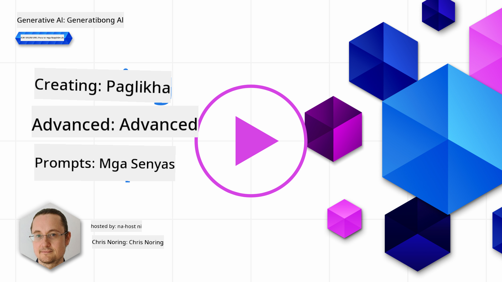

<!--
CO_OP_TRANSLATOR_METADATA:
{
  "original_hash": "ffb706de93ef518f31e0a675c66dfce1",
  "translation_date": "2025-10-17T13:22:35+00:00",
  "source_file": "05-advanced-prompts/README.md",
  "language_code": "tl"
}
-->
# Paglikha ng Advanced na Prompt

[](https://youtu.be/BAjzkaCdRok?si=NmUIyRf7-cDgbjtt)

Balikan natin ang ilang natutunan mula sa nakaraang kabanata:

> Ang _engineering_ ng prompt ay ang proseso kung saan **ginagabayan natin ang modelo patungo sa mas may kaugnayang mga sagot** sa pamamagitan ng pagbibigay ng mas kapaki-pakinabang na mga tagubilin o konteksto.

May dalawang hakbang din sa pagsulat ng mga prompt: ang pagbuo ng prompt sa pamamagitan ng pagbibigay ng kaugnay na konteksto, at ang pangalawang bahagi ay _optimization_, kung paano unti-unting pagbutihin ang prompt.

Sa puntong ito, mayroon na tayong pangunahing kaalaman kung paano magsulat ng mga prompt, ngunit kailangan nating mas lumalim. Sa kabanatang ito, mula sa pagsubok ng iba't ibang prompt, mauunawaan mo kung bakit mas mahusay ang isang prompt kaysa sa iba. Matutunan mo kung paano bumuo ng mga prompt gamit ang ilang pangunahing teknik na maaaring gamitin sa anumang LLM.

## Panimula

Sa kabanatang ito, tatalakayin natin ang mga sumusunod na paksa:

- Palawakin ang iyong kaalaman sa prompt engineering sa pamamagitan ng paggamit ng iba't ibang teknik sa iyong mga prompt.
- I-configure ang iyong mga prompt upang mag-iba ang output.

## Mga Layunin sa Pag-aaral

Pagkatapos makumpleto ang araling ito, magagawa mo ang sumusunod:

- Gamitin ang mga teknik sa prompt engineering na nagpapabuti sa resulta ng iyong mga prompt.
- Magsagawa ng prompting na maaaring mag-iba o maging deterministic.

## Prompt Engineering

Ang prompt engineering ay ang proseso ng paglikha ng mga prompt na magbibigay ng nais na resulta. Hindi lang ito basta pagsusulat ng text prompt. Ang prompt engineering ay hindi isang disiplina sa engineering, kundi isang hanay ng mga teknik na maaari mong gamitin upang makuha ang nais na resulta.

### Halimbawa ng Prompt

Tingnan natin ang isang simpleng prompt tulad nito:

> Gumawa ng 10 tanong tungkol sa heograpiya.

Sa prompt na ito, aktwal kang gumagamit ng iba't ibang teknik sa prompt.

Suriin natin ito.

- **Konteksto**, tinukoy mo na dapat ito ay tungkol sa "heograpiya".
- **Paglilimita sa output**, gusto mo ng hindi hihigit sa 10 tanong.

### Mga Limitasyon ng Simpleng Prompting

Maaaring makuha mo o hindi ang nais na resulta. Magkakaroon ka ng mga tanong na nabuo, ngunit ang heograpiya ay isang malawak na paksa at maaaring hindi mo makuha ang gusto mo dahil sa mga sumusunod na dahilan:

- **Malawak na paksa**, hindi mo alam kung ito ay tungkol sa mga bansa, kabisera, ilog, at iba pa.
- **Format**, paano kung gusto mo ang mga tanong na naka-format sa isang tiyak na paraan?

Tulad ng nakikita mo, maraming dapat isaalang-alang sa paglikha ng mga prompt.

Sa ngayon, nakita natin ang isang simpleng halimbawa ng prompt, ngunit ang generative AI ay may kakayahang higit pa upang makatulong sa mga tao sa iba't ibang tungkulin at industriya. Tuklasin natin ang ilang pangunahing teknik sa susunod.

### Mga Teknik sa Prompting

Una, kailangan nating maunawaan na ang prompting ay isang _emergent_ na katangian ng isang LLM, ibig sabihin, hindi ito isang tampok na built-in sa modelo kundi isang bagay na natutuklasan natin habang ginagamit ang modelo.

May ilang pangunahing teknik na maaari nating gamitin upang mag-prompt sa isang LLM. Tuklasin natin ang mga ito.

- **Zero-shot prompting**, ito ang pinaka-basic na uri ng prompting. Isang prompt lang na humihiling ng sagot mula sa LLM batay lamang sa training data nito.
- **Few-shot prompting**, ang ganitong uri ng prompting ay ginagabayan ang LLM sa pamamagitan ng pagbibigay ng 1 o higit pang mga halimbawa na maaari nitong gamitin upang makabuo ng sagot.
- **Chain-of-thought**, ang ganitong uri ng prompting ay nagtuturo sa LLM kung paano hatiin ang isang problema sa mga hakbang.
- **Generated knowledge**, upang mapabuti ang sagot ng isang prompt, maaari kang magbigay ng mga nabuo na katotohanan o kaalaman bilang karagdagan sa iyong prompt.
- **Least to most**, tulad ng chain-of-thought, ang teknik na ito ay tungkol sa paghahati ng isang problema sa serye ng mga hakbang at pagkatapos ay hilingin ang mga hakbang na ito na isagawa nang sunod-sunod.
- **Self-refine**, ang teknik na ito ay tungkol sa pag-critique sa output ng LLM at pagkatapos ay hilingin dito na pagbutihin.
- **Maieutic prompting**, ang layunin dito ay tiyakin na tama ang sagot ng LLM at hilingin dito na ipaliwanag ang iba't ibang bahagi ng sagot. Ito ay isang uri ng self-refine.

### Zero-shot Prompting

Ang istilo ng prompting na ito ay napakasimple, binubuo ito ng isang prompt lamang. Ang teknik na ito ay marahil ang ginagamit mo habang nagsisimula kang matuto tungkol sa LLMs. Narito ang isang halimbawa:

- Prompt: "Ano ang Algebra?"
- Sagot: "Ang Algebra ay isang sangay ng matematika na nag-aaral ng mga simbolo ng matematika at ang mga patakaran para sa pagmamanipula ng mga simbolong ito."

### Few-shot Prompting

Ang istilo ng prompting na ito ay tumutulong sa modelo sa pamamagitan ng pagbibigay ng ilang mga
Tulad ng nakikita mo, napaka-iba-iba ng mga resulta.

> Tandaan, may iba pang mga parameter na maaari mong baguhin upang maiba ang output, tulad ng top-k, top-p, repetition penalty, length penalty, at diversity penalty, ngunit ang mga ito ay labas sa saklaw ng kurikulum na ito.

## Magandang Praktika

Maraming mga praktika ang maaari mong gamitin upang makuha ang gusto mo. Makakahanap ka ng sarili mong estilo habang mas ginagamit mo ang prompting.

Bukod sa mga teknik na natalakay natin, may ilang magandang praktika na dapat isaalang-alang kapag nagpaprompt sa isang LLM.

Narito ang ilang magandang praktika na dapat isaalang-alang:

- **Tukuyin ang konteksto**. Mahalaga ang konteksto, mas marami kang maibibigay na detalye tulad ng domain, paksa, atbp., mas maganda ang resulta.
- Limitahan ang output. Kung gusto mo ng tiyak na bilang ng mga item o tiyak na haba, tukuyin ito.
- **Tukuyin ang ano at paano**. Tandaan na banggitin ang parehong ano ang gusto mo at paano mo ito gusto, halimbawa "Gumawa ng Python Web API na may mga ruta para sa products at customers, hatiin ito sa 3 file".
- **Gumamit ng mga template**. Madalas, gusto mong pagyamanin ang iyong mga prompt gamit ang data mula sa iyong kumpanya. Gumamit ng mga template para dito. Ang mga template ay maaaring may mga variable na papalitan mo ng aktwal na data.
- **Mag-spell nang tama**. Maaaring magbigay ang LLM ng tamang sagot, ngunit kung tama ang spelling mo, mas maganda ang sagot na makukuha mo.

## Takdang-Aralin

Narito ang code sa Python na nagpapakita kung paano bumuo ng simpleng API gamit ang Flask:

```python
from flask import Flask, request

app = Flask(__name__)

@app.route('/')
def hello():
    name = request.args.get('name', 'World')
    return f'Hello, {name}!'

if __name__ == '__main__':
    app.run()
```

Gumamit ng AI assistant tulad ng GitHub Copilot o ChatGPT at gamitin ang "self-refine" na teknik upang mapabuti ang code.

## Solusyon

Subukang lutasin ang takdang-aralin sa pamamagitan ng pagdaragdag ng angkop na mga prompt sa code.

> [!TIP]
> Bumuo ng prompt upang hilingin na mapabuti ito, magandang ideya na limitahan kung gaano karaming mga pagpapabuti. Maaari mo ring hilingin na mapabuti ito sa isang tiyak na paraan, halimbawa sa arkitektura, performance, seguridad, atbp.

[Solusyon](../../../05-advanced-prompts/python/aoai-solution.py)

## Pagsusuri ng Kaalaman

Bakit ko gagamitin ang chain-of-thought prompting? Magpakita ng 1 tamang sagot at 2 maling sagot.

1. Upang turuan ang LLM kung paano lutasin ang isang problema.
1. B, Upang turuan ang LLM na maghanap ng mga error sa code.
1. C, Upang utusan ang LLM na mag-isip ng iba't ibang solusyon.

A: 1, dahil ang chain-of-thought ay tungkol sa pagpapakita sa LLM kung paano lutasin ang isang problema sa pamamagitan ng pagbibigay nito ng serye ng mga hakbang, at mga katulad na problema at kung paano ito nalutas.

## 🚀 Hamon

Ginamit mo lang ang self-refine na teknik sa takdang-aralin. Kumuha ng anumang program na ginawa mo at isaalang-alang kung anong mga pagpapabuti ang gusto mong ilapat dito. Ngayon gamitin ang self-refine na teknik upang ilapat ang mga iminungkahing pagbabago. Ano ang tingin mo sa resulta, mas maganda o mas pangit?

## Magaling! Ipagpatuloy ang Iyong Pag-aaral

Matapos makumpleto ang araling ito, tingnan ang aming [Generative AI Learning collection](https://aka.ms/genai-collection?WT.mc_id=academic-105485-koreyst) upang patuloy na paunlarin ang iyong kaalaman sa Generative AI!

Pumunta sa Lesson 6 kung saan gagamitin natin ang ating kaalaman sa Prompt Engineering sa pamamagitan ng [pagbuo ng mga text generation apps](../06-text-generation-apps/README.md?WT.mc_id=academic-105485-koreyst)

---

**Paunawa**:  
Ang dokumentong ito ay isinalin gamit ang AI translation service na [Co-op Translator](https://github.com/Azure/co-op-translator). Bagamat sinisikap naming maging tumpak, pakatandaan na ang mga awtomatikong pagsasalin ay maaaring maglaman ng mga pagkakamali o hindi pagkakatugma. Ang orihinal na dokumento sa kanyang katutubong wika ang dapat ituring na opisyal na sanggunian. Para sa mahalagang impormasyon, inirerekomenda ang propesyonal na pagsasalin ng tao. Hindi kami mananagot sa anumang hindi pagkakaunawaan o maling interpretasyon na dulot ng paggamit ng pagsasaling ito.