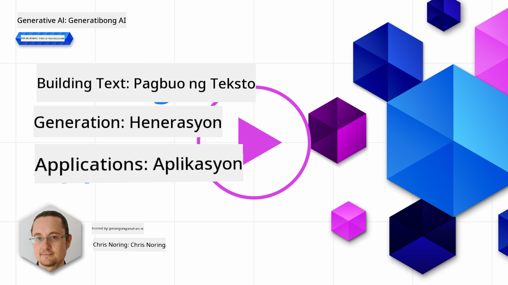

<!--
CO_OP_TRANSLATOR_METADATA:
{
  "original_hash": "00e33cd3ff945511446ecda4a9f8a828",
  "translation_date": "2025-10-17T13:20:36+00:00",
  "source_file": "06-text-generation-apps/README.md",
  "language_code": "tl"
}
-->
# Paggawa ng Mga Aplikasyon sa Pagbuo ng Teksto

[](https://youtu.be/0Y5Luf5sRQA?si=t_xVg0clnAI4oUFZ)

> _(I-click ang imahe sa itaas para mapanood ang video ng araling ito)_

Sa kurikulum na ito, nakita mo na may mga pangunahing konsepto tulad ng mga prompt at isang buong disiplina na tinatawag na "prompt engineering". Maraming mga tool na maaari mong gamitin tulad ng ChatGPT, Office 365, Microsoft Power Platform, at iba pa, na sumusuporta sa paggamit ng mga prompt upang makamit ang isang bagay.

Para maidagdag ang ganitong karanasan sa isang app, kailangan mong maunawaan ang mga konsepto tulad ng mga prompt, completions, at pumili ng library na gagamitin. Iyan mismo ang matututunan mo sa kabanatang ito.

## Panimula

Sa kabanatang ito, ikaw ay:

- Matututo tungkol sa openai library at ang mga pangunahing konsepto nito.
- Bubuo ng isang app para sa pagbuo ng teksto gamit ang openai.
- Mauunawaan kung paano gamitin ang mga konsepto tulad ng prompt, temperature, at tokens upang makabuo ng isang app para sa pagbuo ng teksto.

## Mga Layunin sa Pag-aaral

Sa pagtatapos ng araling ito, magagawa mong:

- Ipaliwanag kung ano ang isang app para sa pagbuo ng teksto.
- Bumuo ng isang app para sa pagbuo ng teksto gamit ang openai.
- I-configure ang iyong app upang gumamit ng mas kaunti o mas maraming tokens at baguhin ang temperature para sa iba't ibang output.

## Ano ang isang app para sa pagbuo ng teksto?

Karaniwan, kapag gumagawa ka ng isang app, mayroon itong uri ng interface tulad ng mga sumusunod:

- Batay sa command. Ang mga console app ay karaniwang mga app kung saan nagta-type ka ng command at ito ay gumagawa ng isang gawain. Halimbawa, ang `git` ay isang app na batay sa command.
- User interface (UI). Ang ilang mga app ay may graphical user interfaces (GUIs) kung saan nagki-click ka ng mga button, naglalagay ng teksto, pumipili ng mga opsyon, at iba pa.

### Limitado ang mga Console at UI app

Ihambing ito sa isang app na batay sa command kung saan nagta-type ka ng command:

- **Limitado ito**. Hindi ka maaaring mag-type ng kahit anong command, kundi ang mga sinusuportahan lamang ng app.
- **Tiyak sa wika**. Ang ilang mga app ay sumusuporta sa maraming wika, ngunit sa default, ang app ay ginawa para sa isang tiyak na wika, kahit na maaari kang magdagdag ng suporta sa iba pang wika.

### Mga Benepisyo ng Mga App para sa Pagbuo ng Teksto

Paano naiiba ang isang app para sa pagbuo ng teksto?

Sa isang app para sa pagbuo ng teksto, mas may kalayaan ka, hindi ka limitado sa isang set ng mga command o isang tiyak na input na wika. Sa halip, maaari mong gamitin ang natural na wika upang makipag-ugnayan sa app. Isa pang benepisyo ay dahil nakikipag-ugnayan ka na sa isang data source na sinanay sa isang malawak na corpus ng impormasyon, samantalang ang isang tradisyunal na app ay maaaring limitado sa kung ano ang nasa database.

### Ano ang maaari kong gawin gamit ang isang app para sa pagbuo ng teksto?

Maraming bagay ang maaari mong gawin. Halimbawa:

- **Isang chatbot**. Ang isang chatbot na sumasagot sa mga tanong tungkol sa mga paksa, tulad ng iyong kumpanya at mga produkto nito, ay maaaring maging angkop.
- **Helper**. Ang mga LLM ay mahusay sa mga bagay tulad ng pagbuo ng buod ng teksto, pagkuha ng mga insight mula sa teksto, paggawa ng teksto tulad ng mga resume, at iba pa.
- **Code assistant**. Depende sa modelong pangwika na ginagamit mo, maaari kang gumawa ng isang code assistant na tumutulong sa iyo na magsulat ng code. Halimbawa, maaari mong gamitin ang isang produkto tulad ng GitHub Copilot pati na rin ang ChatGPT upang tumulong sa pagsusulat ng code.

## Paano ako magsisimula?

Kailangan mong maghanap ng paraan upang makipag-ugnayan sa isang LLM na karaniwang nangangailangan ng dalawang diskarte:

- Gumamit ng API. Dito, gumagawa ka ng mga web request gamit ang iyong prompt at nakakakuha ng generated na teksto pabalik.
- Gumamit ng library. Ang mga library ay tumutulong sa encapsulate ng mga tawag sa API at ginagawang mas madali ang paggamit.

## Mga Library/SDK

May ilang kilalang library para sa pakikipag-ugnayan sa mga LLM tulad ng:

- **openai**, ang library na ito ay nagpapadali sa pagkonekta sa iyong model at pagpapadala ng mga prompt.

Mayroon ding mga library na gumagana sa mas mataas na antas tulad ng:

- **Langchain**. Ang Langchain ay kilala at sumusuporta sa Python.
- **Semantic Kernel**. Ang Semantic Kernel ay isang library ng Microsoft na sumusuporta sa mga wikang C#, Python, at Java.

## Unang App gamit ang openai

Tingnan natin kung paano tayo makakagawa ng unang app, kung anong mga library ang kailangan natin, kung gaano karami ang kinakailangan, at iba pa.

### I-install ang openai

Maraming library ang magagamit para sa pakikipag-ugnayan sa OpenAI o Azure OpenAI. Posibleng gumamit ng iba't ibang programming languages tulad ng C#, Python, JavaScript, Java, at iba pa. Pinili naming gamitin ang `openai` Python library, kaya gagamit kami ng `pip` upang i-install ito.

```bash
pip install openai
```

### Gumawa ng resource

Kailangan mong gawin ang mga sumusunod na hakbang:

- Gumawa ng account sa Azure [https://azure.microsoft.com/free/](https://azure.microsoft.com/free/?WT.mc_id=academic-105485-koreyst).
- Magkaroon ng access sa Azure OpenAI. Pumunta sa [https://learn.microsoft.com/azure/ai-services/openai/overview#how-do-i-get-access-to-azure-openai](https://learn.microsoft.com/azure/ai-services/openai/overview#how-do-i-get-access-to-azure-openai?WT.mc_id=academic-105485-koreyst) at mag-request ng access.

  > [!NOTE]
  > Sa oras ng pagsulat, kailangan mong mag-apply para sa access sa Azure OpenAI.

- I-install ang Python <https://www.python.org/>
- Gumawa ng Azure OpenAI Service resource. Tingnan ang gabay na ito kung paano [gumawa ng resource](https://learn.microsoft.com/azure/ai-services/openai/how-to/create-resource?pivots=web-portal?WT.mc_id=academic-105485-koreyst).

### Hanapin ang API key at endpoint

Sa puntong ito, kailangan mong sabihin sa iyong `openai` library kung anong API key ang gagamitin. Upang hanapin ang iyong API key, pumunta sa seksyong "Keys and Endpoint" ng iyong Azure OpenAI resource at kopyahin ang "Key 1" value.


Ngayon na mayroon ka nang impormasyong ito, magbigay tayo ng instruksyon sa mga library na gamitin ito.

> [!NOTE]
> Mahalaga na ihiwalay ang iyong API key mula sa iyong code. Maaari mo itong gawin sa pamamagitan ng paggamit ng environment variables.
>
> - Itakda ang environment variable `OPENAI_API_KEY` sa iyong API key.
>   `export OPENAI_API_KEY='sk-...'`

### I-setup ang configuration ng Azure

Kung gumagamit ka ng Azure OpenAI, narito kung paano i-setup ang configuration:

```python
openai.api_type = 'azure'
openai.api_key = os.environ["OPENAI_API_KEY"]
openai.api_version = '2023-05-15'
openai.api_base = os.getenv("API_BASE")
```

Sa itaas, itinatakda natin ang mga sumusunod:

- `api_type` sa `azure`. Sinasabi nito sa library na gamitin ang Azure OpenAI at hindi ang OpenAI.
- `api_key`, ito ang iyong API key na matatagpuan sa Azure Portal.
- `api_version`, ito ang bersyon ng API na nais mong gamitin. Sa oras ng pagsulat, ang pinakabagong bersyon ay `2023-05-15`.
- `api_base`, ito ang endpoint ng API. Maaari mo itong makita sa Azure Portal katabi ng iyong API key.

> [!NOTE] > Ang `os.getenv` ay isang function na nagbabasa ng environment variables. Maaari mo itong gamitin upang basahin ang environment variables tulad ng `OPENAI_API_KEY` at `API_BASE`. Itakda ang mga environment variables na ito sa iyong terminal o sa pamamagitan ng paggamit ng library tulad ng `dotenv`.

## Bumuo ng Teksto

Ang paraan upang bumuo ng teksto ay ang paggamit ng `Completion` class. Narito ang isang halimbawa:

```python
prompt = "Complete the following: Once upon a time there was a"

completion = openai.Completion.create(model="davinci-002", prompt=prompt)
print(completion.choices[0].text)
```

Sa code sa itaas, gumagawa tayo ng completion object at ipinapasa ang model na nais nating gamitin at ang prompt. Pagkatapos, ipiniprint natin ang generated na teksto.

### Chat completions

Sa ngayon, nakita mo kung paano natin ginagamit ang `Completion` upang bumuo ng teksto. Ngunit may isa pang class na tinatawag na `ChatCompletion` na mas angkop para sa mga chatbot. Narito ang isang halimbawa ng paggamit nito:

```python
import openai

openai.api_key = "sk-..."

completion = openai.ChatCompletion.create(model="gpt-3.5-turbo", messages=[{"role": "user", "content": "Hello world"}])
print(completion.choices[0].message.content)
```

Mas marami pang impormasyon tungkol sa functionality na ito sa susunod na kabanata.

## Ehersisyo - ang iyong unang app para sa pagbuo ng teksto

Ngayon na natutunan natin kung paano i-setup at i-configure ang openai, oras na upang bumuo ng iyong unang app para sa pagbuo ng teksto. Upang bumuo ng iyong app, sundin ang mga hakbang na ito:

1. Gumawa ng virtual environment at i-install ang openai:

   ```bash
   python -m venv venv
   source venv/bin/activate
   pip install openai
   ```

   > [!NOTE]
   > Kung gumagamit ka ng Windows, i-type ang `venv\Scripts\activate` sa halip na `source venv/bin/activate`.

   > [!NOTE]
   > Hanapin ang iyong Azure OpenAI key sa pamamagitan ng pagpunta sa [https://portal.azure.com/](https://portal.azure.com/?WT.mc_id=academic-105485-koreyst) at hanapin ang `Open AI` at piliin ang `Open AI resource` at pagkatapos ay piliin ang `Keys and Endpoint` at kopyahin ang `Key 1` value.

1. Gumawa ng _app.py_ file at bigyan ito ng sumusunod na code:

   ```python
   import openai

   openai.api_key = "<replace this value with your open ai key or Azure OpenAI key>"

   openai.api_type = 'azure'
   openai.api_version = '2023-05-15'
   openai.api_base = "<endpoint found in Azure Portal where your API key is>"
   deployment_name = "<deployment name>"

   # add your completion code
   prompt = "Complete the following: Once upon a time there was a"
   messages = [{"role": "user", "content": prompt}]

   # make completion
   completion = openai.chat.completions.create(model=deployment_name, messages=messages)

   # print response
   print(completion.choices[0].message.content)
   ```

   > [!NOTE]
   > Kung gumagamit ka ng Azure OpenAI, kailangan mong itakda ang `api_type` sa `azure` at itakda ang `api_key` sa iyong Azure OpenAI key.

   Makikita mo ang output na tulad ng sumusunod:

   ```output
    very unhappy _____.

   Once upon a time there was a very unhappy mermaid.
   ```

## Iba't ibang uri ng mga prompt, para sa iba't ibang bagay

Ngayon nakita mo kung paano bumuo ng teksto gamit ang isang prompt. Mayroon ka nang program na tumatakbo na maaari mong baguhin at palitan upang bumuo ng iba't ibang uri ng teksto.

Ang mga prompt ay maaaring gamitin para sa iba't ibang gawain. Halimbawa:

- **Bumuo ng uri ng teksto**. Halimbawa, maaari kang bumuo ng isang tula, mga tanong para sa isang quiz, at iba pa.
- **Maghanap ng impormasyon**. Maaari mong gamitin ang mga prompt upang maghanap ng impormasyon tulad ng halimbawa 'Ano ang ibig sabihin ng CORS sa web development?'.
- **Bumuo ng code**. Maaari mong gamitin ang mga prompt upang bumuo ng code, halimbawa paggawa ng regular expression na ginagamit upang i-validate ang mga email o bakit hindi bumuo ng isang buong programa, tulad ng isang web app?

## Isang mas praktikal na paggamit: isang recipe generator

Isipin mo na mayroon kang mga sangkap sa bahay at gusto mong magluto ng isang bagay. Para dito, kailangan mo ng recipe. Isang paraan upang makahanap ng mga recipe ay ang paggamit ng search engine o maaari kang gumamit ng isang LLM para dito.

Maaari kang magsulat ng prompt tulad ng:

> "Ipakita sa akin ang 5 recipe para sa isang ulam na may mga sumusunod na sangkap: manok, patatas, at karot. Per recipe, ilista ang lahat ng mga sangkap na ginamit"

Batay sa prompt sa itaas, maaaring makakuha ka ng sagot na katulad ng:

```output
1. Roasted Chicken and Vegetables:
Ingredients:
- 4 chicken thighs
- 2 potatoes, cut into cubes
- 2 carrots, cut into cubes
- 2 tablespoons olive oil
- 2 cloves garlic, minced
- 1 teaspoon dried thyme
- 1 teaspoon dried oregano
- Salt and pepper, to taste

2. Chicken and Potato Stew:
Ingredients:
- 2 tablespoons olive oil
- 1 onion, diced
- 2 cloves garlic, minced
- 2 chicken breasts, cut into cubes
- 2 potatoes, cut into cubes
- 2 carrots, cut into cubes
- 1 teaspoon dried oregano
- 1 teaspoon dried thyme
- 1 cup chicken broth
- Salt and pepper, to taste

3. Chicken and Potato Bake:
Ingredients:
- 2 tablespoons olive oil
- 2 chicken breasts, cut into cubes
- 2 potatoes, cut into cubes
- 2 carrots, cut into cubes
- 1 onion, diced
- 2 cloves garlic, minced
- 1 teaspoon dried oregano
- 1 teaspoon dried thyme
- 1 cup chicken broth
- Salt and pepper, to taste

4. Chicken and Potato Soup:
Ingredients:
- 2 tablespoons olive oil
- 1 onion, diced
- 2 cloves garlic, minced
- 2 chicken breasts, cut into cubes
- 2 potatoes, cut into cubes
- 2 carrots, cut into cubes
- 1 teaspoon dried oregano
- 1 teaspoon dried thyme
- 4 cups chicken broth
- Salt and pepper, to taste

5. Chicken and Potato Hash:
Ingredients:
- 2 tablespoons olive oil
- 2 chicken breasts, cut into cubes
- 2 potatoes, cut into cubes
- 2 carrots, cut into cubes
- 1 onion, diced
- 2 cloves garlic, minced
- 1 teaspoon dried oregano
```

Maganda ang resulta na ito, alam ko na kung ano ang lulutuin. Sa puntong ito, ang mga maaaring maging kapaki-pakinabang na pagpapabuti ay:

- Pag-filter ng mga sangkap na hindi ko gusto o allergic ako.
- Gumawa ng shopping list, kung sakaling wala ako ng lahat ng mga sangkap sa bahay.

Para sa mga kaso sa itaas, magdagdag tayo ng karagdagang prompt:

> "Pakitanggal ang mga recipe na may bawang dahil allergic ako at palitan ito ng ibang bagay. Gayundin, pakigawa ng shopping list para sa mga recipe, isinasaalang-alang na mayroon na akong manok, patatas, at karot sa bahay."

Ngayon mayroon kang bagong resulta, na:

```output
1. Roasted Chicken and Vegetables:
Ingredients:
- 4 chicken thighs
- 2 potatoes, cut into cubes
- 2 carrots, cut into cubes
- 2 tablespoons olive oil
- 1 teaspoon dried thyme
- 1 teaspoon dried oregano
- Salt and pepper, to taste

2. Chicken and Potato Stew:
Ingredients:
- 2 tablespoons olive oil
- 1 onion, diced
- 2 chicken breasts, cut into cubes
- 2 potatoes, cut into cubes
- 2 carrots, cut into cubes
- 1 teaspoon dried oregano
- 1 teaspoon dried thyme
- 1 cup chicken broth
- Salt and pepper, to taste

3. Chicken and Potato Bake:
Ingredients:
- 2 tablespoons olive oil
- 2 chicken breasts, cut into cubes
- 2 potatoes, cut into cubes
- 2 carrots, cut into cubes
- 1 onion, diced
- 1 teaspoon dried oregano
- 1 teaspoon dried thyme
- 1 cup chicken broth
- Salt and pepper, to taste

4. Chicken and Potato Soup:
Ingredients:
- 2 tablespoons olive oil
- 1 onion, diced
- 2 chicken breasts, cut into cubes
- 2 potatoes, cut into cubes
- 2 carrots, cut into cubes
- 1 teaspoon dried oregano
- 1 teaspoon dried thyme
- 4 cups chicken broth
- Salt and pepper, to taste

5. Chicken and Potato Hash:
Ingredients:
- 2 tablespoons olive oil
- 2 chicken breasts, cut into cubes
- 2 potatoes, cut into cubes
- 2 carrots, cut into cubes
- 1 onion, diced
- 1 teaspoon dried oregano

Shopping List:
- Olive oil
- Onion
- Thyme
- Oregano
- Salt
- Pepper
```

Narito ang iyong limang recipe, walang bawang na binanggit at mayroon ka ring shopping list na isinasaalang-alang kung ano ang mayroon ka na sa bahay.

## Ehersisyo - gumawa ng recipe generator

Ngayon na naglaro tayo ng isang senaryo, magsulat tayo ng code upang tumugma sa ipinakitang senaryo. Upang gawin ito, sundin ang mga hakbang na ito:

1. Gamitin ang umiiral na _app.py_ file bilang panimulang punto
1. Hanapin ang `prompt` variable at palitan ang code nito ng sumusunod:

   ```python
   prompt = "Show me 5 recipes for a dish with the following ingredients: chicken, potatoes, and carrots. Per recipe, list all the ingredients used"
   ```

   Kung ngayon ay patakbuhin mo ang code, makikita mo ang output na katulad ng:

   ```output
   -Chicken Stew with Potatoes and Carrots: 3 tablespoons oil, 1 onion, chopped, 2 cloves garlic, minced, 1 carrot, peeled and chopped, 1 potato, peeled and chopped, 1 bay leaf, 1 thyme sprig, 1/2 teaspoon salt, 1/4 teaspoon black pepper, 1 1/2 cups chicken broth, 1/2 cup dry white wine, 2 tablespoons chopped fresh parsley, 2 tablespoons unsalted butter, 1 1/2 pounds boneless, skinless chicken thighs, cut into 1-inch pieces
   -Oven-Roasted Chicken with Potatoes and Carrots: 3 tablespoons extra-virgin olive oil, 1 tablespoon Dijon mustard, 1 tablespoon chopped fresh rosemary, 1 tablespoon chopped fresh thyme, 4 cloves garlic, minced, 1 1/2 pounds small red potatoes, quartered, 1 1/2 pounds carrots, quartered lengthwise, 1/2 teaspoon salt, 1/4 teaspoon black pepper, 1 (4-pound) whole chicken
   -Chicken, Potato, and Carrot Casserole: cooking spray, 1 large onion, chopped, 2 cloves garlic, minced, 1 carrot, peeled and shredded, 1 potato, peeled and shredded, 1/2 teaspoon dried thyme leaves, 1/4 teaspoon salt, 1/4 teaspoon black pepper, 2 cups fat-free, low-sodium chicken broth, 1 cup frozen peas, 1/4 cup all-purpose flour, 1 cup 2% reduced-fat milk, 1/4 cup grated Parmesan cheese

   -One Pot Chicken and Potato Dinner: 2 tablespoons olive oil, 1 pound boneless, skinless chicken thighs, cut into 1-inch pieces, 1 large onion, chopped, 3 cloves garlic, minced, 1 carrot, peeled and chopped, 1 potato, peeled and chopped, 1 bay leaf, 1 thyme sprig, 1/2 teaspoon salt, 1/4 teaspoon black pepper, 2 cups chicken broth, 1/2 cup dry white wine

   -Chicken, Potato, and Carrot Curry: 1 tablespoon vegetable oil, 1 large onion, chopped, 2 cloves garlic, minced, 1 carrot, peeled and chopped, 1 potato, peeled and chopped, 1 teaspoon ground coriander, 1 teaspoon ground cumin, 1/2 teaspoon ground turmeric, 1/2 teaspoon ground ginger, 1/4 teaspoon cayenne pepper, 2 cups chicken broth, 1/2 cup dry white wine, 1 (15-ounce) can chickpeas, drained and rinsed, 1/2 cup raisins, 1/2 cup chopped fresh cilantro
   ```

   > NOTE, ang iyong LLM ay hindi deterministic, kaya maaaring makakuha ka ng iba't ibang resulta sa tuwing patatakbuhin mo ang programa.

   Magaling, tingnan natin kung paano natin mapapabuti ang mga bagay. Upang mapabuti ang mga bagay, nais nating tiyakin na ang code ay flexible, kaya ang mga sangkap at bilang ng mga recipe ay maaaring mapabuti at mabago.

1. Palitan ang code sa sumusunod na paraan:

   ```python
   no_recipes = input("No of recipes (for example, 5): ")

   ingredients = input("List of ingredients (for example, chicken, potatoes, and carrots): ")

   # interpolate the number of recipes into the prompt an ingredients
   prompt = f"Show me {no_recipes} recipes for a dish with the following ingredients: {ingredients}. Per recipe, list all the ingredients used"
   ```

   Ang pag-test run ng code ay maaaring magmukhang ganito:

   ```output
   No of recipes (for example, 5): 3
   List of ingredients (for example, chicken, potatoes, and carrots): milk,strawberries

   -Strawberry milk shake: milk, strawberries, sugar, vanilla extract, ice cubes
   -Strawberry shortcake: milk, flour, baking powder, sugar, salt, unsalted butter, strawberries, whipped cream
   -Strawberry milk: milk, strawberries, sugar, vanilla extract
   ```

### Pagbutihin sa pamamagitan ng pagdaragdag ng filter at shopping list

Ngayon mayroon na tayong gumaganang app na may kakayahang gumawa ng mga recipe at ito ay flexible dahil umaasa ito sa mga input mula sa user, parehong sa bilang ng mga recipe pati na rin sa mga sangkap na ginamit.

Upang higit pang mapabuti ito, nais nating idagdag ang mga sumusunod:

- **Pag-filter ng mga sangkap**. Nais nating magawang i-filter ang mga sangkap na hindi natin gusto o allergic tayo. Upang maisakatuparan ang pagbabagong ito, maaari nating i-edit ang umiiral na prompt at magdagdag ng kondisyon ng filter sa dulo nito tulad ng:

  ```python
  filter = input("Filter (for example, vegetarian, vegan, or gluten-free): ")

  prompt = f"Show me {no_recipes} recipes for a dish with the following ingredients: {ingredients}. Per recipe, list all the ingredients used, no {filter}"
  ```

  Sa itaas, idinagdag natin ang `{filter}` sa dulo ng prompt at kinukuha rin natin ang filter value mula sa user.

  Ang isang halimbawa ng input ng pagpapatakbo ng programa ay maaaring magmukhang ganito:

  ```output
  No of recipes (for example, 5): 3
  List of ingredients (for example, chicken, potatoes, and carrots): onion,milk
  Filter (for example, vegetarian, vegan, or gluten-free): no milk

  1. French Onion Soup

  Ingredients:

  -1 large onion, sliced
  -3 cups beef broth
  -1 cup milk
  -6 slices french bread
  -1/4 cup shredded Parmesan cheese
  -1 tablespoon butter
  -1 teaspoon dried thyme
  -1/4 teaspoon salt
  -1/4 teaspoon black pepper

  Instructions:

  1. In a large pot, sauté onions in butter until golden brown.
  2. Add beef broth, milk, thyme, salt, and pepper. Bring to a boil.
  3. Reduce heat and simmer for 10 minutes.
  4. Place french bread slices on soup bowls.
  5. Ladle soup over bread.
  6. Sprinkle with Parmesan cheese.

  2. Onion and Potato Soup

  Ingredients:

  -1 large onion, chopped
  -2 cups potatoes, diced
  -3 cups vegetable broth
  -1 cup milk
  -1/4 teaspoon black pepper

  Instructions:

  1. In a large pot, sauté onions in butter until golden brown.
  2. Add potatoes, vegetable broth, milk, and pepper. Bring to a boil.
  3. Reduce heat and simmer for 10 minutes.
  4. Serve hot.

  3. Creamy Onion Soup

  Ingredients:

  -1 large onion, chopped
  -3 cups vegetable broth
  -1 cup milk
  -1/4 teaspoon black pepper
  -1/4 cup all-purpose flour
  -1/2 cup shredded Parmesan cheese

  Instructions:

  1. In a large pot, sauté onions in butter until golden brown.
  2. Add vegetable broth, milk, and pepper. Bring to a boil.
  3. Reduce heat and simmer for 10 minutes.
  4. In a small bowl, whisk together flour and Parmesan cheese until smooth.
  5. Add to soup and simmer for an additional 5 minutes, or until soup has thickened.
  ```

  Tulad ng nakikita mo, ang anumang recipe na may gatas ay na-filter. Ngunit, kung ikaw ay lactose intolerant, maaaring nais mong i-filter ang mga recipe na may keso rin, kaya't may pangangailangan na maging malinaw.

- **Gumawa ng shopping list**. Nais nating gumawa ng shopping list, isinasaalang-alang kung ano ang mayroon na tayo sa bahay.

  Para sa functionality na ito, maaari nating subukang lutasin ang lahat sa isang prompt o hatiin ito sa dalawang prompt. Subukan natin ang huling diskarte. Dito, iminumungkahi ang pagdaragdag ng karagdagang prompt, ngunit para gumana ito, kailangan nating idagdag ang resulta ng naunang prompt bilang konteksto sa susunod na prompt.
Hanapin ang bahagi ng code na nagpi-print ng resulta mula sa unang prompt at idagdag ang sumusunod na code sa ibaba:

  ```python
  old_prompt_result = completion.choices[0].message.content
  prompt = "Produce a shopping list for the generated recipes and please don't include ingredients that I already have."

  new_prompt = f"{old_prompt_result} {prompt}"
  messages = [{"role": "user", "content": new_prompt}]
  completion = openai.Completion.create(engine=deployment_name, messages=messages, max_tokens=1200)

  # print response
  print("Shopping list:")
  print(completion.choices[0].message.content)
  ```

Tandaan ang mga sumusunod:

1. Gumagawa tayo ng bagong prompt sa pamamagitan ng pagdaragdag ng resulta mula sa unang prompt sa bagong prompt:

     ```python
     new_prompt = f"{old_prompt_result} {prompt}"
     ```

1. Gumagawa tayo ng bagong request, ngunit isinasaalang-alang din ang bilang ng mga token na ginamit sa unang prompt, kaya sa pagkakataong ito sinasabi natin na `max_tokens` ay 1200.

     ```python
     completion = openai.Completion.create(engine=deployment_name, prompt=new_prompt, max_tokens=1200)
     ```

   Kapag sinubukan ang code na ito, makakakuha tayo ng sumusunod na output:

     ```output
     No of recipes (for example, 5): 2
     List of ingredients (for example, chicken, potatoes, and carrots): apple,flour
     Filter (for example, vegetarian, vegan, or gluten-free): sugar


     -Apple and flour pancakes: 1 cup flour, 1/2 tsp baking powder, 1/2 tsp baking soda, 1/4 tsp salt, 1 tbsp sugar, 1 egg, 1 cup buttermilk or sour milk, 1/4 cup melted butter, 1 Granny Smith apple, peeled and grated
     -Apple fritters: 1-1/2 cups flour, 1 tsp baking powder, 1/4 tsp salt, 1/4 tsp baking soda, 1/4 tsp nutmeg, 1/4 tsp cinnamon, 1/4 tsp allspice, 1/4 cup sugar, 1/4 cup vegetable shortening, 1/4 cup milk, 1 egg, 2 cups shredded, peeled apples
     Shopping list:
     -Flour, baking powder, baking soda, salt, sugar, egg, buttermilk, butter, apple, nutmeg, cinnamon, allspice
     ```

## Pagbutihin ang iyong setup

Ang meron tayo sa ngayon ay code na gumagana, ngunit may ilang mga pag-aayos na dapat gawin upang higit pang mapabuti ito. Ilan sa mga bagay na dapat gawin ay:

- **Paghiwalayin ang mga lihim mula sa code**, tulad ng API key. Ang mga lihim ay hindi dapat nasa code at dapat itago sa isang ligtas na lokasyon. Upang paghiwalayin ang mga lihim mula sa code, maaari nating gamitin ang environment variables at mga library tulad ng `python-dotenv` upang i-load ang mga ito mula sa isang file. Ganito ang magiging hitsura nito sa code:

  1. Gumawa ng `.env` file na may sumusunod na nilalaman:

     ```bash
     OPENAI_API_KEY=sk-...
     ```

   > Tandaan, para sa Azure, kailangan mong itakda ang mga sumusunod na environment variables:

     ```bash
     OPENAI_API_TYPE=azure
     OPENAI_API_VERSION=2023-05-15
     OPENAI_API_BASE=<replace>
     ```

   Sa code, maaari mong i-load ang environment variables tulad nito:

     ```python
     from dotenv import load_dotenv

     load_dotenv()

     openai.api_key = os.environ["OPENAI_API_KEY"]
     ```

- **Isang salita tungkol sa haba ng token**. Dapat nating isaalang-alang kung gaano karaming mga token ang kailangan upang makabuo ng text na gusto natin. Ang mga token ay may halaga, kaya kung maaari, dapat tayong maging matipid sa bilang ng mga token na ginagamit. Halimbawa, maaari ba nating baguhin ang prompt upang mas kaunti ang magamit na mga token?

  Upang baguhin ang mga token na ginagamit, maaari mong gamitin ang `max_tokens` parameter. Halimbawa, kung gusto mong gumamit ng 100 token, gagawin mo ito:

  ```python
  completion = client.chat.completions.create(model=deployment, messages=messages, max_tokens=100)
  ```

- **Pag-eksperimento sa temperature**. Ang temperature ay isang bagay na hindi pa natin nababanggit ngunit mahalaga sa konteksto ng kung paano gumagana ang ating programa. Kapag mas mataas ang temperature value, mas random ang magiging output. Sa kabaligtaran, kapag mas mababa ang temperature value, mas predictable ang output. Isaalang-alang kung gusto mo ng variation sa iyong output o hindi.

  Upang baguhin ang temperature, maaari mong gamitin ang `temperature` parameter. Halimbawa, kung gusto mong gumamit ng temperature na 0.5, gagawin mo ito:

  ```python
  completion = client.chat.completions.create(model=deployment, messages=messages, temperature=0.5)
  ```

  > Tandaan, mas malapit sa 1.0, mas iba-iba ang output.

## Gawain

Para sa gawain na ito, maaari kang pumili kung ano ang gagawin.

Narito ang ilang mga mungkahi:

- Ayusin ang recipe generator app upang higit pang mapabuti ito. Subukan ang iba't ibang temperature values, at ang mga prompt upang makita kung ano ang magagawa mo.
- Gumawa ng "study buddy". Ang app na ito ay dapat kayang sumagot ng mga tanong tungkol sa isang paksa, halimbawa Python, maaari kang magkaroon ng mga prompt tulad ng "Ano ang isang tiyak na paksa sa Python?", o maaari kang magkaroon ng prompt na nagsasabing, ipakita sa akin ang code para sa isang tiyak na paksa, atbp.
- History bot, gawing buhay ang kasaysayan, utusan ang bot na maglaro bilang isang tiyak na karakter sa kasaysayan at tanungin ito tungkol sa kanyang buhay at panahon.

## Solusyon

### Study buddy

Narito ang isang panimulang prompt, tingnan kung paano mo ito magagamit at baguhin ayon sa gusto mo.

```text
- "You're an expert on the Python language

    Suggest a beginner lesson for Python in the following format:

    Format:
    - concepts:
    - brief explanation of the lesson:
    - exercise in code with solutions"
```

### History bot

Narito ang ilang mga prompt na maaari mong gamitin:

```text
- "You are Abe Lincoln, tell me about yourself in 3 sentences, and respond using grammar and words like Abe would have used"
- "You are Abe Lincoln, respond using grammar and words like Abe would have used:

   Tell me about your greatest accomplishments, in 300 words"
```

## Pagsusuri ng Kaalaman

Ano ang ginagawa ng konsepto ng temperature?

1. Kinokontrol nito kung gaano ka-random ang output.
1. Kinokontrol nito kung gaano kalaki ang response.
1. Kinokontrol nito kung gaano karaming mga token ang ginagamit.

## 🚀 Hamon

Kapag gumagawa ng gawain, subukang baguhin ang temperature, subukang itakda ito sa 0, 0.5, at 1. Tandaan na ang 0 ang pinaka hindi iba-iba at ang 1 ang pinaka iba-iba. Anong value ang pinakamahusay para sa iyong app?

## Magaling! Ipagpatuloy ang Iyong Pag-aaral

Pagkatapos makumpleto ang araling ito, tingnan ang aming [Generative AI Learning collection](https://aka.ms/genai-collection?WT.mc_id=academic-105485-koreyst) upang patuloy na paunlarin ang iyong kaalaman sa Generative AI!

Pumunta sa Lesson 7 kung saan tatalakayin natin kung paano [gumawa ng chat applications](../07-building-chat-applications/README.md?WT.mc_id=academic-105485-koreyst)!

---

**Paunawa**:  
Ang dokumentong ito ay isinalin gamit ang AI translation service na [Co-op Translator](https://github.com/Azure/co-op-translator). Bagama't sinisikap naming maging tumpak, pakitandaan na ang mga awtomatikong pagsasalin ay maaaring maglaman ng mga pagkakamali o hindi pagkakatugma. Ang orihinal na dokumento sa kanyang katutubong wika ang dapat ituring na opisyal na pinagmulan. Para sa mahalagang impormasyon, inirerekomenda ang propesyonal na pagsasalin ng tao. Hindi kami mananagot sa anumang hindi pagkakaunawaan o maling interpretasyon na dulot ng paggamit ng pagsasaling ito.