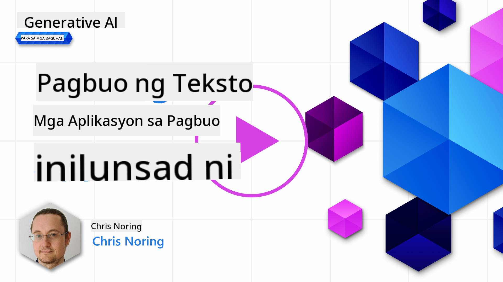

<!--
CO_OP_TRANSLATOR_METADATA:
{
  "original_hash": "ce8224073b86b728ed52b19bed7932fd",
  "translation_date": "2025-07-09T12:04:49+00:00",
  "source_file": "06-text-generation-apps/README.md",
  "language_code": "tl"
}
-->
# Pagbuo ng Mga Aplikasyon para sa Text Generation

[](https://aka.ms/gen-ai-lesson6-gh?WT.mc_id=academic-105485-koreyst)

> _(I-click ang larawan sa itaas para mapanood ang video ng araling ito)_

Sa mga nakaraang bahagi ng kurikulum na ito, nakita mo na may mga pangunahing konsepto tulad ng prompts at pati na rin ang isang buong disiplina na tinatawag na "prompt engineering". Maraming mga tool na maaari mong gamitin tulad ng ChatGPT, Office 365, Microsoft Power Platform at iba pa, na sumusuporta sa paggamit ng prompts upang makamit ang isang layunin.

Para maidagdag mo ang ganitong karanasan sa isang app, kailangan mong maunawaan ang mga konsepto tulad ng prompts, completions at pumili ng library na gagamitin. Iyan mismo ang matututunan mo sa kabanatang ito.

## Panimula

Sa kabanatang ito, matututuhan mo ang mga sumusunod:

- Alamin ang tungkol sa openai library at ang mga pangunahing konsepto nito.
- Gumawa ng isang text generation app gamit ang openai.
- Unawain kung paano gamitin ang mga konsepto tulad ng prompt, temperature, at tokens para makabuo ng isang text generation app.

## Mga Layunin sa Pagkatuto

Sa pagtatapos ng araling ito, magagawa mong:

- Ipaliwanag kung ano ang isang text generation app.
- Gumawa ng isang text generation app gamit ang openai.
- I-configure ang iyong app upang gumamit ng mas marami o mas kaunting tokens at baguhin ang temperature para sa iba't ibang resulta.

## Ano ang text generation app?

Karaniwan kapag gumagawa ka ng app, mayroong isang uri ng interface tulad ng mga sumusunod:

- Command-based. Ang mga console apps ay mga tipikal na app kung saan nagta-type ka ng command at ito ay nagsasagawa ng isang gawain. Halimbawa, ang `git` ay isang command-based app.
- User interface (UI). Ang ilang mga app ay may graphical user interfaces (GUIs) kung saan nagki-click ka ng mga button, naglalagay ng teksto, pumipili ng mga opsyon at iba pa.

### Limitado ang Console at UI apps

Ihambing ito sa isang command-based app kung saan nagta-type ka ng command:

- **Limitado ito**. Hindi ka basta-basta makakapag-type ng kahit anong command, kundi yung mga sinusuportahan lang ng app.
- **Naka-sentro sa isang wika**. May ilang app na sumusuporta sa maraming wika, pero sa default, ang app ay ginawa para sa isang partikular na wika, kahit na maaari kang magdagdag ng suporta para sa iba pang wika.

### Mga Benepisyo ng text generation apps

Paano naman naiiba ang isang text generation app?

Sa isang text generation app, mas malawak ang iyong kalayaan, hindi ka limitado sa isang set ng mga command o isang partikular na input na wika. Sa halip, maaari kang gumamit ng natural na wika para makipag-ugnayan sa app. Isa pang benepisyo ay dahil nakikipag-ugnayan ka na sa isang data source na na-train sa napakalawak na koleksyon ng impormasyon, samantalang ang tradisyunal na app ay maaaring limitado lamang sa laman ng isang database.

### Ano ang maaari kong gawin gamit ang isang text generation app?

Maraming bagay ang maaari mong gawin. Halimbawa:

- **Chatbot**. Isang chatbot na sumasagot sa mga tanong tungkol sa mga paksa, tulad ng iyong kumpanya at mga produkto nito, ay maaaring maging angkop.
- **Tulong**. Magaling ang LLMs sa mga bagay tulad ng pagsasummarize ng teksto, pagkuha ng mga insight mula sa teksto, paggawa ng mga teksto tulad ng resume at iba pa.
- **Code assistant**. Depende sa language model na gagamitin mo, maaari kang gumawa ng code assistant na tutulong sa iyo sa pagsusulat ng code. Halimbawa, maaari mong gamitin ang mga produkto tulad ng GitHub Copilot pati na rin ang ChatGPT para tulungan kang magsulat ng code.

## Paano ako makakapagsimula?

Kailangan mong humanap ng paraan para makipag-integrate sa isang LLM na karaniwang may dalawang paraan:

- Gumamit ng API. Dito, bumubuo ka ng mga web request gamit ang iyong prompt at bumabalik ang generated na teksto.
- Gumamit ng library. Ang mga library ay tumutulong na i-encapsulate ang mga API call at gawing mas madali ang paggamit nito.

## Mga Libraries/SDKs

May ilang kilalang libraries para sa pakikipagtrabaho sa LLMs tulad ng:

- **openai**, ang library na ito ay nagpapadali para kumonekta sa iyong model at magpadala ng mga prompt.

Mayroon ding mga library na gumagana sa mas mataas na antas tulad ng:

- **Langchain**. Kilala ang Langchain at sumusuporta sa Python.
- **Semantic Kernel**. Ang Semantic Kernel ay isang library mula sa Microsoft na sumusuporta sa mga wika tulad ng C#, Python, at Java.

## Unang app gamit ang openai

Tingnan natin kung paano tayo makakagawa ng unang app, anong mga library ang kailangan, gaano kalaki ang kailangan at iba pa.

### I-install ang openai

Maraming mga library para makipag-ugnayan sa OpenAI o Azure OpenAI. Posible ring gumamit ng iba't ibang programming languages tulad ng C#, Python, JavaScript, Java at iba pa. Pinili naming gamitin ang `openai` Python library, kaya gagamit tayo ng `pip` para i-install ito.

```bash
pip install openai
```

### Gumawa ng resource

Kailangan mong gawin ang mga sumusunod na hakbang:

- Gumawa ng account sa Azure [https://azure.microsoft.com/free/](https://azure.microsoft.com/free/?WT.mc_id=academic-105485-koreyst).
- Kumuha ng access sa Azure OpenAI. Pumunta sa [https://learn.microsoft.com/azure/ai-services/openai/overview#how-do-i-get-access-to-azure-openai](https://learn.microsoft.com/azure/ai-services/openai/overview#how-do-i-get-access-to-azure-openai?WT.mc_id=academic-105485-koreyst) at mag-request ng access.

  > [!NOTE]
  > Sa oras ng pagsulat, kailangan mong mag-apply para sa access sa Azure OpenAI.

- Mag-install ng Python <https://www.python.org/>
- Nakagawa ng Azure OpenAI Service resource. Tingnan ang gabay kung paano [gumawa ng resource](https://learn.microsoft.com/azure/ai-services/openai/how-to/create-resource?pivots=web-portal?WT.mc_id=academic-105485-koreyst).

### Hanapin ang API key at endpoint

Sa puntong ito, kailangan mong sabihin sa `openai` library kung anong API key ang gagamitin. Para makita ang iyong API key, pumunta sa seksyong "Keys and Endpoint" ng iyong Azure OpenAI resource at kopyahin ang "Key 1" na halaga.


Ngayon na nakopya mo na ang impormasyong ito, ituro natin sa mga library na gamitin ito.

> [!NOTE]
> Maganda kung hiwalay ang iyong API key sa iyong code. Maaari mong gawin ito gamit ang environment variables.
>
> - I-set ang environment variable na `OPENAI_API_KEY` sa iyong API key.
>   `export OPENAI_API_KEY='sk-...'`

### I-setup ang configuration para sa Azure

Kung gumagamit ka ng Azure OpenAI, ganito ang pag-setup ng configuration:

```python
openai.api_type = 'azure'
openai.api_key = os.environ["OPENAI_API_KEY"]
openai.api_version = '2023-05-15'
openai.api_base = os.getenv("API_BASE")
```

Dito, sineset natin ang mga sumusunod:

- `api_type` sa `azure`. Ipinapaalam nito sa library na gagamitin ang Azure OpenAI at hindi ang OpenAI.
- `api_key`, ito ang iyong API key na makikita sa Azure Portal.
- `api_version`, ito ang bersyon ng API na gusto mong gamitin. Sa oras ng pagsulat, ang pinakabagong bersyon ay `2023-05-15`.
- `api_base`, ito ang endpoint ng API. Makikita mo ito sa Azure Portal katabi ng iyong API key.

> [!NOTE] > Ang `os.getenv` ay isang function na nagbabasa ng environment variables. Maaari mo itong gamitin para basahin ang mga environment variables tulad ng `OPENAI_API_KEY` at `API_BASE`. I-set ang mga environment variables na ito sa iyong terminal o gamit ang library tulad ng `dotenv`.

## Pag-generate ng teksto

Ang paraan para makabuo ng teksto ay gamit ang `Completion` class. Heto ang isang halimbawa:

```python
prompt = "Complete the following: Once upon a time there was a"

completion = openai.Completion.create(model="davinci-002", prompt=prompt)
print(completion.choices[0].text)
```

Sa code sa itaas, gumawa tayo ng completion object at ipinasa ang model na gusto nating gamitin at ang prompt. Pagkatapos, prinint natin ang generated na teksto.

### Chat completions

Hanggang ngayon, nakita mo kung paano natin ginagamit ang `Completion` para gumawa ng teksto. Pero may isa pang klase na tinatawag na `ChatCompletion` na mas angkop para sa mga chatbot. Heto ang halimbawa ng paggamit nito:

```python
import openai

openai.api_key = "sk-..."

completion = openai.ChatCompletion.create(model="gpt-3.5-turbo", messages=[{"role": "user", "content": "Hello world"}])
print(completion.choices[0].message.content)
```

Mas marami pang tungkol sa functionality na ito sa mga susunod na kabanata.

## Ehersisyo - ang iyong unang text generation app

Ngayon na natutunan mo kung paano i-setup at i-configure ang openai, panahon na para gumawa ng iyong unang text generation app. Sundin ang mga hakbang na ito para mabuo ang iyong app:

1. Gumawa ng virtual environment at i-install ang openai:

   ```bash
   python -m venv venv
   source venv/bin/activate
   pip install openai
   ```

   > [!NOTE]
   > Kung gumagamit ka ng Windows, i-type ang `venv\Scripts\activate` sa halip na `source venv/bin/activate`.

   > [!NOTE]
   > Hanapin ang iyong Azure OpenAI key sa pamamagitan ng pagpunta sa [https://portal.azure.com/](https://portal.azure.com/?WT.mc_id=academic-105485-koreyst), hanapin ang `Open AI`, piliin ang `Open AI resource`, pagkatapos ay piliin ang `Keys and Endpoint` at kopyahin ang `Key 1` na halaga.

1. Gumawa ng _app.py_ file at ilagay ang sumusunod na code:

   ```python
   import openai

   openai.api_key = "<replace this value with your open ai key or Azure OpenAI key>"

   openai.api_type = 'azure'
   openai.api_version = '2023-05-15'
   openai.api_base = "<endpoint found in Azure Portal where your API key is>"
   deployment_name = "<deployment name>"

   # add your completion code
   prompt = "Complete the following: Once upon a time there was a"
   messages = [{"role": "user", "content": prompt}]

   # make completion
   completion = openai.chat.completions.create(model=deployment_name, messages=messages)

   # print response
   print(completion.choices[0].message.content)
   ```

   > [!NOTE]
   > Kung gumagamit ka ng Azure OpenAI, kailangan mong i-set ang `api_type` sa `azure` at i-set ang `api_key` sa iyong Azure OpenAI key.

   Makikita mo ang output na ganito:

   ```output
    very unhappy _____.

   Once upon a time there was a very unhappy mermaid.
   ```

## Iba't ibang uri ng prompts, para sa iba't ibang gamit

Ngayon ay nakita mo na kung paano gumawa ng teksto gamit ang prompt. Mayroon ka nang program na tumatakbo na maaari mong baguhin para makagawa ng iba't ibang uri ng teksto.

Maaaring gamitin ang prompts para sa iba't ibang gawain. Halimbawa:

- **Gumawa ng isang uri ng teksto**. Halimbawa, maaari kang gumawa ng tula, mga tanong para sa isang quiz, atbp.
- **Maghanap ng impormasyon**. Maaari mong gamitin ang prompts para maghanap ng impormasyon tulad ng halimbawa: 'Ano ang ibig sabihin ng CORS sa web development?'.
- **Gumawa ng code**. Maaari kang gumamit ng prompts para gumawa ng code, halimbawa, pagbuo ng regular expression para i-validate ang mga email o bakit hindi gumawa ng buong programa, tulad ng isang web app?

## Isang mas praktikal na halimbawa: recipe generator

Isipin mo na may mga sangkap ka sa bahay at gusto mong magluto ng isang bagay. Para dito, kailangan mo ng recipe. Isang paraan para makahanap ng mga recipe ay ang paggamit ng search engine o maaari kang gumamit ng LLM para dito.

Maaari kang magsulat ng prompt tulad nito:

> "Ipakita sa akin ang 5 recipe para sa isang ulam na may mga sumusunod na sangkap: manok, patatas, at karot. Sa bawat recipe, ilista ang lahat ng sangkap na ginamit"

Batay sa prompt na ito, maaaring makakuha ka ng sagot na katulad ng:

```output
1. Roasted Chicken and Vegetables:
Ingredients:
- 4 chicken thighs
- 2 potatoes, cut into cubes
- 2 carrots, cut into cubes
- 2 tablespoons olive oil
- 2 cloves garlic, minced
- 1 teaspoon dried thyme
- 1 teaspoon dried oregano
- Salt and pepper, to taste

2. Chicken and Potato Stew:
Ingredients:
- 2 tablespoons olive oil
- 1 onion, diced
- 2 cloves garlic, minced
- 2 chicken breasts, cut into cubes
- 2 potatoes, cut into cubes
- 2 carrots, cut into cubes
- 1 teaspoon dried oregano
- 1 teaspoon dried thyme
- 1 cup chicken broth
- Salt and pepper, to taste

3. Chicken and Potato Bake:
Ingredients:
- 2 tablespoons olive oil
- 2 chicken breasts, cut into cubes
- 2 potatoes, cut into cubes
- 2 carrots, cut into cubes
- 1 onion, diced
- 2 cloves garlic, minced
- 1 teaspoon dried oregano
- 1 teaspoon dried thyme
- 1 cup chicken broth
- Salt and pepper, to taste

4. Chicken and Potato Soup:
Ingredients:
- 2 tablespoons olive oil
- 1 onion, diced
- 2 cloves garlic, minced
- 2 chicken breasts, cut into cubes
- 2 potatoes, cut into cubes
- 2 carrots, cut into cubes
- 1 teaspoon dried oregano
- 1 teaspoon dried thyme
- 4 cups chicken broth
- Salt and pepper, to taste

5. Chicken and Potato Hash:
Ingredients:
- 2 tablespoons olive oil
- 2 chicken breasts, cut into cubes
- 2 potatoes, cut into cubes
- 2 carrots, cut into cubes
- 1 onion, diced
- 2 cloves garlic, minced
- 1 teaspoon dried oregano
```

Maganda ang resulta na ito, alam ko na kung ano ang lulutuin. Sa puntong ito, ang mga maaaring maging kapaki-pakinabang na pagpapabuti ay:

- Pag-filter ng mga sangkap na ayaw ko o may allergy ako.
- Gumawa ng shopping list, kung sakaling wala ako ng ilan sa mga sangkap sa bahay.

Para sa mga nabanggit na kaso, magdagdag tayo ng karagdagang prompt:

> "Pakibura ang mga recipe na may bawang dahil allergic ako at palitan ito ng ibang sangkap. Pati na rin, gumawa ng shopping list para sa mga recipe, isaalang-alang na mayroon na akong manok, patatas, at karot sa bahay."

Ngayon ay mayroon kang bagong resulta, ito ay:

```output
1. Roasted Chicken and Vegetables:
Ingredients:
- 4 chicken thighs
- 2 potatoes, cut into cubes
- 2 carrots, cut into cubes
- 2 tablespoons olive oil
- 1 teaspoon dried thyme
- 1 teaspoon dried oregano
- Salt and pepper, to taste

2. Chicken and Potato Stew:
Ingredients:
- 2 tablespoons olive oil
- 1 onion, diced
- 2 chicken breasts, cut into cubes
- 2 potatoes, cut into cubes
- 2 carrots, cut into cubes
- 1 teaspoon dried oregano
- 1 teaspoon dried thyme
- 1 cup chicken broth
- Salt and pepper, to taste

3. Chicken and Potato Bake:
Ingredients:
- 2 tablespoons olive oil
- 2 chicken breasts, cut into cubes
- 2 potatoes, cut into cubes
- 2 carrots, cut into cubes
- 1 onion, diced
- 1 teaspoon dried oregano
- 1 teaspoon dried thyme
- 1 cup chicken broth
- Salt and pepper, to taste

4. Chicken and Potato Soup:
Ingredients:
- 2 tablespoons olive oil
- 1 onion, diced
- 2 chicken breasts, cut into cubes
- 2 potatoes, cut into cubes
- 2 carrots, cut into cubes
- 1 teaspoon dried oregano
- 1 teaspoon dried thyme
- 4 cups chicken broth
- Salt and pepper, to taste

5. Chicken and Potato Hash:
Ingredients:
- 2 tablespoons olive oil
- 2 chicken breasts, cut into cubes
- 2 potatoes, cut into cubes
- 2 carrots, cut into cubes
- 1 onion, diced
- 1 teaspoon dried oregano

Shopping List:
- Olive oil
- Onion
- Thyme
- Oregano
- Salt
- Pepper
```

Iyan ang limang recipe mo, walang binanggit na bawang at mayroon ka ring shopping list na isinasaalang-alang ang mga sangkap na mayroon ka na sa bahay.

## Ehersisyo - gumawa ng recipe generator

Ngayon na naipakita na natin ang isang senaryo, sumulat tayo ng code na tumutugma sa ipinakitang senaryo. Para gawin ito, sundin ang mga hakbang na ito:

1. Gamitin ang umiiral na _app.py_ file bilang panimulang punto
1. Hanapin ang variable na `prompt` at palitan ang code nito ng sumusunod:

   ```python
   prompt = "Show me 5 recipes for a dish with the following ingredients: chicken, potatoes, and carrots. Per recipe, list all the ingredients used"
   ```

   Kapag pinatakbo mo na ang code, makikita mo ang output na katulad nito:

   ```output
   -Chicken Stew with Potatoes and Carrots: 3 tablespoons oil, 1 onion, chopped, 2 cloves garlic, minced, 1 carrot, peeled and chopped, 1 potato, peeled and chopped, 1 bay leaf, 1 thyme sprig, 1/2 teaspoon salt, 1/4 teaspoon black pepper, 1 1/2 cups chicken broth, 1/2 cup dry white wine, 2 tablespoons chopped fresh parsley, 2 tablespoons unsalted butter, 1 1/2 pounds boneless, skinless chicken thighs, cut into 1-inch pieces
   -Oven-Roasted Chicken with Potatoes and Carrots: 3 tablespoons extra-virgin olive oil, 1 tablespoon Dijon mustard, 1 tablespoon chopped fresh rosemary, 1 tablespoon chopped fresh thyme, 4 cloves garlic, minced, 1 1/2 pounds small red potatoes, quartered, 1 1/2 pounds carrots, quartered lengthwise, 1/2 teaspoon salt, 1/4 teaspoon black pepper, 1 (4-pound) whole chicken
   -Chicken, Potato, and Carrot Casserole: cooking spray, 1 large onion, chopped, 2 cloves garlic, minced, 1 carrot, peeled and shredded, 1 potato, peeled and shredded, 1/2 teaspoon dried thyme leaves, 1/4 teaspoon salt, 1/4 teaspoon black pepper, 2 cups fat-free, low-sodium chicken broth, 1 cup frozen peas, 1/4 cup all-purpose flour, 1 cup 2% reduced-fat milk, 1/4 cup grated Parmesan cheese

   -One Pot Chicken and Potato Dinner: 2 tablespoons olive oil, 1 pound boneless, skinless chicken thighs, cut into 1-inch pieces, 1 large onion, chopped, 3 cloves garlic, minced, 1 carrot, peeled and chopped, 1 potato, peeled and chopped, 1 bay leaf, 1 thyme sprig, 1/2 teaspoon salt, 1/4 teaspoon black pepper, 2 cups chicken broth, 1/2 cup dry white wine

   -Chicken, Potato, and Carrot Curry: 1 tablespoon vegetable oil, 1 large onion, chopped, 2 cloves garlic, minced, 1 carrot, peeled and chopped, 1 potato, peeled and chopped, 1 teaspoon ground coriander, 1 teaspoon ground cumin, 1/2 teaspoon ground turmeric, 1/2 teaspoon ground ginger, 1/4 teaspoon cayenne pepper, 2 cups chicken broth, 1/2 cup dry white wine, 1 (15-ounce) can chickpeas, drained and rinsed, 1/2 cup raisins, 1/2 cup chopped fresh cilantro
   ```

   > NOTE, ang iyong LLM ay nondeterministic, kaya maaaring iba-iba ang resulta sa bawat pagtakbo ng programa.

   Maganda, tingnan natin kung paano pa ito mapapabuti. Para mapabuti, gusto nating gawing flexible ang code, kaya ang mga sangkap at bilang ng mga recipe ay maaaring baguhin.

1. Palitan natin ang code sa ganitong paraan:

   ```python
   no_recipes = input("No of recipes (for example, 5): ")

   ingredients = input("List of ingredients (for example, chicken, potatoes, and carrots): ")

   # interpolate the number of recipes into the prompt an ingredients
   prompt = f"Show me {no_recipes} recipes for a dish with the following ingredients: {ingredients}. Per recipe, list all the ingredients used"
   ```

   Ang pag-test ng code ay maaaring ganito:

   ```output
   No of recipes (for example, 5): 3
   List of ingredients (for example, chicken, potatoes, and carrots): milk,strawberries

   -Strawberry milk shake: milk, strawberries, sugar, vanilla extract, ice cubes
   -Strawberry shortcake: milk, flour, baking powder, sugar, salt, unsalted butter, strawberries, whipped cream
   -Strawberry milk: milk, strawberries, sugar, vanilla extract
   ```

### Pagbutihin sa pamamagitan ng pagdagdag ng filter at shopping list

Ngayon ay mayroon na tayong gumaganang app na kayang gumawa ng mga recipe at flexible ito dahil umaasa ito sa input ng user, pareho sa bilang ng mga recipe at pati na rin sa mga sangkap na gagamitin.

Para lalo pang mapabuti, gusto nating idagdag ang mga sumusunod:

- **I-filter ang mga sangkap**. Gusto nating ma-filter ang mga sangkap na ayaw natin o may allergy tayo. Para magawa ito, maaari nating baguhin ang umiiral na prompt at magdagdag ng filter condition sa dulo nito tulad nito:

  ```python
  filter = input("Filter (for example, vegetarian, vegan, or gluten-free): ")

  prompt = f"Show me {no_recipes} recipes for a dish with the following ingredients: {ingredients}. Per recipe, list all the ingredients used, no {filter}"
  ```

  Dito, idinagdag natin ang `{filter}` sa dulo ng prompt at kinukuha rin natin ang filter value mula sa user.

  Halimbawa ng input kapag pinatakbo ang programa ay maaaring ganito:

  ```output
  No of recipes (for example, 5): 3
  List of ingredients (for example, chicken, potatoes, and carrots): onion,milk
  Filter (for example, vegetarian, vegan, or gluten-free): no milk

  1. French Onion Soup

  Ingredients:

  -1 large onion, sliced
  -3 cups beef broth
  -1 cup milk
  -6 slices french bread
  -1/4 cup shredded Parmesan cheese
  -1 tablespoon butter
  -1 teaspoon dried thyme
  -1/4 teaspoon salt
  -1/4 teaspoon black pepper

  Instructions:

  1. In a large pot, sauté onions in butter until golden brown.
  2. Add beef broth, milk, thyme, salt, and pepper. Bring to a boil.
  3. Reduce heat and simmer for 10 minutes.
  4. Place french bread slices on soup bowls.
  5. Ladle soup over bread.
  6. Sprinkle with Parmesan cheese.

  2. Onion and Potato Soup

  Ingredients:

  -1 large onion, chopped
  -2 cups potatoes, diced
  -3 cups vegetable broth
  -1 cup milk
  -1/4 teaspoon black pepper

  Instructions:

  1. In a large pot, sauté onions in butter until golden brown.
  2. Add potatoes, vegetable broth, milk, and pepper. Bring to a boil.
  3. Reduce heat and simmer for 10 minutes.
  4. Serve hot.

  3. Creamy Onion Soup

  Ingredients:

  -1 large onion, chopped
  -3 cups vegetable broth
  -1 cup milk
  -1/4 teaspoon black pepper
  -1/4 cup all-purpose flour
  -1/2 cup shredded Parmesan cheese

  Instructions:

  1. In a large pot, sauté onions in butter until golden brown.
  2. Add vegetable broth, milk, and pepper. Bring to a boil.
  3. Reduce heat and simmer for 10 minutes.
  4. In a small bowl, whisk together flour and Parmesan cheese until smooth.
  5. Add to soup and simmer for an additional 5 minutes, or until soup has thickened.
  ```

  Makikita mo na ang mga recipe na may gatas ay na-filter na. Pero kung lactose intolerant ka, baka gusto mo ring i-filter ang mga recipe na may keso, kaya kailangan maging malinaw.

- **Gumawa ng shopping list**. Gusto nating gumawa ng shopping list, isinasaalang-alang kung ano na ang mayroon tayo sa bahay.

  Para sa functionality na ito, maaari nating subukang gawin lahat sa isang prompt o hatiin ito sa dalawang prompt. Subukan natin ang pangalawang paraan. Dito, iminumungkahi nating magdagdag ng karagdagang prompt, pero para gumana ito, kailangan nating idagdag ang resulta ng unang prompt bilang konteksto sa pangalawang prompt.

  Hanapin ang bahagi ng code na nagpi-print ng resulta mula sa unang prompt at idagdag ang sumusunod na code sa ibaba nito:

  ```python
  old_prompt_result = completion.choices[0].message.content
  prompt = "Produce a shopping list for the generated recipes and please don't include ingredients that I already have."

  new_prompt = f"{old_prompt_result} {prompt}"
  messages = [{"role": "user", "content": new_prompt}]
  completion = openai.Completion.create(engine=deployment_name, messages=messages, max_tokens=1200)

  # print response
  print("Shopping list:")
  print(completion.choices[0].message.content)
  ```

  Tandaan ang mga sumusunod:

  1. Gumagawa tayo ng bagong prompt sa pamamagitan ng pagdagdag ng resulta mula sa unang prompt sa bagong prompt:

     ```python
     new_prompt = f"{old_prompt_result} {prompt}"
     ```
1. Gumawa tayo ng bagong request, pero isinasaalang-alang din ang bilang ng tokens na hiniling natin sa unang prompt, kaya sa pagkakataong ito sinasabi natin na ang `max_tokens` ay 1200.

```python
     completion = openai.Completion.create(engine=deployment_name, prompt=new_prompt, max_tokens=1200)
     ```

Sa pagsubok ng code na ito, narito ang lumabas na output:

```output
     No of recipes (for example, 5): 2
     List of ingredients (for example, chicken, potatoes, and carrots): apple,flour
     Filter (for example, vegetarian, vegan, or gluten-free): sugar


     -Apple and flour pancakes: 1 cup flour, 1/2 tsp baking powder, 1/2 tsp baking soda, 1/4 tsp salt, 1 tbsp sugar, 1 egg, 1 cup buttermilk or sour milk, 1/4 cup melted butter, 1 Granny Smith apple, peeled and grated
     -Apple fritters: 1-1/2 cups flour, 1 tsp baking powder, 1/4 tsp salt, 1/4 tsp baking soda, 1/4 tsp nutmeg, 1/4 tsp cinnamon, 1/4 tsp allspice, 1/4 cup sugar, 1/4 cup vegetable shortening, 1/4 cup milk, 1 egg, 2 cups shredded, peeled apples
     Shopping list:
     -Flour, baking powder, baking soda, salt, sugar, egg, buttermilk, butter, apple, nutmeg, cinnamon, allspice
     ```

## Pagbutihin ang iyong setup

Ang meron tayo ngayon ay code na gumagana, pero may ilang mga pagbabago na dapat gawin para mas mapabuti pa ito. Ilan sa mga dapat gawin ay:

- **Ihiwalay ang mga sikreto mula sa code**, tulad ng API key. Hindi dapat kasama sa code ang mga sikreto at dapat itong itago sa isang ligtas na lugar. Para mahiwalay ang mga sikreto mula sa code, maaari tayong gumamit ng environment variables at mga library tulad ng `python-dotenv` para i-load ang mga ito mula sa isang file. Ganito ang magiging hitsura nito sa code:

  1. Gumawa ng `.env` file na may ganitong nilalaman:

     ```bash
     OPENAI_API_KEY=sk-...
     ```

     
> Tandaan, para sa Azure, kailangan mong itakda ang mga sumusunod na environment variables:

     ```bash
     OPENAI_API_TYPE=azure
     OPENAI_API_VERSION=2023-05-15
     OPENAI_API_BASE=<replace>
     ```

     Sa code, ganito mo i-lo-load ang mga environment variables:

     ```python
     from dotenv import load_dotenv

     load_dotenv()

     openai.api_key = os.environ["OPENAI_API_KEY"]
     ```

- **Tungkol sa haba ng token**. Dapat nating isaalang-alang kung ilang tokens ang kailangan para mabuo ang nais nating teksto. May bayad ang tokens, kaya kung maaari, dapat tayong maging matipid sa paggamit ng tokens. Halimbawa, maaari ba nating ayusin ang prompt para gumamit ng mas kaunting tokens?

  Para baguhin ang bilang ng tokens na gagamitin, maaari mong gamitin ang parameter na `max_tokens`. Halimbawa, kung gusto mong gumamit ng 100 tokens, ganito ang gagawin mo:

  ```python
  completion = client.chat.completions.create(model=deployment, messages=messages, max_tokens=100)
  ```

- **Pagsubok sa temperature**. Ang temperature ay isang bagay na hindi pa natin nabanggit pero mahalaga sa kung paano gumagana ang ating programa. Kapag mas mataas ang value ng temperature, mas random ang magiging output. Sa kabilang banda, kapag mas mababa ang temperature, mas predictable ang output. Isipin kung gusto mo ba ng variation sa iyong output o hindi.

  Para baguhin ang temperature, maaari mong gamitin ang parameter na `temperature`. Halimbawa, kung gusto mong gumamit ng temperature na 0.5, ganito ang gagawin mo:

  ```python
  completion = client.chat.completions.create(model=deployment, messages=messages, temperature=0.5)
  ```

  > Tandaan, kapag mas malapit sa 1.0, mas magkakaiba-iba ang output.

## Takdang Aralin

Para sa takdang aralin na ito, maaari kang pumili kung ano ang gagawin.

Narito ang ilang mga suhestiyon:

- Ayusin pa ang recipe generator app para mas mapabuti ito. Subukan ang iba't ibang temperature values at mga prompt para makita kung ano ang magagawa mo.
- Gumawa ng "study buddy". Ang app na ito ay dapat kayang sumagot ng mga tanong tungkol sa isang paksa, halimbawa Python. Maaari kang gumawa ng mga prompt tulad ng "Ano ang isang partikular na paksa sa Python?", o prompt na nagsasabing, ipakita ang code para sa isang partikular na paksa, atbp.
- History bot, buhayin ang kasaysayan, utusan ang bot na gumanap bilang isang tiyak na makasaysayang tao at tanungin ito tungkol sa kanyang buhay at panahon.

## Solusyon

### Study buddy

Narito ang panimulang prompt, tingnan kung paano mo ito magagamit at mababago ayon sa gusto mo.

```text
- "You're an expert on the Python language

    Suggest a beginner lesson for Python in the following format:

    Format:
    - concepts:
    - brief explanation of the lesson:
    - exercise in code with solutions"
```

### History bot

Narito ang ilang mga prompt na maaari mong gamitin:

```text
- "You are Abe Lincoln, tell me about yourself in 3 sentences, and respond using grammar and words like Abe would have used"
- "You are Abe Lincoln, respond using grammar and words like Abe would have used:

   Tell me about your greatest accomplishments, in 300 words"
```

## Pagsusulit sa Kaalaman

Ano ang ginagawa ng konsepto ng temperature?

1. Kinokontrol nito kung gaano ka-random ang output.
1. Kinokontrol nito kung gaano kalaki ang sagot.
1. Kinokontrol nito kung ilang tokens ang nagagamit.

## 🚀 Hamon

Habang ginagawa ang takdang aralin, subukan mong baguhin ang temperature, itakda ito sa 0, 0.5, at 1. Tandaan na ang 0 ang pinaka-kakaunti ang variation at ang 1 ang pinaka-maraming variation. Alin sa mga value ang pinakamainam para sa iyong app?

## Mahusay na Gawain! Ipagpatuloy ang Iyong Pag-aaral

Pagkatapos matapos ang araling ito, tingnan ang aming [Generative AI Learning collection](https://aka.ms/genai-collection?WT.mc_id=academic-105485-koreyst) para ipagpatuloy ang pagpapalawak ng iyong kaalaman sa Generative AI!

Pumunta sa Lesson 7 kung saan tatalakayin natin kung paano [gumawa ng chat applications](../07-building-chat-applications/README.md?WT.mc_id=academic-105485-koreyst)!

**Paalala**:  
Ang dokumentong ito ay isinalin gamit ang AI translation service na [Co-op Translator](https://github.com/Azure/co-op-translator). Bagamat nagsusumikap kami para sa katumpakan, pakatandaan na ang mga awtomatikong pagsasalin ay maaaring maglaman ng mga pagkakamali o di-tumpak na impormasyon. Ang orihinal na dokumento sa orihinal nitong wika ang dapat ituring na pangunahing sanggunian. Para sa mahahalagang impormasyon, inirerekomenda ang propesyonal na pagsasalin ng tao. Hindi kami mananagot sa anumang hindi pagkakaunawaan o maling interpretasyon na maaaring magmula sa paggamit ng pagsasaling ito.