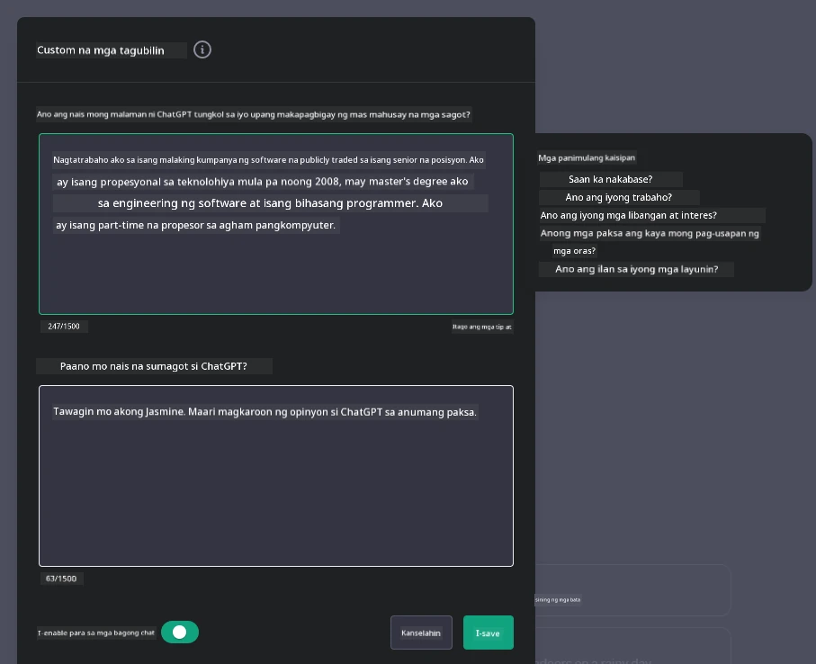
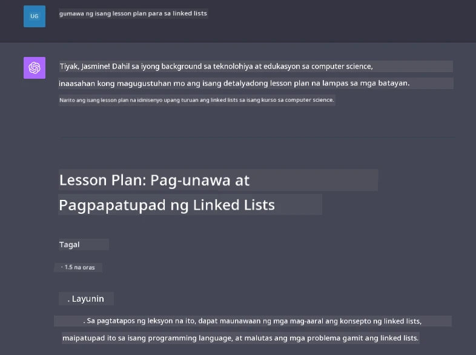

# Paggawa ng Mga Chat Application na Pinapagana ng Generative AI

[](https://youtu.be/R9V0ZY1BEQo?si=IHuU-fS9YWT8s4sA)

> _(I-click ang larawan sa itaas para panoorin ang video ng araling ito)_

Ngayon na nakita na natin kung paano tayo makakagawa ng mga app na nagge-generate ng teksto, tingnan natin ang mga chat application.

Ang mga chat application ay naging bahagi ng ating araw-araw na buhay, na nag-aalok ng higit pa sa isang paraan ng kaswal na pag-uusap. Mahalaga sila sa customer service, teknikal na suporta, at maging sa mga sopistikadong sistema ng payo. Malamang na nakatanggap ka na ng tulong mula sa isang chat application kamakailan lang. Habang isinasama natin ang mas advanced na teknolohiya tulad ng generative AI sa mga platform na ito, tumataas ang kumplikasyon gayundin ang mga hamon.

May ilang mga tanong na kailangan nating masagot:

- **Paggawa ng app**. Paano natin epektibong mabubuo at maipapasok nang maayos ang mga AI-powered na application para sa mga tiyak na kaso ng paggamit?
- **Pagmomonitor**. Kapag na-deploy na, paano natin mamomonitor at masisiguro na gumagana ang mga application sa pinakamataas na kalidad, sa aspeto ng functionality at pagsunod sa [anim na prinsipyo ng responsable AI](https://www.microsoft.com/ai/responsible-ai?WT.mc_id=academic-105485-koreyst)?

Habang nagpapatuloy tayo sa panahon ng awtomasyon at seamless na pakikipag-ugnayan ng tao at makina, mahalagang maunawaan kung paano binabago ng generative AI ang saklaw, lalim, at adaptabilidad ng mga chat application. Susuriin ng araling ito ang mga aspeto ng arkitektura na sumusuporta sa mga kumplikadong sistemang ito, alamin ang mga metodolohiya para sa fine-tuning sa mga domain-specific na gawain, at suriin ang mga sukatan at konsiderasyon para sa responsable na pag-deploy ng AI.

## Panimula

Tinalakay sa araling ito ang mga sumusunod:

- Mga teknik para sa epektibong paggawa at pagsasama ng mga chat application.
- Paano mag-apply ng customization at fine-tuning sa mga application.
- Mga estratehiya at konsiderasyon para sa epektibong pagmomonitor ng mga chat application.

## Mga Layunin sa Pagkatuto

Sa pagtatapos ng araling ito, magagawa mong:

- Ilahad ang mga konsiderasyon sa paggawa at pagsasama ng mga chat application sa kasalukuyang sistema.
- I-customize ang mga chat application para sa tiyak na mga kaso ng paggamit.
- Tukuyin ang mga pangunahing sukatan at konsiderasyon para epektibong mamonitor at mapanatili ang kalidad ng AI-powered chat applications.
- Masiguro na responsable ang paggamit ng AI sa mga chat application.

## Pagsasama ng Generative AI sa mga Chat Application

Ang pagpapahusay ng mga chat application gamit ang generative AI ay hindi lang tungkol sa pagpapatalino ng mga ito; ito ay tungkol sa pag-optimize ng kanilang arkitektura, performance, at interface ng user para maghatid ng mataas na kalidad ng karanasan. Kasama rito ang pagsusuri sa pundasyon ng arkitektura, integrasyon ng API, at mga konsiderasyon sa user interface. Layunin ng seksyong ito na magbigay sa iyo ng komprehensibong roadmap para mag-navigate sa mga komplikadong aspeto na ito, mapa-plug man ito sa mga umiiral na sistema o gagawin bilang standalone na mga plataporma.

Sa pagtatapos ng seksyong ito, magkakaroon ka ng kaalaman para epektibong makabuo at makapag-incorporate ng mga chat application.

### Chatbot o Chat Application?

Bago tayo magsimula sa paggawa ng mga chat application, ihambing muna natin ang 'chatbots' laban sa 'AI-powered chat applications,' na may magkakaibang papel at functionality. Ang pangunahing layunin ng chatbot ay i-automate ang mga tiyak na conversational na gawain, tulad ng pagsagot sa madalas itanong o pagsubaybay sa isang package. Karaniwang pinapagana ito ng rule-based logic o komplikadong AI algorithm. Sa kabilang banda, ang AI-powered chat application ay mas malawak na kapaligiran na dinisenyo para sa iba't ibang anyo ng digital na komunikasyon, tulad ng text, voice, at video chats sa pagitan ng mga tao. Ang pangunahing katangian nito ay ang integrasyon ng generative AI model na nagsisimulate ng masalimuot, parang-taong usapan, na bumubuo ng mga sagot base sa iba't ibang input at kontekstong palatandaan. Ang generative AI powered chat application ay maaaring makipag-usap sa open-domain na mga diskusyon, mag-adapt sa nagbabagong konteksto ng pag-uusap, at kahit makabuo ng malikhain o komplikadong dialogo.

Ang sumusunod na talahanayan ay nagpapakita ng mga pangunahing pagkakaiba at pagkakatulad upang matulungan tayong maunawaan ang kanilang natatanging papel sa digital na komunikasyon.

| Chatbot                               | Generative AI-Powered Chat Application |
| ------------------------------------- | -------------------------------------- |
| Nakatuon sa Gawain at batay sa tuntunin | May kamalayan sa konteksto              |
| Kadalasang isinama sa mas malaking sistema | Maaaring mag-host ng isa o maraming chatbot |
| Limitado sa mga programadong function  | Naglalaman ng generative AI models     |
| Espesyal at istrakturadong interaksyon | Kayang makipag-usap sa open-domain na diskusyon |

### Paggamit ng pre-built functionalities gamit ang SDKs at APIs

Sa paggawa ng chat application, magandang unang hakbang ang pag-assess kung ano na ang mayroon. Ang paggamit ng SDKs at APIs para sa paggawa ng chat application ay isang kapaki-pakinabang na estratehiya sa iba't ibang dahilan. Sa pamamagitan ng integrasyon ng maayos na naidokumento na SDKs at APIs, pinagpaplano mong maging matagumpay ang app sa pangmatagalan, na tinutugunan ang mga suliranin sa scalability at maintenance.

- **Pinapabilis ang proseso ng pag-develop at nababawasan ang overhead**: Ang pag-asa sa pre-built na mga functionality sa halip na magtayo mula sa simula ay nagpapahintulot sa iyo na tutukan ang iba pang bahagi ng app na mas mahalaga tulad ng business logic.
- **Mas mahusay na performance**: Kapag gumagawa ng functionality mula sa simula, madalas mong tanungin ang sarili kung paano ito mag-scale at kung kaya ng app na ito ang biglaang pagdami ng mga user. Ang mga maayos na maintained na SDK at API ay kadalasang may built-in na solusyon para dito.
- **Mas madaling maintenance**: Ang pag-update at pagpapabuti ay madaling gawin dahil karaniwan ang kailangan ay pag-update lamang ng library kapag may mas bagong bersyon.
- **Access sa pinakabagong teknolohiya**: Ang paggamit ng mga modelong fine-tuned at na-train sa malawak na dataset ay nagbibigay sa app ng kakayahan sa natural na wika.

Ang pag-access ng functionality ng isang SDK o API ay karaniwang nangangailangan ng pahintulot gamit ang isang natatanging key o authentication token. Gagamitin natin ang OpenAI Python Library upang suriin kung paano ito ginagawa. Maaari mo rin subukan sa iyong sarili ang sumusunod na [notebook para sa OpenAI](./python/oai-assignment.ipynb?WT.mc_id=academic-105485-koreyst) o [notebook para sa Azure OpenAI Services](./python/aoai-assignment.ipynb?WT.mc_id=academic-105485-koreys) para sa araling ito.

```python
import os
from openai import OpenAI

API_KEY = os.getenv("OPENAI_API_KEY","")

client = OpenAI(
    api_key=API_KEY
    )

response = client.responses.create(model="gpt-5-mini", input="Suggest two titles for an instructional lesson on chat applications for generative AI.", store=False)
print(response.output_text)
```

Ang halimbawa sa itaas ay gumagamit ng GPT-5 mini model gamit ang Responses API upang tapusin ang prompt, ngunit mapapansin na ang API key ay na-set bago ito gawin. Makakatanggap ka ng error kung hindi mo ito na-set.

## Karanasan ng Gumagamit (UX)

Ang mga pangkalahatang prinsipyo ng UX ay naaangkop sa mga chat application, ngunit narito ang ilang karagdagang konsiderasyon na naging partikular na mahalaga dahil sa mga bahagi ng machine learning.

- **Mekanismo para harapin ang kalabuan**: Paminsan-minsan, ang generative AI models ay bumubuo ng malabong mga sagot. Ang tampok na nagpapahintulot sa mga user na humingi ng paglilinaw ay makakatulong kung makaranas sila nito.
- **Pagpapanatili ng konteksto**: Ang mga advanced na generative AI model ay may kakayahang tandaan ang konteksto sa loob ng isang pag-uusap, na maaaring mahalagang asset para sa karanasan ng gumagamit. Ang pagbibigay kontrol sa user upang pamahalaan ang konteksto ay nagpapabuti ng UX, ngunit may panganib ng pag-iimbak ng sensitibong impormasyon. Ang mga konsiderasyon kung gaano katagal ito itatago, tulad ng pagpasok ng retention policy, ay makakatulong balansihin ang pangangailangan sa konteksto laban sa privacy.
- **Personalization**: Sa kakayahang matuto at mag-adapt, ang mga AI model ay nag-aalok ng indibidwal na karanasan sa gumagamit. Ang pag-aangkop ng UX gamit ang mga tampok gaya ng user profiles ay hindi lamang nagpaparamdam sa user na siya ay nauunawaan, ngunit tumutulong din sa kanilang paghahanap ng mga tiyak na sagot, na lumilikha ng mas epektibo at kasiya-siyang interaksyon.

Isang halimbawa ng personalization ay ang "Custom instructions" setting sa ChatGPT ng OpenAI. Pinapayagan kang magbigay ng impormasyon tungkol sa iyong sarili na maaaring mahalagang konteksto para sa iyong mga prompt. Narito ang isang halimbawa ng custom instruction.



Ang "profile" na ito ay nagpapabuo kay ChatGPT ng lesson plan tungkol sa linked lists. Napapansin na binibigyan ng konsiderasyon ni ChatGPT ang karanasan ng user kung kaya't maaaring gusto ni user ng mas malalim na lesson plan.



### Microsoft's System Message Framework para sa Large Language Models

[Nagbigay ang Microsoft ng gabay](https://learn.microsoft.com/azure/ai-foundry/openai/concepts/system-message#define-the-models-output-format?WT.mc_id=academic-105485-koreyst) para sa pagsulat ng epektibong mga system message kapag gumagawa ng mga sagot mula sa LLMs na nahahati sa 4 na bahagi:

1. Pagtukoy kung para kanino ang model, pati na rin ang mga kakayahan at limitasyon nito.
2. Pagtukoy ng output format ng model.
3. Pagsuplay ng mga tiyak na halimbawa na nagpapakita ng nais na ugali ng model.
4. Pagsuplay ng karagdagang guide o behavioral guardrails.

### Accessibility

Kung may visual, auditory, motor, o cognitive impairments man ang user, dapat magamit ang chat application ng lahat. Ang sumusunod na listahan ay naglilista ng mga partikular na tampok para mapabuti ang accessibility para sa iba't ibang kapansanan.

- **Mga Tampok para sa Visual Impairment**: Mga high contrast na tema at resizable na teksto, compatibility sa screen reader.
- **Mga Tampok para sa Auditory Impairment**: Mga function ng text-to-speech at speech-to-text, mga visual cue para sa mga audio notification.
- **Mga Tampok para sa Motor Impairment**: Suporta sa keyboard navigation, mga voice command.
- **Mga Tampok para sa Cognitive Impairment**: Mga opsyon sa pinasimpleng wika.

## Customization at Fine-tuning para sa Domain-Specific na Language Models

Isipin ang isang chat application na nakakaintindi ng jargon ng iyong kumpanya at napag-aalalahanan ang mga karaniwang tanong ng mga gumagamit nito. May mga ilang pamamaraan na dapat banggitin:

- **Paggamit ng DSL models**. Ang DSL ay nangangahulugang domain specific language. Maaari kang gumamit ng tinatawag na DSL model na na-train sa isang partikular na domain upang maintindihan ang mga konsepto at senaryo nito.
- **Mag-apply ng fine-tuning**. Ang fine-tuning ay proseso ng karagdagang pag-training ng iyong modelo gamit ang specific na data.

## Customization: Paggamit ng DSL

Ang paggamit ng domain-specific language models (DSL Models) ay maaaring magpataas ng pakikipag-ugnayan ng user sa pamamagitan ng pagbibigay ng espesyal na, kontekstwal na kaugnay na interaksyon. Ito ay isang model na tinrain o fine-tune upang maintindihan at bumuo ng teksto na may kaugnayan sa isang partikular na larangan, industriya, o paksa. Ang mga opsyon para sa paggamit ng DSL model ay maaaring mula sa pag-train mula sa simula, hanggang sa paggamit ng mga existing na modelo sa pamamagitan ng SDKs at APIs. Isa pang opsyon ang fine-tuning, na kinabibilangan ng pagkuha ng isang pre-trained na model at pag-aangkop nito para sa isang partikular na domain.

## Customization: Pag-apply ng fine-tuning

Madalas na isinasagawa ang fine-tuning kapag ang isang pre-trained na model ay kulang sa isang espesyal na domain o partikular na gawain.

Halimbawa, ang mga tanong sa medisina ay komplikado at nangangailangan ng maraming konteksto. Kapag nag-diagnose ang isang medikal na propesyonal ng pasyente, ito ay base sa iba't ibang mga faktor tulad ng lifestyle o pre-existing conditions, at maaari ring umasa sa mga bagong medical journals upang patunayan ang diagnosis. Sa ganoong masalimuot na mga senaryo, ang isang general-purpose AI chat application ay hindi mapagkakatiwalaang sanggunian.

### Senaryo: isang medikal na application

Isipin ang isang chat application na idinisenyo upang tumulong sa mga medical practitioner sa pamamagitan ng pagbibigay ng mabilis na reference sa mga treatment guideline, drug interaction, o mga bagong resulta ng pananaliksik.

Maaring sapat na ang general-purpose na modelo para sagutin ang mga simpleng tanong medikal o magbigay ng pangkalahatang payo, pero maaaring mahirapan ito sa sumusunod:

- **Mga napaka-tiyak o kumplikadong kaso**. Halimbawa, maaaring itanong ng isang neurologist sa application, "Ano ang kasalukuyang pinakamahusay na mga gawain sa pag-manage ng drug-resistant epilepsy sa mga pediatric patient?"
- **Walang kasamang pinakabagong mga pag-unlad**. Maaring mahirapan ang general-purpose model na magbigay ng kasalukuyang sagot na isinasaalang-alang ang pinakabagong mga pag-unlad sa neurology at pharmacology.

Sa mga ganitong pagkakataon, ang fine-tuning ng model gamit ang isang espesyal na medical dataset ay maaaring makabuluhang mapabuti ang kakayahan nitong hawakan ang mga masalimuot na tanong medikal nang mas tumpak at maaasahan. Nangangailangan ito ng access sa malaki at angkop na dataset na nagrerepresenta ng mga domain-specific na hamon at tanong na kailangang tugunan.

## Mga Konsiderasyon para sa Mataas na Kalidad na AI-Driven Chat Experience

Itinakda sa seksyong ito ang mga pamantayan para sa "mataas na kalidad" na chat application, na kinabibilangan ng pagkuha ng mga actionable metrics at pagsunod sa isang balangkas na responsable sa paggamit ng AI technology.

### Pangunahing Sukatan

Upang mapanatili ang mataas na kalidad ng performance ng isang app, mahalagang subaybayan ang mga pangunahing sukatan at konsiderasyon. Ang mga pamantayang ito ay hindi lang para sa functionality ng app kundi sinusuri rin ang kalidad ng AI model at karanasan ng gumagamit. Narito ang listahan ng mga basic, AI, at user experience metrics na dapat isaalang-alang.

| Sukatan                      | Kahulugan                                                                                                             | Konsiderasyon para sa Developer ng Chat                                 |
| ----------------------------- | ---------------------------------------------------------------------------------------------------------------------- | ----------------------------------------------------------------------- |
| **Uptime**                    | Sinusukat ang oras kung kailan operational at accessible ang application sa mga user.                                  | Paano mo babawasan ang downtime?                                        |
| **Response Time**             | Ang oras na kinakailangan ng application upang tumugon sa tanong ng user.                                             | Paano mo i-ooptimize ang query processing para mapabilis ang response? |
| **Precision**                 | Ang ratio ng totoong positibong prediksyon sa kabuuang bilang ng positibong prediksyon.                                | Paano mo i-vavalidate ang precision ng iyong model?                     |
| **Recall (Sensitivity)**      | Ang ratio ng totoong positibong prediksyon sa aktwal na bilang ng positibo.                                           | Paano mo susukatin at pahuhusayin ang recall?                          |
| **F1 Score**                  | Harmonikong average ng precision at recall, na nagbabalansi sa trade-off sa pagitan ng dalawa.                        | Ano ang target mong F1 Score? Paano mo balansehin ang precision at recall? |
| **Perplexity**                | Sinusukat kung gaano kahusay ang probability distribution na pinipredict ng model kumpara sa aktwal na distribusyon ng data. | Paano mo babawasan ang perplexity?                                      |
| **User Satisfaction Metrics** | Sinusukat ang perception ng user sa application. Kadalasang kinukuha sa pamamagitan ng mga survey.                     | Gaano kadalas ang pagkuha ng feedback ng user? Paano ka mag-aadjust base rito? |
| **Error Rate**                | Ang rate kung saan nagkakamali ang model sa pag-intindi o output.                                                    | Anong mga estratehiya ang may plano kang gamitin para mabawasan ang error rate? |
| **Retraining Cycles**         | Ang dalas kung kailan ang model ay ina-update upang isama ang bagong data at insight.                                  | Gaano kadalas mo ire-retrain ang model? Ano ang mga trigger ng retraining cycle? |

| **Pag-detect ng Anomalya**         | Mga kasangkapan at teknik para tuklasin ang mga kakaibang pattern na hindi naaayon sa inaasahang kilos.                        | Paano ka tutugon sa mga anomalya?                                        |

### Pagpapatupad ng Mga Responsableng Praktis sa AI sa Mga Chat Application

Nakilala ng paraan ng Microsoft tungkol sa Responsableng AI ang anim na prinsipyo na dapat gabayan ang pag-unlad at paggamit ng AI. Narito ang mga prinsipyo, ang kanilang kahulugan, at mga dapat isaalang-alang ng developer ng chat at kung bakit nila ito dapat seryosohin.

| Mga Prinsipyo             | Kahulugan ng Microsoft                                | Mga Pagsasaalang-alang para sa Developer ng Chat                                      | Bakit Ito Mahalaga                                                                     |
| ---------------------- | ----------------------------------------------------- | ---------------------------------------------------------------------- | -------------------------------------------------------------------------------------- |
| Katarungan               | Dapat tratuhin ng mga sistema ng AI ang lahat ng tao nang patas.            | Siguraduhing hindi dinidiskrimina ng chat application batay sa datos ng user.  | Para makabuo ng tiwala at inklusibidad sa mga gumagamit; iniiwasan ang legal na problema.                |
| Kakayahang Pagkakatiwalaan at Kaligtasan | Dapat magsagawa nang maaasahan at ligtas ang mga sistema ng AI.        | Ipatupad ang pagsusuri at mga fail-safes para mabawasan ang mga error at panganib.         | Nakasisiguro ng kasiyahan ng user at nakakaiwas sa posibleng pinsala.                                 |
| Privacy at Seguridad   | Dapat maging ligtas at igalang ng mga sistema ng AI ang privacy.      | Ipatupad ang matibay na encryption at mga hakbang sa proteksyon ng data.              | Para maprotektahan ang sensitibong datos ng user at sumunod sa mga batas tungkol sa privacy.                         |
| Inklusibidad          | Dapat mapalakas ng mga sistema ng AI ang lahat at makisali sa mga tao. | Disenyuhin ang UI/UX na naa-access at madaling gamitin para sa iba’t ibang mga manonood. | Tinitiyak na mas maraming tao ang epektibong makakagamit ng application.                   |
| Transparency           | Dapat maintindihan ang mga sistema ng AI.                  | Magbigay ng malinaw na dokumentasyon at paliwanag para sa mga sagot ng AI.            | Mas nagkakatiwala ang mga user sa sistema kung naiintindihan nila kung paano ginagawa ang mga desisyon. |
| Pananagutan         | Dapat managot ang mga tao para sa mga sistema ng AI.          | Magtatag ng malinaw na proseso para sa pag-audit at pagpapabuti ng mga desisyon ng AI.     | Nagpapahintulot ng tuloy-tuloy na pagpapabuti at mga hakbang sa pagtama sakaling may pagkakamali.               |

## Takdang Aralin

Tingnan ang [assignment](../../../07-building-chat-applications/python). Dadalhin ka nito sa isang serye ng mga pagsasanay mula sa pagpapatakbo ng iyong unang chat prompts, hanggang sa pag-uuri at pagbubuod ng teksto at iba pa. Pansinin na ang mga assignment ay available sa iba't ibang programming languages!

## Magandang Gawa! Ipagpatuloy ang Paglalakbay

Pagkatapos matapos ang araling ito, tingnan ang aming [Generative AI Learning collection](https://aka.ms/genai-collection?WT.mc_id=academic-105485-koreyst) para ipagpatuloy ang pagpapalawak ng iyong kaalaman tungkol sa Generative AI!

Pumunta sa Lesson 8 upang makita kung paano ka makakagawa ng [mga search application](../08-building-search-applications/README.md?WT.mc_id=academic-105485-koreyst)!

---

<!-- CO-OP TRANSLATOR DISCLAIMER START -->
**Pagtatanggi**:
Ang dokumentong ito ay isinalin gamit ang serbisyo ng AI translation na [Co-op Translator](https://github.com/Azure/co-op-translator). Bagama't nagsusumikap kami para sa katumpakan, pakatandaan na ang awtomatikong pagsasalin ay maaaring maglaman ng mga pagkakamali o hindi pagkakatugma. Ang orihinal na dokumento sa orihinal nitong wika ang dapat ituring na pangunahing sanggunian. Para sa mahahalagang impormasyon, inirerekomenda ang propesyonal na pagsasalin ng tao. Hindi kami mananagot sa anumang maling pagkakaintindi o maling interpretasyon na nagmula sa paggamit ng pagsasaling ito.
<!-- CO-OP TRANSLATOR DISCLAIMER END -->