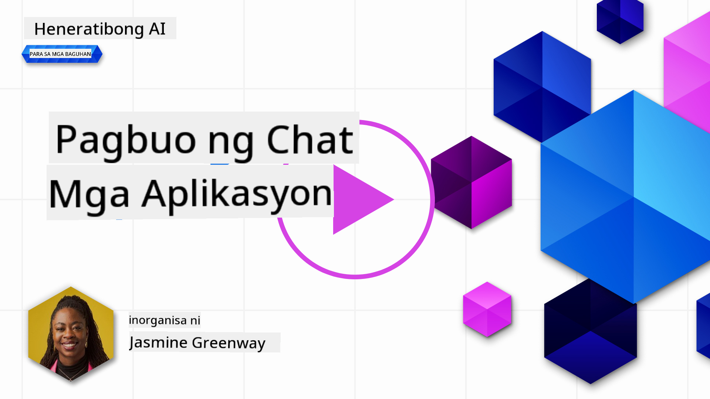
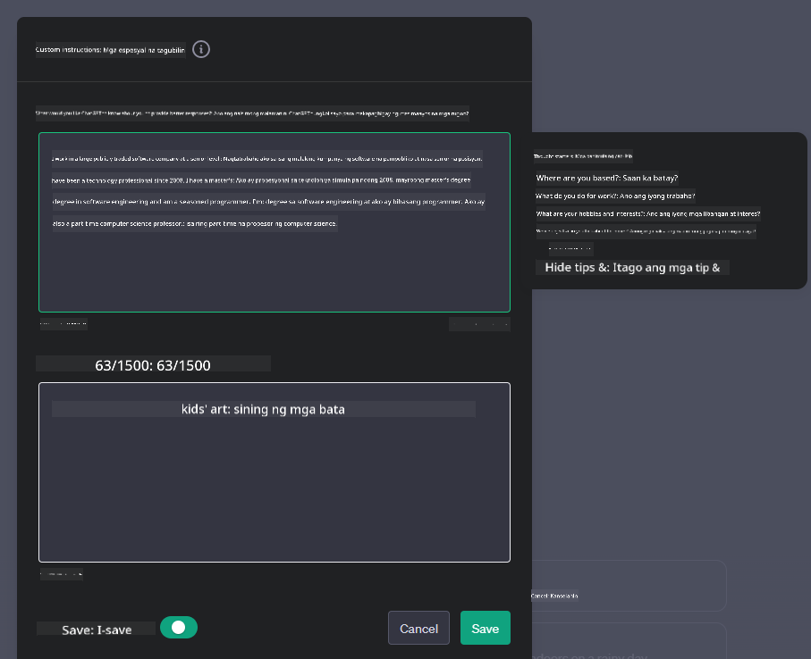
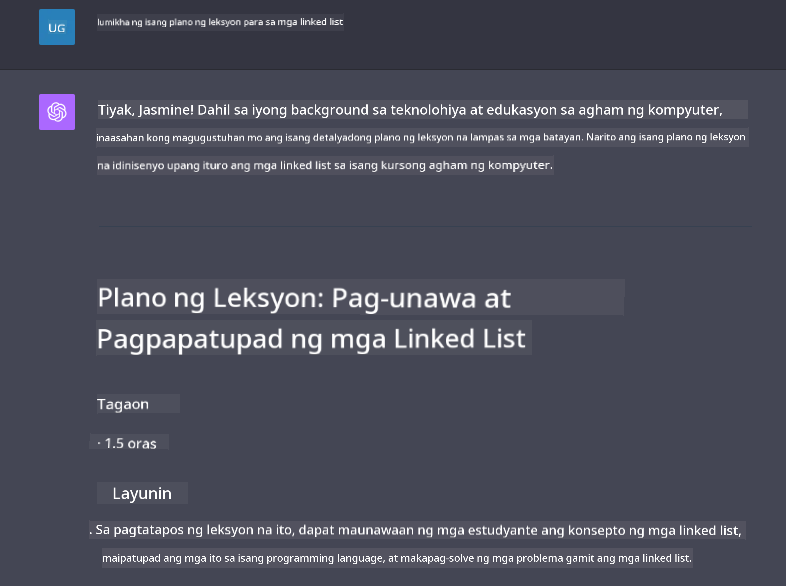

<!--
CO_OP_TRANSLATOR_METADATA:
{
  "original_hash": "ea4bbe640847aafbbba14dae4625e9af",
  "translation_date": "2025-06-25T15:48:19+00:00",
  "source_file": "07-building-chat-applications/README.md",
  "language_code": "tl"
}
-->
# Paggawa ng Mga Chat Application na Pinapagana ng Generative AI

[](https://aka.ms/gen-ai-lessons7-gh?WT.mc_id=academic-105485-koreyst)

> _(I-click ang imahe sa itaas para panoorin ang video ng araling ito)_

Ngayong nakita na natin kung paano tayo makakagawa ng mga text-generation app, tingnan natin ang mga chat application.

Ang mga chat application ay naging bahagi ng ating pang-araw-araw na buhay, na nag-aalok ng higit pa sa simpleng paraan ng kaswal na pakikipag-usap. Sila ay mahalagang bahagi ng serbisyo sa customer, teknikal na suporta, at maging ng mga sopistikadong sistema ng payo. Malamang na nakatanggap ka ng tulong mula sa isang chat application kamakailan lamang. Habang isinasama natin ang mas advanced na mga teknolohiya tulad ng generative AI sa mga platform na ito, tumataas ang kumplikado at gayundin ang mga hamon.

Ilan sa mga tanong na kailangan nating masagot ay:

- **Paggawa ng app**. Paano natin epektibong itatayo at isasama ang mga AI-powered application na ito para sa partikular na mga kaso ng paggamit?
- **Pagsubaybay**. Kapag nailunsad na, paano natin masusubaybayan at masisiguro na ang mga application ay gumagana sa pinakamataas na antas ng kalidad, kapwa sa mga tuntunin ng functionality at pagsunod sa [anim na prinsipyo ng responsable AI](https://www.microsoft.com/ai/responsible-ai?WT.mc_id=academic-105485-koreyst)?

Habang patuloy tayong umuusad sa isang panahon na pinapakahulugan ng automation at seamless na interaksyon ng tao at makina, ang pag-unawa sa kung paano binabago ng generative AI ang saklaw, lalim, at kakayahang umangkop ng mga chat application ay nagiging mahalaga. Ang araling ito ay susuri sa mga aspeto ng arkitektura na sumusuporta sa mga kumplikadong sistema, susuriin ang mga pamamaraan para sa pag-fine-tune ng mga ito para sa mga gawain na partikular sa domain, at susuriin ang mga sukatan at konsiderasyon na nauugnay sa pagtiyak ng responsable na pag-deploy ng AI.

## Panimula

Ang araling ito ay sumasaklaw sa:

- Mga teknik para sa epektibong paggawa at pagsasama ng mga chat application.
- Paano ilapat ang pagpapasadya at pag-fine-tune sa mga application.
- Mga estratehiya at konsiderasyon para sa epektibong pagsubaybay sa mga chat application.

## Mga Layunin sa Pagkatuto

Sa pagtatapos ng araling ito, magagawa mong:

- Ilarawan ang mga konsiderasyon para sa paggawa at pagsasama ng mga chat application sa umiiral na mga sistema.
- I-customize ang mga chat application para sa mga partikular na kaso ng paggamit.
- Tukuyin ang mga pangunahing sukatan at konsiderasyon para sa epektibong pagsubaybay at pagpapanatili ng kalidad ng mga AI-powered chat application.
- Tiyakin na ang mga chat application ay gumagamit ng AI nang responsable.

## Pagsasama ng Generative AI sa Mga Chat Application

Ang pagpapataas ng mga chat application sa pamamagitan ng generative AI ay hindi lamang nakatuon sa paggawa ng mga ito na mas matalino; ito ay tungkol sa pag-optimize ng kanilang arkitektura, pagganap, at user interface upang maghatid ng kalidad na karanasan ng gumagamit. Kasama rito ang pagsisiyasat sa mga pundasyon ng arkitektura, mga pagsasama ng API, at mga konsiderasyon sa user interface. Ang seksyong ito ay naglalayong mag-alok sa iyo ng komprehensibong roadmap para sa pag-navigate sa mga kumplikadong tanawin na ito, kung ikaw man ay nag-i-plug sa kanila sa mga umiiral na sistema o gumagawa sa kanila bilang mga stand-alone na platform.

Sa pagtatapos ng seksyong ito, ikaw ay magiging handa sa kaalaman na kailangan upang epektibong bumuo at isama ang mga chat application.

### Chatbot o Chat application?

Bago tayo sumabak sa paggawa ng mga chat application, ihambing natin ang 'chatbots' laban sa 'AI-powered chat applications,' na nagsisilbi ng magkakaibang mga tungkulin at functionality. Ang pangunahing layunin ng isang chatbot ay i-automate ang mga partikular na gawain sa pag-uusap, tulad ng pagsagot sa mga madalas itanong o pagsubaybay sa isang package. Karaniwan itong pinamamahalaan ng rule-based logic o kumplikadong mga AI algorithm. Sa kabaligtaran, ang isang AI-powered chat application ay isang mas malawak na kapaligiran na idinisenyo upang mapadali ang iba't ibang anyo ng digital na komunikasyon, tulad ng text, voice, at video chats sa mga tao. Ang nagtatakda sa kanila ay ang pagsasama ng isang generative AI model na ginagaya ang nuanced, tao-tulad na mga pag-uusap, na bumubuo ng mga tugon batay sa iba't ibang input at mga senyas sa konteksto. Ang isang generative AI powered chat application ay maaaring makisali sa mga open-domain na talakayan, umangkop sa umuusbong na mga konteksto ng pag-uusap, at maging makabuo ng malikhaing o kumplikadong diyalogo.

Ang talahanayan sa ibaba ay nagbabalangkas ng mga pangunahing pagkakaiba at pagkakatulad upang matulungan tayong maunawaan ang kanilang natatanging mga tungkulin sa digital na komunikasyon.

| Chatbot                               | Generative AI-Powered Chat Application |
| ------------------------------------- | -------------------------------------- |
| Nakatuon sa Gawain at batay sa tuntunin | May kamalayan sa konteksto             |
| Madalas na isinama sa mas malalaking sistema | Maaaring mag-host ng isa o maraming chatbot |
| Limitado sa mga naka-program na function | Isinasama ang mga generative AI model   |
| Dalubhasa at may istrukturang interaksyon | May kakayahang makipag-usap sa open-domain |

### Paggamit ng mga pre-built na functionality gamit ang SDKs at APIs

Kapag gumagawa ng isang chat application, isang mahusay na unang hakbang ay suriin kung ano ang mayroon na. Ang paggamit ng SDKs at APIs para bumuo ng mga chat application ay isang kapaki-pakinabang na estratehiya para sa iba't ibang mga kadahilanan. Sa pamamagitan ng pagsasama ng mahusay na dokumentadong SDKs at APIs, ikaw ay estratehikong nagpo-posisyon sa iyong application para sa pangmatagalang tagumpay, tinutugunan ang scalability at maintenance concerns.

- **Pinabilis ang proseso ng pag-unlad at binabawasan ang overhead**: Ang pag-asa sa mga pre-built na functionality sa halip na ang mahal na proseso ng paggawa ng mga ito sa sarili ay nagbibigay-daan sa iyo na tumutok sa iba pang aspeto ng iyong application na maaari mong makita na mas mahalaga, tulad ng business logic.
- **Mas mahusay na pagganap**: Kapag gumagawa ng functionality mula sa simula, sa kalaunan ay itatanong mo sa iyong sarili "Paano ito magsusukat? May kakayahan ba ang application na ito na hawakan ang biglaang pagdagsa ng mga gumagamit?" Ang mahusay na pinapanatili na SDK at APIs ay madalas na may built-in na solusyon para sa mga alalahaning ito.
- **Mas madaling maintenance**: Ang mga update at pagpapabuti ay mas madaling pamahalaan dahil ang karamihan sa mga APIs at SDKs ay nangangailangan lamang ng update sa isang library kapag inilabas ang isang mas bagong bersyon.
- **Access sa cutting edge na teknolohiya**: Ang paggamit ng mga model na na-fine-tune at sinanay sa malawak na datasets ay nagbibigay sa iyong application ng natural language capabilities.

Ang pag-access sa functionality ng isang SDK o API ay karaniwang nangangailangan ng pagkuha ng pahintulot upang gamitin ang mga ibinigay na serbisyo, na kadalasang sa pamamagitan ng paggamit ng isang natatanging key o authentication token. Gagamitin natin ang OpenAI Python Library para tuklasin kung ano ang hitsura nito. Maaari mo ring subukan ito sa iyong sarili sa sumusunod na [notebook para sa OpenAI](../../../07-building-chat-applications/python/oai-assignment.ipynb) o [notebook para sa Azure OpenAI Services](../../../07-building-chat-applications/python/aoai-assignment.ipynb) para sa araling ito.

```python
import os
from openai import OpenAI

API_KEY = os.getenv("OPENAI_API_KEY","")

client = OpenAI(
    api_key=API_KEY
    )

chat_completion = client.chat.completions.create(model="gpt-3.5-turbo", messages=[{"role": "user", "content": "Suggest two titles for an instructional lesson on chat applications for generative AI."}])
```

Ang halimbawa sa itaas ay gumagamit ng GPT-3.5 Turbo model upang kumpletuhin ang prompt, ngunit pansinin na ang API key ay itinakda bago gawin ito. Makakatanggap ka ng error kung hindi mo itinakda ang key.

## User Experience (UX)

Ang mga pangkalahatang prinsipyo ng UX ay nalalapat sa mga chat application, ngunit narito ang ilang karagdagang konsiderasyon na nagiging partikular na mahalaga dahil sa mga sangkap ng machine learning na kasangkot.

- **Mekanismo para sa pagtugon sa kalabuan**: Ang mga generative AI model ay paminsan-minsan ay bumubuo ng mga hindi malinaw na sagot. Ang isang tampok na nagbibigay-daan sa mga gumagamit na humiling ng paglilinaw ay maaaring maging kapaki-pakinabang kung sakaling makaharap nila ang problemang ito.
- **Pagpapanatili ng konteksto**: Ang mga advanced na generative AI model ay may kakayahang alalahanin ang konteksto sa loob ng isang pag-uusap, na maaaring maging kinakailangang asset sa karanasan ng gumagamit. Ang pagbibigay sa mga gumagamit ng kakayahang kontrolin at pamahalaan ang konteksto ay nagpapabuti sa karanasan ng gumagamit, ngunit ipinakilala ang panganib ng pagpapanatili ng sensitibong impormasyon ng gumagamit. Ang mga konsiderasyon kung gaano katagal ang impormasyong ito ay nakaimbak, tulad ng pagpapakilala ng isang retention policy, ay maaaring magbalanse sa pangangailangan para sa konteksto laban sa privacy.
- **Pag-personalize**: Sa kakayahang matuto at umangkop, ang mga AI model ay nag-aalok ng isang indibidwal na karanasan para sa isang gumagamit. Ang pag-tailor sa karanasan ng gumagamit sa pamamagitan ng mga tampok tulad ng mga profile ng gumagamit ay hindi lamang nagpaparamdam sa gumagamit na nauunawaan, ngunit nakakatulong din ito sa kanilang paghahanap ng tiyak na mga sagot, na lumilikha ng mas mahusay at kasiya-siyang interaksyon.

Isang halimbawa ng pag-personalize ay ang "Custom instructions" settings sa OpenAI's ChatGPT. Pinapayagan ka nitong magbigay ng impormasyon tungkol sa iyong sarili na maaaring mahalagang konteksto para sa iyong mga prompt. Narito ang isang halimbawa ng custom instruction.



Ang "profile" na ito ay nag-prompt sa ChatGPT na lumikha ng isang lesson plan sa linked lists. Pansinin na isinasaalang-alang ng ChatGPT na ang gumagamit ay maaaring gusto ng mas malalim na lesson plan batay sa kanyang karanasan.



### Microsoft's System Message Framework para sa Malalaking Language Models

[Ang Microsoft ay nagbigay ng gabay](https://learn.microsoft.com/azure/ai-services/openai/concepts/system-message#define-the-models-output-format?WT.mc_id=academic-105485-koreyst) para sa pagsulat ng epektibong mga system message kapag bumubuo ng mga tugon mula sa LLMs na nahahati sa 4 na lugar:

1. Pagpapakahulugan kung sino ang modelo, pati na rin ang mga kakayahan at limitasyon nito.
2. Pagpapakahulugan ng format ng output ng modelo.
3. Pagbibigay ng mga tiyak na halimbawa na nagpapakita ng nilalayong pag-uugali ng modelo.
4. Pagbibigay ng karagdagang mga behavioral guardrails.

### Accessibility

Kung ang isang gumagamit ay may visual, auditory, motor, o cognitive impairments, ang isang mahusay na dinisenyong chat application ay dapat magamit ng lahat. Ang sumusunod na listahan ay nagbabahagi ng mga tiyak na tampok na naglalayong pahusayin ang accessibility para sa iba't ibang mga kapansanan ng gumagamit.

- **Mga Tampok para sa Visual Impairment**: Mataas na contrast na tema at resizable na teksto, compatibility ng screen reader.
- **Mga Tampok para sa Auditory Impairment**: Text-to-speech at speech-to-text na mga function, visual cues para sa audio notifications.
- **Mga Tampok para sa Motor Impairment**: Suporta sa keyboard navigation, voice commands.
- **Mga Tampok para sa Cognitive Impairment**: Mga opsyon sa pinasimpleng wika.

## Pag-customize at Pag-fine-tune para sa Domain-Specific Language Models

Isipin ang isang chat application na nakakaintindi sa jargon ng iyong kumpanya at inaasahan ang mga partikular na query na madalas na mayroon ang user base nito. Mayroong ilang mga diskarte na nagkakahalaga ng pagbanggit:

- **Paggamit ng DSL models**. Ang DSL ay nangangahulugang domain specific language. Maaari mong gamitin ang isang tinatawag na DSL model na sinanay sa isang partikular na domain upang maunawaan ang mga konsepto at senaryo nito.
- **Mag-apply ng fine-tuning**. Ang fine-tuning ay ang proseso ng karagdagang pagsasanay sa iyong modelo gamit ang tiyak na data.

## Pag-customize: Paggamit ng DSL

Ang paggamit ng domain-specific language models (DSL Models) ay maaaring pahusayin ang pakikipag-ugnayan ng gumagamit sa pamamagitan ng pagbibigay ng espesyal na, kontekstwal na may-kaugnayang interaksyon. Ito ay isang modelo na sinanay o na-fine-tune upang maunawaan at bumuo ng teksto na may kaugnayan sa isang partikular na larangan, industriya, o paksa. Ang mga opsyon para sa paggamit ng DSL model ay maaaring mag-iba mula sa pagsasanay ng isa mula sa simula, hanggang sa paggamit ng mga umiiral na sa pamamagitan ng SDKs at APIs. Ang isa pang opsyon ay ang fine-tuning, na kinabibilangan ng pagkuha ng isang umiiral na pre-trained na modelo at pag-aangkop nito para sa isang partikular na domain.

## Pag-customize: Mag-apply ng fine-tuning

Ang fine-tuning ay madalas na isinasaalang-alang kapag ang isang pre-trained na modelo ay kulang sa isang espesyal na domain o partikular na gawain.

Halimbawa, ang mga query sa medikal ay kumplikado at nangangailangan ng maraming konteksto. Kapag ang isang medikal na propesyonal ay nag-diagnose ng isang pasyente, ito ay batay sa iba't ibang mga kadahilanan tulad ng lifestyle o pre-existing na kondisyon, at maaari ring umasa sa kamakailang mga medikal na journal upang i-validate ang kanilang diagnosis. Sa mga ganitong nuanced na senaryo, ang isang pangkalahatang layunin na AI chat application ay hindi maaaring maging maaasahang pinagmulan.

### Scenario: isang medikal na application

Isipin ang isang chat application na idinisenyo upang tulungan ang mga medikal na practitioner sa pamamagitan ng pagbibigay ng mabilis na mga sanggunian sa mga alituntunin sa paggamot, pakikipag-ugnayan ng gamot, o mga kamakailang natuklasan sa pananaliksik.

Ang isang pangkalahatang layunin na modelo ay maaaring sapat para sa pagsagot sa mga pangunahing tanong sa medikal o pagbibigay ng pangkalahatang payo, ngunit maaari itong mag-struggle sa mga sumusunod:

- **Lubos na tiyak o kumplikadong mga kaso**. Halimbawa, ang isang neurologist ay maaaring magtanong sa application, "Ano ang kasalukuyang pinakamahusay na mga kasanayan para sa pamamahala ng drug-resistant epilepsy sa mga pediatric na pasyente?"
- **Kakulangan sa kamakailang mga pag-unlad**. Ang isang pangkalahatang layunin na modelo ay maaaring mag-struggle upang magbigay ng kasalukuyang sagot na sumasama sa mga pinakabagong pag-unlad sa neurology at pharmacology.

Sa mga pagkakataon tulad ng mga ito, ang fine-tuning ng modelo gamit ang isang espesyal na medikal na dataset ay maaaring makabuluhang pahusayin ang kakayahan nito na hawakan ang mga masalimuot na medikal na katanungan nang mas tumpak at maaasahan. Nangangailangan ito ng access sa isang malaki at may-kaugnayang dataset na kumakatawan sa mga hamon at tanong na partikular sa domain na kailangang matugunan.

## Mga Konsiderasyon para sa Mataas na Kalidad na AI-Driven na Karanasan sa Chat

Ang seksyong ito ay nagbabalangkas ng mga pamantayan para sa "mataas na kalidad" na mga chat application, na kinabibilangan ng pagkuha ng mga actionable na sukatan at pagsunod sa isang balangkas na responsable na gumagamit ng teknolohiya ng AI.

### Mga Pangunahing Sukatan

Upang mapanatili ang mataas na kalidad na pagganap ng isang application, mahalaga na subaybayan ang mga pangunahing sukatan at konsiderasyon. Ang mga sukatang ito ay hindi lamang tinitiyak ang functionality ng application kundi pati na rin ang pag-assess sa kalidad ng AI model at karanasan ng gumagamit. Sa ibaba ay isang listahan na sumasaklaw sa mga pangunahing, AI, at user experience metrics na dapat isaalang-alang.

| Sukatan                        | Kahulugan                                                                                                             | Mga Konsiderasyon para sa Developer ng Chat                                        |
| ----------------------------- | ---------------------------------------------------------------------------------------------------------------------- | ------------------------------------------------------------------------- |
| **Uptime**                    | Sinusukat ang oras na ang application ay operational at accessible ng mga gumagamit.                                   | Paano mo babawasan ang downtime?                                           |
| **Response Time**             | Ang oras na ginugol ng application upang tumugon sa query ng gumagamit.                                                | Paano mo mai-optimize ang pagproseso ng query upang mapabuti ang response time?     |
| **Precision**                 | Ang ratio ng tunay na positibong prediksyon sa kabuuang bilang ng positibong prediksyon                                 | P

**Paunawa**:  
Ang dokumentong ito ay isinalin gamit ang AI translation service na [Co-op Translator](https://github.com/Azure/co-op-translator). Habang sinisikap namin ang katumpakan, pakitandaan na ang mga awtomatikong pagsasalin ay maaaring maglaman ng mga pagkakamali o hindi pagkakatumpakan. Ang orihinal na dokumento sa kanyang katutubong wika ang dapat ituring na mapagkakatiwalaang mapagkukunan. Para sa kritikal na impormasyon, inirerekomenda ang propesyonal na pagsasalin ng tao. Hindi kami mananagot para sa anumang hindi pagkakaintindihan o maling interpretasyon na dulot ng paggamit ng pagsasaling ito.