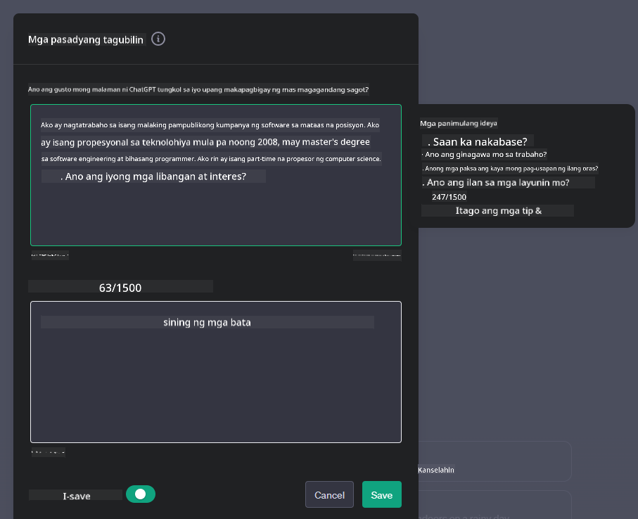

<!--
CO_OP_TRANSLATOR_METADATA:
{
  "original_hash": "a1f836db3d459bfd326b6fadca90866c",
  "translation_date": "2025-10-17T13:23:12+00:00",
  "source_file": "07-building-chat-applications/README.md",
  "language_code": "tl"
}
-->
# Paggawa ng Mga Chat Application na Pinapagana ng Generative AI

[](https://youtu.be/R9V0ZY1BEQo?si=IHuU-fS9YWT8s4sA)

> _(I-click ang imahe sa itaas para mapanood ang video ng araling ito)_

Ngayon na nakita natin kung paano gumawa ng mga text-generation app, tingnan naman natin ang mga chat application.

Ang mga chat application ay naging bahagi na ng ating pang-araw-araw na buhay, na nagbibigay ng higit pa sa simpleng paraan ng kaswal na pag-uusap. Sila ay mahalagang bahagi ng customer service, technical support, at maging ng mga sopistikadong advisory system. Malamang na nakatanggap ka ng tulong mula sa isang chat application kamakailan lamang. Habang isinasama natin ang mas advanced na teknolohiya tulad ng generative AI sa mga platform na ito, tumataas ang pagiging kumplikado pati na rin ang mga hamon.

Ilan sa mga tanong na kailangang sagutin ay:

- **Paggawa ng app**. Paano natin epektibong magagawa at maayos na maisasama ang mga AI-powered application para sa partikular na mga layunin?
- **Pagmo-monitor**. Kapag nailunsad na, paano natin masusubaybayan at masisiguro na ang mga application ay gumagana sa pinakamataas na antas ng kalidad, parehong sa functionality at pagsunod sa [anim na prinsipyo ng responsableng AI](https://www.microsoft.com/ai/responsible-ai?WT.mc_id=academic-105485-koreyst)?

Habang patuloy tayong pumapasok sa panahon ng automation at seamless na interaksyon sa pagitan ng tao at makina, mahalaga ang pag-unawa kung paano binabago ng generative AI ang saklaw, lalim, at kakayahang umangkop ng mga chat application. Ang araling ito ay mag-iimbestiga sa mga aspeto ng arkitektura na sumusuporta sa mga masalimuot na sistema, susuriin ang mga metodolohiya para sa fine-tuning sa mga partikular na gawain, at susuriin ang mga sukatan at konsiderasyon na mahalaga para sa responsableng pag-deploy ng AI.

## Panimula

Ang araling ito ay sumasaklaw sa:

- Mga teknik para sa epektibong paggawa at pagsasama ng mga chat application.
- Paano mag-apply ng customization at fine-tuning sa mga application.
- Mga estratehiya at konsiderasyon para sa epektibong pagmo-monitor ng mga chat application.

## Mga Layunin sa Pag-aaral

Sa pagtatapos ng araling ito, magagawa mong:

- Ilarawan ang mga konsiderasyon sa paggawa at pagsasama ng mga chat application sa umiiral na mga sistema.
- I-customize ang mga chat application para sa partikular na mga layunin.
- Tukuyin ang mga pangunahing sukatan at konsiderasyon para sa epektibong pagmo-monitor at pagpapanatili ng kalidad ng mga AI-powered chat application.
- Siguraduhin na ang mga chat application ay gumagamit ng AI nang responsable.

## Pagsasama ng Generative AI sa Mga Chat Application

Ang pagpapahusay ng mga chat application sa pamamagitan ng generative AI ay hindi lamang nakatuon sa pagpapatalino sa kanila; ito ay tungkol sa pag-optimize ng kanilang arkitektura, performance, at user interface upang magbigay ng de-kalidad na karanasan sa gumagamit. Kasama rito ang pagsisiyasat sa mga pundasyon ng arkitektura, API integrations, at mga konsiderasyon sa user interface. Ang seksyong ito ay naglalayong magbigay sa iyo ng komprehensibong roadmap para sa pag-navigate sa mga masalimuot na landscape na ito, maging ito man ay pagsasama sa umiiral na mga sistema o paggawa ng mga stand-alone na platform.

Sa pagtatapos ng seksyong ito, magkakaroon ka ng kaalaman na kinakailangan upang epektibong makagawa at maisama ang mga chat application.

### Chatbot o Chat Application?

Bago tayo sumisid sa paggawa ng mga chat application, ihambing muna natin ang 'chatbots' laban sa 'AI-powered chat applications,' na may magkakaibang tungkulin at functionality. Ang pangunahing layunin ng chatbot ay i-automate ang partikular na mga gawain sa pag-uusap, tulad ng pagsagot sa mga madalas itanong o pagsubaybay sa isang package. Karaniwan itong pinamamahalaan ng rule-based logic o masalimuot na AI algorithms. Sa kabilang banda, ang AI-powered chat application ay isang mas malawak na kapaligiran na idinisenyo upang mapadali ang iba't ibang anyo ng digital na komunikasyon, tulad ng text, voice, at video chats sa pagitan ng mga tao. Ang pangunahing katangian nito ay ang pagsasama ng generative AI model na gumagaya sa masalimuot, parang-taong pag-uusap, na bumubuo ng mga sagot batay sa iba't ibang input at mga konteksto.

Ang talahanayan sa ibaba ay naglalarawan ng mga pangunahing pagkakaiba at pagkakatulad upang matulungan tayong maunawaan ang kanilang natatanging tungkulin sa digital na komunikasyon.

| Chatbot                               | Generative AI-Powered Chat Application |
| ------------------------------------- | -------------------------------------- |
| Nakatuon sa gawain at rule-based      | Context-aware                          |
| Karaniwang isinama sa mas malalaking sistema | Maaaring mag-host ng isa o maraming chatbot |
| Limitado sa mga programmed na function | Nagsasama ng generative AI models      |
| Espesyalista at structured na interaksyon | Kayang makipag-usap sa open-domain     |

### Paggamit ng Pre-built na Functionality gamit ang SDKs at APIs

Kapag gumagawa ng chat application, isang mahusay na unang hakbang ay suriin kung ano na ang mayroon. Ang paggamit ng SDKs at APIs upang gumawa ng mga chat application ay isang kapaki-pakinabang na estratehiya para sa iba't ibang dahilan. Sa pamamagitan ng pagsasama ng maayos na dokumentadong SDKs at APIs, inilalagay mo ang iyong application sa isang estratehikong posisyon para sa pangmatagalang tagumpay, tinutugunan ang mga alalahanin sa scalability at maintenance.

- **Pinapabilis ang proseso ng paggawa at binabawasan ang gastos**: Ang pag-asa sa mga pre-built na functionality sa halip na ang mahal na proseso ng paggawa nito mula sa simula ay nagbibigay-daan sa iyo na mag-focus sa iba pang aspeto ng iyong application na maaaring mas mahalaga, tulad ng business logic.
- **Mas mahusay na performance**: Kapag gumagawa ng functionality mula sa simula, darating ang tanong na "Paano ito mag-scale? Kaya ba ng application na ito ang biglaang pagdami ng mga gumagamit?" Ang maayos na pinapanatili na SDK at APIs ay kadalasang may built-in na solusyon para sa mga alalahaning ito.
- **Mas madaling maintenance**: Ang mga update at pagpapabuti ay mas madaling pamahalaan dahil ang karamihan sa mga APIs at SDKs ay nangangailangan lamang ng pag-update sa library kapag may mas bagong bersyon na inilabas.
- **Access sa cutting-edge na teknolohiya**: Ang paggamit ng mga modelong na-fine-tune at na-train sa malawak na datasets ay nagbibigay sa iyong application ng natural language capabilities.

Ang pag-access sa functionality ng isang SDK o API ay karaniwang nangangailangan ng pahintulot upang magamit ang mga serbisyong ibinibigay, na kadalasang ginagawa sa pamamagitan ng paggamit ng isang natatanging key o authentication token. Gagamitin natin ang OpenAI Python Library upang suriin kung ano ang hitsura nito. Maaari mo rin itong subukan sa iyong sarili sa sumusunod na [notebook para sa OpenAI](./python/oai-assignment.ipynb?WT.mc_id=academic-105485-koreyst) o [notebook para sa Azure OpenAI Services](./python/aoai-assignment.ipynb?WT.mc_id=academic-105485-koreys) para sa araling ito.

```python
import os
from openai import OpenAI

API_KEY = os.getenv("OPENAI_API_KEY","")

client = OpenAI(
    api_key=API_KEY
    )

chat_completion = client.chat.completions.create(model="gpt-3.5-turbo", messages=[{"role": "user", "content": "Suggest two titles for an instructional lesson on chat applications for generative AI."}])
```

Ang halimbawa sa itaas ay gumagamit ng GPT-3.5 Turbo model upang kumpletuhin ang prompt, ngunit mapapansin na ang API key ay itinakda bago ito gawin. Makakatanggap ka ng error kung hindi mo itinakda ang key.

## User Experience (UX)

Ang mga pangkalahatang prinsipyo ng UX ay naaangkop sa mga chat application, ngunit narito ang ilang karagdagang konsiderasyon na nagiging partikular na mahalaga dahil sa mga bahagi ng machine learning.

- **Mekanismo para sa pagtugon sa ambiguity**: Ang mga generative AI models ay paminsan-minsan ay bumubuo ng mga sagot na hindi malinaw. Ang isang feature na nagbibigay-daan sa mga user na humiling ng karagdagang paliwanag ay maaaring maging kapaki-pakinabang kung sakaling makaharap nila ang problemang ito.
- **Pagpapanatili ng konteksto**: Ang mga advanced na generative AI models ay may kakayahang tandaan ang konteksto sa loob ng isang pag-uusap, na maaaring maging mahalagang asset sa karanasan ng gumagamit. Ang pagbibigay sa mga user ng kakayahang kontrolin at pamahalaan ang konteksto ay nagpapabuti sa karanasan ng gumagamit, ngunit nagdadala ng panganib ng pag-iimbak ng sensitibong impormasyon ng user. Ang mga konsiderasyon para sa kung gaano katagal ang impormasyong ito ay iniimbak, tulad ng pagpapakilala ng retention policy, ay maaaring magbalanse sa pangangailangan para sa konteksto laban sa privacy.
- **Personalization**: Sa kakayahang matuto at umangkop, ang mga AI models ay nag-aalok ng isang indibidwal na karanasan para sa isang user. Ang pag-tailor sa karanasan ng user sa pamamagitan ng mga feature tulad ng user profiles ay hindi lamang nagpaparamdam sa user na naiintindihan, ngunit nakakatulong din sa kanilang paghahanap ng partikular na mga sagot, na lumilikha ng mas epektibo at kasiya-siyang interaksyon.

Isang halimbawa ng personalization ay ang "Custom instructions" settings sa OpenAI's ChatGPT. Pinapayagan ka nitong magbigay ng impormasyon tungkol sa iyong sarili na maaaring mahalagang konteksto para sa iyong mga prompt. Narito ang isang halimbawa ng custom instruction.



Ang "profile" na ito ay nag-prompt sa ChatGPT na gumawa ng lesson plan tungkol sa linked lists. Mapapansin na isinasaalang-alang ng ChatGPT na maaaring gusto ng user ng mas detalyadong lesson plan batay sa kanyang karanasan.


### Microsoft's System Message Framework para sa Malalaking Language Models

[Ang Microsoft ay nagbigay ng gabay](https://learn.microsoft.com/azure/ai-services/openai/concepts/system-message#define-the-models-output-format?WT.mc_id=academic-105485-koreyst) para sa pagsusulat ng epektibong system messages kapag bumubuo ng mga sagot mula sa LLMs na hinati sa 4 na bahagi:

1. Pagpapaliwanag kung para kanino ang model, pati na rin ang mga kakayahan at limitasyon nito.
2. Pagpapaliwanag ng format ng output ng model.
3. Pagbibigay ng mga partikular na halimbawa na nagpapakita ng intended behavior ng model.
4. Pagbibigay ng karagdagang behavioral guardrails.

### Accessibility

Kung ang isang user ay may kapansanan sa paningin, pandinig, motor, o kognitibo, ang isang maayos na dinisenyong chat application ay dapat magamit ng lahat. Ang sumusunod na listahan ay nagbabalangkas ng mga partikular na feature na naglalayong mapabuti ang accessibility para sa iba't ibang kapansanan ng user.

- **Mga Feature para sa Kapansanan sa Paningin**: High contrast themes at resizable text, screen reader compatibility.
- **Mga Feature para sa Kapansanan sa Pandinig**: Text-to-speech at speech-to-text functions, visual cues para sa audio notifications.
- **Mga Feature para sa Kapansanan sa Motor**: Keyboard navigation support, voice commands.
- **Mga Feature para sa Kapansanan sa Kognitibo**: Simplified language options.

## Customization at Fine-tuning para sa Domain-Specific Language Models

Isipin ang isang chat application na nauunawaan ang jargon ng iyong kumpanya at inaasahan ang partikular na mga tanong na karaniwang mayroon ang user base nito. Mayroong ilang mga diskarte na dapat banggitin:

- **Paggamit ng DSL models**. Ang DSL ay nangangahulugang domain specific language. Maaari kang gumamit ng tinatawag na DSL model na na-train sa isang partikular na domain upang maunawaan ang mga konsepto at senaryo nito.
- **Pag-apply ng fine-tuning**. Ang fine-tuning ay ang proseso ng karagdagang pag-train sa iyong model gamit ang partikular na data.

## Customization: Paggamit ng DSL

Ang paggamit ng domain-specific language models (DSL Models) ay maaaring mapahusay ang engagement ng user sa pamamagitan ng pagbibigay ng espesyalista, kontekstwal na may kaugnayang interaksyon. Ito ay isang model na na-train o na-fine-tune upang maunawaan at bumuo ng text na may kaugnayan sa isang partikular na larangan, industriya, o paksa. Ang mga opsyon para sa paggamit ng DSL model ay maaaring mag-iba mula sa pag-train ng isa mula sa simula, hanggang sa paggamit ng mga umiiral na sa pamamagitan ng SDKs at APIs. Isa pang opsyon ay ang fine-tuning, na kinabibilangan ng pag-aangkop ng isang umiiral na pre-trained model para sa isang partikular na domain.

## Customization: Pag-apply ng Fine-tuning

Ang fine-tuning ay madalas na isinasaalang-alang kapag ang isang pre-trained model ay kulang sa isang espesyalistang domain o partikular na gawain.

Halimbawa, ang mga medikal na tanong ay masalimuot at nangangailangan ng maraming konteksto. Kapag ang isang medikal na propesyonal ay nag-diagnose ng isang pasyente, ito ay batay sa iba't ibang mga salik tulad ng lifestyle o pre-existing conditions, at maaaring umasa pa sa mga kamakailang medikal na journal upang i-validate ang kanilang diagnosis. Sa ganitong mga masalimuot na senaryo, ang isang general-purpose AI chat application ay hindi maaasahang mapagkukunan.

### Senaryo: isang medikal na application

Isaalang-alang ang isang chat application na idinisenyo upang tulungan ang mga medikal na practitioner sa pamamagitan ng pagbibigay ng mabilis na mga reference sa treatment guidelines, drug interactions, o mga kamakailang natuklasan sa pananaliksik.

Ang isang general-purpose model ay maaaring sapat para sa pagsagot sa mga basic na medikal na tanong o pagbibigay ng pangkalahatang payo, ngunit maaaring mahirapan sa mga sumusunod:

- **Napaka-espesyalista o masalimuot na mga kaso**. Halimbawa, maaaring tanungin ng isang neurologist ang application, "Ano ang kasalukuyang pinakamahusay na mga pamamaraan para sa pamamahala ng drug-resistant epilepsy sa mga pediatric na pasyente?"
- **Kakulangan sa mga kamakailang pag-unlad**. Ang isang general-purpose model ay maaaring mahirapan na magbigay ng kasalukuyang sagot na isinasaalang-alang ang pinakabagong mga pag-unlad sa neurology at pharmacology.

Sa mga pagkakataon tulad nito, ang fine-tuning sa model gamit ang isang espesyalistang medikal na dataset ay maaaring makabuluhang mapabuti ang kakayahan nitong hawakan ang mga masalimuot na medikal na tanong nang mas tumpak at maaasahan. Nangangailangan ito ng access sa isang malaki at may kaugnayang dataset na kumakatawan sa mga domain-specific na hamon at tanong na kailangang tugunan.

## Mga Konsiderasyon para sa Mataas na Kalidad na AI-Driven Chat Experience

Ang seksyong ito ay nagbabalangkas ng mga pamantayan para sa "mataas na kalidad" na mga chat application, na kinabibilangan ng pagkuha ng mga actionable metrics at pagsunod sa isang framework na responsable sa paggamit ng teknolohiyang AI.

### Mga Pangunahing Sukatan

Upang mapanatili ang mataas na kalidad na performance ng isang application, mahalagang subaybayan ang mga pangunahing sukatan at konsiderasyon. Ang mga sukatang ito ay hindi lamang nagsisiguro sa functionality ng application kundi sinusuri rin ang kalidad ng AI model at karanasan ng user. Narito ang isang listahan na sumasaklaw sa mga pangunahing, AI, at user experience metrics na dapat isaalang-alang.

| Sukatan                      | Kahulugan                                                                                                             | Mga Konsiderasyon para sa Developer ng Chat                              |
| ---------------------------- | --------------------------------------------------------------------------------------------------------------------- | ------------------------------------------------------------------------ |
| **Uptime**                   | Sinusukat ang oras na ang application ay operational at accessible ng mga user.                                       | Paano mo mababawasan ang downtime?                                       |
| **Response Time**            | Ang oras na ginugugol ng application upang tumugon sa query ng user.                                                  | Paano mo ma-optimize ang query processing upang mapabuti ang response time? |
| **Precision**                | Ang ratio ng mga tamang positibong prediksyon sa kabuuang bilang ng positibong prediksyon.                            | Paano mo i-validate ang precision ng iyong model?                        |
| **Recall (Sensitivity)**     | Ang ratio ng mga tamang positibong prediksyon sa aktwal na bilang ng mga positibo.                                    | Paano mo susukatin at pagagandahin ang recall?                           |
| **F1 Score**                 | Ang harmonic mean ng precision at recall, na nagbabalanse sa trade-off sa pagitan ng dalawa.                         | Ano ang target mong F1 Score? Paano mo babalansehin ang precision at recall? |
| **Perplexity**               | Sinusukat kung gaano kahusay ang probability distribution na hinulaan ng model na tumutugma sa aktwal na distribution ng data. | Paano mo mababawasan ang perplexity?                                     |
| **User Satisfaction Metrics**| Sinusukat ang perception ng user sa application. Karaniwang kinukuha sa pamamagitan ng mga survey.                    | Gaano kadalas ka mangangalap ng feedback mula sa user? Paano ka mag-aadjust base rito? |
| **Error Rate**               | Ang rate kung saan nagk
| **Pag-detect ng Anomalya**         | Mga kasangkapan at teknik para matukoy ang mga hindi pangkaraniwang pattern na hindi naaayon sa inaasahang pag-uugali.                        | Paano mo tutugunan ang mga anomalya?                                        |

### Pagpapatupad ng Responsableng Praktika ng AI sa Mga Chat Application

Ang diskarte ng Microsoft sa Responsableng AI ay nagtataguyod ng anim na prinsipyo na dapat gabayan ang pag-develop at paggamit ng AI. Narito ang mga prinsipyo, ang kanilang kahulugan, at mga bagay na dapat isaalang-alang ng isang chat developer at kung bakit mahalaga ang mga ito.

| Prinsipyo             | Kahulugan ng Microsoft                                | Mga Dapat Isaalang-alang ng Chat Developer                                      | Bakit Ito Mahalaga                                                                     |
| ---------------------- | ----------------------------------------------------- | ---------------------------------------------------------------------- | -------------------------------------------------------------------------------------- |
| Pagkamakatarungan     | Ang mga sistema ng AI ay dapat tratuhin ang lahat ng tao nang patas.            | Siguraduhin na ang chat application ay hindi nagdidiskrimina batay sa datos ng user.  | Upang makabuo ng tiwala at inclusivity sa mga user; iniiwasan ang legal na problema.                |
| Kahusayan at Kaligtasan | Ang mga sistema ng AI ay dapat gumana nang maayos at ligtas.        | Magpatupad ng testing at mga fail-safe upang mabawasan ang mga error at panganib.         | Tinitiyak ang kasiyahan ng user at iniiwasan ang posibleng pinsala.                                 |
| Privacy at Seguridad   | Ang mga sistema ng AI ay dapat maging ligtas at igalang ang privacy.      | Magpatupad ng malakas na encryption at mga hakbang sa proteksyon ng datos.              | Upang mapangalagaan ang sensitibong datos ng user at sumunod sa mga batas sa privacy.                         |
| Inclusiveness          | Ang mga sistema ng AI ay dapat magbigay kapangyarihan sa lahat at makipag-ugnayan sa mga tao. | Magdisenyo ng UI/UX na accessible at madaling gamitin para sa iba't ibang audience. | Tinitiyak na mas maraming tao ang makakagamit ng application nang epektibo.                   |
| Transparency           | Ang mga sistema ng AI ay dapat naiintindihan.                  | Magbigay ng malinaw na dokumentasyon at paliwanag para sa mga tugon ng AI.            | Mas malamang na magtiwala ang mga user sa sistema kung naiintindihan nila kung paano ginagawa ang mga desisyon. |
| Accountability         | Ang mga tao ay dapat managot para sa mga sistema ng AI.          | Magtatag ng malinaw na proseso para sa pag-audit at pagpapabuti ng mga desisyon ng AI.     | Nagbibigay-daan sa patuloy na pagpapabuti at mga hakbang sa pagwawasto sakaling magkamali.               |

## Takdang-Aralin

Tingnan ang [takdang-aralin](../../../07-building-chat-applications/python) na magdadala sa iyo sa serye ng mga ehersisyo mula sa pagtakbo ng iyong unang chat prompts, hanggang sa pag-classify at pag-summarize ng teksto at iba pa. Pansinin na ang mga takdang-aralin ay available sa iba't ibang programming languages!

## Magaling! Ipagpatuloy ang Paglalakbay

Pagkatapos makumpleto ang araling ito, tingnan ang aming [Generative AI Learning collection](https://aka.ms/genai-collection?WT.mc_id=academic-105485-koreyst) upang patuloy na paunlarin ang iyong kaalaman sa Generative AI!

Pumunta sa Lesson 8 upang makita kung paano ka makakapagsimula [gumawa ng mga search application](../08-building-search-applications/README.md?WT.mc_id=academic-105485-koreyst)!

---

**Paunawa**:  
Ang dokumentong ito ay isinalin gamit ang AI translation service na [Co-op Translator](https://github.com/Azure/co-op-translator). Bagamat sinisikap naming maging tumpak, mangyaring tandaan na ang mga awtomatikong pagsasalin ay maaaring maglaman ng mga pagkakamali o hindi pagkakatugma. Ang orihinal na dokumento sa kanyang katutubong wika ang dapat ituring na opisyal na pinagmulan. Para sa mahalagang impormasyon, inirerekomenda ang propesyonal na pagsasalin ng tao. Hindi kami mananagot sa anumang hindi pagkakaunawaan o maling interpretasyon na dulot ng paggamit ng pagsasaling ito.