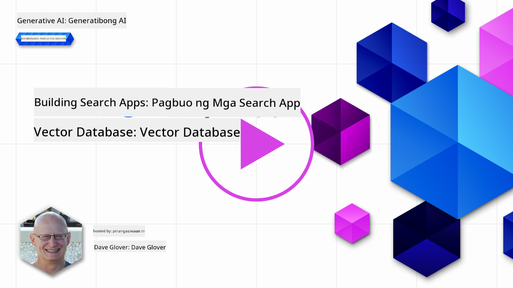
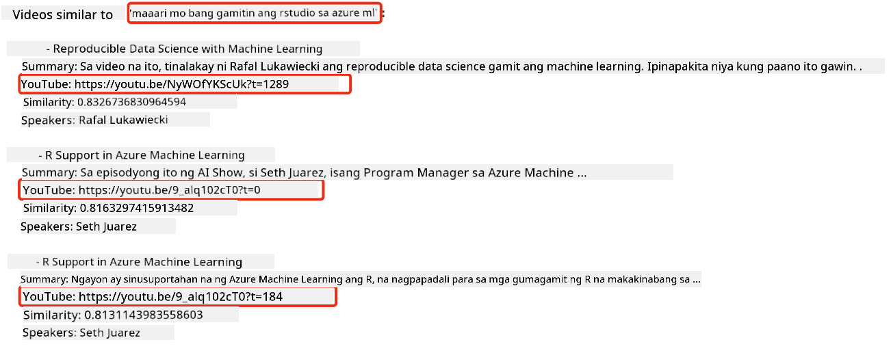
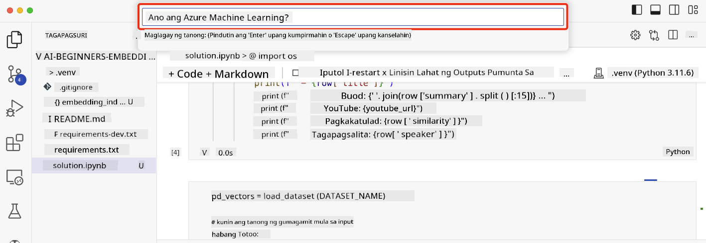

<!--
CO_OP_TRANSLATOR_METADATA:
{
  "original_hash": "d46aad0917a1a342d613e2c13d457da5",
  "translation_date": "2025-05-19T18:38:56+00:00",
  "source_file": "08-building-search-applications/README.md",
  "language_code": "tl"
}
-->
# Paggawa ng Mga Search Application

[](https://aka.ms/gen-ai-lesson8-gh?WT.mc_id=academic-105485-koreyst)

> > _I-click ang imahe sa itaas para mapanood ang video ng araling ito_

May mas marami pang magagawa ang LLMs bukod sa chatbots at text generation. Posible rin ang paggawa ng search applications gamit ang Embeddings. Ang Embeddings ay numerical na representasyon ng data na kilala rin bilang vectors, at maaaring gamitin para sa semantic search ng data.

Sa araling ito, gagawa ka ng search application para sa aming edukasyong startup. Ang aming startup ay isang non-profit na organisasyon na nagbibigay ng libreng edukasyon sa mga estudyante sa mga umuunlad na bansa. Ang aming startup ay may malaking bilang ng mga YouTube videos na magagamit ng mga estudyante para matuto tungkol sa AI. Ang aming startup ay nais gumawa ng search application na nagpapahintulot sa mga estudyante na maghanap ng YouTube video sa pamamagitan ng pag-type ng tanong.

Halimbawa, maaaring mag-type ang isang estudyante ng 'Ano ang Jupyter Notebooks?' o 'Ano ang Azure ML' at ang search application ay magbabalik ng listahan ng mga YouTube videos na may kaugnayan sa tanong, at mas maganda pa, ang search application ay magbabalik ng link sa lugar sa video kung saan matatagpuan ang sagot sa tanong.

## Panimula

Sa araling ito, tatalakayin natin ang:

- Semantic vs Keyword search.
- Ano ang Text Embeddings.
- Paglikha ng Text Embeddings Index.
- Paghahanap sa Text Embeddings Index.

## Mga Layunin sa Pagkatuto

Pagkatapos makumpleto ang araling ito, magagawa mong:

- Tukuyin ang pagkakaiba sa pagitan ng semantic at keyword search.
- Ipaliwanag kung ano ang Text Embeddings.
- Lumikha ng application gamit ang Embeddings para maghanap ng data.

## Bakit gumawa ng search application?

Ang paggawa ng search application ay makakatulong sa iyo na maunawaan kung paano gamitin ang Embeddings para maghanap ng data. Matutunan mo rin kung paano gumawa ng search application na magagamit ng mga estudyante para mabilis na makahanap ng impormasyon.

Kasama sa aralin ang isang Embedding Index ng mga transcript ng YouTube para sa Microsoft [AI Show](https://www.youtube.com/playlist?list=PLlrxD0HtieHi0mwteKBOfEeOYf0LJU4O1) YouTube channel. Ang AI Show ay isang YouTube channel na nagtuturo tungkol sa AI at machine learning. Ang Embedding Index ay naglalaman ng Embeddings para sa bawat isa sa mga transcript ng YouTube hanggang Oktubre 2023. Gagamitin mo ang Embedding Index para gumawa ng search application para sa aming startup. Ang search application ay magbabalik ng link sa lugar sa video kung saan matatagpuan ang sagot sa tanong. Ito ay isang mahusay na paraan para sa mga estudyante na mabilis na mahanap ang impormasyong kailangan nila.

Ang sumusunod ay isang halimbawa ng semantic query para sa tanong 'maaari mo bang gamitin ang rstudio sa azure ml?'. Tingnan ang YouTube url, makikita mo ang url na naglalaman ng timestamp na nagdadala sa iyo sa lugar sa video kung saan matatagpuan ang sagot sa tanong.



## Ano ang semantic search?

Ngayon ay maaaring nagtataka ka, ano ang semantic search? Ang semantic search ay isang search technique na gumagamit ng semantics, o kahulugan, ng mga salita sa isang query para magbalik ng mga kaugnay na resulta.

Narito ang isang halimbawa ng semantic search. Sabihin nating naghahanap ka ng bibilhing kotse, maaari kang maghanap ng 'ang aking pangarap na kotse', ang semantic search ay nauunawaan na hindi ka `dreaming` tungkol sa kotse, kundi ikaw ay naghahanap na bumili ng iyong `ideal` kotse. Ang semantic search ay nauunawaan ang iyong intensyon at nagbabalik ng mga kaugnay na resulta. Ang alternatibo ay `keyword search` na literal na maghahanap ng mga pangarap tungkol sa kotse at kadalasang nagbabalik ng hindi kaugnay na mga resulta.

## Ano ang Text Embeddings?

[Text embeddings](https://en.wikipedia.org/wiki/Word_embedding?WT.mc_id=academic-105485-koreyst) ay isang technique sa representasyon ng text na ginagamit sa [natural language processing](https://en.wikipedia.org/wiki/Natural_language_processing?WT.mc_id=academic-105485-koreyst). Ang Text embeddings ay semantic numerical na representasyon ng text. Ang Embeddings ay ginagamit para i-represent ang data sa paraang madaling maintindihan ng makina. Maraming mga modelo para sa paggawa ng text embeddings, sa araling ito, magpo-focus tayo sa pag-generate ng embeddings gamit ang OpenAI Embedding Model.

Narito ang isang halimbawa, isipin ang sumusunod na text ay nasa isang transcript mula sa isa sa mga episode sa AI Show YouTube channel:

```text
Today we are going to learn about Azure Machine Learning.
```

Ipapasa namin ang text sa OpenAI Embedding API at magbabalik ito ng sumusunod na embedding na binubuo ng 1536 na numero na kilala rin bilang vector. Ang bawat numero sa vector ay kumakatawan sa ibang aspeto ng text. Para sa kabuuan, narito ang unang 10 numero sa vector.

```python
[-0.006655829958617687, 0.0026128944009542465, 0.008792596869170666, -0.02446001023054123, -0.008540431968867779, 0.022071078419685364, -0.010703742504119873, 0.003311325330287218, -0.011632772162556648, -0.02187200076878071, ...]
```

## Paano nilikha ang Embedding index?

Ang Embedding index para sa araling ito ay nilikha gamit ang serye ng mga Python scripts. Makikita mo ang mga script kasama ang mga instruksyon sa [README](./scripts/README.md?WT.mc_id=academic-105485-koreyst) sa 'scripts' folder para sa araling ito. Hindi mo kailangang patakbuhin ang mga script na ito para makumpleto ang araling ito dahil ang Embedding Index ay ibinigay na para sa iyo.

Ang mga script ay nagsasagawa ng sumusunod na mga operasyon:

1. Ang transcript para sa bawat YouTube video sa [AI Show](https://www.youtube.com/playlist?list=PLlrxD0HtieHi0mwteKBOfEeOYf0LJU4O1) playlist ay na-download.
2. Gamit ang [OpenAI Functions](https://learn.microsoft.com/azure/ai-services/openai/how-to/function-calling?WT.mc_id=academic-105485-koreyst), sinusubukan na i-extract ang pangalan ng speaker mula sa unang 3 minuto ng YouTube transcript. Ang pangalan ng speaker para sa bawat video ay ini-store sa Embedding Index na tinatawag na `embedding_index_3m.json`.
3. Ang transcript text ay hinahati sa **3 minuto na text segments**. Ang segment ay naglalaman ng humigit-kumulang 20 salita na overlapping mula sa susunod na segment para masigurado na ang Embedding para sa segment ay hindi naputol at para magbigay ng mas mahusay na search context.
4. Ang bawat text segment ay ipapasa sa OpenAI Chat API para i-summarize ang text sa 60 salita. Ang summary ay ini-store din sa Embedding Index `embedding_index_3m.json`.
5. Sa wakas, ang segment text ay ipapasa sa OpenAI Embedding API. Ang Embedding API ay nagbabalik ng vector ng 1536 na numero na kumakatawan sa semantic na kahulugan ng segment. Ang segment kasama ang OpenAI Embedding vector ay ini-store sa Embedding Index `embedding_index_3m.json`.

### Vector Databases

Para sa kasimplehan ng aralin, ang Embedding Index ay ini-store sa isang JSON file na tinatawag na `embedding_index_3m.json` at niloload sa isang Pandas DataFrame. Gayunpaman, sa produksyon, ang Embedding Index ay ini-store sa isang vector database tulad ng [Azure Cognitive Search](https://learn.microsoft.com/training/modules/improve-search-results-vector-search?WT.mc_id=academic-105485-koreyst), [Redis](https://cookbook.openai.com/examples/vector_databases/redis/readme?WT.mc_id=academic-105485-koreyst), [Pinecone](https://cookbook.openai.com/examples/vector_databases/pinecone/readme?WT.mc_id=academic-105485-koreyst), [Weaviate](https://cookbook.openai.com/examples/vector_databases/weaviate/readme?WT.mc_id=academic-105485-koreyst), at iba pa.

## Pag-unawa sa cosine similarity

Natuto tayo tungkol sa text embeddings, ang susunod na hakbang ay ang pag-aaral kung paano gamitin ang text embeddings para maghanap ng data at partikular na hanapin ang pinaka-katulad na embeddings sa isang ibinigay na query gamit ang cosine similarity.

### Ano ang cosine similarity?

Ang cosine similarity ay isang sukatan ng pagkakatulad sa pagitan ng dalawang vectors, maririnig mo rin itong tinatawag na `nearest neighbor search`. Para magsagawa ng cosine similarity search kailangan mong _vectorize_ para sa _query_ text gamit ang OpenAI Embedding API. Pagkatapos kalkulahin ang _cosine similarity_ sa pagitan ng query vector at bawat vector sa Embedding Index. Tandaan, ang Embedding Index ay may vector para sa bawat YouTube transcript text segment. Sa wakas, i-sort ang mga resulta ayon sa cosine similarity at ang text segments na may pinakamataas na cosine similarity ay ang pinaka-katulad sa query.

Mula sa perspektibong matematika, sinusukat ng cosine similarity ang cosine ng anggulo sa pagitan ng dalawang vectors na projected sa isang multidimensional space. Ang pagsukat na ito ay kapaki-pakinabang, dahil kung ang dalawang dokumento ay malayo sa pamamagitan ng Euclidean distance dahil sa laki, maaari pa rin silang magkaroon ng mas maliit na anggulo sa pagitan nila at samakatuwid mas mataas na cosine similarity. Para sa karagdagang impormasyon tungkol sa cosine similarity equations, tingnan ang [Cosine similarity](https://en.wikipedia.org/wiki/Cosine_similarity?WT.mc_id=academic-105485-koreyst).

## Paggawa ng iyong unang search application

Susunod, matututo tayo kung paano gumawa ng search application gamit ang Embeddings. Ang search application ay magpapahintulot sa mga estudyante na maghanap ng video sa pamamagitan ng pag-type ng tanong. Ang search application ay magbabalik ng listahan ng mga video na may kaugnayan sa tanong. Ang search application ay magbabalik din ng link sa lugar sa video kung saan matatagpuan ang sagot sa tanong.

Ang solusyong ito ay ginawa at nasubukan sa Windows 11, macOS, at Ubuntu 22.04 gamit ang Python 3.10 o mas bago. Maaari mong i-download ang Python mula sa [python.org](https://www.python.org/downloads/?WT.mc_id=academic-105485-koreyst).

## Takdang-aralin - paggawa ng search application, para matulungan ang mga estudyante

Inilunsad namin ang aming startup sa simula ng araling ito. Ngayon ay oras na para matulungan ang mga estudyante na gumawa ng search application para sa kanilang mga pagsusuri.

Sa takdang-araling ito, gagawa ka ng Azure OpenAI Services na gagamitin para sa paggawa ng search application. Gagawa ka ng sumusunod na Azure OpenAI Services. Kakailanganin mo ng Azure subscription para makumpleto ang takdang-araling ito.

### Simulan ang Azure Cloud Shell

1. Mag-sign in sa [Azure portal](https://portal.azure.com/?WT.mc_id=academic-105485-koreyst).
2. Piliin ang Cloud Shell icon sa upper-right corner ng Azure portal.
3. Piliin ang **Bash** para sa uri ng environment.

#### Gumawa ng resource group

> Para sa mga instruksyon na ito, gumagamit kami ng resource group na tinatawag na "semantic-video-search" sa East US.
> Maaari mong baguhin ang pangalan ng resource group, ngunit kapag binabago ang lokasyon para sa mga resources,
> tingnan ang [model availability table](https://aka.ms/oai/models?WT.mc_id=academic-105485-koreyst).

```shell
az group create --name semantic-video-search --location eastus
```

#### Gumawa ng Azure OpenAI Service resource

Mula sa Azure Cloud Shell, patakbuhin ang sumusunod na command para gumawa ng Azure OpenAI Service resource.

```shell
az cognitiveservices account create --name semantic-video-openai --resource-group semantic-video-search \
    --location eastus --kind OpenAI --sku s0
```

#### Kunin ang endpoint at keys para magamit sa application na ito

Mula sa Azure Cloud Shell, patakbuhin ang sumusunod na mga command para makuha ang endpoint at keys para sa Azure OpenAI Service resource.

```shell
az cognitiveservices account show --name semantic-video-openai \
   --resource-group  semantic-video-search | jq -r .properties.endpoint
az cognitiveservices account keys list --name semantic-video-openai \
   --resource-group semantic-video-search | jq -r .key1
```

#### I-deploy ang OpenAI Embedding model

Mula sa Azure Cloud Shell, patakbuhin ang sumusunod na command para i-deploy ang OpenAI Embedding model.

```shell
az cognitiveservices account deployment create \
    --name semantic-video-openai \
    --resource-group  semantic-video-search \
    --deployment-name text-embedding-ada-002 \
    --model-name text-embedding-ada-002 \
    --model-version "2"  \
    --model-format OpenAI \
    --sku-capacity 100 --sku-name "Standard"
```

## Solusyon

Buksan ang [solution notebook](../../../08-building-search-applications/python/aoai-solution.ipynb) sa GitHub Codespaces at sundin ang mga instruksyon sa Jupyter Notebook.

Kapag pinatakbo mo ang notebook, hihilingin sa iyo na magpasok ng query. Ang input box ay ganito ang itsura:



## Mahusay na Gawa! Ipagpatuloy ang Iyong Pagkatuto

Pagkatapos makumpleto ang araling ito, tingnan ang aming [Generative AI Learning collection](https://aka.ms/genai-collection?WT.mc_id=academic-105485-koreyst) para ipagpatuloy ang pag-level up ng iyong kaalaman sa Generative AI!

Pumunta sa Lesson 9 kung saan titingnan natin kung paano [gumawa ng mga application sa paglikha ng imahe](../09-building-image-applications/README.md?WT.mc_id=academic-105485-koreyst)!

**Paunawa**:  
Ang dokumentong ito ay isinalin gamit ang AI translation service na [Co-op Translator](https://github.com/Azure/co-op-translator). Bagamat pinagsisikapan naming maging wasto, mangyaring tandaan na ang mga awtomatikong pagsasalin ay maaaring maglaman ng mga pagkakamali o hindi pagkakatumpak. Ang orihinal na dokumento sa sariling wika nito ay dapat ituring na pangunahing sanggunian. Para sa mahahalagang impormasyon, inirerekomenda ang propesyonal na pagsasaling-wika ng tao. Hindi kami mananagot para sa anumang hindi pagkakaintindihan o maling interpretasyon na dulot ng paggamit ng pagsasaling ito.