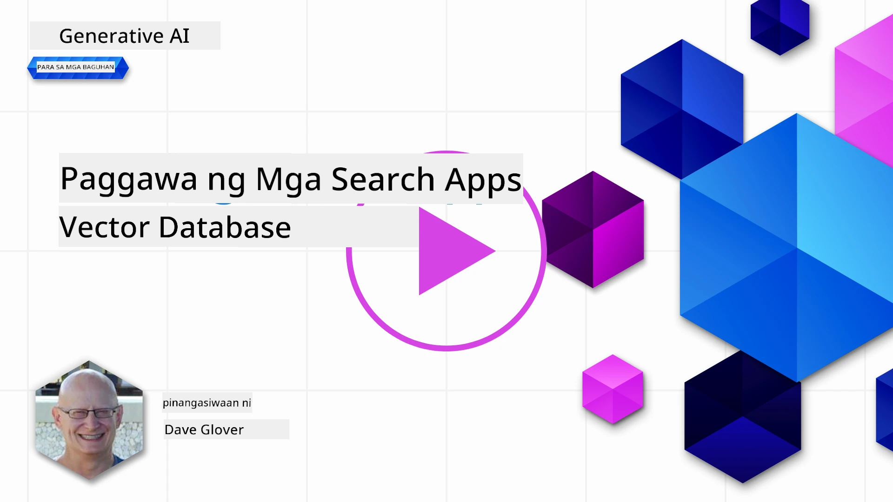
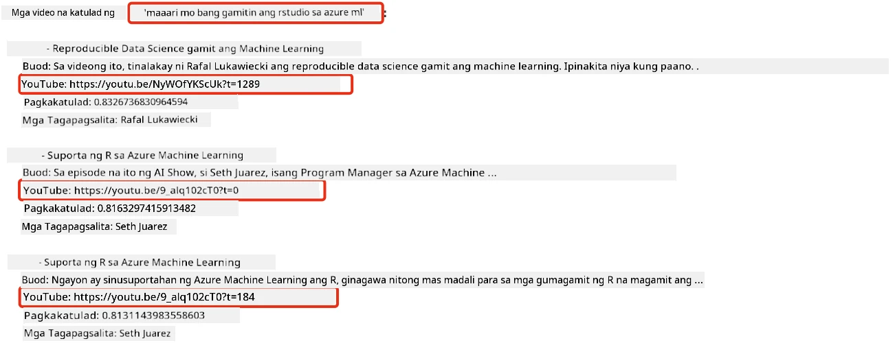
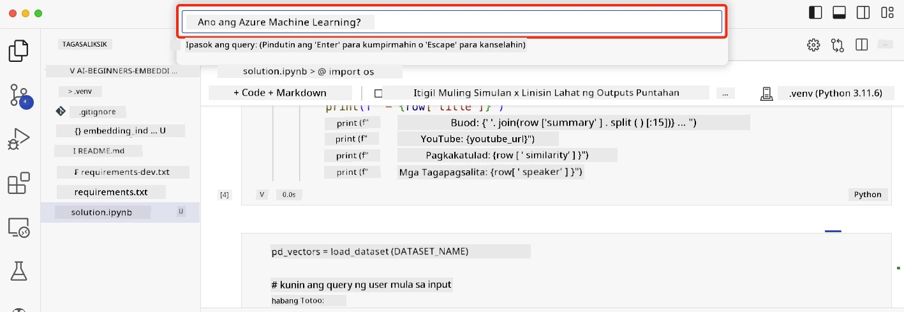

# Paggawa ng Mga Search Application

[](https://youtu.be/W0-nzXjOjr0?si=GcsqiTTvd7RKbo7V)

> > _I-click ang larawan sa itaas upang panoorin ang video ng araling ito_

Higit pa sa mga chatbots at pagbuo ng teksto ang LLMs. Posible ring gumawa ng mga search application gamit ang Embeddings. Ang Embeddings ay mga numerikal na representasyon ng data na kilala rin bilang mga vector, at maaari itong gamitin para sa semantic search ng data.

Sa araling ito, gagawa ka ng isang search application para sa aming education startup. Ang aming startup ay isang non-profit na organisasyon na nagbibigay ng libreng edukasyon sa mga estudyante sa mga developing na bansa. Mayroon kaming malaking bilang ng mga YouTube video na maaaring gamitin ng mga estudyante upang matuto tungkol sa AI. Nais ng aming startup na gumawa ng isang search application na nagpapahintulot sa mga estudyante na maghanap ng YouTube video sa pamamagitan ng pagsulat ng isang tanong.

Halimbawa, maaaring mag-type ang isang estudyante ng 'Ano ang Jupyter Notebooks?' o 'Ano ang Azure ML' at magbabalik ang search application ng listahan ng mga YouTube video na may kinalaman sa tanong, at higit pa rito, magbabalik din ang search application ng link sa bahagi ng video kung saan matatagpuan ang sagot sa tanong.

## Panimula

Sa araling ito, tatalakayin natin:

- Semantic kumpara sa Keyword search.
- Ano ang Text Embeddings.
- Paggawa ng Text Embeddings Index.
- Paghahanap sa Text Embeddings Index.

## Mga Layunin sa Pagkatuto

Pagkatapos makumpleto ang araling ito, magagawa mong:

- Ipagkaiba ang semantic at keyword search.
- Ipaliwanag kung ano ang Text Embeddings.
- Gumawa ng isang aplikasyon gamit ang Embeddings para maghanap ng data.

## Bakit gumawa ng isang search application?

Ang paggawa ng isang search application ay tutulong sa iyo na maunawaan kung paano gamitin ang Embeddings para maghanap ng data. Matututo ka rin kung paano gumawa ng isang search application na maaaring gamitin ng mga estudyante para madali silang makahanap ng impormasyon.

Kasama sa aralin ang isang Embedding Index ng mga YouTube transcript para sa Microsoft [AI Show](https://www.youtube.com/playlist?list=PLlrxD0HtieHi0mwteKBOfEeOYf0LJU4O1) YouTube channel. Ang AI Show ay isang YouTube channel na nagtuturo tungkol sa AI at machine learning. Ang Embedding Index ay naglalaman ng Embeddings para sa bawat YouTube transcript hanggang Oktubre 2023. Gagamitin mo ang Embedding Index upang gumawa ng search application para sa aming startup. Magbabalik ang search application ng link sa bahagi ng video kung saan matatagpuan ang sagot sa tanong. Ito ay mahusay na paraan para sa mga estudyante na mabilis na mahanap ang impormasyong kailangan nila.

Narito ang isang halimbawa ng semantic query para sa tanong na 'maaari mo bang gamitin ang rstudio sa azure ml?'. Tingnan ang YouTube url, makikita mo na ang url ay may timestamp na direktang nagdadala sa bahagi ng video kung saan matatagpuan ang sagot sa tanong.



## Ano ang semantic search?

Maaaring nagtatanong ka, ano nga ba ang semantic search? Ang semantic search ay isang teknik sa paghahanap na gumagamit ng semantics, o ibig sabihin, ng mga salita sa isang query upang magbalik ng mga kaugnay na resulta.

Narito ang isang halimbawa ng semantic search. Sabihin nating naghahanap ka ng kotse, maaari kang maghanap ng 'aking pangarap na kotse', naiintindihan ng semantic search na hindi ka `nangangarap` lang tungkol sa kotse, kundi hinahanap mo ang iyong `ideal` na kotse. Naiintindihan ng semantic search ang iyong intensyon at nagbabalik ng mga kaugnay na resulta. Ang alternatibo ay ang `keyword search` na literal na naghahanap para sa mga panaginip tungkol sa mga kotse at madalas ay nagbabalik ng mga hindi kaugnay na resulta.

## Ano ang Text Embeddings?

[Ang text embeddings](https://en.wikipedia.org/wiki/Word_embedding?WT.mc_id=academic-105485-koreyst) ay isang teknik sa representasyon ng teksto na ginagamit sa [natural language processing](https://en.wikipedia.org/wiki/Natural_language_processing?WT.mc_id=academic-105485-koreyst). Ang Text embeddings ay mga numerikal na semantic na representasyon ng teksto. Ginagamit ang embeddings upang ipakita ang data sa isang paraan na madaling maintindihan ng makina. Maraming mga modelo para sa paggawa ng text embeddings, sa araling ito, tututok tayo sa paggawa ng embeddings gamit ang OpenAI Embedding Model.

Narito ang isang halimbawa, isipin ang sumusunod na teksto mula sa isang transcript ng isa sa mga episode sa AI Show YouTube channel:

```text
Today we are going to learn about Azure Machine Learning.
```

Ipapasa namin ang teksto sa OpenAI Embedding API at ito ay magbabalik ng embedding na binubuo ng 1536 na numero o vector. Ang bawat numero sa vector ay kumakatawan sa iba't ibang aspeto ng teksto. Para sa dagdag na pinaikling pagpapakita, narito ang unang 10 numero sa vector.

```python
[-0.006655829958617687, 0.0026128944009542465, 0.008792596869170666, -0.02446001023054123, -0.008540431968867779, 0.022071078419685364, -0.010703742504119873, 0.003311325330287218, -0.011632772162556648, -0.02187200076878071, ...]
```

## Paano ginawa ang Embedding index?

Ang Embedding index para sa araling ito ay ginawa gamit ang serye ng mga Python script. Makikita mo ang mga script kasama ang mga tagubilin sa [README](./scripts/README.md?WT.mc_id=academic-105485-koreyst) sa folder na 'scripts' para sa araling ito. Hindi mo kailangang patakbuhin ang mga script na ito para makumpleto ang aralin dahil ang Embedding Index ay ibinigay na para sa iyo.

Ang mga script ay nagsasagawa ng mga sumusunod na operasyon:

1. Dinadownload ang transcript para sa bawat YouTube video sa [AI Show](https://www.youtube.com/playlist?list=PLlrxD0HtieHi0mwteKBOfEeOYf0LJU4O1) playlist.
2. Gamit ang [OpenAI Functions](https://learn.microsoft.com/azure/ai-foundry/openai/how-to/function-calling?WT.mc_id=academic-105485-koreyst), sinusubukang kunin ang pangalan ng tagapagsalita mula sa unang 3 minuto ng YouTube transcript. Ang pangalan ng tagapagsalita para sa bawat video ay iniimbak sa Embedding Index na tinatawag na `embedding_index_3m.json`.
3. Ang teksto ng transcript ay hinahati sa **3 minutong mga segment ng teksto**. Kasama sa segment ang humigit-kumulang 20 salita na nag-o-overlap mula sa susunod na segment upang matiyak na hindi mapuputol ang Embedding para sa segment at upang magbigay ng mas mahusay na konteksto sa paghahanap.
4. Ang bawat segment ng teksto ay ipinapasa sa OpenAI Chat API upang ibuod ang teksto sa 60 salita. Ang buod ay iniimbak din sa Embedding Index na `embedding_index_3m.json`.
5. Sa wakas, ang teksto ng segment ay ipinapasa sa OpenAI Embedding API. Nagbabalik ang Embedding API ng isang vector ng 1536 na numero na kumakatawan sa semantic na kahulugan ng segment. Ang segment kasama ng OpenAI Embedding vector ay iniimbak sa Embedding Index na `embedding_index_3m.json`.

### Vector Databases

Para sa pagiging simple ng aralin, ang Embedding Index ay iniimbak sa isang JSON file na pinangalanang `embedding_index_3m.json` at iniloload sa isang Pandas DataFrame. Gayunpaman, sa produksyon, ang Embedding Index ay iniimbak sa isang vector database tulad ng [Azure Cognitive Search](https://learn.microsoft.com/training/modules/improve-search-results-vector-search?WT.mc_id=academic-105485-koreyst), [Redis](https://cookbook.openai.com/examples/vector_databases/redis/readme?WT.mc_id=academic-105485-koreyst), [Pinecone](https://cookbook.openai.com/examples/vector_databases/pinecone/readme?WT.mc_id=academic-105485-koreyst), [Weaviate](https://cookbook.openai.com/examples/vector_databases/weaviate/readme?WT.mc_id=academic-105485-koreyst), upang pumili lamang ng ilan.

## Pag-unawa sa cosine similarity

Natutunan natin ang tungkol sa text embeddings, ang susunod na hakbang ay matutunan kung paano gamitin ang text embeddings upang maghanap ng data at lalo na kung paano hanapin ang pinakakahawig na embeddings sa isang query gamit ang cosine similarity.

### Ano ang cosine similarity?

Ang cosine similarity ay isang sukatan ng pagkakahawig sa pagitan ng dalawang vector, madalas itong tinatawag din na `nearest neighbor search`. Upang magsagawa ng cosine similarity search, kailangan mong _vectorize_ ang _query_ na teksto gamit ang OpenAI Embedding API. Pagkatapos, kalkulahin ang _cosine similarity_ sa pagitan ng query vector at bawat vector sa Embedding Index. Tandaan, ang Embedding Index ay may vector para sa bawat segment ng YouTube transcript. Sa huli, ayusin ang mga resulta ayon sa cosine similarity at ang mga text segment na may pinakamataas na cosine similarity ang pinaka-kahawig sa query.

Mula sa pananaw ng matematika, sinusukat ng cosine similarity ang cosine ng anggulo sa pagitan ng dalawang vector na ipinaproject sa multidimensional na espasyo. Kapaki-pakinabang ang pagsukat na ito dahil kung ang dalawang dokumento ay malayo sa isa't isa sa Euclidean distance dahil sa sukat, maaari pa rin silang magkaroon ng mas maliit na anggulo sa pagitan nila at samakatuwid ay mas mataas na cosine similarity. Para sa karagdagang impormasyon tungkol sa mga equation ng cosine similarity, tingnan ang [Cosine similarity](https://en.wikipedia.org/wiki/Cosine_similarity?WT.mc_id=academic-105485-koreyst).

## Paggawa ng iyong unang search application

Susunod, matututo tayo kung paano gumawa ng search application gamit ang Embeddings. Papayagan ng search application ang mga estudyante na maghanap ng video sa pamamagitan ng pagsusulat ng isang tanong. Magbabalik ang search application ng listahan ng mga video na may kaugnayan sa tanong. Magbabalik din ito ng link sa bahagi ng video kung saan matatagpuan ang sagot sa tanong.

Ang solusyong ito ay ginawa at nasubukan sa Windows 11, macOS, at Ubuntu 22.04 gamit ang Python 3.10 o mas bago. Maaari mong i-download ang Python mula sa [python.org](https://www.python.org/downloads/?WT.mc_id=academic-105485-koreyst).

## Takdang-aralin - paggawa ng search application, para sa mga estudyante

Ipinakilala namin ang aming startup sa simula ng araling ito. Ngayon ay oras na para bigyang kakayahan ang mga estudyante na gumawa ng search application para sa kanilang mga pagsusulit.

Sa takdang-aralin na ito, gagawa ka ng Azure OpenAI Services na gagamitin upang bumuo ng search application. Gagawa ka ng sumusunod na Azure OpenAI Services. Kailangan mo ng Azure subscription upang makumpleto ang takdang-aralin na ito.

### Simulan ang Azure Cloud Shell

1. Mag-sign in sa [Azure portal](https://portal.azure.com/?WT.mc_id=academic-105485-koreyst).
2. Piliin ang Cloud Shell icon sa upper-right na bahagi ng Azure portal.
3. Piliin ang **Bash** para sa uri ng kapaligiran.

#### Gumawa ng resource group

> Para sa mga tagubiling ito, ginagamit namin ang resource group na may pangalang "semantic-video-search" sa East US.
> Maaari mong baguhin ang pangalan ng resource group, ngunit kapag binago ang lokasyon ng mga resources,
> tingnan ang [model availability table](https://aka.ms/oai/models?WT.mc_id=academic-105485-koreyst).

```shell
az group create --name semantic-video-search --location eastus
```

#### Gumawa ng Azure OpenAI Service resource

Mula sa Azure Cloud Shell, patakbuhin ang sumusunod na command upang gumawa ng Azure OpenAI Service resource.

```shell
az cognitiveservices account create --name semantic-video-openai --resource-group semantic-video-search \
    --location eastus --kind OpenAI --sku s0
```

#### Kunin ang endpoint at mga susi para sa paggamit sa aplikasyon

Mula sa Azure Cloud Shell, patakbuhin ang mga sumusunod na command upang kunin ang endpoint at mga susi para sa Azure OpenAI Service resource.

```shell
az cognitiveservices account show --name semantic-video-openai \
   --resource-group  semantic-video-search | jq -r .properties.endpoint
az cognitiveservices account keys list --name semantic-video-openai \
   --resource-group semantic-video-search | jq -r .key1
```

#### I-deploy ang OpenAI Embedding model

Mula sa Azure Cloud Shell, patakbuhin ang sumusunod na command upang i-deploy ang OpenAI Embedding model.

```shell
az cognitiveservices account deployment create \
    --name semantic-video-openai \
    --resource-group  semantic-video-search \
    --deployment-name text-embedding-ada-002 \
    --model-name text-embedding-ada-002 \
    --model-version "2"  \
    --model-format OpenAI \
    --sku-capacity 100 --sku-name "Standard"
```

## Solusyon

Buksan ang [solution notebook](./python/aoai-solution.ipynb?WT.mc_id=academic-105485-koreyst) sa GitHub Codespaces at sundin ang mga tagubilin sa Jupyter Notebook.

Kapag pinatakbo mo ang notebook, hihingin sa iyo na maglagay ng query. Ganito ang itsura ng input box:



## Magaling na Trabaho! Ipagpatuloy ang Iyong Pag-aaral

Pagkatapos makumpleto ang araling ito, tingnan ang aming [Generative AI Learning collection](https://aka.ms/genai-collection?WT.mc_id=academic-105485-koreyst) upang ipagpatuloy ang pagpapalawak ng iyong kaalaman sa Generative AI!

Pumunta sa Lesson 9 kung saan titingnan natin kung paano [gumawa ng mga application para sa image generation](../09-building-image-applications/README.md?WT.mc_id=academic-105485-koreyst)!

---

<!-- CO-OP TRANSLATOR DISCLAIMER START -->
**Pagtatanggi**:
Ang dokumentong ito ay isinalin gamit ang serbisyo ng AI translation na [Co-op Translator](https://github.com/Azure/co-op-translator). Bagama't nagsusumikap kami para sa katumpakan, pakatandaan na ang awtomatikong pagsasalin ay maaaring maglaman ng mga pagkakamali o hindi pagkakatugma. Ang orihinal na dokumento sa orihinal nitong wika ang dapat ituring na pangunahing sanggunian. Para sa mahahalagang impormasyon, inirerekomenda ang propesyonal na pagsasalin ng tao. Hindi kami mananagot sa anumang maling pagkakaintindi o maling interpretasyon na nagmula sa paggamit ng pagsasaling ito.
<!-- CO-OP TRANSLATOR DISCLAIMER END -->