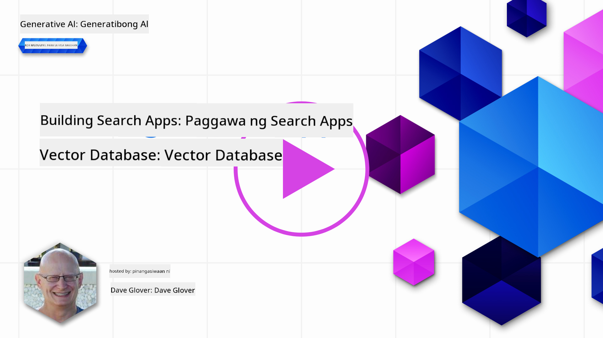
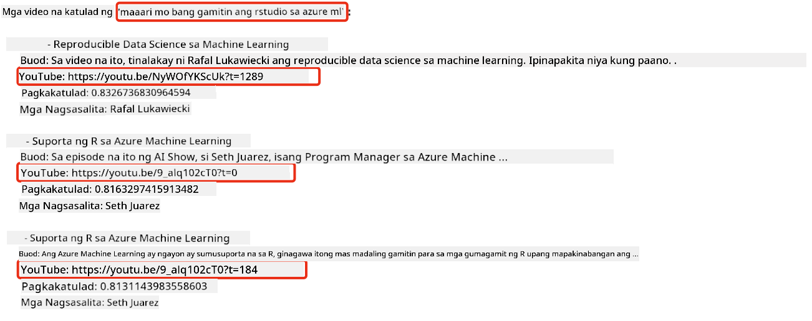
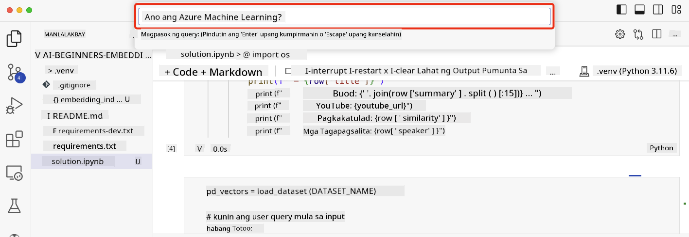

<!--
CO_OP_TRANSLATOR_METADATA:
{
  "original_hash": "d46aad0917a1a342d613e2c13d457da5",
  "translation_date": "2025-06-25T16:37:52+00:00",
  "source_file": "08-building-search-applications/README.md",
  "language_code": "tl"
}
-->
# Paggawa ng mga Search Application

[](https://aka.ms/gen-ai-lesson8-gh?WT.mc_id=academic-105485-koreyst)

> > _I-click ang larawan sa itaas para mapanood ang video ng araling ito_

Marami pang magagawa ang LLMs bukod sa mga chatbot at pagbuo ng teksto. Posible ring gumawa ng mga search application gamit ang Embeddings. Ang Embeddings ay mga numerikal na representasyon ng data na kilala rin bilang mga vectors, at maaaring gamitin para sa semantic search ng data.

Sa araling ito, gagawa ka ng search application para sa aming edukasyon startup. Ang aming startup ay isang non-profit na organisasyon na nagbibigay ng libreng edukasyon sa mga estudyante sa mga umuunlad na bansa. Ang aming startup ay may maraming YouTube videos na maaaring gamitin ng mga estudyante para matuto tungkol sa AI. Nais ng aming startup na gumawa ng isang search application na magpapahintulot sa mga estudyante na maghanap ng YouTube video sa pamamagitan ng pag-type ng isang tanong.

Halimbawa, maaaring mag-type ang isang estudyante ng 'Ano ang Jupyter Notebooks?' o 'Ano ang Azure ML' at ang search application ay magbabalik ng listahan ng mga YouTube video na may kaugnayan sa tanong, at mas maganda pa, ang search application ay magbabalik ng link sa lugar sa video kung saan matatagpuan ang sagot sa tanong.

## Panimula

Sa araling ito, tatalakayin natin ang:

- Semantic vs Keyword search.
- Ano ang Text Embeddings.
- Paglikha ng Text Embeddings Index.
- Paghahanap sa Text Embeddings Index.

## Mga Layunin sa Pagkatuto

Pagkatapos makumpleto ang araling ito, magagawa mong:

- Maipaliwanag ang pagkakaiba sa pagitan ng semantic at keyword search.
- Maipaliwanag kung ano ang Text Embeddings.
- Makagawa ng isang application gamit ang Embeddings para maghanap ng data.

## Bakit gumawa ng search application?

Ang paggawa ng search application ay makakatulong sa iyo na maunawaan kung paano gamitin ang Embeddings para maghanap ng data. Matutunan mo rin kung paano gumawa ng isang search application na maaaring gamitin ng mga estudyante upang mabilis na makahanap ng impormasyon.

Kasama sa aralin ang isang Embedding Index ng mga YouTube transcripts para sa Microsoft [AI Show](https://www.youtube.com/playlist?list=PLlrxD0HtieHi0mwteKBOfEeOYf0LJU4O1) YouTube channel. Ang AI Show ay isang YouTube channel na nagtuturo sa iyo tungkol sa AI at machine learning. Ang Embedding Index ay naglalaman ng Embeddings para sa bawat isa sa mga YouTube transcripts hanggang Oktubre 2023. Gagamitin mo ang Embedding Index upang bumuo ng isang search application para sa aming startup. Ang search application ay nagbabalik ng link sa lugar sa video kung saan matatagpuan ang sagot sa tanong. Ito ay isang mahusay na paraan para sa mga estudyante na mabilis na makahanap ng impormasyon na kanilang kailangan.

Ang sumusunod ay isang halimbawa ng semantic query para sa tanong na 'maaari mo bang gamitin ang rstudio sa azure ml?'. Tingnan ang YouTube url, makikita mo na ang url ay naglalaman ng timestamp na nagdadala sa iyo sa lugar sa video kung saan matatagpuan ang sagot sa tanong.



## Ano ang semantic search?

Ngayon, maaaring nagtataka ka, ano ang semantic search? Ang semantic search ay isang search technique na gumagamit ng semantics, o kahulugan, ng mga salita sa isang query upang magbalik ng mga may kaugnayang resulta.

Narito ang isang halimbawa ng semantic search. Sabihin natin na naghahanap ka ng bibilhin na kotse, maaari kang maghanap ng 'ang pangarap kong kotse', nauunawaan ng semantic search na hindi ka `dreaming` tungkol sa kotse, kundi naghahanap ka ng bibilhin na `ideal` kotse. Nauunawaan ng semantic search ang iyong layunin at nagbabalik ng mga may kaugnayang resulta. Ang alternatibo ay `keyword search` na literal na maghahanap ng mga pangarap tungkol sa mga kotse at madalas na nagbabalik ng mga hindi kaugnayang resulta.

## Ano ang Text Embeddings?

[Text embeddings](https://en.wikipedia.org/wiki/Word_embedding?WT.mc_id=academic-105485-koreyst) ay isang text representation technique na ginagamit sa [natural language processing](https://en.wikipedia.org/wiki/Natural_language_processing?WT.mc_id=academic-105485-koreyst). Ang Text embeddings ay mga semantic numerical representations ng teksto. Ang Embeddings ay ginagamit upang i-representa ang data sa paraang madaling maunawaan ng isang makina. Maraming modelo para sa pagbuo ng text embeddings, sa araling ito, magpo-focus tayo sa pagbuo ng embeddings gamit ang OpenAI Embedding Model.

Narito ang isang halimbawa, isipin na ang sumusunod na teksto ay nasa isang transcript mula sa isa sa mga episode sa AI Show YouTube channel:

```text
Today we are going to learn about Azure Machine Learning.
```

Ipapasa namin ang teksto sa OpenAI Embedding API at ito ay magbabalik ng sumusunod na embedding na binubuo ng 1536 na numero aka isang vector. Ang bawat numero sa vector ay kumakatawan sa ibang aspeto ng teksto. Para sa ikli, narito ang unang 10 numero sa vector.

```python
[-0.006655829958617687, 0.0026128944009542465, 0.008792596869170666, -0.02446001023054123, -0.008540431968867779, 0.022071078419685364, -0.010703742504119873, 0.003311325330287218, -0.011632772162556648, -0.02187200076878071, ...]
```

## Paano nalilikha ang Embedding index?

Ang Embedding index para sa araling ito ay nilikha gamit ang serye ng mga Python scripts. Makikita mo ang mga script kasama ang mga tagubilin sa [README](./scripts/README.md?WT.mc_id=academic-105485-koreyst) sa 'scripts' folder para sa araling ito. Hindi mo kailangan patakbuhin ang mga script na ito para makumpleto ang araling ito dahil ang Embedding Index ay ibinigay na para sa iyo.

Ang mga script ay nagsasagawa ng sumusunod na mga operasyon:

1. Ang transcript para sa bawat YouTube video sa [AI Show](https://www.youtube.com/playlist?list=PLlrxD0HtieHi0mwteKBOfEeOYf0LJU4O1) playlist ay dina-download.
2. Gamit ang [OpenAI Functions](https://learn.microsoft.com/azure/ai-services/openai/how-to/function-calling?WT.mc_id=academic-105485-koreyst), sinusubukan na makuha ang pangalan ng tagapagsalita mula sa unang 3 minuto ng YouTube transcript. Ang pangalan ng tagapagsalita para sa bawat video ay iniimbak sa Embedding Index na pinangalanang `embedding_index_3m.json`.
3. Ang transcript text ay hinahati sa **3 minutong text segments**. Ang segment ay naglalaman ng humigit-kumulang 20 salita na overlapping mula sa susunod na segment upang matiyak na ang Embedding para sa segment ay hindi maputol at upang magbigay ng mas mahusay na konteksto sa paghahanap.
4. Ang bawat text segment ay ipinapasa sa OpenAI Chat API upang ibuod ang teksto sa 60 salita. Ang buod ay iniimbak din sa Embedding Index `embedding_index_3m.json`.
5. Sa wakas, ang segment text ay ipinapasa sa OpenAI Embedding API. Ang Embedding API ay nagbabalik ng vector ng 1536 na numero na kumakatawan sa semantic na kahulugan ng segment. Ang segment kasama ang OpenAI Embedding vector ay iniimbak sa isang Embedding Index `embedding_index_3m.json`.

### Vector Databases

Para sa kasimplihan ng aralin, ang Embedding Index ay iniimbak sa isang JSON file na pinangalanang `embedding_index_3m.json` at ikinakarga sa isang Pandas DataFrame. Gayunpaman, sa produksyon, ang Embedding Index ay iniimbak sa isang vector database tulad ng [Azure Cognitive Search](https://learn.microsoft.com/training/modules/improve-search-results-vector-search?WT.mc_id=academic-105485-koreyst), [Redis](https://cookbook.openai.com/examples/vector_databases/redis/readme?WT.mc_id=academic-105485-koreyst), [Pinecone](https://cookbook.openai.com/examples/vector_databases/pinecone/readme?WT.mc_id=academic-105485-koreyst), [Weaviate](https://cookbook.openai.com/examples/vector_databases/weaviate/readme?WT.mc_id=academic-105485-koreyst), upang pangalanan ang ilan.

## Pag-unawa sa cosine similarity

Natuto tayo tungkol sa text embeddings, ang susunod na hakbang ay matutunan kung paano gamitin ang text embeddings upang maghanap ng data at partikular na hanapin ang pinaka-katulad na embeddings sa isang ibinigay na query gamit ang cosine similarity.

### Ano ang cosine similarity?

Ang cosine similarity ay isang sukat ng pagkakatulad sa pagitan ng dalawang vectors, maririnig mo rin itong tinutukoy bilang `nearest neighbor search`. Upang magsagawa ng isang cosine similarity search kailangan mong _vectorize_ para sa _query_ text gamit ang OpenAI Embedding API. Pagkatapos ay kalkulahin ang _cosine similarity_ sa pagitan ng query vector at bawat vector sa Embedding Index. Tandaan, ang Embedding Index ay may vector para sa bawat YouTube transcript text segment. Sa wakas, ayusin ang mga resulta sa pamamagitan ng cosine similarity at ang mga text segments na may pinakamataas na cosine similarity ay ang pinaka-katulad sa query.

Mula sa pananaw ng matematika, sinusukat ng cosine similarity ang cosine ng anggulo sa pagitan ng dalawang vectors na inaasinta sa isang multidimensional space. Ang sukat na ito ay kapaki-pakinabang, dahil kung ang dalawang dokumento ay malayo sa isa't isa sa pamamagitan ng Euclidean distance dahil sa laki, maaari pa rin silang magkaroon ng mas maliit na anggulo sa pagitan nila at samakatuwid ay mas mataas na cosine similarity. Para sa karagdagang impormasyon tungkol sa cosine similarity equations, tingnan ang [Cosine similarity](https://en.wikipedia.org/wiki/Cosine_similarity?WT.mc_id=academic-105485-koreyst).

## Pagbuo ng iyong unang search application

Susunod, matututo tayo kung paano bumuo ng isang search application gamit ang Embeddings. Ang search application ay magpapahintulot sa mga estudyante na maghanap ng video sa pamamagitan ng pag-type ng isang tanong. Ang search application ay magbabalik ng listahan ng mga video na may kaugnayan sa tanong. Ang search application ay magbabalik din ng link sa lugar sa video kung saan matatagpuan ang sagot sa tanong.

Ang solusyon na ito ay ginawa at nasubukan sa Windows 11, macOS, at Ubuntu 22.04 gamit ang Python 3.10 o mas bago. Maaari mong i-download ang Python mula sa [python.org](https://www.python.org/downloads/?WT.mc_id=academic-105485-koreyst).

## Takdang Aralin - paggawa ng search application, upang bigyang-kakayahan ang mga estudyante

Ipinakilala namin ang aming startup sa simula ng araling ito. Ngayon ay oras na upang bigyang-kakayahan ang mga estudyante na bumuo ng isang search application para sa kanilang mga pagsusuri.

Sa takdang araling ito, lilikha ka ng Azure OpenAI Services na gagamitin upang bumuo ng search application. Lilikha ka ng sumusunod na Azure OpenAI Services. Kakailanganin mo ng Azure subscription upang makumpleto ang takdang aralin na ito.

### Simulan ang Azure Cloud Shell

1. Mag-sign in sa [Azure portal](https://portal.azure.com/?WT.mc_id=academic-105485-koreyst).
2. Piliin ang Cloud Shell icon sa kanang-itaas na bahagi ng Azure portal.
3. Piliin ang **Bash** para sa uri ng environment.

#### Lumikha ng isang resource group

> Para sa mga tagubilin na ito, ginagamit namin ang resource group na pinangalanang "semantic-video-search" sa East US.
> Maaari mong baguhin ang pangalan ng resource group, ngunit kapag binabago ang lokasyon para sa mga resources,
> suriin ang [model availability table](https://aka.ms/oai/models?WT.mc_id=academic-105485-koreyst).

```shell
az group create --name semantic-video-search --location eastus
```

#### Lumikha ng isang Azure OpenAI Service resource

Mula sa Azure Cloud Shell, patakbuhin ang sumusunod na utos upang lumikha ng isang Azure OpenAI Service resource.

```shell
az cognitiveservices account create --name semantic-video-openai --resource-group semantic-video-search \
    --location eastus --kind OpenAI --sku s0
```

#### Kunin ang endpoint at mga susi para sa paggamit sa application na ito

Mula sa Azure Cloud Shell, patakbuhin ang sumusunod na mga utos upang makuha ang endpoint at mga susi para sa Azure OpenAI Service resource.

```shell
az cognitiveservices account show --name semantic-video-openai \
   --resource-group  semantic-video-search | jq -r .properties.endpoint
az cognitiveservices account keys list --name semantic-video-openai \
   --resource-group semantic-video-search | jq -r .key1
```

#### I-deploy ang OpenAI Embedding model

Mula sa Azure Cloud Shell, patakbuhin ang sumusunod na utos upang i-deploy ang OpenAI Embedding model.

```shell
az cognitiveservices account deployment create \
    --name semantic-video-openai \
    --resource-group  semantic-video-search \
    --deployment-name text-embedding-ada-002 \
    --model-name text-embedding-ada-002 \
    --model-version "2"  \
    --model-format OpenAI \
    --sku-capacity 100 --sku-name "Standard"
```

## Solusyon

Buksan ang [solution notebook](../../../08-building-search-applications/python/aoai-solution.ipynb) sa GitHub Codespaces at sundin ang mga tagubilin sa Jupyter Notebook.

Kapag pinatakbo mo ang notebook, hihilingin sa iyo na magpasok ng isang query. Ang input box ay magmumukhang ganito:



## Magaling na Trabaho! Ipagpatuloy ang Iyong Pagkatuto

Pagkatapos makumpleto ang araling ito, tingnan ang aming [Generative AI Learning collection](https://aka.ms/genai-collection?WT.mc_id=academic-105485-koreyst) upang ipagpatuloy ang pag-level up ng iyong kaalaman sa Generative AI!

Pumunta sa Aralin 9 kung saan titingnan natin kung paano [gumawa ng mga application sa pagbuo ng larawan](../09-building-image-applications/README.md?WT.mc_id=academic-105485-koreyst)!

**Pagtatatuwa**:  
Ang dokumentong ito ay isinalin gamit ang AI translation service na [Co-op Translator](https://github.com/Azure/co-op-translator). Habang sinisikap naming maging tumpak, pakitandaan na ang mga awtomatikong pagsasalin ay maaaring maglaman ng mga pagkakamali o hindi pagkakatumpak. Ang orihinal na dokumento sa kanyang katutubong wika ang dapat ituring na mapagkakatiwalaang pinagmulan. Para sa kritikal na impormasyon, inirerekomenda ang propesyonal na pagsasalin ng tao. Hindi kami mananagot para sa anumang hindi pagkakaintindihan o maling interpretasyon na dulot ng paggamit ng pagsasaling ito.