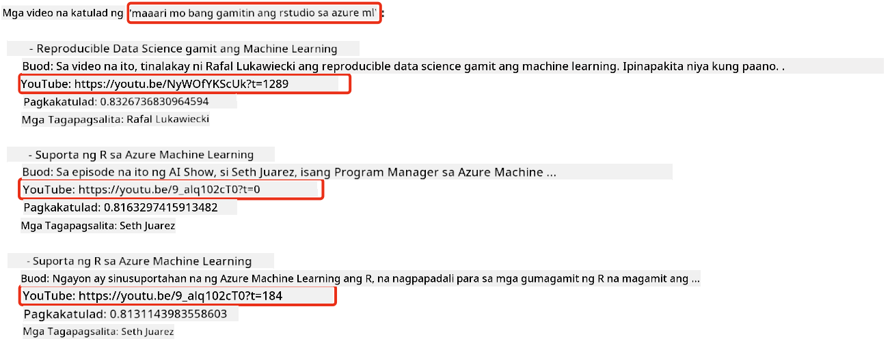

<!--
CO_OP_TRANSLATOR_METADATA:
{
  "original_hash": "58953c08b8ba7073b836d4270ea0fe86",
  "translation_date": "2025-10-17T13:18:23+00:00",
  "source_file": "08-building-search-applications/README.md",
  "language_code": "tl"
}
-->
# Pagbuo ng Search Applications

[](https://youtu.be/W0-nzXjOjr0?si=GcsqiTTvd7RKbo7V)

> > _I-click ang imahe sa itaas upang mapanood ang video ng araling ito_

Hindi lang chatbot at text generation ang magagawa ng LLMs. Posible rin ang pagbuo ng search applications gamit ang Embeddings. Ang Embeddings ay numerical na representasyon ng data na kilala rin bilang vectors, at maaaring gamitin para sa semantic search ng data.

Sa araling ito, gagawa ka ng search application para sa aming education startup. Ang aming startup ay isang non-profit na organisasyon na nagbibigay ng libreng edukasyon sa mga estudyante sa mga developing countries. Ang aming startup ay may malaking bilang ng mga YouTube videos na maaaring gamitin ng mga estudyante upang matuto tungkol sa AI. Ang aming startup ay nais bumuo ng search application na magpapahintulot sa mga estudyante na maghanap ng YouTube video sa pamamagitan ng pag-type ng tanong.

Halimbawa, maaaring magtanong ang isang estudyante ng 'Ano ang Jupyter Notebooks?' o 'Ano ang Azure ML' at ang search application ay magbabalik ng listahan ng mga YouTube videos na may kaugnayan sa tanong, at mas maganda pa, ang search application ay magbibigay ng link sa bahagi ng video kung saan matatagpuan ang sagot sa tanong.

## Panimula

Sa araling ito, tatalakayin natin:

- Semantic vs Keyword search.
- Ano ang Text Embeddings.
- Paglikha ng Text Embeddings Index.
- Paghahanap sa Text Embeddings Index.

## Mga Layunin sa Pag-aaral

Pagkatapos makumpleto ang araling ito, magagawa mo:

- Tukuyin ang pagkakaiba ng semantic at keyword search.
- Ipaliwanag kung ano ang Text Embeddings.
- Gumawa ng application gamit ang Embeddings para maghanap ng data.

## Bakit bumuo ng search application?

Ang paggawa ng search application ay makakatulong sa iyo na maunawaan kung paano gamitin ang Embeddings para maghanap ng data. Matututo ka rin kung paano bumuo ng search application na magagamit ng mga estudyante upang mabilis na makahanap ng impormasyon.

Ang aralin ay may kasamang Embedding Index ng mga transcript ng YouTube para sa Microsoft [AI Show](https://www.youtube.com/playlist?list=PLlrxD0HtieHi0mwteKBOfEeOYf0LJU4O1) YouTube channel. Ang AI Show ay isang YouTube channel na nagtuturo tungkol sa AI at machine learning. Ang Embedding Index ay naglalaman ng Embeddings para sa bawat transcript ng YouTube hanggang Oktubre 2023. Gagamitin mo ang Embedding Index upang bumuo ng search application para sa aming startup. Ang search application ay magbabalik ng link sa bahagi ng video kung saan matatagpuan ang sagot sa tanong. Ito ay isang mahusay na paraan para sa mga estudyante na mabilis na mahanap ang impormasyong kailangan nila.

Narito ang isang halimbawa ng semantic query para sa tanong na 'can you use rstudio with azure ml?'. Tingnan ang YouTube url, makikita mo na ang url ay naglalaman ng timestamp na magdadala sa iyo sa bahagi ng video kung saan matatagpuan ang sagot sa tanong.



## Ano ang semantic search?

Maaaring iniisip mo, ano ang semantic search? Ang semantic search ay isang search technique na gumagamit ng semantika, o kahulugan, ng mga salita sa isang query upang magbalik ng mga kaugnay na resulta.

Narito ang isang halimbawa ng semantic search. Halimbawa, gusto mong bumili ng kotse, maaaring maghanap ka ng 'my dream car', ang semantic search ay nauunawaan na hindi ka `nangangarap` ng kotse, kundi naghahanap ka ng iyong `ideal` na kotse. Nauunawaan ng semantic search ang iyong intensyon at nagbabalik ng mga kaugnay na resulta. Ang alternatibo ay `keyword search` na literal na maghahanap ng mga pangarap tungkol sa kotse at madalas na nagbabalik ng mga hindi kaugnay na resulta.

## Ano ang Text Embeddings?

[Text embeddings](https://en.wikipedia.org/wiki/Word_embedding?WT.mc_id=academic-105485-koreyst) ay isang text representation technique na ginagamit sa [natural language processing](https://en.wikipedia.org/wiki/Natural_language_processing?WT.mc_id=academic-105485-koreyst). Ang Text embeddings ay semantic numerical representations ng text. Ang Embeddings ay ginagamit upang i-representa ang data sa paraang madaling maunawaan ng makina. Maraming modelo para sa paggawa ng text embeddings, sa araling ito, magpo-focus tayo sa pagbuo ng embeddings gamit ang OpenAI Embedding Model.

Narito ang isang halimbawa, isipin ang sumusunod na text ay mula sa transcript ng isa sa mga episode sa AI Show YouTube channel:

```text
Today we are going to learn about Azure Machine Learning.
```

Ipapasa natin ang text sa OpenAI Embedding API at magbabalik ito ng embedding na binubuo ng 1536 na numero na tinatawag ding vector. Ang bawat numero sa vector ay kumakatawan sa iba't ibang aspeto ng text. Para sa kaiksian, narito ang unang 10 numero sa vector.

```python
[-0.006655829958617687, 0.0026128944009542465, 0.008792596869170666, -0.02446001023054123, -0.008540431968867779, 0.022071078419685364, -0.010703742504119873, 0.003311325330287218, -0.011632772162556648, -0.02187200076878071, ...]
```

## Paano nilikha ang Embedding index?

Ang Embedding index para sa araling ito ay nilikha gamit ang serye ng mga Python scripts. Makikita mo ang mga scripts kasama ang mga instruksyon sa [README](./scripts/README.md?WT.mc_id=academic-105485-koreyst) sa 'scripts' folder para sa araling ito. Hindi mo kailangang patakbuhin ang mga scripts na ito upang makumpleto ang araling ito dahil ang Embedding Index ay ibinigay na para sa iyo.

Ang mga scripts ay gumagawa ng sumusunod na operasyon:

1. Ang transcript para sa bawat YouTube video sa [AI Show](https://www.youtube.com/playlist?list=PLlrxD0HtieHi0mwteKBOfEeOYf0LJU4O1) playlist ay dina-download.
2. Gamit ang [OpenAI Functions](https://learn.microsoft.com/azure/ai-services/openai/how-to/function-calling?WT.mc_id=academic-105485-koreyst), sinusubukang kunin ang pangalan ng speaker mula sa unang 3 minuto ng YouTube transcript. Ang pangalan ng speaker para sa bawat video ay ini-store sa Embedding Index na tinatawag na `embedding_index_3m.json`.
3. Ang transcript text ay hinahati sa **3 minutong text segments**. Ang segment ay may kasamang humigit-kumulang 20 salita na overlapping mula sa susunod na segment upang matiyak na ang Embedding para sa segment ay hindi naputol at upang magbigay ng mas mahusay na search context.
4. Ang bawat text segment ay ipinapasa sa OpenAI Chat API upang i-summarize ang text sa 60 salita. Ang summary ay ini-store din sa Embedding Index `embedding_index_3m.json`.
5. Sa huli, ang segment text ay ipinapasa sa OpenAI Embedding API. Ang Embedding API ay nagbabalik ng vector na binubuo ng 1536 na numero na kumakatawan sa semantic na kahulugan ng segment. Ang segment kasama ang OpenAI Embedding vector ay ini-store sa Embedding Index `embedding_index_3m.json`.

### Vector Databases

Para sa kasimplehan ng aralin, ang Embedding Index ay ini-store sa isang JSON file na tinatawag na `embedding_index_3m.json` at niloload sa isang Pandas DataFrame. Gayunpaman, sa production, ang Embedding Index ay ini-store sa isang vector database tulad ng [Azure Cognitive Search](https://learn.microsoft.com/training/modules/improve-search-results-vector-search?WT.mc_id=academic-105485-koreyst), [Redis](https://cookbook.openai.com/examples/vector_databases/redis/readme?WT.mc_id=academic-105485-koreyst), [Pinecone](https://cookbook.openai.com/examples/vector_databases/pinecone/readme?WT.mc_id=academic-105485-koreyst), [Weaviate](https://cookbook.openai.com/examples/vector_databases/weaviate/readme?WT.mc_id=academic-105485-koreyst), at iba pa.

## Pag-unawa sa cosine similarity

Natuto na tayo tungkol sa text embeddings, ang susunod na hakbang ay ang pag-aaral kung paano gamitin ang text embeddings upang maghanap ng data at partikular na hanapin ang pinaka-katulad na embeddings sa isang ibinigay na query gamit ang cosine similarity.

### Ano ang cosine similarity?

Ang cosine similarity ay isang sukat ng pagkakatulad sa pagitan ng dalawang vectors, madalas mo rin itong maririnig bilang `nearest neighbor search`. Upang magsagawa ng cosine similarity search, kailangan mong _i-vectorize_ ang _query_ text gamit ang OpenAI Embedding API. Pagkatapos, kalkulahin ang _cosine similarity_ sa pagitan ng query vector at bawat vector sa Embedding Index. Tandaan, ang Embedding Index ay may vector para sa bawat YouTube transcript text segment. Sa huli, i-sort ang mga resulta ayon sa cosine similarity at ang mga text segments na may pinakamataas na cosine similarity ang pinaka-katulad sa query.

Mula sa matematikong perspektibo, sinusukat ng cosine similarity ang cosine ng anggulo sa pagitan ng dalawang vectors na naka-project sa isang multidimensional space. Ang sukat na ito ay kapaki-pakinabang, dahil kung ang dalawang dokumento ay malayo sa Euclidean distance dahil sa laki, maaari pa rin silang magkaroon ng mas maliit na anggulo sa pagitan nila at samakatuwid mas mataas na cosine similarity. Para sa karagdagang impormasyon tungkol sa cosine similarity equations, tingnan ang [Cosine similarity](https://en.wikipedia.org/wiki/Cosine_similarity?WT.mc_id=academic-105485-koreyst).

## Pagbuo ng iyong unang search application

Susunod, matututo tayo kung paano bumuo ng search application gamit ang Embeddings. Ang search application ay magpapahintulot sa mga estudyante na maghanap ng video sa pamamagitan ng pag-type ng tanong. Ang search application ay magbabalik ng listahan ng mga video na may kaugnayan sa tanong. Ang search application ay magbabalik din ng link sa bahagi ng video kung saan matatagpuan ang sagot sa tanong.

Ang solusyong ito ay ginawa at nasubukan sa Windows 11, macOS, at Ubuntu 22.04 gamit ang Python 3.10 o mas bago. Maaari mong i-download ang Python mula sa [python.org](https://www.python.org/downloads/?WT.mc_id=academic-105485-koreyst).

## Assignment - pagbuo ng search application, upang matulungan ang mga estudyante

Inilunsad namin ang aming startup sa simula ng araling ito. Ngayon ay oras na upang tulungan ang mga estudyante na bumuo ng search application para sa kanilang mga assessments.

Sa assignment na ito, gagawa ka ng Azure OpenAI Services na gagamitin upang bumuo ng search application. Gagawa ka ng mga sumusunod na Azure OpenAI Services. Kailangan mo ng Azure subscription upang makumpleto ang assignment na ito.

### Simulan ang Azure Cloud Shell

1. Mag-sign in sa [Azure portal](https://portal.azure.com/?WT.mc_id=academic-105485-koreyst).
2. Piliin ang icon ng Cloud Shell sa kanang itaas na bahagi ng Azure portal.
3. Piliin ang **Bash** para sa uri ng environment.

#### Gumawa ng resource group

> Para sa mga instruksyon na ito, gagamitin namin ang resource group na pinangalanang "semantic-video-search" sa East US.
> Maaari mong palitan ang pangalan ng resource group, ngunit kapag binago ang lokasyon para sa mga resources,
> tingnan ang [model availability table](https://aka.ms/oai/models?WT.mc_id=academic-105485-koreyst).

```shell
az group create --name semantic-video-search --location eastus
```

#### Gumawa ng Azure OpenAI Service resource

Mula sa Azure Cloud Shell, patakbuhin ang sumusunod na command upang gumawa ng Azure OpenAI Service resource.

```shell
az cognitiveservices account create --name semantic-video-openai --resource-group semantic-video-search \
    --location eastus --kind OpenAI --sku s0
```

#### Kunin ang endpoint at mga keys para sa paggamit sa application na ito

Mula sa Azure Cloud Shell, patakbuhin ang sumusunod na mga command upang makuha ang endpoint at mga keys para sa Azure OpenAI Service resource.

```shell
az cognitiveservices account show --name semantic-video-openai \
   --resource-group  semantic-video-search | jq -r .properties.endpoint
az cognitiveservices account keys list --name semantic-video-openai \
   --resource-group semantic-video-search | jq -r .key1
```

#### I-deploy ang OpenAI Embedding model

Mula sa Azure Cloud Shell, patakbuhin ang sumusunod na command upang i-deploy ang OpenAI Embedding model.

```shell
az cognitiveservices account deployment create \
    --name semantic-video-openai \
    --resource-group  semantic-video-search \
    --deployment-name text-embedding-ada-002 \
    --model-name text-embedding-ada-002 \
    --model-version "2"  \
    --model-format OpenAI \
    --sku-capacity 100 --sku-name "Standard"
```

## Solusyon

Buksan ang [solution notebook](./python/aoai-solution.ipynb?WT.mc_id=academic-105485-koreyst) sa GitHub Codespaces at sundin ang mga instruksyon sa Jupyter Notebook.

Kapag pinatakbo mo ang notebook, hihilingin sa iyo na maglagay ng query. Ang input box ay magmumukhang ganito:


## Mahusay na Trabaho! Ipagpatuloy ang Iyong Pag-aaral

Pagkatapos makumpleto ang araling ito, tingnan ang aming [Generative AI Learning collection](https://aka.ms/genai-collection?WT.mc_id=academic-105485-koreyst) upang patuloy na paunlarin ang iyong kaalaman sa Generative AI!

Pumunta sa Lesson 9 kung saan tatalakayin natin kung paano [bumuo ng image generation applications](../09-building-image-applications/README.md?WT.mc_id=academic-105485-koreyst)!

---

**Paunawa**:  
Ang dokumentong ito ay isinalin gamit ang AI translation service na [Co-op Translator](https://github.com/Azure/co-op-translator). Bagamat sinisikap naming maging tumpak, pakatandaan na ang mga awtomatikong pagsasalin ay maaaring maglaman ng mga pagkakamali o hindi pagkakatugma. Ang orihinal na dokumento sa kanyang katutubong wika ang dapat ituring na opisyal na sanggunian. Para sa mahalagang impormasyon, inirerekomenda ang propesyonal na pagsasalin ng tao. Hindi kami mananagot sa anumang hindi pagkakaunawaan o maling interpretasyon na dulot ng paggamit ng pagsasaling ito.