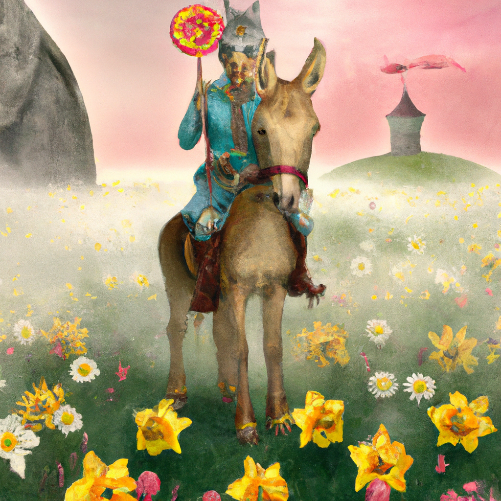

<!--
CO_OP_TRANSLATOR_METADATA:
{
  "original_hash": "7a655f30d1dcbdfe6eff2558eff249af",
  "translation_date": "2025-06-25T17:30:00+00:00",
  "source_file": "09-building-image-applications/README.md",
  "language_code": "tl"
}
-->
# Pagbuo ng mga Aplikasyon para sa Paggawa ng Larawan

May higit pa sa LLMs kaysa sa paggawa ng teksto. Posible ring gumawa ng mga larawan mula sa mga deskripsyon ng teksto. Ang pagkakaroon ng mga larawan bilang isang modality ay maaaring maging lubos na kapaki-pakinabang sa iba't ibang larangan mula sa MedTech, arkitektura, turismo, pagbuo ng laro at iba pa. Sa kabanatang ito, titingnan natin ang dalawang pinakasikat na modelo ng paggawa ng larawan, ang DALL-E at Midjourney.

## Panimula

Sa leksyong ito, tatalakayin natin:

- Paggawa ng larawan at kung bakit ito kapaki-pakinabang.
- DALL-E at Midjourney, ano ang mga ito, at paano ito gumagana.
- Paano ka makakabuo ng isang app para sa paggawa ng larawan.

## Mga Layunin sa Pag-aaral

Pagkatapos makumpleto ang leksyon na ito, magagawa mong:

- Bumuo ng isang aplikasyon para sa paggawa ng larawan.
- Tukuyin ang mga hangganan para sa iyong aplikasyon gamit ang mga meta prompt.
- Magtrabaho gamit ang DALL-E at Midjourney.

## Bakit bumuo ng isang aplikasyon para sa paggawa ng larawan?

Ang mga aplikasyon para sa paggawa ng larawan ay isang mahusay na paraan upang tuklasin ang mga kakayahan ng Generative AI. Maaari silang magamit para sa, halimbawa:

- **Pag-edit at pag-synthesize ng larawan**. Maaari kang lumikha ng mga larawan para sa iba't ibang gamit, tulad ng pag-edit ng larawan at pag-synthesize ng larawan.

- **Maaaring gamitin sa iba't ibang industriya**. Maaari rin silang magamit upang lumikha ng mga larawan para sa iba't ibang industriya tulad ng Medtech, Turismo, Pagbuo ng laro at iba pa.

## Scenario: Edu4All

Bilang bahagi ng leksyon na ito, ipagpapatuloy natin ang pagtatrabaho sa ating startup, ang Edu4All, sa leksyon na ito. Ang mga estudyante ay lilikha ng mga larawan para sa kanilang mga pagsusuri, anuman ang mga larawan ay nasa mga estudyante, ngunit maaari silang maging mga ilustrasyon para sa kanilang sariling fairytale o lumikha ng bagong karakter para sa kanilang kwento o tulungan silang maisalarawan ang kanilang mga ideya at konsepto.

Narito ang maaaring malikha ng mga estudyante ng Edu4All kung sila ay nagtatrabaho sa klase sa mga monumento:


gamit ang isang prompt tulad ng

> "Aso sa tabi ng Eiffel Tower sa maagang sikat ng araw"

## Ano ang DALL-E at Midjourney?

Ang [DALL-E](https://openai.com/dall-e-2?WT.mc_id=academic-105485-koreyst) at [Midjourney](https://www.midjourney.com/?WT.mc_id=academic-105485-koreyst) ay dalawa sa pinakasikat na mga modelo ng paggawa ng larawan, pinapayagan ka nilang gumamit ng mga prompt upang makabuo ng mga larawan.

### DALL-E

Magsimula tayo sa DALL-E, na isang Generative AI model na gumagawa ng mga larawan mula sa mga deskripsyon ng teksto.

> [Ang DALL-E ay isang kumbinasyon ng dalawang modelo, CLIP at diffused attention](https://towardsdatascience.com/openais-dall-e-and-clip-101-a-brief-introduction-3a4367280d4e?WT.mc_id=academic-105485-koreyst).

- **CLIP**, ay isang modelo na gumagawa ng mga embeddings, na mga numerikal na representasyon ng data, mula sa mga larawan at teksto.

- **Diffused attention**, ay isang modelo na gumagawa ng mga larawan mula sa embeddings. Ang DALL-E ay sinanay sa isang dataset ng mga larawan at teksto at maaaring gamitin upang makabuo ng mga larawan mula sa mga deskripsyon ng teksto. Halimbawa, ang DALL-E ay maaaring gamitin upang makabuo ng mga larawan ng isang pusa na may sombrero, o isang aso na may mohawk.

### Midjourney

Ang Midjourney ay gumagana sa katulad na paraan sa DALL-E, ito ay gumagawa ng mga larawan mula sa mga text prompt. Ang Midjourney, ay maaari ring gamitin upang makabuo ng mga larawan gamit ang mga prompt tulad ng "isang pusa na may sombrero", o isang "aso na may mohawk".


_Larawang kredito Wikipedia, larawang nalikha ng Midjourney_

## Paano gumagana ang DALL-E at Midjourney

Una, [DALL-E](https://arxiv.org/pdf/2102.12092.pdf?WT.mc_id=academic-105485-koreyst). Ang DALL-E ay isang Generative AI model batay sa transformer architecture na may _autoregressive transformer_.

Ang _autoregressive transformer_ ay tumutukoy kung paano gumagawa ang isang modelo ng mga larawan mula sa mga deskripsyon ng teksto, ito ay gumagawa ng isang pixel sa bawat pagkakataon, at pagkatapos ay ginagamit ang mga nalikhang pixel upang makabuo ng susunod na pixel. Dumadaan ito sa maraming layer sa isang neural network, hanggang sa makumpleto ang larawan.

Sa prosesong ito, kinokontrol ng DALL-E ang mga katangian, bagay, katangian, at higit pa sa larawang nalilikha nito. Gayunpaman, ang DALL-E 2 at 3 ay may higit na kontrol sa nalikhang larawan.

## Pagbuo ng iyong unang aplikasyon para sa paggawa ng larawan

Ano ang kinakailangan upang makabuo ng isang aplikasyon para sa paggawa ng larawan? Kailangan mo ang mga sumusunod na library:

- **python-dotenv**, lubos na inirerekomenda na gamitin ang library na ito upang itago ang iyong mga sikreto sa isang _.env_ na file na hiwalay sa code.
- **openai**, ito ang library na gagamitin mo upang makipag-ugnayan sa OpenAI API.
- **pillow**, upang magtrabaho sa mga larawan sa Python.
- **requests**, upang makatulong sa paggawa ng mga HTTP request.

1. Gumawa ng isang file na _.env_ na may ganitong nilalaman:

   ```text
   AZURE_OPENAI_ENDPOINT=<your endpoint>
   AZURE_OPENAI_API_KEY=<your key>
   ```

   Hanapin ang impormasyong ito sa Azure Portal para sa iyong resource sa seksyon na "Keys and Endpoint".

1. Kolektahin ang mga nabanggit na library sa isang file na tinatawag na _requirements.txt_ tulad nito:

   ```text
   python-dotenv
   openai
   pillow
   requests
   ```

1. Susunod, gumawa ng virtual na kapaligiran at i-install ang mga library:

   ```bash
   python3 -m venv venv
   source venv/bin/activate
   pip install -r requirements.txt
   ```

   Para sa Windows, gamitin ang mga sumusunod na utos upang lumikha at i-activate ang iyong virtual na kapaligiran:

   ```bash
   python3 -m venv venv
   venv\Scripts\activate.bat
   ```

1. Idagdag ang sumusunod na code sa file na tinatawag na _app.py_:

   ```python
   import openai
   import os
   import requests
   from PIL import Image
   import dotenv

   # import dotenv
   dotenv.load_dotenv()

   # Get endpoint and key from environment variables
   openai.api_base = os.environ['AZURE_OPENAI_ENDPOINT']
   openai.api_key = os.environ['AZURE_OPENAI_API_KEY']

   # Assign the API version (DALL-E is currently supported for the 2023-06-01-preview API version only)
   openai.api_version = '2023-06-01-preview'
   openai.api_type = 'azure'


   try:
       # Create an image by using the image generation API
       generation_response = openai.Image.create(
           prompt='Bunny on horse, holding a lollipop, on a foggy meadow where it grows daffodils',    # Enter your prompt text here
           size='1024x1024',
           n=2,
           temperature=0,
       )
       # Set the directory for the stored image
       image_dir = os.path.join(os.curdir, 'images')

       # If the directory doesn't exist, create it
       if not os.path.isdir(image_dir):
           os.mkdir(image_dir)

       # Initialize the image path (note the filetype should be png)
       image_path = os.path.join(image_dir, 'generated-image.png')

       # Retrieve the generated image
       image_url = generation_response["data"][0]["url"]  # extract image URL from response
       generated_image = requests.get(image_url).content  # download the image
       with open(image_path, "wb") as image_file:
           image_file.write(generated_image)

       # Display the image in the default image viewer
       image = Image.open(image_path)
       image.show()

   # catch exceptions
   except openai.InvalidRequestError as err:
       print(err)

   ```

Ipaliwanag natin ang code na ito:

- Una, ina-import natin ang mga library na kailangan natin, kabilang ang OpenAI library, dotenv library, requests library, at Pillow library.

  ```python
  import openai
  import os
  import requests
  from PIL import Image
  import dotenv
  ```

- Susunod, ini-load natin ang mga environment variable mula sa _.env_ na file.

  ```python
  # import dotenv
  dotenv.load_dotenv()
  ```

- Pagkatapos nito, itinakda natin ang endpoint, key para sa OpenAI API, bersyon at uri.

  ```python
  # Get endpoint and key from environment variables
  openai.api_base = os.environ['AZURE_OPENAI_ENDPOINT']
  openai.api_key = os.environ['AZURE_OPENAI_API_KEY']

  # add version and type, Azure specific
  openai.api_version = '2023-06-01-preview'
  openai.api_type = 'azure'
  ```

- Susunod, nalilikha natin ang larawan:

  ```python
  # Create an image by using the image generation API
  generation_response = openai.Image.create(
      prompt='Bunny on horse, holding a lollipop, on a foggy meadow where it grows daffodils',    # Enter your prompt text here
      size='1024x1024',
      n=2,
      temperature=0,
  )
  ```

  Ang code sa itaas ay tumutugon ng isang JSON object na naglalaman ng URL ng nalikhang larawan. Maaari nating gamitin ang URL upang i-download ang larawan at i-save ito sa isang file.

- Sa wakas, binubuksan natin ang larawan at ginagamit ang standard image viewer upang ipakita ito:

  ```python
  image = Image.open(image_path)
  image.show()
  ```

### Higit pang detalye sa pagbuo ng larawan

Tingnan natin ang code na bumubuo ng larawan nang mas detalyado:

```python
generation_response = openai.Image.create(
        prompt='Bunny on horse, holding a lollipop, on a foggy meadow where it grows daffodils',    # Enter your prompt text here
        size='1024x1024',
        n=2,
        temperature=0,
    )
```

- **prompt**, ay ang text prompt na ginagamit upang lumikha ng larawan. Sa kasong ito, ginagamit natin ang prompt na "Bunny on horse, holding a lollipop, on a foggy meadow where it grows daffodils".
- **size**, ay ang laki ng larawang nalilikha. Sa kasong ito, gumagawa tayo ng larawan na may sukat na 1024x1024 pixels.
- **n**, ay ang bilang ng mga larawang nalilikha. Sa kasong ito, gumagawa tayo ng dalawang larawan.
- **temperature**, ay isang parameter na kumokontrol sa randomness ng output ng isang Generative AI model. Ang temperatura ay isang halaga sa pagitan ng 0 at 1 kung saan ang 0 ay nangangahulugang ang output ay deterministic at ang 1 ay nangangahulugang ang output ay random. Ang default na halaga ay 0.7.

Mayroon pang ibang mga bagay na maaari mong gawin sa mga larawan na tatalakayin natin sa susunod na seksyon.

## Karagdagang kakayahan ng paggawa ng larawan

Nakita mo na kung paano tayo nakagawa ng larawan gamit ang ilang linya sa Python. Gayunpaman, may iba pang mga bagay na maaari mong gawin sa mga larawan.

Maaari mo ring gawin ang mga sumusunod:

- **Gumawa ng mga pagbabago**. Sa pamamagitan ng pagbibigay ng isang umiiral na larawan ng mask at isang prompt, maaari mong baguhin ang isang larawan. Halimbawa, maaari kang magdagdag ng isang bagay sa isang bahagi ng larawan. Isipin ang ating larawan ng kuneho, maaari kang magdagdag ng sombrero sa kuneho. Paano mo ito gagawin ay sa pamamagitan ng pagbibigay ng larawan, isang mask (na tumutukoy sa bahagi ng lugar para sa pagbabago) at isang text prompt upang sabihin kung ano ang dapat gawin.

  ```python
  response = openai.Image.create_edit(
    image=open("base_image.png", "rb"),
    mask=open("mask.png", "rb"),
    prompt="An image of a rabbit with a hat on its head.",
    n=1,
    size="1024x1024"
  )
  image_url = response['data'][0]['url']
  ```

  Ang base image ay naglalaman lamang ng kuneho ngunit ang pangwakas na larawan ay magkakaroon ng sombrero sa kuneho.

- **Lumikha ng mga variation**. Ang ideya ay kumuha ka ng isang umiiral na larawan at hilingin na lumikha ng mga variation. Upang lumikha ng variation, magbigay ng isang larawan at isang text prompt at code tulad nito:

  ```python
  response = openai.Image.create_variation(
    image=open("bunny-lollipop.png", "rb"),
    n=1,
    size="1024x1024"
  )
  image_url = response['data'][0]['url']
  ```

  > Tandaan, ito ay sinusuportahan lamang sa OpenAI

## Temperatura

Ang temperatura ay isang parameter na kumokontrol sa randomness ng output ng isang Generative AI model. Ang temperatura ay isang halaga sa pagitan ng 0 at 1 kung saan ang 0 ay nangangahulugang ang output ay deterministic at ang 1 ay nangangahulugang ang output ay random. Ang default na halaga ay 0.7.

Tingnan natin ang isang halimbawa kung paano gumagana ang temperatura, sa pamamagitan ng pagtakbo sa prompt na ito nang dalawang beses:

> Prompt : "Bunny on horse, holding a lollipop, on a foggy meadow where it grows daffodils"


Ngayon subukan nating patakbuhin ang parehong prompt upang makita na hindi natin makukuha ang parehong larawan nang dalawang beses:


Tulad ng nakikita mo, ang mga larawan ay magkatulad, ngunit hindi pareho. Subukan nating baguhin ang halaga ng temperatura sa 0.1 at tingnan kung ano ang mangyayari:

```python
 generation_response = openai.Image.create(
        prompt='Bunny on horse, holding a lollipop, on a foggy meadow where it grows daffodils',    # Enter your prompt text here
        size='1024x1024',
        n=2
    )
```

### Pagbabago ng temperatura

Kaya't subukan nating gawing mas deterministic ang tugon. Mapapansin natin mula sa dalawang larawang nalikha na sa unang larawan, mayroong kuneho at sa pangalawang larawan, mayroong kabayo, kaya't ang mga larawan ay lubos na nag-iiba.

Kaya't baguhin natin ang ating code at itakda ang temperatura sa 0, tulad nito:

```python
generation_response = openai.Image.create(
        prompt='Bunny on horse, holding a lollipop, on a foggy meadow where it grows daffodils',    # Enter your prompt text here
        size='1024x1024',
        n=2,
        temperature=0
    )
```

Ngayon kapag pinatakbo mo ang code na ito, makakakuha ka ng mga larawang ito:

- 
- 

Dito mo malinaw na makikita kung paano mas nagkakahawig ang mga larawan.

## Paano tukuyin ang mga hangganan para sa iyong aplikasyon gamit ang metaprompts

Sa aming demo, maaari na tayong makagawa ng mga larawan para sa aming mga kliyente. Gayunpaman, kailangan nating lumikha ng ilang mga hangganan para sa aming aplikasyon.

Halimbawa, ayaw nating lumikha ng mga larawan na hindi ligtas para sa trabaho, o hindi angkop para sa mga bata.

Maaari nating gawin ito gamit ang _metaprompts_. Ang Metaprompts ay mga text prompt na ginagamit upang kontrolin ang output ng isang Generative AI model. Halimbawa, maaari nating gamitin ang metaprompts upang kontrolin ang output, at matiyak na ang mga nalikhang larawan ay ligtas para sa trabaho, o angkop para sa mga bata.

### Paano ito gumagana?

Ngayon, paano gumagana ang meta prompts?

Ang Meta prompts ay mga text prompt na ginagamit upang kontrolin ang output ng isang Generative AI model, sila ay nakaposisyon bago ang text prompt, at ginagamit upang kontrolin ang output ng modelo at naka-embed sa mga aplikasyon upang kontrolin ang output ng modelo. Ikinukulong ang input ng prompt at ang input ng meta prompt sa isang text prompt.

Isang halimbawa ng meta prompt ay ang sumusunod:

```text
You are an assistant designer that creates images for children.

The image needs to be safe for work and appropriate for children.

The image needs to be in color.

The image needs to be in landscape orientation.

The image needs to be in a 16:9 aspect ratio.

Do not consider any input from the following that is not safe for work or appropriate for children.

(Input)

```

Ngayon, tingnan natin kung paano natin magagamit ang meta prompts sa ating demo.

```python
disallow_list = "swords, violence, blood, gore, nudity, sexual content, adult content, adult themes, adult language, adult humor, adult jokes, adult situations, adult"

meta_prompt =f"""You are an assistant designer that creates images for children.

The image needs to be safe for work and appropriate for children.

The image needs to be in color.

The image needs to be in landscape orientation.

The image needs to be in a 16:9 aspect ratio.

Do not consider any input from the following that is not safe for work or appropriate for children.
{disallow_list}
"""

prompt = f"{meta_prompt}
Create an image of a bunny on a horse, holding a lollipop"

# TODO add request to generate image
```

Mula sa prompt sa itaas, makikita mo kung paano isinasaalang-alang ng lahat ng mga larawang nalikha ang metaprompt.

## Takdang-aralin - pasiglahin natin ang mga estudyante

Ipinakilala natin ang Edu4All sa simula ng leksyon na ito. Ngayon ay oras na upang pasiglahin ang mga estudyante na lumikha ng mga larawan para sa kanilang mga pagsusuri.

Ang mga estudyante ay lilikha ng mga larawan para sa kanilang mga pagsusuri na naglalaman ng mga monumento, eksaktong anong mga monumento ang nasa mga estudyante. Ang mga estudyante ay hinihiling na gamitin ang kanilang pagkamalikhain sa gawaing ito upang ilagay ang mga monumento sa iba't ibang konteksto.

## Solusyon

Narito ang isang posibleng solusyon:

```python
import openai
import os
import requests
from PIL import Image
import dotenv

# import dotenv
dotenv.load_dotenv()

# Get endpoint and key from environment variables
openai.api_base = "<replace with endpoint>"
openai.api_key = "<replace with api key>"

# Assign the API version (DALL-E is currently supported for the 2023-06-01-preview API version only)
openai.api_version = '2023-06-01-preview'
openai.api_type = 'azure'

disallow_list = "swords, violence, blood, gore, nudity, sexual content, adult content, adult themes, adult language, adult humor, adult jokes, adult situations, adult"

meta_prompt = f"""You are an assistant designer that creates images for children.

The image needs to be safe for work and appropriate for children.

The image needs to be in color.

The image needs to be in landscape orientation.

The image needs to be in a 16:9 aspect ratio.

Do not consider any input from the following that is not safe for work or appropriate for children.
{disallow_list}"""

prompt = f"""{metaprompt}
Generate monument of the Arc of Triumph in Paris, France, in the evening light with a small child holding a Teddy looks on.
""""

try:
    # Create an image by using the image generation API
    generation_response = openai.Image.create(
        prompt=prompt,    # Enter your prompt text here
        size='1024x1024',
        n=2,
        temperature=0,
    )
    # Set the directory for the stored image
    image_dir = os.path.join(os.curdir, 'images')

    # If the directory doesn't exist, create it
    if not os.path.isdir(image_dir):
        os.mkdir(image_dir)

    # Initialize the image path (note the filetype should be png)
    image_path = os.path.join(image_dir, 'generated-image.png')

    # Retrieve the generated image
    image_url = generation_response["data"][0]["url"]  # extract image URL from response
    generated_image = requests.get(image_url).content  # download the image
    with open(image_path, "wb") as image_file:
        image_file.write(generated_image)

    # Display the image in the default image viewer
    image = Image.open(image_path)
    image.show()

# catch exceptions
except openai.InvalidRequestError as err:
    print(err)
```

## Magaling na Trabaho! Ipagpatuloy ang Iyong Pag-aaral

Matapos makumpleto ang leksyon na ito, tingnan ang aming [Generative AI Learning collection](https://aka.ms/genai-collection?WT.mc_id=academic-105485-koreyst) upang ipagpatuloy ang pagpapalawak ng iyong kaalaman sa Generative AI!

Pumunta sa Lesson 10 kung saan titingnan natin kung paano [bumuo ng AI applications gamit ang low-code](../10-building-low-code-ai-applications/README.md?WT.mc_id=academic-105485-koreyst)

**Paunawa**:  
Ang dokumentong ito ay isinalin gamit ang AI translation service na [Co-op Translator](https://github.com/Azure/co-op-translator). Habang nagsusumikap kami para sa katumpakan, mangyaring tandaan na ang mga awtomatikong pagsasalin ay maaaring maglaman ng mga pagkakamali o hindi pagkakatumpak. Ang orihinal na dokumento sa sarili nitong wika ay dapat ituring na mapagkakatiwalaang mapagkukunan. Para sa mahalagang impormasyon, inirerekomenda ang propesyonal na pagsasalin ng tao. Hindi kami mananagot para sa anumang hindi pagkakaintindihan o maling interpretasyon na dulot ng paggamit ng pagsasaling ito.