# Paggawa ng Low Code AI Applications

> _(I-click ang larawan sa itaas upang panoorin ang video ng araling ito)_

## Panimula

Ngayon na natutunan na natin kung paano gumawa ng mga app na nag-ge-generate ng larawan, pag-usapan naman natin ang low code. Maaaring gamitin ang Generative AI sa iba't ibang larangan kasama na ang low code, ngunit ano nga ba ang low code at paano natin maidaragdag ang AI dito?

Mas naging madali na ang paggawa ng mga app at solusyon para sa mga tradisyunal na developer at hindi developer gamit ang Low Code Development Platforms. Pinapayagan ng Low Code Development Platforms ang paggawa ng mga app at solusyon gamit ang kaunti o walang coding. Nakakamit ito sa pamamagitan ng pagbibigay ng visual na development environment kung saan maari kang mag-drag and drop ng mga komponent upang makabuo ng app at solusyon. Dahil dito, mas mabilis at mas kaunting resources ang kailangan sa paggawa ng app at solusyon. Sa araling ito, tatalakayin natin nang malalim kung paano gamitin ang Low Code at kung paano mapapabuti ang paggawa ng low code gamit ang AI gamit ang Power Platform.

Nagbibigay ang Power Platform ng oportunidad sa mga organisasyon na bigyan kapangyarihan ang kanilang mga koponan na gumawa ng sarili nilang mga solusyon sa pamamagitan ng isang intuitive low-code o no-code environment. Pinapadali ng environment na ito ang proseso ng paggawa ng mga solusyon. Sa Power Platform, ang mga solusyon ay maaaring mabuo sa loob ng mga araw o linggo, imbes na buwan o taon. Binubuo ang Power Platform ng limang pangunahing produkto: Power Apps, Power Automate, Power BI, Power Pages at Copilot Studio.

Saklaw ng araling ito:

- Panimula sa Generative AI sa Power Platform
- Panimula sa Copilot at kung paano ito gamitin
- Paggamit ng Generative AI sa paggawa ng mga app at flows sa Power Platform
- Pag-unawa sa AI Models sa Power Platform gamit ang AI Builder
- Paggawa ng mga intelligent agents gamit ang Microsoft Copilot Studio

## Mga Layunin ng Pagkatuto

Sa pagtatapos ng araling ito, magagawa mong:

- Maunawaan kung paano gumagana ang Copilot sa Power Platform.

- Gumawa ng Student Assignment Tracker App para sa aming edukasyong startup.

- Gumawa ng Invoice Processing Flow na gumagamit ng AI upang kumuha ng impormasyon mula sa mga invoice.

- Mag-apply ng mga best practices kapag gumagamit ng Create Text with GPT AI Model.

- Maunawaan kung ano ang Microsoft Copilot Studio at kung paano gumawa ng mga intelligent agents dito.

Ang mga tools at teknolohiyang gagamitin mo sa araling ito ay:

- **Power Apps**, para sa Student Assignment Tracker app, na nagbibigay ng low-code development environment para sa paggawa ng app na sumusubaybay, nagma-manage at nakikipag-ugnayan sa data.

- **Dataverse**, para sa pag-iimbak ng data ng Student Assignment Tracker app kung saan nagbibigay ang Dataverse ng low-code data platform para sa pag-iimbak ng data ng app.

- **Power Automate**, para sa Invoice Processing flow kung saan magkakaroon ka ng low-code development environment para gumawa ng workflows upang i-automate ang Invoice Processing process.

- **AI Builder**, para sa Invoice Processing AI Model kung saan gagamitin mo ang mga prebuilt AI Models upang iproseso ang mga invoice para sa aming startup.

## Generative AI sa Power Platform

Ang pagpapahusay ng low-code development at aplikasyon gamit ang generative AI ay isang mahalagang pokus para sa Power Platform. Ang layunin ay bigyang kakayahan ang lahat na gumawa ng mga AI-powered app, site, dashboard at mag-automate ng mga proseso gamit ang AI, _nang hindi nangangailangan ng anumang data science na kaalaman_. Nakakamit ang layuning ito sa pamamagitan ng pag-integrate ng generative AI sa low-code development experience sa Power Platform sa anyo ng Copilot at AI Builder.

### Paano ito gumagana?

Ang Copilot ay isang AI assistant na nagpapahintulot sa iyo na gumawa ng mga solusyon sa Power Platform sa pamamagitan ng paglalarawan ng iyong mga pangangailangan sa isang serye ng mga conversational steps gamit ang natural na wika. Halimbawa, maaari mong sabihin sa iyong AI assistant kung anong mga field ang gagamitin ng iyong app at gagawa ito ng parehong app at ng underlying data model o maaari mong ispecify kung paano mag-setup ng flow sa Power Automate.

Maaari mong gamitin ang mga Copilot driven functionalities bilang tampok sa mga screen ng iyong app upang bigyang kakayahan ang mga gumagamit na makakita ng mga insight sa pamamagitan ng conversational interactions.

Ang AI Builder ay isang low-code AI capability na available sa Power Platform na nagpapahintulot sa iyo na gamitin ang AI Models upang tulungan kang i-automate ang mga proseso at hulaan ang mga resulta. Sa AI Builder maaari mong dalhin ang AI sa iyong mga app at flows na kumokonekta sa iyong data sa Dataverse o sa iba't ibang cloud data sources, tulad ng SharePoint, OneDrive o Azure.

Available ang Copilot sa lahat ng mga produkto ng Power Platform: Power Apps, Power Automate, Power BI, Power Pages at Copilot Studio (dating Power Virtual Agents). Available naman ang AI Builder sa Power Apps at Power Automate. Sa araling ito, magtutuon tayo sa kung paano gamitin ang Copilot at AI Builder sa Power Apps at Power Automate para gumawa ng solusyon para sa aming edukasyong startup.

### Copilot sa Power Apps

Bilang bahagi ng Power Platform, nagbibigay ang Power Apps ng low-code development environment para sa paggawa ng mga app na sumusubaybay, nagma-manage at nakikipag-ugnayan sa data. Ito ay isang suite ng mga services para sa pagbuo ng app na may scalable data platform at kakayahang kumonekta sa mga cloud services at on-premises data. Pinapayagan ng Power Apps na makagawa ka ng mga app na tumatakbo sa browsers, tablet, at mga telepono, at maaaring ibahagi sa mga kasamahan. Pinadadali ng Power Apps ang pagbuo ng app para sa mga gumagamit gamit ang isang simpleng interface, kaya bawat business user o pro developer ay maaaring gumawa ng custom apps. Pinalalakas din ang karanasan ng pagbuo ng app gamit ang Generative AI sa pamamagitan ng Copilot.

Pinapahintulutan ka ng copilot AI assistant feature sa Power Apps na ilarawan kung anong klaseng app ang kailangan mo at kung anong impormasyon ang gusto mong subaybayan, kolektahin, o ipakita ng iyong app. Ginagawa ng Copilot ang isang responsive Canvas app base sa iyong paglalarawan. Maaari mo itong i-customize upang umangkop sa iyong pangangailangan. Gumagawa at nagmumungkahi rin ang AI Copilot ng Dataverse Table na may mga field na kailangan mo para i-store ang data na gusto mong subaybayan at may mga sample na data. Tatalakayin natin kung ano ang Dataverse at kung paano mo ito magagamit sa Power Apps sa araling ito mamaya. Maaari mo ring i-customize ang table ayon sa iyong pangangailangan gamit ang AI Copilot assistant feature sa mga conversational steps. Madaling ma-access ang feature na ito mula sa home screen ng Power Apps.

### Copilot sa Power Automate

Bilang bahagi ng Power Platform, pinapayagan ng Power Automate ang mga gumagamit na gumawa ng mga automated workflow sa pagitan ng mga applications at serbisyo. Tinutulungan nitong i-automate ang mga paulit-ulit na prosesong pangnegosyo tulad ng komunikasyon, pangongolekta ng data, at pag-apruba ng desisyon. Ang simple nitong interface ay nagpapahintulot sa mga gumagamit sa iba't ibang antas ng kakayahan (mula sa mga baguhan hanggang sa mga bihasang developer) na i-automate ang mga gawaing trabaho. Pinalalakas din ang karanasan sa paggawa ng workflow gamit ang Generative AI sa pamamagitan ng Copilot.

Pinapahintulutan ka ng copilot AI assistant feature sa Power Automate na ilarawan kung anong klaseng flow ang kailangan mo at anong mga aksyon ang gusto mong gawin ng iyong flow. Gumagawa ang Copilot ng flow base sa iyong paglalarawan. Maaari mong i-customize ang flow upang maging angkop sa iyong pangangailangan. Gumagawa at nagmumungkahi rin ang AI Copilot ng mga aksyon na kailangan mong gawin upang maisagawa ang task na gusto mong i-automate. Tatalakayin natin kung ano ang mga flow at kung paano mo ito magagamit sa Power Automate sa araling ito mamaya. Maaari mong i-customize ang mga aksyon upang umangkop sa iyong pangangailangan gamit ang AI Copilot assistant feature sa mga conversational steps. Madaling ma-access ang feature na ito mula sa home screen ng Power Automate.

## Paggawa ng Mga Intelligent Agents gamit ang Microsoft Copilot Studio

[Microsoft Copilot Studio](https://learn.microsoft.com/microsoft-copilot-studio/fundamentals-what-is-copilot-studio?WT.mc_id=academic-105485-koreyst) (dating Power Virtual Agents) ay ang low-code na bahagi ng Power Platform para gumawa ng **AI agents** — mga conversational copilots na maaaring sumagot ng tanong, gumawa ng aksyon, at mag-automate ng mga gawain para sa iyong mga gumagamit. Tulad ng iba pang bahagi ng Power Platform, ginagawa mo ang mga agent na ito sa isang visual, natural-language-first na karanasan: inilalarawan mo kung ano ang gusto mong gawin ng agent, at tinutulungan ka ng Copilot Studio na ayusin ang mga tagubilin, kaalaman, at mga aksyon nito.

Para sa aming edukasyong startup, maaari kang gumawa ng agent na sumasagot sa mga tanong ng estudyante tungkol sa mga kurso, tinitingnan ang mga deadline ng assignment, at kahit mag-email ng instructor — lahat nang walang pagsusulat ng code.

Narito ang ilan sa mga pinakabagong kakayahan na ginagawang makapangyarihan ang Copilot Studio:

- **Mga generative na sagot mula sa iyong kaalaman**. Sa halip na mano-manong isulat ang bawat pag-uusap, maaari kang kumonekta sa mga **knowledge sources** — pampublikong mga website, SharePoint, OneDrive, Dataverse, mga in-upload na file, o enterprise data sa pamamagitan ng mga connector — at lilikha ang agent ng mga grounded na sagot mula dito.

- **Generative orchestration**. Sa halip na umasa sa mga rigid trigger phrases, gumagamit ang agent ng AI upang maunawaan ang kahilingan at dinamiko nitong pinipili kung anong kaalaman, mga paksa, at aksyon ang pagsasamahin upang matugunan ito, kasama ang pagkakasunod-sunod ng ilang mga hakbang.

- **Aksyon at mga connector**. Ang mga agent ay maaari *gumawa* ng mga bagay, hindi lang makipag-chat. Maaari mong bigyan ang isang agent ng mga aksyon na sinusuportahan ng 1,500+ na prebuilt Power Platform connectors, Power Automate flows, custom REST APIs, mga prompt, o **Model Context Protocol (MCP)** servers.

- **Mga autonomous agent**. Hindi limitado ang mga agent sa pagsagot lang sa isang chat window. Maaari kang gumawa ng **autonomous agents** na tinatanggap ng mga event — tulad ng bagong email, bagong record sa Dataverse, o pag-upload ng file — at pagkatapos ay kumikilos sa background upang matapos ang isang task.

- **Multi-agent orchestration**. Maaari ang mga agent na tumawag sa ibang mga agent. Ang isang Copilot Studio agent ay maaaring mag-transfer o mapalawak ng iba pang mga agent, kasama na ang mga agent na inilathala sa Microsoft 365 Copilot at mga agent na ginawa sa Microsoft Foundry.

- **Pagpili ng model**. Bukod sa mga built-in na modelo, maaari kang magdala ng mga modelo mula sa Microsoft Foundry model catalog upang ipasadya kung paano magrason at tumugon ang iyong agent.

- **Ilathala kahit saan**. Kapag nagawa na, maaaring ilathala ang isang agent sa maraming mga channel — Microsoft Teams, Microsoft 365 Copilot, isang website o custom app, at iba pa — na may seguridad, authentication, at analytics na pinamamahalaan sa pamamagitan ng Power Platform admin experience.

Maaari kang magsimulang gumawa ng iyong unang agent sa [copilotstudio.microsoft.com](https://copilotstudio.microsoft.com?WT.mc_id=academic-105485-koreyst) at matuto nang higit pa sa [Microsoft Copilot Studio documentation](https://learn.microsoft.com/microsoft-copilot-studio/?WT.mc_id=academic-105485-koreyst).

## Takdang-Aralin: Pamahalaan ang mga assignment ng estudyante at mga invoice para sa aming startup, gamit ang Copilot

Nagbibigay ang aming startup ng mga online na kurso sa mga estudyante. Mabilis ang paglago ng startup at nahihirapan na itong makasabay sa demand para sa mga kurso nito. Kinuha ka ng startup bilang isang Power Platform developer upang tulungan silang gumawa ng low code na solusyon para pamahalaan ang mga assignment ng estudyante at mga invoice. Dapat makatulong ang solusyon nila na subaybayan at pamahalaan ang mga assignment ng estudyante sa pamamagitan ng isang app at i-automate ang proseso ng pagproseso ng invoice sa pamamagitan ng workflow. Hiningi sa iyo na gamitin ang Generative AI para gumawa ng solusyon.

Kapag nagsisimula ka sa paggamit ng Copilot, maaari mong gamitin ang [Power Platform Copilot Prompt Library](https://github.com/pnp/powerplatform-prompts?WT.mc_id=academic-109639-somelezediko) upang makapagsimula sa mga prompt. Nagtataglay ang library nito ng listahan ng mga prompt na maaari mong gamitin para gumawa ng apps at flows gamit ang Copilot. Maaari mo ring gamitin ang mga prompt sa library upang magkaroon ng ideya kung paano ilarawan ang iyong mga pangangailangan sa Copilot.

### Gumawa ng Student Assignment Tracker App para sa Aming Startup

Nahihirapan ang mga guro sa aming startup na subaybayan ang mga assignment ng estudyante. Ginagamit nila ang spreadsheet para subaybayan ang mga assignment ngunit naging mahirap nang pamahalaan ito dahil dumami ang mga estudyante. Hiningi nila sa iyo na gumawa ng app na tutulong sa kanila mag-track at mag-manage ng mga assignment ng estudyante. Dapat pahintulutan ng app na makapagambahagi sila ng bagong assignments, makita ang mga assignments, i-update ang mga assignments at tanggalin ang mga assignments. Dapat ring pahintulutan ng app ang mga guro at estudyante na makita ang mga assignments na na-grade at ang mga hindi pa na-grade.

Gagawa ka ng app gamit ang Copilot sa Power Apps sa pagsunod sa mga hakbang sa ibaba:

1. Pumunta sa [Power Apps](https://make.powerapps.com?WT.mc_id=academic-105485-koreyst) home screen.

1. Gamitin ang text area sa home screen upang ilarawan ang app na gusto mong gawin. Halimbawa, **_Gusto kong gumawa ng app para mag-track at mag-manage ng mga assignment ng estudyante_**. I-click ang **Send** button upang ipadala ang prompt sa AI Copilot.

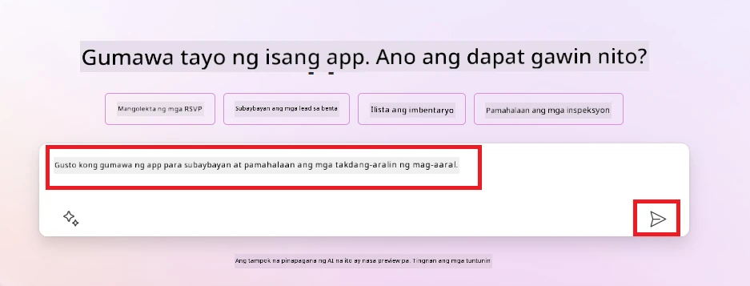

1. Magmumungkahi ang AI Copilot ng isang Dataverse Table na may mga field na kailangan mo upang i-store ang data na gusto mong i-track at ilang sample data. Pwede mong i-customize ang table upang umangkop sa iyong pangangailangan gamit ang AI Copilot assistant feature sa mga conversational steps.

   > **Mahalaga**: Ang Dataverse ang pangunahing data platform ng Power Platform. Isa itong low-code data platform para sa pag-iimbak ng data ng app. Isang fully managed service ito na ligtas na nag-iimbak ng data sa Microsoft Cloud at ipinoprovision sa loob ng iyong Power Platform environment. Mayroon itong mga built-in na kakayahan para sa data governance, tulad ng data classification, data lineage, fine-grained access control, at iba pa. Maaari kang matuto pa tungkol sa Dataverse [dito](https://docs.microsoft.com/powerapps/maker/data-platform/data-platform-intro?WT.mc_id=academic-109639-somelezediko).

   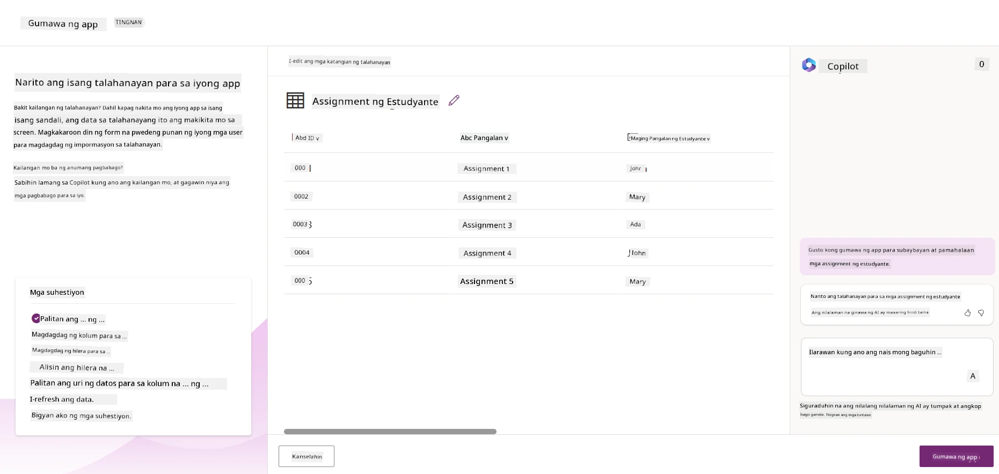

1. Gusto ng mga guro na magpadala ng email sa mga estudyanteng nagsumite ng kanilang mga assignment upang mapaalam sila tungkol sa progreso ng kanilang mga assignment. Pwede mong gamitin ang Copilot upang magdagdag ng bagong field sa table para i-store ang email ng estudyante. Halimbawa, maaari mong gamitin ang sumusunod na prompt upang magdagdag ng bagong field sa table: **_Gusto kong magdagdag ng column para i-store ang email ng estudyante_**. I-click ang **Send** button upang ipadala ang prompt sa AI Copilot.

1. Gumawa ang AI Copilot ng bagong field at maaari mong i-customize ang field upang umangkop sa iyong pangangailangan.

1. Kapag natapos mo na ang talahanayan, i-click ang **Create app** button upang likhain ang app.

1. Ang AI Copilot ay gagawa ng responsive Canvas app base sa iyong paglalarawan. Maaari mo itong i-customize upang umangkop sa iyong mga pangangailangan.

1. Para sa mga guro na magpadala ng mga email sa mga estudyante, maaari mong gamitin ang Copilot upang magdagdag ng bagong screen sa app. Halimbawa, maaari mong gamitin ang sumusunod na prompt upang magdagdag ng bagong screen sa app: **_Gusto kong magdagdag ng screen para magpadala ng mga email sa mga estudyante_**. I-click ang **Send** button upang ipadala ang prompt sa AI Copilot.

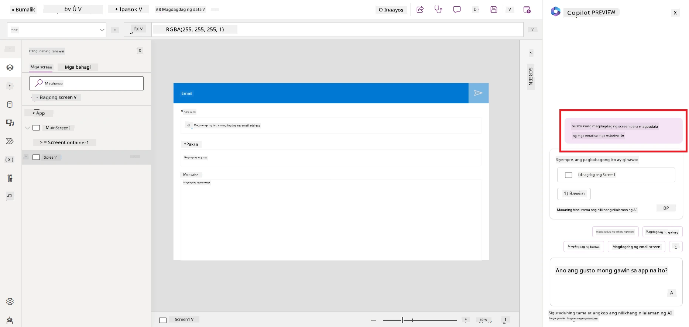

1. Ang AI Copilot ay gagawa ng bagong screen at maaari mo itong i-customize ayon sa iyong pangangailangan.

1. Kapag natapos mo na ang app, i-click ang **Save** button upang i-save ang app.

1. Upang maibahagi ang app sa mga guro, i-click ang **Share** button at pagkatapos ay i-click muli ang **Share** button. Maaari mo nang ibahagi ang app sa mga guro sa pamamagitan ng paglagay ng kanilang mga email address.

> **Ang iyong takdang-aralin**: Ang app na ginawa mo ay magandang panimula ngunit maaari pang pagbutihin. Sa kasalukuyang email feature, kailangang mano-manong mag-type ng email ang mga guro upang makapagpadala sa mga estudyante. Maaari mo bang gamitin ang Copilot upang bumuo ng automation na magpapahintulot sa mga guro na makapagpadala ng mga email sa mga estudyante nang awtomatiko kapag nagsumite sila ng kanilang mga takdang-aralin? Ang iyong pahiwatig ay sa tamang prompt maaari mong gamitin ang Copilot sa Power Automate upang gawin ito.

### Gumawa ng Talaan ng Impormasyon sa Mga Invoice para sa Aming Startup

Ang finance team ng aming startup ay nahihirapang subaybayan ang mga invoice. Gumagamit sila ng spreadsheet upang subaybayan ang mga invoice ngunit nagiging mahirap itong pamahalaan habang dumarami ang mga invoice. Hiniling nila sa iyo na gumawa ng talahanayan na tutulong sa kanila na mag-imbak, mag-subaybay at mag-manage ng impormasyon ng mga natanggap nilang invoice. Ang talahanayan ay gagamitin upang makabuo ng automation na mag-eextract ng lahat ng impormasyon ng invoice at iimbak ito sa talahanayan. Dapat ding payagan ng talahanayan ang finance team na makita ang mga invoice na nabayaran na at yung hindi pa nababayaran.

Ang Power Platform ay may underlying data platform na tinatawag na Dataverse na nagpapahintulot sa iyo na mag-imbak ng data para sa iyong mga app at solusyon. Nagbibigay ang Dataverse ng low-code data platform para sa pag-iimbak ng data ng app. Ito ay isang fully managed service na ligtas na nag-iimbak ng data sa Microsoft Cloud at naka-provision sa loob ng iyong Power Platform environment. Mayroon itong built-in na kakayahan sa data governance, tulad ng data classification, data lineage, fine-grained access control, at iba pa. Maaari kang matuto nang higit pa [tungkol sa Dataverse dito](https://docs.microsoft.com/powerapps/maker/data-platform/data-platform-intro?WT.mc_id=academic-109639-somelezediko).

Bakit natin gagamitin ang Dataverse para sa aming startup? Ang mga standard at custom tables sa loob ng Dataverse ay nagbibigay ng secure at cloud-based na opsyon sa pag-iimbak ng iyong data. Pinapayagan ka ng mga table na mag-imbak ng iba't ibang uri ng data, katulad ng paggamit mo ng maraming worksheets sa isang Excel workbook. Maaari mong gamitin ang mga table upang iimbak ang data na espesyal para sa iyong organisasyon o negosyo. Ilan sa mga benepisyo na makukuha ng aming startup mula sa paggamit ng Dataverse ay kabilang ngunit hindi limitado sa:

- **Madaling pamahalaan**: Parehong metadata at data ay naka-imbak sa cloud, kaya hindi mo na kailangang mag-alala tungkol sa detalye ng pag-iimbak o pamamahala nito. Maaari kang magpokus sa paggawa ng iyong mga app at solusyon.

- **Ligtas**: Nagbibigay ang Dataverse ng secure at cloud-based na opsyon para sa iyong data. Maaari mong kontrolin kung sino ang may access sa data sa iyong mga table at paano nila ito maa-access gamit ang role based security.

- **Mayaman sa metadata**: Ang mga uri ng data at relasyon ay ginagamit direkta sa Power Apps

- **Logic at validation**: Maaari kang gumamit ng business rules, calculated fields, at validation rules para ipatupad ang business logic at mapanatili ang katumpakan ng data.

Ngayong alam mo na kung ano ang Dataverse at bakit mo ito dapat gamitin, tingnan natin kung paano mo magagamit ang Copilot upang gumawa ng isang table sa Dataverse upang matugunan ang mga pangangailangan ng aming finance team.

> **Tandaan** : Gagamitin mo ang table na ito sa susunod na seksyon upang gumawa ng automation na mag-eextract ng lahat ng impormasyon ng invoice at iimbak ito sa table.

Upang gumawa ng table sa Dataverse gamit ang Copilot, sundin ang mga hakbang sa ibaba:

1. Pumunta sa [Power Apps](https://make.powerapps.com?WT.mc_id=academic-105485-koreyst) home screen.

2. Sa kaliwang navigation bar, piliin ang **Tables** at pagkatapos ay i-click ang **Describe the new Table**.

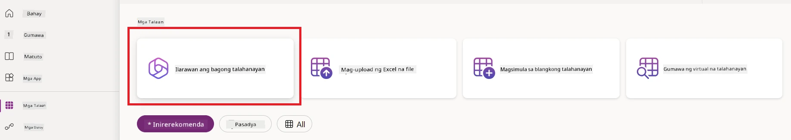

1. Sa **Describe the new Table** screen, gamitin ang text area upang ilarawan ang table na nais mong likhain. Halimbawa, **_Gusto kong gumawa ng table para mag-imbak ng impormasyon ng invoice_**. I-click ang **Send** button upang ipadala ang prompt sa AI Copilot.

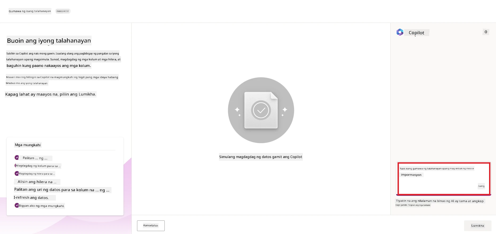

1. Magmumungkahi ang AI Copilot ng Dataverse Table na may mga field na kailangan mo upang mag-imbak ng data na gustong subaybayan at may ilang sample data. Maaari mong i-customize ang table upang umangkop sa iyong pangangailangan gamit ang AI Copilot assistant feature sa pamamagitan ng mga conversational steps.

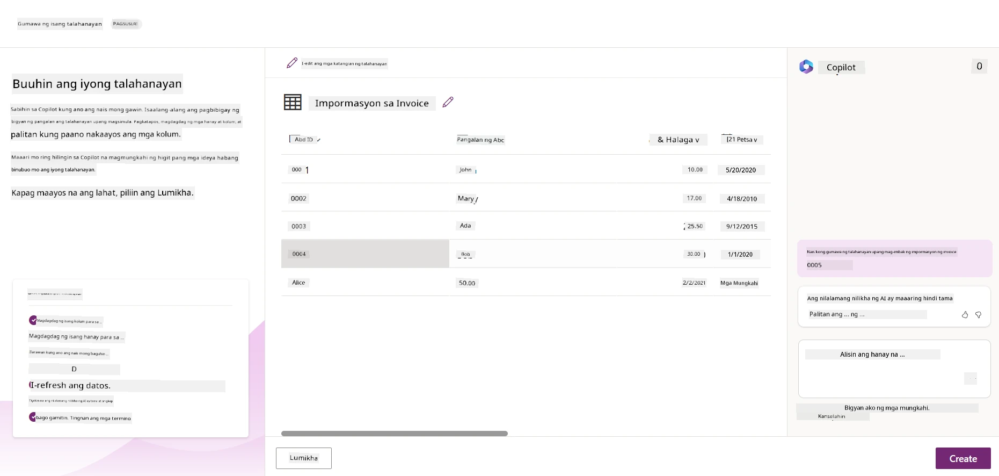

1. Nais ng finance team na magpadala ng email sa supplier upang i-update sila tungkol sa kasalukuyang status ng kanilang invoice. Maaari mong gamitin ang Copilot upang magdagdag ng bagong field sa table para mag-imbak ng supplier email. Halimbawa, maaari mong gamitin ang sumusunod na prompt upang magdagdag ng bagong column sa table: **_Gusto kong magdagdag ng column para mag-imbak ng supplier email_**. I-click ang **Send** button upang ipadala ang prompt sa AI Copilot.

1. Gagawa ang AI Copilot ng bagong field at maaari mo itong i-customize ayon sa iyong pangangailangan.

1. Kapag natapos mo na ang table, i-click ang **Create** button upang likhain ang table.

## Mga AI Model sa Power Platform gamit ang AI Builder

Ang AI Builder ay isang low-code AI capability na available sa Power Platform na nagpapahintulot sa iyo na gamitin ang AI Models para tulungan kang i-automate ang mga proseso at hulaan ang mga resulta. Sa AI Builder maaari mong dalhin ang AI sa iyong mga app at flows na kumokonekta sa iyong data sa Dataverse o iba't ibang cloud data sources gaya ng SharePoint, OneDrive o Azure.

## Prebuilt AI Models kumpara sa Custom AI Models

Nagbibigay ang AI Builder ng dalawang uri ng AI Models: Prebuilt AI Models at Custom AI Models. Ang Prebuilt AI Models ay mga handang gamitin na AI Models na sinanay ng Microsoft at available sa Power Platform. Tinutulungan ka nitong magdagdag ng intelligence sa iyong mga app at flows nang hindi kailangan mangolekta ng data at pagkatapos ay bumuo, mag-train at mag-publish ng sarili mong models. Maaari mong gamitin ang mga modelong ito upang i-automate ang mga proseso at hulaan ang mga resulta.

Ilan sa mga Prebuilt AI Models na available sa Power Platform ay kinabibilangan ng:

- **Key Phrase Extraction**: Ang modelong ito ay nag-eextract ng mga pangunahing parirala mula sa teksto.
- **Language Detection**: Ang modelong ito ay nagde-detect ng wika ng isang teksto.
- **Sentiment Analysis**: Ang modelong ito ay nagde-detect ng positibo, negatibo, neutral, o halo-halong damdamin sa teksto.
- **Business Card Reader**: Ang modelong ito ay nag-eextract ng impormasyon mula sa mga business card.
- **Text Recognition**: Ang modelong ito ay nag-eextract ng teksto mula sa mga larawan.
- **Object Detection**: Ang modelong ito ay nagde-detect at nag-eextract ng mga bagay mula sa mga larawan.
- **Document processing**: Ang modelong ito ay nag-eextract ng impormasyon mula sa mga form.
- **Invoice Processing**: Ang modelong ito ay nag-eextract ng impormasyon mula sa mga invoice.

Sa Custom AI Models maaari mong dalhin ang sarili mong modelo sa AI Builder upang gumana ito bilang anumang custom model ng AI Builder, na nagpapahintulot sa iyo na i-train ang modelo gamit ang sarili mong data. Maaari mong gamitin ang mga modelong ito upang i-automate ang mga proseso at hulaan ang mga resulta sa parehong Power Apps at Power Automate. Kapag gumagamit ng sarili mong modelo, may mga limitasyong umiiral. Basahin pa ang mga [limitasyong ito](https://learn.microsoft.com/ai-builder/byo-model#limitations?WT.mc_id=academic-105485-koreyst).

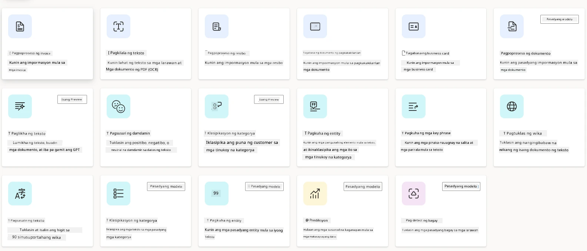

## Takdang-Aralin #2 - Gumawa ng Invoice Processing Flow para sa Aming Startup

Nahihirapan ang finance team sa pagproseso ng mga invoice. Gumagamit sila ng spreadsheet upang subaybayan ang mga invoice ngunit nagiging mahirap itong pamahalaan habang dumarami ang mga invoice. Hiniling nila sa iyo na gumawa ng workflow na tutulong sa kanila sa pagproseso ng mga invoice gamit ang AI. Dapat payagan ng workflow na ito silang mag-extract ng impormasyon mula sa mga invoice at iimbak ang impormasyon sa isang Dataverse table. Dapat din itong payagan silang magpadala ng email sa finance team gamit ang na-extract na impormasyon.

Ngayon na alam mo na kung ano ang AI Builder at bakit mo ito dapat gamitin, tingnan natin kung paano mo magagamit ang Invoice Processing AI Model sa AI Builder, na tinalakay natin noon, upang gumawa ng workflow na tutulong sa finance team na magproseso ng mga invoice.

Upang gumawa ng workflow na tutulong sa finance team na magproseso ng mga invoice gamit ang Invoice Processing AI Model sa AI Builder, sundin ang mga hakbang sa ibaba:

1. Pumunta sa [Power Automate](https://make.powerautomate.com?WT.mc_id=academic-105485-koreyst) home screen.

2. Gamitin ang text area sa home screen upang ilarawan ang workflow na nais mong gawin. Halimbawa, **_Proseso ng invoice kapag dumating ito sa aking mailbox_**. I-click ang **Send** button upang ipadala ang prompt sa AI Copilot.

   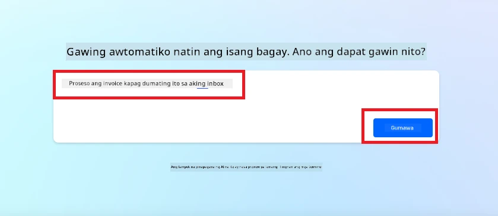

3. Magmumungkahi ang AI Copilot ng mga aksyon na kailangan mo upang maisagawa ang task na nais mong i-automate. Maaari mong i-click ang **Next** button upang makita ang mga susunod na hakbang.

4. Sa susunod na hakbang, hihilingin ka ng Power Automate na i-setup ang mga koneksyon na kailangan para sa flow. Kapag tapos ka na, i-click ang **Create flow** button upang likhain ang flow.

5. Gagawa ang AI Copilot ng flow at maaari mo itong i-customize upang umangkop sa iyong pangangailangan.

6. I-update ang trigger ng flow at itakda ang **Folder** sa folder kung saan ilalagay ang mga invoice. Halimbawa, maaaring itakda ang folder sa **Inbox**. I-click ang **Show advanced options** at itakda ang **Only with Attachments** sa **Yes**. Sisiguraduhin nito na tatakbo lang ang flow kapag mayroong email na may attachment na natanggap sa folder.

7. Alisin ang mga sumusunod na aksyon sa flow: **HTML to text**, **Compose**, **Compose 2**, **Compose 3** at **Compose 4** dahil hindi mo ito gagamitin.

8. Alisin ang **Condition** na aksyon sa flow dahil hindi mo rin ito gagamitin. Dapat magmukha itong tulad ng nasa screenshot:

   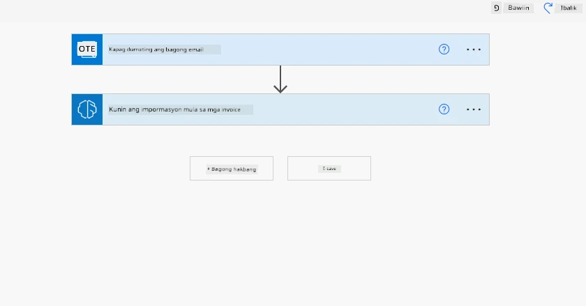

9. I-click ang **Add an action** button at hanapin ang **Dataverse**. Piliin ang **Add a new row** na aksyon.

10. Sa aksyon na **Extract Information from invoices**, i-update ang **Invoice File** upang ituro ito sa **Attachment Content** mula sa email. Sisiguraduhin nito na ieextract ng flow ang impormasyon mula sa attachment ng invoice.

11. Piliin ang **Table** na ginawa mo kanina. Halimbawa, maaari mong piliin ang **Invoice Information** table. Piliin ang dynamic content mula sa naunang aksyon upang mapunan ang mga sumusunod na field:

    - ID
    - Amount
    - Date
    - Name
    - Status - Itakda ang **Status** sa **Pending**.
    - Supplier Email - Gamitin ang **From** dynamic content mula sa **When a new email arrives** trigger.

    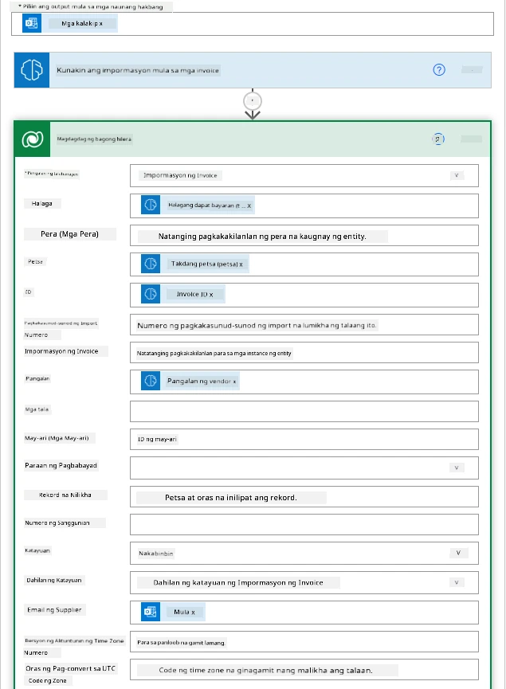

12. Kapag natapos mo na ang flow, i-click ang **Save** button upang i-save ang flow. Maaari mong subukan ang flow sa pamamagitan ng pagpapadala ng email na may invoice sa folder na tinukoy mo sa trigger.

> **Ang iyong takdang-aralin**: Ang flow na ginawa mo ay magandang panimula, ngayon kailangan mong pag-isipan kung paano ka makakagawa ng automation na magpapahintulot sa finance team na magpadala ng email sa supplier upang i-update sila tungkol sa kasalukuyang status ng kanilang invoice. Ang iyong pahiwatig: ang flow ay dapat tumakbo kapag nagbago ang status ng invoice.

## Gumamit ng Text Generation AI Model sa Power Automate

Ang Create Text with GPT AI Model sa AI Builder ay nagpapahintulot sa iyo na gumawa ng teksto base sa prompt at pinapagana ng Microsoft Azure OpenAI Service. Sa kakayahang ito, maaari mong isama ang GPT (Generative Pre-Trained Transformer) technology sa iyong mga app at flows upang makagawa ng iba't ibang automated na flow at mga makabuluhang aplikasyon.

Sumailalim sa masusing pagsasanay ang mga GPT model sa napakaraming data, kaya kaya nilang gumawa ng teksto na kahawig ng wikang pangtao kapag binigyan ng prompt. Kapag isinama sa workflow automation, maaaring gamitin ang mga AI model gaya ng GPT upang gawing mas madali at automated ang iba't ibang gawain.

Halimbawa, maaari kang gumawa ng mga flow para awtomatikong gumawa ng teksto para sa iba't ibang kaso ng paggamit, tulad ng: mga draft ng email, paglalarawan ng produkto, at iba pa. Maaari mo ring gamitin ang model upang gumawa ng teksto para sa iba't ibang app, gaya ng mga chatbot at customer service app na nagpapahintulot sa mga agent ng customer service na kumilos nang epektibo at mabilis sa mga tanong ng customer.

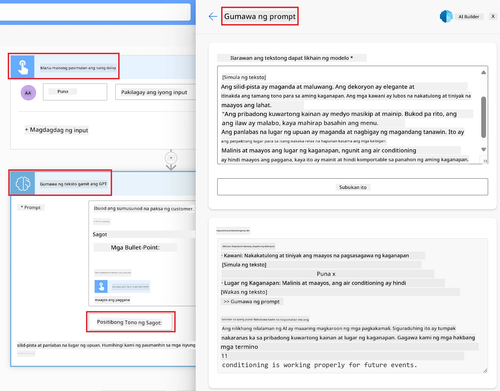

Para matutunan kung paano gamitin ang AI Model na ito sa Power Automate, dumaan sa [Magdagdag ng katalinuhan gamit ang AI Builder at GPT](https://learn.microsoft.com/training/modules/ai-builder-text-generation/?WT.mc_id=academic-109639-somelezediko) module.

## Mahusay na Trabaho! Ipagpatuloy ang Iyong Pag-aaral

Pagkatapos tapusin ang araling ito, tingnan ang aming [Generative AI Learning collection](https://aka.ms/genai-collection?WT.mc_id=academic-105485-koreyst) upang ipagpatuloy ang pagpapalawak ng iyong kaalaman sa Generative AI!

Nais mo bang i-customize at masulit ang Copilot? Tuklasin ang [Awesome Copilot](https://github.com/github/awesome-copilot?WT.mc_id=academic-105485-koreyst) — isang koleksyon mula sa komunidad ng mga tagubilin, ahente, kasanayan, at mga pagsasaayos upang matulungan kang sulitin ang GitHub Copilot.

Pumunta sa Aralin 11 kung saan titingnan natin kung paano [pagsamahin ang Generative AI sa Function Calling](../11-integrating-with-function-calling/README.md?WT.mc_id=academic-105485-koreyst)!

---

<!-- CO-OP TRANSLATOR DISCLAIMER START -->
**Pagtatanggi**:
Ang dokumentong ito ay isinalin gamit ang serbisyo ng AI translation na [Co-op Translator](https://github.com/Azure/co-op-translator). Bagama't nagsusumikap kami para sa katumpakan, pakatandaan na ang awtomatikong pagsasalin ay maaaring maglaman ng mga pagkakamali o hindi pagkakatugma. Ang orihinal na dokumento sa orihinal nitong wika ang dapat ituring na pangunahing sanggunian. Para sa mahahalagang impormasyon, inirerekomenda ang propesyonal na pagsasalin ng tao. Hindi kami mananagot sa anumang maling pagkakaintindi o maling interpretasyon na nagmula sa paggamit ng pagsasaling ito.
<!-- CO-OP TRANSLATOR DISCLAIMER END -->