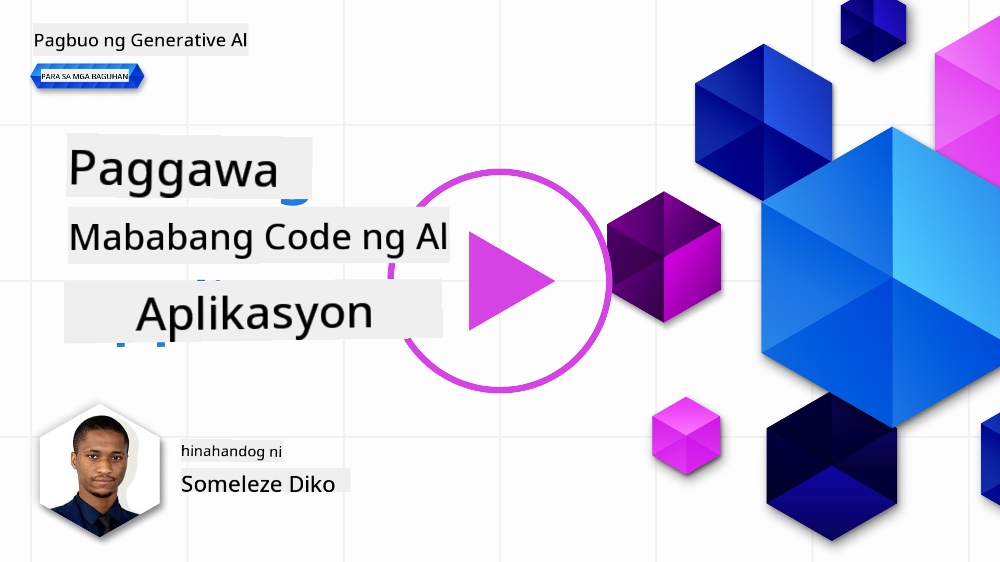
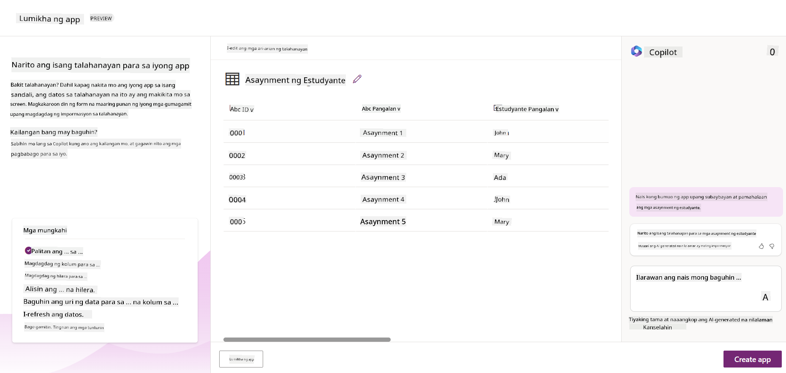
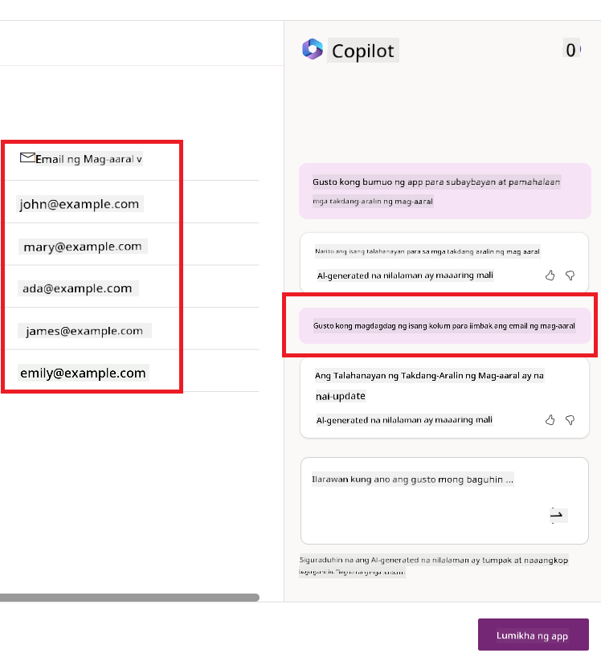
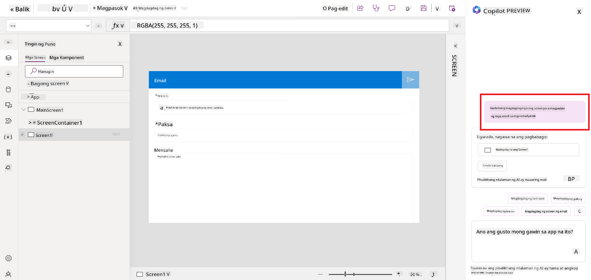
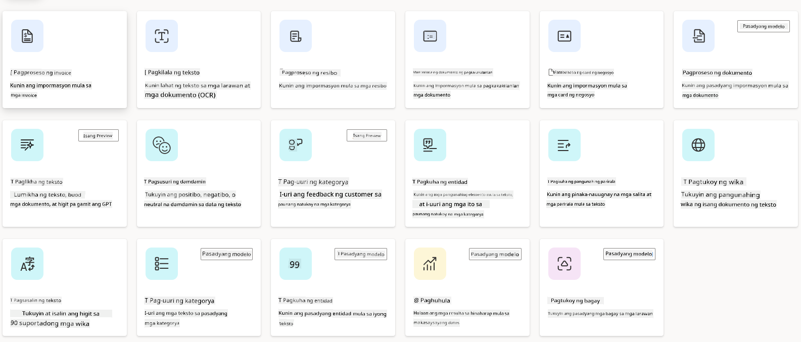
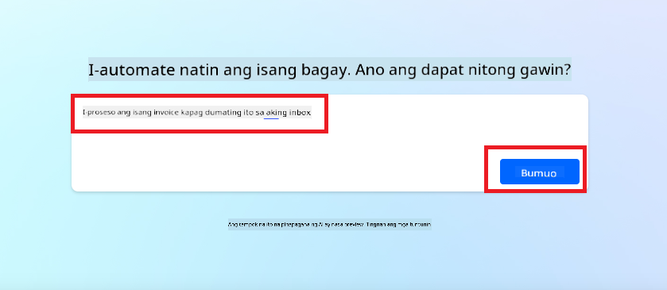
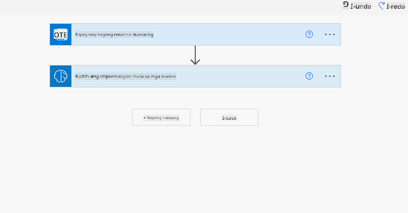
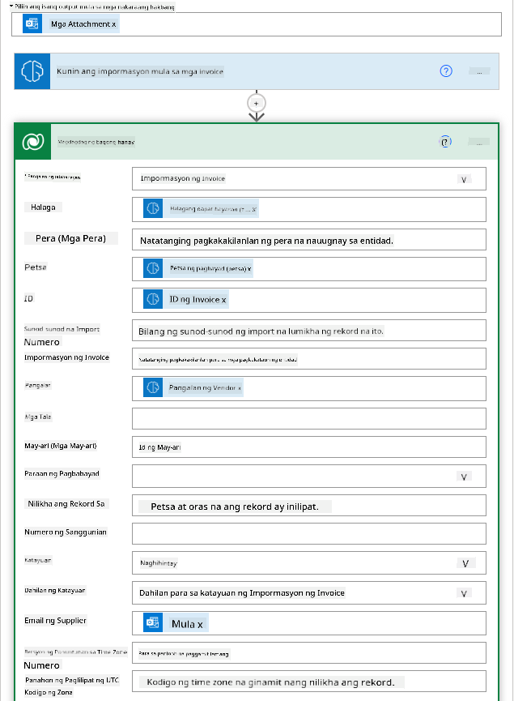
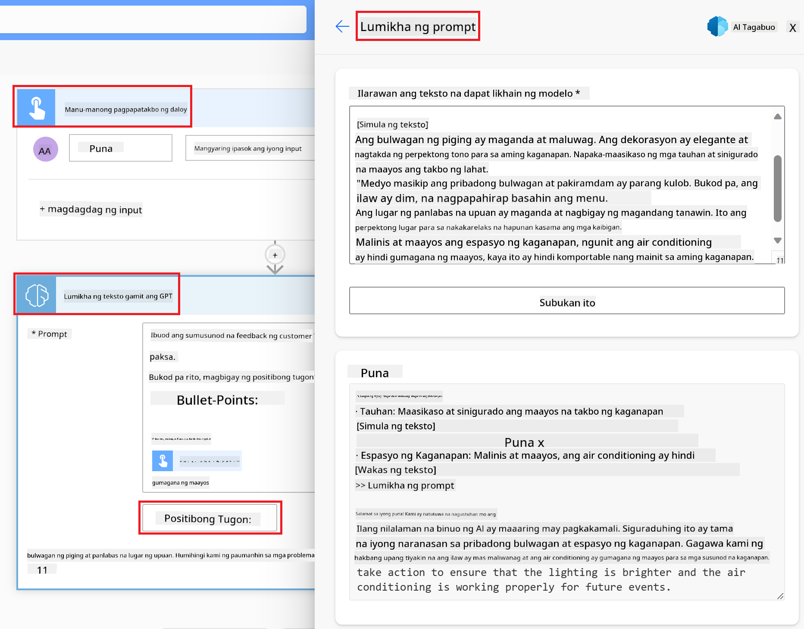

<!--
CO_OP_TRANSLATOR_METADATA:
{
  "original_hash": "f5ff3b6204a695a117d6f452403c95f7",
  "translation_date": "2025-06-25T19:11:27+00:00",
  "source_file": "10-building-low-code-ai-applications/README.md",
  "language_code": "tl"
}
-->
# Pagbuo ng Low Code AI Applications

> _(I-click ang larawan sa itaas para panoorin ang video ng leksyon na ito)_

## Panimula

Ngayon na natutunan natin kung paano bumuo ng mga application na nagge-generate ng imahe, pag-usapan natin ang low code. Ang Generative AI ay maaaring gamitin sa iba't ibang larangan kabilang ang low code, pero ano nga ba ang low code at paano natin maidaragdag ang AI dito?

Ang paggawa ng apps at solusyon ay naging mas madali para sa mga tradisyunal na developer at hindi developer sa pamamagitan ng paggamit ng Low Code Development Platforms. Ang Low Code Development Platforms ay nagbibigay-daan sa iyo na bumuo ng apps at solusyon na kaunti o walang code. Ito ay nakamit sa pamamagitan ng pagbibigay ng isang visual na development environment na nagbibigay-daan sa iyo na mag-drag at drop ng mga components para bumuo ng apps at solusyon. Ito ay nagbibigay-daan sa iyo na bumuo ng apps at solusyon nang mas mabilis at may mas kaunting resources. Sa leksyon na ito, mas malalim nating tatalakayin kung paano gamitin ang Low Code at paano mapahusay ang low code development gamit ang AI sa pamamagitan ng Power Platform.

Ang Power Platform ay nagbibigay ng pagkakataon sa mga organisasyon na bigyang kapangyarihan ang kanilang mga koponan na bumuo ng kanilang sariling solusyon sa pamamagitan ng isang intuitive na low-code o no-code environment. Ang environment na ito ay tumutulong na gawing mas simple ang proseso ng pagbuo ng solusyon. Sa Power Platform, ang mga solusyon ay maaaring mabuo sa loob ng mga araw o linggo sa halip na buwan o taon. Ang Power Platform ay binubuo ng limang pangunahing produkto: Power Apps, Power Automate, Power BI, Power Pages at Copilot Studio.

Saklaw ng leksyon na ito ang:

- Panimula sa Generative AI sa Power Platform
- Panimula sa Copilot at paano ito gamitin
- Paggamit ng Generative AI para bumuo ng apps at flows sa Power Platform
- Pag-unawa sa AI Models sa Power Platform gamit ang AI Builder

## Mga Layunin sa Pagkatuto

Sa pagtatapos ng leksyon na ito, magagawa mong:

- Maunawaan kung paano gumagana ang Copilot sa Power Platform.

- Bumuo ng Student Assignment Tracker App para sa aming education startup.

- Bumuo ng Invoice Processing Flow na gumagamit ng AI para kunin ang impormasyon mula sa mga invoice.

- Ipatupad ang pinakamahusay na mga kasanayan kapag ginagamit ang Create Text with GPT AI Model.

Ang mga tools at teknolohiya na gagamitin mo sa leksyon na ito ay:

- **Power Apps**, para sa Student Assignment Tracker app, na nagbibigay ng low-code development environment para bumuo ng apps upang subaybayan, pamahalaan at makipag-ugnayan sa data.

- **Dataverse**, para sa pag-iimbak ng data para sa Student Assignment Tracker app kung saan ang Dataverse ay magbibigay ng low-code data platform para sa pag-iimbak ng data ng app.

- **Power Automate**, para sa Invoice Processing flow kung saan magkakaroon ka ng low-code development environment para bumuo ng workflows upang i-automate ang proseso ng Invoice Processing.

- **AI Builder**, para sa Invoice Processing AI Model kung saan gagamit ka ng prebuilt AI Models upang iproseso ang mga invoice para sa aming startup.

## Generative AI sa Power Platform

Ang pagpapahusay sa low-code development at application gamit ang generative AI ay isang pangunahing pokus na lugar para sa Power Platform. Ang layunin ay bigyang-daan ang lahat na bumuo ng AI-powered apps, sites, dashboards at i-automate ang mga proseso gamit ang AI, _nang hindi nangangailangan ng anumang data science expertise_. Ang layuning ito ay nakamit sa pamamagitan ng pag-integrate ng generative AI sa low-code development experience sa Power Platform sa anyo ng Copilot at AI Builder.

### Paano ito gumagana?

Ang Copilot ay isang AI assistant na nagbibigay-daan sa iyo na bumuo ng Power Platform solutions sa pamamagitan ng pag-describe ng iyong mga pangangailangan sa isang serye ng mga hakbang na conversational gamit ang natural language. Halimbawa, maaari mong i-instruct ang iyong AI assistant na ilahad kung anong mga field ang gagamitin ng iyong app at ito ay bubuo ng parehong app at ang underlying data model o maaari mong tukuyin kung paano i-set up ang isang flow sa Power Automate.

Maaari mong gamitin ang Copilot driven functionalities bilang isang feature sa iyong app screens upang bigyang-daan ang mga user na matuklasan ang mga insight sa pamamagitan ng conversational interactions.

Ang AI Builder ay isang low-code AI capability na available sa Power Platform na nagbibigay-daan sa iyo na gumamit ng AI Models upang makatulong sa pag-automate ng mga proseso at mag-predict ng outcomes. Sa AI Builder, maaari mong dalhin ang AI sa iyong apps at flows na kumokonekta sa iyong data sa Dataverse o sa iba't ibang cloud data sources, tulad ng SharePoint, OneDrive o Azure.

Ang Copilot ay available sa lahat ng Power Platform products: Power Apps, Power Automate, Power BI, Power Pages at Power Virtual Agents. Ang AI Builder ay available sa Power Apps at Power Automate. Sa leksyon na ito, magfo-focus tayo sa kung paano gamitin ang Copilot at AI Builder sa Power Apps at Power Automate upang bumuo ng solusyon para sa aming education startup.

### Copilot sa Power Apps

Bilang bahagi ng Power Platform, ang Power Apps ay nagbibigay ng low-code development environment para bumuo ng apps upang subaybayan, pamahalaan at makipag-ugnayan sa data. Ito ay isang suite ng app development services na may scalable data platform at kakayahang kumonekta sa cloud services at on-premises data. Ang Power Apps ay nagbibigay-daan sa iyo na bumuo ng apps na tumatakbo sa browsers, tablets, at phones, at maaaring ibahagi sa mga katrabaho. Ang Power Apps ay nagpapadali sa mga user na pumasok sa app development gamit ang isang simpleng interface, upang ang bawat business user o pro developer ay makabuo ng custom apps. Ang app development experience ay pinahusay din gamit ang Generative AI sa pamamagitan ng Copilot.

Ang copilot AI assistant feature sa Power Apps ay nagbibigay-daan sa iyo na ilarawan kung anong uri ng app ang kailangan mo at anong impormasyon ang nais mong subaybayan, kolektahin, o ipakita ng iyong app. Ang Copilot ay bumubuo ng isang responsive Canvas app batay sa iyong deskripsyon. Maaari mo nang i-customize ang app upang matugunan ang iyong mga pangangailangan. Ang AI Copilot ay bumubuo at nagmumungkahi ng isang Dataverse Table na may mga field na kailangan mo upang i-store ang data na nais mong subaybayan at ilang sample data. Titingnan natin kung ano ang Dataverse at paano mo ito magagamit sa Power Apps sa leksyon na ito mamaya. Maaari mo nang i-customize ang table upang matugunan ang iyong mga pangangailangan gamit ang AI Copilot assistant feature sa pamamagitan ng conversational steps. Ang feature na ito ay readily available mula sa Power Apps home screen.

### Copilot sa Power Automate

Bilang bahagi ng Power Platform, ang Power Automate ay nagbibigay-daan sa mga user na lumikha ng automated workflows sa pagitan ng applications at services. Ito ay tumutulong na i-automate ang mga repetitive business processes tulad ng komunikasyon, pag-kolekta ng data, at decision approvals. Ang simpleng interface nito ay nagbibigay-daan sa mga user na may iba't ibang technical competence (mula sa mga baguhan hanggang sa mga bihasang developer) na i-automate ang mga work tasks. Ang workflow development experience ay pinahusay din gamit ang Generative AI sa pamamagitan ng Copilot.

Ang copilot AI assistant feature sa Power Automate ay nagbibigay-daan sa iyo na ilarawan kung anong uri ng flow ang kailangan mo at anong mga aksyon ang nais mong isagawa ng iyong flow. Ang Copilot ay bumubuo ng isang flow batay sa iyong deskripsyon. Maaari mo nang i-customize ang flow upang matugunan ang iyong mga pangangailangan. Ang AI Copilot ay bumubuo at nagmumungkahi ng mga aksyon na kailangan mong isagawa upang i-automate ang task na nais mong i-automate. Titingnan natin kung ano ang flows at paano mo ito magagamit sa Power Automate sa leksyon na ito mamaya. Maaari mo nang i-customize ang mga aksyon upang matugunan ang iyong mga pangangailangan gamit ang AI Copilot assistant feature sa pamamagitan ng conversational steps. Ang feature na ito ay readily available mula sa Power Automate home screen.

## Asaynment: Pamahalaan ang mga asaynment ng estudyante at mga invoice para sa aming startup, gamit ang Copilot

Ang aming startup ay nagbibigay ng mga online courses sa mga estudyante. Ang startup ay mabilis na lumago at ngayon ay nahihirapan na makasabay sa demand para sa kanilang mga kurso. Ang startup ay kumuha sa iyo bilang isang Power Platform developer upang tulungan silang bumuo ng isang low code solution upang matulungan silang pamahalaan ang kanilang mga asaynment ng estudyante at mga invoice. Ang kanilang solusyon ay dapat makatulong sa kanila na subaybayan at pamahalaan ang mga asaynment ng estudyante sa pamamagitan ng isang app at i-automate ang proseso ng pagproseso ng invoice sa pamamagitan ng isang workflow. Hinihiling sa iyo na gamitin ang Generative AI upang bumuo ng solusyon.

Kapag nagsisimula ka sa paggamit ng Copilot, maaari mong gamitin ang [Power Platform Copilot Prompt Library](https://github.com/pnp/powerplatform-prompts?WT.mc_id=academic-109639-somelezediko) upang makapagsimula sa mga prompt. Ang library na ito ay naglalaman ng listahan ng mga prompt na maaari mong gamitin upang bumuo ng apps at flows gamit ang Copilot. Maaari mo ring gamitin ang mga prompt sa library upang makakuha ng ideya kung paano ilarawan ang iyong mga pangangailangan sa Copilot.

### Bumuo ng Student Assignment Tracker App para sa Aming Startup

Ang mga guro sa aming startup ay nahihirapan na subaybayan ang mga asaynment ng estudyante. Ginagamit nila ang spreadsheet upang subaybayan ang mga asaynment ngunit ito ay naging mahirap na pamahalaan habang dumarami ang bilang ng mga estudyante. Hinihiling nila sa iyo na bumuo ng isang app na tutulong sa kanila na subaybayan at pamahalaan ang mga asaynment ng estudyante. Ang app ay dapat magbigay-daan sa kanila na magdagdag ng mga bagong asaynment, tingnan ang mga asaynment, i-update ang mga asaynment at i-delete ang mga asaynment. Ang app ay dapat ding magbigay-daan sa mga guro at estudyante na tingnan ang mga asaynment na na-grade at hindi pa na-grade.

Bubuo mo ang app gamit ang Copilot sa Power Apps sa pamamagitan ng pagsunod sa mga hakbang sa ibaba:

1. Pumunta sa [Power Apps](https://make.powerapps.com?WT.mc_id=academic-105485-koreyst) home screen.

1. Gamitin ang text area sa home screen upang ilarawan ang app na nais mong buuin. Halimbawa, **_Nais kong bumuo ng app upang subaybayan at pamahalaan ang mga asaynment ng estudyante_**. I-click ang **Send** button upang ipadala ang prompt sa AI Copilot.

1. Ang AI Copilot ay magmumungkahi ng isang Dataverse Table na may mga field na kailangan mo upang i-store ang data na nais mong subaybayan at ilang sample data. Maaari mo nang i-customize ang table upang matugunan ang iyong mga pangangailangan gamit ang AI Copilot assistant feature sa pamamagitan ng conversational steps.

   > **Mahalaga**: Ang Dataverse ay ang underlying data platform para sa Power Platform. Ito ay isang low-code data platform para sa pag-iimbak ng data ng app. Ito ay isang fully managed service na ligtas na nag-iimbak ng data sa Microsoft Cloud at naipagkakaloob sa iyong Power Platform environment. Ito ay may kasamang built-in na data governance capabilities, tulad ng data classification, data lineage, fine-grained access control, at higit pa. Maaari kang matuto nang higit pa tungkol sa Dataverse [dito](https://docs.microsoft.com/powerapps/maker/data-platform/data-platform-intro?WT.mc_id=academic-109639-somelezediko).

   

1. Nais ng mga guro na magpadala ng mga email sa mga estudyante na nagsumite ng kanilang mga asaynment upang panatilihing updated sila sa progreso ng kanilang mga asaynment. Maaari mong gamitin ang Copilot upang magdagdag ng bagong field sa table upang i-store ang student email. Halimbawa, maaari mong gamitin ang sumusunod na prompt upang magdagdag ng bagong field sa table: **_Nais kong magdagdag ng column upang i-store ang student email_**. I-click ang **Send** button upang ipadala ang prompt sa AI Copilot.

1. Ang AI Copilot ay bubuo ng bagong field at maaari mo nang i-customize ang field upang matugunan ang iyong mga pangangailangan.

1. Kapag natapos ka na sa table, i-click ang **Create app** button upang bumuo ng app.

1. Ang AI Copilot ay bubuo ng isang responsive Canvas app batay sa iyong deskripsyon. Maaari mo nang i-customize ang app upang matugunan ang iyong mga pangangailangan.

1. Para sa mga guro na magpadala ng mga email sa mga estudyante, maaari mong gamitin ang Copilot upang magdagdag ng bagong screen sa app. Halimbawa, maaari mong gamitin ang sumusunod na prompt upang magdagdag ng bagong screen sa app: **_Nais kong magdagdag ng screen upang magpadala ng mga email sa mga estudyante_**. I-click ang **Send** button upang ipadala ang prompt sa AI Copilot.

1. Ang AI Copilot ay bubuo ng bagong screen at maaari mo nang i-customize ang screen upang matugunan ang iyong mga pangangailangan.

1. Kapag natapos ka na sa app, i-click ang **Save** button upang i-save ang app.

1. Upang ibahagi ang app sa mga guro, i-click ang **Share** button at pagkatapos ay i-click ang **Share** button muli. Maaari mo nang ibahagi ang app sa mga guro sa pamamagitan ng pag-enter ng kanilang email addresses.

> **Ang iyong takdang-aralin**: Ang app na iyong binuo ay isang magandang simula ngunit maaari pang mapabuti. Sa email feature, ang mga guro ay maaari lamang magpadala ng mga email sa mga estudyante nang manu-mano sa pamamagitan ng pag-type ng kanilang mga email. Maaari mo bang gamitin ang Copilot upang bumuo ng isang automation na magbibigay-daan sa mga guro na magpadala ng mga email sa mga estudyante nang awtomatiko kapag nagsumite sila ng kanilang mga asaynment? Ang iyong hint ay sa tamang prompt maaari mong gamitin ang Copilot sa Power Automate upang bumuo nito.

### Bumuo ng Invoices Information Table para sa Aming Startup

Ang finance team ng aming startup ay nahihirapan na subaybayan ang mga invoice. Ginagamit nila ang spreadsheet upang subaybayan ang mga invoice ngunit ito ay naging mahirap na pamahalaan habang dumarami ang bilang ng mga invoice. Hinihiling nila sa iyo na bumuo ng isang table na tutulong sa kanila na i-store, subaybayan at pamahalaan ang impormasyon ng mga invoice na kanilang natanggap. Ang table ay dapat gamitin upang bumuo ng isang automation na mag-e-extract ng lahat ng impormasyon ng invoice at i-store ito sa table. Ang table ay dapat ding magbigay-daan sa finance team na tingnan ang mga invoice na nabayaran at hindi pa nababayaran.

Ang Power Platform ay may underlying data platform na tinatawag na Dataverse na nagbibigay-daan sa iyo na i-store ang data para sa iyong apps at solusyon. Ang Dataverse ay nagbibigay ng low-code data platform para sa pag-iimbak ng data ng app. Ito ay isang fully managed service na ligtas na nag-iimbak ng data sa Microsoft Cloud at naipagkakaloob sa iyong Power Platform environment. Ito ay may kasamang built-in na data governance capabilities, tulad ng data classification, data lineage, fine-grained access control, at higit pa. Maaari kang matuto nang higit pa [tungkol sa Dataverse dito](https://docs.microsoft.com/powerapps/maker/data-platform/data-platform-intro?WT.mc_id=academic-109639-somelezediko).

Bakit natin dapat gamitin ang Dataverse para sa aming startup? Ang standard at custom tables sa loob ng Dataverse ay nagbibigay ng secure at cloud-based na storage option para sa iyong data. Ang mga table ay nagbibigay-daan sa iyo na i-store ang iba't ibang uri ng data, katulad ng paggamit ng maraming worksheets sa isang Excel workbook. Maaari mong gamitin ang mga table upang i-store ang data na partikular sa iyong organisasyon o business needs. Ang ilan sa mga benepisyo na makukuha ng aming startup mula sa paggamit ng Dataverse ay kinabibilangan ng ngunit hindi limitado sa:

- **Madaling pamahalaan**: Parehong ang metadata at data ay naka-store sa cloud, kaya hindi mo na kailangang mag-alala tungkol sa mga detalye kung paano ito naka-store o pinamamahalaan. Maaari kang mag-focus sa pagbuo ng iyong apps at solusyon.

- **Ligtas**: Ang Dataverse ay nagbibigay ng secure at cloud-based na storage option para sa iyong data. Maaari mong kontrolin kung sino ang may access sa data sa iyong tables at paano nila ito maa-access gamit ang role-based security.

- **Rich metadata**: Ang mga uri ng data at relasyon ay direktang ginagamit sa loob ng Power Apps

- **Logic at validation**: Maaari mong gamitin ang business rules, calculated fields, at validation rules upang ipatupad ang business logic at mapanatili ang katumpakan ng data.

Ngayon na alam mo kung ano
## Sentiment Analysis

- **Pagsusuri ng Damdamin**: Ang modelong ito ay nagtatakda kung positibo, negatibo, neutral, o halo-halong damdamin ang nasa teksto.
- **Business Card Reader**: Ang modelong ito ay kumukuha ng impormasyon mula sa mga business card.
- **Pagkilala sa Teksto**: Ang modelong ito ay kumukuha ng teksto mula sa mga larawan.
- **Pag-detect ng Bagay**: Ang modelong ito ay nagtatakda at kumukuha ng mga bagay mula sa mga larawan.
- **Pagproseso ng Dokumento**: Ang modelong ito ay kumukuha ng impormasyon mula sa mga form.
- **Pagproseso ng Invoice**: Ang modelong ito ay kumukuha ng impormasyon mula sa mga invoice.

Sa pamamagitan ng Custom AI Models, maaari mong dalhin ang iyong sariling modelo sa AI Builder upang ito ay gumana tulad ng anumang custom na modelo ng AI Builder, na nagbibigay-daan sa iyo na sanayin ang modelo gamit ang iyong sariling data. Maaari mong gamitin ang mga modelong ito upang i-automate ang mga proseso at hulaan ang mga resulta sa parehong Power Apps at Power Automate. Kapag gumagamit ng sarili mong modelo, may mga limitasyon na nalalapat. Basahin pa ang tungkol sa mga [limitasyon](https://learn.microsoft.com/ai-builder/byo-model#limitations?WT.mc_id=academic-105485-koreyst).

## Assignment #2 - Bumuo ng Isang Invoice Processing Flow para sa Aming Startup

Ang finance team ay nahihirapang magproseso ng mga invoice. Sila ay gumagamit ng spreadsheet upang subaybayan ang mga invoice ngunit ito ay nagiging mahirap i-manage habang dumarami ang bilang ng mga invoice. Hiniling nila sa iyo na bumuo ng isang workflow na makakatulong sa kanila na magproseso ng mga invoice gamit ang AI. Ang workflow ay dapat magpapahintulot sa kanila na kumuha ng impormasyon mula sa mga invoice at i-store ang impormasyon sa isang Dataverse table. Ang workflow ay dapat ding magpapahintulot sa kanila na magpadala ng email sa finance team kasama ang nakuhang impormasyon.

Ngayon na alam mo na kung ano ang AI Builder at kung bakit mo ito dapat gamitin, tingnan natin kung paano mo magagamit ang Invoice Processing AI Model sa AI Builder, na natalakay na natin kanina, upang bumuo ng isang workflow na makakatulong sa finance team na magproseso ng mga invoice.

Upang bumuo ng isang workflow na makakatulong sa finance team na magproseso ng mga invoice gamit ang Invoice Processing AI Model sa AI Builder, sundin ang mga hakbang sa ibaba:

1. Pumunta sa [Power Automate](https://make.powerautomate.com?WT.mc_id=academic-105485-koreyst) home screen.
2. Gamitin ang text area sa home screen upang ilarawan ang workflow na nais mong buuin. Halimbawa, **_Proseso ng isang invoice kapag ito ay dumating sa aking mailbox_**. I-click ang **Send** button upang ipadala ang prompt sa AI Copilot.

3. Ang AI Copilot ay magmumungkahi ng mga aksyon na kailangan mong isagawa para sa task na nais mong i-automate. Maaari mong i-click ang **Next** button upang dumaan sa mga susunod na hakbang.
4. Sa susunod na hakbang, hihilingin sa iyo ng Power Automate na i-set up ang mga koneksyon na kinakailangan para sa flow. Kapag tapos ka na, i-click ang **Create flow** button upang lumikha ng flow.
5. Ang AI Copilot ay bubuo ng isang flow at maaari mo nang i-customize ang flow upang umayon sa iyong mga pangangailangan.
6. I-update ang trigger ng flow at itakda ang **Folder** sa folder kung saan i-store ang mga invoice. Halimbawa, maaari mong itakda ang folder sa **Inbox**. I-click ang **Show advanced options** at itakda ang **Only with Attachments** sa **Yes**. Ito ay titiyakin na ang flow ay tatakbo lamang kapag may natanggap na email na may attachment sa folder.
7. Alisin ang mga sumusunod na aksyon mula sa flow: **HTML to text**, **Compose**, **Compose 2**, **Compose 3** at **Compose 4** dahil hindi mo sila gagamitin.
8. Alisin ang **Condition** action mula sa flow dahil hindi mo ito gagamitin. Dapat itong magmukha tulad ng sumusunod na screenshot:

9. I-click ang **Add an action** button at hanapin ang **Dataverse**. Piliin ang **Add a new row** action.
10. Sa **Extract Information from invoices** action, i-update ang **Invoice File** upang ituro sa **Attachment Content** mula sa email. Ito ay titiyakin na ang flow ay kukuha ng impormasyon mula sa invoice attachment.
11. Piliin ang **Table** na iyong ginawa kanina. Halimbawa, maaari mong piliin ang **Invoice Information** table. Piliin ang dynamic content mula sa nakaraang aksyon upang punan ang mga sumusunod na field:
    - ID
    - Amount
    - Date
    - Name
    - Status
    - Itakda ang **Status** sa **Pending**.
    - Supplier Email
    - Gamitin ang **From** dynamic content mula sa **When a new email arrives** trigger.

12. Kapag tapos ka na sa flow, i-click ang **Save** button upang i-save ang flow. Maaari mo nang subukan ang flow sa pamamagitan ng pagpapadala ng email na may invoice sa folder na iyong tinukoy sa trigger.

> **Ang iyong takdang-aralin**: Ang flow na iyong ginawa ay isang magandang simula, ngayon kailangan mong isipin kung paano ka makakabuo ng isang automation na magpapahintulot sa aming finance team na magpadala ng email sa supplier upang i-update sila sa kasalukuyang status ng kanilang invoice. Ang iyong hint: ang flow ay dapat tumakbo kapag nagbago ang status ng invoice.

## Gumamit ng AI Model sa Text Generation sa Power Automate

Ang Create Text with GPT AI Model sa AI Builder ay nagbibigay-daan sa iyo na bumuo ng teksto batay sa isang prompt at pinapagana ng Microsoft Azure OpenAI Service. Sa kakayahang ito, maaari mong isama ang teknolohiyang GPT (Generative Pre-Trained Transformer) sa iyong mga apps at flows upang bumuo ng iba't ibang automated flows at insightful applications.

Ang mga modelo ng GPT ay dumadaan sa malawak na pagsasanay sa malaking dami ng data, na nagbibigay-daan sa kanila na makabuo ng teksto na kahawig ng wikang tao kapag binigyan ng prompt. Kapag isinama sa workflow automation, ang mga AI model tulad ng GPT ay maaaring gamitin upang gawing mas mabilis at awtomatiko ang isang malawak na hanay ng mga gawain.

Halimbawa, maaari kang bumuo ng mga flows upang awtomatikong bumuo ng teksto para sa iba't ibang paggamit, tulad ng: drafts ng emails, mga paglalarawan ng produkto, at iba pa. Maaari mo ring gamitin ang model upang bumuo ng teksto para sa iba't ibang apps, tulad ng chatbots at customer service apps na nagbibigay-daan sa mga ahente ng customer service na makasagot nang epektibo at mahusay sa mga tanong ng customer.

Upang matutunan kung paano gamitin ang AI Model na ito sa Power Automate, dumaan sa [Add intelligence with AI Builder and GPT](https://learn.microsoft.com/training/modules/ai-builder-text-generation/?WT.mc_id=academic-109639-somelezediko) module.

## Mahusay na Trabaho! Ipagpatuloy ang Iyong Pag-aaral

Matapos makumpleto ang araling ito, tingnan ang aming [Generative AI Learning collection](https://aka.ms/genai-collection?WT.mc_id=academic-105485-koreyst) upang patuloy na palawakin ang iyong kaalaman sa Generative AI!

Pumunta sa Lesson 11 kung saan tatalakayin natin kung paano [isama ang Generative AI sa Function Calling](../11-integrating-with-function-calling/README.md?WT.mc_id=academic-105485-koreyst)!

**Paunawa**:  
Ang dokumentong ito ay isinalin gamit ang AI translation service [Co-op Translator](https://github.com/Azure/co-op-translator). Bagamat sinisikap namin ang katumpakan, mangyaring tandaan na ang mga awtomatikong pagsasalin ay maaaring maglaman ng mga pagkakamali o hindi pagkakatugma. Ang orihinal na dokumento sa kanyang katutubong wika ang dapat ituring na mapagkakatiwalaang sanggunian. Para sa kritikal na impormasyon, inirerekomenda ang propesyonal na pagsasalin ng tao. Kami ay hindi mananagot para sa anumang hindi pagkakaintindihan o maling interpretasyon na dulot ng paggamit ng pagsasaling ito.