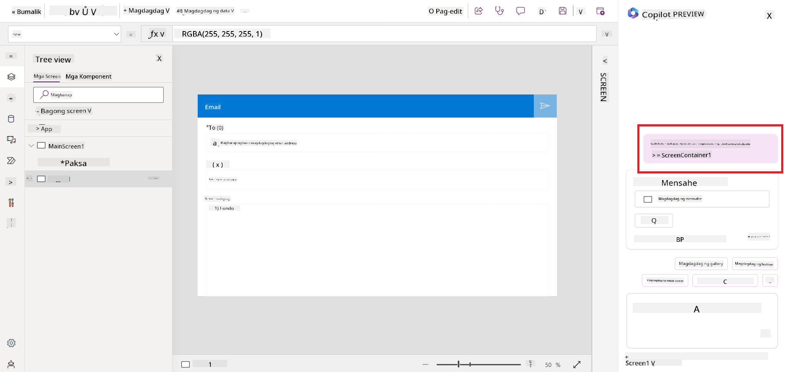
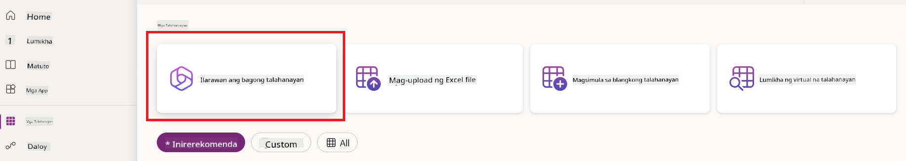
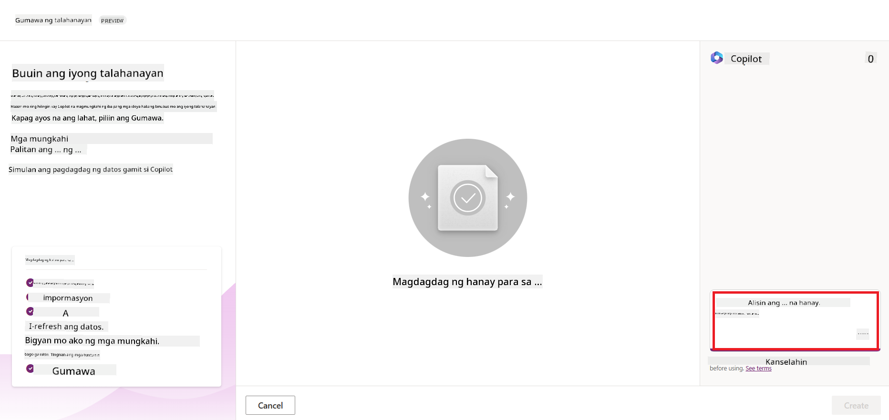
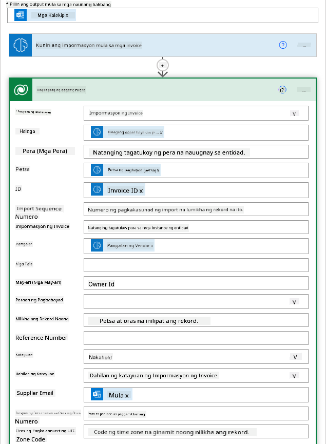

<!--
CO_OP_TRANSLATOR_METADATA:
{
  "original_hash": "846ac8e3b7dcfb697d3309fec05f0fea",
  "translation_date": "2025-10-17T13:16:40+00:00",
  "source_file": "10-building-low-code-ai-applications/README.md",
  "language_code": "tl"
}
-->
# Paggawa ng Low Code AI Applications

> _(I-click ang imahe sa itaas para mapanood ang video ng araling ito)_

## Panimula

Ngayon na natutunan na natin kung paano gumawa ng mga application na gumagawa ng imahe, pag-usapan natin ang low code. Ang Generative AI ay maaaring gamitin sa iba't ibang larangan kabilang ang low code, pero ano nga ba ang low code at paano natin ito malalagyan ng AI?

Ang paggawa ng mga app at solusyon ay naging mas madali para sa mga tradisyunal na developer at hindi developer sa pamamagitan ng paggamit ng Low Code Development Platforms. Ang mga Low Code Development Platforms ay nagbibigay-daan sa iyo na gumawa ng mga app at solusyon na may kaunti o walang code. Ito ay nagagawa sa pamamagitan ng pagbibigay ng visual na development environment na nagbibigay-daan sa iyo na mag-drag at drop ng mga component para makagawa ng mga app at solusyon. Sa ganitong paraan, mas mabilis kang makakagawa ng mga app at solusyon na may mas kaunting resources. Sa araling ito, tatalakayin natin nang mas malalim kung paano gamitin ang Low Code at kung paano mapapahusay ang low code development gamit ang AI sa pamamagitan ng Power Platform.

Ang Power Platform ay nagbibigay sa mga organisasyon ng pagkakataon na bigyang kapangyarihan ang kanilang mga team na gumawa ng sarili nilang mga solusyon sa pamamagitan ng isang intuitive na low-code o no-code na environment. Ang environment na ito ay tumutulong na gawing simple ang proseso ng paggawa ng mga solusyon. Sa Power Platform, ang mga solusyon ay maaaring magawa sa loob ng mga araw o linggo sa halip na buwan o taon. Ang Power Platform ay binubuo ng limang pangunahing produkto: Power Apps, Power Automate, Power BI, Power Pages, at Copilot Studio.

Ang araling ito ay sumasaklaw sa:

- Panimula sa Generative AI sa Power Platform
- Panimula sa Copilot at kung paano ito gamitin
- Paggamit ng Generative AI para gumawa ng mga app at flow sa Power Platform
- Pag-unawa sa AI Models sa Power Platform gamit ang AI Builder

## Mga Layunin sa Pag-aaral

Sa pagtatapos ng araling ito, magagawa mo ang sumusunod:

- Maunawaan kung paano gumagana ang Copilot sa Power Platform.

- Gumawa ng Student Assignment Tracker App para sa aming education startup.

- Gumawa ng Invoice Processing Flow na gumagamit ng AI para kunin ang impormasyon mula sa mga invoice.

- Mag-apply ng pinakamahusay na mga kasanayan sa paggamit ng Create Text with GPT AI Model.

Ang mga tools at teknolohiya na gagamitin mo sa araling ito ay:

- **Power Apps**, para sa Student Assignment Tracker app, na nagbibigay ng low-code development environment para sa paggawa ng mga app upang subaybayan, pamahalaan, at makipag-ugnayan sa data.

- **Dataverse**, para sa pag-iimbak ng data para sa Student Assignment Tracker app kung saan ang Dataverse ay magbibigay ng low-code data platform para sa pag-iimbak ng data ng app.

- **Power Automate**, para sa Invoice Processing flow kung saan magkakaroon ka ng low-code development environment para sa paggawa ng mga workflow upang i-automate ang proseso ng Invoice Processing.

- **AI Builder**, para sa Invoice Processing AI Model kung saan gagamit ka ng prebuilt AI Models upang iproseso ang mga invoice para sa aming startup.

## Generative AI sa Power Platform

Ang pagpapahusay ng low-code development at application gamit ang generative AI ay isang pangunahing pokus para sa Power Platform. Ang layunin ay bigyang-daan ang lahat na makagawa ng mga AI-powered na app, site, dashboard, at mag-automate ng mga proseso gamit ang AI, _nang hindi nangangailangan ng anumang data science expertise_. Ang layuning ito ay nagagawa sa pamamagitan ng pagsasama ng generative AI sa low-code development experience sa Power Platform sa anyo ng Copilot at AI Builder.

### Paano ito gumagana?

Ang Copilot ay isang AI assistant na nagbibigay-daan sa iyo na gumawa ng mga solusyon sa Power Platform sa pamamagitan ng paglalarawan ng iyong mga pangangailangan sa isang serye ng mga hakbang na conversational gamit ang natural na wika. Halimbawa, maaari mong utusan ang iyong AI assistant na tukuyin kung anong mga field ang gagamitin ng iyong app at gagawin nito ang parehong app at ang underlying data model o maaari mong tukuyin kung paano mag-set up ng flow sa Power Automate.

Maaari mong gamitin ang mga Copilot-driven functionalities bilang isang feature sa iyong app screens upang bigyang-daan ang mga user na matuklasan ang mga insight sa pamamagitan ng mga conversational interaction.

Ang AI Builder ay isang low-code AI capability na available sa Power Platform na nagbibigay-daan sa iyo na gumamit ng AI Models upang matulungan kang mag-automate ng mga proseso at mag-predict ng mga resulta. Sa AI Builder, maaari mong dalhin ang AI sa iyong mga app at flow na konektado sa iyong data sa Dataverse o sa iba't ibang cloud data sources, tulad ng SharePoint, OneDrive, o Azure.

Ang Copilot ay available sa lahat ng Power Platform products: Power Apps, Power Automate, Power BI, Power Pages, at Power Virtual Agents. Ang AI Builder ay available sa Power Apps at Power Automate. Sa araling ito, magpo-focus tayo kung paano gamitin ang Copilot at AI Builder sa Power Apps at Power Automate upang gumawa ng solusyon para sa aming education startup.

### Copilot sa Power Apps

Bilang bahagi ng Power Platform, ang Power Apps ay nagbibigay ng low-code development environment para sa paggawa ng mga app upang subaybayan, pamahalaan, at makipag-ugnayan sa data. Ito ay isang suite ng mga serbisyo sa pag-develop ng app na may scalable na data platform at kakayahang kumonekta sa mga cloud services at on-premises data. Ang Power Apps ay nagbibigay-daan sa iyo na gumawa ng mga app na tumatakbo sa mga browser, tablet, at telepono, at maaaring i-share sa mga kasamahan. Ang Power Apps ay nagpapadali sa mga user sa pag-develop ng app gamit ang isang simpleng interface, kaya't ang bawat business user o pro developer ay maaaring gumawa ng custom na mga app. Ang karanasan sa pag-develop ng app ay pinahusay din gamit ang Generative AI sa pamamagitan ng Copilot.

Ang Copilot AI assistant feature sa Power Apps ay nagbibigay-daan sa iyo na ilarawan kung anong uri ng app ang kailangan mo at kung anong impormasyon ang gusto mong i-track, kolektahin, o ipakita ng iyong app. Ang Copilot ay gumagawa ng isang responsive Canvas app base sa iyong paglalarawan. Maaari mo itong i-customize upang matugunan ang iyong mga pangangailangan. Ang AI Copilot ay gumagawa rin at nagmumungkahi ng isang Dataverse Table na may mga field na kailangan mo upang i-store ang data na gusto mong i-track at ilang sample data. Tatalakayin natin kung ano ang Dataverse at kung paano mo ito magagamit sa Power Apps sa araling ito. Maaari mo ring i-customize ang table upang matugunan ang iyong mga pangangailangan gamit ang AI Copilot assistant feature sa pamamagitan ng mga conversational steps. Ang feature na ito ay madaling ma-access mula sa Power Apps home screen.

### Copilot sa Power Automate

Bilang bahagi ng Power Platform, ang Power Automate ay nagbibigay-daan sa mga user na gumawa ng mga automated workflow sa pagitan ng mga application at serbisyo. Tumutulong ito na i-automate ang mga paulit-ulit na proseso ng negosyo tulad ng komunikasyon, pagkolekta ng data, at pag-apruba ng mga desisyon. Ang simpleng interface nito ay nagbibigay-daan sa mga user na may iba't ibang antas ng teknikal na kakayahan (mula sa mga baguhan hanggang sa mga bihasang developer) na i-automate ang mga gawain sa trabaho. Ang karanasan sa pag-develop ng workflow ay pinahusay din gamit ang Generative AI sa pamamagitan ng Copilot.

Ang Copilot AI assistant feature sa Power Automate ay nagbibigay-daan sa iyo na ilarawan kung anong uri ng flow ang kailangan mo at kung anong mga aksyon ang gusto mong gawin ng iyong flow. Ang Copilot ay gumagawa ng flow base sa iyong paglalarawan. Maaari mo itong i-customize upang matugunan ang iyong mga pangangailangan. Ang AI Copilot ay gumagawa rin at nagmumungkahi ng mga aksyon na kailangan mo upang maisagawa ang task na gusto mong i-automate. Tatalakayin natin kung ano ang mga flow at kung paano mo ito magagamit sa Power Automate sa araling ito. Maaari mo ring i-customize ang mga aksyon upang matugunan ang iyong mga pangangailangan gamit ang AI Copilot assistant feature sa pamamagitan ng mga conversational steps. Ang feature na ito ay madaling ma-access mula sa Power Automate home screen.

## Gawain: Pamahalaan ang mga student assignment at invoice para sa aming startup gamit ang Copilot

Ang aming startup ay nagbibigay ng online courses sa mga estudyante. Ang startup ay mabilis na lumago at ngayon ay nahihirapan nang makasabay sa demand para sa mga kurso nito. Ang startup ay kumuha sa iyo bilang isang Power Platform developer upang tulungan silang gumawa ng low code solution upang matulungan silang pamahalaan ang kanilang mga student assignment at invoice. Ang kanilang solusyon ay dapat makatulong sa kanila na subaybayan at pamahalaan ang mga student assignment sa pamamagitan ng isang app at i-automate ang proseso ng invoice processing sa pamamagitan ng isang workflow. Hiniling sa iyo na gamitin ang Generative AI upang ma-develop ang solusyon.

Kapag nagsisimula kang gumamit ng Copilot, maaari mong gamitin ang [Power Platform Copilot Prompt Library](https://github.com/pnp/powerplatform-prompts?WT.mc_id=academic-109639-somelezediko) upang makapagsimula sa mga prompt. Ang library na ito ay naglalaman ng listahan ng mga prompt na maaari mong gamitin upang gumawa ng mga app at flow gamit ang Copilot. Maaari mo ring gamitin ang mga prompt sa library upang makakuha ng ideya kung paano ilarawan ang iyong mga pangangailangan sa Copilot.

### Gumawa ng Student Assignment Tracker App para sa Aming Startup

Ang mga guro sa aming startup ay nahihirapan nang subaybayan ang mga student assignment. Gumagamit sila ng spreadsheet upang subaybayan ang mga assignment ngunit ito ay naging mahirap pamahalaan habang dumadami ang bilang ng mga estudyante. Hiniling nila sa iyo na gumawa ng isang app na makakatulong sa kanila na subaybayan at pamahalaan ang mga student assignment. Ang app ay dapat magbigay-daan sa kanila na magdagdag ng bagong mga assignment, tingnan ang mga assignment, i-update ang mga assignment, at tanggalin ang mga assignment. Ang app ay dapat ding magbigay-daan sa mga guro at estudyante na makita ang mga assignment na na-grade na at ang mga hindi pa na-grade.

Gagawa ka ng app gamit ang Copilot sa Power Apps sa pamamagitan ng pagsunod sa mga hakbang sa ibaba:

1. Pumunta sa [Power Apps](https://make.powerapps.com?WT.mc_id=academic-105485-koreyst) home screen.

1. Gamitin ang text area sa home screen upang ilarawan ang app na gusto mong gawin. Halimbawa, **_Gusto kong gumawa ng app para subaybayan at pamahalaan ang mga student assignment_**. I-click ang **Send** button upang ipadala ang prompt sa AI Copilot.

1. Ang AI Copilot ay magmumungkahi ng Dataverse Table na may mga field na kailangan mo upang i-store ang data na gusto mong i-track at ilang sample data. Maaari mo itong i-customize upang matugunan ang iyong mga pangangailangan gamit ang AI Copilot assistant feature sa pamamagitan ng mga conversational steps.

   > **Mahalaga**: Ang Dataverse ay ang underlying data platform para sa Power Platform. Ito ay isang low-code data platform para sa pag-iimbak ng data ng app. Ito ay isang fully managed service na ligtas na nag-iimbak ng data sa Microsoft Cloud at naka-provision sa loob ng iyong Power Platform environment. Mayroon itong built-in na data governance capabilities, tulad ng data classification, data lineage, fine-grained access control, at iba pa. Maaari kang matuto pa tungkol sa Dataverse [dito](https://docs.microsoft.com/powerapps/maker/data-platform/data-platform-intro?WT.mc_id=academic-109639-somelezediko).

   

1. Ang mga guro ay nais magpadala ng mga email sa mga estudyante na nagsumite ng kanilang mga assignment upang panatilihin silang updated sa progreso ng kanilang mga assignment. Maaari mong gamitin ang Copilot upang magdagdag ng bagong field sa table upang i-store ang email ng estudyante. Halimbawa, maaari mong gamitin ang sumusunod na prompt upang magdagdag ng bagong field sa table: **_Gusto kong magdagdag ng column para i-store ang email ng estudyante_**. I-click ang **Send** button upang ipadala ang prompt sa AI Copilot.

1. Ang AI Copilot ay gagawa ng bagong field at maaari mo itong i-customize upang matugunan ang iyong mga pangangailangan.

1. Kapag tapos ka na sa table, i-click ang **Create app** button upang gumawa ng app.

1. Ang AI Copilot ay gagawa ng responsive Canvas app base sa iyong paglalarawan. Maaari mo itong i-customize upang matugunan ang iyong mga pangangailangan.

1. Para sa mga guro na magpadala ng mga email sa mga estudyante, maaari mong gamitin ang Copilot upang magdagdag ng bagong screen sa app. Halimbawa, maaari mong gamitin ang sumusunod na prompt upang magdagdag ng bagong screen sa app: **_Gusto kong magdagdag ng screen para magpadala ng email sa mga estudyante_**. I-click ang **Send** button upang ipadala ang prompt sa AI Copilot.

1. Ang AI Copilot ay gagawa ng bagong screen at maaari mo itong i-customize upang matugunan ang iyong mga pangangailangan.

1. Kapag tapos ka na sa app, i-click ang **Save** button upang i-save ang app.

1. Upang i-share ang app sa mga guro, i-click ang **Share** button at pagkatapos ay i-click muli ang **Share** button. Maaari mo nang i-share ang app sa mga guro sa pamamagitan ng paglalagay ng kanilang email address.

> **Ang iyong takdang-aralin**: Ang app na ginawa mo ay isang magandang simula ngunit maaari pang mapabuti. Sa email feature, ang mga guro ay maaari lamang magpadala ng email sa mga estudyante nang manu-mano sa pamamagitan ng pag-type ng kanilang mga email. Maaari mo bang gamitin ang Copilot upang gumawa ng automation na magbibigay-daan sa mga guro na magpadala ng email sa mga estudyante nang awtomatiko kapag nagsumite sila ng kanilang mga assignment? Ang iyong hint ay sa tamang prompt maaari mong gamitin ang Copilot sa Power Automate upang gawin ito.

### Gumawa ng Invoices Information Table para sa Aming Startup

Ang finance team ng aming startup ay nahihirapan nang subaybayan ang mga invoice. Gumagamit sila ng spreadsheet upang subaybayan ang mga invoice ngunit ito ay naging mahirap pamahalaan habang dumadami ang bilang ng mga invoice. Hiniling nila sa iyo na gumawa ng isang table na makakatulong sa kanila na i-store, subaybayan, at pamahalaan ang impormasyon ng mga invoice na kanilang natanggap. Ang table ay dapat gamitin upang gumawa ng automation na mag-e-extract ng lahat ng impormasyon ng invoice at i-store ito sa table. Ang table ay dapat ding magbigay-daan sa finance team na makita ang mga invoice na nabayaran na at ang mga hindi pa nababayaran.

Ang Power Platform ay may underlying data platform na tinatawag na Dataverse na nagbibigay-daan sa iyo na i-store ang data para sa iyong mga app at solusyon. Ang Dataverse ay nagbibigay ng low-code data platform para sa pag-iimbak ng data ng app. Ito ay isang fully managed service na ligtas na nag-iimbak ng data sa Microsoft Cloud at naka-provision sa loob ng iyong Power Platform environment. Mayroon itong built-in na data governance capabilities, tulad ng data classification, data lineage, fine-grained access control, at iba pa. Maaari kang matuto pa [tungkol sa Dataverse dito](https://docs.microsoft.com/powerapps/maker/data-platform/data-platform-intro?WT.mc_id=academic-109639-somelezediko).
Bakit dapat gamitin ang Dataverse para sa ating startup? Ang mga standard at custom na talahanayan sa loob ng Dataverse ay nagbibigay ng ligtas at cloud-based na opsyon para sa pag-iimbak ng iyong data. Ang mga talahanayan ay nagbibigay-daan sa iyo na mag-imbak ng iba't ibang uri ng data, katulad ng paggamit ng maraming worksheet sa isang Excel workbook. Maaari mong gamitin ang mga talahanayan upang mag-imbak ng data na partikular sa iyong organisasyon o pangangailangan ng negosyo. Ilan sa mga benepisyo na makukuha ng ating startup mula sa paggamit ng Dataverse ay kabilang ngunit hindi limitado sa:

- **Madaling pamahalaan**: Ang metadata at data ay nakaimbak sa cloud, kaya hindi mo kailangang mag-alala tungkol sa mga detalye kung paano ito iniimbak o pinamamahalaan. Maaari kang mag-focus sa paggawa ng iyong mga app at solusyon.

- **Ligtas**: Ang Dataverse ay nagbibigay ng ligtas at cloud-based na opsyon para sa pag-iimbak ng iyong data. Maaari mong kontrolin kung sino ang may access sa data sa iyong mga talahanayan at kung paano nila ito maa-access gamit ang role-based security.

- **Mayamang metadata**: Ang mga uri ng data at relasyon ay direktang ginagamit sa loob ng Power Apps.

- **Logic at validation**: Maaari mong gamitin ang mga business rules, calculated fields, at validation rules upang ipatupad ang business logic at mapanatili ang katumpakan ng data.

Ngayon na alam mo kung ano ang Dataverse at kung bakit mo ito dapat gamitin, tingnan natin kung paano mo magagamit ang Copilot upang gumawa ng talahanayan sa Dataverse na tutugon sa mga pangangailangan ng ating finance team.

> **Note**: Gagamitin mo ang talahanayan na ito sa susunod na seksyon upang bumuo ng automation na mag-eextract ng lahat ng impormasyon ng invoice at iimbak ito sa talahanayan.

Para gumawa ng talahanayan sa Dataverse gamit ang Copilot, sundin ang mga hakbang sa ibaba:

1. Pumunta sa [Power Apps](https://make.powerapps.com?WT.mc_id=academic-105485-koreyst) home screen.

2. Sa kaliwang navigation bar, piliin ang **Tables** at pagkatapos ay i-click ang **Describe the new Table**.

3. Sa **Describe the new Table** screen, gamitin ang text area upang ilarawan ang talahanayan na nais mong gawin. Halimbawa, **_Gusto kong gumawa ng talahanayan para mag-imbak ng impormasyon ng invoice_**. I-click ang **Send** button upang ipadala ang prompt sa AI Copilot.

4. Ang AI Copilot ay magmumungkahi ng Dataverse Table na may mga field na kailangan mo upang mag-imbak ng data na nais mong i-track at ilang sample na data. Maaari mong i-customize ang talahanayan upang tumugma sa iyong mga pangangailangan gamit ang AI Copilot assistant feature sa pamamagitan ng conversational steps.

5. Ang finance team ay nais magpadala ng email sa supplier upang i-update sila sa kasalukuyang status ng kanilang invoice. Maaari mong gamitin ang Copilot upang magdagdag ng bagong field sa talahanayan para mag-imbak ng supplier email. Halimbawa, maaari mong gamitin ang sumusunod na prompt upang magdagdag ng bagong field sa talahanayan: **_Gusto kong magdagdag ng column para mag-imbak ng supplier email_**. I-click ang **Send** button upang ipadala ang prompt sa AI Copilot.

6. Ang AI Copilot ay maggegenerate ng bagong field at maaari mong i-customize ang field upang tumugma sa iyong mga pangangailangan.

7. Kapag tapos ka na sa talahanayan, i-click ang **Create** button upang gawin ang talahanayan.

## AI Models sa Power Platform gamit ang AI Builder

Ang AI Builder ay isang low-code AI capability na available sa Power Platform na nagbibigay-daan sa iyo na gumamit ng AI Models upang makatulong sa pag-automate ng mga proseso at magpredict ng mga resulta. Sa AI Builder, maaari mong dalhin ang AI sa iyong mga app at flow na konektado sa iyong data sa Dataverse o sa iba't ibang cloud data sources, tulad ng SharePoint, OneDrive, o Azure.

## Prebuilt AI Models vs Custom AI Models

Ang AI Builder ay nagbibigay ng dalawang uri ng AI Models: Prebuilt AI Models at Custom AI Models. Ang Prebuilt AI Models ay mga ready-to-use AI Models na sinanay ng Microsoft at available sa Power Platform. Ang mga ito ay tumutulong sa iyo na magdagdag ng intelligence sa iyong mga app at flow nang hindi kinakailangang mag-gather ng data at pagkatapos ay mag-build, mag-train, at mag-publish ng sarili mong mga modelo. Maaari mong gamitin ang mga modelong ito upang mag-automate ng mga proseso at magpredict ng mga resulta.

Ilan sa mga Prebuilt AI Models na available sa Power Platform ay:

- **Key Phrase Extraction**: Ang modelong ito ay nag-eextract ng mga key phrase mula sa text.
- **Language Detection**: Ang modelong ito ay nagde-detect ng wika ng isang text.
- **Sentiment Analysis**: Ang modelong ito ay nagde-detect ng positibo, negatibo, neutral, o mixed na sentiment sa text.
- **Business Card Reader**: Ang modelong ito ay nag-eextract ng impormasyon mula sa mga business card.
- **Text Recognition**: Ang modelong ito ay nag-eextract ng text mula sa mga imahe.
- **Object Detection**: Ang modelong ito ay nagde-detect at nag-eextract ng mga object mula sa mga imahe.
- **Document Processing**: Ang modelong ito ay nag-eextract ng impormasyon mula sa mga forms.
- **Invoice Processing**: Ang modelong ito ay nag-eextract ng impormasyon mula sa mga invoice.

Sa Custom AI Models, maaari mong dalhin ang sarili mong modelo sa AI Builder upang magamit ito tulad ng anumang AI Builder custom model, na nagbibigay-daan sa iyo na i-train ang modelo gamit ang sarili mong data. Maaari mong gamitin ang mga modelong ito upang mag-automate ng mga proseso at magpredict ng mga resulta sa parehong Power Apps at Power Automate. Kapag gumagamit ng sarili mong modelo, may mga limitasyon na nalalapat. Basahin ang higit pa tungkol sa mga [limitasyon](https://learn.microsoft.com/ai-builder/byo-model#limitations?WT.mc_id=academic-105485-koreyst).

## Assignment #2 - Gumawa ng Invoice Processing Flow para sa Ating Startup

Ang finance team ay nahihirapan sa pagproseso ng mga invoice. Gumagamit sila ng spreadsheet upang i-track ang mga invoice ngunit ito ay nagiging mahirap pamahalaan habang dumadami ang bilang ng mga invoice. Hiniling nila sa iyo na gumawa ng workflow na makakatulong sa kanila na magproseso ng mga invoice gamit ang AI. Ang workflow ay dapat magbigay-daan sa kanila na mag-extract ng impormasyon mula sa mga invoice at iimbak ang impormasyon sa isang Dataverse table. Ang workflow ay dapat din magbigay-daan sa kanila na magpadala ng email sa finance team na may kasamang extracted na impormasyon.

Ngayon na alam mo kung ano ang AI Builder at kung bakit mo ito dapat gamitin, tingnan natin kung paano mo magagamit ang Invoice Processing AI Model sa AI Builder, na tinalakay natin kanina, upang gumawa ng workflow na makakatulong sa finance team na magproseso ng mga invoice.

Para gumawa ng workflow na makakatulong sa finance team na magproseso ng mga invoice gamit ang Invoice Processing AI Model sa AI Builder, sundin ang mga hakbang sa ibaba:

1. Pumunta sa [Power Automate](https://make.powerautomate.com?WT.mc_id=academic-105485-koreyst) home screen.

2. Gamitin ang text area sa home screen upang ilarawan ang workflow na nais mong gawin. Halimbawa, **_Proseso ng invoice kapag dumating ito sa aking mailbox_**. I-click ang **Send** button upang ipadala ang prompt sa AI Copilot.

   

3. Ang AI Copilot ay magmumungkahi ng mga aksyon na kailangan upang maisagawa ang task na nais mong i-automate. Maaari mong i-click ang **Next** button upang dumaan sa mga susunod na hakbang.

4. Sa susunod na hakbang, ang Power Automate ay magpo-prompt sa iyo upang i-set up ang mga koneksyon na kinakailangan para sa flow. Kapag tapos ka na, i-click ang **Create flow** button upang gawin ang flow.

5. Ang AI Copilot ay maggegenerate ng flow at maaari mong i-customize ang flow upang tumugma sa iyong mga pangangailangan.

6. I-update ang trigger ng flow at i-set ang **Folder** sa folder kung saan iimbak ang mga invoice. Halimbawa, maaari mong i-set ang folder sa **Inbox**. I-click ang **Show advanced options** at i-set ang **Only with Attachments** sa **Yes**. Ito ay magtitiyak na ang flow ay tatakbo lamang kapag may email na may attachment na natanggap sa folder.

7. Alisin ang mga sumusunod na aksyon mula sa flow: **HTML to text**, **Compose**, **Compose 2**, **Compose 3**, at **Compose 4** dahil hindi mo ito gagamitin.

8. Alisin ang **Condition** action mula sa flow dahil hindi mo ito gagamitin. Dapat itong magmukhang tulad ng sumusunod na screenshot:

   

9. I-click ang **Add an action** button at hanapin ang **Dataverse**. Piliin ang **Add a new row** action.

10. Sa **Extract Information from invoices** action, i-update ang **Invoice File** upang ituro sa **Attachment Content** mula sa email. Ito ay magtitiyak na ang flow ay mag-eextract ng impormasyon mula sa invoice attachment.

11. Piliin ang **Table** na ginawa mo kanina. Halimbawa, maaari mong piliin ang **Invoice Information** table. Piliin ang dynamic content mula sa nakaraang aksyon upang punan ang mga sumusunod na field:

    - ID
    - Amount
    - Date
    - Name
    - Status - I-set ang **Status** sa **Pending**.
    - Supplier Email - Gamitin ang **From** dynamic content mula sa **When a new email arrives** trigger.

    

12. Kapag tapos ka na sa flow, i-click ang **Save** button upang i-save ang flow. Maaari mo itong i-test sa pamamagitan ng pagpapadala ng email na may invoice sa folder na tinukoy mo sa trigger.

> **Ang iyong homework**: Ang flow na ginawa mo ay isang magandang simula, ngayon kailangan mong mag-isip kung paano ka makakagawa ng automation na magbibigay-daan sa finance team na magpadala ng email sa supplier upang i-update sila sa kasalukuyang status ng kanilang invoice. Ang iyong hint: ang flow ay dapat tumakbo kapag nagbago ang status ng invoice.

## Gumamit ng Text Generation AI Model sa Power Automate

Ang Create Text with GPT AI Model sa AI Builder ay nagbibigay-daan sa iyo na maggenerate ng text base sa isang prompt at powered ito ng Microsoft Azure OpenAI Service. Sa capability na ito, maaari mong isama ang GPT (Generative Pre-Trained Transformer) technology sa iyong mga app at flow upang makabuo ng iba't ibang automated flows at insightful applications.

Ang GPT models ay dumadaan sa malawak na training gamit ang napakaraming data, na nagbibigay-daan sa kanila na makabuo ng text na malapit sa wika ng tao kapag binigyan ng prompt. Kapag isinama sa workflow automation, ang mga AI models tulad ng GPT ay maaaring magamit upang mag-streamline at mag-automate ng iba't ibang mga gawain.

Halimbawa, maaari kang gumawa ng mga flow upang awtomatikong maggenerate ng text para sa iba't ibang use cases, tulad ng: drafts ng email, mga product description, at iba pa. Maaari mo ring gamitin ang modelo upang maggenerate ng text para sa iba't ibang app, tulad ng chatbots at customer service apps na nagbibigay-daan sa mga customer service agents na tumugon nang epektibo at mabilis sa mga tanong ng customer.

Para matutunan kung paano gamitin ang AI Model na ito sa Power Automate, dumaan sa [Add intelligence with AI Builder and GPT](https://learn.microsoft.com/training/modules/ai-builder-text-generation/?WT.mc_id=academic-109639-somelezediko) module.

## Magaling na Trabaho! Ipagpatuloy ang Iyong Pag-aaral

Pagkatapos makumpleto ang araling ito, tingnan ang aming [Generative AI Learning collection](https://aka.ms/genai-collection?WT.mc_id=academic-105485-koreyst) upang patuloy na paunlarin ang iyong kaalaman sa Generative AI!

Pumunta sa Lesson 11 kung saan tatalakayin natin kung paano [i-integrate ang Generative AI sa Function Calling](../11-integrating-with-function-calling/README.md?WT.mc_id=academic-105485-koreyst)!

---

**Paunawa**:  
Ang dokumentong ito ay isinalin gamit ang AI translation service na [Co-op Translator](https://github.com/Azure/co-op-translator). Bagamat sinisikap naming maging tumpak, pakatandaan na ang mga awtomatikong pagsasalin ay maaaring maglaman ng mga pagkakamali o hindi pagkakatugma. Ang orihinal na dokumento sa kanyang katutubong wika ang dapat ituring na opisyal na sanggunian. Para sa mahalagang impormasyon, inirerekomenda ang propesyonal na pagsasalin ng tao. Hindi kami mananagot sa anumang hindi pagkakaunawaan o maling interpretasyon na dulot ng paggamit ng pagsasaling ito.