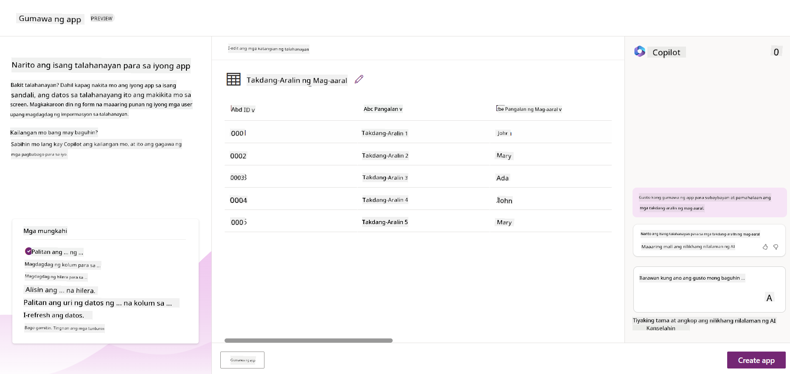
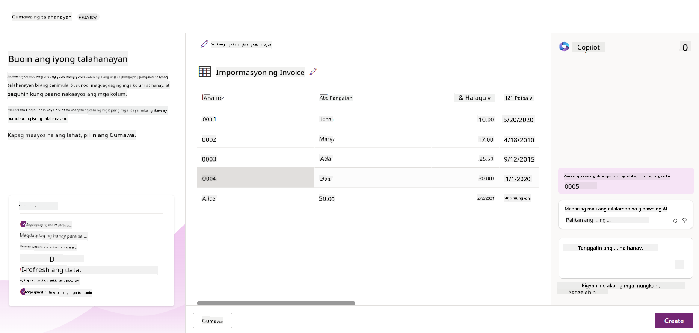

<!--
CO_OP_TRANSLATOR_METADATA:
{
  "original_hash": "f5ff3b6204a695a117d6f452403c95f7",
  "translation_date": "2025-07-09T14:08:49+00:00",
  "source_file": "10-building-low-code-ai-applications/README.md",
  "language_code": "tl"
}
-->
# Paggawa ng Low Code AI Applications

> _(I-click ang larawan sa itaas para mapanood ang video ng araling ito)_

## Panimula

Ngayon na natutunan na natin kung paano gumawa ng mga application na nagge-generate ng larawan, pag-usapan naman natin ang low code. Maaaring gamitin ang Generative AI sa iba't ibang larangan kabilang na ang low code, pero ano nga ba ang low code at paano natin ito mapapahusay gamit ang AI?

Mas naging madali na para sa mga tradisyunal na developer at mga hindi developer ang paggawa ng mga app at solusyon gamit ang Low Code Development Platforms. Pinapayagan ka ng Low Code Development Platforms na gumawa ng mga app at solusyon gamit ang kaunti o walang code. Nagagawa ito sa pamamagitan ng pagbibigay ng visual development environment kung saan maaari mong i-drag at i-drop ang mga components para bumuo ng mga app at solusyon. Dahil dito, mas mabilis kang makakagawa ng mga app at solusyon gamit ang mas kaunting resources. Sa araling ito, tatalakayin natin nang malalim kung paano gamitin ang Low Code at paano mapapalakas ang low code development gamit ang AI sa pamamagitan ng Power Platform.

Nagbibigay ang Power Platform ng pagkakataon sa mga organisasyon na bigyang kapangyarihan ang kanilang mga team na gumawa ng sariling solusyon gamit ang isang madaling gamitin na low-code o no-code na kapaligiran. Pinapadali nito ang proseso ng paggawa ng mga solusyon. Sa Power Platform, maaaring makabuo ng mga solusyon sa loob ng ilang araw o linggo, sa halip na buwan o taon. Binubuo ang Power Platform ng limang pangunahing produkto: Power Apps, Power Automate, Power BI, Power Pages, at Copilot Studio.

Saklaw ng araling ito ang:

- Panimula sa Generative AI sa Power Platform  
- Panimula sa Copilot at kung paano ito gamitin  
- Paggamit ng Generative AI para gumawa ng mga app at flows sa Power Platform  
- Pag-unawa sa AI Models sa Power Platform gamit ang AI Builder  

## Mga Layunin sa Pagkatuto

Sa pagtatapos ng araling ito, magagawa mong:

- Maunawaan kung paano gumagana ang Copilot sa Power Platform.  
- Gumawa ng Student Assignment Tracker App para sa aming education startup.  
- Gumawa ng Invoice Processing Flow na gumagamit ng AI para kunin ang impormasyon mula sa mga invoice.  
- Ipatupad ang mga best practices kapag gumagamit ng Create Text gamit ang GPT AI Model.  

Ang mga tools at teknolohiya na gagamitin mo sa araling ito ay:

- **Power Apps**, para sa Student Assignment Tracker app, na nagbibigay ng low-code development environment para gumawa ng mga app na sumusubaybay, nagma-manage, at nakikipag-interact sa data.  
- **Dataverse**, para sa pag-iimbak ng data ng Student Assignment Tracker app kung saan nagbibigay ang Dataverse ng low-code data platform para sa pag-iimbak ng data ng app.  
- **Power Automate**, para sa Invoice Processing flow kung saan magkakaroon ka ng low-code development environment para gumawa ng workflows na nag-a-automate ng proseso ng Invoice Processing.  
- **AI Builder**, para sa Invoice Processing AI Model kung saan gagamitin mo ang mga prebuilt AI Models para iproseso ang mga invoice para sa aming startup.  

## Generative AI sa Power Platform

Ang pagpapahusay ng low-code development at aplikasyon gamit ang generative AI ay isang pangunahing pokus ng Power Platform. Layunin nito na bigyang kakayahan ang lahat na makagawa ng AI-powered apps, sites, dashboards, at mag-automate ng mga proseso gamit ang AI, _nang hindi kinakailangang magkaroon ng kaalaman sa data science_. Nakakamit ang layuning ito sa pamamagitan ng integrasyon ng generative AI sa low-code development experience sa Power Platform sa anyo ng Copilot at AI Builder.

### Paano ito gumagana?

Ang Copilot ay isang AI assistant na nagbibigay-daan sa iyo na gumawa ng mga solusyon sa Power Platform sa pamamagitan ng paglalarawan ng iyong mga pangangailangan sa isang serye ng mga conversational steps gamit ang natural na wika. Halimbawa, maaari mong utusan ang iyong AI assistant na sabihin kung anong mga field ang gagamitin ng iyong app at gagawa ito ng app pati na rin ng underlying data model, o maaari mong tukuyin kung paano mag-set up ng flow sa Power Automate.

Maaari mong gamitin ang mga functionality na pinapagana ng Copilot bilang feature sa iyong mga app screen upang tulungan ang mga user na makakuha ng mga insight sa pamamagitan ng conversational interactions.

Ang AI Builder ay isang low-code AI capability na available sa Power Platform na nagbibigay-daan sa iyo na gamitin ang AI Models para tulungan kang i-automate ang mga proseso at hulaan ang mga resulta. Sa AI Builder, maaari mong dalhin ang AI sa iyong mga app at flows na nakakonekta sa iyong data sa Dataverse o sa iba't ibang cloud data sources, tulad ng SharePoint, OneDrive, o Azure.

Available ang Copilot sa lahat ng produkto ng Power Platform: Power Apps, Power Automate, Power BI, Power Pages, at Power Virtual Agents. Available naman ang AI Builder sa Power Apps at Power Automate. Sa araling ito, tututok tayo kung paano gamitin ang Copilot at AI Builder sa Power Apps at Power Automate para gumawa ng solusyon para sa aming education startup.

### Copilot sa Power Apps

Bilang bahagi ng Power Platform, nagbibigay ang Power Apps ng low-code development environment para gumawa ng mga app na sumusubaybay, nagma-manage, at nakikipag-interact sa data. Isa itong suite ng app development services na may scalable data platform at kakayahang kumonekta sa cloud services at on-premises data. Pinapayagan ng Power Apps na gumawa ka ng mga app na tumatakbo sa browsers, tablets, at phones, at maaaring ibahagi sa mga katrabaho. Pinapadali ng Power Apps ang pag-develop ng app sa mga user sa pamamagitan ng isang simpleng interface, kaya bawat business user o pro developer ay maaaring gumawa ng custom apps. Pinapalakas din ang karanasan sa pag-develop ng app gamit ang Generative AI sa pamamagitan ng Copilot.

Pinapayagan ka ng copilot AI assistant feature sa Power Apps na ilarawan kung anong klaseng app ang kailangan mo at kung anong impormasyon ang gusto mong subaybayan, kolektahin, o ipakita ng iyong app. Pagkatapos, gagawa ang Copilot ng isang responsive Canvas app base sa iyong paglalarawan. Maaari mo itong i-customize upang umangkop sa iyong pangangailangan. Gumagawa rin ang AI Copilot at nagmumungkahi ng Dataverse Table na may mga field na kailangan mo para i-store ang data na gusto mong subaybayan pati na rin ng ilang sample data. Tatalakayin natin kung ano ang Dataverse at paano mo ito magagamit sa Power Apps sa araling ito mamaya. Maaari mo ring i-customize ang table upang umangkop sa iyong pangangailangan gamit ang AI Copilot assistant feature sa pamamagitan ng mga conversational steps. Madaling ma-access ang feature na ito mula sa Power Apps home screen.

### Copilot sa Power Automate

Bilang bahagi ng Power Platform, pinapayagan ng Power Automate ang mga user na gumawa ng automated workflows sa pagitan ng mga application at serbisyo. Tinutulungan nitong i-automate ang mga paulit-ulit na business process tulad ng komunikasyon, pagkolekta ng data, at pag-apruba ng mga desisyon. Ang simple nitong interface ay nagbibigay-daan sa mga user na may iba't ibang antas ng teknikal na kakayahan (mula sa mga baguhan hanggang sa mga bihasang developer) na i-automate ang mga gawain sa trabaho. Pinapalakas din ang karanasan sa paggawa ng workflow gamit ang Generative AI sa pamamagitan ng Copilot.

Pinapayagan ka ng copilot AI assistant feature sa Power Automate na ilarawan kung anong klaseng flow ang kailangan mo at kung anong mga aksyon ang gusto mong gawin ng iyong flow. Pagkatapos, gagawa ang Copilot ng flow base sa iyong paglalarawan. Maaari mo itong i-customize upang umangkop sa iyong pangangailangan. Gumagawa rin ang AI Copilot at nagmumungkahi ng mga aksyon na kailangan mo para maisagawa ang task na gusto mong i-automate. Tatalakayin natin kung ano ang mga flows at paano mo ito magagamit sa Power Automate sa araling ito mamaya. Maaari mo ring i-customize ang mga aksyon upang umangkop sa iyong pangangailangan gamit ang AI Copilot assistant feature sa pamamagitan ng mga conversational steps. Madaling ma-access ang feature na ito mula sa Power Automate home screen.

## Takdang-Aralin: Pamahalaan ang mga student assignments at invoices para sa aming startup gamit ang Copilot

Nagbibigay ang aming startup ng mga online na kurso sa mga estudyante. Mabilis ang paglago ng startup kaya nahihirapan na itong makasabay sa demand para sa mga kurso nito. Kinuha ka ng startup bilang Power Platform developer upang tulungan silang gumawa ng low code solution para pamahalaan ang mga student assignments at invoices. Dapat makatulong ang kanilang solusyon na subaybayan at pamahalaan ang mga student assignments sa pamamagitan ng isang app at i-automate ang proseso ng invoice processing gamit ang isang workflow. Hiniling sa iyo na gamitin ang Generative AI para bumuo ng solusyon.

Kapag nagsisimula kang gumamit ng Copilot, maaari mong gamitin ang [Power Platform Copilot Prompt Library](https://github.com/pnp/powerplatform-prompts?WT.mc_id=academic-109639-somelezediko) para makakuha ng mga prompt. Naglalaman ang library na ito ng listahan ng mga prompt na maaari mong gamitin para gumawa ng mga app at flows gamit ang Copilot. Maaari mo ring gamitin ang mga prompt sa library para magkaroon ng ideya kung paano ilarawan ang iyong mga pangangailangan sa Copilot.

### Gumawa ng Student Assignment Tracker App para sa Aming Startup

Nahihirapan ang mga guro sa aming startup na subaybayan ang mga student assignments. Gumagamit sila ng spreadsheet para dito pero naging mahirap nang pamahalaan dahil dumami na ang mga estudyante. Hiniling nila sa iyo na gumawa ng app na makakatulong sa kanila na subaybayan at pamahalaan ang mga student assignments. Dapat payagan ng app na magdagdag ng bagong assignments, tingnan ang mga assignments, i-update ang mga assignments, at tanggalin ang mga assignments. Dapat din payagan ng app ang mga guro at estudyante na makita ang mga assignments na na-grade na at yung mga hindi pa na-grade.

Gagawa ka ng app gamit ang Copilot sa Power Apps sa pamamagitan ng mga sumusunod na hakbang:

1. Pumunta sa [Power Apps](https://make.powerapps.com?WT.mc_id=academic-105485-koreyst) home screen.

1. Gamitin ang text area sa home screen para ilarawan ang app na gusto mong gawin. Halimbawa, **_Gusto kong gumawa ng app para subaybayan at pamahalaan ang mga student assignments_**. I-click ang **Send** button para ipadala ang prompt sa AI Copilot.

1. Magmumungkahi ang AI Copilot ng Dataverse Table na may mga field na kailangan mo para i-store ang data na gusto mong subaybayan pati na rin ng ilang sample data. Maaari mong i-customize ang table upang umangkop sa iyong pangangailangan gamit ang AI Copilot assistant feature sa pamamagitan ng mga conversational steps.

   > **Mahalaga**: Ang Dataverse ang underlying data platform para sa Power Platform. Isa itong low-code data platform para sa pag-iimbak ng data ng app. Ito ay isang fully managed service na ligtas na nag-iimbak ng data sa Microsoft Cloud at naka-provision sa loob ng iyong Power Platform environment. Mayroon itong built-in na data governance capabilities, tulad ng data classification, data lineage, fine-grained access control, at iba pa. Maaari kang matuto nang higit pa tungkol sa Dataverse [dito](https://docs.microsoft.com/powerapps/maker/data-platform/data-platform-intro?WT.mc_id=academic-109639-somelezediko).

   

1. Gusto ng mga guro na magpadala ng email sa mga estudyanteng nagsumite ng kanilang assignments para ma-update sila tungkol sa progreso ng kanilang assignments. Maaari mong gamitin ang Copilot para magdagdag ng bagong field sa table para i-store ang email ng estudyante. Halimbawa, maaari mong gamitin ang prompt na ito para magdagdag ng bagong field sa table: **_Gusto kong magdagdag ng column para i-store ang email ng estudyante_**. I-click ang **Send** button para ipadala ang prompt sa AI Copilot.

1. Gagawa ang AI Copilot ng bagong field at maaari mo itong i-customize upang umangkop sa iyong pangangailangan.

1. Kapag tapos ka na sa table, i-click ang **Create app** button para gawin ang app.

1. Gagawa ang AI Copilot ng responsive Canvas app base sa iyong paglalarawan. Maaari mo itong i-customize upang umangkop sa iyong pangangailangan.

1. Para makapagpadala ng email ang mga guro sa mga estudyante, maaari mong gamitin ang Copilot para magdagdag ng bagong screen sa app. Halimbawa, maaari mong gamitin ang prompt na ito para magdagdag ng bagong screen sa app: **_Gusto kong magdagdag ng screen para magpadala ng email sa mga estudyante_**. I-click ang **Send** button para ipadala ang prompt sa AI Copilot.

1. Gagawa ang AI Copilot ng bagong screen at maaari mo itong i-customize upang umangkop sa iyong pangangailangan.

1. Kapag tapos ka na sa app, i-click ang **Save** button para i-save ang app.

1. Para maibahagi ang app sa mga guro, i-click ang **Share** button at pagkatapos ay i-click muli ang **Share** button. Maaari mong ibahagi ang app sa mga guro sa pamamagitan ng paglalagay ng kanilang mga email address.

> **Iyong takdang-aralin**: Maganda na ang app na ginawa mo pero maaari pa itong pagandahin. Sa email feature, manu-mano lang makakapagpadala ng email ang mga guro sa mga estudyante sa pamamagitan ng pagta-type ng kanilang mga email. Maaari mo bang gamitin ang Copilot para gumawa ng automation na magpapahintulot sa mga guro na magpadala ng email sa mga estudyante nang awtomatiko kapag nagsumite sila ng kanilang assignments? Ang iyong hint ay sa tamang prompt, maaari mong gamitin ang Copilot sa Power Automate para gawin ito.

### Gumawa ng Invoices Information Table para sa Aming Startup

Nahihirapan ang finance team ng aming startup na subaybayan ang mga invoice. Gumagamit sila ng spreadsheet para dito pero naging mahirap nang pamahalaan dahil dumami na ang mga invoice. Hiniling nila sa iyo na gumawa ng table na makakatulong sa kanila na i-store, subaybayan, at pamahalaan ang impormasyon ng mga natanggap nilang invoice. Dapat gamitin ang table para gumawa ng automation na mag-e-extract ng lahat ng impormasyon ng invoice at i-store ito sa table. Dapat din payagan ng table ang finance team na makita ang mga invoice na nabayaran na at yung mga hindi pa nababayaran.

May underlying data platform ang Power Platform na tinatawag na Dataverse na nagbibigay-daan sa iyo na i-store ang data para sa iyong mga app at solusyon. Nagbibigay ang Dataverse ng low-code data platform para sa pag-iimbak ng data ng app. Isa itong fully managed service na ligtas na nag-iimbak ng data sa Microsoft Cloud at naka-provision sa loob ng iyong Power Platform environment. Mayroon itong built-in na data governance capabilities, tulad ng data classification, data lineage, fine-grained access control, at iba pa. Maaari kang matuto nang higit pa [tungkol sa Dataverse dito](https://docs.microsoft.com/powerapps/maker/data-platform/data-platform-intro?WT.mc_id=academic-109639-somelezediko).

Bakit natin gagamitin ang Dataverse para sa aming startup? Ang mga standard at custom tables sa loob ng Dataverse ay nagbibigay ng ligtas at cloud-based na storage option para sa iyong data. Pinapayagan ka ng mga table na mag-imbak ng iba't ibang uri ng data, katulad ng paggamit ng maraming worksheets sa isang Excel workbook. Maaari mong gamitin ang mga table para mag-imbak ng data na partikular sa iyong organisasyon o pangangailangan sa negosyo. Ilan sa mga benepisyo na makukuha ng aming startup mula sa paggamit ng Dataverse ay kabilang ngunit hindi limitado sa:
- **Madaling pamahalaan**: Naka-imbak sa cloud ang parehong metadata at data, kaya hindi mo na kailangang mag-alala sa mga detalye kung paano ito iniimbak o pinamamahalaan. Maaari kang magpokus sa paggawa ng iyong mga app at solusyon.

- **Ligtas**: Nagbibigay ang Dataverse ng ligtas at cloud-based na opsyon sa pag-iimbak para sa iyong data. Maaari mong kontrolin kung sino ang may access sa data sa iyong mga table at kung paano nila ito maa-access gamit ang role based security.

- **Mayamang metadata**: Direktang ginagamit ang mga uri ng data at relasyon sa loob ng Power Apps

- **Logic at validation**: Maaari kang gumamit ng business rules, calculated fields, at validation rules upang ipatupad ang business logic at mapanatili ang katumpakan ng data.

Ngayon na alam mo na kung ano ang Dataverse at bakit mo ito dapat gamitin, tingnan natin kung paano mo magagamit ang Copilot upang gumawa ng table sa Dataverse na tutugon sa mga pangangailangan ng aming finance team.

> **Note** : Gagamitin mo ang table na ito sa susunod na bahagi upang bumuo ng automation na mag-eextract ng lahat ng impormasyon ng invoice at itatago ito sa table.

Para gumawa ng table sa Dataverse gamit ang Copilot, sundin ang mga hakbang sa ibaba:

1. Pumunta sa [Power Apps](https://make.powerapps.com?WT.mc_id=academic-105485-koreyst) home screen.

2. Sa kaliwang navigation bar, piliin ang **Tables** at pagkatapos ay i-click ang **Describe the new Table**.

3. Sa **Describe the new Table** screen, gamitin ang text area upang ilarawan ang table na nais mong gawin. Halimbawa, **_Gusto kong gumawa ng table para mag-imbak ng impormasyon ng invoice_**. I-click ang **Send** button upang ipadala ang prompt sa AI Copilot.

4. Magmumungkahi ang AI Copilot ng Dataverse Table na may mga field na kailangan mo para iimbak ang data na nais mong subaybayan pati na rin ang ilang sample data. Maaari mong i-customize ang table upang umangkop sa iyong pangangailangan gamit ang AI Copilot assistant feature sa pamamagitan ng mga conversational steps.

5. Nais ng finance team na magpadala ng email sa supplier upang i-update sila tungkol sa kasalukuyang status ng kanilang invoice. Maaari mong gamitin ang Copilot upang magdagdag ng bagong field sa table para mag-imbak ng supplier email. Halimbawa, maaari mong gamitin ang sumusunod na prompt upang magdagdag ng bagong field sa table: **_Gusto kong magdagdag ng column para mag-imbak ng supplier email_**. I-click ang **Send** button upang ipadala ang prompt sa AI Copilot.

6. Magge-generate ang AI Copilot ng bagong field at maaari mo itong i-customize upang umangkop sa iyong pangangailangan.

7. Kapag tapos ka na sa table, i-click ang **Create** button upang likhain ang table.

## AI Models sa Power Platform gamit ang AI Builder

Ang AI Builder ay isang low-code AI capability na available sa Power Platform na nagbibigay-daan sa iyo na gamitin ang AI Models upang makatulong sa pag-automate ng mga proseso at mag-predict ng mga resulta. Sa AI Builder, maaari mong dalhin ang AI sa iyong mga app at flow na kumokonekta sa iyong data sa Dataverse o sa iba't ibang cloud data sources, tulad ng SharePoint, OneDrive, o Azure.

## Prebuilt AI Models kumpara sa Custom AI Models

Nagbibigay ang AI Builder ng dalawang uri ng AI Models: Prebuilt AI Models at Custom AI Models. Ang Prebuilt AI Models ay mga handang gamitin na AI Models na sinanay ng Microsoft at available sa Power Platform. Nakakatulong ang mga ito upang magdagdag ng intelligence sa iyong mga app at flow nang hindi mo na kailangang mangalap ng data at pagkatapos ay bumuo, magsanay, at mag-publish ng sarili mong mga modelo. Maaari mong gamitin ang mga modelong ito upang i-automate ang mga proseso at mag-predict ng mga resulta.

Ilan sa mga Prebuilt AI Models na available sa Power Platform ay:

- **Key Phrase Extraction**: Kinukuha ng modelong ito ang mga pangunahing parirala mula sa teksto.
- **Language Detection**: Natutukoy ng modelong ito ang wika ng isang teksto.
- **Sentiment Analysis**: Natutukoy ng modelong ito kung positibo, negatibo, neutral, o halo-halong damdamin ang nasa teksto.
- **Business Card Reader**: Kinukuha ng modelong ito ang impormasyon mula sa mga business card.
- **Text Recognition**: Kinukuha ng modelong ito ang teksto mula sa mga larawan.
- **Object Detection**: Natutukoy at kinukuha ng modelong ito ang mga bagay mula sa mga larawan.
- **Document processing**: Kinukuha ng modelong ito ang impormasyon mula sa mga form.
- **Invoice Processing**: Kinukuha ng modelong ito ang impormasyon mula sa mga invoice.

Sa Custom AI Models, maaari mong dalhin ang sarili mong modelo sa AI Builder upang gumana ito tulad ng anumang custom AI Builder model, na nagbibigay-daan sa iyo na sanayin ang modelo gamit ang sarili mong data. Maaari mong gamitin ang mga modelong ito upang i-automate ang mga proseso at mag-predict ng mga resulta sa parehong Power Apps at Power Automate. Kapag ginamit mo ang sarili mong modelo, may mga limitasyon na nalalapat. Basahin pa ang tungkol sa mga [limitasyon](https://learn.microsoft.com/ai-builder/byo-model#limitations?WT.mc_id=academic-105485-koreyst).

## Assignment #2 - Gumawa ng Invoice Processing Flow para sa Aming Startup

Nahihirapan ang finance team sa pagproseso ng mga invoice. Gumagamit sila ng spreadsheet upang subaybayan ang mga invoice ngunit naging mahirap itong pamahalaan habang dumarami ang mga invoice. Hiniling nila sa iyo na gumawa ng workflow na makakatulong sa kanila na magproseso ng mga invoice gamit ang AI. Dapat payagan ng workflow na ito ang pagkuha ng impormasyon mula sa mga invoice at itago ang impormasyon sa isang Dataverse table. Dapat din nitong payagan silang magpadala ng email sa finance team na may kasamang na-extract na impormasyon.

Ngayon na alam mo na kung ano ang AI Builder at bakit mo ito dapat gamitin, tingnan natin kung paano mo magagamit ang Invoice Processing AI Model sa AI Builder, na natalakay natin kanina, upang bumuo ng workflow na makakatulong sa finance team na magproseso ng mga invoice.

Para gumawa ng workflow na makakatulong sa finance team na magproseso ng mga invoice gamit ang Invoice Processing AI Model sa AI Builder, sundin ang mga hakbang sa ibaba:

1. Pumunta sa [Power Automate](https://make.powerautomate.com?WT.mc_id=academic-105485-koreyst) home screen.

2. Gamitin ang text area sa home screen upang ilarawan ang workflow na nais mong gawin. Halimbawa, **_Iproseso ang isang invoice kapag dumating ito sa aking mailbox_**. I-click ang **Send** button upang ipadala ang prompt sa AI Copilot.

   

3. Magmumungkahi ang AI Copilot ng mga aksyon na kailangan mong gawin upang maisagawa ang task na nais mong i-automate. Maaari mong i-click ang **Next** button upang dumaan sa mga susunod na hakbang.

4. Sa susunod na hakbang, hihilingin ng Power Automate na i-setup mo ang mga koneksyon na kailangan para sa flow. Kapag tapos ka na, i-click ang **Create flow** button upang likhain ang flow.

5. Magge-generate ang AI Copilot ng isang flow at maaari mo itong i-customize upang umangkop sa iyong pangangailangan.

6. I-update ang trigger ng flow at itakda ang **Folder** sa folder kung saan itatago ang mga invoice. Halimbawa, maaari mong itakda ang folder sa **Inbox**. I-click ang **Show advanced options** at itakda ang **Only with Attachments** sa **Yes**. Sisiguraduhin nito na tatakbo lang ang flow kapag may email na may attachment na natanggap sa folder.

7. Alisin ang mga sumusunod na aksyon mula sa flow: **HTML to text**, **Compose**, **Compose 2**, **Compose 3**, at **Compose 4** dahil hindi mo ito gagamitin.

8. Alisin ang **Condition** action mula sa flow dahil hindi mo rin ito gagamitin. Dapat itong magmukhang ganito:

   

9. I-click ang **Add an action** button at hanapin ang **Dataverse**. Piliin ang **Add a new row** action.

10. Sa **Extract Information from invoices** action, i-update ang **Invoice File** upang ituro sa **Attachment Content** mula sa email. Sisiguraduhin nito na mag-eextract ang flow ng impormasyon mula sa attachment ng invoice.

11. Piliin ang **Table** na ginawa mo kanina. Halimbawa, maaari mong piliin ang **Invoice Information** table. Piliin ang dynamic content mula sa naunang aksyon upang punan ang mga sumusunod na field:

    - ID
    - Amount
    - Date
    - Name
    - Status - Itakda ang **Status** sa **Pending**.
    - Supplier Email - Gamitin ang **From** dynamic content mula sa **When a new email arrives** trigger.

    

12. Kapag tapos ka na sa flow, i-click ang **Save** button upang i-save ang flow. Maaari mo itong subukan sa pamamagitan ng pagpapadala ng email na may invoice sa folder na itinakda mo sa trigger.

> **Your homework**: Magandang simula ang flow na ginawa mo, ngayon kailangan mong pag-isipan kung paano ka makakagawa ng automation na magpapahintulot sa finance team na magpadala ng email sa supplier upang i-update sila tungkol sa kasalukuyang status ng kanilang invoice. Tip: dapat tumakbo ang flow kapag nagbago ang status ng invoice.

## Gumamit ng Text Generation AI Model sa Power Automate

Pinapayagan ka ng Create Text with GPT AI Model sa AI Builder na gumawa ng teksto base sa isang prompt at pinapagana ito ng Microsoft Azure OpenAI Service. Sa kakayahang ito, maaari mong isama ang GPT (Generative Pre-Trained Transformer) technology sa iyong mga app at flow upang makabuo ng iba't ibang automated flows at makabuluhang mga aplikasyon.

Sumasailalim ang mga GPT model sa malawakang pagsasanay gamit ang napakaraming data, kaya nakakalikha sila ng teksto na malapit sa wika ng tao kapag binigyan ng prompt. Kapag isinama sa workflow automation, maaaring gamitin ang mga AI model tulad ng GPT upang gawing mas madali at automated ang iba't ibang gawain.

Halimbawa, maaari kang gumawa ng mga flow na awtomatikong gumagawa ng teksto para sa iba't ibang gamit, tulad ng: draft ng mga email, paglalarawan ng produkto, at iba pa. Maaari mo ring gamitin ang modelong ito upang gumawa ng teksto para sa iba't ibang app, tulad ng mga chatbot at customer service app na nagpapahintulot sa mga customer service agent na tumugon nang epektibo at mabilis sa mga tanong ng customer.

Para matutunan kung paano gamitin ang AI Model na ito sa Power Automate, pag-aralan ang [Add intelligence with AI Builder and GPT](https://learn.microsoft.com/training/modules/ai-builder-text-generation/?WT.mc_id=academic-109639-somelezediko) module.

## Magaling! Ipagpatuloy ang Iyong Pag-aaral

Pagkatapos makumpleto ang araling ito, tingnan ang aming [Generative AI Learning collection](https://aka.ms/genai-collection?WT.mc_id=academic-105485-koreyst) upang patuloy na paunlarin ang iyong kaalaman sa Generative AI!

Pumunta sa Lesson 11 kung saan tatalakayin natin kung paano [i-integrate ang Generative AI gamit ang Function Calling](../11-integrating-with-function-calling/README.md?WT.mc_id=academic-105485-koreyst)!

**Paalala**:  
Ang dokumentong ito ay isinalin gamit ang AI translation service na [Co-op Translator](https://github.com/Azure/co-op-translator). Bagamat nagsusumikap kami para sa katumpakan, pakatandaan na ang mga awtomatikong pagsasalin ay maaaring maglaman ng mga pagkakamali o di-tumpak na impormasyon. Ang orihinal na dokumento sa orihinal nitong wika ang dapat ituring na pangunahing sanggunian. Para sa mahahalagang impormasyon, inirerekomenda ang propesyonal na pagsasalin ng tao. Hindi kami mananagot sa anumang hindi pagkakaunawaan o maling interpretasyon na maaaring magmula sa paggamit ng pagsasaling ito.