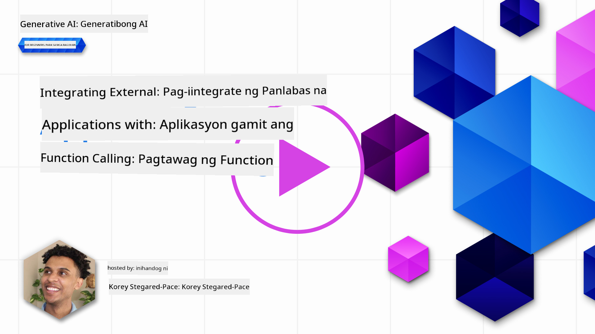
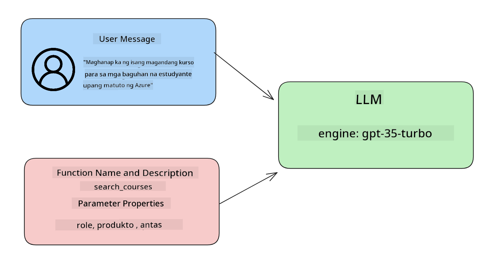

<!--
CO_OP_TRANSLATOR_METADATA:
{
  "original_hash": "77a48a201447be19aa7560706d6f93a0",
  "translation_date": "2025-05-19T21:35:01+00:00",
  "source_file": "11-integrating-with-function-calling/README.md",
  "language_code": "tl"
}
-->
# Pagsasama sa pagtawag ng function

[](https://aka.ms/gen-ai-lesson11-gh?WT.mc_id=academic-105485-koreyst)

Marami ka nang natutunan sa mga nakaraang aralin. Gayunpaman, maaari pa nating pagbutihin ito. Ilan sa mga bagay na maaari nating talakayin ay kung paano makakakuha ng mas pare-parehong format ng tugon upang mas madali itong gamitin sa mga tugon sa hinaharap. Gayundin, maaaring gusto nating magdagdag ng data mula sa ibang mga pinagmulan upang higit pang pagyamanin ang ating aplikasyon.

Ang mga nabanggit na problema ay ang tinutugunan ng kabanatang ito.

## Panimula

Saklaw ng araling ito ang:

- Ipaliwanag kung ano ang pagtawag ng function at ang mga gamit nito.
- Paglikha ng pagtawag ng function gamit ang Azure OpenAI.
- Paano isama ang pagtawag ng function sa isang aplikasyon.

## Mga Layunin sa Pagkatuto

Sa pagtatapos ng araling ito, magagawa mong:

- Ipaliwanag ang layunin ng paggamit ng pagtawag ng function.
- I-setup ang Function Call gamit ang Azure OpenAI Service.
- Magdisenyo ng epektibong pagtawag ng function para sa kaso ng paggamit ng iyong aplikasyon.

## Senaryo: Pagpapahusay ng aming chatbot gamit ang mga function

Para sa araling ito, nais naming bumuo ng tampok para sa aming startup sa edukasyon na nagpapahintulot sa mga gumagamit na gumamit ng chatbot upang maghanap ng mga teknikal na kurso. Magrerekomenda kami ng mga kurso na angkop sa kanilang antas ng kasanayan, kasalukuyang tungkulin at teknolohiya ng interes.

Upang makumpleto ang senaryong ito, gagamit kami ng kombinasyon ng:

- `Azure OpenAI` upang lumikha ng karanasan sa chat para sa gumagamit.
- `Microsoft Learn Catalog API` upang tulungan ang mga gumagamit na makahanap ng mga kurso batay sa kahilingan ng gumagamit.
- `Function Calling` upang kunin ang query ng gumagamit at ipadala ito sa isang function upang gumawa ng API request.

Upang makapagsimula, tingnan natin kung bakit nais nating gamitin ang pagtawag ng function sa unang lugar:

## Bakit Pagtawag ng Function

Bago ang pagtawag ng function, ang mga tugon mula sa isang LLM ay hindi istraktura at hindi pare-pareho. Kinakailangan ng mga developer na magsulat ng kumplikadong code sa pag-validate upang matiyak na kaya nilang hawakan ang bawat pagkakaiba-iba ng tugon. Hindi makakuha ng mga sagot ang mga gumagamit tulad ng "Ano ang kasalukuyang panahon sa Stockholm?". Ito ay dahil ang mga modelo ay limitado sa oras kung kailan sinanay ang data.

Ang Pagtawag ng Function ay isang tampok ng Azure OpenAI Service upang malampasan ang mga sumusunod na limitasyon:

- **Pare-parehong format ng tugon**. Kung mas mahusay nating makokontrol ang format ng tugon, mas madali nating maisasama ang tugon sa hinaharap sa ibang mga sistema.
- **Panlabas na data**. Kakayahang gumamit ng data mula sa ibang mga pinagmulan ng isang aplikasyon sa konteksto ng chat.

## Paglalarawan ng problema sa pamamagitan ng isang senaryo

> Inirerekumenda namin na gamitin mo ang [kasamang notebook](../../../11-integrating-with-function-calling/python/aoai-assignment.ipynb) kung nais mong patakbuhin ang senaryo sa ibaba. Maaari mo ring basahin ito habang sinusubukan naming ilarawan ang isang problema kung saan makakatulong ang mga function upang matugunan ang problema.

Tingnan natin ang halimbawa na naglalarawan sa problema ng format ng tugon:

Sabihin nating nais nating lumikha ng database ng data ng estudyante upang makapagsuggest kami ng tamang kurso sa kanila. Sa ibaba mayroon tayong dalawang paglalarawan ng mga estudyante na halos pareho sa data na kanilang nilalaman.

1. Gumawa ng koneksyon sa aming Azure OpenAI resource:

   ```python
   import os
   import json
   from openai import AzureOpenAI
   from dotenv import load_dotenv
   load_dotenv()

   client = AzureOpenAI(
   api_key=os.environ['AZURE_OPENAI_API_KEY'],  # this is also the default, it can be omitted
   api_version = "2023-07-01-preview"
   )

   deployment=os.environ['AZURE_OPENAI_DEPLOYMENT']
   ```

   Sa ibaba ay ilang Python code para sa pag-configure ng aming koneksyon sa Azure OpenAI kung saan isinet namin ang `api_type`, `api_base`, `api_version` and `api_key`.

1. Creating two student descriptions using variables `student_1_description` and `student_2_description`.

   ```python
   student_1_description="Emily Johnson is a sophomore majoring in computer science at Duke University. She has a 3.7 GPA. Emily is an active member of the university's Chess Club and Debate Team. She hopes to pursue a career in software engineering after graduating."

   student_2_description = "Michael Lee is a sophomore majoring in computer science at Stanford University. He has a 3.8 GPA. Michael is known for his programming skills and is an active member of the university's Robotics Club. He hopes to pursue a career in artificial intelligence after finishing his studies."
   ```

   Nais naming ipadala ang mga paglalarawan ng estudyante sa itaas sa isang LLM upang i-parse ang data. Ang data na ito ay maaaring gamitin sa aming aplikasyon at maipadala sa isang API o maimbak sa isang database.

1. Gumawa tayo ng dalawang magkaparehong prompt kung saan inuutusan natin ang LLM kung anong impormasyon ang interesado tayo:

   ```python
   prompt1 = f'''
   Please extract the following information from the given text and return it as a JSON object:

   name
   major
   school
   grades
   club

   This is the body of text to extract the information from:
   {student_1_description}
   '''

   prompt2 = f'''
   Please extract the following information from the given text and return it as a JSON object:

   name
   major
   school
   grades
   club

   This is the body of text to extract the information from:
   {student_2_description}
   '''
   ```

   Ang mga prompt sa itaas ay nag-uutos sa LLM na kunin ang impormasyon at ibalik ang tugon sa format na JSON.

1. Pagkatapos i-setup ang mga prompt at ang koneksyon sa Azure OpenAI, ngayon ay ipapadala natin ang mga prompt sa LLM gamit ang `openai.ChatCompletion`. We store the prompt in the `messages` variable and assign the role to `user`. Ito ay upang gayahin ang isang mensahe mula sa isang gumagamit na isinusulat sa isang chatbot.

   ```python
   # response from prompt one
   openai_response1 = client.chat.completions.create(
   model=deployment,
   messages = [{'role': 'user', 'content': prompt1}]
   )
   openai_response1.choices[0].message.content

   # response from prompt two
   openai_response2 = client.chat.completions.create(
   model=deployment,
   messages = [{'role': 'user', 'content': prompt2}]
   )
   openai_response2.choices[0].message.content
   ```

Ngayon ay maaari nating ipadala ang parehong mga kahilingan sa LLM at suriin ang tugon na natanggap natin sa pamamagitan ng paghahanap nito tulad ng `openai_response1['choices'][0]['message']['content']`.

1. Lastly, we can convert the response to JSON format by calling `json.loads`:

   ```python
   # Loading the response as a JSON object
   json_response1 = json.loads(openai_response1.choices[0].message.content)
   json_response1
   ```

   Tugon 1:

   ```json
   {
     "name": "Emily Johnson",
     "major": "computer science",
     "school": "Duke University",
     "grades": "3.7",
     "club": "Chess Club"
   }
   ```

   Tugon 2:

   ```json
   {
     "name": "Michael Lee",
     "major": "computer science",
     "school": "Stanford University",
     "grades": "3.8 GPA",
     "club": "Robotics Club"
   }
   ```

   Kahit na ang mga prompt ay pareho at ang mga paglalarawan ay magkatulad, nakikita natin ang mga halaga ng `Grades` property formatted differently, as we can sometimes get the format `3.7` or `3.7 GPA` for example.

   This result is because the LLM takes unstructured data in the form of the written prompt and returns also unstructured data. We need to have a structured format so that we know what to expect when storing or using this data

So how do we solve the formatting problem then? By using functional calling, we can make sure that we receive structured data back. When using function calling, the LLM does not actually call or run any functions. Instead, we create a structure for the LLM to follow for its responses. We then use those structured responses to know what function to run in our applications.


We can then take what is returned from the function and send this back to the LLM. The LLM will then respond using natural language to answer the user's query.

## Use Cases for using function calls

There are many different use cases where function calls can improve your app like:

- **Calling External Tools**. Chatbots are great at providing answers to questions from users. By using function calling, the chatbots can use messages from users to complete certain tasks. For example, a student can ask the chatbot to "Send an email to my instructor saying I need more assistance with this subject". This can make a function call to `send_email(to: string, body: string)`

- **Create API or Database Queries**. Users can find information using natural language that gets converted into a formatted query or API request. An example of this could be a teacher who requests "Who are the students that completed the last assignment" which could call a function named `get_completed(student_name: string, assignment: int, current_status: string)`

- **Creating Structured Data**. Users can take a block of text or CSV and use the LLM to extract important information from it. For example, a student can convert a Wikipedia article about peace agreements to create AI flashcards. This can be done by using a function called `get_important_facts(agreement_name: string, date_signed: string, parties_involved: list)`

## Creating Your First Function Call

The process of creating a function call includes 3 main steps:

1. **Calling** the Chat Completions API with a list of your functions and a user message.
2. **Reading** the model's response to perform an action i.e. execute a function or API Call.
3. **Making** another call to Chat Completions API with the response from your function to use that information to create a response to the user.



### Step 1 - creating messages

The first step is to create a user message. This can be dynamically assigned by taking the value of a text input or you can assign a value here. If this is your first time working with the Chat Completions API, we need to define the `role` and the `content` of the message.

The `role` can be either `system` (creating rules), `assistant` (the model) or `user` (the end-user). For function calling, we will assign this as `user` at isang halimbawa ng tanong.

```python
messages= [ {"role": "user", "content": "Find me a good course for a beginner student to learn Azure."} ]
```

Sa pamamagitan ng pagtatalaga ng iba't ibang mga tungkulin, malinaw na ipinapakita sa LLM kung ito ay ang sistema na nagsasabi ng isang bagay o ang gumagamit, na tumutulong sa pagbuo ng kasaysayan ng pag-uusap na maaaring pagbasehan ng LLM.

### Hakbang 2 - paggawa ng mga function

Susunod, magtatakda tayo ng isang function at ang mga parameter ng function na iyon. Gagamit tayo ng isang function dito na tinatawag na `search_courses` but you can create multiple functions.

> **Important** : Functions are included in the system message to the LLM and will be included in the amount of available tokens you have available.

Below, we create the functions as an array of items. Each item is a function and has properties `name`, `description` and `parameters`:

```python
functions = [
   {
      "name":"search_courses",
      "description":"Retrieves courses from the search index based on the parameters provided",
      "parameters":{
         "type":"object",
         "properties":{
            "role":{
               "type":"string",
               "description":"The role of the learner (i.e. developer, data scientist, student, etc.)"
            },
            "product":{
               "type":"string",
               "description":"The product that the lesson is covering (i.e. Azure, Power BI, etc.)"
            },
            "level":{
               "type":"string",
               "description":"The level of experience the learner has prior to taking the course (i.e. beginner, intermediate, advanced)"
            }
         },
         "required":[
            "role"
         ]
      }
   }
]
```

Ilarawan natin ang bawat instance ng function nang mas detalyado sa ibaba:

- `name` - The name of the function that we want to have called.
- `description` - This is the description of how the function works. Here it's important to be specific and clear.
- `parameters` - A list of values and format that you want the model to produce in its response. The parameters array consists of items where the items have the following properties:
  1.  `type` - The data type of the properties will be stored in.
  1.  `properties` - List of the specific values that the model will use for its response
      1. `name` - The key is the name of the property that the model will use in its formatted response, for example, `product`.
      1. `type` - The data type of this property, for example, `string`.
      1. `description` - Description of the specific property.

There's also an optional property `required` - required property for the function call to be completed.

### Step 3 - Making the function call

After defining a function, we now need to include it in the call to the Chat Completion API. We do this by adding `functions` to the request. In this case `functions=functions`.

There is also an option to set `function_call` to `auto`. This means we will let the LLM decide which function should be called based on the user message rather than assigning it ourselves.

Here's some code below where we call `ChatCompletion.create`, note how we set `functions=functions` and `function_call="auto"` at sa gayon ay nagbibigay sa LLM ng pagpipilian kung kailan tatawagin ang mga function na ibinibigay namin:

```python
response = client.chat.completions.create(model=deployment,
                                        messages=messages,
                                        functions=functions,
                                        function_call="auto")

print(response.choices[0].message)
```

Ang tugon na bumabalik ngayon ay ganito ang hitsura:

```json
{
  "role": "assistant",
  "function_call": {
    "name": "search_courses",
    "arguments": "{\n  \"role\": \"student\",\n  \"product\": \"Azure\",\n  \"level\": \"beginner\"\n}"
  }
}
```

Dito makikita natin kung paano ang function na `search_courses` was called and with what arguments, as listed in the `arguments` property in the JSON response.

The conclusion the LLM was able to find the data to fit the arguments of the function as it was extracting it from the value provided to the `messages` parameter in the chat completion call. Below is a reminder of the `messages` na halaga:

```python
messages= [ {"role": "user", "content": "Find me a good course for a beginner student to learn Azure."} ]
```

Tulad ng nakikita mo, `student`, `Azure` and `beginner` was extracted from `messages` and set as input to the function. Using functions this way is a great way to extract information from a prompt but also to provide structure to the LLM and have reusable functionality.

Next, we need to see how we can use this in our app.

## Integrating Function Calls into an Application

After we have tested the formatted response from the LLM, we can now integrate this into an application.

### Managing the flow

To integrate this into our application, let's take the following steps:

1. First, let's make the call to the OpenAI services and store the message in a variable called `response_message`.

   ```python
   response_message = response.choices[0].message
   ```

1. Ngayon ay itatakda natin ang function na tatawag sa Microsoft Learn API upang makakuha ng listahan ng mga kurso:

   ```python
   import requests

   def search_courses(role, product, level):
     url = "https://learn.microsoft.com/api/catalog/"
     params = {
        "role": role,
        "product": product,
        "level": level
     }
     response = requests.get(url, params=params)
     modules = response.json()["modules"]
     results = []
     for module in modules[:5]:
        title = module["title"]
        url = module["url"]
        results.append({"title": title, "url": url})
     return str(results)
   ```

   Pansinin kung paano tayo ngayon ay lumikha ng isang aktwal na Python function na tumutugma sa mga pangalan ng function na ipinakilala sa `functions` variable. We're also making real external API calls to fetch the data we need. In this case, we go against the Microsoft Learn API to search for training modules.

Ok, so we created `functions` variables and a corresponding Python function, how do we tell the LLM how to map these two together so our Python function is called?

1. To see if we need to call a Python function, we need to look into the LLM response and see if `function_call` ay bahagi nito at tawagin ang itinuro na function. Narito kung paano mo magagawa ang nabanggit na pagsusuri sa ibaba:

   ```python
   # Check if the model wants to call a function
   if response_message.function_call.name:
    print("Recommended Function call:")
    print(response_message.function_call.name)
    print()

    # Call the function.
    function_name = response_message.function_call.name

    available_functions = {
            "search_courses": search_courses,
    }
    function_to_call = available_functions[function_name]

    function_args = json.loads(response_message.function_call.arguments)
    function_response = function_to_call(**function_args)

    print("Output of function call:")
    print(function_response)
    print(type(function_response))


    # Add the assistant response and function response to the messages
    messages.append( # adding assistant response to messages
        {
            "role": response_message.role,
            "function_call": {
                "name": function_name,
                "arguments": response_message.function_call.arguments,
            },
            "content": None
        }
    )
    messages.append( # adding function response to messages
        {
            "role": "function",
            "name": function_name,
            "content":function_response,
        }
    )
   ```

   Ang tatlong linya na ito, tiyakin na kunin natin ang pangalan ng function, ang mga argumento at gawin ang tawag:

   ```python
   function_to_call = available_functions[function_name]

   function_args = json.loads(response_message.function_call.arguments)
   function_response = function_to_call(**function_args)
   ```

   Sa ibaba ay ang output mula sa pagpapatakbo ng aming code:

   **Output**

   ```Recommended Function call:
   {
     "name": "search_courses",
     "arguments": "{\n  \"role\": \"student\",\n  \"product\": \"Azure\",\n  \"level\": \"beginner\"\n}"
   }

   Output of function call:
   [{'title': 'Describe concepts of cryptography', 'url': 'https://learn.microsoft.com/training/modules/describe-concepts-of-cryptography/?
   WT.mc_id=api_CatalogApi'}, {'title': 'Introduction to audio classification with TensorFlow', 'url': 'https://learn.microsoft.com/en-
   us/training/modules/intro-audio-classification-tensorflow/?WT.mc_id=api_CatalogApi'}, {'title': 'Design a Performant Data Model in Azure SQL
   Database with Azure Data Studio', 'url': 'https://learn.microsoft.com/training/modules/design-a-data-model-with-ads/?
   WT.mc_id=api_CatalogApi'}, {'title': 'Getting started with the Microsoft Cloud Adoption Framework for Azure', 'url':
   'https://learn.microsoft.com/training/modules/cloud-adoption-framework-getting-started/?WT.mc_id=api_CatalogApi'}, {'title': 'Set up the
   Rust development environment', 'url': 'https://learn.microsoft.com/training/modules/rust-set-up-environment/?WT.mc_id=api_CatalogApi'}]
   <class 'str'>
   ```

1. Ngayon ay ipapadala natin ang na-update na mensahe, `messages` sa LLM upang makakuha tayo ng tugon sa natural na wika sa halip na tugon na API JSON formatted.

   ```python
   print("Messages in next request:")
   print(messages)
   print()

   second_response = client.chat.completions.create(
      messages=messages,
      model=deployment,
      function_call="auto",
      functions=functions,
      temperature=0
         )  # get a new response from GPT where it can see the function response


   print(second_response.choices[0].message)
   ```

   **Output**

   ```python
   {
     "role": "assistant",
     "content": "I found some good courses for beginner students to learn Azure:\n\n1. [Describe concepts of cryptography] (https://learn.microsoft.com/training/modules/describe-concepts-of-cryptography/?WT.mc_id=api_CatalogApi)\n2. [Introduction to audio classification with TensorFlow](https://learn.microsoft.com/training/modules/intro-audio-classification-tensorflow/?WT.mc_id=api_CatalogApi)\n3. [Design a Performant Data Model in Azure SQL Database with Azure Data Studio](https://learn.microsoft.com/training/modules/design-a-data-model-with-ads/?WT.mc_id=api_CatalogApi)\n4. [Getting started with the Microsoft Cloud Adoption Framework for Azure](https://learn.microsoft.com/training/modules/cloud-adoption-framework-getting-started/?WT.mc_id=api_CatalogApi)\n5. [Set up the Rust development environment](https://learn.microsoft.com/training/modules/rust-set-up-environment/?WT.mc_id=api_CatalogApi)\n\nYou can click on the links to access the courses."
   }

   ```

## Takdang-Aralin

Upang ipagpatuloy ang iyong pag-aaral ng Azure OpenAI Function Calling maaari kang bumuo ng:

- Higit pang mga parameter ng function na maaaring makatulong sa mga nag-aaral na makahanap ng mas maraming kurso.
- Gumawa ng isa pang pagtawag ng function na kumukuha ng mas maraming impormasyon mula sa nag-aaral tulad ng kanilang katutubong wika.
- Gumawa ng paghawak ng error kapag ang pagtawag ng function at/o pagtawag ng API ay hindi nagbalik ng anumang angkop na kurso.

Pahiwatig: Sundan ang [Learn API reference documentation](https://learn.microsoft.com/training/support/catalog-api-developer-reference?WT.mc_id=academic-105485-koreyst) na pahina upang makita kung paano at saan magagamit ang data na ito.

## Mahusay na Trabaho! Ipagpatuloy ang Paglalakbay

Pagkatapos makumpleto ang araling ito, tingnan ang aming [Generative AI Learning collection](https://aka.ms/genai-collection?WT.mc_id=academic-105485-koreyst) upang ipagpatuloy ang pag-level up ng iyong kaalaman sa Generative AI!

Pumunta sa Aralin 12, kung saan titingnan natin kung paano [disenyo ng UX para sa AI applications](../12-designing-ux-for-ai-applications/README.md?WT.mc_id=academic-105485-koreyst)!

**Paunawa**:  
Ang dokumentong ito ay isinalin gamit ang AI translation service [Co-op Translator](https://github.com/Azure/co-op-translator). Habang nagsusumikap kami para sa kawastuhan, mangyaring tandaan na ang mga awtomatikong pagsasalin ay maaaring maglaman ng mga pagkakamali o hindi pagkakatumpak. Ang orihinal na dokumento sa kanyang katutubong wika ay dapat ituring na mapagkakatiwalaang pinagmulan. Para sa mahahalagang impormasyon, inirerekomenda ang propesyonal na pagsasalin ng tao. Hindi kami mananagot para sa anumang hindi pagkakaintindihan o maling interpretasyon na nagmumula sa paggamit ng pagsasaling ito.