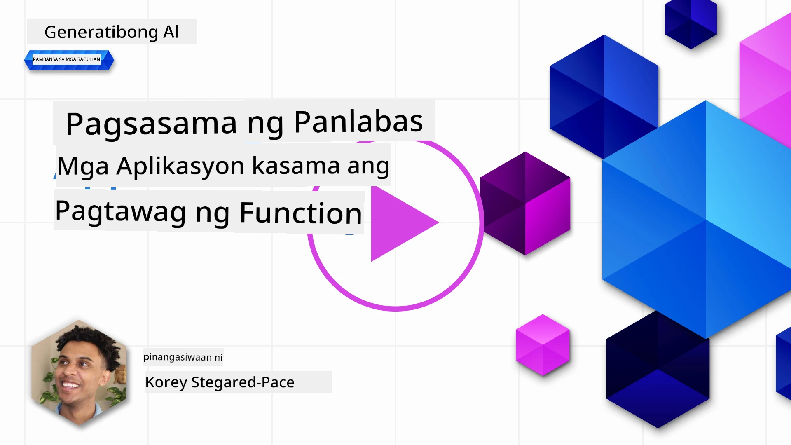
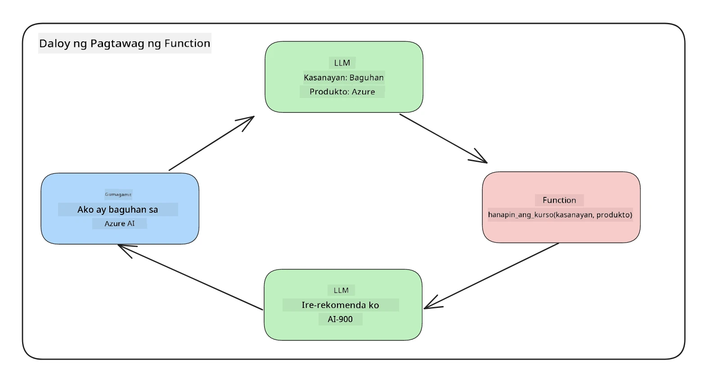
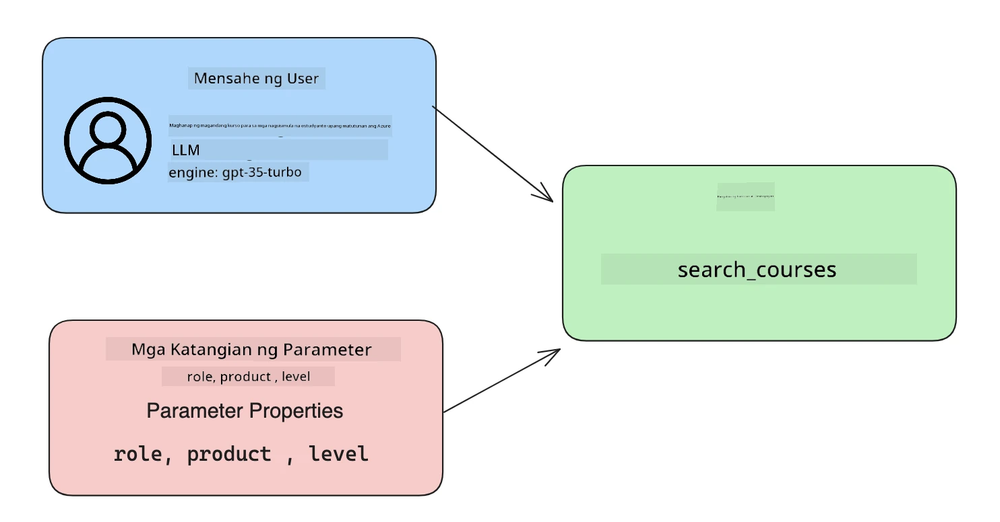

# Pagsasama sa pagtawag ng function

[](https://youtu.be/DgUdCLX8qYQ?si=f1ouQU5HQx6F8Gl2)

Marami ka nang natutunan sa mga naunang aralin. Gayunpaman, maaari pa natin itong pagbutihin. Ang ilan sa mga bagay na maaari nating tugunan ay kung paano tayo makakakuha ng mas pare-parehong format ng tugon upang mas madali itong gamitin sa susunod na proseso. Gayundin, maaaring nais nating magdagdag ng datos mula sa ibang mga pinagmulan upang higit pang pagyamanin ang ating aplikasyon.

Ang mga nabanggit na problema ang nais tugunan ng kabanatang ito.

## Panimula

Tatalakayin sa araling ito ang:

- Ipaliwanag kung ano ang function calling at ang mga gamit nito.
- Paggawa ng function call gamit ang Azure OpenAI.
- Paano isasama ang function call sa isang aplikasyon.

## Mga Layunin sa Pagkatuto

Sa pagtatapos ng araling ito, kaya mong:

- Ipaliwanag ang layunin sa paggamit ng function calling.
- I-set up ang Function Call gamit ang Azure OpenAI Service.
- Magdisenyo ng epektibong function calls para sa gamit ng iyong aplikasyon.

## Senaryo: Pagpapabuti ng aming chatbot gamit ang mga function

Para sa araling ito, nais nating bumuo ng tampok para sa aming edukasyong startup na nagbibigay-daan sa mga user na gamitin ang chatbot upang maghanap ng mga kurso sa teknikal. Rerekomenda namin ang mga kurso na angkop sa kanilang antas ng kakayahan, kasalukuyang posisyon, at teknolohiyang interesado sila.

Para makumpleto ang senaryong ito, gagamit tayo ng kombinasyon ng:

- `Azure OpenAI` upang lumikha ng chat experience para sa user.
- `Microsoft Learn Catalog API` upang tulungan ang mga user na maghanap ng mga kurso base sa kahilingan ng user.
- `Function Calling` upang kunin ang query ng user at ipadala ito sa isang function upang gawin ang kahilingan sa API.

Para makapagsimula, tingnan muna natin kung bakit natin gusto gamitin ang function calling:

## Bakit Function Calling

Bago ang function calling, ang mga tugon mula sa LLM ay hindi nakaayos at hindi pare-pareho. Kinakailangan ng mga developer na magsulat ng komplikadong validation code upang matiyak na kaya nilang hawakan ang bawat iba't ibang anyo ng tugon. Hindi makakuha ang mga user ng mga sagot tulad ng "Ano ang kasalukuyang panahon sa Stockholm?". Ito ay dahil limitado ang mga modelo sa oras kung kailan sinanay ang datos.

Ang Function Calling ay isang tampok ng Azure OpenAI Service upang malampasan ang mga sumusunod na limitasyon:

- **Pare-parehong format ng tugon**. Kung kaya nating kontrolin nang mas mabuti ang format ng tugon, mas madali nating maisasama ito sa ibang sistema.
- **Panlabas na datos**. Kakayahang gumamit ng datos mula sa ibang pinagmulan ng aplikasyon sa konteksto ng chat.

## Pagpapakita ng problema sa pamamagitan ng senaryo

> Inirerekomenda namin na gamitin mo ang [kasamang notebook](./python/aoai-assignment.ipynb?WT.mc_id=academic-105485-koreyst) kung gusto mong isagawa ang senaryong nasa ibaba. Maaari ka ring magbasa lang habang sinusubukan naming ipakita ang isang problema kung saan makakatulong ang mga function upang lutasin ito.

Tingnan natin ang halimbawa na nagpapakita ng problema sa format ng tugon:

Sabihin nating nais nating gumawa ng isang database ng datos ng estudyante upang makapagmungkahi tayo ng tamang kurso sa kanila. Sa ibaba, may dalawang paglalarawan ng mga estudyante na halos magkapareho ang mga datos na nilalaman.

1. Gumawa ng koneksyon sa aming Azure OpenAI resource:

   ```python
   import os
   import json
   from openai import OpenAI
   from dotenv import load_dotenv
   load_dotenv()

   # Ang Responses API ay pinagsisilbihan mula sa Azure OpenAI (Microsoft Foundry) v1
   # endpoint, kaya tinuturo namin ang OpenAI client sa <your-endpoint>/openai/v1/.
   endpoint = os.environ['AZURE_OPENAI_ENDPOINT']
   client = OpenAI(
   api_key=os.environ['AZURE_OPENAI_API_KEY'],
   base_url=f"{endpoint.rstrip('/')}/openai/v1/",
   )

   deployment=os.environ['AZURE_OPENAI_DEPLOYMENT']
   ```

   Nasa ibaba ang ilang Python code para i-configure ang aming koneksyon sa Azure OpenAI. Dahil ginagamit namin ang v1 endpoint, kailangan lamang namin itakda ang `api_key` at `base_url` (hindi na kailangan ang `api_version`).

1. Gumawa ng dalawang paglalarawan ng estudyante gamit ang mga variable na `student_1_description` at `student_2_description`.

   ```python
   student_1_description="Emily Johnson is a sophomore majoring in computer science at Duke University. She has a 3.7 GPA. Emily is an active member of the university's Chess Club and Debate Team. She hopes to pursue a career in software engineering after graduating."

   student_2_description = "Michael Lee is a sophomore majoring in computer science at Stanford University. He has a 3.8 GPA. Michael is known for his programming skills and is an active member of the university's Robotics Club. He hopes to pursue a career in artificial intelligence after finishing his studies."
   ```

   Nais nating ipadala ang mga paglalarawan ng estudyante sa itaas sa isang LLM upang i-parse ang datos. Maaari itong magamit sa aming aplikasyon at ipadala sa isang API o iimbak sa database.

1. Gumawa tayo ng dalawang magkaparehong prompt kung saan ituturo natin sa LLM kung anong impormasyon ang gusto nating makuha:

   ```python
   prompt1 = f'''
   Please extract the following information from the given text and return it as a JSON object:

   name
   major
   school
   grades
   club

   This is the body of text to extract the information from:
   {student_1_description}
   '''

   prompt2 = f'''
   Please extract the following information from the given text and return it as a JSON object:

   name
   major
   school
   grades
   club

   This is the body of text to extract the information from:
   {student_2_description}
   '''
   ```

   Inaatasan ng mga prompt sa itaas ang LLM na kunin ang impormasyon at ibalik ang tugon sa format na JSON.

1. Pagkatapos i-setup ang mga prompt at ang koneksyon sa Azure OpenAI, ipapadala natin ang mga prompt sa LLM gamit ang `client.responses.create`. Iniimbak natin ang prompt sa `input` variable at ina-assign ang role bilang `user`. Ginagawa ito upang gayahin ang mensahe mula sa user na isinulat sa chatbot.

   ```python
   # tugon mula sa unang prompt
   openai_response1 = client.responses.create(
   model=deployment,
   input = [{'role': 'user', 'content': prompt1}],
   store=False,
   )
   openai_response1.output_text

   # tugon mula sa pangalawang prompt
   openai_response2 = client.responses.create(
   model=deployment,
   input = [{'role': 'user', 'content': prompt2}],
   store=False,
   )
   openai_response2.output_text
   ```

Ngayon ay maaari nating ipadala ang parehong request sa LLM at suriin ang natanggap na tugon sa ganitong paraan `openai_response1.output_text`.

1. Sa wakas, maaari nating i-convert ang tugon sa JSON format gamit ang pagtawag ng `json.loads`:

   ```python
   # Ikinakarga ang tugon bilang isang JSON na bagay
   json_response1 = json.loads(openai_response1.output_text)
   json_response1
   ```

   Tugon 1:

   ```json
   {
     "name": "Emily Johnson",
     "major": "computer science",
     "school": "Duke University",
     "grades": "3.7",
     "club": "Chess Club"
   }
   ```

   Tugon 2:

   ```json
   {
     "name": "Michael Lee",
     "major": "computer science",
     "school": "Stanford University",
     "grades": "3.8 GPA",
     "club": "Robotics Club"
   }
   ```

   Kahit na pareho ang mga prompt at halos kapareho ang mga paglalarawan, nakikita natin na iba ang pagkaka-format ng mga halaga ng `Grades` property, kung minsan ay format na `3.7` o `3.7 GPA` halimbawa.

   Ang resulta nito ay dahil kumukuha ang LLM ng hindi nakaayos na datos mula sa anyo ng nakasulat na prompt at nagbabalik din ng hindi nakaayos na datos. Kailangan nating magkaroon ng nakaayos na format upang malaman natin kung ano ang aasahan kapag iniimbak o ginamit ang datos na ito.

Paano natin malulutas ang problema sa pag-format? Sa pamamagitan ng paggamit ng function calling, makatitiyak tayo na makakatanggap tayo ng nakaayos na datos pabalik. Kapag gumagamit ng function calling, hindi talaga tinatawag o pinaandar ng LLM ang anumang mga function. Sa halip, gumagawa tayo ng istrakturang sinusundan ng LLM para sa mga tugon nito. Pagkatapos ay ginagamit natin ang mga nakaayos na tugong iyon upang malaman kung aling function ang dapat patakbuhin sa ating mga aplikasyon.



Maaari nating kunin ang output mula sa function at ipadala ito pabalik sa LLM. Ang LLM ay tutugon gamit ang natural na wika upang sagutin ang query ng user.

## Mga Gamit ng function calls

Maraming iba't ibang gamit kung saan makakapagpabuti ang function calls sa iyong app gaya ng:

- **Pagtawag sa Panlabas na Tools**. Mahusay ang mga chatbot sa pagbibigay sagot sa mga tanong mula sa user. Sa paggamit ng function calling, maaaring gamitin ng mga chatbot ang mga mensahe mula sa user upang tapusin ang ilang mga gawain. Halimbawa, maaaring hilingin ng isang estudyante sa chatbot na "Magpadala ng email sa aking instruktor na nagsasabing kailangan ko pa ng karagdagang tulong sa asignaturang ito". Maaari itong gumawa ng function call sa `send_email(to: string, body: string)`

- **Gumawa ng API o Database Queries**. Maaaring maghanap ang mga user ng impormasyon gamit ang natural na wika na binabago sa isang naka-format na query o kahilingan sa API. Halimbawa nito ay ang guro na nagtanong ng "Sino ang mga estudyanteng nakatapos ng huling assignment" na maaaring tumawag sa function na `get_completed(student_name: string, assignment: int, current_status: string)`

- **Paggawa ng Nakaayos na Datos**. Maaaring kumuha ang mga user ng isang teksto o CSV at gamitin ang LLM upang kunin ang mahahalagang impormasyon mula dito. Halimbawa, maaaring gumawa ang estudyante ng flashcards mula sa isang Wikipedia article tungkol sa peace agreements. Magagawa ito gamit ang function na `get_important_facts(agreement_name: string, date_signed: string, parties_involved: list)`

## Paggawa ng Iyong Unang Function Call

Ang proseso ng paggawa ng function call ay may 3 pangunahing hakbang:

1. **Pagtawag** sa Responses API gamit ang listahan ng iyong mga function (tools) at mensahe ng user.
2. **Pagbabasa** ng tugon ng modelo upang magsagawa ng aksyon katulad ng pagpapatakbo ng isang function o API Call.
3. **Paggawa** ng isa pang tawag sa Responses API gamit ang tugon mula sa iyong function upang gamitin ang impormasyong iyon sa paggawa ng tugon para sa user.



### Hakbang 1 - paggawa ng mga mensahe

Ang unang hakbang ay gumawa ng mensahe para sa user. Maaari itong ibigay nang dinamiko sa pamamagitan ng pagkuha ng halaga mula sa input na teksto o maaari kang magbigay dito ng halaga. Kung ito ang unang pagkakataon mong gamitin ang Responses API, kailangan nating tukuyin ang `role` at ang `content` ng mensahe.

Ang `role` ay maaaring `system` (gumagawa ng mga patakaran), `assistant` (ang modelo) o `user` (ang end-user). Para sa function calling, itatalaga natin ito bilang `user` kasama ang halimbawa ng tanong.

```python
messages= [ {"role": "user", "content": "Find me a good course for a beginner student to learn Azure."} ]
```

Sa pamamagitan ng pagtatalaga ng iba't ibang roles, nagiging malinaw sa LLM kung ang sistema ba ang nagsasalita o ang user, na tumutulong upang makabuo ng history ng usapan na mapagtatagumpayan ng LLM.

### Hakbang 2 - paggawa ng mga function

Susunod, tutukuyin natin ang isang function at ang mga parameter nito. Isang function lang ang gagamitin dito na tinatawag na `search_courses` pero maaari kang gumawa ng maraming function.

> **Mahalaga** : Ang mga function ay isinasama sa system message sa LLM at kabilang ito sa bilang ng mga token na mayroon ka.

Sa ibaba, ginagawa natin ang mga function bilang isang array ng mga item. Bawat item ay isang tool sa flat Responses API format, na may mga katangiang `type`, `name`, `description` at `parameters`:

```python
functions = [
   {
      "type":"function",
      "name":"search_courses",
      "description":"Retrieves courses from the search index based on the parameters provided",
      "parameters":{
         "type":"object",
         "properties":{
            "role":{
               "type":"string",
               "description":"The role of the learner (i.e. developer, data scientist, student, etc.)"
            },
            "product":{
               "type":"string",
               "description":"The product that the lesson is covering (i.e. Azure, Power BI, etc.)"
            },
            "level":{
               "type":"string",
               "description":"The level of experience the learner has prior to taking the course (i.e. beginner, intermediate, advanced)"
            }
         },
         "required":[
            "role"
         ]
      }
   }
]
```

Ilalarawan natin nang mas detalyado ang bawat instance ng function sa ibaba:

- `name` - Ang pangalan ng function na nais nating tawagin.
- `description` - Ito ang paglalarawan kung paano gumagana ang function. Mahalaga dito na maging tiyak at malinaw.
- `parameters` - Isang listahan ng mga halaga at format na nais mong ipagawa ng modelo sa tugon nito. Binubuo ang parameters array ng mga item na may mga sumusunod na katangian:
  1.  `type` - Ang uri ng datos ng mga property na itatago.
  1.  `properties` - Listahan ng mga espesipikong halaga na gagamitin ng modelo sa tugon nito
      1. `name` - Ang susi ay ang pangalan ng property na gagamitin ng modelo sa naka-format na tugon, halimbawa, `product`.
      1. `type` - Uri ng dato ng property na ito, halimbawa, `string`.
      1. `description` - Paglalarawan ng espesipikong property.

Mayroon ding opsyonal na property na `required` - kinakailangang property upang makumpleto ang pagtawag ng function.

### Hakbang 3 - Paggawa ng function call

Pagkatapos magtukoy ng function, kailangan na natin itong isama sa tawag sa Responses API. Ginagawa ito sa pamamagitan ng pagdagdag ng `tools` sa request. Sa kasong ito, `tools=functions`.

May opsyon din na itakda ang `tool_choice` sa `auto`. Ibig sabihin nito ay hahayaan natin ang LLM ang pumili kung aling function ang tatawagin base sa mensahe ng user kaysa sa ating pagtatalaga.

Narito ang code sa ibaba kung saan tinatawag natin ang `client.responses.create`, pansinin kung paano natin itinakda ang `tools=functions` at `tool_choice="auto"` kaya ang LLM ang nagdedesisyon kung kailan tatawagin ang mga ibinigay nating function:

```python
response = client.responses.create(model=deployment,
                                        input=messages,
                                        tools=functions,
                                        tool_choice="auto",
                                        store=False)

print(response.output)
```

Kasama na sa tugon ang item na `function_call` sa `response.output` na ganito ang hitsura:

```json
{
  "type": "function_call",
  "name": "search_courses",
  "call_id": "call_abc123",
  "arguments": "{\n  \"role\": \"student\",\n  \"product\": \"Azure\",\n  \"level\": \"beginner\"\n}"
}
```

Dito makikita natin kung paano tinawag ang function na `search_courses` at kung ano ang mga argumento nito, na nakalista sa property na `arguments` sa JSON na tugon.

Ang konklusyon ay nagawang hanapin ng LLM ang datos na angkop sa mga argumento ng function sa pamamagitan ng pagkuha nito mula sa halaga na ibinigay sa `input` parameter sa tawag sa Responses API. Narito ang paalala ng `messages` na halaga:

```python
messages= [ {"role": "user", "content": "Find me a good course for a beginner student to learn Azure."} ]
```

Tulad ng makikita mo, ang `student`, `Azure` at `beginner` ay na-extract mula sa `messages` at naitakda bilang input sa function. Ang paggamit ng functions sa ganitong paraan ay mahusay upang kumuha ng impormasyon mula sa prompt at magbigay din ng istruktura sa LLM at magkaroon ng muling magagamit na functionality.

Susunod, kailangan nating tingnan kung paano natin magagamit ito sa ating app.

## Pagsasama ng Function Calls sa isang Aplikasyon

Matapos nating subukan ang na-format na tugon mula sa LLM, maaari na natin itong isama sa isang aplikasyon.

### Pamamahala ng daloy

Para maisama ito sa ating aplikasyon, sundan natin ang mga sumusunod na hakbang:

1. Una, gawin ang tawag sa OpenAI services at kunin ang function call items mula sa tugon `output`.

   ```python
   response_items = response.output
   tool_calls = [item for item in response_items if item.type == "function_call"]
   ```

1. Ngayon ay tutukuyin natin ang function na tatawag sa Microsoft Learn API upang makakuha ng listahan ng mga kurso:

   ```python
   import requests

   def search_courses(role, product, level):
     url = "https://learn.microsoft.com/api/catalog/"
     params = {
        "role": role,
        "product": product,
        "level": level
     }
     response = requests.get(url, params=params)
     modules = response.json()["modules"]
     results = []
     for module in modules[:5]:
        title = module["title"]
        url = module["url"]
        results.append({"title": title, "url": url})
     return str(results)
   ```

   Pansinin kung paano natin ngayon ginagawa ang isang totoong Python function na tumutugma sa mga pangalan ng function na ipinakilala sa variable na `functions`. Gumagawa rin tayo ng totoong panlabas na tawag sa API upang makuha ang kinakailangang datos. Sa kasong ito, nakikipag-ugnayan tayo sa Microsoft Learn API upang maghanap ng mga training modules.

Sige, kaya nga gumawa tayo ng mga variable na `functions` at isang katugmang Python function, paano natin sasabihin sa LLM kung paano i-map ang dalawa upang matawagan ang ating Python function?

1. Upang makita kung kailangang tawagan ang isang Python function, tingnan natin ang tugon ng LLM at suriin kung bahagi nito ang `function_call` item at tawagan ang tinukoy na function. Narito kung paano gawin ang pagsusuri sa ibaba:

   ```python
   # Suriin kung nais ng modelo na tumawag ng isang function
   if tool_calls:
    for tool_call in tool_calls:
     print("Recommended Function call:")
     print(tool_call.name)
     print()

     # Tawagin ang function.
     function_name = tool_call.name

     available_functions = {
             "search_courses": search_courses,
     }
     function_to_call = available_functions[function_name]

     function_args = json.loads(tool_call.arguments)
     function_response = function_to_call(**function_args)

     print("Output of function call:")
     print(function_response)
     print(type(function_response))

     # Idagdag ang pagtawag ng function at ang resulta nito pabalik sa pag-uusap.
     # Ang function_call item ng modelo ay dapat idugtong bago ang output nito.
     messages.append(tool_call)  # ang function_call item ng assistant
     messages.append( # ang resulta ng function
         {
             "type": "function_call_output",
             "call_id": tool_call.call_id,
             "output": function_response,
         }
     )
   ```

   Tinitiyak ng tatlong linyang ito na makukuha natin ang pangalan ng function, ang mga argumento at ginagawa ang tawag:

   ```python
   function_to_call = available_functions[function_name]

   function_args = json.loads(tool_call.arguments)
   function_response = function_to_call(**function_args)
   ```

   Narito ang output mula sa pagpapatakbo ng ating code:

   **Output**

   ```Recommended Function call:
   {
     "name": "search_courses",
     "arguments": "{\n  \"role\": \"student\",\n  \"product\": \"Azure\",\n  \"level\": \"beginner\"\n}"
   }

   Output of function call:
   [{'title': 'Describe concepts of cryptography', 'url': 'https://learn.microsoft.com/training/modules/describe-concepts-of-cryptography/?
   WT.mc_id=api_CatalogApi'}, {'title': 'Introduction to audio classification with TensorFlow', 'url': 'https://learn.microsoft.com/en-
   us/training/modules/intro-audio-classification-tensorflow/?WT.mc_id=api_CatalogApi'}, {'title': 'Design a Performant Data Model in Azure SQL
   Database with Azure Data Studio', 'url': 'https://learn.microsoft.com/training/modules/design-a-data-model-with-ads/?
   WT.mc_id=api_CatalogApi'}, {'title': 'Getting started with the Microsoft Cloud Adoption Framework for Azure', 'url':
   'https://learn.microsoft.com/training/modules/cloud-adoption-framework-getting-started/?WT.mc_id=api_CatalogApi'}, {'title': 'Set up the
   Rust development environment', 'url': 'https://learn.microsoft.com/training/modules/rust-set-up-environment/?WT.mc_id=api_CatalogApi'}]
   <class 'str'>
   ```

1. Ngayon ay ipapadala natin ang na-update na mensahe, `messages` sa LLM upang makatanggap tayo ng tugon gamit ang natural na wika sa halip na naka-format na JSON mula sa API.

   ```python
   print("Messages in next request:")
   print(messages)
   print()

   second_response = client.responses.create(
      input=messages,
      model=deployment,
      tool_choice="auto",
      tools=functions,
      temperature=0,
      store=False,
         )  # kumuha ng bagong tugon mula sa modelo kung saan makikita nito ang tugon ng function


   print(second_response.output_text)
   ```

   **Output**

   ```text
   I found some good courses for beginner students to learn Azure:

   1. [Describe concepts of cryptography](https://learn.microsoft.com/training/modules/describe-concepts-of-cryptography/?WT.mc_id=api_CatalogApi)
   2. [Introduction to audio classification with TensorFlow](https://learn.microsoft.com/training/modules/intro-audio-classification-tensorflow/?WT.mc_id=api_CatalogApi)
   3. [Design a Performant Data Model in Azure SQL Database with Azure Data Studio](https://learn.microsoft.com/training/modules/design-a-data-model-with-ads/?WT.mc_id=api_CatalogApi)
   4. [Getting started with the Microsoft Cloud Adoption Framework for Azure](https://learn.microsoft.com/training/modules/cloud-adoption-framework-getting-started/?WT.mc_id=api_CatalogApi)
   5. [Set up the Rust development environment](https://learn.microsoft.com/training/modules/rust-set-up-environment/?WT.mc_id=api_CatalogApi)

   You can click on the links to access the courses.
   ```

## Takdang Aralin

Upang ipagpatuloy ang iyong pagkatuto sa Azure OpenAI Function Calling maaari kang bumuo ng:

- Mas marami pang mga parameter ng function na maaaring makatulong sa mga learners na makahanap pa ng maraming kurso.

- Gumawa ng isa pang tawag sa function na kumukuha ng mas maraming impormasyon mula sa mag-aaral tulad ng kanilang katutubong wika
- Gumawa ng paghawak sa error kapag ang tawag sa function at/o tawag sa API ay hindi nagbalik ng angkop na mga kurso

Hint: Sundin ang [Learn API reference documentation](https://learn.microsoft.com/training/support/catalog-api-developer-reference?WT.mc_id=academic-105485-koreyst) na pahina upang makita kung paano at saan available ang datos na ito.

## Mahusay na Gawain! Ipagpatuloy ang Paglalakbay

Pagkatapos matapos ang leksyon na ito, tingnan ang aming [Generative AI Learning collection](https://aka.ms/genai-collection?WT.mc_id=academic-105485-koreyst) upang ipagpatuloy ang pagpapalawak ng iyong kaalaman sa Generative AI!

Pumunta sa Lesson 12, kung saan tatalakayin natin kung paano [magdisenyo ng UX para sa mga AI application](../12-designing-ux-for-ai-applications/README.md?WT.mc_id=academic-105485-koreyst)!

---

<!-- CO-OP TRANSLATOR DISCLAIMER START -->
**Pagtatanggi**:
Ang dokumentong ito ay isinalin gamit ang serbisyo ng AI translation na [Co-op Translator](https://github.com/Azure/co-op-translator). Bagama't nagsusumikap kami para sa katumpakan, pakatandaan na ang awtomatikong pagsasalin ay maaaring maglaman ng mga pagkakamali o hindi pagkakatugma. Ang orihinal na dokumento sa orihinal nitong wika ang dapat ituring na pangunahing sanggunian. Para sa mahahalagang impormasyon, inirerekomenda ang propesyonal na pagsasalin ng tao. Hindi kami mananagot sa anumang maling pagkakaintindi o maling interpretasyon na nagmula sa paggamit ng pagsasaling ito.
<!-- CO-OP TRANSLATOR DISCLAIMER END -->