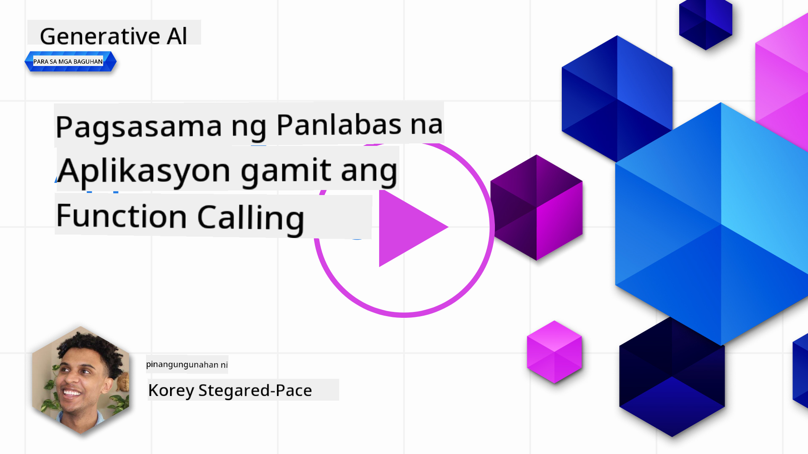
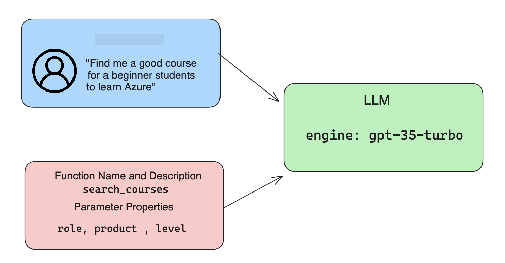

<!--
CO_OP_TRANSLATOR_METADATA:
{
  "original_hash": "f6f84f9ef2d066cd25850cab93580a50",
  "translation_date": "2025-10-17T13:17:31+00:00",
  "source_file": "11-integrating-with-function-calling/README.md",
  "language_code": "tl"
}
-->
# Pagsasama ng function calling

[](https://youtu.be/DgUdCLX8qYQ?si=f1ouQU5HQx6F8Gl2)

Marami ka nang natutunan sa mga nakaraang aralin. Gayunpaman, maaari pa nating pagbutihin ito. Ilan sa mga bagay na maaari nating tugunan ay kung paano makakakuha ng mas pare-parehong format ng sagot upang mas madali itong magamit sa mga susunod na proseso. Bukod dito, maaaring gusto nating magdagdag ng data mula sa ibang mga mapagkukunan upang mas mapagyaman ang ating aplikasyon.

Ang mga nabanggit na problema ang tinutugunan ng kabanatang ito.

## Panimula

Saklaw ng araling ito ang:

- Ipaliwanag kung ano ang function calling at ang mga gamit nito.
- Gumawa ng function call gamit ang Azure OpenAI.
- Paano isama ang function call sa isang aplikasyon.

## Mga Layunin sa Pag-aaral

Sa pagtatapos ng araling ito, magagawa mo ang:

- Ipaliwanag ang layunin ng paggamit ng function calling.
- I-set up ang Function Call gamit ang Azure OpenAI Service.
- Magdisenyo ng epektibong function calls para sa iyong aplikasyon.

## Scenario: Pagpapahusay ng chatbot gamit ang mga function

Para sa araling ito, nais nating bumuo ng tampok para sa aming startup sa edukasyon na nagbibigay-daan sa mga user na gumamit ng chatbot upang maghanap ng mga teknikal na kurso. Magrerekomenda kami ng mga kurso na angkop sa kanilang antas ng kasanayan, kasalukuyang tungkulin, at teknolohiyang interesado sila.

Upang makumpleto ang scenario na ito, gagamit tayo ng kombinasyon ng:

- `Azure OpenAI` upang lumikha ng karanasan sa chat para sa user.
- `Microsoft Learn Catalog API` upang tulungan ang mga user na maghanap ng mga kurso batay sa kanilang kahilingan.
- `Function Calling` upang kunin ang query ng user at ipadala ito sa isang function para gumawa ng API request.

Upang magsimula, tingnan natin kung bakit natin gustong gamitin ang function calling:

## Bakit Function Calling

Bago ang function calling, ang mga sagot mula sa LLM ay hindi nakaayos at hindi pare-pareho. Kinakailangan ng mga developer na magsulat ng kumplikadong validation code upang matiyak na kaya nilang hawakan ang bawat variation ng sagot. Hindi makakakuha ang mga user ng mga sagot tulad ng "Ano ang kasalukuyang panahon sa Stockholm?". Ito ay dahil limitado ang mga modelo sa oras na na-train ang data.

Ang Function Calling ay isang tampok ng Azure OpenAI Service upang malampasan ang mga sumusunod na limitasyon:

- **Pare-parehong format ng sagot**. Kung mas makokontrol natin ang format ng sagot, mas madali nating maisasama ang sagot sa mga susunod na sistema.
- **Panlabas na data**. Kakayahang gumamit ng data mula sa ibang mapagkukunan ng isang aplikasyon sa konteksto ng chat.

## Paglalarawan ng problema sa pamamagitan ng isang scenario

> Inirerekumenda namin na gamitin ang [kasamang notebook](./python/aoai-assignment.ipynb?WT.mc_id=academic-105485-koreyst) kung nais mong patakbuhin ang scenario sa ibaba. Maaari mo ring basahin ito upang maipakita ang problema kung saan makakatulong ang mga function upang tugunan ito.

Tingnan natin ang halimbawa na naglalarawan ng problema sa format ng sagot:

Sabihin nating nais nating gumawa ng database ng data ng mga estudyante upang maipakita ang tamang kurso sa kanila. Sa ibaba, mayroon tayong dalawang paglalarawan ng mga estudyante na halos magkapareho sa data na nilalaman nila.

1. Gumawa ng koneksyon sa aming Azure OpenAI resource:

   ```python
   import os
   import json
   from openai import AzureOpenAI
   from dotenv import load_dotenv
   load_dotenv()

   client = AzureOpenAI(
   api_key=os.environ['AZURE_OPENAI_API_KEY'],  # this is also the default, it can be omitted
   api_version = "2023-07-01-preview"
   )

   deployment=os.environ['AZURE_OPENAI_DEPLOYMENT']
   ```

   Sa ibaba ay may Python code para sa pag-configure ng koneksyon sa Azure OpenAI kung saan itinakda ang `api_type`, `api_base`, `api_version`, at `api_key`.

1. Gumawa ng dalawang paglalarawan ng estudyante gamit ang mga variable na `student_1_description` at `student_2_description`.

   ```python
   student_1_description="Emily Johnson is a sophomore majoring in computer science at Duke University. She has a 3.7 GPA. Emily is an active member of the university's Chess Club and Debate Team. She hopes to pursue a career in software engineering after graduating."

   student_2_description = "Michael Lee is a sophomore majoring in computer science at Stanford University. He has a 3.8 GPA. Michael is known for his programming skills and is an active member of the university's Robotics Club. He hopes to pursue a career in artificial intelligence after finishing his studies."
   ```

   Nais nating ipadala ang mga paglalarawan ng estudyante sa isang LLM upang i-parse ang data. Ang data na ito ay maaaring magamit sa aming aplikasyon at maipadala sa isang API o maimbak sa isang database.

1. Gumawa ng dalawang magkaparehong prompt kung saan inutusan natin ang LLM kung anong impormasyon ang interesado tayo:

   ```python
   prompt1 = f'''
   Please extract the following information from the given text and return it as a JSON object:

   name
   major
   school
   grades
   club

   This is the body of text to extract the information from:
   {student_1_description}
   '''

   prompt2 = f'''
   Please extract the following information from the given text and return it as a JSON object:

   name
   major
   school
   grades
   club

   This is the body of text to extract the information from:
   {student_2_description}
   '''
   ```

   Ang mga prompt sa itaas ay nag-uutos sa LLM na kunin ang impormasyon at ibalik ang sagot sa format na JSON.

1. Pagkatapos i-set up ang mga prompt at ang koneksyon sa Azure OpenAI, ipapadala na natin ang mga prompt sa LLM gamit ang `openai.ChatCompletion`. Iniimbak natin ang prompt sa variable na `messages` at itinalaga ang role sa `user`. Ito ay upang gayahin ang mensahe mula sa isang user na isinulat sa isang chatbot.

   ```python
   # response from prompt one
   openai_response1 = client.chat.completions.create(
   model=deployment,
   messages = [{'role': 'user', 'content': prompt1}]
   )
   openai_response1.choices[0].message.content

   # response from prompt two
   openai_response2 = client.chat.completions.create(
   model=deployment,
   messages = [{'role': 'user', 'content': prompt2}]
   )
   openai_response2.choices[0].message.content
   ```

Ngayon maaari nating ipadala ang parehong mga kahilingan sa LLM at suriin ang sagot na natanggap sa pamamagitan ng paghahanap nito tulad ng `openai_response1['choices'][0]['message']['content']`.

1. Sa huli, maaari nating i-convert ang sagot sa format na JSON sa pamamagitan ng pagtawag sa `json.loads`:

   ```python
   # Loading the response as a JSON object
   json_response1 = json.loads(openai_response1.choices[0].message.content)
   json_response1
   ```

   Sagot 1:

   ```json
   {
     "name": "Emily Johnson",
     "major": "computer science",
     "school": "Duke University",
     "grades": "3.7",
     "club": "Chess Club"
   }
   ```

   Sagot 2:

   ```json
   {
     "name": "Michael Lee",
     "major": "computer science",
     "school": "Stanford University",
     "grades": "3.8 GPA",
     "club": "Robotics Club"
   }
   ```

   Kahit na magkapareho ang mga prompt at magkatulad ang mga paglalarawan, nakikita natin ang mga halaga ng property na `Grades` na may iba't ibang format, tulad ng `3.7` o `3.7 GPA`.

   Ang resulta na ito ay dahil ang LLM ay kumukuha ng hindi nakaayos na data sa anyo ng nakasulat na prompt at nagbabalik din ng hindi nakaayos na data. Kailangan nating magkaroon ng nakaayos na format upang malaman natin kung ano ang aasahan kapag iniimbak o ginagamit ang data na ito.

Paano natin malulutas ang problema sa pag-format? Sa pamamagitan ng paggamit ng functional calling, masisiguro natin na makakatanggap tayo ng nakaayos na data pabalik. Kapag gumagamit ng function calling, ang LLM ay hindi aktwal na tumatawag o nagpapatakbo ng anumang mga function. Sa halip, gumagawa tayo ng istruktura para sundin ng LLM sa mga sagot nito. Ginagamit natin ang mga nakaayos na sagot upang malaman kung anong function ang tatakbo sa ating mga aplikasyon.


Maaari nating kunin ang ibinalik mula sa function at ipadala ito pabalik sa LLM. Ang LLM ay magbibigay ng sagot gamit ang natural na wika upang sagutin ang query ng user.

## Mga Gamit ng Function Calls

Maraming iba't ibang gamit kung saan maaaring mapabuti ng function calls ang iyong app tulad ng:

- **Pagtawag sa Panlabas na Mga Tool**. Mahusay ang mga chatbot sa pagbibigay ng sagot sa mga tanong ng user. Sa pamamagitan ng paggamit ng function calling, maaaring gamitin ng mga chatbot ang mga mensahe mula sa user upang makumpleto ang ilang mga gawain. Halimbawa, maaaring sabihin ng isang estudyante sa chatbot na "Magpadala ng email sa aking guro na nagsasabing kailangan ko ng higit pang tulong sa paksang ito". Maaari itong gumawa ng function call sa `send_email(to: string, body: string)`.

- **Gumawa ng API o Database Queries**. Maaaring maghanap ang mga user ng impormasyon gamit ang natural na wika na na-convert sa isang formatted query o API request. Halimbawa, maaaring magtanong ang isang guro ng "Sino ang mga estudyanteng nakatapos ng huling assignment" na maaaring tumawag sa isang function na `get_completed(student_name: string, assignment: int, current_status: string)`.

- **Paglikha ng Nakaayos na Data**. Maaaring kunin ng mga user ang isang bloke ng teksto o CSV at gamitin ang LLM upang kunin ang mahalagang impormasyon mula rito. Halimbawa, maaaring i-convert ng isang estudyante ang isang artikulo sa Wikipedia tungkol sa mga kasunduan sa kapayapaan upang lumikha ng AI flashcards. Magagawa ito sa pamamagitan ng paggamit ng isang function na tinatawag na `get_important_facts(agreement_name: string, date_signed: string, parties_involved: list)`.

## Paglikha ng Iyong Unang Function Call

Ang proseso ng paglikha ng function call ay binubuo ng 3 pangunahing hakbang:

1. **Pagtawag** sa Chat Completions API gamit ang listahan ng iyong mga function at isang mensahe ng user.
2. **Pagbasa** sa sagot ng modelo upang magsagawa ng aksyon, halimbawa, magpatakbo ng function o API Call.
3. **Paggawa** ng isa pang tawag sa Chat Completions API gamit ang sagot mula sa iyong function upang magamit ang impormasyong iyon upang lumikha ng sagot para sa user.



### Hakbang 1 - paggawa ng mga mensahe

Ang unang hakbang ay gumawa ng mensahe ng user. Maaari itong dynamic na italaga sa pamamagitan ng pagkuha ng halaga ng isang text input o maaari kang magtalaga ng halaga dito. Kung ito ang iyong unang beses na nagtatrabaho sa Chat Completions API, kailangan nating tukuyin ang `role` at ang `content` ng mensahe.

Ang `role` ay maaaring `system` (gumagawa ng mga patakaran), `assistant` (ang modelo) o `user` (ang end-user). Para sa function calling, itatalaga natin ito bilang `user` at isang halimbawa ng tanong.

```python
messages= [ {"role": "user", "content": "Find me a good course for a beginner student to learn Azure."} ]
```

Sa pamamagitan ng pagtatalaga ng iba't ibang mga role, malinaw na ipinapakita sa LLM kung ito ba ay sistema na nagsasabi ng isang bagay o ang user, na tumutulong sa pagbuo ng kasaysayan ng pag-uusap na maaaring pagbatayan ng LLM.

### Hakbang 2 - paggawa ng mga function

Susunod, tutukuyin natin ang isang function at ang mga parameter ng function na iyon. Gagamit tayo ng isang function dito na tinatawag na `search_courses` ngunit maaari kang gumawa ng maraming function.

> **Mahalaga**: Ang mga function ay kasama sa system message sa LLM at isasama sa dami ng mga available na token na mayroon ka.

Sa ibaba, gagawa tayo ng mga function bilang isang array ng mga item. Ang bawat item ay isang function at may mga property na `name`, `description`, at `parameters`:

```python
functions = [
   {
      "name":"search_courses",
      "description":"Retrieves courses from the search index based on the parameters provided",
      "parameters":{
         "type":"object",
         "properties":{
            "role":{
               "type":"string",
               "description":"The role of the learner (i.e. developer, data scientist, student, etc.)"
            },
            "product":{
               "type":"string",
               "description":"The product that the lesson is covering (i.e. Azure, Power BI, etc.)"
            },
            "level":{
               "type":"string",
               "description":"The level of experience the learner has prior to taking the course (i.e. beginner, intermediate, advanced)"
            }
         },
         "required":[
            "role"
         ]
      }
   }
]
```

Ipaliwanag natin ang bawat instance ng function nang mas detalyado sa ibaba:

- `name` - Ang pangalan ng function na nais nating tawagan.
- `description` - Ito ang paglalarawan kung paano gumagana ang function. Mahalagang maging tiyak at malinaw dito.
- `parameters` - Isang listahan ng mga halaga at format na nais mong gawin ng modelo sa sagot nito. Ang parameters array ay binubuo ng mga item kung saan ang mga item ay may mga sumusunod na property:
  1.  `type` - Ang uri ng data kung saan itatago ang mga property.
  1.  `properties` - Listahan ng mga partikular na halaga na gagamitin ng modelo para sa sagot nito.
      1. `name` - Ang key ay ang pangalan ng property na gagamitin ng modelo sa nakaayos na sagot nito, halimbawa, `product`.
      1. `type` - Ang uri ng data ng property na ito, halimbawa, `string`.
      1. `description` - Paglalarawan ng partikular na property.

Mayroon ding opsyonal na property na `required` - kinakailangang property para makumpleto ang function call.

### Hakbang 3 - Paggawa ng function call

Pagkatapos tukuyin ang isang function, kailangan na nating isama ito sa tawag sa Chat Completion API. Ginagawa natin ito sa pamamagitan ng pagdaragdag ng `functions` sa request. Sa kasong ito `functions=functions`.

May opsyon din na itakda ang `function_call` sa `auto`. Nangangahulugan ito na hahayaan natin ang LLM na magdesisyon kung aling function ang dapat tawagan batay sa mensahe ng user sa halip na italaga ito mismo.

Narito ang ilang code sa ibaba kung saan tinatawag natin ang `ChatCompletion.create`, pansinin kung paano natin itinatakda ang `functions=functions` at `function_call="auto"` at sa gayon ay binibigyan ang LLM ng pagpipilian kung kailan tatawagin ang mga function na ibinibigay natin:

```python
response = client.chat.completions.create(model=deployment,
                                        messages=messages,
                                        functions=functions,
                                        function_call="auto")

print(response.choices[0].message)
```

Ang sagot na bumabalik ngayon ay ganito:

```json
{
  "role": "assistant",
  "function_call": {
    "name": "search_courses",
    "arguments": "{\n  \"role\": \"student\",\n  \"product\": \"Azure\",\n  \"level\": \"beginner\"\n}"
  }
}
```

Dito makikita natin kung paano tinawag ang function na `search_courses` at kung anong mga argumento ang ginamit, tulad ng nakalista sa property na `arguments` sa JSON response.

Ang konklusyon ay nahanap ng LLM ang data upang magkasya sa mga argumento ng function habang kinukuha ito mula sa halagang ibinigay sa parameter na `messages` sa tawag sa chat completion. Sa ibaba ay isang paalala ng halaga ng `messages`:

```python
messages= [ {"role": "user", "content": "Find me a good course for a beginner student to learn Azure."} ]
```

Tulad ng nakikita mo, ang `student`, `Azure`, at `beginner` ay nakuha mula sa `messages` at itinakda bilang input sa function. Ang paggamit ng mga function sa ganitong paraan ay isang mahusay na paraan upang kunin ang impormasyon mula sa isang prompt ngunit pati na rin upang magbigay ng istruktura sa LLM at magkaroon ng reusable functionality.

Susunod, kailangan nating makita kung paano natin magagamit ito sa ating app.

## Pagsasama ng Function Calls sa isang Aplikasyon

Pagkatapos nating masubukan ang nakaayos na sagot mula sa LLM, maaari na nating isama ito sa isang aplikasyon.

### Pamamahala ng daloy

Upang maisama ito sa ating aplikasyon, sundin natin ang mga sumusunod na hakbang:

1. Una, gumawa tayo ng tawag sa OpenAI services at iimbak ang mensahe sa isang variable na tinatawag na `response_message`.

   ```python
   response_message = response.choices[0].message
   ```

1. Ngayon, tutukuyin natin ang function na tatawag sa Microsoft Learn API upang makakuha ng listahan ng mga kurso:

   ```python
   import requests

   def search_courses(role, product, level):
     url = "https://learn.microsoft.com/api/catalog/"
     params = {
        "role": role,
        "product": product,
        "level": level
     }
     response = requests.get(url, params=params)
     modules = response.json()["modules"]
     results = []
     for module in modules[:5]:
        title = module["title"]
        url = module["url"]
        results.append({"title": title, "url": url})
     return str(results)
   ```

   Pansinin kung paano tayo gumagawa ng aktwal na Python function na tumutugma sa mga pangalan ng function na ipinakilala sa variable na `functions`. Gumagawa rin tayo ng mga totoong panlabas na API calls upang makuha ang data na kailangan natin. Sa kasong ito, gagamit tayo ng Microsoft Learn API upang maghanap ng mga training module.

Ok, kaya gumawa tayo ng mga variable na `functions` at isang kaukulang Python function, paano natin sasabihin sa LLM kung paano i-map ang mga ito upang ang ating Python function ay tawagin?

1. Upang makita kung kailangan nating tumawag sa isang Python function, kailangan nating tingnan ang sagot ng LLM at tingnan kung ang `function_call` ay bahagi nito at tawagin ang tinutukoy na function. Narito kung paano mo magagawa ang nabanggit na tsek sa ibaba:

   ```python
   # Check if the model wants to call a function
   if response_message.function_call.name:
    print("Recommended Function call:")
    print(response_message.function_call.name)
    print()

    # Call the function.
    function_name = response_message.function_call.name

    available_functions = {
            "search_courses": search_courses,
    }
    function_to_call = available_functions[function_name]

    function_args = json.loads(response_message.function_call.arguments)
    function_response = function_to_call(**function_args)

    print("Output of function call:")
    print(function_response)
    print(type(function_response))


    # Add the assistant response and function response to the messages
    messages.append( # adding assistant response to messages
        {
            "role": response_message.role,
            "function_call": {
                "name": function_name,
                "arguments": response_message.function_call.arguments,
            },
            "content": None
        }
    )
    messages.append( # adding function response to messages
        {
            "role": "function",
            "name": function_name,
            "content":function_response,
        }
    )
   ```

   Ang tatlong linyang ito, tinitiyak na makuha natin ang pangalan ng function, ang mga argumento, at gawin ang tawag:

   ```python
   function_to_call = available_functions[function_name]

   function_args = json.loads(response_message.function_call.arguments)
   function_response = function_to_call(**function_args)
   ```

   Sa ibaba ay ang output mula sa pagpapatakbo ng ating code:

   **Output**

   ```Recommended Function call:
   {
     "name": "search_courses",
     "arguments": "{\n  \"role\": \"student\",\n  \"product\": \"Azure\",\n  \"level\": \"beginner\"\n}"
   }

   Output of function call:
   [{'title': 'Describe concepts of cryptography', 'url': 'https://learn.microsoft.com/training/modules/describe-concepts-of-cryptography/?
   WT.mc_id=api_CatalogApi'}, {'title': 'Introduction to audio classification with TensorFlow', 'url': 'https://learn.microsoft.com/en-
   us/training/modules/intro-audio-classification-tensorflow/?WT.mc_id=api_CatalogApi'}, {'title': 'Design a Performant Data Model in Azure SQL
   Database with Azure Data Studio', 'url': 'https://learn.microsoft.com/training/modules/design-a-data-model-with-ads/?
   WT.mc_id=api_CatalogApi'}, {'title': 'Getting started with the Microsoft Cloud Adoption Framework for Azure', 'url':
   'https://learn.microsoft.com/training/modules/cloud-adoption-framework-getting-started/?WT.mc_id=api_CatalogApi'}, {'title': 'Set up the
   Rust development environment', 'url': 'https://learn.microsoft.com/training/modules/rust-set-up-environment/?WT.mc_id=api_CatalogApi'}]
   <class 'str'>
   ```

1. Ngayon, ipapadala natin ang na-update na mensahe, `messages` sa LLM upang makakuha tayo ng sagot sa natural na wika sa halip na isang API JSON formatted response.

   ```python
   print("Messages in next request:")
   print(messages)
   print()

   second_response = client.chat.completions.create(
      messages=messages,
      model=deployment,
      function_call="auto",
      functions=functions,
      temperature=0
         )  # get a new response from GPT where it can see the function response


   print(second_response.choices[0].message)
   ```

   **Output**

   ```python
   {
     "role": "assistant",
     "content": "I found some good courses for beginner students to learn Azure:\n\n1. [Describe concepts of cryptography] (https://learn.microsoft.com/training/modules/describe-concepts-of-cryptography/?WT.mc_id=api_CatalogApi)\n2. [Introduction to audio classification with TensorFlow](https://learn.microsoft.com/training/modules/intro-audio-classification-tensorflow/?WT.mc_id=api_CatalogApi)\n3. [Design a Performant Data Model in Azure SQL Database with Azure Data Studio](https://learn.microsoft.com/training/modules/design-a-data-model-with-ads/?WT.mc_id=api_CatalogApi)\n4. [Getting started with the Microsoft Cloud Adoption Framework for Azure](https://learn.microsoft.com/training/modules/cloud-adoption-framework-getting-started/?WT.mc_id=api_CatalogApi)\n5. [Set up the Rust development environment](https://learn.microsoft.com/training/modules/rust-set-up-environment/?WT.mc_id=api_CatalogApi)\n\nYou can click on the links to access the courses."
   }

   ```

## Assignment

Upang ipagpatuloy ang iyong pag-aaral ng Azure OpenAI Function Calling maaari kang bumuo ng:

- Higit pang mga parameter ng function na maaaring makatulong sa mga mag-aaral na makahanap ng mas maraming kurso.
- Gumawa ng isa pang function call na kumukuha ng higit pang impormasyon mula sa mag-aaral tulad ng kanilang katutubong wika.
- Gumawa ng error handling kapag ang tawag sa function at/o tawag sa API ay hindi nagbalik ng anumang angkop na kurso

Pahiwatig: Sundan ang [Learn API reference documentation](https://learn.microsoft.com/training/support/catalog-api-developer-reference?WT.mc_id=academic-105485-koreyst) na pahina upang makita kung paano at saan makukuha ang datos na ito.

## Magaling! Ipagpatuloy ang Paglalakbay

Pagkatapos makumpleto ang araling ito, tingnan ang aming [Generative AI Learning collection](https://aka.ms/genai-collection?WT.mc_id=academic-105485-koreyst) upang patuloy na paunlarin ang iyong kaalaman sa Generative AI!

Pumunta sa Lesson 12, kung saan tatalakayin natin kung paano [magdisenyo ng UX para sa mga AI application](../12-designing-ux-for-ai-applications/README.md?WT.mc_id=academic-105485-koreyst)!

---

**Paunawa**:  
Ang dokumentong ito ay isinalin gamit ang AI translation service na [Co-op Translator](https://github.com/Azure/co-op-translator). Bagamat sinisikap naming maging tumpak, pakatandaan na ang mga awtomatikong pagsasalin ay maaaring maglaman ng mga pagkakamali o hindi pagkakatugma. Ang orihinal na dokumento sa kanyang katutubong wika ang dapat ituring na opisyal na sanggunian. Para sa mahalagang impormasyon, inirerekomenda ang propesyonal na pagsasalin ng tao. Hindi kami mananagot sa anumang hindi pagkakaunawaan o maling interpretasyon na dulot ng paggamit ng pagsasaling ito.