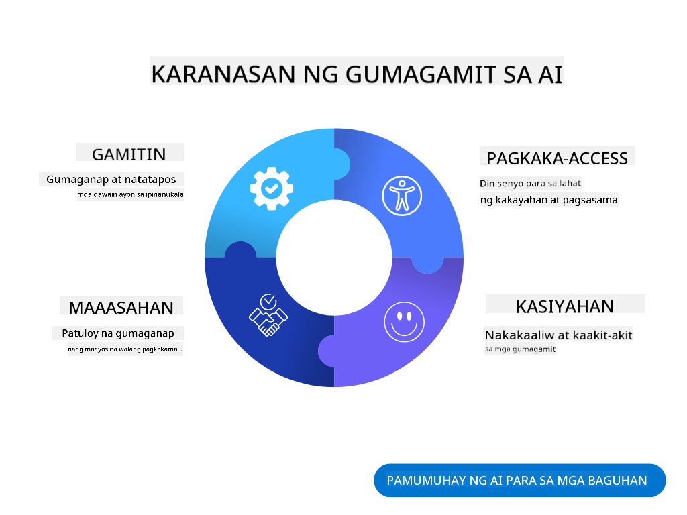
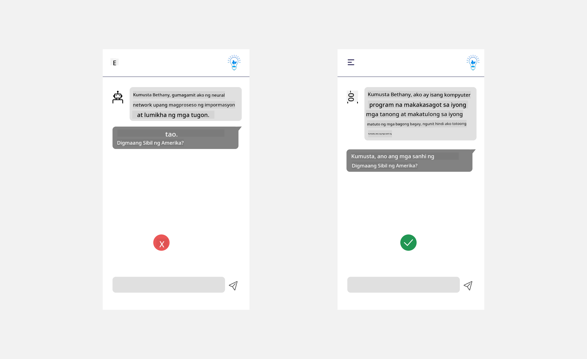
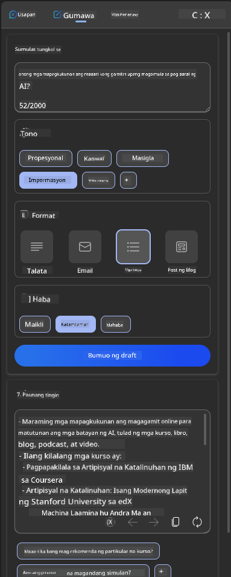
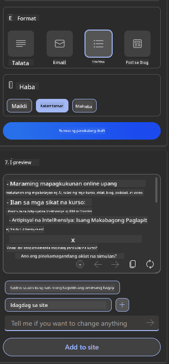
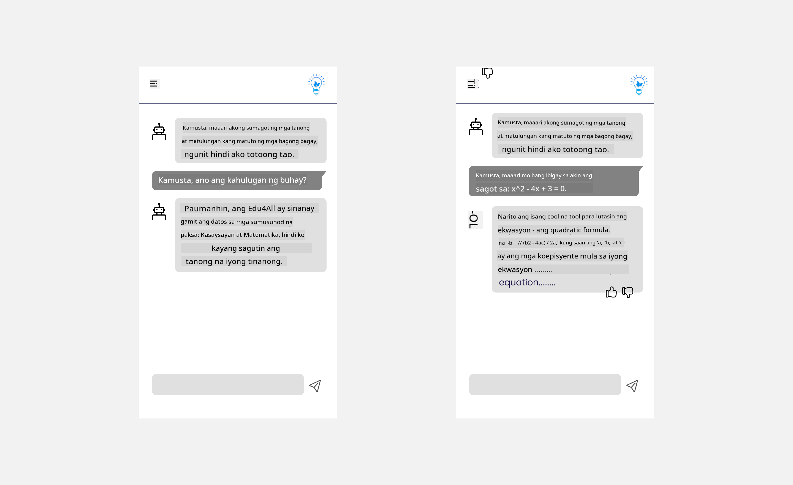

<!--
CO_OP_TRANSLATOR_METADATA:
{
  "original_hash": "ec385b41ee50579025d50cc03bfb3a25",
  "translation_date": "2025-05-19T22:02:14+00:00",
  "source_file": "12-designing-ux-for-ai-applications/README.md",
  "language_code": "tl"
}
-->
# Disenyo ng UX para sa AI Applications

> _(I-click ang imahe sa itaas para mapanood ang video ng leksyon na ito)_

Ang karanasan ng gumagamit ay isang napakahalagang aspeto ng paggawa ng apps. Kailangang magamit ng mga gumagamit ang iyong app sa isang mahusay na paraan para makagawa ng mga gawain. Ang pagiging mahusay ay isang bagay ngunit kailangan mo ring magdisenyo ng mga app upang magamit ng lahat, upang gawing _accessible_ ang mga ito. Ang kabanatang ito ay magtutuon sa larangang ito upang sa huli ay makagawa ka ng app na magagamit at gugustuhin ng mga tao.

## Panimula

Ang karanasan ng gumagamit ay kung paano nakikipag-ugnayan at gumagamit ang isang tao ng isang partikular na produkto o serbisyo maging ito man ay isang sistema, kasangkapan, o disenyo. Sa pagbuo ng mga AI applications, hindi lamang nakatuon ang mga developer sa pagtiyak na ang karanasan ng gumagamit ay epektibo kundi pati na rin etikal. Sa leksyon na ito, tatalakayin natin kung paano bumuo ng Artificial Intelligence (AI) applications na tumutugon sa pangangailangan ng gumagamit.

Ang leksyon ay tatalakayin ang mga sumusunod na lugar:

- Panimula sa Karanasan ng Gumagamit at Pag-unawa sa Pangangailangan ng Gumagamit
- Pagdisenyo ng AI Applications para sa Tiwala at Transparency
- Pagdisenyo ng AI Applications para sa Pakikipagtulungan at Feedback

## Mga Layunin sa Pag-aaral

Pagkatapos kunin ang leksyon na ito, magagawa mong:

- Maunawaan kung paano bumuo ng AI applications na tumutugon sa pangangailangan ng gumagamit.
- Magdisenyo ng AI applications na nagtataguyod ng tiwala at pakikipagtulungan.

### Paunang Kaalaman

Maglaan ng oras at magbasa pa tungkol sa [karanasan ng gumagamit at disenyo ng pag-iisip.](https://learn.microsoft.com/training/modules/ux-design?WT.mc_id=academic-105485-koreyst)

## Panimula sa Karanasan ng Gumagamit at Pag-unawa sa Pangangailangan ng Gumagamit

Sa aming kathang-isip na edukasyong startup, mayroon kaming dalawang pangunahing gumagamit, mga guro at mag-aaral. Ang bawat isa sa dalawang gumagamit ay may natatanging pangangailangan. Ang disenyo na nakatuon sa gumagamit ay inuuna ang gumagamit na tinitiyak na ang mga produkto ay nauugnay at kapaki-pakinabang para sa mga ito ay nilalayon.

Ang aplikasyon ay dapat maging **kapaki-pakinabang, maaasahan, naa-access at kaaya-aya** upang magbigay ng magandang karanasan ng gumagamit.

### Usability

Ang pagiging kapaki-pakinabang ay nangangahulugang ang aplikasyon ay may pag-andar na tumutugma sa nilalayon nitong layunin, tulad ng pag-automate ng proseso ng pagmamarka o pagbuo ng flashcards para sa pagrebyu. Ang isang aplikasyon na nag-automate ng proseso ng pagmamarka ay dapat na tumpak at mahusay na magtalaga ng mga marka sa gawain ng mga mag-aaral batay sa mga paunang natukoy na pamantayan. Gayundin, ang isang aplikasyon na bumubuo ng mga flashcards para sa pagrebyu ay dapat makalikha ng mga nauugnay at iba't ibang tanong batay sa data nito.

### Reliability

Ang pagiging maaasahan ay nangangahulugang ang aplikasyon ay maaaring gampanan ang gawain nito nang palagian at walang mga pagkakamali. Gayunpaman, ang AI tulad ng mga tao ay hindi perpekto at maaaring madaling kapitan ng mga pagkakamali. Ang mga aplikasyon ay maaaring makaranas ng mga pagkakamali o hindi inaasahang sitwasyon na nangangailangan ng interbensyon o pagwawasto ng tao. Paano mo hinahawakan ang mga pagkakamali? Sa huling seksyon ng leksyon na ito, tatalakayin natin kung paano idinisenyo ang mga AI systems at applications para sa pakikipagtulungan at feedback.

### Accessibility

Ang pagiging naa-access ay nangangahulugang pagpapalawak ng karanasan ng gumagamit sa mga gumagamit na may iba't ibang kakayahan, kabilang ang mga may kapansanan, na tinitiyak na walang maiiwan. Sa pamamagitan ng pagsunod sa mga alituntunin at prinsipyo ng accessibility, ang mga solusyon sa AI ay nagiging mas inklusibo, magagamit, at kapaki-pakinabang para sa lahat ng gumagamit.

### Pleasant

Ang pagiging kaaya-aya ay nangangahulugang ang aplikasyon ay masaya gamitin. Ang isang kaakit-akit na karanasan ng gumagamit ay maaaring magkaroon ng positibong epekto sa gumagamit na hinihikayat silang bumalik sa aplikasyon at pinatataas ang kita ng negosyo.

Hindi lahat ng hamon ay malulutas gamit ang AI. Ang AI ay dumarating upang palakasin ang iyong karanasan ng gumagamit, maging ito man ay pag-automate ng mga manu-manong gawain, o pag-personalize ng mga karanasan ng gumagamit.

## Pagdisenyo ng AI Applications para sa Tiwala at Transparency

Ang pagtatayo ng tiwala ay kritikal kapag nagdidisenyo ng mga AI applications. Ang tiwala ay tinitiyak na ang isang gumagamit ay may kumpiyansa na ang aplikasyon ay magagawa ang gawain, maghahatid ng mga resulta nang palagian at ang mga resulta ay kung ano ang kailangan ng gumagamit. Ang isang panganib sa lugar na ito ay ang kawalan ng tiwala at labis na tiwala. Ang kawalan ng tiwala ay nangyayari kapag ang isang gumagamit ay may kaunti o walang tiwala sa isang AI system, ito ay humahantong sa pagtanggi ng gumagamit sa iyong aplikasyon. Ang labis na tiwala ay nangyayari kapag ang isang gumagamit ay labis na tinatantya ang kakayahan ng isang AI system, na humahantong sa mga gumagamit na masyadong nagtitiwala sa AI system. Halimbawa, ang isang automated grading system sa kaso ng labis na tiwala ay maaaring humantong sa guro na hindi suriin ang ilan sa mga papel upang matiyak na ang grading system ay gumagana nang maayos. Ito ay maaaring magresulta sa hindi patas o hindi tumpak na mga marka para sa mga mag-aaral, o mga napalampas na pagkakataon para sa feedback at pagpapabuti.

Dalawang paraan upang matiyak na ang tiwala ay inilagay mismo sa gitna ng disenyo ay ang explainability at kontrol.

### Explainability

Kapag ang AI ay tumutulong sa pagpapahayag ng mga desisyon tulad ng pagbibigay ng kaalaman sa mga susunod na henerasyon, kritikal para sa mga guro at magulang na maunawaan kung paano ginagawa ang mga desisyon ng AI. Ito ay explainability - pag-unawa kung paano ginagawa ng mga AI applications ang mga desisyon. Ang pagdisenyo para sa explainability ay kinabibilangan ng pagdaragdag ng mga detalye ng mga halimbawa ng kung ano ang magagawa ng isang AI application. Halimbawa, sa halip na "Simulan gamit ang AI teacher", maaaring gamitin ng sistema: "I-summarize ang iyong mga tala para sa mas madaling pagrebyu gamit ang AI."

Isa pang halimbawa ay kung paano ginagamit ng AI ang data ng gumagamit at personal. Halimbawa, ang isang gumagamit na may persona ng mag-aaral ay maaaring magkaroon ng mga limitasyon batay sa kanilang persona. Ang AI ay maaaring hindi makapagbigay ng mga sagot sa mga tanong ngunit maaaring makatulong sa paggabay sa gumagamit kung paano nila malulutas ang isang problema.

Ang isa pang mahalagang bahagi ng explainability ay ang pagpapasimple ng mga paliwanag. Ang mga mag-aaral at guro ay maaaring hindi mga eksperto sa AI, kaya ang mga paliwanag ng kung ano ang magagawa o hindi magagawa ng aplikasyon ay dapat na simple at madaling maunawaan.

### Control

Ang generative AI ay lumilikha ng pakikipagtulungan sa pagitan ng AI at ng gumagamit, kung saan halimbawa ang isang gumagamit ay maaaring baguhin ang mga prompt para sa iba't ibang resulta. Bukod pa rito, kapag ang isang output ay nabuo, dapat magawa ng mga gumagamit na baguhin ang mga resulta na nagbibigay sa kanila ng pakiramdam ng kontrol. Halimbawa, kapag gumagamit ng Bing, maaari mong i-tailor ang iyong prompt batay sa format, tono, at haba. Bukod pa rito, maaari mong idagdag ang mga pagbabago sa iyong output at baguhin ang output tulad ng ipinapakita sa ibaba:

Isa pang tampok sa Bing na nagbibigay-daan sa isang gumagamit na magkaroon ng kontrol sa aplikasyon ay ang kakayahang mag-opt in at mag-opt out sa data na ginagamit ng AI. Para sa isang aplikasyon sa paaralan, maaaring gustuhin ng isang mag-aaral na gamitin ang kanilang mga tala pati na rin ang mga mapagkukunan ng guro bilang materyal para sa pagrebyu.

> Kapag nagdidisenyo ng mga AI applications, mahalaga ang intentionality sa pagtiyak na ang mga gumagamit ay hindi labis na nagtitiwala sa pag-aayos ng hindi makatotohanang mga inaasahan ng mga kakayahan nito. Isang paraan upang gawin ito ay sa pamamagitan ng paglikha ng friction sa pagitan ng mga prompt at mga resulta. Paalalahanan ang gumagamit, na ito ay AI at hindi isang kapwa tao

## Pagdisenyo ng AI Applications para sa Pakikipagtulungan at Feedback

Tulad ng nabanggit kanina, ang generative AI ay lumilikha ng pakikipagtulungan sa pagitan ng gumagamit at AI. Karamihan sa mga pakikipag-ugnayan ay sa isang gumagamit na naglalagay ng prompt at ang AI ay bumubuo ng output. Paano kung ang output ay mali? Paano hinahawakan ng aplikasyon ang mga pagkakamali kung sila ay naganap? Sinasisi ba ng AI ang gumagamit o naglalaan ng oras upang ipaliwanag ang pagkakamali?

Ang mga AI applications ay dapat na binuo upang tumanggap at magbigay ng feedback. Hindi lamang ito nakakatulong sa sistema ng AI na mapabuti kundi pati na rin sa pagtatayo ng tiwala sa mga gumagamit. Ang isang feedback loop ay dapat na kasama sa disenyo, ang isang halimbawa ay maaaring isang simpleng thumbs up o down sa output.

Isa pang paraan upang harapin ito ay ang malinaw na komunikasyon ng mga kakayahan at limitasyon ng sistema. Kapag ang isang gumagamit ay nagkamali sa paghingi ng isang bagay na lampas sa mga kakayahan ng AI, dapat ding magkaroon ng paraan upang harapin ito, tulad ng ipinapakita sa ibaba.

Ang mga error sa sistema ay karaniwan sa mga aplikasyon kung saan maaaring kailanganin ng gumagamit ang tulong sa impormasyon sa labas ng saklaw ng AI o ang aplikasyon ay maaaring may limitasyon sa kung gaano karaming mga tanong/paksa ang maaaring bumuo ng mga buod ang isang gumagamit. Halimbawa, ang isang AI application na sinanay sa data sa limitadong mga paksa, halimbawa, Kasaysayan at Matematika ay maaaring hindi makapaghandle ng mga tanong tungkol sa Heograpiya. Upang mabawasan ito, maaaring magbigay ang sistema ng AI ng tugon tulad ng: "Paumanhin, ang aming produkto ay sinanay sa data sa mga sumusunod na paksa....., hindi ko magagawang tumugon sa tanong na iyong tinanong."

Ang mga AI applications ay hindi perpekto, samakatuwid, sila ay tiyak na magkakamali. Kapag nagdidisenyo ng iyong mga aplikasyon, dapat mong tiyakin na lumikha ka ng puwang para sa feedback mula sa mga gumagamit at paghawak ng mga pagkakamali sa isang paraan na simple at madaling maipaliwanag.

## Takdang-Aralin

Kunin ang anumang AI apps na iyong ginawa sa ngayon, isaalang-alang ang pagpapatupad ng mga hakbang sa ibaba sa iyong app:

- **Kaaya-aya:** Isaalang-alang kung paano mo mapapaganda ang iyong app. Nagdaragdag ka ba ng mga paliwanag sa lahat ng dako? Hinikayat mo ba ang gumagamit na mag-explore? Paano mo binibigkas ang iyong mga mensahe ng error?

- **Usability:** Gumawa ng web app. Tiyakin na ang iyong app ay madaling i-navigate gamit ang parehong mouse at keyboard.

- **Tiwala at transparency:** Huwag lubos na magtiwala sa AI at sa output nito, isaalang-alang kung paano mo idadagdag ang tao sa proseso upang i-verify ang output. Gayundin, isaalang-alang at ipatupad ang iba pang mga paraan upang makamit ang tiwala at transparency.

- **Kontrol:** Bigyan ang gumagamit ng kontrol sa data na kanilang ibinibigay sa aplikasyon. Ipatupad ang paraan kung paano makakapag-opt-in at opt-out ang isang gumagamit sa koleksyon ng data sa AI application.

## Ipagpatuloy ang Iyong Pag-aaral!

Pagkatapos makumpleto ang leksyon na ito, tingnan ang aming [Generative AI Learning collection](https://aka.ms/genai-collection?WT.mc_id=academic-105485-koreyst) upang patuloy na mapataas ang iyong kaalaman sa Generative AI!

Pumunta sa Lesson 13, kung saan tatalakayin natin kung paano [securing AI applications](../13-securing-ai-applications/README.md?WT.mc_id=academic-105485-koreyst)!

**Paunawa**:  
Ang dokumentong ito ay isinalin gamit ang AI translation service na [Co-op Translator](https://github.com/Azure/co-op-translator). Bagaman pinagsisikapan naming maging tama, mangyaring tandaan na ang mga awtomatikong pagsasalin ay maaaring maglaman ng mga pagkakamali o kamalian. Ang orihinal na dokumento sa kanyang katutubong wika ang dapat ituring na mapagkakatiwalaang mapagkukunan. Para sa mahalagang impormasyon, inirerekomenda ang propesyonal na pagsasalin ng tao. Hindi kami mananagot para sa anumang hindi pagkakaintindihan o maling interpretasyon na nagmumula sa paggamit ng pagsasaling ito.