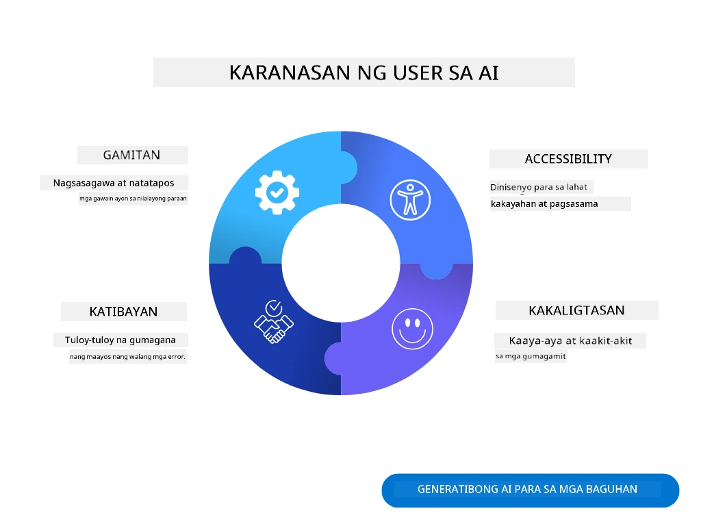
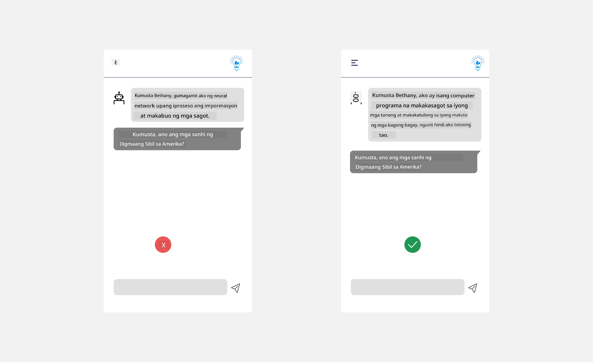
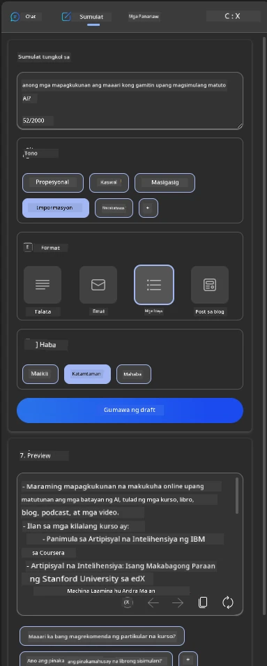
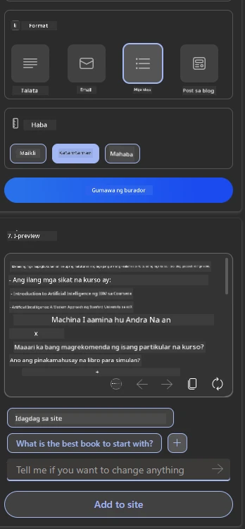
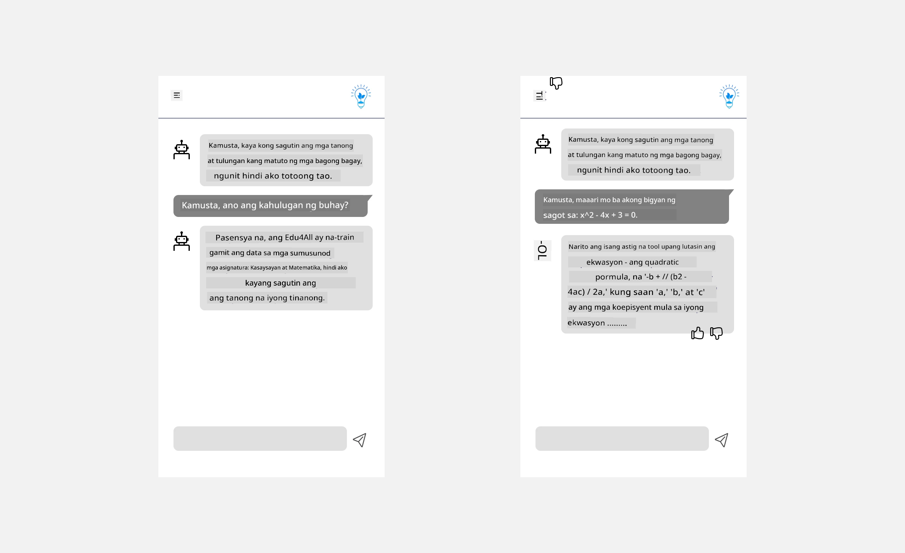

# Pagdidisenyo ng UX para sa mga AI Application

> _(I-click ang larawan sa itaas upang mapanood ang video ng leksyon na ito)_

Mahalaga ang karanasan ng gumagamit sa pagbuo ng mga app. Kailangan ng mga gumagamit na magamit ang iyong app nang mahusay upang maisagawa ang mga gawain. Ang pagiging mahusay ay isang bagay ngunit kailangan mo ring idisenyo ang mga app upang magamit ng lahat, upang maging _accessible_ ito. Sa kabanatang ito, tututukan natin ang bahagi na ito upang sana ay makabuo ka ng app na gusto at kayang gamitin ng mga tao.

## Panimula

Ang karanasan ng gumagamit ay kung paano nakikipag-interact at gumagamit ang isang tao ng partikular na produkto o serbisyo, maging ito man ay sistema, kasangkapan, o disenyo. Sa pagde-develop ng mga AI application, hindi lamang tinututukan ng mga developer ang pagiging epektibo ng karanasan ng gumagamit kundi pati na rin ang pagiging etikal nito. Sa leksyon na ito, tatalakayin natin kung paano bumuo ng mga Artificial Intelligence (AI) application na tumutugon sa pangangailangan ng mga gumagamit.

Saklaw ng leksyon ang mga sumusunod na bahagi:

- Panimula sa Karanasan ng Gumagamit at Pag-unawa sa mga Pangangailangan ng Gumagamit
- Pagdidisenyo ng AI Application para sa Tiwala at Transparensiya
- Pagdidisenyo ng AI Application para sa Pakikipagtulungan at Feedback

## Mga Layunin sa Pagkatuto

Pagkatapos kunin ang leksyon na ito, magagawa mong:

- Maunawaan kung paano bumuo ng AI application na tumutugon sa pangangailangan ng mga gumagamit.
- Magdisenyo ng mga AI application na nagtataguyod ng tiwala at pakikipagtulungan.

### Paunang Kaalaman

Maglaan ng oras upang basahin pa tungkol sa [karanasan ng gumagamit at design thinking.](https://learn.microsoft.com/training/modules/ux-design?WT.mc_id=academic-105485-koreyst)

## Panimula sa Karanasan ng Gumagamit at Pag-unawa sa mga Pangangailangan ng Gumagamit

Sa aming kathang-isip na education startup, mayroon kaming dalawang pangunahing gumagamit, mga guro at mag-aaral. Bawat isa sa dalawang gumagamit ay may natatanging pangangailangan. Ang isang user-centered design ay inuuna ang gumagamit upang matiyak na ang mga produkto ay may kaugnayan at kapaki-pakinabang para sa mga taong nilalayon nito.

Ang aplikasyon ay dapat **kapaki-pakinabang, maaasahan, accessible at kaaya-aya** upang magbigay ng magandang karanasan sa gumagamit.

### Kagamitan (Usability)

Ang pagiging kapaki-pakinabang ay nangangahulugang ang aplikasyon ay may mga kakayahan na akma sa layunin nito, tulad ng pag-automate ng proseso ng pag-grade o paglikha ng mga flashcard para sa pag-uulit. Ang isang aplikasyon na nag-a-automate ng proseso ng pag-grade ay dapat makahati ng mga grado nang tumpak at mahusay sa gawa ng mga estudyante batay sa mga paunang itinakdang pamantayan. Ganoon din, ang isang aplikasyon na gumagawa ng mga flashcard para sa pag-uulit ay dapat makalikha ng mga kaugnay at iba't-ibang tanong base sa datos nito.

### Maaasahan (Reliability)

Ang pagiging maaasahan ay nangangahulugang ang aplikasyon ay makapagpapatupad ng gawain nang tuloy-tuloy at walang mga error. Gayunpaman, tulad ng tao, hindi perpekto ang AI at maaari itong magkamali. Maaaring makaranas ang mga aplikasyon ng mga error o hindi inaasahang sitwasyon na nangangailangan ng interbensyon o pagwawasto ng tao. Paano ka hahawak sa mga error? Sa huling bahagi ng leksyon na ito, tatalakayin natin kung paano dinisenyo ang mga AI system at aplikasyon para sa pakikipagtulungan at feedback.

### Accessibilidad (Accessibility)

Ang pagiging accessible ay nangangahulugang pinalalawak ang karanasan ng gumagamit sa mga gumagamit na may iba't ibang kakayahan, kabilang ang mga may kapansanan, upang matiyak na walang maiiwan. Sa pagsunod sa mga alituntunin at prinsipyo ng accessibility, nagiging mas inklusibo, magagamit, at kapaki-pakinabang para sa lahat ng gumagamit ang mga solusyon ng AI.

### Kaaya-aya (Pleasant)

Ang pagiging kaaya-aya ay nangangahulugang ang aplikasyon ay masaya gamitin. Ang isang kaakit-akit na karanasan ng gumagamit ay maaaring magkaroon ng positibong epekto sa gumagamit na naghihikayat sa kanila na bumalik sa aplikasyon at dagdagan ang kita ng negosyo.

Hindi lahat ng suliranin ay malulutas gamit ang AI. Ang AI ay pumapasok upang dagdagan ang iyong karanasan sa gumagamit, maging ito man ay pag-automate ng mga manu-manong gawain, o pagpapersonalisa ng karanasan ng gumagamit.

## Pagdisenyo ng AI Application para sa Tiwala at Transparensiya

Napakahalaga ng pagtatayo ng tiwala kapag nagdidisenyo ng mga AI application. Ang tiwala ang nagsisiguro na ang gumagamit ay kumpiyansa na ang aplikasyon ay gagawa ng trabaho, magbibigay ng mga resulta nang tuloy-tuloy, at ang resulta ay naaayon sa pangangailangan ng gumagamit. Isang panganib sa bahaging ito ay ang kawalan ng tiwala at sobra-sobrang tiwala. Nangyayari ang kawalan ng tiwala kapag ang isang gumagamit ay kulang o walang tiwala sa isang AI system, na nagreresulta sa pagtanggi sa iyong aplikasyon. Nangyayari naman ang sobra-sobrang tiwala kapag sobra ang pagtingin ng gumagamit sa kakayahan ng AI system, kaya labis nilang pinagkakatiwalaan ang AI system. Halimbawa, sa kaso ng sobra-sobrang tiwala, maaaring hindi na i-proofread ng guro ang ilang papel para matiyak na maayos ang grading system. Maaari itong magresulta sa hindi patas o hindi tumpak na mga grado para sa mga mag-aaral, o sa mga naiwang pagkakataon para sa feedback at pagpapabuti.

Dalawang paraan upang matiyak na ang tiwala ay nasa sentro ng disenyo ay ang explainability at control.

### Explainability

Kapag ang AI ay tumutulong sa pagpapasya tulad ng pagpapasa ng kaalaman sa mga susunod na henerasyon, mahalaga para sa mga guro at magulang na maunawaan kung paano ginagawa ang mga desisyon ng AI. Ito ang explainability - ang pag-unawa kung paano gumagawa ng desisyon ang mga AI application. Kasama sa pagdisenyo para sa explainability ang pagdagdag ng detalye na nagpapakita kung paano nakarating ang AI sa output. Dapat malaman ng audience na ang output ay ginawa ng AI at hindi ng tao. Halimbawa, sa halip na sabihing "Simulan ang pag-chat sa iyong tutor ngayon" sabihin "Gamitin ang AI tutor na umaangkop sa iyong pangangailangan at tumutulong sa iyong matuto sa iyong sariling bilis."

Isa pang halimbawa ay kung paano ginagamit ng AI ang user at personal na data. Halimbawa, ang isang gumagamit na may persona na estudyante ay maaaring may mga limitasyon base sa kanilang persona. Maaaring hindi maibigay ng AI ang mga sagot sa mga tanong ngunit maaaring tulungan ang gumagamit na mag-isip kung paano nila malulutas ang isang problema.

Ang huling mahalagang bahagi ng explainability ay ang pagpapasimple ng mga paliwanag. Maaaring hindi eksperto sa AI ang mga estudyante at guro, kaya ang mga paliwanag tungkol sa kaya o hindi kaya ng aplikasyon ay dapat gawing simple at madaling maintindihan.

### Control

Ang Generative AI ay lumilikha ng pakikipagtulungan sa pagitan ng AI at ng gumagamit, kung saan halimbawa ay maaaring baguhin ng gumagamit ang mga prompt para sa iba't ibang resulta. Bukod dito, kapag na-generate na ang output, dapat magkaroon ng kakayahan ang mga gumagamit na baguhin ang mga resulta na nagbibigay sa kanila ng pakiramdam ng kontrol. Halimbawa, kapag ginagamit ang Microsoft Copilot (na dating Bing Chat), maaari mong i-customize ang iyong prompt base sa format, tono, at haba. Pwede ka ring magdagdag ng mga pagbabago sa iyong output at baguhin ito gaya ng ipinapakita sa ibaba:

Isa pang tampok sa Microsoft Copilot na nagbibigay kontrol sa gumagamit ay ang kakayahang mag-opt in at mag-opt out sa mga datos na ginagamit ng AI. Para sa isang school application, maaaring nais ng isang estudyante na gamitin ang kanilang mga notes pati ang mga resources ng mga guro bilang materyal sa pag-uulit.

> Kapag nagdidisenyo ng AI application, mahalaga ang intensyon upang matiyak na hindi sobra ang pagtitiwala ng mga gumagamit na nagse-set ng hindi realistiko na mga inaasahan sa kakayahan nito. Isang paraan para gawin ito ay sa pamamagitan ng paglikha ng friction sa pagitan ng mga prompt at mga resulta. Paalalahanan ang gumagamit na ito ay AI at hindi isang kapwa tao.

## Pagdidisenyo ng AI Application para sa Pakikipagtulungan at Feedback

Tulad ng naunang nabanggit, ang generative AI ay lumilikha ng pakikipagtulungan sa pagitan ng gumagamit at AI. Karamihan sa interaksyon ay sa pamamagitan ng pag-input ng prompt ng gumagamit at pag-generate ng output ng AI. Paano kung mali ang output? Paano hinahandle ng aplikasyon ang mga error kapag nangyari? Sinasabi ba ng AI na ang mali ay sa gumagamit o binibigyan nito ng paliwanag ang error?

Dapat bumuo ang mga AI application upang makatanggap at magbigay ng feedback. Hindi lang ito nakakatulong para sa pagpapabuti ng AI system kundi nagtatayo rin ng tiwala sa mga gumagamit. Dapat may feedback loop sa disenyo, halimbawa ay simpleng thumbs up o down sa output.

Isa pang paraan upang hawakan ito ay malinaw na komunikasyon ng mga kakayahan at limitasyon ng sistema. Kapag gumawa ang gumagamit ng error sa paghingi ng bagay na lampas sa kakayahan ng AI, dapat mayroon ding paraan upang hawakan ito, tulad ng ipinapakita sa ibaba.

Karaniwan ang mga error sa sistema sa mga aplikasyon kung saan maaaring kailanganin ng gumagamit ng tulong para sa impormasyon na wala sa saklaw ng AI, o maaaring may limitasyon ang aplikasyon kung ilan ang tanong/paksang pwedeng gawing buod ng gumagamit. Halimbawa, ang isang AI application na tinrain sa mga data tungkol sa limitadong mga paksa tulad ng History at Math ay maaaring hindi makasagot sa mga tanong tungkol sa Geography. Upang maiwasan ito, maaaring magbigay ang AI system ng tugon tulad ng: "Paumanhin, ang aming produkto ay tinrain gamit ang datos sa mga sumusunod na paksa....., hindi ko kaya na sagutin ang tanong na iyong tinanong."

Hindi perpekto ang mga AI application, kaya inaasahan ang mga pagkakamali. Kapag dinisenyo ang iyong mga aplikasyon, dapat mong tiyakin na mayroong puwang para sa feedback mula sa mga gumagamit at paghawak sa mga error sa paraang simple at madaling maipaliwanag.

## Takdang Aralin

Kunin ang anumang AI app na iyong nabuo hanggang ngayon, isaalang-alang ang pagpapatupad ng mga sumusunod na hakbang sa iyong app:

- **Kaaya-aya:** Isipin kung paano mo mapapaganda ang karanasan sa paggamit ng iyong app. Nagsasama ka ba ng mga paliwanag sa lahat ng dako? Hinikayat mo ba ang gumagamit na mag-explore? Paano mo binubuo ang iyong mga mensahe ng error?

- **Kagamitang mabisa:** Nagtatayo ka ba ng web app? Siguraduhin na ang iyong app ay napaglalakaran gamit ang mouse at keyboard.

- **Tiwala at transparensiya:** Huwag labis na magtiwala sa AI at sa output nito, isipin kung paano mo idaragdag ang isang tao sa proseso para beripikahin ang output. Isaalang-alang at ipatupad ang iba pang paraan upang makamit ang tiwala at transparensiya.

- **Kontrol:** Bigyan ang gumagamit ng kontrol sa data na kanilang ibinibigay sa aplikasyon. Magpatupad ng paraan para makapag-opt in at opt out ang gumagamit sa pangangalap ng data sa AI application.

<!-- ## [Post-lecture quiz](../../../12-designing-ux-for-ai-applications/quiz-url) -->

## Ipagpatuloy ang Iyong Pagkatuto!

Pagkatapos makumpleto ang leksyon na ito, silipin ang aming [Generative AI Learning collection](https://aka.ms/genai-collection?WT.mc_id=academic-105485-koreyst) upang ipagpatuloy ang pagpapalawak ng iyong kaalaman tungkol sa Generative AI!

Pumunta sa Leksiyon 13, kung saan tatalakayin natin kung paano [pangalagaan ang mga AI application](../13-securing-ai-applications/README.md?WT.mc_id=academic-105485-koreyst)!

---

<!-- CO-OP TRANSLATOR DISCLAIMER START -->
**Pagtatanggi**:
Ang dokumentong ito ay isinalin gamit ang serbisyo ng AI translation na [Co-op Translator](https://github.com/Azure/co-op-translator). Bagama't nagsusumikap kami para sa katumpakan, pakatandaan na ang awtomatikong pagsasalin ay maaaring maglaman ng mga pagkakamali o hindi pagkakatugma. Ang orihinal na dokumento sa orihinal nitong wika ang dapat ituring na pangunahing sanggunian. Para sa mahahalagang impormasyon, inirerekomenda ang propesyonal na pagsasalin ng tao. Hindi kami mananagot sa anumang maling pagkakaintindi o maling interpretasyon na nagmula sa paggamit ng pagsasaling ito.
<!-- CO-OP TRANSLATOR DISCLAIMER END -->