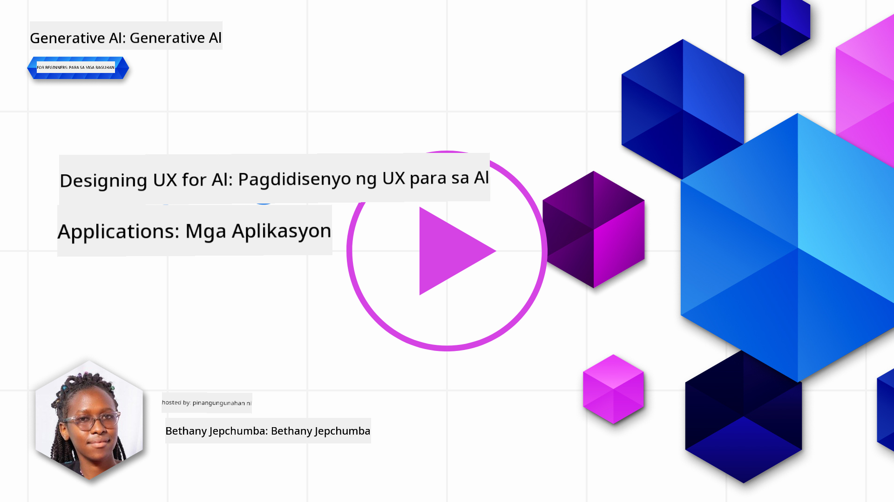
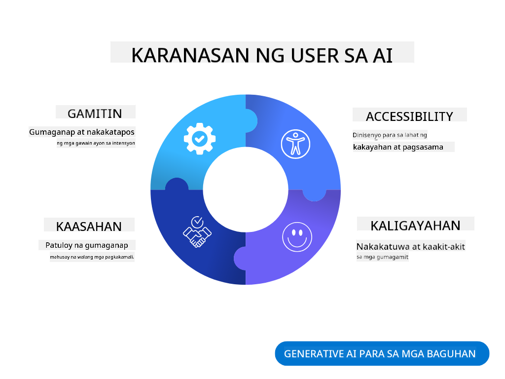
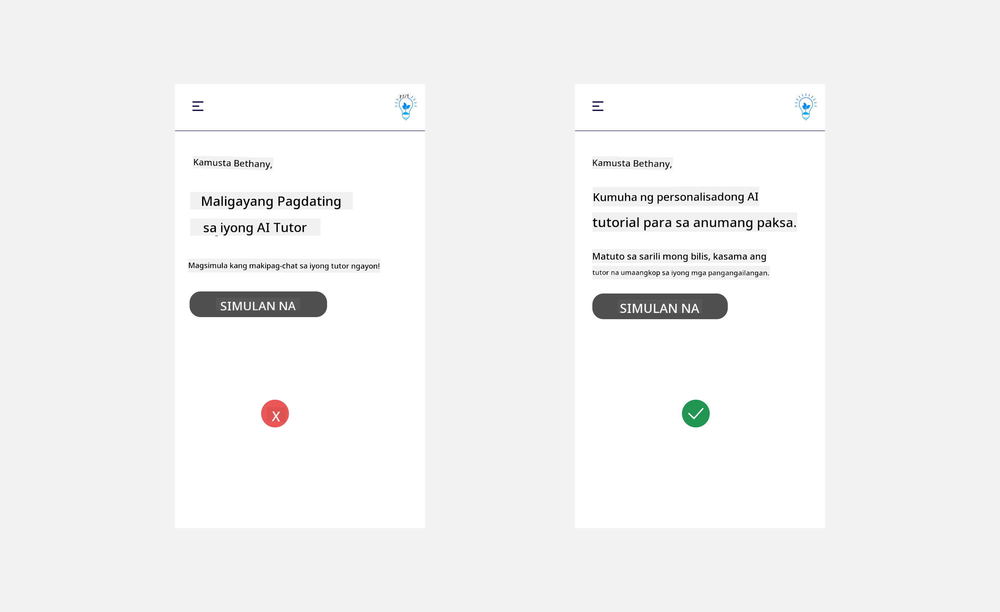
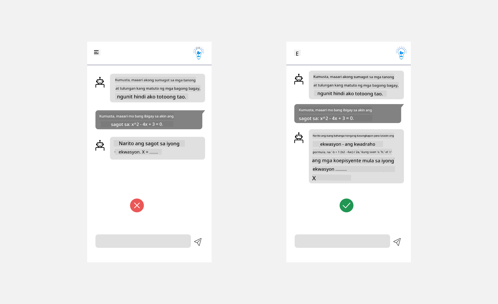
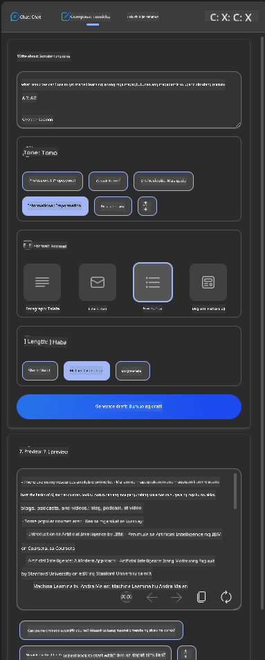
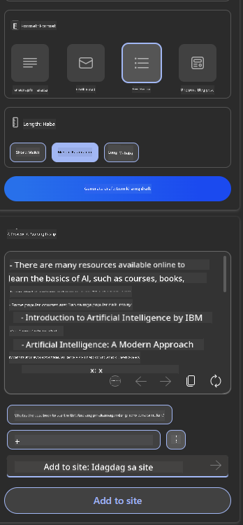
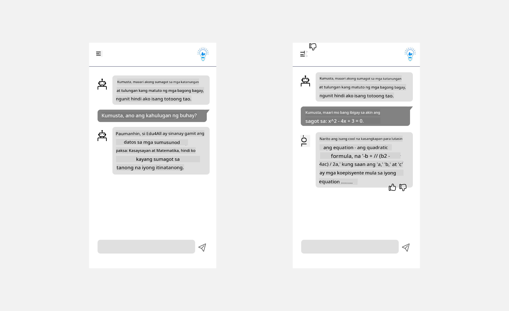

<!--
CO_OP_TRANSLATOR_METADATA:
{
  "original_hash": "ec385b41ee50579025d50cc03bfb3a25",
  "translation_date": "2025-06-25T20:29:50+00:00",
  "source_file": "12-designing-ux-for-ai-applications/README.md",
  "language_code": "tl"
}
-->
# Pagdidisenyo ng UX para sa mga Aplikasyon ng AI

> _(I-click ang larawan sa itaas upang mapanood ang video ng araling ito)_

Ang karanasan ng gumagamit ay isang napakahalagang aspeto sa paggawa ng mga app. Kailangang magamit ng mga gumagamit ang iyong app sa isang epektibong paraan upang maisagawa ang mga gawain. Ang pagiging epektibo ay isang bagay, ngunit kailangan mo ring magdisenyo ng mga app upang magamit ito ng lahat, upang maging _accessible_ ito. Ang kabanatang ito ay magtutuon sa bahaging ito upang sana'y makabuo ka ng isang app na gustong gamitin ng mga tao.

## Panimula

Ang karanasan ng gumagamit ay kung paano nakikipag-ugnayan at gumagamit ang isang tao ng isang tiyak na produkto o serbisyo maging ito man ay sistema, kagamitan, o disenyo. Sa pagbuo ng mga aplikasyon ng AI, hindi lamang nakatuon ang mga developer sa pagtiyak na epektibo ang karanasan ng gumagamit kundi pati na rin etikal. Sa araling ito, tatalakayin natin kung paano bumuo ng mga aplikasyon ng Artificial Intelligence (AI) na tumutugon sa mga pangangailangan ng gumagamit.

Saklaw ng araling ito ang mga sumusunod na lugar:

- Panimula sa Karanasan ng Gumagamit at Pag-unawa sa mga Pangangailangan ng Gumagamit
- Pagdidisenyo ng mga Aplikasyon ng AI para sa Tiwala at Transparency
- Pagdidisenyo ng mga Aplikasyon ng AI para sa Pakikipagtulungan at Feedback

## Mga Layunin sa Pagkatuto

Pagkatapos kunin ang araling ito, magagawa mong:

- Maunawaan kung paano bumuo ng mga aplikasyon ng AI na nakakatugon sa mga pangangailangan ng gumagamit.
- Magdisenyo ng mga aplikasyon ng AI na nagtataguyod ng tiwala at pakikipagtulungan.

### Paunang Kaalaman

Maglaan ng oras at magbasa pa tungkol sa [karanasan ng gumagamit at disenyo ng pag-iisip.](https://learn.microsoft.com/training/modules/ux-design?WT.mc_id=academic-105485-koreyst)

## Panimula sa Karanasan ng Gumagamit at Pag-unawa sa mga Pangangailangan ng Gumagamit

Sa aming kathang-isip na startup sa edukasyon, mayroon kaming dalawang pangunahing gumagamit, mga guro at estudyante. Bawat isa sa dalawang gumagamit ay may natatanging pangangailangan. Ang disenyo na nakasentro sa gumagamit ay inuuna ang gumagamit upang matiyak na ang mga produkto ay may kaugnayan at kapaki-pakinabang para sa mga nilalayon nito.

Ang aplikasyon ay dapat **kapaki-pakinabang, maaasahan, naa-access at kasiya-siya** upang magbigay ng magandang karanasan ng gumagamit.

### Usability

Ang pagiging kapaki-pakinabang ay nangangahulugang ang aplikasyon ay mayroong functionality na tumutugma sa nilalayon nitong layunin, tulad ng pag-aautomat ng proseso ng pagmamarka o pagbuo ng mga flashcard para sa pagrebyu. Ang isang aplikasyon na nag-aautomat ng proseso ng pagmamarka ay dapat na makapag-assign ng mga marka sa mga gawain ng mga estudyante nang tumpak at mahusay batay sa mga itinakdang pamantayan. Gayundin, ang isang aplikasyon na bumubuo ng mga flashcard para sa pagrebyu ay dapat na makalikha ng mga kaugnayan at magkakaibang tanong batay sa data nito.

### Reliability

Ang pagiging maaasahan ay nangangahulugang ang aplikasyon ay maaaring magsagawa ng gawain nito nang tuloy-tuloy at walang mga pagkakamali. Gayunpaman, ang AI tulad ng mga tao ay hindi perpekto at maaaring maging madaling kapitan ng mga pagkakamali. Ang mga aplikasyon ay maaaring makaranas ng mga pagkakamali o hindi inaasahang sitwasyon na nangangailangan ng interbensyon o pagwawasto ng tao. Paano mo hinahawakan ang mga pagkakamali? Sa huling bahagi ng araling ito, tatalakayin natin kung paano idinisenyo ang mga sistema at aplikasyon ng AI para sa pakikipagtulungan at feedback.

### Accessibility

Ang pagiging naa-access ay nangangahulugang pagpapalawak ng karanasan ng gumagamit sa mga gumagamit na may iba't ibang kakayahan, kabilang ang mga may kapansanan, upang matiyak na walang maiiwan. Sa pamamagitan ng pagsunod sa mga alituntunin at prinsipyo ng accessibility, ang mga solusyon ng AI ay nagiging mas inklusibo, magagamit, at kapaki-pakinabang para sa lahat ng gumagamit.

### Pleasant

Ang pagiging kasiya-siya ay nangangahulugang ang aplikasyon ay kaaya-ayang gamitin. Ang isang kaakit-akit na karanasan ng gumagamit ay maaaring magkaroon ng positibong epekto sa gumagamit na hinihikayat silang bumalik sa aplikasyon at nagpapataas ng kita ng negosyo.

Hindi lahat ng hamon ay maaaring malutas sa AI. Ang AI ay pumapasok upang pahusayin ang iyong karanasan ng gumagamit, maging ito man ay pag-aautomat ng mga manu-manong gawain, o pag-personalize ng mga karanasan ng gumagamit.

## Pagdidisenyo ng mga Aplikasyon ng AI para sa Tiwala at Transparency

Ang pagtatayo ng tiwala ay kritikal kapag nagdidisenyo ng mga aplikasyon ng AI. Ang tiwala ay nagsisiguro na ang isang gumagamit ay kumpiyansa na ang aplikasyon ay makakagawa ng trabaho, maghahatid ng mga resulta nang tuloy-tuloy at ang mga resulta ay kung ano ang kailangan ng gumagamit. Ang isang panganib sa lugar na ito ay kawalan ng tiwala at labis na tiwala. Ang kawalan ng tiwala ay nangyayari kapag ang isang gumagamit ay may kaunti o walang tiwala sa isang sistema ng AI, na nagreresulta sa pagtanggi ng gumagamit sa iyong aplikasyon. Ang labis na tiwala ay nangyayari kapag ang isang gumagamit ay labis na nagtataya sa kakayahan ng isang sistema ng AI, na nagreresulta sa sobrang pagtitiwala ng mga gumagamit sa sistema ng AI. Halimbawa, ang isang sistema ng pagmamarka na awtomatiko sa kaso ng labis na tiwala ay maaaring magresulta sa hindi na pag-proof ng guro sa ilang mga papel upang matiyak na gumagana nang maayos ang sistema ng pagmamarka. Ito ay maaaring magresulta sa hindi patas o hindi tumpak na mga marka para sa mga estudyante, o mga hindi natutuklasang pagkakataon para sa feedback at pagpapabuti.

Dalawang paraan upang matiyak na ang tiwala ay inilalagay sa gitna ng disenyo ay ang explainability at kontrol.

### Explainability

Kapag ang AI ay tumutulong sa paghubog ng mga desisyon tulad ng pagbigay ng kaalaman sa mga susunod na henerasyon, kritikal para sa mga guro at magulang na maunawaan kung paano ginagawa ang mga desisyon ng AI. Ito ang explainability - pag-unawa kung paano gumagawa ng desisyon ang mga aplikasyon ng AI. Ang pagdidisenyo para sa explainability ay kinabibilangan ng pagdaragdag ng mga detalye ng mga halimbawa ng kung ano ang maaaring gawin ng isang aplikasyon ng AI. Halimbawa, sa halip na "Simulan ang AI teacher", maaaring gamitin ng sistema: "I-summarize ang iyong mga tala para sa mas madaling pagrebyu gamit ang AI."

Isa pang halimbawa ay kung paano gumagamit ang AI ng data ng gumagamit at personal na data. Halimbawa, ang isang gumagamit na may personang estudyante ay maaaring magkaroon ng mga limitasyon batay sa kanilang persona. Ang AI ay maaaring hindi makapagbigay ng mga sagot sa mga tanong ngunit maaaring makatulong na gabayan ang gumagamit sa pag-iisip kung paano nila malulutas ang isang problema.

Ang isang huling pangunahing bahagi ng explainability ay ang pagpapasimple ng mga paliwanag. Ang mga estudyante at guro ay maaaring hindi mga eksperto sa AI, kaya't ang mga paliwanag ng kung ano ang maaaring o hindi maaaring gawin ng aplikasyon ay dapat na simple at madaling maunawaan.

### Control

Ang Generative AI ay lumilikha ng pakikipagtulungan sa pagitan ng AI at ng gumagamit, kung saan halimbawa, maaaring baguhin ng gumagamit ang mga prompt para sa iba't ibang resulta. Bukod pa rito, kapag ang isang output ay nalikha, dapat na makapagbago ang mga gumagamit sa mga resulta na nagbibigay sa kanila ng pakiramdam ng kontrol. Halimbawa, kapag gumagamit ng Bing, maaari mong i-customize ang iyong prompt batay sa format, tono at haba. Bukod pa rito, maaari kang magdagdag ng mga pagbabago sa iyong output at baguhin ang output tulad ng ipinapakita sa ibaba:

Isa pang tampok sa Bing na nagpapahintulot sa isang gumagamit na magkaroon ng kontrol sa aplikasyon ay ang kakayahang mag-opt in at mag-opt out sa data na ginagamit ng AI. Para sa isang aplikasyon sa paaralan, maaaring gustuhin ng isang estudyante na gamitin ang kanilang mga tala pati na rin ang mga mapagkukunan ng guro bilang materyal sa pagrebyu.

> Kapag nagdidisenyo ng mga aplikasyon ng AI, mahalaga ang intensyonalidad sa pagtiyak na hindi labis na nagtitiwala ang mga gumagamit na nagtatakda ng hindi makatotohanang mga inaasahan sa mga kakayahan nito. Isang paraan upang gawin ito ay sa pamamagitan ng paglikha ng alitan sa pagitan ng mga prompt at mga resulta. Paalalahanan ang gumagamit, na ito ay AI at hindi isang kapwa tao

## Pagdidisenyo ng mga Aplikasyon ng AI para sa Pakikipagtulungan at Feedback

Tulad ng nabanggit kanina, ang generative AI ay lumilikha ng pakikipagtulungan sa pagitan ng gumagamit at AI. Karamihan sa mga pakikipag-ugnayan ay may gumagamit na naglalagay ng prompt at ang AI na bumubuo ng output. Paano kung mali ang output? Paano hinahawakan ng aplikasyon ang mga pagkakamali kung mangyari ito? Ang AI ba ay sinisisi ang gumagamit o naglalaan ng oras upang ipaliwanag ang pagkakamali?

Ang mga aplikasyon ng AI ay dapat na itayo upang makatanggap at magbigay ng feedback. Hindi lamang ito nakakatulong sa pagpapabuti ng sistema ng AI kundi nagtatayo rin ng tiwala sa mga gumagamit. Ang isang feedback loop ay dapat na kasama sa disenyo, ang isang halimbawa ay maaaring isang simpleng thumbs up o down sa output.

Isa pang paraan upang harapin ito ay ang malinaw na pakikipag-usap sa mga kakayahan at limitasyon ng sistema. Kapag ang isang gumagamit ay nagkamali sa paghingi ng isang bagay na lampas sa mga kakayahan ng AI, dapat din na magkaroon ng paraan upang harapin ito, tulad ng ipinapakita sa ibaba.

Ang mga error sa sistema ay karaniwan sa mga aplikasyon kung saan maaaring kailanganin ng gumagamit ng tulong sa impormasyon sa labas ng saklaw ng AI o ang aplikasyon ay maaaring may limitasyon sa kung gaano karaming mga tanong/paksa ang maaaring makabuo ng mga buod ng gumagamit. Halimbawa, ang isang aplikasyon ng AI na sinanay sa data sa limitadong mga paksa halimbawa, Kasaysayan at Matematika ay maaaring hindi makayanan ang mga tanong tungkol sa Heograpiya. Upang mabawasan ito, maaaring magbigay ng tugon ang sistema ng AI tulad ng: "Paumanhin, ang aming produkto ay sinanay sa data sa mga sumusunod na paksa....., hindi ko kayang sagutin ang tanong na tinanong mo."

Ang mga aplikasyon ng AI ay hindi perpekto, kaya't sila ay nakatakdang magkamali. Kapag nagdidisenyo ng iyong mga aplikasyon, dapat mong tiyakin na lumikha ka ng puwang para sa feedback mula sa mga gumagamit at paghawak sa mga error sa paraang simple at madaling maipaliwanag.

## Takdang Aralin

Kunin ang anumang AI apps na iyong nagawa hanggang ngayon, isaalang-alang ang pagpapatupad ng mga sumusunod na hakbang sa iyong app:

- **Pleasant:** Isaalang-alang kung paano mo mapapaganda ang iyong app. Nagdaragdag ka ba ng mga paliwanag kahit saan? Hinihikayat mo ba ang gumagamit na mag-explore? Paano mo binibigkas ang iyong mga mensahe ng error?

- **Usability:** Pagbuo ng isang web app. Tiyakin na ang iyong app ay navigable ng parehong mouse at keyboard.

- **Tiwala at transparency:** Huwag lubos na magtiwala sa AI at sa output nito, isaalang-alang kung paano mo idadagdag ang isang tao sa proseso upang mapatunayan ang output. Isaalang-alang din at ipatupad ang iba pang mga paraan upang makamit ang tiwala at transparency.

- **Kontrol:** Bigyan ang gumagamit ng kontrol sa data na kanilang ibinibigay sa aplikasyon. Ipatupad ang isang paraan na maaaring mag-opt-in at mag-opt-out ang isang gumagamit sa pagkolekta ng data sa aplikasyon ng AI.

## Ipagpatuloy ang Iyong Pagkatuto!

Pagkatapos makumpleto ang araling ito, tingnan ang aming [Generative AI Learning collection](https://aka.ms/genai-collection?WT.mc_id=academic-105485-koreyst) upang patuloy na palawakin ang iyong kaalaman sa Generative AI!

Pumunta sa Aralin 13, kung saan titingnan natin kung paano [siguruhin ang mga aplikasyon ng AI](../13-securing-ai-applications/README.md?WT.mc_id=academic-105485-koreyst)!

**Pagwawaksi**:  
Ang dokumentong ito ay isinalin gamit ang serbisyo ng AI na tagasalin [Co-op Translator](https://github.com/Azure/co-op-translator). Bagamat nagsusumikap kami para sa katumpakan, mangyaring tandaan na ang mga awtomatikong pagsasalin ay maaaring maglaman ng mga error o hindi pagkakatugma. Ang orihinal na dokumento sa kanyang katutubong wika ay dapat ituring na mapagkakatiwalaang pinagmulan. Para sa mahahalagang impormasyon, ang propesyonal na pagsasalin ng tao ay inirerekomenda. Kami ay hindi mananagot para sa anumang hindi pagkakaintindihan o maling interpretasyon na dulot ng paggamit ng pagsasaling ito.