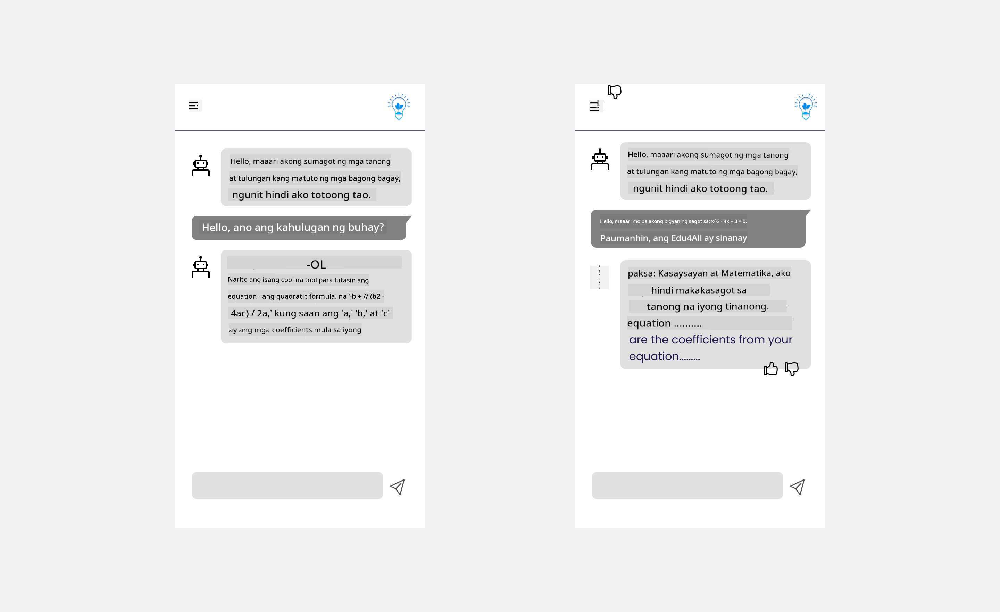

<!--
CO_OP_TRANSLATOR_METADATA:
{
  "original_hash": "78bbeed50fd4dc9fdee931f5daf98cb3",
  "translation_date": "2025-10-17T13:26:22+00:00",
  "source_file": "12-designing-ux-for-ai-applications/README.md",
  "language_code": "tl"
}
-->
# Pagdidisenyo ng UX para sa mga AI Application

> _(I-click ang imahe sa itaas para mapanood ang video ng araling ito)_

Ang karanasan ng gumagamit ay napakahalagang aspeto sa paggawa ng mga app. Kailangang magamit ng mga gumagamit ang iyong app nang epektibo upang maisagawa ang mga gawain. Ang pagiging epektibo ay isang bagay, ngunit kailangan mo ring magdisenyo ng mga app upang magamit ng lahat, upang gawing _accessible_ ang mga ito. Ang kabanatang ito ay magtutuon sa lugar na ito upang sana ay makagawa ka ng app na magagamit at gugustuhin ng mga tao.

## Panimula

Ang karanasan ng gumagamit ay kung paano nakikipag-ugnayan at gumagamit ang isang tao ng isang partikular na produkto o serbisyo, maging ito ay isang sistema, tool, o disenyo. Kapag gumagawa ng mga AI application, hindi lamang nakatuon ang mga developer sa pagtiyak na epektibo ang karanasan ng gumagamit kundi pati na rin etikal. Sa araling ito, tatalakayin natin kung paano bumuo ng mga Artificial Intelligence (AI) application na tumutugon sa mga pangangailangan ng gumagamit.

Ang aralin ay tatalakayin ang mga sumusunod na paksa:

- Panimula sa Karanasan ng Gumagamit at Pag-unawa sa mga Pangangailangan ng Gumagamit
- Pagdidisenyo ng mga AI Application para sa Tiwala at Transparency
- Pagdidisenyo ng mga AI Application para sa Pakikipagtulungan at Feedback

## Mga Layunin sa Pagkatuto

Pagkatapos ng araling ito, magagawa mong:

- Maunawaan kung paano bumuo ng mga AI application na tumutugon sa mga pangangailangan ng gumagamit.
- Magdisenyo ng mga AI application na nagtataguyod ng tiwala at pakikipagtulungan.

### Paunang Kaalaman

Maglaan ng oras upang magbasa pa tungkol sa [karanasan ng gumagamit at design thinking.](https://learn.microsoft.com/training/modules/ux-design?WT.mc_id=academic-105485-koreyst)

## Panimula sa Karanasan ng Gumagamit at Pag-unawa sa mga Pangangailangan ng Gumagamit

Sa aming kathang-isip na startup sa edukasyon, mayroon kaming dalawang pangunahing gumagamit, mga guro at mag-aaral. Ang bawat isa sa dalawang gumagamit ay may natatanging pangangailangan. Ang disenyo na nakasentro sa gumagamit ay inuuna ang gumagamit upang matiyak na ang mga produkto ay may kaugnayan at kapaki-pakinabang para sa mga ito.

Ang application ay dapat na **kapaki-pakinabang, maaasahan, accessible, at kaaya-aya** upang magbigay ng magandang karanasan ng gumagamit.

### Usability

Ang pagiging kapaki-pakinabang ay nangangahulugan na ang application ay may functionality na tumutugma sa layunin nito, tulad ng pag-automate ng proseso ng pagmamarka o pagbuo ng mga flashcard para sa pag-aaral. Ang isang application na nag-automate ng proseso ng pagmamarka ay dapat na tumpak at mahusay na magtalaga ng mga marka sa mga gawain ng mag-aaral batay sa mga paunang natukoy na pamantayan. Gayundin, ang isang application na bumubuo ng mga flashcard para sa pag-aaral ay dapat na makalikha ng mga kaugnayan at magkakaibang tanong batay sa data nito.

### Reliability

Ang pagiging maaasahan ay nangangahulugan na ang application ay maaaring magsagawa ng gawain nito nang tuloy-tuloy at walang mga error. Gayunpaman, ang AI tulad ng mga tao ay hindi perpekto at maaaring magkamali. Ang mga application ay maaaring makaranas ng mga error o hindi inaasahang sitwasyon na nangangailangan ng interbensyon o pagwawasto ng tao. Paano mo haharapin ang mga error? Sa huling bahagi ng araling ito, tatalakayin natin kung paano idinisenyo ang mga sistema at application ng AI para sa pakikipagtulungan at feedback.

### Accessibility

Ang pagiging accessible ay nangangahulugan ng pagpapalawak ng karanasan ng gumagamit sa mga gumagamit na may iba't ibang kakayahan, kabilang ang mga may kapansanan, upang matiyak na walang maiiwan. Sa pamamagitan ng pagsunod sa mga alituntunin at prinsipyo ng accessibility, ang mga solusyon ng AI ay nagiging mas inklusibo, magagamit, at kapaki-pakinabang para sa lahat ng gumagamit.

### Pleasant

Ang pagiging kaaya-aya ay nangangahulugan na ang application ay masaya gamitin. Ang isang kaakit-akit na karanasan ng gumagamit ay maaaring magkaroon ng positibong epekto sa gumagamit, na hinihikayat silang bumalik sa application at nagpapataas ng kita ng negosyo.

Hindi lahat ng hamon ay maaaring malutas gamit ang AI. Ang AI ay pumapasok upang mapahusay ang karanasan ng gumagamit, maging ito ay pag-automate ng mga manu-manong gawain, o pag-personalize ng mga karanasan ng gumagamit.

## Pagdidisenyo ng mga AI Application para sa Tiwala at Transparency

Ang pagbuo ng tiwala ay mahalaga kapag nagdidisenyo ng mga AI application. Ang tiwala ay nagsisiguro na ang isang gumagamit ay kumpiyansa na ang application ay magagawa ang gawain, maghahatid ng mga resulta nang tuloy-tuloy, at ang mga resulta ay kung ano ang kailangan ng gumagamit. Ang isang panganib sa lugar na ito ay ang kawalan ng tiwala at sobrang tiwala. Ang kawalan ng tiwala ay nangyayari kapag ang isang gumagamit ay may kaunti o walang tiwala sa isang sistema ng AI, na humahantong sa pagtanggi ng gumagamit sa iyong application. Ang sobrang tiwala ay nangyayari kapag ang isang gumagamit ay labis na tinatantiya ang kakayahan ng isang sistema ng AI, na humahantong sa mga gumagamit na masyadong nagtitiwala sa sistema ng AI. Halimbawa, ang isang automated grading system sa kaso ng sobrang tiwala ay maaaring humantong sa guro na hindi suriin ang ilang mga papel upang matiyak na gumagana nang maayos ang grading system. Maaari itong magresulta sa hindi patas o hindi tumpak na mga marka para sa mga mag-aaral, o mga napalampas na pagkakataon para sa feedback at pagpapabuti.

Dalawang paraan upang matiyak na ang tiwala ay inilalagay sa gitna ng disenyo ay ang explainability at control.

### Explainability

Kapag ang AI ay tumutulong sa paggawa ng mga desisyon tulad ng pagbibigay ng kaalaman sa mga susunod na henerasyon, mahalaga para sa mga guro at magulang na maunawaan kung paano ginagawa ang mga desisyon ng AI. Ito ang explainability - ang pag-unawa kung paano gumagawa ng desisyon ang mga AI application. Ang pagdidisenyo para sa explainability ay kinabibilangan ng pagdaragdag ng mga detalye na nagha-highlight kung paano nakarating ang AI sa output. Kailangang malaman ng audience na ang output ay nabuo ng AI at hindi ng tao. Halimbawa, sa halip na sabihin "Simulan ang pakikipag-chat sa iyong tutor ngayon" sabihin "Gamitin ang AI tutor na umaangkop sa iyong mga pangangailangan at tumutulong sa iyong matuto sa iyong bilis."

Isa pang halimbawa ay kung paano ginagamit ng AI ang data ng gumagamit at personal na data. Halimbawa, ang isang gumagamit na may persona na mag-aaral ay maaaring magkaroon ng mga limitasyon batay sa kanilang persona. Ang AI ay maaaring hindi makapagbigay ng mga sagot sa mga tanong ngunit maaaring tumulong na gabayan ang gumagamit kung paano nila malulutas ang isang problema.

Ang isa pang mahalagang bahagi ng explainability ay ang pagpapasimple ng mga paliwanag. Ang mga mag-aaral at guro ay maaaring hindi mga eksperto sa AI, kaya't ang mga paliwanag kung ano ang magagawa o hindi magagawa ng application ay dapat na simple at madaling maunawaan.

### Control

Ang Generative AI ay lumilikha ng pakikipagtulungan sa pagitan ng AI at ng gumagamit, kung saan halimbawa ang isang gumagamit ay maaaring baguhin ang mga prompt para sa iba't ibang resulta. Bukod pa rito, kapag nabuo ang isang output, dapat magawa ng mga gumagamit na baguhin ang mga resulta na nagbibigay sa kanila ng pakiramdam ng kontrol. Halimbawa, kapag gumagamit ng Bing, maaari mong i-tailor ang iyong prompt batay sa format, tono, at haba. Bukod pa rito, maaari kang magdagdag ng mga pagbabago sa iyong output at baguhin ang output tulad ng ipinapakita sa ibaba:

Isa pang tampok sa Bing na nagbibigay-daan sa isang gumagamit na magkaroon ng kontrol sa application ay ang kakayahang mag-opt in at mag-opt out sa data na ginagamit ng AI. Para sa isang application sa paaralan, maaaring gustuhin ng isang mag-aaral na gamitin ang kanilang mga tala pati na rin ang mga mapagkukunan ng guro bilang materyal sa pag-aaral.

> Kapag nagdidisenyo ng mga AI application, mahalaga ang intensyonalidad upang matiyak na ang mga gumagamit ay hindi masyadong nagtitiwala na nagtatakda ng hindi makatotohanang mga inaasahan sa mga kakayahan nito. Isang paraan upang gawin ito ay sa pamamagitan ng paglikha ng friction sa pagitan ng mga prompt at mga resulta. Paalalahanan ang gumagamit na ito ay AI at hindi isang kapwa tao.

## Pagdidisenyo ng mga AI Application para sa Pakikipagtulungan at Feedback

Tulad ng nabanggit kanina, ang generative AI ay lumilikha ng pakikipagtulungan sa pagitan ng gumagamit at AI. Karamihan sa mga pakikipag-ugnayan ay sa isang gumagamit na naglalagay ng prompt at ang AI ay bumubuo ng output. Paano kung mali ang output? Paano hinahawakan ng application ang mga error kung mangyari ang mga ito? Sisisihin ba ng AI ang gumagamit o maglalaan ng oras upang ipaliwanag ang error?

Ang mga AI application ay dapat na idisenyo upang makatanggap at magbigay ng feedback. Hindi lamang nito tinutulungan ang sistema ng AI na mapabuti kundi nagtatayo rin ng tiwala sa mga gumagamit. Ang isang feedback loop ay dapat na isama sa disenyo, ang isang halimbawa ay maaaring isang simpleng thumbs up o down sa output.

Isa pang paraan upang harapin ito ay ang malinaw na iparating ang mga kakayahan at limitasyon ng sistema. Kapag ang isang gumagamit ay nagkamali sa paghingi ng isang bagay na lampas sa kakayahan ng AI, dapat ding magkaroon ng paraan upang harapin ito, tulad ng ipinapakita sa ibaba.

Ang mga error sa sistema ay karaniwan sa mga application kung saan maaaring kailanganin ng gumagamit ang tulong sa impormasyon na lampas sa saklaw ng AI o ang application ay maaaring may limitasyon sa kung gaano karaming mga tanong/paksa ang maaaring makabuo ng mga buod ng gumagamit. Halimbawa, ang isang AI application na sinanay sa data sa limitadong mga paksa tulad ng History at Math ay maaaring hindi makayanan ang mga tanong tungkol sa Geography. Upang mabawasan ito, maaaring magbigay ang sistema ng AI ng tugon tulad ng: "Paumanhin, ang aming produkto ay sinanay sa data sa mga sumusunod na paksa....., hindi ko kayang sagutin ang tanong na iyong tinanong."

Ang mga AI application ay hindi perpekto, kaya't sila ay tiyak na magkakamali. Kapag nagdidisenyo ng iyong mga application, dapat mong tiyakin na lumikha ng espasyo para sa feedback mula sa mga gumagamit at paghawak ng error sa paraang simple at madaling maunawaan.

## Takdang-Aralin

Kunin ang anumang AI apps na nagawa mo na, isaalang-alang ang pagpapatupad ng mga sumusunod na hakbang sa iyong app:

- **Kaaya-aya:** Isaalang-alang kung paano mo mapapaganda ang iyong app. Nagdaragdag ka ba ng mga paliwanag sa bawat bahagi? Hinihikayat mo ba ang gumagamit na mag-explore? Paano mo binibigkas ang iyong mga mensahe ng error?

- **Usability:** Gumagawa ng web app. Siguraduhin na ang iyong app ay maaaring i-navigate gamit ang parehong mouse at keyboard.

- **Tiwala at transparency:** Huwag lubos na magtiwala sa AI at sa output nito, isaalang-alang kung paano mo idadagdag ang tao sa proseso upang i-verify ang output. Gayundin, isaalang-alang at ipatupad ang iba pang mga paraan upang makamit ang tiwala at transparency.

- **Control:** Bigyan ang gumagamit ng kontrol sa data na kanilang ibinibigay sa application. Magpatupad ng paraan kung paano maaaring mag-opt-in at mag-opt-out ang isang gumagamit sa koleksyon ng data sa AI application.

<!-- ## [Post-lecture quiz](../../../12-designing-ux-for-ai-applications/quiz-url) -->

## Ipagpatuloy ang Iyong Pag-aaral!

Pagkatapos makumpleto ang araling ito, tingnan ang aming [Generative AI Learning collection](https://aka.ms/genai-collection?WT.mc_id=academic-105485-koreyst) upang patuloy na mapalawak ang iyong kaalaman sa Generative AI!

Pumunta sa Aralin 13, kung saan tatalakayin natin kung paano [siguraduhin ang seguridad ng mga AI application](../13-securing-ai-applications/README.md?WT.mc_id=academic-105485-koreyst)!

---

**Paunawa**:  
Ang dokumentong ito ay isinalin gamit ang AI translation service na [Co-op Translator](https://github.com/Azure/co-op-translator). Bagamat sinisikap naming maging tumpak, mangyaring tandaan na ang mga awtomatikong pagsasalin ay maaaring maglaman ng mga pagkakamali o hindi pagkakatugma. Ang orihinal na dokumento sa kanyang katutubong wika ang dapat ituring na opisyal na pinagmulan. Para sa mahalagang impormasyon, inirerekomenda ang propesyonal na pagsasalin ng tao. Hindi kami mananagot sa anumang hindi pagkakaunawaan o maling interpretasyon na dulot ng paggamit ng pagsasaling ito.