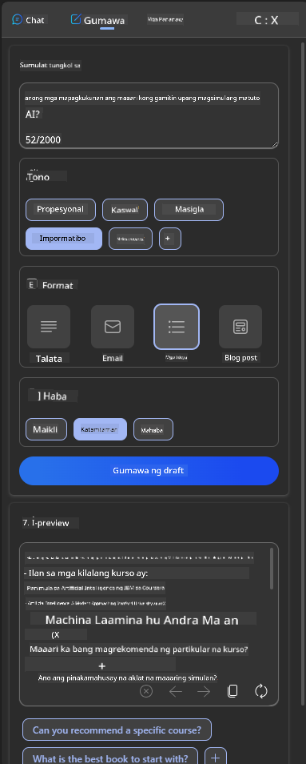

<!--
CO_OP_TRANSLATOR_METADATA:
{
  "original_hash": "ec385b41ee50579025d50cc03bfb3a25",
  "translation_date": "2025-07-09T15:02:20+00:00",
  "source_file": "12-designing-ux-for-ai-applications/README.md",
  "language_code": "tl"
}
-->
# Pagdidisenyo ng UX para sa mga AI Application

> _(I-click ang larawan sa itaas para mapanood ang video ng araling ito)_

Napakahalaga ng karanasan ng gumagamit sa paggawa ng mga app. Kailangan magamit ng mga user ang iyong app nang epektibo upang maisagawa ang mga gawain. Mahalaga ang pagiging epektibo, ngunit kailangan mo ring idisenyo ang mga app upang magamit ito ng lahat, upang maging _accessible_. Tututukan ng kabanatang ito ang aspetong ito upang sana ay makagawa ka ng app na gusto at kayang gamitin ng mga tao.

## Panimula

Ang karanasan ng gumagamit ay kung paano nakikipag-ugnayan at gumagamit ang isang user sa isang partikular na produkto o serbisyo, maging ito man ay sistema, kasangkapan, o disenyo. Sa pagbuo ng mga AI application, hindi lang tinitiyak ng mga developer na epektibo ang karanasan ng gumagamit kundi pati na rin na ito ay etikal. Sa araling ito, tatalakayin natin kung paano bumuo ng mga Artificial Intelligence (AI) application na tumutugon sa pangangailangan ng mga user.

Saklaw ng aralin ang mga sumusunod na paksa:

- Panimula sa Karanasan ng Gumagamit at Pag-unawa sa Pangangailangan ng User  
- Pagdidisenyo ng AI Application para sa Tiwala at Transparency  
- Pagdidisenyo ng AI Application para sa Pakikipagtulungan at Feedback  

## Mga Layunin sa Pagkatuto

Pagkatapos ng araling ito, magagawa mong:

- Maunawaan kung paano bumuo ng AI application na tumutugon sa pangangailangan ng user.  
- Magdisenyo ng AI application na nagpapalaganap ng tiwala at pakikipagtulungan.  

### Kinakailangan

Maglaan ng oras upang basahin pa ang tungkol sa [karanasan ng gumagamit at design thinking.](https://learn.microsoft.com/training/modules/ux-design?WT.mc_id=academic-105485-koreyst)

## Panimula sa Karanasan ng Gumagamit at Pag-unawa sa Pangangailangan ng User

Sa aming kathang-isip na startup sa edukasyon, may dalawang pangunahing user: mga guro at mga estudyante. Bawat isa ay may kanya-kanyang pangangailangan. Ang user-centered design ay inuuna ang user upang matiyak na ang mga produkto ay may kaugnayan at kapaki-pakinabang para sa mga taong nilalayon nito.

Dapat ang aplikasyon ay **kapaki-pakinabang, maaasahan, accessible, at kaaya-aya** upang makapagbigay ng magandang karanasan sa gumagamit.

### Usability

Ang pagiging kapaki-pakinabang ay nangangahulugan na ang aplikasyon ay may mga tampok na tumutugma sa layunin nito, tulad ng pag-automate ng proseso ng pag-grade o paggawa ng mga flashcard para sa pag-uulit. Ang isang app na nag-a-automate ng grading ay dapat makapagbigay ng tumpak at mabilis na pagmamarka sa mga gawa ng estudyante base sa mga itinakdang pamantayan. Gayundin, ang app na gumagawa ng flashcard ay dapat makalikha ng mga kaugnay at iba't ibang tanong base sa datos nito.

### Reliability

Ang pagiging maaasahan ay nangangahulugan na ang aplikasyon ay kayang gawin ang gawain nang tuloy-tuloy at walang mali. Ngunit tulad ng tao, hindi perpekto ang AI at maaaring magkamali. Maaaring magkaroon ng mga error o hindi inaasahang sitwasyon na nangangailangan ng interbensyon o pagwawasto ng tao. Paano mo haharapin ang mga error? Sa huling bahagi ng araling ito, tatalakayin natin kung paano idinisenyo ang mga AI system at aplikasyon para sa pakikipagtulungan at feedback.

### Accessibility

Ang pagiging accessible ay nangangahulugan ng pagpapalawak ng karanasan ng gumagamit sa mga user na may iba't ibang kakayahan, kabilang ang mga may kapansanan, upang walang maiiwan. Sa pagsunod sa mga patnubay at prinsipyo ng accessibility, nagiging mas inklusibo, magagamit, at kapaki-pakinabang ang mga solusyon ng AI para sa lahat ng user.

### Pleasant

Ang pagiging kaaya-aya ay nangangahulugan na ang aplikasyon ay masaya gamitin. Ang kaakit-akit na karanasan ng gumagamit ay maaaring magdulot ng positibong epekto sa user, hinihikayat silang bumalik sa app at tumataas ang kita ng negosyo.

Hindi lahat ng hamon ay malulutas ng AI. Ang AI ay ginagamit upang dagdagan ang iyong karanasan sa gumagamit, maging ito man ay pag-automate ng mga manwal na gawain o pag-personalize ng karanasan ng user.

## Pagdidisenyo ng AI Application para sa Tiwala at Transparency

Mahalaga ang pagtitiwala sa pagdidisenyo ng AI application. Ang tiwala ay nagsisiguro na kumpiyansa ang user na matatapos ng app ang gawain, magbibigay ng resulta nang tuloy-tuloy, at ang resulta ay tugma sa pangangailangan ng user. Isang panganib dito ang kawalan ng tiwala at sobra-sobrang tiwala. Nangyayari ang kawalan ng tiwala kapag ang user ay halos walang tiwala sa AI system, kaya tinatanggihan nila ang iyong app. Nangyayari naman ang sobra-sobrang tiwala kapag sobra ang pag-asa ng user sa kakayahan ng AI system, kaya labis nilang pinagkakatiwalaan ito. Halimbawa, sa isang automated grading system, maaaring hindi na suriin ng guro ang ilang papel dahil sobra ang tiwala sa grading system. Maaari itong magdulot ng hindi patas o maling grado para sa mga estudyante, o mawalan ng pagkakataon para sa feedback at pagbuti.

Dalawang paraan upang matiyak na ang tiwala ay nasa sentro ng disenyo ay ang explainability at control.

### Explainability

Kapag tumutulong ang AI sa paggawa ng mga desisyon tulad ng pagbibigay-kaalaman sa mga susunod na henerasyon, mahalaga para sa mga guro at magulang na maintindihan kung paano ginagawa ang mga desisyon ng AI. Ito ang explainability - ang pag-unawa kung paano gumagawa ng desisyon ang AI application. Kasama sa pagdidisenyo para sa explainability ang pagdagdag ng mga detalye at halimbawa ng kaya ng AI application. Halimbawa, sa halip na "Get started with AI teacher," maaaring gamitin ng sistema ang: "Ibuod ang iyong mga tala para sa mas madaling pag-uulit gamit ang AI."

Isa pang halimbawa ay kung paano ginagamit ng AI ang data ng user at personal na impormasyon. Halimbawa, ang isang user na may persona na estudyante ay maaaring may mga limitasyon base sa kanilang persona. Maaaring hindi maipakita ng AI ang mga sagot sa mga tanong ngunit matutulungan ang user na mag-isip kung paano nila malulutas ang problema.

Ang huling mahalagang bahagi ng explainability ay ang pagpapasimple ng mga paliwanag. Maaaring hindi eksperto sa AI ang mga estudyante at guro, kaya dapat ang mga paliwanag tungkol sa kaya at hindi kaya ng app ay maging simple at madaling maintindihan.

### Control

Lumilikha ang Generative AI ng pakikipagtulungan sa pagitan ng AI at user, kung saan maaaring baguhin ng user ang mga prompt para sa iba't ibang resulta. Bukod dito, kapag may na-generate na output, dapat may kakayahan ang user na baguhin ito upang magkaroon sila ng kontrol. Halimbawa, kapag gumagamit ng Bing, maaari mong i-customize ang prompt base sa format, tono, at haba. Maaari ka ring magdagdag ng pagbabago sa output at i-edit ito tulad ng ipinapakita sa ibaba:

Isa pang tampok sa Bing na nagbibigay kontrol sa user ay ang kakayahang pumili kung sasali o hindi sa paggamit ng data ng AI. Sa isang school application, maaaring gusto ng estudyante na gamitin ang kanilang mga tala pati na rin ang mga resources ng guro bilang materyal sa pag-uulit.

> Sa pagdidisenyo ng AI application, mahalaga ang intensyon upang hindi magdulot ng sobra-sobrang tiwala ang mga user na may hindi makatotohanang inaasahan sa kakayahan nito. Isang paraan ay ang paglikha ng hadlang sa pagitan ng mga prompt at resulta. Paalalahanan ang user na ito ay AI at hindi isang kapwa tao.

## Pagdidisenyo ng AI Application para sa Pakikipagtulungan at Feedback

Tulad ng nabanggit, lumilikha ang generative AI ng pakikipagtulungan sa pagitan ng user at AI. Kadalasan, ang user ay naglalagay ng prompt at ang AI ang naglalabas ng output. Paano kung mali ang output? Paano hinaharap ng app ang mga error kung mangyari ito? Sinisisi ba ng AI ang user o nagbibigay ito ng paliwanag tungkol sa error?

Dapat idisenyo ang AI application upang tumanggap at magbigay ng feedback. Nakakatulong ito hindi lang sa pagpapabuti ng AI system kundi pati na rin sa pagtitiwala ng mga user. Dapat may feedback loop sa disenyo, tulad ng simpleng thumbs up o thumbs down sa output.

Isa pang paraan ay malinaw na ipaalam ang mga kakayahan at limitasyon ng sistema. Kapag nagkamali ang user sa paghingi ng bagay na lampas sa kakayahan ng AI, dapat may paraan upang harapin ito, tulad ng ipinapakita sa ibaba.

Karaniwan ang mga system error sa mga aplikasyon kung saan maaaring kailanganin ng user ng tulong sa impormasyon na wala sa saklaw ng AI o may limitasyon ang app kung ilang tanong/paksa ang maaaring gawing buod. Halimbawa, ang AI application na sinanay gamit ang datos sa limitadong mga paksa tulad ng Kasaysayan at Matematika ay maaaring hindi makasagot sa mga tanong tungkol sa Heograpiya. Upang maiwasan ito, maaaring magbigay ang AI system ng sagot na: "Paumanhin, ang aming produkto ay sinanay gamit ang datos sa mga sumusunod na paksa....., hindi ko kayang sagutin ang tanong na iyong itinatanong."

Hindi perpekto ang mga AI application, kaya inaasahan ang mga pagkakamali. Sa pagdidisenyo ng iyong mga app, siguraduhing may puwang para sa feedback mula sa mga user at para sa paghawak ng error sa paraang simple at madaling ipaliwanag.

## Takdang Aralin

Pumili ng kahit anong AI app na nagawa mo na, isaalang-alang ang pagpapatupad ng mga sumusunod na hakbang sa iyong app:

- **Kaaya-aya:** Isipin kung paano mo mapapaganda ang karanasan sa paggamit ng iyong app. Nagdadagdag ka ba ng paliwanag sa lahat ng lugar? Hinihikayat mo ba ang user na mag-explore? Paano mo binubuo ang mga mensahe ng error?

- **Usability:** Gumawa ng web app. Siguraduhing maaaring i-navigate ang app gamit ang mouse at keyboard.

- **Tiwala at transparency:** Huwag lubusang pagkatiwalaan ang AI at ang output nito, isaalang-alang kung paano mo maidaragdag ang tao sa proseso upang beripikahin ang output. Isaalang-alang at ipatupad din ang iba pang paraan upang makamit ang tiwala at transparency.

- **Kontrol:** Bigyan ang user ng kontrol sa data na ibinibigay nila sa aplikasyon. Magpatupad ng paraan para makapili ang user kung sasali o hindi sa pagkolekta ng data sa AI application.

## Ipagpatuloy ang Iyong Pag-aaral!

Pagkatapos makumpleto ang araling ito, tingnan ang aming [Generative AI Learning collection](https://aka.ms/genai-collection?WT.mc_id=academic-105485-koreyst) upang lalo pang paunlarin ang iyong kaalaman sa Generative AI!

Pumunta sa Lesson 13, kung saan tatalakayin natin kung paano [seguraduhin ang AI application](../13-securing-ai-applications/README.md?WT.mc_id=academic-105485-koreyst)!

**Paalala**:  
Ang dokumentong ito ay isinalin gamit ang AI translation service na [Co-op Translator](https://github.com/Azure/co-op-translator). Bagamat nagsusumikap kami para sa katumpakan, pakatandaan na ang mga awtomatikong pagsasalin ay maaaring maglaman ng mga pagkakamali o di-tumpak na impormasyon. Ang orihinal na dokumento sa kanyang sariling wika ang dapat ituring na pangunahing sanggunian. Para sa mahahalagang impormasyon, inirerekomenda ang propesyonal na pagsasalin ng tao. Hindi kami mananagot sa anumang hindi pagkakaunawaan o maling interpretasyon na maaaring magmula sa paggamit ng pagsasaling ito.