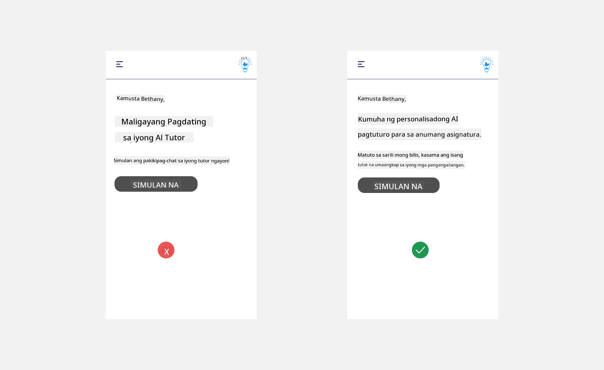

<!--
CO_OP_TRANSLATOR_METADATA:
{
  "original_hash": "747668e4c53d067369f06e9ec2e6313e",
  "translation_date": "2025-08-26T18:37:45+00:00",
  "source_file": "12-designing-ux-for-ai-applications/README.md",
  "language_code": "tl"
}
-->
# Pagdidisenyo ng UX para sa AI Applications

> _(I-click ang larawan sa itaas para mapanood ang video ng araling ito)_

Mahalagang bahagi ng paggawa ng apps ang user experience. Kailangang magamit ng mga user ang iyong app sa mabilis at epektibong paraan para magawa ang kanilang mga gawain. Mahalaga ang pagiging epektibo, pero kailangan mo ring idisenyo ang app para magamit ng lahat—ibig sabihin, dapat itong _accessible_. Sa kabanatang ito, tututukan natin ang bahaging ito para makagawa ka ng app na gusto at kayang gamitin ng mga tao.

## Panimula

Ang user experience ay tumutukoy sa kung paano nakikipag-ugnayan at gumagamit ang isang user ng isang partikular na produkto o serbisyo, mapa-systema, tool, o disenyo man ito. Sa paggawa ng AI applications, hindi lang dapat epektibo ang user experience kundi dapat din itong etikal. Sa araling ito, tatalakayin natin kung paano bumuo ng Artificial Intelligence (AI) applications na tumutugon sa pangangailangan ng mga user.

Sasaklawin ng araling ito ang mga sumusunod na paksa:

- Panimula sa User Experience at Pag-unawa sa Pangangailangan ng User
- Pagdidisenyo ng AI Applications para sa Tiwala at Transparency
- Pagdidisenyo ng AI Applications para sa Kolaborasyon at Feedback

## Mga Layunin sa Pagkatuto

Pagkatapos ng araling ito, magagawa mong:

- Maunawaan kung paano bumuo ng AI applications na tumutugon sa pangangailangan ng user.
- Magdisenyo ng AI applications na nagpapalakas ng tiwala at kolaborasyon.

### Prerequisite

Maglaan ng oras at magbasa pa tungkol sa [user experience at design thinking.](https://learn.microsoft.com/training/modules/ux-design?WT.mc_id=academic-105485-koreyst)

## Panimula sa User Experience at Pag-unawa sa Pangangailangan ng User

Sa ating kathang-isip na education startup, may dalawang pangunahing user tayo: mga guro at estudyante. Bawat isa sa kanila ay may kanya-kanyang pangangailangan. Ang user-centered design ay inuuna ang user para matiyak na ang produkto ay mahalaga at kapaki-pakinabang para sa kanila.

Dapat ang application ay **kapaki-pakinabang, maaasahan, accessible, at kaaya-aya** para magbigay ng magandang user experience.

### Usability

Ang pagiging kapaki-pakinabang ay nangangahulugan na ang application ay may mga kakayahan na tumutugma sa layunin nito, tulad ng pag-automate ng grading process o paggawa ng flashcards para sa review. Ang application na nag-a-automate ng grading process ay dapat kayang magbigay ng tamang scores sa gawa ng estudyante base sa itinakdang pamantayan. Gayundin, ang application na gumagawa ng review flashcards ay dapat kayang gumawa ng mga tanong na may kaugnayan at iba-iba base sa data nito.

### Reliability

Ang pagiging maaasahan ay nangangahulugan na ang application ay kayang gawin ang tungkulin nito nang tuloy-tuloy at walang error. Pero, tulad ng tao, hindi perpekto ang AI at maaaring magkamali. Maaaring makaranas ng error o hindi inaasahang sitwasyon ang mga application na nangangailangan ng interbensyon o pagwawasto ng tao. Paano mo hinaharap ang mga error? Sa huling bahagi ng araling ito, tatalakayin natin kung paano dinisenyo ang AI systems at applications para sa kolaborasyon at feedback.

### Accessibility

Ang pagiging accessible ay nangangahulugan ng pagpapalawak ng user experience para sa mga user na may iba’t ibang kakayahan, kabilang ang mga may kapansanan, para walang maiiwan. Sa pagsunod sa accessibility guidelines at prinsipyo, nagiging mas inklusibo, magagamit, at kapaki-pakinabang ang AI solutions para sa lahat ng user.

### Kaaya-aya

Ang pagiging kaaya-aya ay nangangahulugan na masarap gamitin ang application. Ang magandang user experience ay maaaring magdulot ng positibong epekto sa user, na mag-uudyok sa kanilang bumalik sa application at makakatulong sa paglago ng negosyo.

Hindi lahat ng problema ay kayang solusyunan ng AI. Ang AI ay tumutulong lang para mapabuti ang user experience, tulad ng pag-automate ng manual na gawain o pag-personalize ng karanasan ng user.

## Pagdidisenyo ng AI Applications para sa Tiwala at Transparency

Napakahalaga ng pagtitiwala kapag nagdidisenyo ng AI applications. Ang tiwala ay nagbibigay ng kumpiyansa sa user na magagawa ng application ang trabaho, magbibigay ng consistent na resulta, at ang resulta ay tugma sa pangangailangan ng user. May panganib dito ng kawalan ng tiwala o sobrang pagtitiwala. Ang kawalan ng tiwala ay nangyayari kapag kaunti o walang tiwala ang user sa AI system, na nagreresulta sa hindi paggamit ng application. Ang sobrang pagtitiwala naman ay kapag sobra ang kumpiyansa ng user sa kakayahan ng AI system, na nagiging dahilan para masyadong umasa ang user dito. Halimbawa, sa automated grading system, kapag sobrang nagtitiwala ang guro, maaaring hindi na niya suriin ang ilang papel para tiyaking tama ang grading system. Maaaring magdulot ito ng hindi patas o maling grado sa mga estudyante, o kaya ay mawalan ng pagkakataon para sa feedback at pagpapabuti.

Dalawang paraan para matiyak na ang tiwala ay nasa sentro ng disenyo ay explainability at control.

### Explainability

Kapag ang AI ay tumutulong sa paggawa ng desisyon, tulad ng pagtuturo sa susunod na henerasyon, mahalaga para sa mga guro at magulang na maintindihan kung paano ginagawa ng AI ang mga desisyon. Ito ang tinatawag na explainability—ang pag-unawa kung paano gumagawa ng desisyon ang AI applications. Ang pagdidisenyo para sa explainability ay kinabibilangan ng pagdagdag ng detalye kung paano nakuha ng AI ang output. Dapat alam ng audience na ang output ay mula sa AI at hindi mula sa tao. Halimbawa, imbes na sabihing "Simulan mo nang makipag-chat sa iyong tutor ngayon," mas mainam na sabihing "Gamitin ang AI tutor na umaangkop sa iyong pangangailangan at tumutulong sa iyong pagkatuto sa sarili mong bilis."

Isa pang halimbawa ay kung paano ginagamit ng AI ang user at personal na data. Halimbawa, ang isang user na may persona bilang estudyante ay maaaring may limitasyon base sa kanyang persona. Maaaring hindi ibigay ng AI ang sagot sa tanong, pero tutulungan ang user na mag-isip kung paano niya masosolusyunan ang problema.

Isa pang mahalagang bahagi ng explainability ay ang pagpapasimple ng mga paliwanag. Hindi lahat ng estudyante at guro ay eksperto sa AI, kaya dapat gawing simple at madaling maintindihan ang paliwanag kung ano ang kaya at hindi kayang gawin ng application.

### Control

Ang generative AI ay nagdudulot ng kolaborasyon sa pagitan ng AI at user, kung saan halimbawa, maaaring baguhin ng user ang prompt para sa iba’t ibang resulta. Bukod dito, kapag may na-generate na output, dapat kayang baguhin ng user ang resulta para maramdaman nilang may kontrol sila. Halimbawa, kapag gumagamit ng Bing, maaari mong i-customize ang prompt base sa format, tono, at haba. Pwede mo ring baguhin ang output tulad ng makikita sa ibaba:

Isa pang feature sa Bing na nagbibigay ng kontrol sa user ay ang kakayahang pumili kung gusto nilang gamitin o hindi gamitin ang data na ginagamit ng AI. Para sa isang school application, maaaring gustuhin ng estudyante na gamitin ang kanilang notes pati na ang resources ng guro bilang review material.

> Kapag nagdidisenyo ng AI applications, mahalaga ang intentionality para hindi masyadong magtiwala ang user at magtakda ng hindi makatotohanang inaasahan sa kakayahan ng AI. Isang paraan dito ay ang paglalagay ng kaunting hadlang sa pagitan ng prompt at resulta. Paalalahanan ang user na ito ay AI at hindi tao.

## Pagdidisenyo ng AI Applications para sa Kolaborasyon at Feedback

Tulad ng nabanggit kanina, ang generative AI ay nagdudulot ng kolaborasyon sa pagitan ng user at AI. Kadalasan, ang user ay maglalagay ng prompt at ang AI ay magbibigay ng output. Paano kung mali ang output? Paano hinaharap ng application ang mga error kung mangyari ito? Sisiihin ba ng AI ang user o magpapaliwanag ng error?

Dapat kayang tumanggap at magbigay ng feedback ang AI applications. Hindi lang ito nakakatulong sa pagpapabuti ng AI system, kundi nakakatulong din sa pagbuo ng tiwala ng mga user. Dapat may feedback loop sa disenyo, halimbawa ay simpleng thumbs up o thumbs down sa output.

Isa pang paraan ay ang malinaw na pagpapaliwanag ng kakayahan at limitasyon ng system. Kapag nagkamali ang user at humiling ng bagay na lampas sa kakayahan ng AI, dapat may paraan para harapin ito, tulad ng makikita sa ibaba.

Karaniwan ang system errors sa mga application kung saan maaaring mangailangan ng tulong ang user sa impormasyon na wala sa saklaw ng AI, o kaya ay may limitasyon ang application sa dami ng tanong o subject na pwedeng gawing summary ng user. Halimbawa, ang AI application na sinanay lang sa limitadong subject tulad ng History at Math ay maaaring hindi kayang sagutin ang mga tanong tungkol sa Geography. Para maiwasan ito, maaaring magbigay ng sagot ang AI system tulad ng: "Paumanhin, ang aming produkto ay sinanay gamit ang data sa mga sumusunod na subject....., hindi ko kayang sagutin ang tanong na ibinigay mo."

Hindi perpekto ang AI applications, kaya tiyak na magkakamali ito. Sa pagdidisenyo ng iyong applications, siguraduhing may espasyo para sa feedback mula sa user at error handling na simple at madaling ipaliwanag.

## Gawain

Pumili ng kahit anong AI app na nagawa mo na, at subukang isama ang mga sumusunod na hakbang sa iyong app:

- **Kaaya-aya:** Isipin kung paano mo mapapaganda ang karanasan sa iyong app. Naglalagay ka ba ng paliwanag sa bawat bahagi? Hinihikayat mo ba ang user na mag-explore? Paano mo binibigkas ang iyong error messages?

- **Usability:** Kung gumagawa ka ng web app, siguraduhing pwedeng i-navigate ang iyong app gamit ang mouse at keyboard.

- **Tiwala at transparency:** Huwag agad magtiwala sa AI at sa output nito, isipin kung paano mo isasama ang tao sa proseso para i-verify ang output. Isaalang-alang at ipatupad din ang iba pang paraan para makamit ang tiwala at transparency.

- **Control:** Bigyan ng kontrol ang user sa data na ibinibigay nila sa application. Magpatupad ng paraan kung saan pwedeng mag opt-in o opt-out ang user sa data collection ng AI application.

## Ipagpatuloy ang Iyong Pagkatuto!

Pagkatapos ng araling ito, tingnan ang aming [Generative AI Learning collection](https://aka.ms/genai-collection?WT.mc_id=academic-105485-koreyst) para lalo pang mapalawak ang iyong kaalaman sa Generative AI!

Pumunta na sa Lesson 13, kung saan tatalakayin natin kung paano [siguraduhin ang seguridad ng AI applications](../13-securing-ai-applications/README.md?WT.mc_id=academic-105485-koreyst)!

---

**Paunawa**:  
Ang dokumentong ito ay isinalin gamit ang AI translation service na [Co-op Translator](https://github.com/Azure/co-op-translator). Bagaman nagsusumikap kami para sa katumpakan, pakatandaan na ang mga awtomatikong pagsasalin ay maaaring maglaman ng mga pagkakamali o hindi pagkakatugma. Ang orihinal na dokumento sa kanyang sariling wika ang dapat ituring na pangunahing sanggunian. Para sa mahahalagang impormasyon, inirerekomenda ang propesyonal na pagsasalin ng tao. Hindi kami mananagot sa anumang hindi pagkakaunawaan o maling interpretasyon na maaaring lumitaw mula sa paggamit ng pagsasaling ito.