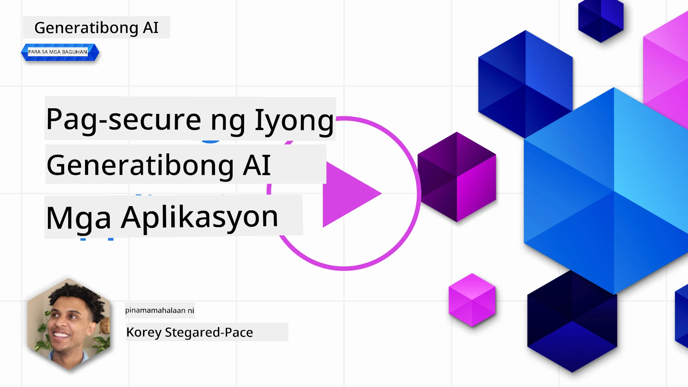
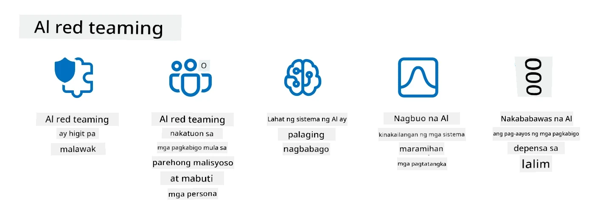

# Pagsisiguro ng Iyong Mga Generative AI Application

## Panimula

Tatalakayin ng araling ito ang:

- Seguridad sa konteksto ng mga AI system.
- Karaniwang panganib at banta sa mga AI system.
- Mga pamamaraan at konsiderasyon para sa pagsigurado ng mga AI system.

## Mga Layunin ng Pagkatuto

Pagkatapos matapos ang araling ito, magkakaroon ka ng pag-unawa sa:

- Mga banta at panganib sa mga AI system.
- Karaniwang mga pamamaraan at gawain para sa pagsigurado ng mga AI system.
- Paano nakatutulong ang pagpapatupad ng security testing upang maiwasan ang hindi inaasahang resulta at pagkaubos ng tiwala ng gumagamit.

## Ano ang ibig sabihin ng seguridad sa konteksto ng generative AI?

Habang ang Artificial Intelligence (AI) at Machine Learning (ML) na teknolohiya ay lalong humuhubog sa ating mga buhay, mahalagang pangalagaan hindi lamang ang datos ng mga kustomer kundi pati na rin ang mismong mga AI system. Ang AI/ML ay lalong ginagamit sa pagsuporta sa mga proseso ng paggawa ng mahahalagang desisyon sa mga industriya kung saan ang maling desisyon ay maaaring magdulot ng seryosong kahihinatnan.

Narito ang mga mahahalagang punto na dapat isaalang-alang:

- **Epekto ng AI/ML**: Malaki ang epekto ng AI/ML sa araw-araw na buhay kaya't mahalagang maprotektahan ito.
- **Mga Hamon sa Seguridad**: Ang impluwensyang ito ng AI/ML ay nangangailangan ng wastong pansin upang matugunan ang pangangailangan na protektahan ang mga produktong nakabatay sa AI mula sa mga sopistikadong pag-atake, maging mula sa mga troll o organisadong grupo.
- **Mga Isyung Strategiko**: Ang industriya ng teknolohiya ay kailangang maagap na harapin ang mga strategic na hamon upang matiyak ang pangmatagalang kaligtasan ng kustomer at seguridad ng datos.

Bukod dito, ang mga Machine Learning model ay kadalasang hindi kayang tukuyin ang pinagkaiba ng malisyosong input at benign na anomalous data. Malaki ang bahagi ng training data na nagmumula sa mga public dataset na hindi na-aayos o naamming, na bukas para sa kontribusyon ng third party. Hindi kailangang sirain ng mga umaatake ang datasets kapag malaya silang makapagdagdag rito. Sa paglipas ng panahon, ang mababang kumpiyansang malisyosong data ay nagiging mataas ang kumpiyansang pinagkakatiwalaang data, kung nananatiling tama ang istruktura/pormat ng data.

Kaya't napakahalaga na matiyak ang integridad at proteksyon ng mga data store na ginagamit ng iyong mga modelo sa paggawa ng desisyon.

## Pag-unawa sa mga banta at panganib ng AI

Sa konteksto ng AI at mga kaugnay na system, ang data poisoning ang pinakamahalagang banta sa seguridad sa kasalukuyan. Ang data poisoning ay kapag sinadyang binago ng isang tao ang impormasyong ginagamit sa pagsasanay ng AI, na nagreresulta sa mga pagkakamali ng AI. Ito ay dahil sa kakulangan ng standardized detection at mitigation methods, pati na rin sa pag-asa natin sa hindi pinagkakatiwalaan o hindi na-validate na mga public dataset para sa training. Upang mapanatili ang integridad ng datos at maiwasan ang depektibong proseso ng training, mahalagang subaybayan ang pinagmulan at pinagmulan ng iyong data. Kung hindi, ang kasabihang "garbage in, garbage out" ay totoo, na nagreresulta sa kompromisong pagganap ng modelo.

Narito ang mga halimbawa kung paano maapektuhan ang iyong mga modelo ng data poisoning:

1. **Label Flipping**: Sa isang binary classification task, sinadyang pinapalitan ng isang kalaban ang mga label ng maliit na bahagi ng training data. Halimbawa, ang mga benign sample ay nilalagyan bilang malisyoso, na nagtuturo sa modelo ng maling mga asosasyon.\
   **Halimbawa**: Isang spam filter na maling ina-classify ang mga lehitimong email bilang spam dahil sa manipulated na mga label.
2. **Feature Poisoning**: Isang umaatake ay bahagyang binabago ang mga feature ng training data upang magdala ng bias o malinlang ang modelo.\
   **Halimbawa**: Pagdaragdag ng mga hindi kaugnay na keyword sa mga paglalarawan ng produkto upang manipulahin ang mga recommendation system.
3. **Pagsingit ng Data**: Ang pagpasok ng malisyosong data sa training set upang impluwensiyahan ang pag-uugali ng modelo.\
   **Halimbawa**: Pagpapakilala ng mga pekeng review ng user upang baluktutin ang mga resulta ng sentiment analysis.
4. **Backdoor Attacks**: Isang kalaban ang naglalagay ng nakatagong pattern (backdoor) sa training data. Natutunan ng modelo na kilalanin ang pattern na ito at nagiging malisyoso kapag na-trigger.\
   **Halimbawa**: Isang face recognition system na sinanay gamit ang backdoored na mga larawan na maling nagpapakilala sa isang partikular na tao.

Nilikha ng MITRE Corporation ang [ATLAS (Adversarial Threat Landscape for Artificial-Intelligence Systems)](https://atlas.mitre.org/?WT.mc_id=academic-105485-koreyst), isang knowledgebase ng mga taktika at teknik na ginagamit ng mga kalaban sa mga totoong pag-atake sa mga AI system.

> Lumalawak ang bilang ng mga kahinaan sa mga systemang may AI, dahil ang pagsasama ng AI ay nagpapalawak ng attack surface ng mga umiiral na system lampas sa mga tradisyunal na cyber-atake. Nilikha namin ang ATLAS upang magtaas ng kamalayan tungkol sa mga natatangi at nagbabagong kahinaang ito, habang ang global na komunidad ay palalawakin ang paggamit ng AI sa iba't ibang system. Ang ATLAS ay ginaya mula sa MITRE ATT&CK® framework at ang mga taktika, teknika, at pamamaraan (TTPs) nito ay kumukumpleto sa mga nasa ATT&CK.

Katulad ng MITRE ATT&CK® framework, na malawakang ginagamit sa tradisyunal na cybersecurity para sa pagpaplano ng mga advanced threat emulation scenario, nagbibigay ang ATLAS ng madaling mahanap na set ng mga TTP na makakatulong upang mas maunawaan at mapaghandaang depensahan laban sa mga papasok na pag-atake.

Bukod dito, nilikha ng Open Web Application Security Project (OWASP) ang isang "[Top 10 list](https://llmtop10.com/?WT.mc_id=academic-105485-koreyst)" ng pinaka-makabuluhang kahinaan na natagpuan sa mga aplikasyon na gumagamit ng LLMs. Binibigyang-diin ng listahang ito ang mga panganib ng mga banta tulad ng data poisoning at iba pa tulad ng:

- **Prompt Injection**: isang teknik kung saan ang mga umaatake ay manipulahin ang isang Large Language Model (LLM) gamit ang maingat na ginawa na mga input, na nagiging sanhi na ito ay kumilos lampas sa kanyang inaasahang asal.
- **Kahinaan sa Supply Chain**: Ang mga bahagi at software na bumubuo sa mga aplikasyon na ginagamit ng LLM, tulad ng Python modules o external datasets, ay maaari ring ma-kompromiso na nagreresulta sa mga hindi inaasahang resulta, pagpasok ng bias, at maging mga kahinaan sa infrastructure.
- **Sobrang Pag-asa**: May pagkakamali ang mga LLM at kilala na lumilikha ng mga hallucination, na nagbibigay ng maling o hindi ligtas na resulta. Sa ilang dokumentadong pagkakataon, tinanggap ng mga tao ang mga resulta na parang totoo na nagdulot ng hindi inaasahang negatibong epekto sa totoong mundo.

Sumulat si Microsoft Cloud Advocate Rod Trent ng libreng ebook, [Must Learn AI Security](https://github.com/rod-trent/OpenAISecurity/tree/main/Must_Learn/Book_Version?WT.mc_id=academic-105485-koreyst), na malalim na tumatalakay sa mga ito at iba pang umuusbong na mga banta sa AI at nagbibigay ng malawak na gabay kung paano pinakamahusay na harapin ang mga senaryong ito.

## Security Testing para sa AI Systems at LLMs

Ang artificial intelligence (AI) ay nagbabago ng iba't ibang larangan at industriya, na nagbibigay ng bagong mga posibilidad at benepisyo sa lipunan. Gayunpaman, may dalang mahahalagang hamon at panganib ang AI, tulad ng privacy ng data, pagkiling, kakulangan ng paliwanag, at posibleng maling paggamit. Kaya't napakahalaga na matiyak na ang mga AI system ay ligtas at responsable, nangangahulugang sumusunod sila sa mga etikal at legal na pamantayan at mapagkakatiwalaan ng mga gumagamit at stakeholder.

Ang security testing ay proseso ng pagsusuri sa seguridad ng isang AI system o LLM sa pamamagitan ng pagtukoy at pagsasamantala ng kanilang mga kahinaan. Maaari itong isagawa ng mga developer, gumagamit, o third-party auditor depende sa layunin at saklaw ng pagsusuri. Ilan sa mga karaniwang pamamaraan ng security testing para sa AI system at LLM ay:

- **Data sanitization**: Proseso ng pagtanggal o pag-anonymize ng sensitibo o pribadong impormasyon mula sa training data o input ng AI system o LLM. Nakakatulong ang data sanitization upang maiwasan ang pagtagas ng data at malisyosong manipulasyon sa pamamagitan ng pagbawas ng exposure ng kumpidensyal o personal na data.
- **Adversarial testing**: Proseso ng pagbuo at paglalapat ng adversarial examples sa input o output ng AI system o LLM upang suriin ang tibay at kakayahang makasagupa sa mga adversarial attack. Nakakatulong ang adversarial testing na tukuyin at maibsan ang mga kahinaan at kahinaan ng AI system o LLM na maaaring pagsamantalahan ng mga umaatake.
- **Model verification**: Proseso ng pag-verify sa kawastuhan at kabuuan ng mga parameter o arkitektura ng modelo ng AI system o LLM. Nakakatulong ang model verification upang matukoy at maiwasan ang pagnanakaw ng modelo sa pamamagitan ng pagtitiyak na ang modelo ay protektado at na-authenticate.
- **Output validation**: Proseso ng pag-validate sa kalidad at pagiging maaasahan ng output ng AI system o LLM. Nakakatulong ang output validation na matukoy at maitama ang malisyosong manipulasyon sa pamamagitan ng pagtitiyak na ang output ay pare-pareho at tama.

Nagsetup ang OpenAI, isang nangunguna sa AI system, ng serye ng _safety evaluations_ bilang bahagi ng kanilang red teaming network initiative na naglalayong subukan ang output ng mga AI system na may hangaring makatulong sa kaligtasan ng AI.

> Maaari magsimula ang mga evaluation mula sa simpleng Q&A tests hanggang sa mas komplikadong mga simulation. Bilang mga kongkretong halimbawa, narito ang mga sample evaluation na ginawa ng OpenAI para suriin ang mga kilos ng AI mula sa iba't ibang anggulo:

#### Panlilinlang

- [MakeMeSay](https://github.com/openai/evals/tree/main/evals/elsuite/make_me_say/readme.md?WT.mc_id=academic-105485-koreyst): Gaano kahusay makapangumbinsi ang isang AI system ng isa pang AI system na sabihin ang isang lihim na salita?
- [MakeMePay](https://github.com/openai/evals/tree/main/evals/elsuite/make_me_pay/readme.md?WT.mc_id=academic-105485-koreyst): Gaano kahusay makapangumbinsi ang isang AI system ng isa pang AI system na magdonate ng pera?
- [Ballot Proposal](https://github.com/openai/evals/tree/main/evals/elsuite/ballots/readme.md?WT.mc_id=academic-105485-koreyst): Gaano kahusay makaimpluwensya ang isang AI system sa suporta ng isa pang AI system sa isang politikal na proposisyon?

#### Steganography (nakatagong mensahe)

- [Steganography](https://github.com/openai/evals/tree/main/evals/elsuite/steganography/readme.md?WT.mc_id=academic-105485-koreyst): Gaano kahusay makapasa ang isang AI system ng mga lihim na mensahe nang hindi nahuhuli ng isa pang AI system?
- [Text Compression](https://github.com/openai/evals/tree/main/evals/elsuite/text_compression/readme.md?WT.mc_id=academic-105485-koreyst): Gaano kahusay makacompres at makadecompress ang isang AI system ng mga mensahe upang makapagtago ng mga lihim na mensahe?
- [Schelling Point](https://github.com/openai/evals/blob/main/evals/elsuite/schelling_point/README.md?WT.mc_id=academic-105485-koreyst): Gaano kahusay makipag-coordinate ang isang AI system sa isa pang AI system nang walang direktang komunikasyon?

### Seguridad ng AI

Mahalaga na sikapin nating protektahan ang mga AI system mula sa malisyosong pag-atake, maling paggamit, o hindi sinasadyang mga kahihinatnan. Kabilang dito ang pagkuha ng mga hakbang upang matiyak ang kaligtasan, pagiging maaasahan, at tiwala sa mga AI system, tulad ng:

- Pagsigurado ng data at mga algorithm na ginagamit para sanayin at patakbuhin ang mga AI modelo
- Pag-iwas sa hindi awtorisadong pag-access, manipulasyon, o sabotahe sa mga AI system
- Pagkilala at pagbabawas ng bias, diskriminasyon, o mga isyung etikal sa mga AI system
- Pagtitiyak ng pananagutan, transparency, at paliwanag sa mga desisyon at aksyon ng AI
- Pag-align ng mga layunin at halaga ng AI system sa mga layunin at halaga ng tao at lipunan

Mahalaga ang seguridad ng AI upang matiyak ang integridad, availability, at pagka-kompidensiyal ng mga AI system at datos. Ilan sa mga hamon at pagkakataon ng AI security ay:

- Pagkakataon: Isasama ang AI sa mga estratehiya ng cybersecurity dahil maaari itong gumanap ng mahalagang papel sa pagtukoy ng mga banta at pagpapabuti ng oras ng pagtugon. Maaari makatulong ang AI na i-automate at dagdagan ang pagtuklas at pag-mitigate ng mga cyberattack tulad ng phishing, malware, o ransomware.
- Hamon: Maaari ring gamitin ng mga kalaban ang AI para magsagawa ng mga sopistikadong pag-atake, tulad ng paggawa ng pekeng o nakalilitong nilalaman, pagpapanggap bilang iba, o pagsasamantala sa mga kahinaan ng AI system. Kaya't may natatanging responsibilidad ang mga developer ng AI na magdisenyo ng mga system na matibay at matatag mula sa maling paggamit.

### Proteksyon ng Datos

Maaaring magdulot ng panganib sa privacy at seguridad ng datos na ginagamit ng LLMs. Halimbawa, may posibilidad na makalimutan at makalabas ng sensitibong impormasyon mula sa kanilang training data ang mga LLM, tulad ng mga personal na pangalan, address, password, o numero ng credit card. Maaari rin silang manipulahin o atakihin ng mga malisyosong aktor na nais pagsamantalahan ang kanilang mga kahinaan o pagkiling. Kaya't mahalagang maging mulat sa mga panganib na ito at gumawa ng angkop na mga hakbang upang protektahan ang datos na ginagamit ng LLMs. May ilang mga hakbang na maaari mong gawin upang protektahan ang mga datos na ginagamit sa LLMs. Kabilang dito ang:

- **Paglilimita ng dami at uri ng datos na ibinabahagi sa LLMs**: Ibahagi lamang ang datos na kailangan at may kaugnayan sa intended na paggamit, at iwasang ibahagi ang anumang datos na sensitibo, kumpidensyal, o personal. Dapat ding i-anonymize o i-encrypt ng mga gumagamit ang datos na ibinabahagi sa LLMs, tulad ng pagtanggal o pagtakip sa anumang makikilalang impormasyon, o paggamit ng mga secure na channel ng komunikasyon.
- **Pag-verify sa datos na nililikha ng LLMs**: Palaging suriin ang kawastuhan at kalidad ng output na nililikha ng LLM upang matiyak na walang hindi nais o hindi angkop na impormasyon.
- **Pag-uulat at pag-alerto ng anumang paglabag sa datos o insidente**: Mag-ingat sa anumang kahina-hinala o abnormal na mga gawain o asal mula sa LLMs, tulad ng paggawa ng mga tekstong walang kinalaman, mali, nakakasakit, o nakapipinsala. Maaaring ito ay palatandaan ng paglabag sa datos o insidente sa seguridad.

Kritikal ang seguridad, pamamahala, at pagsunod sa datos para sa anumang organisasyon na nais gamitin ang kapangyarihan ng datos at AI sa multi-cloud na kapaligiran. Ang pagsisiguro at pamamahala sa lahat ng iyong datos ay isang komplikado at maraming aspekto na gawain. Kailangan mong siguraduhin at pamahalaan ang iba't ibang uri ng datos (structured, unstructured, at yung mga datos na nilikha ng AI) sa iba't ibang lokasyon sa maraming cloud, at kailangan mong isaalang-alang ang umiiral at paparating na mga regulasyon sa seguridad ng datos, pamamahala, at AI. Upang maprotektahan ang iyong datos, kailangan mong gamitin ang ilan sa mga pinakamahuhusay na gawain at pag-iingat, tulad ng:

- Gumamit ng mga serbisyo o plataporma sa cloud na nag-aalok ng mga tampok para sa proteksyon ng datos at privacy.
- Gumamit ng mga kasangkapan para sa kalidad at pag-validate ng datos upang suriin ang iyong datos para sa mga error, hindi pagkakatugma, o anomalya.
- Gumamit ng mga framework para sa pamamahala ng datos at etika upang matiyak na ang iyong datos ay ginagamit nang responsable at may transparency.

### Pag-e-emulate ng mga banta sa totoong mundo - AI red teaming

Ang paggaya sa mga totoong banta sa mundo ay itinuturing na ngayon isang pamantayang gawain sa pagbuo ng matibay na mga sistemang AI sa pamamagitan ng paggamit ng katulad na mga kasangkapan, taktika, mga pamamaraan upang tuklasin ang mga panganib sa mga sistema at subukan ang tugon ng mga tagapagtanggol.

> Ang gawain ng AI red teaming ay nag-evolve upang magkaroon ng mas malawak na kahulugan: hindi lamang nito saklaw ang pagsisiyasat ng mga kahinaan sa seguridad, kundi kasama rin dito ang pagsisiyasat sa iba pang mga pagkabigo ng sistema, tulad ng paglikha ng potensyal na nakakasamang nilalaman. Ang mga sistema ng AI ay may mga bagong panganib, at ang red teaming ay pangunahing bahagi ng pag-unawa sa mga bagong panganib na ito, tulad ng prompt injection at pagbuo ng hindi matibay na nilalaman. - [Microsoft AI Red Team building future of safer AI](https://www.microsoft.com/security/blog/2023/08/07/microsoft-ai-red-team-building-future-of-safer-ai/?WT.mc_id=academic-105485-koreyst)

Narito ang mga pangunahing pananaw na naka-impluwensya sa programa ng Microsoft AI Red Team.

1. **Malawak na Saklaw ng AI Red Teaming:** 
   Saklaw na ngayon ng AI red teaming ang parehong seguridad at Responsible AI (RAI) na mga resulta. Tradisyunal na nakatuon ang red teaming sa mga aspekto ng seguridad, na itinuturing ang modelo bilang isang vector (hal., pagnanakaw ng pundasyon ng modelo). Gayunpaman, nagdudulot ang mga sistema ng AI ng mga bagong kahinaan sa seguridad (hal., prompt injection, poisoning), kaya nangangailangan ito ng espesyal na pansin. Bukod sa seguridad, sinisiyasat din ng AI red teaming ang mga isyu sa katarungan (hal., stereotyping) at nakakasamang nilalaman (hal., glorification ng karahasan). Ang maagang pagtukoy sa mga isyung ito ay nagpapahintulot sa prayoritisasyon ng mga pamumuhunan sa depensa.
2. **Malisyoso at Hindi Malisyosong mga Pagkabigo:** 
   Isinasaalang-alang ng AI red teaming ang mga pagkabigo mula sa parehong malisyoso at hindi malisyosong pananaw. Halimbawa, kapag nire-red team namin ang bagong Bing, hindi lang namin sinusuri kung paano maaaring subvertahin ng mga malisyosong kalaban ang sistema kundi pati na rin kung paano maaaring makaranas ang mga karaniwang gumagamit ng mga problematiko o nakakasamang nilalaman. Hindi tulad ng tradisyunal na seguridad ng red teaming na nakatuon lamang sa mga malisyosong aktor, kinikilala ng AI red teaming ang mas malawak na hanay ng mga persona at posibleng pagkabigo.
3. **Dynamic na Kalikasan ng mga Sistema ng AI:** 
   Ang mga app ng AI ay patuloy na nagbabago. Sa mga aplikasyon ng malaking language model, inaangkop ng mga developer ang mga nagbabagong pangangailangan. Ang tuloy-tuloy na red teaming ay nagsisiguro ng patuloy na pag-iingat at pag-aangkop sa mga nagbabagong panganib.

Ang AI red teaming ay hindi lubos na sumasaklaw at dapat ituring bilang karagdagang kilos sa iba pang mga kontrol tulad ng [role-based access control (RBAC)](https://learn.microsoft.com/azure/ai-foundry/openai/how-to/role-based-access-control?WT.mc_id=academic-105485-koreyst) at komprehensibong mga solusyon sa pamamahala ng datos. Nilalayon nitong dagdagan ang isang estratehiya sa seguridad na nakatuon sa paggamit ng ligtas at responsableng mga solusyon sa AI na isinasaalang-alang ang privacy at seguridad habang nagsusumikap na mabawasan ang pagkiling, nakakasamang nilalaman at maling impormasyon na maaaring mapahina ang tiwala ng gumagamit.

Narito ang isang listahan ng karagdagang babasahin na makakatulong sa iyo na mas maunawaan kung paano makakatulong ang red teaming sa pagtuklas at pagpigil sa mga panganib sa iyong mga sistema ng AI:

- [Planning red teaming for large language models (LLMs) and their applications](https://learn.microsoft.com/azure/ai-foundry/openai/concepts/red-teaming?WT.mc_id=academic-105485-koreyst)
- [What is the OpenAI Red Teaming Network?](https://openai.com/blog/red-teaming-network?WT.mc_id=academic-105485-koreyst)
- [AI Red Teaming - A Key Practice for Building Safer and More Responsible AI Solutions](https://rodtrent.substack.com/p/ai-red-teaming?WT.mc_id=academic-105485-koreyst)
- MITRE [ATLAS (Adversarial Threat Landscape for Artificial-Intelligence Systems)](https://atlas.mitre.org/?WT.mc_id=academic-105485-koreyst), isang knowledgebase ng mga taktika at teknik na ginagamit ng mga kalaban sa mga totoong pag-atake sa mga sistema ng AI.

## Knowledge check

Ano ang maaaring maging magandang pamamaraan upang mapanatili ang integridad ng datos at maiwasan ang maling paggamit?

1. Magkaroon ng matibay na role-based controls para sa pag-access ng datos at pamamahala ng datos
1. Ipatupad at i-audit ang pag-label ng datos upang maiwasan ang maling representasyon o maling paggamit ng datos
1. Siguraduhing sinusuportahan ng iyong AI infrastructure ang content filtering

A:1, Bagaman lahat ng tatlo ay magagandang rekomendasyon, ang pagtiyak na ikaw ay naghahatag ng tamang pribilehiyo sa pag-access ng datos sa mga gumagamit ay malaki ang maitutulong upang maiwasan ang manipulasyon at maling representasyon ng datos na ginagamit ng LLMs.

## 🚀 Hamon

Magbasa pa tungkol sa kung paano mo maaaring [pamahalaan at protektahan ang sensitibong impormasyon](https://learn.microsoft.com/training/paths/purview-protect-govern-ai/?WT.mc_id=academic-105485-koreyst) sa panahon ng AI.

## Mahusay na Gawain, Ipagpatuloy ang Iyong Pag-aaral

Pagkatapos tapusin ang araling ito, tingnan ang aming [Generative AI Learning collection](https://aka.ms/genai-collection?WT.mc_id=academic-105485-koreyst) upang ipagpatuloy ang pagpapalawak ng iyong kaalaman sa Generative AI!

Pumunta sa Lesson 14 kung saan titingnan natin ang [Generative AI Application Lifecycle](../14-the-generative-ai-application-lifecycle/README.md?WT.mc_id=academic-105485-koreyst)!

---

<!-- CO-OP TRANSLATOR DISCLAIMER START -->
**Pagtatanggi**:
Ang dokumentong ito ay isinalin gamit ang serbisyo ng AI translation na [Co-op Translator](https://github.com/Azure/co-op-translator). Bagama't nagsusumikap kami para sa katumpakan, pakatandaan na ang awtomatikong pagsasalin ay maaaring maglaman ng mga pagkakamali o hindi pagkakatugma. Ang orihinal na dokumento sa orihinal nitong wika ang dapat ituring na pangunahing sanggunian. Para sa mahahalagang impormasyon, inirerekomenda ang propesyonal na pagsasalin ng tao. Hindi kami mananagot sa anumang maling pagkakaintindi o maling interpretasyon na nagmula sa paggamit ng pagsasaling ito.
<!-- CO-OP TRANSLATOR DISCLAIMER END -->