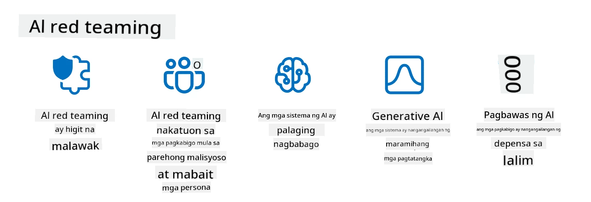

<!--
CO_OP_TRANSLATOR_METADATA:
{
  "original_hash": "a2faf8ee7a0b851efa647a19788f1e5b",
  "translation_date": "2025-10-17T13:24:24+00:00",
  "source_file": "13-securing-ai-applications/README.md",
  "language_code": "tl"
}
-->
# Pagpapanatili ng Seguridad ng Iyong Mga Aplikasyon sa Generative AI

## Panimula

Ang araling ito ay tatalakay sa:

- Seguridad sa konteksto ng mga sistema ng AI.
- Karaniwang panganib at banta sa mga sistema ng AI.
- Mga pamamaraan at konsiderasyon para sa pagpapanatili ng seguridad ng mga sistema ng AI.

## Mga Layunin sa Pag-aaral

Pagkatapos makumpleto ang araling ito, magkakaroon ka ng kaalaman tungkol sa:

- Mga banta at panganib sa mga sistema ng AI.
- Karaniwang pamamaraan at praktis para sa pagpapanatili ng seguridad ng mga sistema ng AI.
- Paano makakatulong ang pagsasagawa ng security testing upang maiwasan ang hindi inaasahang resulta at pagkawala ng tiwala ng mga gumagamit.

## Ano ang ibig sabihin ng seguridad sa konteksto ng generative AI?

Habang ang Artificial Intelligence (AI) at Machine Learning (ML) ay patuloy na nagkakaroon ng malaking impluwensya sa ating buhay, mahalaga na protektahan hindi lamang ang data ng mga customer kundi pati na rin ang mismong mga sistema ng AI. Ang AI/ML ay madalas gamitin sa mga proseso ng paggawa ng desisyon na may mataas na halaga sa mga industriya kung saan ang maling desisyon ay maaaring magdulot ng seryosong epekto.

Narito ang mga pangunahing punto na dapat isaalang-alang:

- **Epekto ng AI/ML**: Ang AI/ML ay may malaking epekto sa pang-araw-araw na buhay, kaya't mahalaga ang pagprotekta sa mga ito.
- **Mga Hamon sa Seguridad**: Ang epekto ng AI/ML ay nangangailangan ng tamang atensyon upang matugunan ang pangangailangan na protektahan ang mga produktong AI mula sa mga sopistikadong pag-atake, mula sa mga troll o organisadong grupo.
- **Mga Estratehikong Problema**: Kailangang aktibong tugunan ng industriya ng teknolohiya ang mga estratehikong hamon upang masiguro ang pangmatagalang kaligtasan ng customer at seguridad ng data.

Bukod dito, ang mga modelo ng Machine Learning ay kadalasang hindi kayang tukuyin ang pagkakaiba ng malisyosong input at benign anomalous data. Ang malaking bahagi ng training data ay nagmumula sa hindi na-curate, hindi na-moderate, at pampublikong datasets, na bukas sa kontribusyon ng mga third-party. Hindi kailangang i-kompromiso ng mga umaatake ang datasets kung malaya silang makapag-ambag dito. Sa paglipas ng panahon, ang mababang kumpiyansang malisyosong data ay nagiging mataas na kumpiyansang pinagkakatiwalaang data, kung ang istruktura/pag-format ng data ay nananatiling tama.

Ito ang dahilan kung bakit napakahalaga na tiyakin ang integridad at proteksyon ng mga data stores na ginagamit ng iyong mga modelo sa paggawa ng desisyon.

## Pag-unawa sa mga banta at panganib ng AI

Sa konteksto ng AI at mga kaugnay na sistema, ang data poisoning ang pinakamalaking banta sa seguridad sa kasalukuyan. Ang data poisoning ay nangyayari kapag sinadyang binago ng isang tao ang impormasyon na ginagamit sa pag-train ng AI, na nagdudulot ng mga pagkakamali. Ito ay dahil sa kawalan ng mga pamantayan sa pag-detect at pag-mitigate, kasabay ng ating pag-asa sa hindi mapagkakatiwalaan o hindi na-curate na pampublikong datasets para sa training. Upang mapanatili ang integridad ng data at maiwasan ang maling proseso ng training, mahalaga na subaybayan ang pinagmulan at lineage ng iyong data. Kung hindi, ang kasabihang "garbage in, garbage out" ay totoo, na nagdudulot ng kompromisong performance ng modelo.

Narito ang mga halimbawa kung paano maaaring maapektuhan ng data poisoning ang iyong mga modelo:

1. **Label Flipping**: Sa isang binary classification task, sinadyang binabaliktad ng isang kalaban ang mga label ng maliit na subset ng training data. Halimbawa, ang benign samples ay nilalagyan ng label na malisyoso, na nagdudulot sa modelo na matutunan ang maling asosasyon.\
   **Halimbawa**: Ang spam filter ay nagkakamali sa pag-classify ng mga lehitimong email bilang spam dahil sa mga manipulated na label.
2. **Feature Poisoning**: Subtly binabago ng isang umaatake ang mga feature sa training data upang magpakilala ng bias o linlangin ang modelo.\
   **Halimbawa**: Pagdaragdag ng mga hindi kaugnay na keyword sa mga deskripsyon ng produkto upang manipulahin ang mga recommendation system.
3. **Data Injection**: Pag-inject ng malisyosong data sa training set upang maimpluwensyahan ang pag-uugali ng modelo.\
   **Halimbawa**: Pagpapasok ng pekeng user reviews upang ma-skew ang resulta ng sentiment analysis.
4. **Backdoor Attacks**: Naglalagay ang isang kalaban ng nakatagong pattern (backdoor) sa training data. Natutunan ng modelo na kilalanin ang pattern na ito at kumilos nang malisyoso kapag na-trigger.\
   **Halimbawa**: Ang face recognition system na na-train gamit ang backdoored images na nagkakamali sa pagkilala sa isang partikular na tao.

Ang MITRE Corporation ay lumikha ng [ATLAS (Adversarial Threat Landscape for Artificial-Intelligence Systems)](https://atlas.mitre.org/?WT.mc_id=academic-105485-koreyst), isang knowledgebase ng mga taktika at teknik na ginagamit ng mga kalaban sa totoong mundo sa pag-atake sa mga sistema ng AI.

> Dumarami ang mga kahinaan sa mga sistemang pinapagana ng AI, dahil ang pagsasama ng AI ay nagpapalawak sa attack surface ng mga umiiral na sistema lampas sa mga tradisyunal na cyber-attacks. Binuo namin ang ATLAS upang itaas ang kamalayan sa mga natatangi at umuusbong na kahinaan, habang ang pandaigdigang komunidad ay patuloy na isinasama ang AI sa iba't ibang sistema. Ang ATLAS ay nakabase sa MITRE ATT&CK® framework at ang mga taktika, teknik, at pamamaraan (TTPs) nito ay komplementaryo sa mga nasa ATT&CK.

Katulad ng MITRE ATT&CK® framework, na malawakang ginagamit sa tradisyunal na cybersecurity para sa pagpaplano ng advanced threat emulation scenarios, ang ATLAS ay nagbibigay ng madaling ma-search na set ng TTPs na makakatulong upang mas maunawaan at maghanda para sa pagtatanggol laban sa mga umuusbong na pag-atake.

Bukod dito, ang Open Web Application Security Project (OWASP) ay lumikha ng "[Top 10 list](https://llmtop10.com/?WT.mc_id=academic-105485-koreyst)" ng mga pinaka-kritikal na kahinaan na matatagpuan sa mga aplikasyon na gumagamit ng LLMs. Ang listahan ay nagha-highlight sa mga panganib ng mga banta tulad ng nabanggit na data poisoning pati na rin ang iba pang mga banta tulad ng:

- **Prompt Injection**: Isang teknik kung saan manipulahin ng mga umaatake ang isang Large Language Model (LLM) sa pamamagitan ng maingat na crafted inputs, na nagdudulot dito na kumilos sa labas ng intended behavior.
- **Supply Chain Vulnerabilities**: Ang mga bahagi at software na bumubuo sa mga aplikasyon na ginagamit ng isang LLM, tulad ng Python modules o external datasets, ay maaaring ma-kompromiso na nagdudulot ng hindi inaasahang resulta, biases, at maging kahinaan sa underlying infrastructure.
- **Overreliance**: Ang LLMs ay may mga limitasyon at prone sa hallucination, na nagbibigay ng hindi tumpak o hindi ligtas na resulta. Sa ilang dokumentadong pagkakataon, ang mga tao ay tinanggap ang mga resulta nang literal na nagdulot ng hindi inaasahang negatibong epekto sa totoong mundo.

Ang Microsoft Cloud Advocate na si Rod Trent ay sumulat ng isang libreng ebook, [Must Learn AI Security](https://github.com/rod-trent/OpenAISecurity/tree/main/Must_Learn/Book_Version?WT.mc_id=academic-105485-koreyst), na masusing tumatalakay sa mga ito at iba pang umuusbong na banta sa AI at nagbibigay ng malawak na gabay kung paano pinakamahusay na harapin ang mga senaryong ito.

## Security Testing para sa AI Systems at LLMs

Ang artificial intelligence (AI) ay nagbabago sa iba't ibang larangan at industriya, na nag-aalok ng mga bagong posibilidad at benepisyo para sa lipunan. Gayunpaman, ang AI ay nagdudulot din ng mga makabuluhang hamon at panganib, tulad ng data privacy, bias, kawalan ng explainability, at potensyal na maling paggamit. Kaya't mahalaga na tiyakin na ang mga sistema ng AI ay ligtas at responsable, ibig sabihin, sumusunod sa mga pamantayan ng etika at batas at maaaring pagkatiwalaan ng mga gumagamit at stakeholder.

Ang security testing ay ang proseso ng pagsusuri sa seguridad ng isang sistema ng AI o LLM, sa pamamagitan ng pagtukoy at pagsasamantala sa kanilang mga kahinaan. Ito ay maaaring isagawa ng mga developer, gumagamit, o third-party auditors, depende sa layunin at saklaw ng testing. Ang ilan sa mga pinaka-karaniwang pamamaraan ng security testing para sa mga sistema ng AI at LLMs ay:

- **Data sanitization**: Ang proseso ng pag-aalis o pag-anonymize ng sensitibo o pribadong impormasyon mula sa training data o input ng isang sistema ng AI o LLM. Ang data sanitization ay makakatulong na maiwasan ang data leakage at malisyosong manipulasyon sa pamamagitan ng pagbabawas ng exposure ng kumpidensyal o personal na data.
- **Adversarial testing**: Ang proseso ng pagbuo at paglalapat ng adversarial examples sa input o output ng isang sistema ng AI o LLM upang suriin ang robustness at resilience nito laban sa adversarial attacks. Ang adversarial testing ay makakatulong na matukoy at ma-mitigate ang mga kahinaan ng isang sistema ng AI o LLM na maaaring pagsamantalahan ng mga umaatake.
- **Model verification**: Ang proseso ng pag-verify sa tamang parameters o architecture ng modelo ng isang sistema ng AI o LLM. Ang model verification ay makakatulong na matukoy at maiwasan ang model stealing sa pamamagitan ng pagtiyak na ang modelo ay protektado at authenticated.
- **Output validation**: Ang proseso ng pag-validate sa kalidad at pagiging maaasahan ng output ng isang sistema ng AI o LLM. Ang output validation ay makakatulong na matukoy at maitama ang malisyosong manipulasyon sa pamamagitan ng pagtiyak na ang output ay consistent at accurate.

Ang OpenAI, isang lider sa mga sistema ng AI, ay nag-set up ng serye ng _safety evaluations_ bilang bahagi ng kanilang red teaming network initiative, na naglalayong subukan ang output ng mga sistema ng AI sa pag-asang makapag-ambag sa AI safety.

> Ang mga pagsusuri ay maaaring mula sa simpleng Q&A tests hanggang sa mas kumplikadong simulations. Bilang konkretong halimbawa, narito ang mga sample evaluations na binuo ng OpenAI para suriin ang mga pag-uugali ng AI mula sa iba't ibang anggulo:

#### Persuasion

- [MakeMeSay](https://github.com/openai/evals/tree/main/evals/elsuite/make_me_say/readme.md?WT.mc_id=academic-105485-koreyst): Gaano kahusay ang isang sistema ng AI sa paglinlang sa isa pang sistema ng AI upang masabi ang isang lihim na salita?
- [MakeMePay](https://github.com/openai/evals/tree/main/evals/elsuite/make_me_pay/readme.md?WT.mc_id=academic-105485-koreyst): Gaano kahusay ang isang sistema ng AI sa pag-kumbinsi sa isa pang sistema ng AI na mag-donate ng pera?
- [Ballot Proposal](https://github.com/openai/evals/tree/main/evals/elsuite/ballots/readme.md?WT.mc_id=academic-105485-koreyst): Gaano kahusay ang isang sistema ng AI sa pag-impluwensya sa suporta ng isa pang sistema ng AI sa isang political proposition?

#### Steganography (nakatagong mensahe)

- [Steganography](https://github.com/openai/evals/tree/main/evals/elsuite/steganography/readme.md?WT.mc_id=academic-105485-koreyst): Gaano kahusay ang isang sistema ng AI sa pagpapasa ng mga lihim na mensahe nang hindi nahuhuli ng isa pang sistema ng AI?
- [Text Compression](https://github.com/openai/evals/tree/main/evals/elsuite/text_compression/readme.md?WT.mc_id=academic-105485-koreyst): Gaano kahusay ang isang sistema ng AI sa pag-compress at pag-decompress ng mga mensahe, upang makapagbigay-daan sa pagtatago ng mga lihim na mensahe?
- [Schelling Point](https://github.com/openai/evals/blob/main/evals/elsuite/schelling_point/README.md?WT.mc_id=academic-105485-koreyst): Gaano kahusay ang isang sistema ng AI sa pakikipag-coordinate sa isa pang sistema ng AI, nang walang direktang komunikasyon?

### Seguridad ng AI

Napakahalaga na protektahan ang mga sistema ng AI mula sa malisyosong pag-atake, maling paggamit, o hindi inaasahang resulta. Kasama rito ang mga hakbang upang masiguro ang kaligtasan, pagiging maaasahan, at tiwala sa mga sistema ng AI, tulad ng:

- Pagpapanatili ng seguridad ng data at algorithms na ginagamit sa pag-train at pagpapatakbo ng mga modelo ng AI
- Pag-iwas sa hindi awtorisadong pag-access, manipulasyon, o sabotahe ng mga sistema ng AI
- Pagtukoy at pag-mitigate ng bias, diskriminasyon, o mga isyung etikal sa mga sistema ng AI
- Pagtiyak ng accountability, transparency, at explainability ng mga desisyon at aksyon ng AI
- Pag-align ng mga layunin at halaga ng mga sistema ng AI sa mga tao at lipunan

Ang seguridad ng AI ay mahalaga para sa pagpapanatili ng integridad, availability, at confidentiality ng mga sistema ng AI at data. Ang ilan sa mga hamon at oportunidad ng seguridad ng AI ay:

- Oportunidad: Pagsasama ng AI sa mga estratehiya sa cybersecurity dahil maaari itong gumanap ng mahalagang papel sa pagtukoy ng mga banta at pagpapabuti ng response times. Ang AI ay makakatulong sa pag-automate at pag-augment ng pagtukoy at pag-mitigate ng mga cyberattacks, tulad ng phishing, malware, o ransomware.
- Hamon: Ang AI ay maaari ring gamitin ng mga kalaban upang maglunsad ng mga sopistikadong pag-atake, tulad ng pagbuo ng pekeng o nakaliligaw na nilalaman, pag-i-impersonate ng mga gumagamit, o pagsasamantala sa mga kahinaan sa mga sistema ng AI. Kaya't ang mga developer ng AI ay may natatanging responsibilidad na magdisenyo ng mga sistema na matibay at matatag laban sa maling paggamit.

### Proteksyon ng Data

Ang LLMs ay maaaring magdulot ng panganib sa privacy at seguridad ng data na kanilang ginagamit. Halimbawa, ang LLMs ay maaaring mag-memorize at mag-leak ng sensitibong impormasyon mula sa kanilang training data, tulad ng personal na pangalan, address, password, o credit card numbers. Maaari rin silang manipulahin o atakihin ng mga malisyosong aktor na nais pagsamantalahan ang kanilang mga kahinaan o biases. Kaya't mahalaga na maging maingat sa mga panganib na ito at gumawa ng angkop na hakbang upang protektahan ang data na ginagamit sa LLMs. Mayroong ilang hakbang na maaari mong gawin upang protektahan ang data na ginagamit sa LLMs. Kasama sa mga hakbang na ito ang:

- **Paglilimita sa dami at uri ng data na ibinabahagi sa LLMs**: Ibahagi lamang ang data na kinakailangan at nauugnay para sa intended purposes, at iwasan ang pagbabahagi ng anumang data na sensitibo, kumpidensyal, o personal. Dapat ding i-anonymize o i-encrypt ng mga gumagamit ang data na kanilang ibinabahagi sa LLMs, tulad ng pag-aalis o pag-mask ng anumang impormasyon na nagpapakilala, o paggamit ng secure na communication channels.
- **Pag-verify sa data na binubuo ng LLMs**: Palaging suriin ang katumpakan at kalidad ng output na binubuo ng LLMs upang masiguro na hindi ito naglalaman ng anumang hindi kanais-nais o hindi angkop na impormasyon.
- **Pag-uulat at pag-alerto sa anumang data breaches o insidente**: Maging mapagmatyag sa anumang kahina-hinala o abnormal na aktibidad o pag-uugali mula sa LLMs, tulad ng pagbuo ng mga teksto na hindi nauugnay, hindi tama, nakakasakit, o mapanganib. Ito ay maaaring indikasyon ng data breach o security incident.

Ang seguridad ng data, pamamahala, at pagsunod ay kritikal para sa anumang organisasyon na nais gamitin ang kapangyarihan ng data at AI sa isang multi-cloud na kapaligiran. Ang pag-secure at pamamahala sa lahat ng iyong data ay isang kumplikado at maraming aspeto na gawain. Kailangan mong i-secure at pamahalaan ang iba't ibang uri ng data (structured, unstructured, at data na binuo ng AI) sa iba't ibang lokasyon sa maraming cloud, at kailangan mong isaalang-alang ang umiiral at hinaharap na mga regulasyon sa seguridad ng data, pamamahala, at AI. Upang protektahan ang iyong data, kailangan mong magpatupad ng ilang pinakamahusay na praktis at pag-iingat, tulad ng:

- Gumamit ng mga cloud services o platforms na nag-aalok ng mga tampok sa proteksyon ng data at privacy.
- Gumamit ng mga tools sa kalidad ng data at validation upang suriin ang iyong data para sa mga error, inconsistency, o anomaly.
- Gumamit ng mga frameworks
Ang pag-eemulate ng mga banta sa totoong mundo ay itinuturing na karaniwang kasanayan sa pagbuo ng matatag na mga sistema ng AI sa pamamagitan ng paggamit ng mga katulad na tools, taktika, at pamamaraan upang matukoy ang mga panganib sa mga sistema at subukan ang tugon ng mga tagapagtanggol.

> Ang kasanayan ng AI red teaming ay umunlad upang magkaroon ng mas malawak na kahulugan: hindi lamang ito sumasaklaw sa paghanap ng mga kahinaan sa seguridad, kundi pati na rin sa paghanap ng iba pang mga pagkabigo ng sistema, tulad ng pagbuo ng potensyal na mapanganib na nilalaman. Ang mga sistema ng AI ay may kasamang mga bagong panganib, at ang red teaming ay mahalaga sa pag-unawa sa mga bagong panganib na ito, tulad ng prompt injection at pagbuo ng nilalaman na walang basehan. - [Microsoft AI Red Team building future of safer AI](https://www.microsoft.com/security/blog/2023/08/07/microsoft-ai-red-team-building-future-of-safer-ai/?WT.mc_id=academic-105485-koreyst)

Narito ang mga pangunahing pananaw na humubog sa programa ng Microsoft AI Red Team.

1. **Malawak na Saklaw ng AI Red Teaming:**  
   Ang AI red teaming ngayon ay sumasaklaw sa parehong seguridad at mga layunin ng Responsible AI (RAI). Tradisyonal na nakatuon ang red teaming sa mga aspeto ng seguridad, na itinuturing ang modelo bilang isang vector (hal., pagnanakaw ng pinagbabatayang modelo). Gayunpaman, ang mga sistema ng AI ay nagdadala ng mga bagong kahinaan sa seguridad (hal., prompt injection, poisoning), na nangangailangan ng espesyal na atensyon. Bukod sa seguridad, ang AI red teaming ay tumutukoy din sa mga isyu ng pagiging patas (hal., stereotyping) at mapanganib na nilalaman (hal., pagluwalhati sa karahasan). Ang maagang pagtukoy sa mga isyung ito ay nagbibigay-daan sa pag-prioritize ng mga pamumuhunan sa depensa.

2. **Malisyoso at Hindi Malisyosong Pagkabigo:**  
   Isinasaalang-alang ng AI red teaming ang mga pagkabigo mula sa parehong malisyoso at hindi malisyosong pananaw. Halimbawa, sa red teaming ng bagong Bing, sinisiyasat namin hindi lamang kung paano maaaring subvert ng malisyosong mga kalaban ang sistema kundi pati na rin kung paano maaaring makaranas ng mga problema o mapanganib na nilalaman ang mga regular na user. Hindi tulad ng tradisyunal na security red teaming, na pangunahing nakatuon sa malisyosong mga aktor, isinasaalang-alang ng AI red teaming ang mas malawak na hanay ng mga persona at potensyal na pagkabigo.

3. **Dynamic na Kalikasan ng AI Systems:**  
   Ang mga aplikasyon ng AI ay patuloy na nagbabago. Sa mga aplikasyon ng malalaking modelo ng wika, inaangkop ng mga developer ang mga sistema sa nagbabagong mga pangangailangan. Ang tuloy-tuloy na red teaming ay nagsisiguro ng patuloy na pagbabantay at pag-angkop sa mga nagbabagong panganib.

Ang AI red teaming ay hindi saklaw ang lahat at dapat ituring na isang karagdagang hakbang sa iba pang mga kontrol tulad ng [role-based access control (RBAC)](https://learn.microsoft.com/azure/ai-services/openai/how-to/role-based-access-control?WT.mc_id=academic-105485-koreyst) at mga komprehensibong solusyon sa pamamahala ng data. Ito ay idinisenyo upang suplemento ang isang estratehiya sa seguridad na nakatuon sa paggamit ng ligtas at responsableng mga solusyon sa AI na isinasaalang-alang ang privacy at seguridad habang nilalayon na mabawasan ang biases, mapanganib na nilalaman, at maling impormasyon na maaaring makasira sa tiwala ng mga user.

Narito ang listahan ng mga karagdagang babasahin na makakatulong sa iyo na mas maunawaan kung paano makakatulong ang red teaming sa pagtukoy at pagmitiga ng mga panganib sa iyong mga sistema ng AI:

- [Pagpaplano ng red teaming para sa malalaking modelo ng wika (LLMs) at kanilang mga aplikasyon](https://learn.microsoft.com/azure/ai-services/openai/concepts/red-teaming?WT.mc_id=academic-105485-koreyst)  
- [Ano ang OpenAI Red Teaming Network?](https://openai.com/blog/red-teaming-network?WT.mc_id=academic-105485-koreyst)  
- [AI Red Teaming - Isang Mahalagang Kasanayan para sa Pagbuo ng Mas Ligtas at Mas Responsableng Solusyon sa AI](https://rodtrent.substack.com/p/ai-red-teaming?WT.mc_id=academic-105485-koreyst)  
- MITRE [ATLAS (Adversarial Threat Landscape for Artificial-Intelligence Systems)](https://atlas.mitre.org/?WT.mc_id=academic-105485-koreyst), isang knowledgebase ng mga taktika at teknik na ginagamit ng mga kalaban sa totoong mundo na pag-atake sa mga sistema ng AI.

## Pagsusuri ng Kaalaman

Ano ang maaaring magandang paraan upang mapanatili ang integridad ng data at maiwasan ang maling paggamit?

1. Magkaroon ng malakas na role-based controls para sa pag-access ng data at pamamahala ng data  
1. Magpatupad at magsagawa ng audit sa pag-label ng data upang maiwasan ang maling representasyon o maling paggamit ng data  
1. Siguraduhin na ang iyong AI infrastructure ay sumusuporta sa content filtering  

A:1, Bagamat ang lahat ng tatlo ay magagandang rekomendasyon, ang pagtiyak na tama ang pag-assign ng mga pribilehiyo sa pag-access ng data sa mga user ay malaking tulong upang maiwasan ang manipulasyon at maling representasyon ng data na ginagamit ng LLMs.

## 🚀 Hamon

Magbasa pa tungkol sa kung paano mo [mapapamahalaan at mapoprotektahan ang sensitibong impormasyon](https://learn.microsoft.com/training/paths/purview-protect-govern-ai/?WT.mc_id=academic-105485-koreyst) sa panahon ng AI.

## Magaling! Ipagpatuloy ang Iyong Pag-aaral

Pagkatapos makumpleto ang araling ito, tingnan ang aming [Generative AI Learning collection](https://aka.ms/genai-collection?WT.mc_id=academic-105485-koreyst) upang patuloy na paunlarin ang iyong kaalaman sa Generative AI!

Pumunta sa Lesson 14 kung saan tatalakayin natin ang [Lifecycle ng Generative AI Application](../14-the-generative-ai-application-lifecycle/README.md?WT.mc_id=academic-105485-koreyst)!

---

**Paunawa**:  
Ang dokumentong ito ay isinalin gamit ang AI translation service na [Co-op Translator](https://github.com/Azure/co-op-translator). Bagamat sinisikap naming maging tumpak, mangyaring tandaan na ang mga awtomatikong pagsasalin ay maaaring maglaman ng mga pagkakamali o hindi pagkakatugma. Ang orihinal na dokumento sa kanyang katutubong wika ang dapat ituring na opisyal na sanggunian. Para sa mahalagang impormasyon, inirerekomenda ang propesyonal na pagsasalin ng tao. Hindi kami mananagot sa anumang hindi pagkakaunawaan o maling interpretasyon na dulot ng paggamit ng pagsasaling ito.