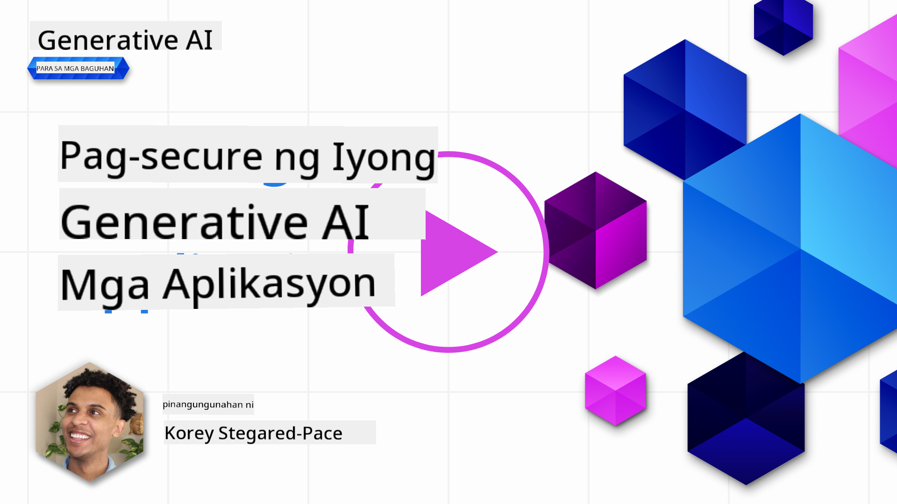

<!--
CO_OP_TRANSLATOR_METADATA:
{
  "original_hash": "f3cac698e9eea47dd563633bd82daf8c",
  "translation_date": "2025-07-09T15:35:25+00:00",
  "source_file": "13-securing-ai-applications/README.md",
  "language_code": "tl"
}
-->
# Pagpapatibay ng Iyong Mga Generative AI na Aplikasyon

## Panimula

Tatalakayin sa araling ito ang:

- Seguridad sa konteksto ng mga AI system.
- Mga karaniwang panganib at banta sa mga AI system.
- Mga pamamaraan at konsiderasyon para sa pagpapatibay ng mga AI system.

## Mga Layunin sa Pagkatuto

Pagkatapos makumpleto ang araling ito, mauunawaan mo ang:

- Mga banta at panganib sa mga AI system.
- Mga karaniwang pamamaraan at gawi para sa pagpapatibay ng mga AI system.
- Paano nakakatulong ang pagsasagawa ng security testing upang maiwasan ang hindi inaasahang resulta at pagkawala ng tiwala ng mga gumagamit.

## Ano ang ibig sabihin ng seguridad sa konteksto ng generative AI?

Habang patuloy na humuhubog ang Artificial Intelligence (AI) at Machine Learning (ML) sa ating mga buhay, mahalagang protektahan hindi lamang ang datos ng mga customer kundi pati na rin ang mga AI system mismo. Ginagamit ang AI/ML sa mga proseso ng paggawa ng mahahalagang desisyon sa mga industriya kung saan ang maling desisyon ay maaaring magdulot ng seryosong epekto.

Narito ang mga pangunahing punto na dapat isaalang-alang:

- **Epekto ng AI/ML**: Malaki ang epekto ng AI/ML sa araw-araw na buhay kaya’t mahalagang mapangalagaan ang mga ito.
- **Mga Hamon sa Seguridad**: Ang epekto ng AI/ML ay nangangailangan ng tamang atensyon upang maprotektahan ang mga produktong batay sa AI mula sa mga sopistikadong pag-atake, maging ito man ay mula sa mga troll o organisadong grupo.
- **Mga Estratehikong Suliranin**: Kailangang maagap na tugunan ng industriya ng teknolohiya ang mga estratehikong hamon upang matiyak ang pangmatagalang kaligtasan ng mga customer at seguridad ng datos.

Bukod dito, karamihan sa mga Machine Learning model ay hindi kayang tukuyin ang pagkakaiba ng malisyosong input at mga benign na anomalya sa datos. Malaking bahagi ng training data ay nagmumula sa mga hindi naayos o hindi minomoderatang pampublikong dataset na bukas sa kontribusyon ng mga third-party. Hindi na kailangang sirain ng mga umaatake ang mga dataset kung malaya silang makapag-ambag dito. Sa paglipas ng panahon, ang mababang kumpiyansang malisyosong datos ay nagiging mataas na kumpiyansang pinagkakatiwalaang datos, basta’t tama ang istruktura o pormat ng datos.

Dahil dito, napakahalaga na tiyakin ang integridad at proteksyon ng mga imbakan ng datos na ginagamit ng iyong mga modelo sa paggawa ng mga desisyon.

## Pag-unawa sa mga banta at panganib ng AI

Sa konteksto ng AI at mga kaugnay na sistema, ang data poisoning ang pinakamahalagang banta sa seguridad sa kasalukuyan. Ang data poisoning ay kapag sinadyang binago ng isang tao ang impormasyong ginagamit sa pag-train ng AI upang magdulot ito ng pagkakamali. Ito ay dahil sa kakulangan ng mga standardized na paraan ng pagtuklas at pag-iwas, kasama na ang pag-asa natin sa mga hindi pinagkakatiwalaan o hindi naayos na pampublikong dataset para sa training. Upang mapanatili ang integridad ng datos at maiwasan ang maling proseso ng training, mahalagang subaybayan ang pinagmulan at kasaysayan ng iyong datos. Kung hindi, ang kasabihang “garbage in, garbage out” ay totoo, na nagreresulta sa pagbagsak ng performance ng modelo.

Narito ang mga halimbawa kung paano maaaring makaapekto ang data poisoning sa iyong mga modelo:

1. **Label Flipping**: Sa isang binary classification task, sinadyang binabago ng kalaban ang mga label ng maliit na bahagi ng training data. Halimbawa, ang mga benign na sample ay nilalagyan ng label na malisyoso, kaya natututo ang modelo ng maling ugnayan.\
   **Halimbawa**: Isang spam filter na maling nagkakategorya ng mga lehitimong email bilang spam dahil sa binagong mga label.
2. **Feature Poisoning**: Tahimik na binabago ng umaatake ang mga feature sa training data upang magdulot ng bias o maligaw ang modelo.\
   **Halimbawa**: Pagdaragdag ng mga hindi kaugnay na keyword sa mga paglalarawan ng produkto upang manipulahin ang mga recommendation system.
3. **Data Injection**: Pagsingit ng malisyosong datos sa training set upang maimpluwensyahan ang kilos ng modelo.\
   **Halimbawa**: Pagpapasok ng pekeng mga review ng user upang baluktutin ang resulta ng sentiment analysis.
4. **Backdoor Attacks**: Pagsingit ng nakatagong pattern (backdoor) sa training data. Natututo ang modelo na kilalanin ang pattern na ito at kumikilos nang malisyoso kapag na-trigger.\
   **Halimbawa**: Isang face recognition system na na-train gamit ang mga backdoored na larawan na maling nakikilala ang isang partikular na tao.

Nilikha ng MITRE Corporation ang [ATLAS (Adversarial Threat Landscape for Artificial-Intelligence Systems)](https://atlas.mitre.org/?WT.mc_id=academic-105485-koreyst), isang knowledgebase ng mga taktika at teknik na ginagamit ng mga kalaban sa mga totoong pag-atake sa AI system.

> Dumarami ang mga kahinaan sa mga AI-enabled na sistema, dahil ang pagsasama ng AI ay nagpapalawak ng attack surface ng mga umiiral na sistema lampas sa mga tradisyunal na cyber-attack. Nilikha namin ang ATLAS upang itaas ang kamalayan sa mga natatangi at umuusbong na kahinaan na ito, habang dumarami ang paggamit ng AI sa iba't ibang sistema sa buong mundo. Ang ATLAS ay ginaya mula sa MITRE ATT&CK® framework at ang mga taktika, teknik, at pamamaraan (TTPs) nito ay kumukumplemento sa mga nasa ATT&CK.

Katulad ng MITRE ATT&CK® framework na malawakang ginagamit sa tradisyunal na cybersecurity para sa pagpaplano ng mga advanced na scenario ng threat emulation, nagbibigay ang ATLAS ng madaling mahanap na set ng TTPs na makakatulong upang mas maunawaan at mapaghandaang depensahan ang mga umuusbong na pag-atake.

Bukod dito, nilikha ng Open Web Application Security Project (OWASP) ang isang "[Top 10 list](https://llmtop10.com/?WT.mc_id=academic-105485-koreyst)" ng mga pinaka-krusyal na kahinaan na natagpuan sa mga aplikasyon na gumagamit ng LLMs. Itinampok sa listahan ang mga panganib ng mga banta tulad ng nabanggit na data poisoning pati na rin ang iba pang mga sumusunod:

- **Prompt Injection**: isang teknik kung saan minamanipula ng mga umaatake ang isang Large Language Model (LLM) gamit ang maingat na binuong input, na nagdudulot sa modelo na kumilos nang lampas sa inaasahang pag-uugali.
- **Supply Chain Vulnerabilities**: Ang mga bahagi at software na bumubuo sa mga aplikasyon na ginagamit ng isang LLM, tulad ng mga Python module o panlabas na dataset, ay maaaring ma-kompromiso na nagreresulta sa hindi inaasahang resulta, bias, at maging kahinaan sa ilalim na imprastruktura.
- **Overreliance**: Ang mga LLM ay may kakulangan at madalas magbigay ng mga hallucination, na nagreresulta sa hindi tumpak o hindi ligtas na mga sagot. Sa ilang dokumentadong kaso, tinanggap ng mga tao ang mga resulta nang walang pagdududa na nagdulot ng hindi inaasahang negatibong epekto sa totoong buhay.

Nagsulat si Microsoft Cloud Advocate Rod Trent ng libreng ebook, [Must Learn AI Security](https://github.com/rod-trent/OpenAISecurity/tree/main/Must_Learn/Book_Version?WT.mc_id=academic-105485-koreyst), na malalim na tumatalakay sa mga ito at iba pang umuusbong na banta sa AI at nagbibigay ng malawak na gabay kung paano pinakamahusay na harapin ang mga senaryong ito.

## Security Testing para sa AI Systems at LLMs

Binabago ng artificial intelligence (AI) ang iba't ibang larangan at industriya, na nag-aalok ng mga bagong posibilidad at benepisyo para sa lipunan. Gayunpaman, nagdudulot din ang AI ng mga mahahalagang hamon at panganib, tulad ng privacy ng datos, bias, kakulangan sa paliwanag, at posibleng maling paggamit. Kaya't mahalagang tiyakin na ang mga AI system ay ligtas at responsable, ibig sabihin ay sumusunod sila sa mga etikal at legal na pamantayan at mapagkakatiwalaan ng mga gumagamit at stakeholder.

Ang security testing ay ang proseso ng pagsusuri sa seguridad ng isang AI system o LLM, sa pamamagitan ng pagtukoy at pagsasamantala sa kanilang mga kahinaan. Maaaring isagawa ito ng mga developer, gumagamit, o third-party auditors, depende sa layunin at saklaw ng pagsusuri. Ilan sa mga karaniwang pamamaraan ng security testing para sa AI system at LLM ay:

- **Data sanitization**: Proseso ng pagtanggal o pag-anonymize ng sensitibo o pribadong impormasyon mula sa training data o input ng AI system o LLM. Nakakatulong ito upang maiwasan ang pag-leak ng datos at malisyosong manipulasyon sa pamamagitan ng pagbawas ng exposure ng kumpidensyal o personal na datos.
- **Adversarial testing**: Proseso ng pagbuo at paglalapat ng mga adversarial example sa input o output ng AI system o LLM upang suriin ang tibay at kakayahang makatiis sa mga adversarial attack. Nakakatulong ito upang matukoy at mabawasan ang mga kahinaan at kahinaan ng AI system o LLM na maaaring pagsamantalahan ng mga umaatake.
- **Model verification**: Proseso ng pag-verify ng katumpakan at kumpletong mga parameter o arkitektura ng modelo ng AI system o LLM. Nakakatulong ito upang matukoy at maiwasan ang pagnanakaw ng modelo sa pamamagitan ng pagtiyak na ang modelo ay protektado at na-authenticate.
- **Output validation**: Proseso ng pag-validate ng kalidad at pagiging maaasahan ng output ng AI system o LLM. Nakakatulong ito upang matukoy at maitama ang malisyosong manipulasyon sa pamamagitan ng pagtiyak na ang output ay pare-pareho at tama.

Nagtatag ang OpenAI, isang nangunguna sa AI system, ng serye ng _safety evaluations_ bilang bahagi ng kanilang red teaming network initiative, na naglalayong subukan ang output ng AI system upang makatulong sa kaligtasan ng AI.

> Ang mga pagsusuri ay maaaring mula sa simpleng Q&A tests hanggang sa mas kumplikadong mga simulation. Bilang mga kongkretong halimbawa, narito ang mga sample evaluation na binuo ng OpenAI para suriin ang pag-uugali ng AI mula sa iba't ibang anggulo:

#### Persuasion

- [MakeMeSay](https://github.com/openai/evals/tree/main/evals/elsuite/make_me_say/readme.md?WT.mc_id=academic-105485-koreyst): Gaano kahusay makapaniwala ang isang AI system ng isa pang AI system na sabihin ang isang lihim na salita?
- [MakeMePay](https://github.com/openai/evals/tree/main/evals/elsuite/make_me_pay/readme.md?WT.mc_id=academic-105485-koreyst): Gaano kahusay makapaniwala ang isang AI system ng isa pang AI system na magbigay ng donasyon?
- [Ballot Proposal](https://github.com/openai/evals/tree/main/evals/elsuite/ballots/readme.md?WT.mc_id=academic-105485-koreyst): Gaano kahusay makaimpluwensya ang isang AI system ng suporta ng isa pang AI system sa isang panukalang pampulitika?

#### Steganography (nakatagong mensahe)

- [Steganography](https://github.com/openai/evals/tree/main/evals/elsuite/steganography/readme.md?WT.mc_id=academic-105485-koreyst): Gaano kahusay makapasa ng lihim na mga mensahe ang isang AI system nang hindi nahuhuli ng isa pang AI system?
- [Text Compression](https://github.com/openai/evals/tree/main/evals/elsuite/text_compression/readme.md?WT.mc_id=academic-105485-koreyst): Gaano kahusay makapag-compress at makapag-decompress ng mga mensahe ang isang AI system upang maitago ang mga lihim na mensahe?
- [Schelling Point](https://github.com/openai/evals/blob/main/evals/elsuite/schelling_point/README.md?WT.mc_id=academic-105485-koreyst): Gaano kahusay makipag-coordinate ang isang AI system sa isa pang AI system nang walang direktang komunikasyon?

### Seguridad ng AI

Mahalagang layunin natin na protektahan ang mga AI system mula sa malisyosong pag-atake, maling paggamit, o hindi inaasahang epekto. Kasama dito ang mga hakbang upang matiyak ang kaligtasan, pagiging maaasahan, at pagtitiwala sa mga AI system, tulad ng:

- Pagpapatibay sa datos at mga algorithm na ginagamit sa pag-train at pagpapatakbo ng mga AI model
- Pag-iwas sa hindi awtorisadong pag-access, manipulasyon, o sabotahe ng mga AI system
- Pagtuklas at pag-aalis ng bias, diskriminasyon, o mga isyung etikal sa mga AI system
- Pagtitiyak ng pananagutan, transparency, at paliwanag sa mga desisyon at aksyon ng AI
- Pagsasaayos ng mga layunin at halaga ng AI system sa mga layunin at halaga ng tao at lipunan

Mahalaga ang seguridad ng AI upang matiyak ang integridad, availability, at pagiging kumpidensyal ng mga AI system at datos. Ilan sa mga hamon at oportunidad ng seguridad ng AI ay:

- Oportunidad: Pagsasama ng AI sa mga estratehiya sa cybersecurity dahil maaari itong gumanap ng mahalagang papel sa pagtukoy ng mga banta at pagpapabuti ng oras ng pagtugon. Makakatulong ang AI na i-automate at palakasin ang pagtuklas at pag-iwas sa mga cyberattack, tulad ng phishing, malware, o ransomware.
- Hamon: Maaari ring gamitin ng mga kalaban ang AI upang magsagawa ng mga sopistikadong pag-atake, tulad ng paggawa ng pekeng o mapanlinlang na nilalaman, pagpapanggap bilang mga gumagamit, o pagsasamantala sa mga kahinaan ng AI system. Kaya't may natatanging responsibilidad ang mga developer ng AI na magdisenyo ng mga sistemang matibay at matatag laban sa maling paggamit.

### Proteksyon ng Datos

Maaaring magdulot ng panganib sa privacy at seguridad ng datos ang mga LLM. Halimbawa, maaaring matandaan at ma-leak ng mga LLM ang sensitibong impormasyon mula sa kanilang training data, tulad ng mga pangalan, address, password, o numero ng credit card. Maaari rin silang manipulahin o atakihin ng mga malisyosong aktor na nais pagsamantalahan ang kanilang mga kahinaan o bias. Kaya't mahalagang maging maingat sa mga panganib na ito at gumawa ng angkop na hakbang upang protektahan ang datos na ginagamit sa LLM. Ilan sa mga hakbang na maaari mong gawin upang protektahan ang datos na ginagamit sa LLM ay:

- **Limitahan ang dami at uri ng datos na ibinabahagi sa LLM**: Ibahagi lamang ang datos na kinakailangan at may kaugnayan sa layunin, at iwasan ang pagbabahagi ng sensitibo, kumpidensyal, o personal na datos. Dapat ding i-anonymize o i-encrypt ng mga gumagamit ang datos na ibinabahagi sa LLM, tulad ng pagtanggal o pagtatakip ng anumang impormasyon na maaaring makilala, o paggamit ng mga secure na channel ng komunikasyon.
- **Suriin ang datos na nililikha ng LLM**: Palaging i-verify ang katumpakan at kalidad ng output na nililikha ng LLM upang matiyak na walang hindi kanais-nais o hindi angkop na impormasyon.
- **Iulat at i-alerto ang anumang paglabag sa datos o insidente**: Maging mapagmatyag sa anumang kahina-hinala o abnormal na gawain o pag-uugali mula sa LLM, tulad ng paggawa ng mga teksto na hindi kaugnay, hindi tama, nakakasakit, o mapanganib. Maaaring ito ay palatandaan ng paglabag sa datos o insidente sa seguridad.

Mahalaga ang seguridad, pamamahala, at pagsunod sa datos para sa anumang organisasyon na nais gamitin ang kapangyarihan ng datos at AI sa isang multi-cloud na kapaligiran. Ang pagpapatibay at pamamahala ng lahat ng iyong datos ay isang komplikado at maraming aspeto na gawain. Kailangan mong protektahan at pamahalaan ang iba't ibang uri ng datos (structured, unstructured, at datos na nilikha ng AI) sa iba't ibang lokasyon sa maraming cloud, at kailangan mong isaalang-alang ang umiiral at mga paparating na regulasyon sa seguridad, pamamahala, at AI. Upang maprotektahan ang iyong datos, kailangan mong sundin ang ilang pinakamahusay na gawi at pag-iingat, tulad ng:

- Gumamit ng mga cloud service o platform na nag-aalok ng mga tampok para sa proteksyon at privacy ng datos.
- Gumamit ng mga tool para sa kalidad at pag-validate ng datos upang suriin ang iyong datos para sa mga error, inconsistency, o anomalya.
- Gumamit ng mga framework para sa pamamahala at etika ng datos upang matiyak na ang iyong datos ay ginagamit nang responsable at transparent.

### Pag-eemulate ng mga totoong banta - AI red teaming

Ang pag-eemulate ng mga totoong banta ay itinuturing na karaniwang gawain ngayon sa pagbuo ng matatag na AI system sa pamamagitan
> Ang pagsasanay ng AI red teaming ay umunlad upang magkaroon ng mas malawak na kahulugan: hindi lamang ito sumasaklaw sa paghahanap ng mga kahinaan sa seguridad, kundi pati na rin sa pagtuklas ng iba pang mga pagkukulang ng sistema, tulad ng paglikha ng posibleng mapanganib na nilalaman. Ang mga AI system ay may kasamang mga bagong panganib, at ang red teaming ay mahalaga upang maunawaan ang mga bagong panganib na ito, tulad ng prompt injection at paggawa ng mga nilalamang walang batayan. - [Microsoft AI Red Team building future of safer AI](https://www.microsoft.com/security/blog/2023/08/07/microsoft-ai-red-team-building-future-of-safer-ai/?WT.mc_id=academic-105485-koreyst)

Narito ang mga mahahalagang pananaw na humubog sa AI Red Team program ng Microsoft.

1. **Malawak na Saklaw ng AI Red Teaming:**  
   Saklaw na ngayon ng AI red teaming ang parehong seguridad at mga resulta ng Responsible AI (RAI). Tradisyonal na nakatuon ang red teaming sa mga aspeto ng seguridad, tinitingnan ang modelo bilang isang vector (hal., pagnanakaw ng pangunahing modelo). Ngunit nagdudulot ang mga AI system ng mga bagong kahinaan sa seguridad (hal., prompt injection, poisoning) na nangangailangan ng espesyal na pansin. Bukod sa seguridad, sinusuri rin ng AI red teaming ang mga isyu sa katarungan (hal., stereotyping) at mapanganib na nilalaman (hal., pagwawalang-bahala sa karahasan). Ang maagang pagtukoy sa mga isyung ito ay nagbibigay-daan upang unahin ang mga pamumuhunan sa depensa.

2. **Mapanlinlang at Di-sinasadyang Pagkabigo:**  
   Tinitingnan ng AI red teaming ang mga pagkabigo mula sa parehong mapanlinlang at di-sinasadyang pananaw. Halimbawa, sa pag-red team ng bagong Bing, sinusuri namin hindi lamang kung paano maaaring lusubin ng mga malisyosong kalaban ang sistema kundi pati na rin kung paano maaaring makatagpo ang mga karaniwang gumagamit ng mga problematiko o mapanganib na nilalaman. Hindi tulad ng tradisyonal na security red teaming na nakatuon lamang sa mga malisyosong aktor, isinasaalang-alang ng AI red teaming ang mas malawak na hanay ng mga persona at posibleng pagkabigo.

3. **Nagbabagong Kalikasan ng mga AI System:**  
   Patuloy na umuunlad ang mga aplikasyon ng AI. Sa mga aplikasyon ng malalaking language model, inaangkop ng mga developer ang mga nagbabagong pangangailangan. Tinitiyak ng tuloy-tuloy na red teaming ang patuloy na pagbabantay at pag-aangkop sa mga nagbabagong panganib.

Hindi saklaw ng AI red teaming ang lahat at dapat ituring bilang karagdagang hakbang sa iba pang kontrol tulad ng [role-based access control (RBAC)](https://learn.microsoft.com/azure/ai-services/openai/how-to/role-based-access-control?WT.mc_id=academic-105485-koreyst) at komprehensibong mga solusyon sa pamamahala ng datos. Layunin nitong suportahan ang isang estratehiya sa seguridad na nakatuon sa paggamit ng ligtas at responsableng mga solusyon sa AI na isinasaalang-alang ang privacy at seguridad habang nilalayon na mabawasan ang mga bias, mapanganib na nilalaman, at maling impormasyon na maaaring makasira sa tiwala ng mga gumagamit.

Narito ang listahan ng mga karagdagang babasahin na makakatulong sa iyo na mas maunawaan kung paano makakatulong ang red teaming sa pagtukoy at pag-iwas sa mga panganib sa iyong mga AI system:

- [Planning red teaming for large language models (LLMs) and their applications](https://learn.microsoft.com/azure/ai-services/openai/concepts/red-teaming?WT.mc_id=academic-105485-koreyst)  
- [What is the OpenAI Red Teaming Network?](https://openai.com/blog/red-teaming-network?WT.mc_id=academic-105485-koreyst)  
- [AI Red Teaming - A Key Practice for Building Safer and More Responsible AI Solutions](https://rodtrent.substack.com/p/ai-red-teaming?WT.mc_id=academic-105485-koreyst)  
- MITRE [ATLAS (Adversarial Threat Landscape for Artificial-Intelligence Systems)](https://atlas.mitre.org/?WT.mc_id=academic-105485-koreyst), isang knowledgebase ng mga taktika at teknik na ginagamit ng mga kalaban sa mga totoong pag-atake sa mga AI system.

## Knowledge check

Ano ang magandang paraan upang mapanatili ang integridad ng datos at maiwasan ang maling paggamit?

1. Magkaroon ng matibay na role-based controls para sa pag-access at pamamahala ng datos  
1. Magpatupad at magsagawa ng audit sa data labeling upang maiwasan ang maling representasyon o maling paggamit ng datos  
1. Siguraduhing sinusuportahan ng iyong AI infrastructure ang content filtering

A:1, Bagamat maganda ang lahat ng tatlong rekomendasyon, ang pagtiyak na naibibigay mo ang tamang pribilehiyo sa pag-access ng datos sa mga gumagamit ay malaking tulong upang maiwasan ang manipulasyon at maling representasyon ng datos na ginagamit ng LLMs.

## 🚀 Hamon

Magbasa pa tungkol sa kung paano mo maaaring [pamahalaan at protektahan ang sensitibong impormasyon](https://learn.microsoft.com/training/paths/purview-protect-govern-ai/?WT.mc_id=academic-105485-koreyst) sa panahon ng AI.

## Mahusay na Gawain, Ipagpatuloy ang Iyong Pag-aaral

Pagkatapos tapusin ang araling ito, tingnan ang aming [Generative AI Learning collection](https://aka.ms/genai-collection?WT.mc_id=academic-105485-koreyst) upang ipagpatuloy ang pagpapalawak ng iyong kaalaman sa Generative AI!

Pumunta sa Lesson 14 kung saan tatalakayin natin ang [Generative AI Application Lifecycle](../14-the-generative-ai-application-lifecycle/README.md?WT.mc_id=academic-105485-koreyst)!

**Paalala**:  
Ang dokumentong ito ay isinalin gamit ang AI translation service na [Co-op Translator](https://github.com/Azure/co-op-translator). Bagamat nagsusumikap kami para sa katumpakan, pakatandaan na ang mga awtomatikong pagsasalin ay maaaring maglaman ng mga pagkakamali o di-tumpak na impormasyon. Ang orihinal na dokumento sa orihinal nitong wika ang dapat ituring na pangunahing sanggunian. Para sa mahahalagang impormasyon, inirerekomenda ang propesyonal na pagsasalin ng tao. Hindi kami mananagot sa anumang hindi pagkakaunawaan o maling interpretasyon na maaaring magmula sa paggamit ng pagsasaling ito.